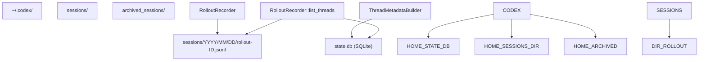
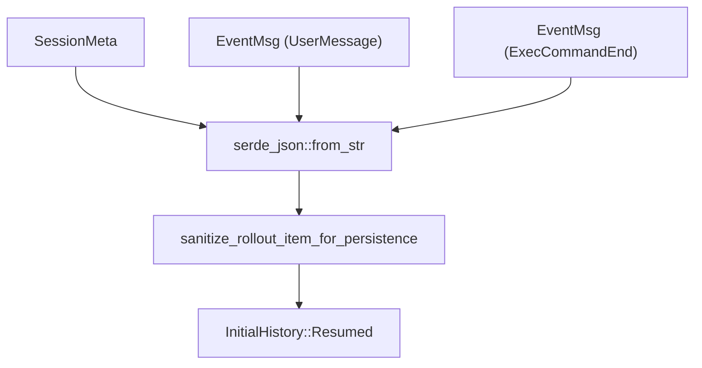

# Session Resumption and Forking

Relevant source files

-   [codex-rs/app-server/tests/common/responses.rs](https://github.com/openai/codex/blob/d807d44a/codex-rs/app-server/tests/common/responses.rs)
-   [codex-rs/app-server/tests/common/rollout.rs](https://github.com/openai/codex/blob/d807d44a/codex-rs/app-server/tests/common/rollout.rs)
-   [codex-rs/app-server/tests/suite/v2/review.rs](https://github.com/openai/codex/blob/d807d44a/codex-rs/app-server/tests/suite/v2/review.rs)
-   [codex-rs/app-server/tests/suite/v2/thread\_archive.rs](https://github.com/openai/codex/blob/d807d44a/codex-rs/app-server/tests/suite/v2/thread_archive.rs)
-   [codex-rs/app-server/tests/suite/v2/thread\_fork.rs](https://github.com/openai/codex/blob/d807d44a/codex-rs/app-server/tests/suite/v2/thread_fork.rs)
-   [codex-rs/app-server/tests/suite/v2/thread\_list.rs](https://github.com/openai/codex/blob/d807d44a/codex-rs/app-server/tests/suite/v2/thread_list.rs)
-   [codex-rs/app-server/tests/suite/v2/thread\_resume.rs](https://github.com/openai/codex/blob/d807d44a/codex-rs/app-server/tests/suite/v2/thread_resume.rs)
-   [codex-rs/app-server/tests/suite/v2/thread\_start.rs](https://github.com/openai/codex/blob/d807d44a/codex-rs/app-server/tests/suite/v2/thread_start.rs)
-   [codex-rs/app-server/tests/suite/v2/thread\_unarchive.rs](https://github.com/openai/codex/blob/d807d44a/codex-rs/app-server/tests/suite/v2/thread_unarchive.rs)
-   [codex-rs/app-server/tests/suite/v2/turn\_interrupt.rs](https://github.com/openai/codex/blob/d807d44a/codex-rs/app-server/tests/suite/v2/turn_interrupt.rs)
-   [codex-rs/app-server/tests/suite/v2/turn\_start.rs](https://github.com/openai/codex/blob/d807d44a/codex-rs/app-server/tests/suite/v2/turn_start.rs)
-   [codex-rs/core/src/rollout/list.rs](https://github.com/openai/codex/blob/d807d44a/codex-rs/core/src/rollout/list.rs)
-   [codex-rs/core/src/rollout/recorder.rs](https://github.com/openai/codex/blob/d807d44a/codex-rs/core/src/rollout/recorder.rs)
-   [codex-rs/core/src/rollout/tests.rs](https://github.com/openai/codex/blob/d807d44a/codex-rs/core/src/rollout/tests.rs)
-   [codex-rs/core/tests/suite/cli\_stream.rs](https://github.com/openai/codex/blob/d807d44a/codex-rs/core/tests/suite/cli_stream.rs)
-   [codex-rs/core/tests/suite/resume.rs](https://github.com/openai/codex/blob/d807d44a/codex-rs/core/tests/suite/resume.rs)
-   [codex-rs/core/tests/suite/resume\_warning.rs](https://github.com/openai/codex/blob/d807d44a/codex-rs/core/tests/suite/resume_warning.rs)
-   [codex-rs/core/tests/suite/rollout\_list\_find.rs](https://github.com/openai/codex/blob/d807d44a/codex-rs/core/tests/suite/rollout_list_find.rs)
-   [codex-rs/debug-client/src/client.rs](https://github.com/openai/codex/blob/d807d44a/codex-rs/debug-client/src/client.rs)
-   [codex-rs/tui/src/resume\_picker.rs](https://github.com/openai/codex/blob/d807d44a/codex-rs/tui/src/resume_picker.rs)

## Purpose and Scope

This document describes how Codex manages session continuity through resumption and forking. **Resumption** allows users to continue a previous conversation thread from where it left off, while **forking** creates a new thread that branches from a parent thread's history at a specific point. These mechanisms rely on the **Rollout System**, which persists session events as JSONL files.

For information about how sessions are initially created, see [3.1 Codex Interface and Session Lifecycle](https://github.com/openai/codex/blob/d807d44a/3.1 Codex Interface and Session Lifecycle) For details on how conversation history is persisted during active sessions, see [3.5.2 Rollout Persistence and Replay](https://github.com/openai/codex/blob/d807d44a/3.5.2 Rollout Persistence and Replay)

---

## Core Data Structures

### InitialHistory Enum

The `InitialHistory` enum determines how a session initializes its conversation history:

| Variant | Purpose | History Source | Thread ID |
| --- | --- | --- | --- |
| `New` | Fresh conversation | Empty | New UUID v7 |
| `Resumed(ResumedHistory)` | Continue existing thread | Rollout file at `~/.codex/sessions/.../{thread_id}.jsonl` | Original thread ID preserved |
| `Forked(ForkedHistory)` | Branch from parent thread | Parent's rollout file | New UUID v7 |

The `ResumedHistory` struct contains the `conversation_id`, the `history` (a `Vec<RolloutItem>` replayed from disk), and the `rollout_path` [codex-rs/core/src/rollout/recorder.rs51-53](https://github.com/openai/codex/blob/d807d44a/codex-rs/core/src/rollout/recorder.rs#L51-L53)

**Sources:** [codex-rs/core/src/rollout/recorder.rs50-58](https://github.com/openai/codex/blob/d807d44a/codex-rs/core/src/rollout/recorder.rs#L50-L58) [codex-rs/core/tests/suite/resume\_warning.rs22-73](https://github.com/openai/codex/blob/d807d44a/codex-rs/core/tests/suite/resume_warning.rs#L22-L73)

### Thread Metadata and Identification

The `ThreadId` (UUID v7) uniquely identifies each session. Metadata for these threads is managed by the `StateRuntime` (SQLite) and indexed for fast retrieval [codex-rs/core/src/rollout/list.rs19-21](https://github.com/openai/codex/blob/d807d44a/codex-rs/core/src/rollout/list.rs#L19-L21)

| Component | Code Entity | Purpose |
| --- | --- | --- |
| `ThreadId` | `codex_protocol::ThreadId` | Unique identifier used for file naming and DB keys. |
| `ThreadItem` | `codex_core::ThreadItem` | Summary info (CWD, Git branch, first message) used in pickers [codex-rs/core/src/rollout/list.rs42-74](https://github.com/openai/codex/blob/d807d44a/codex-rs/core/src/rollout/list.rs#L42-L74) |
| `RolloutRecorder` | `codex_core::RolloutRecorder` | Handles writing `RolloutItem` events to disk [codex-rs/core/src/rollout/recorder.rs70-76](https://github.com/openai/codex/blob/d807d44a/codex-rs/core/src/rollout/recorder.rs#L70-L76) |
| `SessionSource` | `codex_protocol::protocol::SessionSource` | Tracks origin: `Cli`, `Exec`, `Vscode`, etc. [codex-rs/core/src/rollout/list.rs58-59](https://github.com/openai/codex/blob/d807d44a/codex-rs/core/src/rollout/list.rs#L58-L59) |

**Sources:** [codex-rs/core/src/rollout/recorder.rs70-92](https://github.com/openai/codex/blob/d807d44a/codex-rs/core/src/rollout/recorder.rs#L70-L92) [codex-rs/core/src/rollout/list.rs42-74](https://github.com/openai/codex/blob/d807d44a/codex-rs/core/src/rollout/list.rs#L42-L74)

---

## Thread Storage and Persistence

**Diagram: Thread Storage and Metadata Structure**

Threads are stored in two coordinated layers:

1.  **SQLite State DB**: Managed by `StateRuntime`, storing `ThreadMetadata` for high-performance listing and searching [codex-rs/core/src/rollout/tests.rs60-88](https://github.com/openai/codex/blob/d807d44a/codex-rs/core/src/rollout/tests.rs#L60-L88)
2.  **Rollout Files**: JSONL files containing the full sequence of `EventMsg` and `TurnContext` items. Files are organized by date (e.g., `sessions/2025/01/05/...`) [codex-rs/core/src/rollout/list.rs114-117](https://github.com/openai/codex/blob/d807d44a/codex-rs/core/src/rollout/list.rs#L114-L117)

**Sources:** [codex-rs/core/src/rollout/recorder.rs73-75](https://github.com/openai/codex/blob/d807d44a/codex-rs/core/src/rollout/recorder.rs#L73-L75) [codex-rs/core/src/rollout/list.rs114-117](https://github.com/openai/codex/blob/d807d44a/codex-rs/core/src/rollout/list.rs#L114-L117) [codex-rs/core/src/rollout/tests.rs60-88](https://github.com/openai/codex/blob/d807d44a/codex-rs/core/src/rollout/tests.rs#L60-L88)

---

## Resumption Flow

Session resumption allows a user to pick up an existing thread. A key feature during resumption is the **Model Mismatch Warning**: if the current configuration uses a different model than the one recorded in the resumed thread's last `TurnContext`, a `WarningEvent` is emitted [codex-rs/core/tests/suite/resume\_warning.rs76-123](https://github.com/openai/codex/blob/d807d44a/codex-rs/core/tests/suite/resume_warning.rs#L76-L123)

**Diagram: Resumption and Warning Flow**

### Model Mismatch Logic

When `resume_thread_with_history` is called, the system compares the `previous_model` from the `TurnContext` in the history against the current `config.model`. If they differ, it informs the user via the `WarningEvent` [codex-rs/core/tests/suite/resume\_warning.rs105-123](https://github.com/openai/codex/blob/d807d44a/codex-rs/core/tests/suite/resume_warning.rs#L105-L123)

**Sources:** [codex-rs/core/tests/suite/resume\_warning.rs22-123](https://github.com/openai/codex/blob/d807d44a/codex-rs/core/tests/suite/resume_warning.rs#L22-L123) [codex-rs/tui/src/resume\_picker.rs122-128](https://github.com/openai/codex/blob/d807d44a/codex-rs/tui/src/resume_picker.rs#L122-L128)

---

## Forking Flow

Forking creates a new thread starting with the history of a parent. In the App Server protocol, this is triggered via `thread/start` with a `fork_from_thread_id` parameter.

### Forking in the App Server

When a fork is requested via the JSON-RPC interface:

1.  The server locates the parent rollout file using `find_thread_path_by_id_str` [codex-rs/core/tests/suite/rollout\_list\_find.rs11-14](https://github.com/openai/codex/blob/d807d44a/codex-rs/core/tests/suite/rollout_list_find.rs#L11-L14)
2.  It generates a new `ThreadId`.
3.  It initializes a new `RolloutRecorder` with `forked_from_id` set to the parent ID [codex-rs/core/src/rollout/recorder.rs80-87](https://github.com/openai/codex/blob/d807d44a/codex-rs/core/src/rollout/recorder.rs#L80-L87)
4.  The new session metadata reflects the parentage, and the initial history is populated from the parent's events.

**Sources:** [codex-rs/core/src/rollout/recorder.rs80-87](https://github.com/openai/codex/blob/d807d44a/codex-rs/core/src/rollout/recorder.rs#L80-L87) [codex-rs/core/tests/suite/rollout\_list\_find.rs11-14](https://github.com/openai/codex/blob/d807d44a/codex-rs/core/tests/suite/rollout_list_find.rs#L11-L14)

---

## The Resume Picker UI

The `resume_picker.rs` in the TUI crate provides an interactive table for session selection.

| Feature | Code Entity / Logic |
| --- | --- |
| **Pagination** | Uses `Cursor` (timestamp + UUID) for stable paging across filesystem scans [codex-rs/core/src/rollout/list.rs127-132](https://github.com/openai/codex/blob/d807d44a/codex-rs/core/src/rollout/list.rs#L127-L132) |
| **Sorting** | Toggles between `CreatedAt` and `UpdatedAt` [codex-rs/core/src/rollout/list.rs107-111](https://github.com/openai/codex/blob/d807d44a/codex-rs/core/src/rollout/list.rs#L107-L111) |
| **Filtering** | Filters by `SessionSource` (e.g., only show `Cli` sessions) and optionally by current working directory (CWD) [codex-rs/tui/src/resume\_picker.rs149-153](https://github.com/openai/codex/blob/d807d44a/codex-rs/tui/src/resume_picker.rs#L149-L153) |
| **Background Loading** | Uses `tokio::spawn` to fetch pages without blocking the TUI render loop [codex-rs/tui/src/resume\_picker.rs160-178](https://github.com/openai/codex/blob/d807d44a/codex-rs/tui/src/resume_picker.rs#L160-L178) |

**Sources:** [codex-rs/tui/src/resume\_picker.rs106-121](https://github.com/openai/codex/blob/d807d44a/codex-rs/tui/src/resume_picker.rs#L106-L121) [codex-rs/core/src/rollout/list.rs127-132](https://github.com/openai/codex/blob/d807d44a/codex-rs/core/src/rollout/list.rs#L127-L132) [codex-rs/tui/src/resume\_picker.rs160-178](https://github.com/openai/codex/blob/d807d44a/codex-rs/tui/src/resume_picker.rs#L160-L178)

---

## Event Replay and State Restoration

When a session is resumed, the `RolloutRecorder` reads the `.jsonl` file and converts lines into `RolloutItem` objects.

**Diagram: Data Flow from Disk to Session State**

### Sanitization and Persistence Modes

The `EventPersistenceMode` determines how much detail is kept in the rollout. In `Extended` mode, command outputs are truncated to `PERSISTED_EXEC_AGGREGATED_OUTPUT_MAX_BYTES` (10,000 bytes) to prevent rollout files from bloating while still allowing for meaningful replay of command results [codex-rs/core/src/rollout/recorder.rs135-160](https://github.com/openai/codex/blob/d807d44a/codex-rs/core/src/rollout/recorder.rs#L135-L160)

**Sources:** [codex-rs/core/src/rollout/recorder.rs135-160](https://github.com/openai/codex/blob/d807d44a/codex-rs/core/src/rollout/recorder.rs#L135-L160) [codex-rs/core/src/rollout/recorder.rs50-54](https://github.com/openai/codex/blob/d807d44a/codex-rs/core/src/rollout/recorder.rs#L50-L54)

---

## Implementation Details: Listing and Finding

### Thread Listing (`list_threads`)

The `RolloutRecorder::list_threads` function is the primary entry point for discovering sessions. It attempts to use the SQLite database via `StateRuntime` for efficiency but falls back to a recursive filesystem scan if the database is unavailable or stale [codex-rs/core/src/rollout/tests.rs218-220](https://github.com/openai/codex/blob/d807d44a/codex-rs/core/src/rollout/tests.rs#L218-L220)

### Finding Threads by ID or Name

-   `find_thread_path_by_id_str`: Searches for a rollout file matching a UUID. It prefers the path stored in SQLite but will scan the `sessions/` directory if needed [codex-rs/core/tests/suite/rollout\_list\_find.rs105-122](https://github.com/openai/codex/blob/d807d44a/codex-rs/core/tests/suite/rollout_list_find.rs#L105-L122)
-   `find_thread_path_by_name_str`: Uses the `session_index.jsonl` or DB to map a human-readable name (if set) to a file path [codex-rs/core/tests/suite/rollout\_list\_find.rs158-180](https://github.com/openai/codex/blob/d807d44a/codex-rs/core/tests/suite/rollout_list_find.rs#L158-L180)

**Sources:** [codex-rs/core/src/rollout/recorder.rs165-187](https://github.com/openai/codex/blob/d807d44a/codex-rs/core/src/rollout/recorder.rs#L165-L187) [codex-rs/core/tests/suite/rollout\_list\_find.rs105-122](https://github.com/openai/codex/blob/d807d44a/codex-rs/core/tests/suite/rollout_list_find.rs#L105-L122) [codex-rs/core/tests/suite/rollout\_list\_find.rs158-205](https://github.com/openai/codex/blob/d807d44a/codex-rs/core/tests/suite/rollout_list_find.rs#L158-L205)
