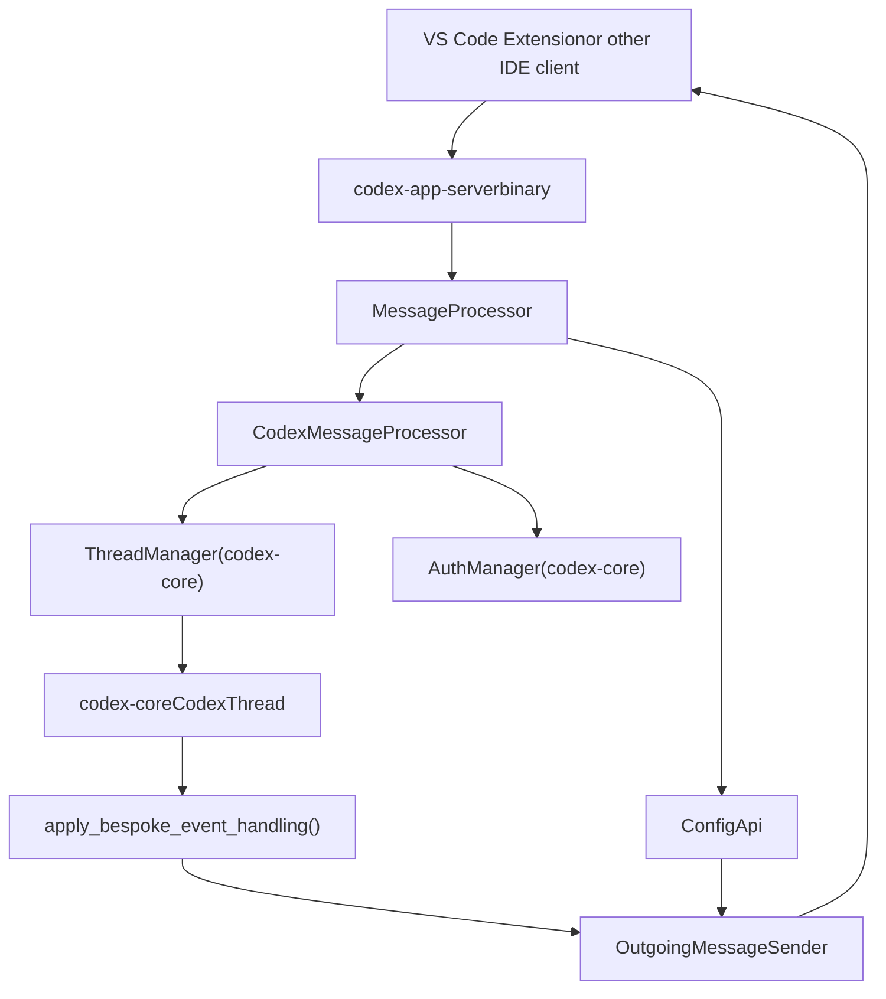
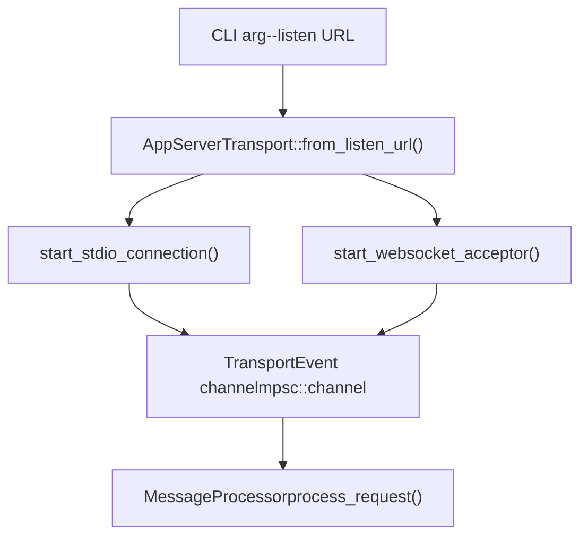
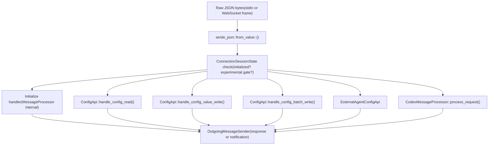

# App Server and IDE Integration

Relevant source files

-   [codex-rs/app-server-protocol/schema/json/ClientRequest.json](https://github.com/openai/codex/blob/d807d44a/codex-rs/app-server-protocol/schema/json/ClientRequest.json)
-   [codex-rs/app-server-protocol/schema/json/ServerNotification.json](https://github.com/openai/codex/blob/d807d44a/codex-rs/app-server-protocol/schema/json/ServerNotification.json)
-   [codex-rs/app-server-protocol/schema/json/codex\_app\_server\_protocol.schemas.json](https://github.com/openai/codex/blob/d807d44a/codex-rs/app-server-protocol/schema/json/codex_app_server_protocol.schemas.json)
-   [codex-rs/app-server-protocol/schema/json/codex\_app\_server\_protocol.v2.schemas.json](https://github.com/openai/codex/blob/d807d44a/codex-rs/app-server-protocol/schema/json/codex_app_server_protocol.v2.schemas.json)
-   [codex-rs/app-server-protocol/schema/typescript/ServerNotification.ts](https://github.com/openai/codex/blob/d807d44a/codex-rs/app-server-protocol/schema/typescript/ServerNotification.ts)
-   [codex-rs/app-server-protocol/schema/typescript/v2/index.ts](https://github.com/openai/codex/blob/d807d44a/codex-rs/app-server-protocol/schema/typescript/v2/index.ts)
-   [codex-rs/app-server-protocol/src/protocol/common.rs](https://github.com/openai/codex/blob/d807d44a/codex-rs/app-server-protocol/src/protocol/common.rs)
-   [codex-rs/app-server-protocol/src/protocol/v2.rs](https://github.com/openai/codex/blob/d807d44a/codex-rs/app-server-protocol/src/protocol/v2.rs)
-   [codex-rs/app-server/Cargo.toml](https://github.com/openai/codex/blob/d807d44a/codex-rs/app-server/Cargo.toml)
-   [codex-rs/app-server/README.md](https://github.com/openai/codex/blob/d807d44a/codex-rs/app-server/README.md?plain=1)
-   [codex-rs/app-server/src/bespoke\_event\_handling.rs](https://github.com/openai/codex/blob/d807d44a/codex-rs/app-server/src/bespoke_event_handling.rs)
-   [codex-rs/app-server/src/codex\_message\_processor.rs](https://github.com/openai/codex/blob/d807d44a/codex-rs/app-server/src/codex_message_processor.rs)
-   [codex-rs/app-server/src/lib.rs](https://github.com/openai/codex/blob/d807d44a/codex-rs/app-server/src/lib.rs)
-   [codex-rs/app-server/src/message\_processor.rs](https://github.com/openai/codex/blob/d807d44a/codex-rs/app-server/src/message_processor.rs)
-   [codex-rs/app-server/src/transport.rs](https://github.com/openai/codex/blob/d807d44a/codex-rs/app-server/src/transport.rs)
-   [codex-rs/app-server/tests/common/mcp\_process.rs](https://github.com/openai/codex/blob/d807d44a/codex-rs/app-server/tests/common/mcp_process.rs)
-   [codex-rs/app-server/tests/suite/v2/connection\_handling\_websocket.rs](https://github.com/openai/codex/blob/d807d44a/codex-rs/app-server/tests/suite/v2/connection_handling_websocket.rs)
-   [codex-rs/app-server/tests/suite/v2/mod.rs](https://github.com/openai/codex/blob/d807d44a/codex-rs/app-server/tests/suite/v2/mod.rs)

The `codex-app-server` crate (`codex-rs/app-server/`) is the interface Codex exposes for rich external clients such as the VS Code extension. It runs as a subprocess that communicates over a JSON-RPC 2.0 channel, providing access to all Codex agent capabilities without requiring consumers to embed Rust directly. This page covers the server binary, its transport layer, the JSON-RPC message protocol, and the runtime pipeline that translates client requests into `codex-core` operations and streams events back.

For information about the core Op/Event system that the app server delegates to, see page 2.1 (Protocol Layer). For the `ThreadManager` and session lifecycle that back these APIs, see page 3.1 (Codex Interface and Session Lifecycle). Detailed sub-pages cover specific subsystems:

-   [CodexMessageProcessor and Request Handling](/openai/codex/4.5.1-codexmessageprocessor-and-request-handling) — Document request routing, initialization handshake, and OutgoingMessageSender bidirectional communication
-   [Thread and Turn Management API](/openai/codex/4.5.2-thread-and-turn-management-api) — Explain thread/\* and turn/\* endpoints, thread status tracking, and subscription management
-   [Event Translation and Streaming](/openai/codex/4.5.3-event-translation-and-streaming) — Document apply\_bespoke\_event\_handling, event-to-notification translation, and server request patterns
-   [Config API and Layer System](/openai/codex/4.5.4-config-api-and-layer-system) — Explain config/read and config/write endpoints, profile scoping, and ConfigEditsBuilder
-   [Authentication Modes and Account Management](/openai/codex/4.5.5-authentication-modes-and-account-management) — Document auth modes (API key, ChatGPT, custom), login/logout flows, and account info retrieval

---

## Architecture Overview

**High-level component diagram**

Sources: [codex-rs/app-server/src/lib.rs20-31](https://github.com/openai/codex/blob/d807d44a/codex-rs/app-server/src/lib.rs#L20-L31) [codex-rs/app-server/src/message\_processor.rs148-157](https://github.com/openai/codex/blob/d807d44a/codex-rs/app-server/src/message_processor.rs#L148-L157) [codex-rs/app-server/src/codex\_message\_processor.rs108-114](https://github.com/openai/codex/blob/d807d44a/codex-rs/app-server/src/codex_message_processor.rs#L108-L114) [codex-rs/app-server/src/bespoke\_event\_handling.rs1-15](https://github.com/openai/codex/blob/d807d44a/codex-rs/app-server/src/bespoke_event_handling.rs#L1-L15)

---

## Transport Layer

The server supports two transports, configured with `--listen <url>`:

| Transport | Listen URL | Format | Status |
| --- | --- | --- | --- |
| stdio | `stdio://` (default) | Newline-delimited JSON (JSONL) | Stable |
| WebSocket | `ws://IP:PORT` | One JSON-RPC message per text frame | Experimental |

The `AppServerTransport` enum in [codex-rs/app-server/src/transport.rs81](https://github.com/openai/codex/blob/d807d44a/codex-rs/app-server/src/transport.rs#L81-L81) captures this. The `run_main` logic defaults to `AppServerTransport::Stdio` [codex-rs/app-server/src/lib.rs30-31](https://github.com/openai/codex/blob/d807d44a/codex-rs/app-server/src/lib.rs#L30-L31)

**Transport dispatch diagram**

Sources: [codex-rs/app-server/src/transport.rs25-31](https://github.com/openai/codex/blob/d807d44a/codex-rs/app-server/src/transport.rs#L25-L31) [codex-rs/app-server/src/lib.rs25-31](https://github.com/openai/codex/blob/d807d44a/codex-rs/app-server/src/lib.rs#L25-L31) [codex-rs/app-server/README.md20-35](https://github.com/openai/codex/blob/d807d44a/codex-rs/app-server/README.md?plain=1#L20-L35)

Backpressure is enforced with bounded channels of size `CHANNEL_CAPACITY = 128` [codex-rs/app-server/src/transport.rs25](https://github.com/openai/codex/blob/d807d44a/codex-rs/app-server/src/transport.rs#L25-L25) When ingress is saturated, new requests receive JSON-RPC error code `-32001` [codex-rs/app-server/README.md42-46](https://github.com/openai/codex/blob/d807d44a/codex-rs/app-server/README.md?plain=1#L42-L46)

The outbound path uses a dedicated router task. Messages are placed in an `OutgoingEnvelope` channel and routed per-connection via `OutgoingMessageSender` [codex-rs/app-server/src/outgoing\_message.rs14-17](https://github.com/openai/codex/blob/d807d44a/codex-rs/app-server/src/outgoing_message.rs#L14-L17)

---

## Protocol

The protocol follows JSON-RPC 2.0 with the `"jsonrpc":"2.0"` header omitted on the wire [codex-rs/app-server/README.md22-23](https://github.com/openai/codex/blob/d807d44a/codex-rs/app-server/README.md?plain=1#L22-L23) There are four message kinds:

| Direction | Kind | Description |
| --- | --- | --- |
| Client → Server | `ClientRequest` | Method call with `id`, `method`, `params` |
| Client → Server | `ClientNotification` | Client notification with `method` (e.g., `initialized`) |
| Server → Client | `JSONRPCResponse` / `JSONRPCError` | Reply to a `ClientRequest` |
| Server → Client | `ServerNotification` | Push event, no `id` |
| Server → Client | `ServerRequest` | Server-initiated call requiring client response |

`ClientRequest` is a discriminated union tagged on `method` defined in [codex-rs/app-server-protocol/src/protocol/common.rs98-111](https://github.com/openai/codex/blob/d807d44a/codex-rs/app-server-protocol/src/protocol/common.rs#L98-L111) The macro `client_request_definitions!` generates the enum and type export helpers. `ServerNotification` is analogously defined in the same file.

**Key protocol types diagram**

```mermaid
flowchart TD
    ClientRequest["ClientRequest(tagged union on method)"]
    Initialize["Initialize"]
    ThreadStart["ThreadStart => 'thread/start'"]
    TurnStart["TurnStart => 'turn/start'"]
    ConfigRead["ConfigRead => 'config/read'"]
    ServerNotification["ServerNotification"]
    TurnStartedNotif["TurnStarted"]
    ItemStartedNotif["ItemStarted"]
    ItemCompletedNotif["ItemCompleted"]
    TurnCompletedNotif["TurnCompleted"]
    ServerRequest["ServerRequest"]
    CmdApproval["CommandExecutionRequestApproval"]
    FileChangeApproval["FileChangeRequestApproval"]

    ClientRequest --> Initialize
    ClientRequest --> ThreadStart
    ClientRequest --> TurnStart
    ClientRequest --> ConfigRead
    ServerNotification --> TurnStartedNotif
    ServerNotification --> ItemStartedNotif
    ServerNotification --> ItemCompletedNotif
    ServerNotification --> TurnCompletedNotif
    ServerRequest --> CmdApproval
    ServerRequest --> FileChangeApproval
```

Sources: [codex-rs/app-server-protocol/src/protocol/common.rs205-209](https://github.com/openai/codex/blob/d807d44a/codex-rs/app-server-protocol/src/protocol/common.rs#L205-L209) [codex-rs/app-server-protocol/src/protocol/v2.rs102-128](https://github.com/openai/codex/blob/d807d44a/codex-rs/app-server-protocol/src/protocol/v2.rs#L102-L128) [codex-rs/app-server/src/codex\_message\_processor.rs34-105](https://github.com/openai/codex/blob/d807d44a/codex-rs/app-server/src/codex_message_processor.rs#L34-L105)

**Schema generation**: Clients can extract TypeScript types with `codex app-server generate-ts --out DIR` and JSON Schema with `codex app-server generate-json-schema --out DIR` [codex-rs/app-server/README.md50-55](https://github.com/openai/codex/blob/d807d44a/codex-rs/app-server/README.md?plain=1#L50-L55) The pre-generated artifacts are at [codex-rs/app-server-protocol/schema/typescript/v2/index.ts](https://github.com/openai/codex/blob/d807d44a/codex-rs/app-server-protocol/schema/typescript/v2/index.ts) and [codex-rs/app-server-protocol/schema/json/codex\_app\_server\_protocol.schemas.json](https://github.com/openai/codex/blob/d807d44a/codex-rs/app-server-protocol/schema/json/codex_app_server_protocol.schemas.json)

Sources: [codex-rs/app-server-protocol/src/protocol/common.rs166-202](https://github.com/openai/codex/blob/d807d44a/codex-rs/app-server-protocol/src/protocol/common.rs#L166-L202) [codex-rs/app-server-protocol/schema/typescript/v2/index.ts1-110](https://github.com/openai/codex/blob/d807d44a/codex-rs/app-server-protocol/schema/typescript/v2/index.ts#L1-L110)

---

## Initialization Handshake

Every connection must complete a handshake before sending other requests [codex-rs/app-server/README.md69-70](https://github.com/openai/codex/blob/d807d44a/codex-rs/app-server/README.md?plain=1#L69-L70)

> **[Mermaid sequence]**
> *(图表结构无法解析)*

Sources: [codex-rs/app-server/src/message\_processor.rs159-166](https://github.com/openai/codex/blob/d807d44a/codex-rs/app-server/src/message_processor.rs#L159-L166) [codex-rs/app-server/README.md76-85](https://github.com/openai/codex/blob/d807d44a/codex-rs/app-server/README.md?plain=1#L76-L85)

Key fields in `InitializeParams`:

-   `clientInfo.name` — used as the client identifier for OpenAI Compliance Logs [codex-rs/app-server/README.md84-87](https://github.com/openai/codex/blob/d807d44a/codex-rs/app-server/README.md?plain=1#L84-L87)
-   `capabilities.experimentalApi` — unlocks experimental methods [codex-rs/app-server/README.md117](https://github.com/openai/codex/blob/d807d44a/codex-rs/app-server/README.md?plain=1#L117-L117)
-   `capabilities.optOutNotificationMethods` — exact-match list of notification methods to suppress [codex-rs/app-server/README.md118](https://github.com/openai/codex/blob/d807d44a/codex-rs/app-server/README.md?plain=1#L118-L118)

Sending `initialize` twice on the same connection returns an `"Already initialized"` error. Any other request before `initialize` returns `"Not initialized"` [codex-rs/app-server/README.md78](https://github.com/openai/codex/blob/d807d44a/codex-rs/app-server/README.md?plain=1#L78-L78)

The `ConnectionSessionState` struct tracks per-connection session state: `initialized`, `experimental_api_enabled`, `opted_out_notification_methods`, `app_server_client_name`, and `client_version` [codex-rs/app-server/src/message\_processor.rs159-166](https://github.com/openai/codex/blob/d807d44a/codex-rs/app-server/src/message_processor.rs#L159-L166)

---

## Message Processing Pipeline

**Request routing through layers**

Sources: [codex-rs/app-server/src/message\_processor.rs148-157](https://github.com/openai/codex/blob/d807d44a/codex-rs/app-server/src/message_processor.rs#L148-L157) [codex-rs/app-server/src/codex\_message\_processor.rs1-15](https://github.com/openai/codex/blob/d807d44a/codex-rs/app-server/src/codex_message_processor.rs#L1-L15) [codex-rs/app-server/src/config\_api.rs10](https://github.com/openai/codex/blob/d807d44a/codex-rs/app-server/src/config_api.rs#L10-L10)

The `MessageProcessor` struct owns a `CodexMessageProcessor`, a `ConfigApi`, and an `ExternalAgentConfigApi` [codex-rs/app-server/src/message\_processor.rs148-157](https://github.com/openai/codex/blob/d807d44a/codex-rs/app-server/src/message_processor.rs#L148-L157) It handles `Initialize` internally; all other requests are dispatched by method name.

Experimental API gating is checked in `MessageProcessor`: if a method is experimental and not enabled for the session, it is rejected [codex-rs/app-server/src/message\_processor.rs162](https://github.com/openai/codex/blob/d807d44a/codex-rs/app-server/src/message_processor.rs#L162-L162)

---

## Core Primitives

The API is organized around three first-class entities [codex-rs/app-server/README.md57-64](https://github.com/openai/codex/blob/d807d44a/codex-rs/app-server/README.md?plain=1#L57-L64):

| Entity | Description | Key fields |
| --- | --- | --- |
| `Thread` | A conversation between user and agent | `id`, `status`, `path`, `ephemeral` |
| `Turn` | One round-trip within a thread | `id`, `status`, `items`, `error` |
| `ThreadItem` | Atomic unit within a turn | `AgentMessage`, `ShellCommand`, `FileChange`, etc. |

These types are defined in [codex-rs/app-server-protocol/src/protocol/v2.rs](https://github.com/openai/codex/blob/d807d44a/codex-rs/app-server-protocol/src/protocol/v2.rs) and correspond to the `Thread`, `Turn`, and `ThreadItem` types exported from `codex_app_server_protocol`.

---

## Thread and Turn Lifecycle

**Typical turn sequence**

> **[Mermaid sequence]**
> *(图表结构无法解析)*

Sources: [codex-rs/app-server/README.md67-75](https://github.com/openai/codex/blob/d807d44a/codex-rs/app-server/README.md?plain=1#L67-L75) [codex-rs/app-server/src/bespoke\_event\_handling.rs97-105](https://github.com/openai/codex/blob/d807d44a/codex-rs/app-server/src/bespoke_event_handling.rs#L97-L105)

### Thread operations summary

| Method | Wire name | What it does |
| --- | --- | --- |
| `ThreadStart` | `thread/start` | Create new thread; auto-subscribe caller |
| `ThreadResume` | `thread/resume` | Reopen persisted thread |
| `ThreadFork` | `thread/fork` | Copy history into new thread |
| `ThreadArchive` | `thread/archive` | Move rollout to archived directory |
| `ThreadList` | `thread/list` | Paginated list with filters |
| `ThreadCompactStart` | `thread/compact/start` | Trigger history compaction |

### Turn operations summary

| Method | Wire name | What it does |
| --- | --- | --- |
| `TurnStart` | `turn/start` | Submit user input, begin generation |
| `TurnInterrupt` | `turn/interrupt` | Cancel in-flight turn |
| `ReviewStart` | `review/start` | Run automated code reviewer |

Sources: [codex-rs/app-server/README.md126-150](https://github.com/openai/codex/blob/d807d44a/codex-rs/app-server/README.md?plain=1#L126-L150) [codex-rs/app-server/src/codex\_message\_processor.rs110-140](https://github.com/openai/codex/blob/d807d44a/codex-rs/app-server/src/codex_message_processor.rs#L110-L140)

---

## Event Translation and Streaming

The `apply_bespoke_event_handling` function in [codex-rs/app-server/src/bespoke\_event\_handling.rs1](https://github.com/openai/codex/blob/d807d44a/codex-rs/app-server/src/bespoke_event_handling.rs#L1-L1) is the boundary between `codex-core` events and JSON-RPC notifications sent to the client.

**EventMsg → ServerNotification mapping**

```mermaid
flowchart TD
    TurnStarted["EventMsg::TurnStarted"]
    TurnComplete["EventMsg::TurnComplete"]
    ExecApproval["EventMsg::ExecApprovalRequest"]
    PatchApproval["EventMsg::ApplyPatchApprovalRequest"]
    AgentMsg["EventMsg::AgentMessage*"]
    TurnStartedN["ServerNotification::TurnStarted(TurnStartedNotification)"]
    TurnCompletedN["ServerNotification::TurnCompleted(TurnCompletedNotification)"]
    CmdApprovalReq["ServerRequest::CommandExecutionRequestApproval(sent to client)"]
    FileChangeApprovalReq["ServerRequest::FileChangeRequestApproval(sent to client)"]
    AgentDelta["ServerNotification::AgentMessageDelta"]

    TurnStarted --> TurnStartedN
    TurnComplete --> TurnCompletedN
    ExecApproval --> CmdApprovalReq
    PatchApproval --> FileChangeApprovalReq
    AgentMsg --> AgentDelta
```

Sources: [codex-rs/app-server/src/bespoke\_event\_handling.rs17-105](https://github.com/openai/codex/blob/d807d44a/codex-rs/app-server/src/bespoke_event_handling.rs#L17-L105) [codex-rs/app-server-protocol/src/protocol/common.rs3-9](https://github.com/openai/codex/blob/d807d44a/codex-rs/app-server-protocol/src/protocol/common.rs#L3-L9)

Approval events are special: the server sends a `ServerRequest` (a server-initiated JSON-RPC call) to the client asking for a decision, then awaits the response before forwarding the decision back to the core [codex-rs/app-server/src/bespoke\_event\_handling.rs18-28](https://github.com/openai/codex/blob/d807d44a/codex-rs/app-server/src/bespoke_event_handling.rs#L18-L28)

---

## Config API

The `ConfigApi` handles:

| Method | Wire name | Params type | Description |
| --- | --- | --- | --- |
| `ConfigRead` | `config/read` | `ConfigReadParams` | Fetch effective layered config |
| `ConfigValueWrite` | `config/value/write` | `ConfigValueWriteParams` | Write a single key/value to user config |
| `ConfigBatchWrite` | `config/batchWrite` | `ConfigBatchWriteParams` | Apply multiple edits atomically |

Sources: [codex-rs/app-server/src/config\_api.rs10](https://github.com/openai/codex/blob/d807d44a/codex-rs/app-server/src/config_api.rs#L10-L10) [codex-rs/app-server-protocol/src/protocol/v2.rs61-72](https://github.com/openai/codex/blob/d807d44a/codex-rs/app-server-protocol/src/protocol/v2.rs#L61-L72)

---

## Authentication

The server supports multiple auth modes, coordinated by `AuthManager` from `codex-core`.

| Method | Wire name | Flow |
| --- | --- | --- |
| `LoginAccount` | `account/login/start` | Device-code OAuth for ChatGPT |
| `LoginApiKey` | `account/login/apiKey` | Store API key |
| `GetAccount` | `account/read` | Fetch account info and plan type |

The `AuthMode` enum has three values: `apiKey`, `chatgpt`, and `chatgptAuthTokens` [codex-rs/app-server-protocol/src/protocol/common.rs28-43](https://github.com/openai/codex/blob/d807d44a/codex-rs/app-server-protocol/src/protocol/common.rs#L28-L43) The `ExternalAuthRefreshBridge` handles token refresh requests for host-managed tokens [codex-rs/app-server/src/message\_processor.rs85-146](https://github.com/openai/codex/blob/d807d44a/codex-rs/app-server/src/message_processor.rs#L85-L146)

---

## Graceful Restart

The main event loop implements a `ShutdownState` machine that responds to signals [codex-rs/app-server/src/lib.rs121-131](https://github.com/openai/codex/blob/d807d44a/codex-rs/app-server/src/lib.rs#L121-L131):

1.  First signal: enter drain mode — stop accepting new connections and wait for active turns to finish [codex-rs/app-server/src/lib.rs166-171](https://github.com/openai/codex/blob/d807d44a/codex-rs/app-server/src/lib.rs#L166-L171)
2.  Second signal: force immediate shutdown [codex-rs/app-server/src/lib.rs179-183](https://github.com/openai/codex/blob/d807d44a/codex-rs/app-server/src/lib.rs#L179-L183)

Sources: [codex-rs/app-server/src/lib.rs151-201](https://github.com/openai/codex/blob/d807d44a/codex-rs/app-server/src/lib.rs#L151-L201)
