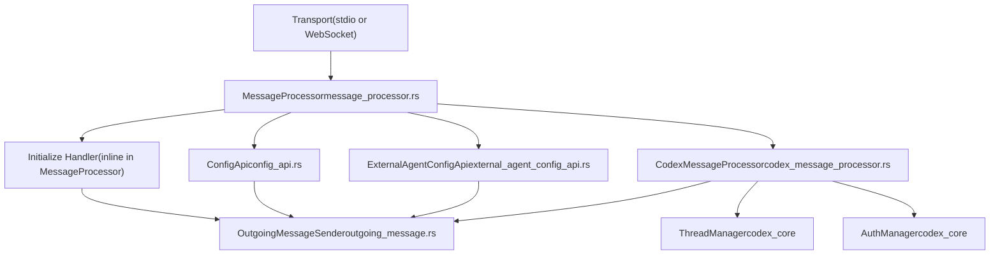
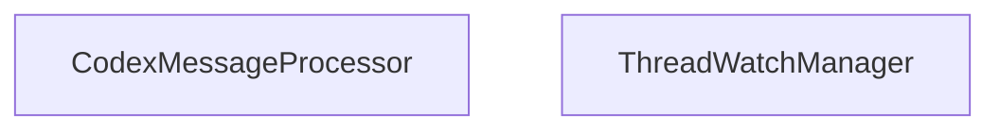

# CodexMessageProcessor and Request Handling

Relevant source files

-   [codex-rs/app-server-protocol/schema/json/ClientRequest.json](https://github.com/openai/codex/blob/d807d44a/codex-rs/app-server-protocol/schema/json/ClientRequest.json)
-   [codex-rs/app-server-protocol/schema/json/ServerNotification.json](https://github.com/openai/codex/blob/d807d44a/codex-rs/app-server-protocol/schema/json/ServerNotification.json)
-   [codex-rs/app-server-protocol/schema/json/codex\_app\_server\_protocol.schemas.json](https://github.com/openai/codex/blob/d807d44a/codex-rs/app-server-protocol/schema/json/codex_app_server_protocol.schemas.json)
-   [codex-rs/app-server-protocol/schema/json/codex\_app\_server\_protocol.v2.schemas.json](https://github.com/openai/codex/blob/d807d44a/codex-rs/app-server-protocol/schema/json/codex_app_server_protocol.v2.schemas.json)
-   [codex-rs/app-server-protocol/schema/typescript/ServerNotification.ts](https://github.com/openai/codex/blob/d807d44a/codex-rs/app-server-protocol/schema/typescript/ServerNotification.ts)
-   [codex-rs/app-server-protocol/schema/typescript/v2/index.ts](https://github.com/openai/codex/blob/d807d44a/codex-rs/app-server-protocol/schema/typescript/v2/index.ts)
-   [codex-rs/app-server-protocol/src/jsonrpc\_lite.rs](https://github.com/openai/codex/blob/d807d44a/codex-rs/app-server-protocol/src/jsonrpc_lite.rs)
-   [codex-rs/app-server-protocol/src/protocol/common.rs](https://github.com/openai/codex/blob/d807d44a/codex-rs/app-server-protocol/src/protocol/common.rs)
-   [codex-rs/app-server-protocol/src/protocol/v2.rs](https://github.com/openai/codex/blob/d807d44a/codex-rs/app-server-protocol/src/protocol/v2.rs)
-   [codex-rs/app-server/README.md](https://github.com/openai/codex/blob/d807d44a/codex-rs/app-server/README.md?plain=1)
-   [codex-rs/app-server/src/app\_server\_tracing.rs](https://github.com/openai/codex/blob/d807d44a/codex-rs/app-server/src/app_server_tracing.rs)
-   [codex-rs/app-server/src/bespoke\_event\_handling.rs](https://github.com/openai/codex/blob/d807d44a/codex-rs/app-server/src/bespoke_event_handling.rs)
-   [codex-rs/app-server/src/codex\_message\_processor.rs](https://github.com/openai/codex/blob/d807d44a/codex-rs/app-server/src/codex_message_processor.rs)
-   [codex-rs/app-server/src/message\_processor/tracing\_tests.rs](https://github.com/openai/codex/blob/d807d44a/codex-rs/app-server/src/message_processor/tracing_tests.rs)
-   [codex-rs/app-server/src/outgoing\_message.rs](https://github.com/openai/codex/blob/d807d44a/codex-rs/app-server/src/outgoing_message.rs)
-   [codex-rs/app-server/tests/common/mcp\_process.rs](https://github.com/openai/codex/blob/d807d44a/codex-rs/app-server/tests/common/mcp_process.rs)
-   [codex-rs/app-server/tests/suite/v2/mod.rs](https://github.com/openai/codex/blob/d807d44a/codex-rs/app-server/tests/suite/v2/mod.rs)
-   [codex-rs/core/src/custom\_prompts.rs](https://github.com/openai/codex/blob/d807d44a/codex-rs/core/src/custom_prompts.rs)
-   [codex-rs/protocol/src/custom\_prompts.rs](https://github.com/openai/codex/blob/d807d44a/codex-rs/protocol/src/custom_prompts.rs)
-   [codex-rs/protocol/src/parse\_command.rs](https://github.com/openai/codex/blob/d807d44a/codex-rs/protocol/src/parse_command.rs)
-   [codex-rs/protocol/src/plan\_tool.rs](https://github.com/openai/codex/blob/d807d44a/codex-rs/protocol/src/plan_tool.rs)
-   [codex-rs/tui/src/bottom\_pane/prompt\_args.rs](https://github.com/openai/codex/blob/d807d44a/codex-rs/tui/src/bottom_pane/prompt_args.rs)
-   [docs/prompts.md](https://github.com/openai/codex/blob/d807d44a/docs/prompts.md?plain=1)

This page documents `CodexMessageProcessor`, the central request dispatcher in the `codex-app-server` crate, and the full pipeline from incoming JSON-RPC bytes to domain handler invocation.

Coverage includes: the two-layer processing architecture, the `initialize` handshake, the complete `ClientRequest` dispatch table, outgoing message infrastructure, experimental API gating, and concurrency behavior.

Related pages:

-   For the thread/turn API shapes and semantics, see [4.5.2](https://github.com/openai/codex/blob/d807d44a/4.5.2)
-   For how core `EventMsg` events are translated into `ServerNotification` messages, see [4.5.3](https://github.com/openai/codex/blob/d807d44a/4.5.3)
-   For config RPC endpoints (`config/read`, `config/value/write`, etc.), see [4.5.4](https://github.com/openai/codex/blob/d807d44a/4.5.4)
-   For authentication flows and the `AuthManager`, see [4.5.5](https://github.com/openai/codex/blob/d807d44a/4.5.5)
-   For the app server's transport layer (stdio vs WebSocket), see [4.5](https://github.com/openai/codex/blob/d807d44a/4.5)

---

## Two-Layer Processing Architecture

Incoming requests pass through two layers before reaching a domain handler.

**Diagram: Request Pipeline — Source Entities**

Sources: `<FileRef file-url="https://github.com/openai/codex/blob/d807d44a/codex-rs/app-server/src/codex_message_processor.rs#L371-L481" min=371 max=481 file-path="codex-rs/app-server/src/codex_message_processor.rs">Hii</FileRef>`, `<FileRef file-url="https://github.com/openai/codex/blob/d807d44a/codex-rs/app-server/README.md?plain=1#L20-L47" min=20 max=47 file-path="codex-rs/app-server/README.md">Hii</FileRef>`

---

## `MessageProcessor`

`MessageProcessor` is the per-connection entry point. Its responsibilities:

1.  Deserialize a raw `JSONRPCRequest` to a `ClientRequest` enum value `<FileRef file-url="https://github.com/openai/codex/blob/d807d44a/codex-rs/app-server-protocol/src/protocol/common.rs#L98-L111" min=98 max=111 file-path="codex-rs/app-server-protocol/src/protocol/common.rs">Hii</FileRef>`.
2.  Handle `ClientRequest::Initialize` directly (enforcing the "must initialize first" invariant) `<FileRef file-url="https://github.com/openai/codex/blob/d807d44a/codex-rs/app-server/README.md?plain=1#L69-L75" min=69 max=75 file-path="codex-rs/app-server/README.md">Hii</FileRef>`.
3.  For all other requests: verify the connection is initialized, check experimental API gating, then route to `ConfigApi`, `ExternalAgentConfigApi`, or `CodexMessageProcessor`.

**`MessageProcessor` fields:**

| Field | Type | Role |
| --- | --- | --- |
| `outgoing` | `Arc<OutgoingMessageSender>` | Send responses and notifications `<FileRef file-url="https://github.com/openai/codex/blob/d807d44a/codex-rs/app-server/src/codex_message_processor.rs#L14-L17" min=14 max=17 file-path="codex-rs/app-server/src/codex_message_processor.rs">Hii</FileRef>` |
| `codex_message_processor` | `CodexMessageProcessor` | Handles most `ClientRequest` variants `<FileRef file-url="https://github.com/openai/codex/blob/d807d44a/codex-rs/app-server/src/codex_message_processor.rs#L371-L386" min=371 max=386 file-path="codex-rs/app-server/src/codex_message_processor.rs">Hii</FileRef>` |
| `config_api` | `ConfigApi` | Handles config read/write RPCs |
| `external_agent_config_api` | `ExternalAgentConfigApi` | Handles external-agent config migration |
| `config` | `Arc<Config>` | Config snapshot loaded at startup |
| `config_warnings` | `Arc<Vec<ConfigWarningNotification>>` | Warnings queued for emission after `initialize` |

Sources: `<FileRef file-url="https://github.com/openai/codex/blob/d807d44a/codex-rs/app-server/src/codex_message_processor.rs#L371-L481" min=371 max=481 file-path="codex-rs/app-server/src/codex_message_processor.rs">Hii</FileRef>`, `<FileRef file-url="https://github.com/openai/codex/blob/d807d44a/codex-rs/app-server/README.md?plain=1#L76-L102" min=76 max=102 file-path="codex-rs/app-server/README.md">Hii</FileRef>`

---

## Initialization Handshake

Every transport connection must send `initialize` before any other request `<FileRef file-url="https://github.com/openai/codex/blob/d807d44a/codex-rs/app-server/README.md?plain=1#L69-L75" min=69 max=75 file-path="codex-rs/app-server/README.md">Hii</FileRef>`. A second `initialize` on the same connection is rejected with `"Already initialized"`. Any other request sent before `initialize` completes is rejected with `"Not initialized"`.

**Sequence: Initialize Handshake**

Sources: `<FileRef file-url="https://github.com/openai/codex/blob/d807d44a/codex-rs/app-server/README.md?plain=1#L76-L123" min=76 max=123 file-path="codex-rs/app-server/README.md">Hii</FileRef>`, `<FileRef file-url="https://github.com/openai/codex/blob/d807d44a/codex-rs/app-server-protocol/src/protocol/common.rs#L205-L209" min=205 max=209 file-path="codex-rs/app-server-protocol/src/protocol/common.rs">Hii</FileRef>`

Key behaviors:

-   `clientInfo.name` is used to identify the client for the OpenAI Compliance Logs Platform `<FileRef file-url="https://github.com/openai/codex/blob/d807d44a/codex-rs/app-server/README.md?plain=1#L84-L87" min=84 max=87 file-path="codex-rs/app-server/README.md">Hii</FileRef>`.
-   `capabilities.experimentalApi: true` must be set to call any experimental endpoint `<FileRef file-url="https://github.com/openai/codex/blob/d807d44a/codex-rs/app-server/README.md?plain=1#L117-L117" min=117 file-path="codex-rs/app-server/README.md">Hii</FileRef>`.
-   `capabilities.optOutNotificationMethods` lists exact notification method strings to suppress for this connection `<FileRef file-url="https://github.com/openai/codex/blob/d807d44a/codex-rs/app-server/README.md?plain=1#L80-L82" min=80 max=82 file-path="codex-rs/app-server/README.md">Hii</FileRef>`.

---

## `CodexMessageProcessor`

`CodexMessageProcessor` holds all long-lived state needed to serve the bulk of the API surface.

**Diagram: CodexMessageProcessor Internal Dependencies**

Sources: `<FileRef file-url="https://github.com/openai/codex/blob/d807d44a/codex-rs/app-server/src/codex_message_processor.rs#L371-L481" min=371 max=481 file-path="codex-rs/app-server/src/codex_message_processor.rs">Hii</FileRef>`, `<FileRef file-url="https://github.com/openai/codex/blob/d807d44a/codex-rs/app-server/src/codex_message_processor.rs#L18-L19" min=18 max=19 file-path="codex-rs/app-server/src/codex_message_processor.rs">Hii</FileRef>`

`CodexMessageProcessor::new` is called from `MessageProcessor::new`, which constructs and passes in the `AuthManager`, `ThreadManager`, and shared `OutgoingMessageSender`.

---

## `process_request` Dispatch

`CodexMessageProcessor::process_request` is a `match` on `ClientRequest` that routes every variant to a dedicated async handler method.

The full dispatch table, organized by domain:

### Thread Lifecycle (V2)

| `ClientRequest` Variant | Wire Method | Handler |
| --- | --- | --- |
| `ThreadStart` | `thread/start` | `thread_start()` `<FileRef file-url="https://github.com/openai/codex/blob/d807d44a/codex-rs/app-server-protocol/src/protocol/common.rs#L242-L246" min=242 max=246 file-path="codex-rs/app-server-protocol/src/protocol/common.rs">Hii</FileRef>` |
| `ThreadResume` | `thread/resume` | `thread_resume()` `<FileRef file-url="https://github.com/openai/codex/blob/d807d44a/codex-rs/app-server-protocol/src/protocol/common.rs#L232-L235" min=232 max=235 file-path="codex-rs/app-server-protocol/src/protocol/common.rs">Hii</FileRef>` |
| `ThreadFork` | `thread/fork` | `thread_fork()` `<FileRef file-url="https://github.com/openai/codex/blob/d807d44a/codex-rs/app-server-protocol/src/protocol/common.rs#L237-L240" min=237 max=240 file-path="codex-rs/app-server-protocol/src/protocol/common.rs">Hii</FileRef>` |
| `ThreadArchive` | `thread/archive` | `thread_archive()` `<FileRef file-url="https://github.com/openai/codex/blob/d807d44a/codex-rs/app-server-protocol/src/protocol/common.rs#L253-L256" min=253 max=256 file-path="codex-rs/app-server-protocol/src/protocol/common.rs">Hii</FileRef>` |
| `ThreadSetName` | `thread/name/set` | `thread_set_name()` `<FileRef file-url="https://github.com/openai/codex/blob/d807d44a/codex-rs/app-server-protocol/src/protocol/common.rs#L263-L266" min=263 max=266 file-path="codex-rs/app-server-protocol/src/protocol/common.rs">Hii</FileRef>` |
| `ThreadCompactStart` | `thread/compact/start` | `thread_compact_start()` `<FileRef file-url="https://github.com/openai/codex/blob/d807d44a/codex-rs/app-server-protocol/src/protocol/common.rs#L268-L271" min=268 max=271 file-path="codex-rs/app-server-protocol/src/protocol/common.rs">Hii</FileRef>` |
| `ThreadList` | `thread/list` | `thread_list()` `<FileRef file-url="https://github.com/openai/codex/blob/d807d44a/codex-rs/app-server-protocol/src/protocol/common.rs#L222-L225" min=222 max=225 file-path="codex-rs/app-server-protocol/src/protocol/common.rs">Hii</FileRef>` |
| `ThreadRead` | `thread/read` | `thread_read()` `<FileRef file-url="https://github.com/openai/codex/blob/d807d44a/codex-rs/app-server-protocol/src/protocol/common.rs#L227-L230" min=227 max=230 file-path="codex-rs/app-server-protocol/src/protocol/common.rs">Hii</FileRef>` |

### Turn (V2)

| `ClientRequest` Variant | Wire Method | Handler |
| --- | --- | --- |
| `TurnStart` | `turn/start` | `turn_start()` `<FileRef file-url="https://github.com/openai/codex/blob/d807d44a/codex-rs/app-server-protocol/src/protocol/common.rs#L288-L292" min=288 max=292 file-path="codex-rs/app-server-protocol/src/protocol/common.rs">Hii</FileRef>` |
| `TurnSteer` | `turn/steer` | `turn_steer()` `<FileRef file-url="https://github.com/openai/codex/blob/d807d44a/codex-rs/app-server-protocol/src/protocol/common.rs#L294-L297" min=294 max=297 file-path="codex-rs/app-server-protocol/src/protocol/common.rs">Hii</FileRef>` |
| `TurnInterrupt` | `turn/interrupt` | `turn_interrupt()` `<FileRef file-url="https://github.com/openai/codex/blob/d807d44a/codex-rs/app-server-protocol/src/protocol/common.rs#L299-L302" min=299 max=302 file-path="codex-rs/app-server-protocol/src/protocol/common.rs">Hii</FileRef>` |

### Realtime *(experimental)*

| `ClientRequest` Variant | Wire Method | Handler |
| --- | --- | --- |
| `ThreadRealtimeStart` | `thread/realtime/start` | `thread_realtime_start()` `<FileRef file-url="https://github.com/openai/codex/blob/d807d44a/codex-rs/app-server-protocol/src/protocol/common.rs#L320-L324" min=320 max=324 file-path="codex-rs/app-server-protocol/src/protocol/common.rs">Hii</FileRef>` |
| `ThreadRealtimeStop` | `thread/realtime/stop` | `thread_realtime_stop()` `<FileRef file-url="https://github.com/openai/codex/blob/d807d44a/codex-rs/app-server-protocol/src/protocol/common.rs#L335-L338" min=335 max=338 file-path="codex-rs/app-server-protocol/src/protocol/common.rs">Hii</FileRef>` |

### Account and Auth (V2)

| `ClientRequest` Variant | Wire Method | Handler |
| --- | --- | --- |
| `LoginAccount` | `account/login/start` | `login_v2()` `<FileRef file-url="https://github.com/openai/codex/blob/d807d44a/codex-rs/app-server-protocol/src/protocol/common.rs#L468-L471" min=468 max=471 file-path="codex-rs/app-server-protocol/src/protocol/common.rs">Hii</FileRef>` |
| `LogoutAccount` | `account/logout` | `logout_v2()` `<FileRef file-url="https://github.com/openai/codex/blob/d807d44a/codex-rs/app-server-protocol/src/protocol/common.rs#L480-L483" min=480 max=483 file-path="codex-rs/app-server-protocol/src/protocol/common.rs">Hii</FileRef>` |
| `GetAccount` | `account/read` | `get_account()` `<FileRef file-url="https://github.com/openai/codex/blob/d807d44a/codex-rs/app-server-protocol/src/protocol/common.rs#L485-L488" min=485 max=488 file-path="codex-rs/app-server-protocol/src/protocol/common.rs">Hii</FileRef>` |

Sources: `<FileRef file-url="https://github.com/openai/codex/blob/d807d44a/codex-rs/app-server-protocol/src/protocol/common.rs#L205-L519" min=205 max=519 file-path="codex-rs/app-server-protocol/src/protocol/common.rs">Hii</FileRef>`, `<FileRef file-url="https://github.com/openai/codex/blob/d807d44a/codex-rs/app-server/README.md?plain=1#L124-L150" min=124 max=150 file-path="codex-rs/app-server/README.md">Hii</FileRef>`

---

## `ApiVersion`

`CodexMessageProcessor` maintains an `ApiVersion` enum used when handling events for a given listener:

| Variant | Value | Meaning |
| --- | --- | --- |
| `ApiVersion::V1` | (legacy) | Legacy conversation API |
| `ApiVersion::V2` | (default) | Current `thread/*/turn/*` API `<FileRef file-url="https://github.com/openai/codex/blob/d807d44a/codex-rs/app-server/src/bespoke_event_handling.rs#L1-L4" min=1 max=4 file-path="codex-rs/app-server/src/bespoke_event_handling.rs">Hii</FileRef>` |

This value is passed into `apply_bespoke_event_handling` `<FileRef file-url="https://github.com/openai/codex/blob/d807d44a/codex-rs/app-server/src/bespoke_event_handling.rs#L1-L4" min=1 max=4 file-path="codex-rs/app-server/src/bespoke_event_handling.rs">Hii</FileRef>`, which branches on it to emit either V1-style server requests or V2-style `ServerNotification` messages.

---

## Outgoing Message Infrastructure

**Diagram: Outgoing Message Types and Routing**

Sources: `<FileRef file-url="https://github.com/openai/codex/blob/d807d44a/codex-rs/app-server/src/outgoing_message.rs#L12-L17" min=12 max=17 file-path="codex-rs/app-server/src/outgoing_message.rs">Hii</FileRef>`, `<FileRef file-url="https://github.com/openai/codex/blob/d807d44a/codex-rs/app-server/src/bespoke_event_handling.rs#L7-L8" min=7 max=8 file-path="codex-rs/app-server/src/bespoke_event_handling.rs">Hii</FileRef>`

`OutgoingMessageSender` is `Arc`\-shared across all connections and background tasks. It routes messages to specific `ConnectionId`s or broadcasts to all.

`ThreadScopedOutgoingMessageSender` is a narrower view scoped to a `ThreadId` and a list of subscriber `ConnectionId`s. It is passed to per-thread event handlers so notifications reach only the connections subscribed to that thread.

---

## Experimental API Gating

The `client_request_definitions!` macro generates the `ClientRequest` enum and implements `ExperimentalApi` for it `<FileRef file-url="https://github.com/openai/codex/blob/d807d44a/codex-rs/app-server-protocol/src/protocol/common.rs#L85-L131" min=85 max=131 file-path="codex-rs/app-server-protocol/src/protocol/common.rs">Hii</FileRef>`. Variants annotated with `#[experimental("...")]` return a reason; stable variants return `None`.

Some requests use `inspect_params: true` instead of a method-level annotation `<FileRef file-url="https://github.com/openai/codex/blob/d807d44a/codex-rs/app-server-protocol/src/protocol/common.rs#L50-L54" min=50 max=54 file-path="codex-rs/app-server-protocol/src/protocol/common.rs">Hii</FileRef>`. In that case, experimental gating happens at the individual field level within the params struct.

Sources: `<FileRef file-url="https://github.com/openai/codex/blob/d807d44a/codex-rs/app-server-protocol/src/protocol/common.rs#L45-L165" min=45 max=165 file-path="codex-rs/app-server-protocol/src/protocol/common.rs">Hii</FileRef>`, `<FileRef file-url="https://github.com/openai/codex/blob/d807d44a/codex-rs/app-server/README.md?plain=1#L117-L123" min=117 max=123 file-path="codex-rs/app-server/README.md">Hii</FileRef>`

---

## Concurrency Model

Most handler calls in `CodexMessageProcessor::process_request` are awaited directly, serializing request processing per connection.

Per-thread listener tasks are also `tokio::spawn`'d and communicate back to the connection via `OutgoingMessageSender`. Multiple threads can stream events concurrently through their respective subscriber sets.

The server uses bounded queues between transport ingress, request processing, and outbound writes `<FileRef file-url="https://github.com/openai/codex/blob/d807d44a/codex-rs/app-server/README.md?plain=1#L42-L47" min=42 max=47 file-path="codex-rs/app-server/README.md">Hii</FileRef>`. When ingress is saturated, requests are rejected with code `-32001` ("Server overloaded").

Sources: `<FileRef file-url="https://github.com/openai/codex/blob/d807d44a/codex-rs/app-server/README.md?plain=1#L42-L47" min=42 max=47 file-path="codex-rs/app-server/README.md">Hii</FileRef>`, `<FileRef file-url="https://github.com/openai/codex/blob/d807d44a/codex-rs/app-server/src/codex_message_processor.rs#L371-L481" min=371 max=481 file-path="codex-rs/app-server/src/codex_message_processor.rs">Hii</FileRef>`
