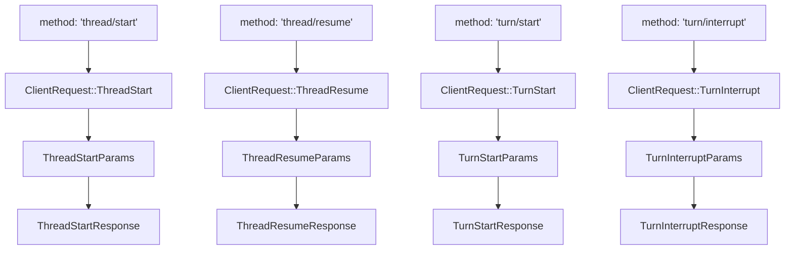
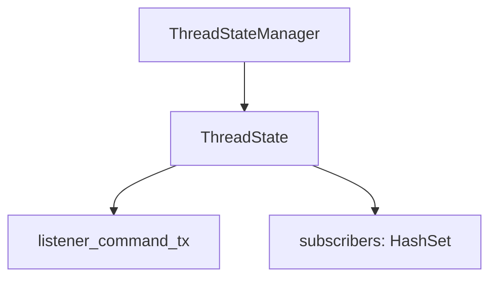

# Thread and Turn Management API

Relevant source files

-   [codex-rs/app-server-client/src/lib.rs](https://github.com/openai/codex/blob/d807d44a/codex-rs/app-server-client/src/lib.rs)
-   [codex-rs/app-server-protocol/schema/json/ClientRequest.json](https://github.com/openai/codex/blob/d807d44a/codex-rs/app-server-protocol/schema/json/ClientRequest.json)
-   [codex-rs/app-server-protocol/schema/json/ServerNotification.json](https://github.com/openai/codex/blob/d807d44a/codex-rs/app-server-protocol/schema/json/ServerNotification.json)
-   [codex-rs/app-server-protocol/schema/json/codex\_app\_server\_protocol.schemas.json](https://github.com/openai/codex/blob/d807d44a/codex-rs/app-server-protocol/schema/json/codex_app_server_protocol.schemas.json)
-   [codex-rs/app-server-protocol/schema/json/codex\_app\_server\_protocol.v2.schemas.json](https://github.com/openai/codex/blob/d807d44a/codex-rs/app-server-protocol/schema/json/codex_app_server_protocol.v2.schemas.json)
-   [codex-rs/app-server-protocol/schema/json/v2/ThreadForkResponse.json](https://github.com/openai/codex/blob/d807d44a/codex-rs/app-server-protocol/schema/json/v2/ThreadForkResponse.json)
-   [codex-rs/app-server-protocol/schema/json/v2/ThreadListResponse.json](https://github.com/openai/codex/blob/d807d44a/codex-rs/app-server-protocol/schema/json/v2/ThreadListResponse.json)
-   [codex-rs/app-server-protocol/schema/json/v2/ThreadReadResponse.json](https://github.com/openai/codex/blob/d807d44a/codex-rs/app-server-protocol/schema/json/v2/ThreadReadResponse.json)
-   [codex-rs/app-server-protocol/schema/json/v2/ThreadResumeResponse.json](https://github.com/openai/codex/blob/d807d44a/codex-rs/app-server-protocol/schema/json/v2/ThreadResumeResponse.json)
-   [codex-rs/app-server-protocol/schema/json/v2/ThreadRollbackResponse.json](https://github.com/openai/codex/blob/d807d44a/codex-rs/app-server-protocol/schema/json/v2/ThreadRollbackResponse.json)
-   [codex-rs/app-server-protocol/schema/json/v2/ThreadStartResponse.json](https://github.com/openai/codex/blob/d807d44a/codex-rs/app-server-protocol/schema/json/v2/ThreadStartResponse.json)
-   [codex-rs/app-server-protocol/schema/json/v2/ThreadStartedNotification.json](https://github.com/openai/codex/blob/d807d44a/codex-rs/app-server-protocol/schema/json/v2/ThreadStartedNotification.json)
-   [codex-rs/app-server-protocol/schema/json/v2/ThreadUnarchiveResponse.json](https://github.com/openai/codex/blob/d807d44a/codex-rs/app-server-protocol/schema/json/v2/ThreadUnarchiveResponse.json)
-   [codex-rs/app-server-protocol/schema/typescript/ServerNotification.ts](https://github.com/openai/codex/blob/d807d44a/codex-rs/app-server-protocol/schema/typescript/ServerNotification.ts)
-   [codex-rs/app-server-protocol/schema/typescript/v2/index.ts](https://github.com/openai/codex/blob/d807d44a/codex-rs/app-server-protocol/schema/typescript/v2/index.ts)
-   [codex-rs/app-server-protocol/src/protocol/common.rs](https://github.com/openai/codex/blob/d807d44a/codex-rs/app-server-protocol/src/protocol/common.rs)
-   [codex-rs/app-server-protocol/src/protocol/v2.rs](https://github.com/openai/codex/blob/d807d44a/codex-rs/app-server-protocol/src/protocol/v2.rs)
-   [codex-rs/app-server/README.md](https://github.com/openai/codex/blob/d807d44a/codex-rs/app-server/README.md?plain=1)
-   [codex-rs/app-server/src/bespoke\_event\_handling.rs](https://github.com/openai/codex/blob/d807d44a/codex-rs/app-server/src/bespoke_event_handling.rs)
-   [codex-rs/app-server/src/codex\_message\_processor.rs](https://github.com/openai/codex/blob/d807d44a/codex-rs/app-server/src/codex_message_processor.rs)
-   [codex-rs/app-server/src/in\_process.rs](https://github.com/openai/codex/blob/d807d44a/codex-rs/app-server/src/in_process.rs)
-   [codex-rs/app-server/src/thread\_state.rs](https://github.com/openai/codex/blob/d807d44a/codex-rs/app-server/src/thread_state.rs)
-   [codex-rs/app-server/tests/common/mcp\_process.rs](https://github.com/openai/codex/blob/d807d44a/codex-rs/app-server/tests/common/mcp_process.rs)
-   [codex-rs/app-server/tests/suite/v2/mod.rs](https://github.com/openai/codex/blob/d807d44a/codex-rs/app-server/tests/suite/v2/mod.rs)

This page documents the full lifecycle API for threads and turns exposed by the `codex-app-server` JSON-RPC 2.0 interface. It covers the request/response shapes for `thread/*` and `turn/*` methods, the notifications they emit, and how `CodexMessageProcessor` dispatches and handles them.

For the overall app server architecture and initialization handshake, see [4.5.1](https://github.com/openai/codex/blob/d807d44a/4.5.1) For how emitted core `EventMsg` variants are translated into `ServerNotification` messages that clients receive during turns, see [4.5.3](https://github.com/openai/codex/blob/d807d44a/4.5.3) For config read/write endpoints, see [4.5.4](https://github.com/openai/codex/blob/d807d44a/4.5.4)

---

## Core Data Model

The app server exposes three primitive objects to clients:

| Object | Description |
| --- | --- |
| **Thread** | A persisted conversation between a user and the Codex agent. Backed by a JSONL rollout file on disk. |
| **Turn** | One round-trip within a thread: a user message, model generation, and tool calls. |
| **Item** (`ThreadItem`) | The individual pieces of a turn: user messages, agent messages, shell commands, file changes, reasoning, etc. |

**Thread object fields:**

| Field | Type | Notes |
| --- | --- | --- |
| `id` | `string` | Stable thread identifier (e.g., `thr_…`) |
| `preview` | `string` | First user message text |
| `model_provider` | `string` | Provider slug (e.g., `openai`) |
| `created_at` / `updated_at` | `number` (Unix timestamp) |  |
| `status` | `ThreadStatus` | `notLoaded`, `idle`, `systemError`, or `active` |
| `path` | `string | null` | Absolute path to rollout file; `null` for ephemeral threads |
| `cwd` | `string` | Working directory at thread creation |
| `turns` | `Turn[]` | Populated when requested (e.g., via `includeTurns`) |
| `agent_nickname` / `agent_role` | `string | null` | Set for sub-agent threads spawned by `AgentControl` |

**Turn object fields:**

| Field | Type | Notes |
| --- | --- | --- |
| `id` | `string` | Stable turn identifier |
| `status` | `TurnStatus` | `inProgress`, `completed`, or `interrupted` |
| `items` | `ThreadItem[]` | Turn content items |
| `error` | `TurnError | null` | Set when the turn failed |

Sources: [codex-rs/app-server-protocol/src/protocol/v2.rs100-128](https://github.com/openai/codex/blob/d807d44a/codex-rs/app-server-protocol/src/protocol/v2.rs#L100-L128) [codex-rs/app-server/README.md51-68](https://github.com/openai/codex/blob/d807d44a/codex-rs/app-server/README.md?plain=1#L51-L68)

---

## Request/Response Architecture

All thread and turn methods are defined using the `client_request_definitions!` macro in `common.rs`, which generates the `ClientRequest` enum and associated type exports. Each variant maps a JSON-RPC method name to a params struct and a response struct.

**CodexMessageProcessor dispatch flow:**

```mermaid
flowchart TD
    Client["Client Connection"]
    MP["MessageProcessor::process_message"]
    CMP["CodexMessageProcessor::process_request"]
    TS["thread_start()(649-656)"]
    TR["thread_resume()(661-664)"]
    TF["thread_fork()(665-668)"]
    TU["thread_unsubscribe()(657-660)"]
    TA["thread_archive()(669-672)"]
    TUA["thread_unarchive()(689-692)"]
    TL["thread_list()(708-711)"]
    TLL["thread_loaded_list()(712-715)"]
    TRD["thread_read()(716-719)"]
    TSN["thread_set_name()(681-684)"]
    TMU["thread_metadata_update()(685-688)"]
    TCS["thread_compact_start()(693-696)"]
    TRB["thread_rollback()(704-707)"]
    TURN_S["turn_start()(756-763)"]
    TURN_ST["turn_steer()(764-767)"]
    TURN_I["turn_interrupt()(768-771)"]

    Client --> MP
    MP --> CMP
    CMP --> TS
    CMP --> TR
    CMP --> TF
    CMP --> TU
    CMP --> TA
    CMP --> TUA
    CMP --> TL
    CMP --> TLL
    CMP --> TRD
    CMP --> TSN
    CMP --> TMU
    CMP --> TCS
    CMP --> TRB
    CMP --> TURN_S
    CMP --> TURN_ST
    CMP --> TURN_I
```

Sources: [codex-rs/app-server/src/codex\_message\_processor.rs632-771](https://github.com/openai/codex/blob/d807d44a/codex-rs/app-server/src/codex_message_processor.rs#L632-L771) [codex-rs/app-server-protocol/src/protocol/common.rs205-360](https://github.com/openai/codex/blob/d807d44a/codex-rs/app-server-protocol/src/protocol/common.rs#L205-L360)

**Protocol type mapping (Natural Language → Code):**

Sources: [codex-rs/app-server-protocol/src/protocol/common.rs205-360](https://github.com/openai/codex/blob/d807d44a/codex-rs/app-server-protocol/src/protocol/common.rs#L205-L360) [codex-rs/app-server-protocol/src/protocol/v2.rs1-130](https://github.com/openai/codex/blob/d807d44a/codex-rs/app-server-protocol/src/protocol/v2.rs#L1-L130)

---

## Thread Lifecycle

### `thread/start`

Creates a new thread and auto-subscribes the calling connection to its event stream.

**Params (`ThreadStartParams`):**

| Field | Required | Description |
| --- | --- | --- |
| `model` | No | Model override for this thread |
| `cwd` | No | Working directory |
| `approval_policy` | No | `AskForApproval` variant |
| `sandbox` / `sandbox_policy` | No | `SandboxMode` or detailed policy |
| `personality` | No | `"friendly"`, `"pragmatic"`, or `"none"` |
| `dynamic_tools` | No | `DynamicToolSpec[]` (requires experimental API) |
| `persist_extended_history` | No | Persist richer `ThreadItem`s for non-lossy resume |
| `ephemeral` | No | When `true`, thread is in-memory only; no rollout file |

**Response (`ThreadStartResponse`):** Returns `{ thread: Thread }`.

**Side effects:**

-   Emits `thread/started` notification (`ThreadStartedNotification`) to all subscribers.
-   The returned `thread.status` reflects the thread's current state (typically `idle` immediately after creation).

Sources: [codex-rs/app-server/README.md126-127](https://github.com/openai/codex/blob/d807d44a/codex-rs/app-server/README.md?plain=1#L126-L127) [codex-rs/app-server/README.md168-226](https://github.com/openai/codex/blob/d807d44a/codex-rs/app-server/README.md?plain=1#L168-L226) [codex-rs/app-server-protocol/src/protocol/common.rs206-209](https://github.com/openai/codex/blob/d807d44a/codex-rs/app-server-protocol/src/protocol/common.rs#L206-L209)

---

### `thread/resume`

Loads an existing thread from its persisted rollout and makes it available for new turns. The calling connection is auto-subscribed.

**Params (`ThreadResumeParams`):**

| Field | Required | Description |
| --- | --- | --- |
| `thread_id` | Yes | ID of the thread to resume |
| `personality` | No | Override personality for subsequent turns |
| `persist_extended_history` | No | Same semantics as in `thread/start` |

**Response (`ThreadResumeResponse`):** Returns `{ thread: Thread }` with `thread.turns` populated from the rollout.

Sources: [codex-rs/app-server/README.md210-219](https://github.com/openai/codex/blob/d807d44a/codex-rs/app-server/README.md?plain=1#L210-L219) [codex-rs/app-server-protocol/src/protocol/common.rs210-213](https://github.com/openai/codex/blob/d807d44a/codex-rs/app-server-protocol/src/protocol/common.rs#L210-L213)

---

### `thread/fork`

Creates a new thread by copying the stored rollout history of an existing thread. The forked thread gets a new thread ID and a new rollout file.

**Params (`ThreadForkParams`):**

| Field | Required | Description |
| --- | --- | --- |
| `thread_id` | Yes | ID of the source thread |
| `persist_extended_history` | No | Same semantics as in `thread/start` |

**Response (`ThreadForkResponse`):** Returns `{ thread: Thread }` with the new thread's ID.

Sources: [codex-rs/app-server/README.md220-228](https://github.com/openai/codex/blob/d807d44a/codex-rs/app-server/README.md?plain=1#L220-L228) [codex-rs/app-server-protocol/src/protocol/common.rs214-217](https://github.com/openai/codex/blob/d807d44a/codex-rs/app-server-protocol/src/protocol/common.rs#L214-L217)

---

### `thread/archive` and `thread/unarchive`

`thread/archive` moves a thread's JSONL rollout file to the archived sessions directory on disk.

**`ThreadArchiveParams`:** `{ thread_id: string }`

**`ThreadArchiveResponse`:** `{}`

**Side effects:** Emits `thread/archived` (`ThreadArchivedNotification`). Archived threads do not appear in `thread/list` unless `archived: true` is passed.

---

`thread/unarchive` reverses the operation, moving the rollout back to the active sessions directory.

**`ThreadUnarchiveParams`:** `{ thread_id: string }`

**`ThreadUnarchiveResponse`:** `{ thread: Thread }`

Sources: [codex-rs/app-server/README.md327-347](https://github.com/openai/codex/blob/d807d44a/codex-rs/app-server/README.md?plain=1#L327-L347) [codex-rs/app-server-protocol/src/protocol/common.rs218-225](https://github.com/openai/codex/blob/d807d44a/codex-rs/app-server-protocol/src/protocol/common.rs#L218-L225)

---

### `thread/unsubscribe`

Removes the calling connection's subscription from a thread's event stream.

**`ThreadUnsubscribeParams`:** `{ thread_id: string }`

**`ThreadUnsubscribeResponse`:** `{ status: ThreadUnsubscribeStatus }`

If this was the **last** subscriber, the server unloads the thread and emits `thread/closed` (`ThreadClosedNotification`).

Sources: [codex-rs/app-server/README.md289-307](https://github.com/openai/codex/blob/d807d44a/codex-rs/app-server/README.md?plain=1#L289-L307) [codex-rs/app-server-protocol/src/protocol/common.rs245-248](https://github.com/openai/codex/blob/d807d44a/codex-rs/app-server-protocol/src/protocol/common.rs#L245-L248)

---

## Thread Status Tracking

`ThreadStatus` reflects the operational state of a loaded thread. The `thread/status/changed` notification is emitted whenever a loaded thread's status transitions.

**ThreadStatus state machine (code entities):**

**ThreadWatchManager tracking:**

-   Maintains a `HashMap<ThreadId, ThreadWatchState>` of loaded threads [codex-rs/app-server/src/thread\_status.rs18-19](https://github.com/openai/codex/blob/d807d44a/codex-rs/app-server/src/thread_status.rs#L18-L19)
-   Emits notifications via `resolve_thread_status` [codex-rs/app-server/src/thread\_status.rs19](https://github.com/openai/codex/blob/d807d44a/codex-rs/app-server/src/thread_status.rs#L19-L19)
-   `ThreadWatchActiveGuard` automatically clears active state on drop.

Sources: [codex-rs/app-server/src/thread\_status.rs1-100](https://github.com/openai/codex/blob/d807d44a/codex-rs/app-server/src/thread_status.rs#L1-L100) [codex-rs/app-server/src/bespoke\_event\_handling.rs13-14](https://github.com/openai/codex/blob/d807d44a/codex-rs/app-server/src/bespoke_event_handling.rs#L13-L14)

---

## Turn Operations

### `turn/start`

Submits user input to a thread and begins Codex generation. The turn is created immediately; the `turn/started` notification fires when the model call actually begins.

**Key `TurnStartParams` fields:**

| Field | Required | Description |
| --- | --- | --- |
| `thread_id` | Yes | Target thread |
| `input` | Yes | `UserInput[]` — text, image, skill, or mention items |
| `cwd` | No | Override working directory for this turn |
| `model` | No | Model override |
| `output_schema` | No | JSON Schema to constrain final message |

**`TurnStartResponse`:** Returns `{ turn: Turn }` with `turn.status = "inProgress"`.

Sources: [codex-rs/app-server/README.md365-445](https://github.com/openai/codex/blob/d807d44a/codex-rs/app-server/README.md?plain=1#L365-L445) [codex-rs/app-server-protocol/src/protocol/common.rs253-256](https://github.com/openai/codex/blob/d807d44a/codex-rs/app-server-protocol/src/protocol/common.rs#L253-L256)

---

### `turn/steer`

Appends additional user input to an already in-flight turn without starting a new turn.

**`TurnSteerParams`:** `{ thread_id, input, expected_turn_id }`

**`TurnSteerResponse`:** `{ turn_id: string }`

Sources: [codex-rs/app-server/README.md473-487](https://github.com/openai/codex/blob/d807d44a/codex-rs/app-server/README.md?plain=1#L473-L487) [codex-rs/app-server-protocol/src/protocol/common.rs257-260](https://github.com/openai/codex/blob/d807d44a/codex-rs/app-server-protocol/src/protocol/common.rs#L257-L260)

---

### `turn/interrupt`

Requests cancellation of an in-flight turn. The actual turn completion with `status: "interrupted"` arrives later via notification.

**`TurnInterruptParams`:** `{ thread_id: string, turn_id: string }`

**`TurnInterruptResponse`:** `{}`

Sources: [codex-rs/app-server/README.md447-459](https://github.com/openai/codex/blob/d807d44a/codex-rs/app-server/README.md?plain=1#L447-L459) [codex-rs/app-server-protocol/src/protocol/common.rs261-264](https://github.com/openai/codex/blob/d807d44a/codex-rs/app-server-protocol/src/protocol/common.rs#L261-L264)

---

## Subscription and State Management

### ThreadState and Listener Loop

Each thread in memory is managed by a `ThreadState` which tracks subscribers and active turn status.

**Subscription flow:**

1.  `thread_start` or `thread_resume` calls `ensure_conversation_listener` [codex-rs/app-server/src/codex\_message\_processor.rs1094](https://github.com/openai/codex/blob/d807d44a/codex-rs/app-server/src/codex_message_processor.rs#L1094-L1094)
2.  `ThreadState::add_subscriber(connection_id)` is called [codex-rs/app-server/src/thread\_state.rs11](https://github.com/openai/codex/blob/d807d44a/codex-rs/app-server/src/thread_state.rs#L11-L11)
3.  Event processing is handled in `apply_bespoke_event_handling` [codex-rs/app-server/src/bespoke\_event\_handling.rs1](https://github.com/openai/codex/blob/d807d44a/codex-rs/app-server/src/bespoke_event_handling.rs#L1-L1)

Sources: [codex-rs/app-server/src/thread\_state.rs1-100](https://github.com/openai/codex/blob/d807d44a/codex-rs/app-server/src/thread_state.rs#L1-L100) [codex-rs/app-server/src/codex\_message\_processor.rs1094-1100](https://github.com/openai/codex/blob/d807d44a/codex-rs/app-server/src/codex_message_processor.rs#L1094-L1100)

---

## Notifications Reference

| Notification Method | Struct | Trigger |
| --- | --- | --- |
| `thread/started` | `ThreadStartedNotification` | Thread creation/fork [codex-rs/app-server/src/codex\_message\_processor.rs113-128](https://github.com/openai/codex/blob/d807d44a/codex-rs/app-server/src/codex_message_processor.rs#L113-L128) |
| `thread/closed` | `ThreadClosedNotification` | Last subscriber removed [codex-rs/app-server/src/codex\_message\_processor.rs116](https://github.com/openai/codex/blob/d807d44a/codex-rs/app-server/src/codex_message_processor.rs#L116-L116) |
| `turn/started` | `TurnStartedNotification` | `EventMsg::TurnStarted` [codex-rs/app-server/src/bespoke\_event\_handling.rs104](https://github.com/openai/codex/blob/d807d44a/codex-rs/app-server/src/bespoke_event_handling.rs#L104-L104) |
| `turn/completed` | `TurnCompletedNotification` | `EventMsg::TurnComplete` [codex-rs/app-server/src/bespoke\_event\_handling.rs98](https://github.com/openai/codex/blob/d807d44a/codex-rs/app-server/src/bespoke_event_handling.rs#L98-L98) |
| `item/agentMessage/delta` | `AgentMessageDeltaNotification` | Model streaming [codex-rs/app-server/src/bespoke\_event\_handling.rs17](https://github.com/openai/codex/blob/d807d44a/codex-rs/app-server/src/bespoke_event_handling.rs#L17-L17) |

Sources: [codex-rs/app-server/src/bespoke\_event\_handling.rs1-110](https://github.com/openai/codex/blob/d807d44a/codex-rs/app-server/src/bespoke_event_handling.rs#L1-L110) [codex-rs/app-server/src/codex\_message\_processor.rs100-140](https://github.com/openai/codex/blob/d807d44a/codex-rs/app-server/src/codex_message_processor.rs#L100-L140)
