# Event Translation and Streaming

Relevant source files

-   [codex-rs/app-server-protocol/schema/json/ClientRequest.json](https://github.com/openai/codex/blob/d807d44a/codex-rs/app-server-protocol/schema/json/ClientRequest.json)
-   [codex-rs/app-server-protocol/schema/json/ServerNotification.json](https://github.com/openai/codex/blob/d807d44a/codex-rs/app-server-protocol/schema/json/ServerNotification.json)
-   [codex-rs/app-server-protocol/schema/json/codex\_app\_server\_protocol.schemas.json](https://github.com/openai/codex/blob/d807d44a/codex-rs/app-server-protocol/schema/json/codex_app_server_protocol.schemas.json)
-   [codex-rs/app-server-protocol/schema/json/codex\_app\_server\_protocol.v2.schemas.json](https://github.com/openai/codex/blob/d807d44a/codex-rs/app-server-protocol/schema/json/codex_app_server_protocol.v2.schemas.json)
-   [codex-rs/app-server-protocol/schema/typescript/ServerNotification.ts](https://github.com/openai/codex/blob/d807d44a/codex-rs/app-server-protocol/schema/typescript/ServerNotification.ts)
-   [codex-rs/app-server-protocol/schema/typescript/v2/index.ts](https://github.com/openai/codex/blob/d807d44a/codex-rs/app-server-protocol/schema/typescript/v2/index.ts)
-   [codex-rs/app-server-protocol/src/export.rs](https://github.com/openai/codex/blob/d807d44a/codex-rs/app-server-protocol/src/export.rs)
-   [codex-rs/app-server-protocol/src/lib.rs](https://github.com/openai/codex/blob/d807d44a/codex-rs/app-server-protocol/src/lib.rs)
-   [codex-rs/app-server-protocol/src/protocol/common.rs](https://github.com/openai/codex/blob/d807d44a/codex-rs/app-server-protocol/src/protocol/common.rs)
-   [codex-rs/app-server-protocol/src/protocol/v1.rs](https://github.com/openai/codex/blob/d807d44a/codex-rs/app-server-protocol/src/protocol/v1.rs)
-   [codex-rs/app-server-protocol/src/protocol/v2.rs](https://github.com/openai/codex/blob/d807d44a/codex-rs/app-server-protocol/src/protocol/v2.rs)
-   [codex-rs/app-server/README.md](https://github.com/openai/codex/blob/d807d44a/codex-rs/app-server/README.md?plain=1)
-   [codex-rs/app-server/src/bespoke\_event\_handling.rs](https://github.com/openai/codex/blob/d807d44a/codex-rs/app-server/src/bespoke_event_handling.rs)
-   [codex-rs/app-server/src/codex\_message\_processor.rs](https://github.com/openai/codex/blob/d807d44a/codex-rs/app-server/src/codex_message_processor.rs)
-   [codex-rs/app-server/tests/common/mcp\_process.rs](https://github.com/openai/codex/blob/d807d44a/codex-rs/app-server/tests/common/mcp_process.rs)
-   [codex-rs/app-server/tests/suite/v2/initialize.rs](https://github.com/openai/codex/blob/d807d44a/codex-rs/app-server/tests/suite/v2/initialize.rs)
-   [codex-rs/app-server/tests/suite/v2/mod.rs](https://github.com/openai/codex/blob/d807d44a/codex-rs/app-server/tests/suite/v2/mod.rs)
-   [codex-rs/protocol/src/account.rs](https://github.com/openai/codex/blob/d807d44a/codex-rs/protocol/src/account.rs)

## Purpose and Scope

This page documents the **BespokeEventHandler** system that translates core codex events into JSON-RPC notifications for IDE clients connected to the app server. When a thread executes (running model inference, executing tools, applying patches), the core emits a stream of `EventMsg` variants. The app server must translate these into client-facing `ServerNotification` messages that conform to the protocol schema.

For information about the request handling and thread/turn management APIs, see [Thread and Turn Management API (4.5.2)](https://github.com/openai/codex/blob/d807d44a/Thread and Turn Management API (4.5.2)) For the overall app server architecture, see [CodexMessageProcessor and Request Handling (4.5.1)](https://github.com/openai/codex/blob/d807d44a/CodexMessageProcessor and Request Handling (4.5.1))

---

## Overview of Event Translation Flow

The event translation system bridges the gap between the core's internal event model and the client-facing protocol. Events flow from `codex-core` through the app server's translation layer to IDE clients.

**Event Translation Pipeline**

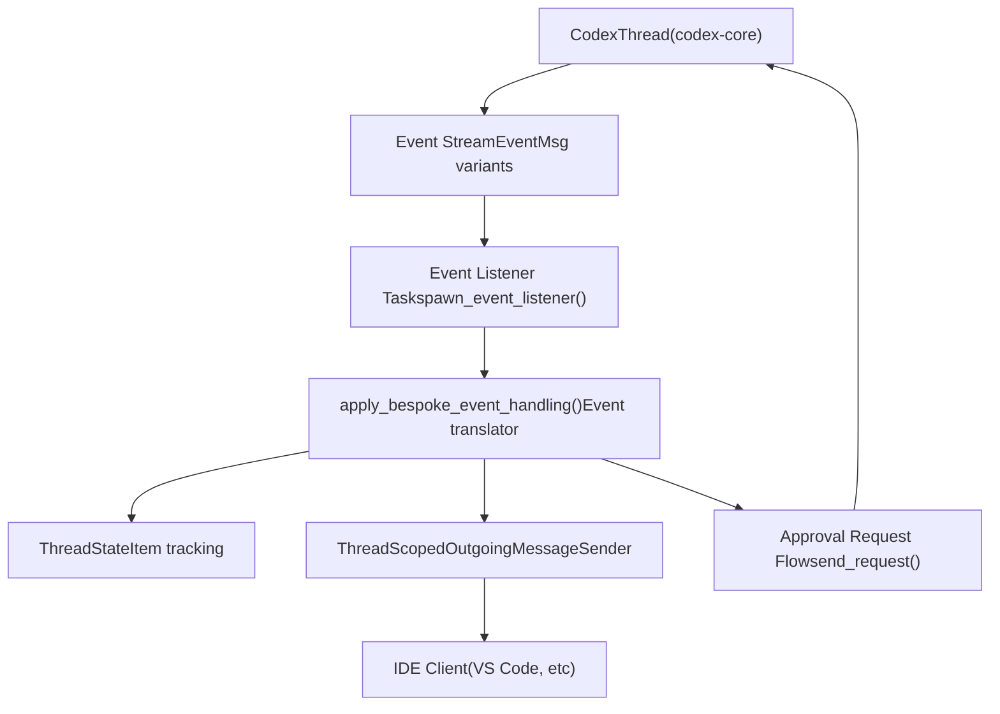
**Sources:** [codex-rs/app-server/src/bespoke\_event\_handling.rs172-310](https://github.com/openai/codex/blob/d807d44a/codex-rs/app-server/src/bespoke_event_handling.rs#L172-L310) [codex-rs/app-server/src/codex\_message\_processor.rs396-409](https://github.com/openai/codex/blob/d807d44a/codex-rs/app-server/src/codex_message_processor.rs#L396-L409)

---

## Core Translation Function

The `apply_bespoke_event_handling` function in [codex-rs/app-server/src/bespoke\_event\_handling.rs172-183](https://github.com/openai/codex/blob/d807d44a/codex-rs/app-server/src/bespoke_event_handling.rs#L172-L183) is the central dispatch point. It takes an `Event` (containing `id: TurnId` and `msg: EventMsg`), does a `match msg { ... }`, and calls `outgoing.send_server_notification(...)` or `outgoing.send_request(...)` as needed.

**`apply_bespoke_event_handling` — Dispatch Overview**

```mermaid
flowchart TD
    ev["Event {id, msg: EventMsg}"]
    fn["apply_bespoke_event_handling()"]
    ts["EventMsg::TurnStarted"]
    tc["EventMsg::TurnComplete"]
    mr["EventMsg::ModelReroute"]
    paa["EventMsg::ApplyPatchApprovalRequest"]
    ear["EventMsg::ExecApprovalRequest"]
    mtcb["EventMsg::McpToolCallBegin"]
    mtce["EventMsg::McpToolCallEnd"]
    dtcr["EventMsg::DynamicToolCallRequest"]
    rui["EventMsg::RequestUserInput"]
    rcs["EventMsg::RealtimeConversationStarted"]
    rcr["EventMsg::RealtimeConversationRealtime"]
    tsn["ServerNotification::TurnStarted"]
    tcn["ServerNotification::TurnCompleted"]
    mrn["ServerNotification::ModelRerouted"]
    istn["ServerNotification::ItemStarted"]
    ictn["ServerNotification::ItemCompleted"]
    sreq["ServerRequest (approval/input)"]

    ev --> fn
    fn --> ts
    ts --> tsn
    fn --> tc
    tc --> tcn
    fn --> mr
    mr --> mrn
    fn --> paa
    paa --> istn
    fn --> paa
    paa --> sreq
    fn --> ear
    ear --> istn
    fn --> ear
    ear --> sreq
    fn --> mtcb
    mtcb --> istn
    fn --> mtce
    mtce --> ictn
    fn --> dtcr
    dtcr --> sreq
    fn --> rui
    rui --> sreq
    fn --> rcs
    rcs --> tsn
    fn --> rcr
    rcr --> istn
```
**Key `EventMsg` → `ServerNotification` mappings**

| `EventMsg` Variant | Output Notification(s) | API | Notes |
| --- | --- | --- | --- |
| `TurnStarted` | `TurnStarted` | V2 | Emits active turn snapshot |
| `TurnComplete` | `TurnCompleted` | V1+V2 | Calls `handle_turn_complete()` |
| `Warning` | *(dropped)* | — | No client notification |
| `ModelReroute` | `ModelRerouted` | V2 |  |
| `ApplyPatchApprovalRequest` | `ItemStarted` + `ServerRequest::FileChangeRequestApproval` | V1/V2 | Bidirectional: awaits client decision |
| `ExecApprovalRequest` | `ItemStarted` + `ServerRequest::CommandExecutionRequestApproval` | V1/V2 | Bidirectional: awaits client decision |
| `McpToolCallBegin` | `ItemStarted` (McpToolCall) | V2 | `construct_mcp_tool_call_notification()` |
| `McpToolCallEnd` | `ItemCompleted` (McpToolCall) | V2 | `construct_mcp_tool_call_end_notification()` |
| `DynamicToolCallRequest` | `ServerRequest::DynamicToolCall` | V2 | Client executes tool, returns result |
| `RequestUserInput` | `ServerRequest::ToolRequestUserInput` | V2 | Experimental |
| `RealtimeConversationStarted` | `ThreadRealtimeStarted` | V2 | Experimental |
| `RealtimeConversationRealtime` | `ThreadRealtimeOutputAudioDelta` / `ThreadRealtimeItemAdded` / `ThreadRealtimeError` | V2 | Per sub-event type |
| `RealtimeConversationClosed` | `ThreadRealtimeClosed` | V2 |  |

**Sources:** [codex-rs/app-server/src/bespoke\_event\_handling.rs172-480](https://github.com/openai/codex/blob/d807d44a/codex-rs/app-server/src/bespoke_event_handling.rs#L172-L480)

---

## API Version Handling

The translation layer supports both V1 (legacy) and V2 APIs simultaneously. The `ApiVersion` enum defined in [codex-rs/app-server/src/codex\_message\_processor.rs388-393](https://github.com/openai/codex/blob/d807d44a/codex-rs/app-server/src/codex_message_processor.rs#L388-L393) controls which protocol structures are used. `V2` is the default.

| `ApiVersion` | Item Lifecycle | Approval Pattern | Example Types |
| --- | --- | --- | --- |
| `V1` | Implicit (legacy) | Direct approval params to client | `ApplyPatchApprovalParams`, `ExecCommandApprovalParams` |
| `V2` | Explicit (`ItemStarted` / delta / `ItemCompleted`) | `item_id`\-scoped request/response | `ItemStartedNotification`, `FileChangeRequestApprovalParams` |

**V1 vs V2 Translation Example - File Changes**

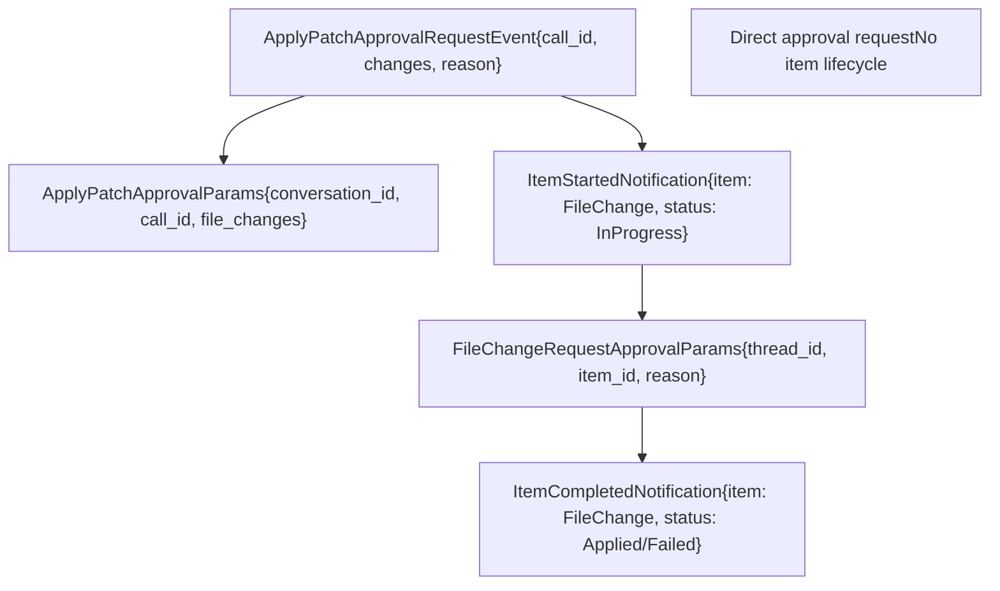
**Sources:** [codex-rs/app-server/src/bespoke\_event\_handling.rs130-199](https://github.com/openai/codex/blob/d807d44a/codex-rs/app-server/src/bespoke_event_handling.rs#L130-L199) [codex-rs/app-server/src/codex\_message\_processor.rs284-321](https://github.com/openai/codex/blob/d807d44a/codex-rs/app-server/src/codex_message_processor.rs#L284-L321)

---

## Item Lifecycle Pattern

The V2 API uses a structured item lifecycle where each conceptual operation (file change, command execution, agent message) is represented as a `ThreadItem` with distinct lifecycle events.

**Item Lifecycle States**

> **[Mermaid stateDiagram]**
> *(图表结构无法解析)*

**ThreadItem Types with Lifecycle**

| Item Type | Started Event | Delta Events | Completed Event | Status Field |
| --- | --- | --- | --- | --- |
| `AgentMessage` | `item/started` | `item/agentMessage/delta` | `item/completed` | N/A (text content) |
| `CommandExecution` | `item/started` | `item/commandExecution/outputDelta` | `item/completed` | `CommandExecutionStatus` |
| `FileChange` | `item/started` | `item/fileChange/outputDelta` | `item/completed` | `PatchApplyStatus` |
| `McpToolCall` | `item/started` | N/A | `item/completed` | `McpToolCallStatus` |
| `CollabAgentToolCall` | `item/started` | N/A | `item/completed` | `CollabAgentToolCallStatus` |

**Sources:** [codex-rs/app-server/src/bespoke\_event\_handling.rs160-174](https://github.com/openai/codex/blob/d807d44a/codex-rs/app-server/src/bespoke_event_handling.rs#L160-L174) [codex-rs/app-server-protocol/src/protocol/v2.rs823-1165](https://github.com/openai/codex/blob/d807d44a/codex-rs/app-server-protocol/src/protocol/v2.rs#L823-L1165)

---

## Command Execution Event Translation

Command execution (shell commands) follows a complex translation pattern because the core uses tool call IDs while the protocol uses item IDs.

**Command Execution Translation Flow**

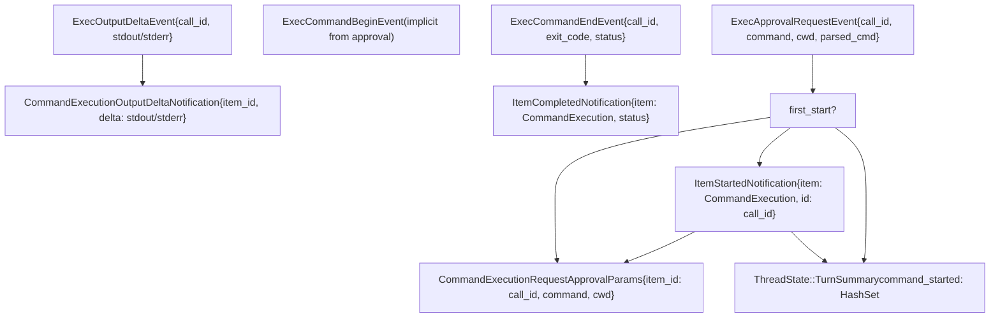
**Sources:** [codex-rs/app-server/src/bespoke\_event\_handling.rs406-505](https://github.com/openai/codex/blob/d807d44a/codex-rs/app-server/src/bespoke_event_handling.rs#L406-L505) [codex-rs/app-server/src/thread\_state.rs1-100](https://github.com/openai/codex/blob/d807d44a/codex-rs/app-server/src/thread_state.rs#L1-L100)

---

## Approval Request Handling

Approval requests are bidirectional: the server sends a request to the client, which responds with a decision that gets forwarded back to the core as an `Op`.

**Approval Request/Response Cycle**

> **[Mermaid sequence]**
> *(图表结构无法解析)*

**`CommandExecutionApprovalDecision` → core `ReviewDecision` mapping**

The conversion is defined in [codex-rs/app-server-protocol/src/protocol/v2.rs768-787](https://github.com/openai/codex/blob/d807d44a/codex-rs/app-server-protocol/src/protocol/v2.rs#L768-L787)

| `CommandExecutionApprovalDecision` | Core `ReviewDecision` | Behavior |
| --- | --- | --- |
| `Accept` | `ReviewDecision::Approved` | Run command once |
| `AcceptForSession` | `ReviewDecision::ApprovedForSession` | Trust for session |
| `AcceptWithExecpolicyAmendment` | `ReviewDecision::ApprovedExecpolicyAmendment` | Update exec policy file |
| `ApplyNetworkPolicyAmendment` | `ReviewDecision::NetworkPolicyAmendment` | Apply persistent network rule |
| `Decline` | `ReviewDecision::Denied` | Skip command, continue turn |
| `Cancel` | `ReviewDecision::Abort` | Skip command, interrupt turn |

**Sources:** [codex-rs/app-server/src/bespoke\_event\_handling.rs406-453](https://github.com/openai/codex/blob/d807d44a/codex-rs/app-server/src/bespoke_event_handling.rs#L406-L453) [codex-rs/app-server-protocol/src/protocol/v2.rs768-787](https://github.com/openai/codex/blob/d807d44a/codex-rs/app-server-protocol/src/protocol/v2.rs#L768-L787)

---

## File Change Event Translation

File changes (`apply_patch` operations) are translated similarly to command execution but with different item types and approval params.

**File Change Translation Details**

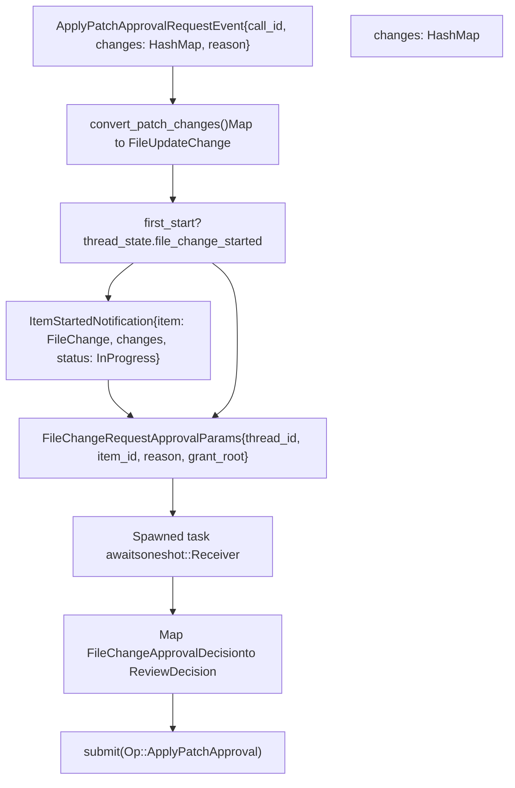
**FileUpdateChange Structure**

The protocol exposes file changes as structured updates with kind, path, and line ranges:

-   `kind`: `"create"`, `"update"`, `"delete"`
-   `path`: Absolute path to the file
-   `fromLines`: Optional line range for updates/deletes
-   `content`: New content for creates/updates

**Sources:** [codex-rs/app-server/src/bespoke\_event\_handling.rs125-199](https://github.com/openai/codex/blob/d807d44a/codex-rs/app-server/src/bespoke_event_handling.rs#L125-L199) [codex-rs/app-server/src/bespoke\_event\_handling.rs717-808](https://github.com/openai/codex/blob/d807d44a/codex-rs/app-server/src/bespoke_event_handling.rs#L717-L808)

---

## MCP Tool Call Translation

MCP (Model Context Protocol) tool calls are handled by constructing item notifications from begin/end events.

**MCP Tool Call Event Flow**

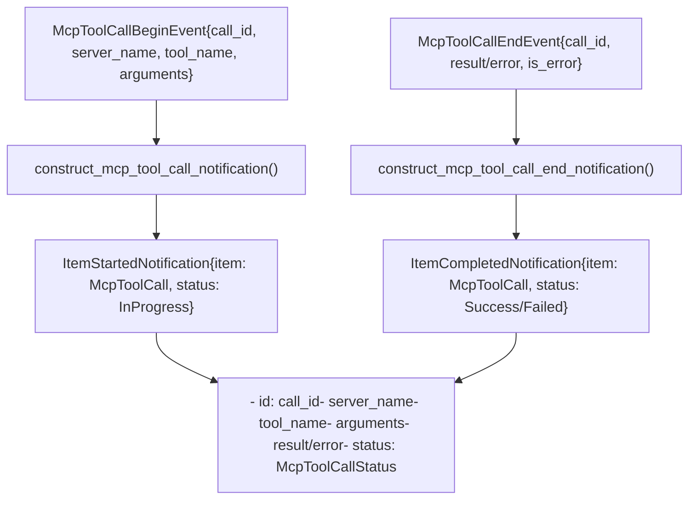
**McpToolCallStatus Values**

-   `InProgress`: Tool is executing on the MCP server
-   `Success`: Tool completed with result
-   `Failed`: Tool failed with error

**Sources:** [codex-rs/app-server/src/bespoke\_event\_handling.rs359-381](https://github.com/openai/codex/blob/d807d44a/codex-rs/app-server/src/bespoke_event_handling.rs#L359-L381) [codex-rs/app-server/src/bespoke\_event\_handling.rs809-891](https://github.com/openai/codex/blob/d807d44a/codex-rs/app-server/src/bespoke_event_handling.rs#L809-L891)

---

## Dynamic Tool Call Handling

Dynamic tools (custom tools defined at runtime via `turn/start` params) use a request/response pattern similar to approvals.

**Dynamic Tool Request/Response Flow**

> **[Mermaid sequence]**
> *(图表结构无法解析)*

**Dynamic Tool Content Items**

The client response includes a list of content items:

-   `InputText`: Plain text result
-   `InputImage`: Base64-encoded image data
-   `InputAudio`: Base64-encoded audio data

**Sources:** [codex-rs/app-server/src/bespoke\_event\_handling.rs324-358](https://github.com/openai/codex/blob/d807d44a/codex-rs/app-server/src/bespoke_event_handling.rs#L324-L358) [codex-rs/app-server/src/bespoke\_event\_handling.rs115-116](https://github.com/openai/codex/blob/d807d44a/codex-rs/app-server/src/bespoke_event_handling.rs#L115-L116)

---

## Request User Input Translation

The `RequestUserInput` event allows tools to ask the user questions mid-execution. This is an experimental V2-only feature.

**Request User Input Structure**

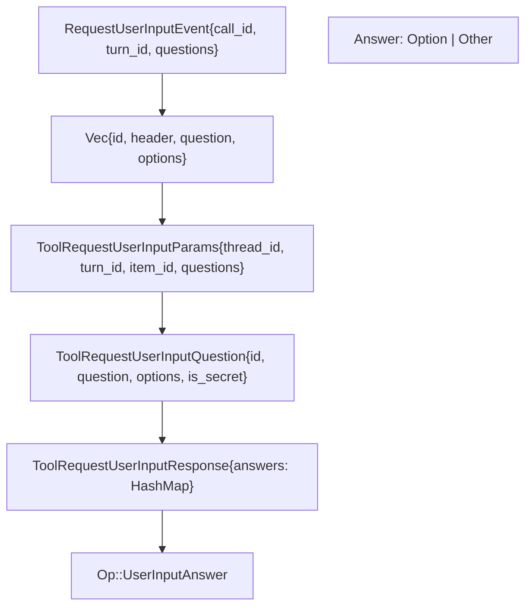
**Question Types**

-   **Multiple choice**: `options` field contains predefined choices
-   **Secret input**: `is_secret: true` for password-like fields
-   **Other/freeform**: `is_other: true` allows custom text input

**Sources:** [codex-rs/app-server/src/bespoke\_event\_handling.rs271-323](https://github.com/openai/codex/blob/d807d44a/codex-rs/app-server/src/bespoke_event_handling.rs#L271-L323) [codex-rs/app-server/src/bespoke\_event\_handling.rs93-96](https://github.com/openai/codex/blob/d807d44a/codex-rs/app-server/src/bespoke_event_handling.rs#L93-L96)

---

## Turn Completion Handling

The `TurnComplete` event marks the end of a turn and triggers cleanup and final state computation.

**Turn Completion Process**

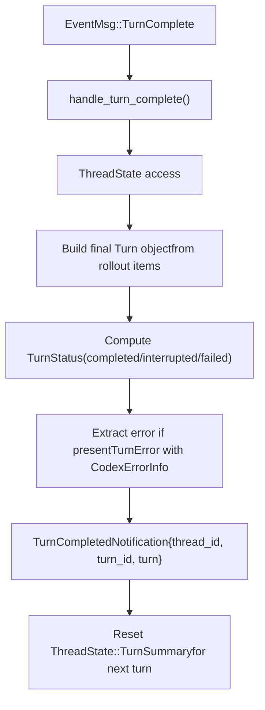
**TurnStatus Values**

-   `completed`: Turn finished successfully
-   `interrupted`: User or system interrupted the turn
-   `failed`: Turn failed with an error

**Sources:** [codex-rs/app-server/src/bespoke\_event\_handling.rs121-124](https://github.com/openai/codex/blob/d807d44a/codex-rs/app-server/src/bespoke_event_handling.rs#L121-L124) [codex-rs/app-server/src/bespoke\_event\_handling.rs892-996](https://github.com/openai/codex/blob/d807d44a/codex-rs/app-server/src/bespoke_event_handling.rs#L892-L996)

---

## Thread State Management

The `ThreadState` tracks transient per-turn state to ensure items are only started once and to coordinate approval requests.

**ThreadState Structure**

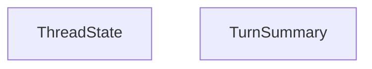
**State Reset Pattern**

State is reset after each `TurnComplete` event to prepare for the next turn in [codex-rs/app-server/src/bespoke\_event\_handling.rs995](https://github.com/openai/codex/blob/d807d44a/codex-rs/app-server/src/bespoke_event_handling.rs#L995-L995)

**Sources:** [codex-rs/app-server/src/thread\_state.rs1-100](https://github.com/openai/codex/blob/d807d44a/codex-rs/app-server/src/thread_state.rs#L1-L100) [codex-rs/app-server/src/bespoke\_event\_handling.rs153-159](https://github.com/openai/codex/blob/d807d44a/codex-rs/app-server/src/bespoke_event_handling.rs#L153-L159)

---

## Streaming Architecture

Events are streamed from core threads to clients through a multi-layer architecture.

**Streaming Architecture Components**

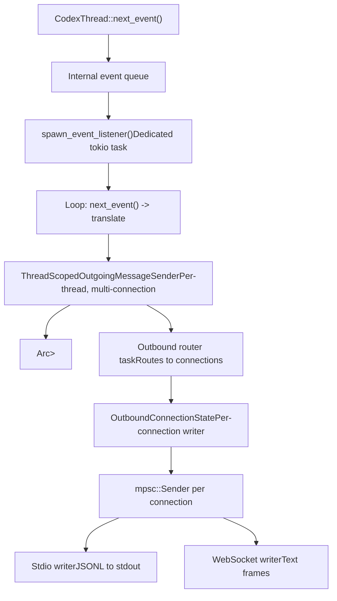
**Backpressure Handling**

All channels are bounded. If a client is slow to consume notifications:

1.  The outbound queue fills up
2.  `send()` on the channel blocks
3.  The event listener task pauses
4.  Core continues generating events (buffered internally)
5.  When the client catches up, events resume

**Sources:** [codex-rs/app-server/src/outgoing\_message.rs50-75](https://github.com/openai/codex/blob/d807d44a/codex-rs/app-server/src/outgoing_message.rs#L50-L75) [codex-rs/app-server/src/codex\_message\_processor.rs396-410](https://github.com/openai/codex/blob/d807d44a/codex-rs/app-server/src/codex_message_processor.rs#L396-L410)

---

## Notification Opt-Out

Clients can opt out of specific notifications during initialization to reduce bandwidth or handle only certain events.

**Opt-Out Mechanism**

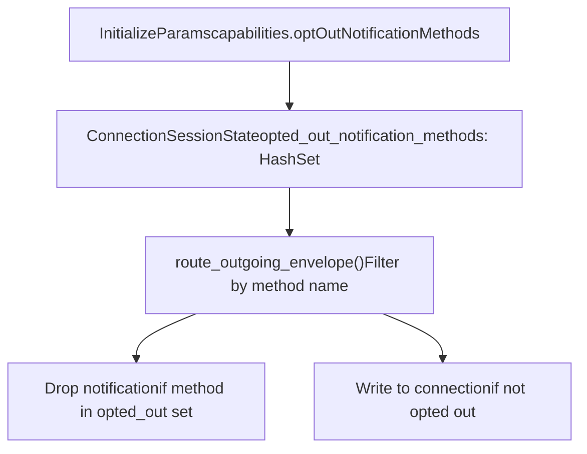
`opted_out_notification_methods` is populated during the `Initialize` handshake. Matching is exact (no wildcards or prefix matching).

**Common Opt-Out Patterns**

-   Opt out of `item/agentMessage/delta` to reduce bandwidth for streaming text
-   Opt out of `item/commandExecution/outputDelta` if only final status is needed
-   Opt out of legacy events when using V2 APIs

**Sources:** [codex-rs/app-server/src/codex\_message\_processor.rs140-148](https://github.com/openai/codex/blob/d807d44a/codex-rs/app-server/src/codex_message_processor.rs#L140-L148) [codex-rs/app-server-protocol/src/protocol/v1.rs100-110](https://github.com/openai/codex/blob/d807d44a/codex-rs/app-server-protocol/src/protocol/v1.rs#L100-L110)

---

## Error Handling and Resilience

The translation layer includes error handling to ensure that failures in event processing don't crash the entire thread.

**Error Recovery Patterns**

| Error Scenario | Recovery Strategy | Impact |
| --- | --- | --- |
| Client disconnects mid-approval | `oneshot::Receiver` drops, core times out | Turn continues or fails cleanly |
| Serialization failure | Log error, skip notification | Event lost but thread continues |
| Translation logic panic | Task isolation via `tokio::spawn` | Single event lost, others proceed |
| Approval response timeout | Core receives no response, applies default | Turn proceeds with rejection |

**Approval Response Handling**

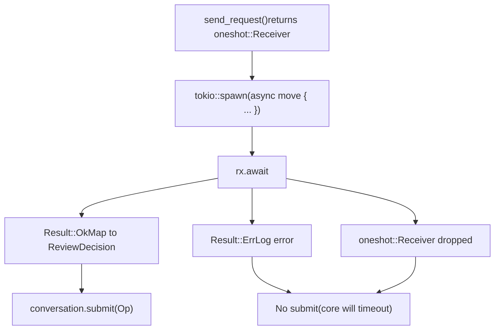
**Sources:** [codex-rs/app-server/src/bespoke\_event\_handling.rs143-146](https://github.com/openai/codex/blob/d807d44a/codex-rs/app-server/src/bespoke_event_handling.rs#L143-L146) [codex-rs/app-server/src/bespoke\_event\_handling.rs597-649](https://github.com/openai/codex/blob/d807d44a/codex-rs/app-server/src/bespoke_event_handling.rs#L597-L649)
