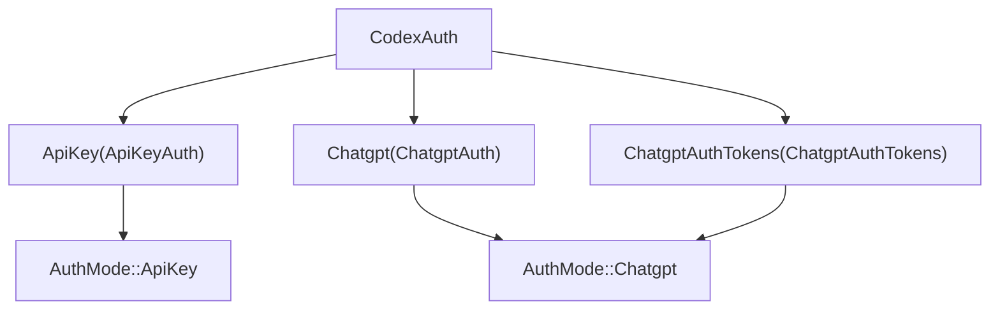
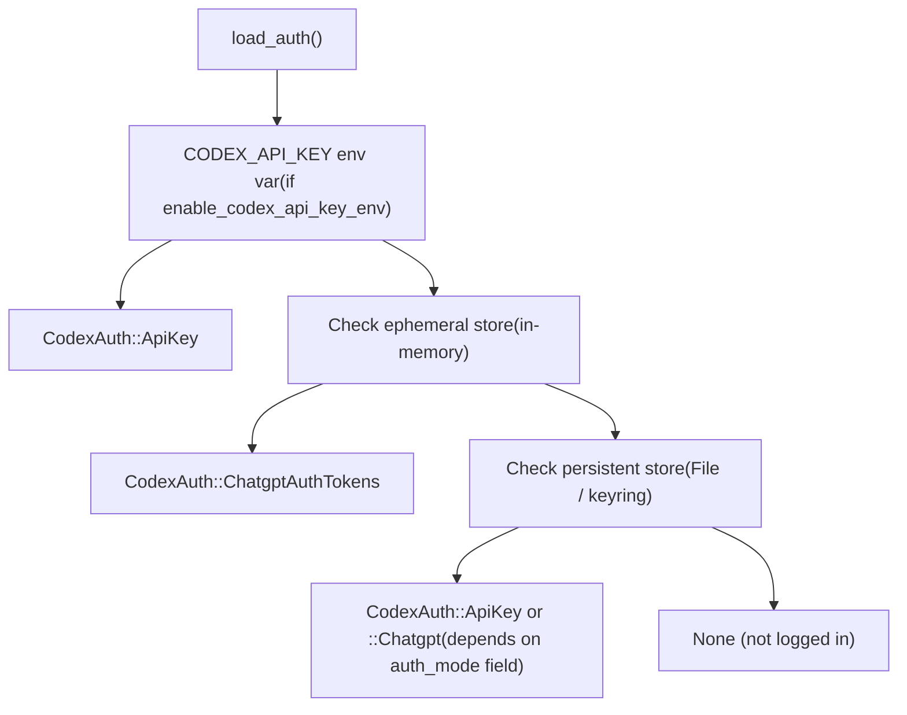
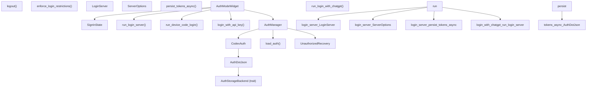

# Authentication Modes and Account Management

Relevant source files

-   [codex-rs/cli/src/login.rs](https://github.com/openai/codex/blob/d807d44a/codex-rs/cli/src/login.rs)
-   [codex-rs/core/tests/suite/auth\_refresh.rs](https://github.com/openai/codex/blob/d807d44a/codex-rs/core/tests/suite/auth_refresh.rs)
-   [codex-rs/login/Cargo.toml](https://github.com/openai/codex/blob/d807d44a/codex-rs/login/Cargo.toml)
-   [codex-rs/login/src/lib.rs](https://github.com/openai/codex/blob/d807d44a/codex-rs/login/src/lib.rs)
-   [codex-rs/login/src/server.rs](https://github.com/openai/codex/blob/d807d44a/codex-rs/login/src/server.rs)
-   [codex-rs/login/src/token\_data.rs](https://github.com/openai/codex/blob/d807d44a/codex-rs/login/src/token_data.rs)
-   [codex-rs/login/tests/suite/login\_server\_e2e.rs](https://github.com/openai/codex/blob/d807d44a/codex-rs/login/tests/suite/login_server_e2e.rs)
-   [codex-rs/tui/src/ascii\_animation.rs](https://github.com/openai/codex/blob/d807d44a/codex-rs/tui/src/ascii_animation.rs)
-   [codex-rs/tui/src/chatwidget/snapshots/codex\_tui\_\_chatwidget\_\_tests\_\_rate\_limit\_switch\_prompt\_popup.snap](https://github.com/openai/codex/blob/d807d44a/codex-rs/tui/src/chatwidget/snapshots/codex_tui__chatwidget__tests__rate_limit_switch_prompt_popup.snap)
-   [codex-rs/tui/src/onboarding/auth.rs](https://github.com/openai/codex/blob/d807d44a/codex-rs/tui/src/onboarding/auth.rs)
-   [codex-rs/tui/src/onboarding/mod.rs](https://github.com/openai/codex/blob/d807d44a/codex-rs/tui/src/onboarding/mod.rs)
-   [codex-rs/tui/src/onboarding/onboarding\_screen.rs](https://github.com/openai/codex/blob/d807d44a/codex-rs/tui/src/onboarding/onboarding_screen.rs)
-   [codex-rs/tui/src/onboarding/trust\_directory.rs](https://github.com/openai/codex/blob/d807d44a/codex-rs/tui/src/onboarding/trust_directory.rs)
-   [codex-rs/tui/src/onboarding/welcome.rs](https://github.com/openai/codex/blob/d807d44a/codex-rs/tui/src/onboarding/welcome.rs)

This page documents how Codex authenticates users, stores credentials, refreshes tokens, and manages login state at runtime. It covers the `CodexAuth` / `AuthManager` types in `codex-core`, the OAuth/PKCE browser login server in `codex-login`, the device-code flow, API key auth, and the TUI onboarding screen that guides first-time users through sign-in.

For how auth configuration is delivered to a running session (e.g., `forced_login_method` coming from cloud-managed config), see the Config API and Layer System [4.5.4](https://github.com/openai/codex/blob/d807d44a/4.5.4) For OAuth token handling specific to MCP servers, see OAuth Authentication for MCP [6.5](https://github.com/openai/codex/blob/d807d44a/6.5)

---

## Auth Modes

Codex supports two top-level authentication modes, represented by the `AuthMode` enum:

[codex-rs/login/src/auth.rs44-48](https://github.com/openai/codex/blob/d807d44a/codex-rs/login/src/auth.rs#L44-L48) (Note: `AuthMode` is re-exported from `codex-app-server-protocol`)

| `AuthMode` variant | Description |
| --- | --- |
| `ApiKey` | A raw OpenAI API key is sent as a Bearer token. Usage is billed per-token. |
| `Chatgpt` | An OAuth access token obtained from a ChatGPT account is used. Rate limits and billing follow the user's ChatGPT plan. |

The `CodexAuth` enum holds the concrete auth payload for one of three sub-modes:

[codex-rs/login/src/auth.rs61-65](https://github.com/openai/codex/blob/d807d44a/codex-rs/login/src/auth.rs#L61-L65)

| `CodexAuth` variant | Internal struct | Description |
| --- | --- | --- |
| `ApiKey(ApiKeyAuth)` | `ApiKeyAuth` | Holds the raw API key string. |
| `Chatgpt(ChatgptAuth)` | `ChatgptAuth` | Holds OAuth tokens + a persistent storage backend. Used when Codex itself manages the OAuth flow. |
| `ChatgptAuthTokens(ChatgptAuthTokens)` | `ChatgptAuthTokens` | Holds OAuth tokens obtained externally (e.g., from the IDE extension via the app server). Stored only in-memory (ephemeral). |

**Auth mode resolution diagram**


Sources: [codex-rs/login/src/auth.rs44-65](https://github.com/openai/codex/blob/d807d44a/codex-rs/login/src/auth.rs#L44-L65) [codex-rs/login/src/auth.rs200-213](https://github.com/openai/codex/blob/d807d44a/codex-rs/login/src/auth.rs#L200-L213)

---

## Token Storage: `AuthDotJson` and `AuthCredentialsStoreMode`

Credentials are serialized to an `AuthDotJson` struct and persisted via an `AuthStorageBackend` trait. The default location is `$CODEX_HOME/auth.json`.

[codex-rs/login/src/auth.rs22-26](https://github.com/openai/codex/blob/d807d44a/codex-rs/login/src/auth.rs#L22-L26)

### `AuthDotJson` fields

| Field | Type | Purpose |
| --- | --- | --- |
| `auth_mode` | `Option<AuthMode>` | Explicitly recorded auth mode. Falls back to heuristic if absent. |
| `openai_api_key` | `Option<String>` | The raw API key (populated for `ApiKey` mode and, historically, after ChatGPT PKCE exchange). |
| `tokens` | `Option<TokenData>` | ChatGPT OAuth token bundle (access, refresh, id). |
| `last_refresh` | `Option<DateTime<Utc>>` | Timestamp of the last successful token refresh, used to decide when to refresh. |

### `AuthCredentialsStoreMode`

Controls where credentials are written:

| Mode | Behavior |
| --- | --- |
| `File` | Reads/writes `auth.json` on disk under `codex_home`. |
| `Ephemeral` | Stores credentials in process memory only; never touches disk. Used for externally-provided ChatGPT tokens. |
| `Auto` / keyring variants | Platform-specific secure storage (keychain/keyring). |

The `ChatgptAuthTokens` variant always uses `Ephemeral` storage regardless of the configured mode.

[codex-rs/login/src/auth.rs792-801](https://github.com/openai/codex/blob/d807d44a/codex-rs/login/src/auth.rs#L792-L801)

Sources: [codex-rs/login/src/auth.rs1-36](https://github.com/openai/codex/blob/d807d44a/codex-rs/login/src/auth.rs#L1-L36) [codex-rs/login/src/auth.rs782-801](https://github.com/openai/codex/blob/d807d44a/codex-rs/login/src/auth.rs#L782-L801)

---

## `AuthManager`: Central Auth State

`AuthManager` is the runtime owner of `CodexAuth`. It loads credentials once on construction and then hands out cloned snapshots. External modifications to `auth.json` are not observed until `reload()` is called explicitly — this is intentional to prevent inconsistent views within a single run.

[codex-rs/login/src/auth.rs962-969](https://github.com/openai/codex/blob/d807d44a/codex-rs/login/src/auth.rs#L962-L969)

### Construction

```
AuthManager::new(codex_home, enable_codex_api_key_env, auth_credentials_store_mode)
```
The constructor:

1.  Optionally checks `CODEX_API_KEY` env var (if `enable_codex_api_key_env` is true).
2.  Checks the ephemeral store for externally-provided tokens.
3.  Falls back to the configured persistent store (`File` / keyring).

[codex-rs/login/src/auth.rs976-998](https://github.com/openai/codex/blob/d807d44a/codex-rs/login/src/auth.rs#L976-L998)

### Key methods

| Method | Purpose |
| --- | --- |
| `auth_cached()` | Returns the cached `Option<CodexAuth>` without any network call. |
| `auth()` | Returns the cached auth, refreshing stale ChatGPT tokens if needed. |
| `reload()` | Re-reads from disk into the cache. Called after login completes. |
| `refresh_token()` | Refreshes ChatGPT tokens if the current in-memory token differs from what is on disk. |
| `refresh_token_from_authority()` | Always contacts `auth.openai.com` to get new tokens, regardless of disk state. |
| `refresh_external_auth(reason)` | Asks an `ExternalAuthRefresher` (e.g., the IDE host) for new tokens. |
| `unauthorized_recovery()` | Returns an `UnauthorizedRecovery` state machine for handling HTTP 401 retries. |

Sources: [codex-rs/login/src/auth.rs954-1050](https://github.com/openai/codex/blob/d807d44a/codex-rs/login/src/auth.rs#L954-L1050)

---

## Auth Loading Priority

When loading credentials, the following precedence applies:

**Auth loading priority diagram**


Sources: [codex-rs/login/src/auth.rs547-591](https://github.com/openai/codex/blob/d807d44a/codex-rs/login/src/auth.rs#L547-L591)

---

## ChatGPT Browser Login Flow (PKCE)

The browser-based ChatGPT login lives in `codex-rs/login/src/server.rs`. It is used both from the CLI (`codex login`) and from the TUI onboarding screen.

**Sequence: browser login**

> **[Mermaid sequence]**
> *(图表结构无法解析)*

Key types in the flow:

| Type / function | File | Role |
| --- | --- | --- |
| `ServerOptions` | `login/src/server.rs:54` | Configuration bundle: codex\_home, client\_id, issuer, port, workspace restriction. |
| `LoginServer` | `login/src/server.rs:87` | Handle to the running local HTTP server. Exposes `auth_url`, `actual_port`, `block_until_done()`. |
| `ShutdownHandle` | `login/src/server.rs:115` | Tokio notify wrapper; calling `shutdown()` cancels the server loop. |
| `run_login_server(opts)` | `login/src/server.rs:127` | Spawns server + async loop; returns `LoginServer`. |
| `exchange_code_for_tokens()` | `login/src/server.rs:536` | POSTs to `{issuer}/oauth/token` with PKCE verifier; returns `ExchangedTokens`. |
| `persist_tokens_async()` | `login/src/server.rs:583` | Writes `AuthDotJson` to disk via `save_auth()`. |
| `ensure_workspace_allowed()` | `login/src/server.rs:698` | Validates `chatgpt_account_id` JWT claim against `forced_chatgpt_workspace_id`. |

The OAuth client ID used is the constant `CLIENT_ID = "app_EMoamEEZ73f0CkXaXp7hrann"`.

[codex-rs/login/src/auth.rs22](https://github.com/openai/codex/blob/d807d44a/codex-rs/login/src/auth.rs#L22-L22)

Sources: [codex-rs/login/src/server.rs1-220](https://github.com/openai/codex/blob/d807d44a/codex-rs/login/src/server.rs#L1-L220) [codex-rs/login/src/server.rs528-616](https://github.com/openai/codex/blob/d807d44a/codex-rs/login/src/server.rs#L528-L616)

---

## Device Code Login

For headless / remote environments, Codex supports the OAuth device code flow via `run_device_code_login()` in `codex-rs/login/src/device_code_auth.rs`.

From the CLI, `codex login --device-auth` invokes `run_device_code_login()`.

[codex-rs/cli/src/login.rs17-18](https://github.com/openai/codex/blob/d807d44a/codex-rs/cli/src/login.rs#L17-L18)

Inside the TUI onboarding, the device code path starts from `AuthModeWidget::start_device_code_login()`, which manages `ContinueWithDeviceCodeState`.

[codex-rs/tui/src/onboarding/auth.rs119-122](https://github.com/openai/codex/blob/d807d44a/codex-rs/tui/src/onboarding/auth.rs#L119-L122) [codex-rs/tui/src/onboarding/auth.rs773-786](https://github.com/openai/codex/blob/d807d44a/codex-rs/tui/src/onboarding/auth.rs#L773-L786)

Sources: [codex-rs/cli/src/login.rs1-222](https://github.com/openai/codex/blob/d807d44a/codex-rs/cli/src/login.rs#L1-L222) [codex-rs/tui/src/onboarding/auth.rs773-786](https://github.com/openai/codex/blob/d807d44a/codex-rs/tui/src/onboarding/auth.rs#L773-L786)

---

## API Key Login

API key auth is the simpler path:

-   **Environment variable**: `OPENAI_API_KEY` or `CODEX_API_KEY` (read via `read_openai_api_key_from_env()`).
-   **Stored credential**: `login_with_api_key(codex_home, api_key, store_mode)` writes an `AuthDotJson` with `auth_mode = ApiKey` and the key in `openai_api_key`.
-   **TUI onboarding**: `AuthModeWidget` allows users to paste or type an API key, which is then persisted via `login_with_api_key`.

[codex-rs/login/src/auth.rs363-403](https://github.com/openai/codex/blob/d807d44a/codex-rs/login/src/auth.rs#L363-L403) [codex-rs/tui/src/onboarding/auth.rs671-705](https://github.com/openai/codex/blob/d807d44a/codex-rs/tui/src/onboarding/auth.rs#L671-L705)

Sources: [codex-rs/login/src/auth.rs363-403](https://github.com/openai/codex/blob/d807d44a/codex-rs/login/src/auth.rs#L363-L403) [codex-rs/cli/src/login.rs161-188](https://github.com/openai/codex/blob/d807d44a/codex-rs/cli/src/login.rs#L161-L188)

---

## Token Refresh

ChatGPT access tokens are short-lived. `AuthManager` refreshes them transparently.

**Refresh interval**: `TOKEN_REFRESH_INTERVAL = 8` hours. The `auth()` method checks `last_refresh` and refreshes if the token is stale before returning it to the caller.

[codex-rs/login/src/auth.rs96](https://github.com/openai/codex/blob/d807d44a/codex-rs/login/src/auth.rs#L96-L96)

### Refresh endpoint

Tokens are refreshed by POSTing to `https://auth.openai.com/oauth/token` (overridable via `CODEX_REFRESH_TOKEN_URL_OVERRIDE`).

[codex-rs/login/src/auth.rs104-105](https://github.com/openai/codex/blob/d807d44a/codex-rs/login/src/auth.rs#L104-L105)

### `RefreshTokenError` classification

When a 401 is returned from the refresh endpoint, the error body is parsed to classify the failure:

| Error code in response | `RefreshTokenFailedReason` | User message |
| --- | --- | --- |
| `refresh_token_expired` | `Expired` | Token expired — log out and sign in again. |
| `refresh_token_reused` | `Exhausted` | Token already used — log out and sign in again. |
| `refresh_token_invalidated` | `Revoked` | Token revoked — log out and sign in again. |
| anything else | `Other` | Generic unknown error. |

[codex-rs/login/src/auth.rs665-692](https://github.com/openai/codex/blob/d807d44a/codex-rs/login/src/auth.rs#L665-L692)

### `UnauthorizedRecovery` state machine

When an API request returns HTTP 401, the model client uses `UnauthorizedRecovery` to attempt recovery before surfacing the error to the user.

**`UnauthorizedRecovery` state machine diagram**

For `ApiKey` mode, `has_next()` returns `false` immediately — no recovery is attempted.

[codex-rs/login/src/auth.rs862-951](https://github.com/openai/codex/blob/d807d44a/codex-rs/login/src/auth.rs#L862-L951)

Sources: [codex-rs/login/src/auth.rs593-692](https://github.com/openai/codex/blob/d807d44a/codex-rs/login/src/auth.rs#L593-L692) [codex-rs/login/src/auth.rs827-951](https://github.com/openai/codex/blob/d807d44a/codex-rs/login/src/auth.rs#L827-L951)

---

## Logout

```
logout(codex_home, auth_credentials_store_mode) -> io::Result<bool>
```
Delegates to the configured `AuthStorageBackend::delete()`. Returns `Ok(true)` if a credential was removed, `Ok(false)` if there was nothing to remove.

From the CLI: `run_logout()` in [codex-rs/cli/src/login.rs15](https://github.com/openai/codex/blob/d807d44a/codex-rs/cli/src/login.rs#L15-L15)

When `enforce_login_restrictions` triggers a forced logout (e.g., wrong workspace or wrong login method), `logout_all_stores()` clears both the ephemeral and persistent stores.

[codex-rs/login/src/auth.rs535-545](https://github.com/openai/codex/blob/d807d44a/codex-rs/login/src/auth.rs#L535-L545)

Sources: [codex-rs/login/src/auth.rs380-388](https://github.com/openai/codex/blob/d807d44a/codex-rs/login/src/auth.rs#L380-L388) [codex-rs/cli/src/login.rs15](https://github.com/openai/codex/blob/d807d44a/codex-rs/cli/src/login.rs#L15-L15)

---

## Login Restrictions

The function `enforce_login_restrictions(config)` runs at startup and logs out (with an error) if the stored credentials violate configured constraints:

[codex-rs/login/src/auth.rs447-518](https://github.com/openai/codex/blob/d807d44a/codex-rs/login/src/auth.rs#L447-L518)

| Constraint field | Source | Effect on violation |
| --- | --- | --- |
| `forced_login_method: Some(ForcedLoginMethod::Api)` | Config | If ChatGPT auth is active → forced logout. |
| `forced_login_method: Some(ForcedLoginMethod::Chatgpt)` | Config | If API key auth is active → forced logout. |
| `forced_chatgpt_workspace_id` | Config | If ChatGPT token's `chatgpt_account_id` doesn't match → forced logout. |

The TUI `AuthModeWidget` also enforces these constraints locally when rendering login options — for example, hiding the API key option when `forced_login_method == Chatgpt`.

[codex-rs/tui/src/onboarding/auth.rs211-240](https://github.com/openai/codex/blob/d807d44a/codex-rs/tui/src/onboarding/auth.rs#L211-L240)

Sources: [codex-rs/login/src/auth.rs447-518](https://github.com/openai/codex/blob/d807d44a/codex-rs/login/src/auth.rs#L447-L518) [codex-rs/tui/src/onboarding/auth.rs211-240](https://github.com/openai/codex/blob/d807d44a/codex-rs/tui/src/onboarding/auth.rs#L211-L240)

---

## TUI Onboarding Screen

When a user launches Codex without stored credentials, or when the config requires a login screen, the TUI shows an `OnboardingScreen` (in `codex-rs/tui/src/onboarding/onboarding_screen.rs`). The onboarding screen is a sequence of `Step` variants:

1.  `Step::Welcome(WelcomeWidget)` — shown only when not logged in.
2.  `Step::Auth(AuthModeWidget)` — the sign-in selection.
3.  `Step::TrustDirectory(TrustDirectoryWidget)` — directory trust prompt.

[codex-rs/tui/src/onboarding/onboarding\_screen.rs34-38](https://github.com/openai/codex/blob/d807d44a/codex-rs/tui/src/onboarding/onboarding_screen.rs#L34-L38)

### `AuthModeWidget` and `SignInState`

`AuthModeWidget` drives the login UI. Its internal state machine is `SignInState`:

[codex-rs/tui/src/onboarding/auth.rs86-94](https://github.com/openai/codex/blob/d807d44a/codex-rs/tui/src/onboarding/auth.rs#L86-L94)

`StepState::Complete` is set when `ChatGptSuccess` or `ApiKeyConfigured` is reached, which advances the `OnboardingScreen` to the next step.

[codex-rs/tui/src/onboarding/auth.rs789-800](https://github.com/openai/codex/blob/d807d44a/codex-rs/tui/src/onboarding/auth.rs#L789-L800)

### `AuthModeWidget` fields

| Field | Type | Role |
| --- | --- | --- |
| `sign_in_state` | `Arc<RwLock<SignInState>>` | Current UI state; written from async Tokio tasks. |
| `auth_manager` | `Arc<AuthManager>` | Reloaded via `auth_manager.reload()` after successful login. |
| `codex_home` | `PathBuf` | Path for credential storage. |
| `forced_login_method` | `Option<ForcedLoginMethod>` | Gates which options are shown/selectable. |
| `forced_chatgpt_workspace_id` | `Option<String>` | Passed into `ServerOptions` to restrict OAuth to a specific workspace. |

[codex-rs/tui/src/onboarding/auth.rs196-208](https://github.com/openai/codex/blob/d807d44a/codex-rs/tui/src/onboarding/auth.rs#L196-L208)

Sources: [codex-rs/tui/src/onboarding/auth.rs86-208](https://github.com/openai/codex/blob/d807d44a/codex-rs/tui/src/onboarding/auth.rs#L86-L208) [codex-rs/tui/src/onboarding/onboarding\_screen.rs33-139](https://github.com/openai/codex/blob/d807d44a/codex-rs/tui/src/onboarding/onboarding_screen.rs#L33-L139)

---

## CLI Login Commands

The CLI entry points in `codex-rs/cli/src/login.rs` map to the following operations:

| Function | Invocation | Description |
| --- | --- | --- |
| `run_login_with_chatgpt()` | `codex login` | Browser PKCE flow via `run_login_server()`. |
| `run_login_with_api_key()` | `codex login --with-api-key` | Reads key from stdin, writes via `login_with_api_key()`. |
| `run_logout()` | `codex logout` | Calls `logout()` and exits. |

[codex-rs/cli/src/login.rs131-188](https://github.com/openai/codex/blob/d807d44a/codex-rs/cli/src/login.rs#L131-L188) [codex-rs/cli/src/login.rs255-272](https://github.com/openai/codex/blob/d807d44a/codex-rs/cli/src/login.rs#L255-L272)

All CLI login functions respect `forced_login_method` from config before starting any flow.

Sources: [codex-rs/cli/src/login.rs1-300](https://github.com/openai/codex/blob/d807d44a/codex-rs/cli/src/login.rs#L1-L300)

---

## Component Relationships

The following diagram maps the major auth abstractions to their source locations:


Sources: [codex-rs/login/src/auth.rs1-1050](https://github.com/openai/codex/blob/d807d44a/codex-rs/login/src/auth.rs#L1-L1050) [codex-rs/login/src/server.rs1-220](https://github.com/openai/codex/blob/d807d44a/codex-rs/login/src/server.rs#L1-L220) [codex-rs/tui/src/onboarding/auth.rs1-831](https://github.com/openai/codex/blob/d807d44a/codex-rs/tui/src/onboarding/auth.rs#L1-L831) [codex-rs/cli/src/login.rs1-300](https://github.com/openai/codex/blob/d807d44a/codex-rs/cli/src/login.rs#L1-L300)
