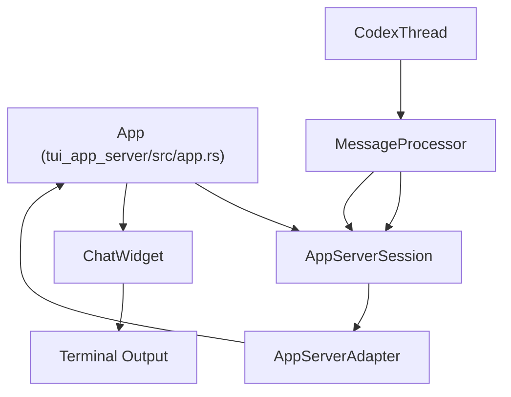
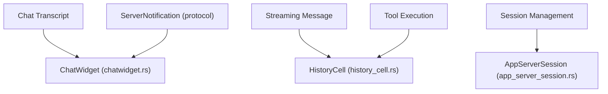

# TUI App Server Variant (tui\_app\_server)

Relevant source files

-   [codex-rs/app-server-client/src/lib.rs](https://github.com/openai/codex/blob/d807d44a/codex-rs/app-server-client/src/lib.rs)
-   [codex-rs/app-server/src/in\_process.rs](https://github.com/openai/codex/blob/d807d44a/codex-rs/app-server/src/in_process.rs)
-   [codex-rs/app-server/src/thread\_state.rs](https://github.com/openai/codex/blob/d807d44a/codex-rs/app-server/src/thread_state.rs)
-   [codex-rs/core/src/message\_history.rs](https://github.com/openai/codex/blob/d807d44a/codex-rs/core/src/message_history.rs)
-   [codex-rs/tui/src/chatwidget/plugins.rs](https://github.com/openai/codex/blob/d807d44a/codex-rs/tui/src/chatwidget/plugins.rs)
-   [codex-rs/tui/src/chatwidget/snapshots/codex\_tui\_\_chatwidget\_\_tests\_\_image\_generation\_call\_history\_snapshot.snap](https://github.com/openai/codex/blob/d807d44a/codex-rs/tui/src/chatwidget/snapshots/codex_tui__chatwidget__tests__image_generation_call_history_snapshot.snap)
-   [codex-rs/tui\_app\_server/src/app.rs](https://github.com/openai/codex/blob/d807d44a/codex-rs/tui_app_server/src/app.rs)
-   [codex-rs/tui\_app\_server/src/app/app\_server\_adapter.rs](https://github.com/openai/codex/blob/d807d44a/codex-rs/tui_app_server/src/app/app_server_adapter.rs)
-   [codex-rs/tui\_app\_server/src/app\_event.rs](https://github.com/openai/codex/blob/d807d44a/codex-rs/tui_app_server/src/app_event.rs)
-   [codex-rs/tui\_app\_server/src/app\_server\_session.rs](https://github.com/openai/codex/blob/d807d44a/codex-rs/tui_app_server/src/app_server_session.rs)
-   [codex-rs/tui\_app\_server/src/bottom\_pane/chat\_composer\_history.rs](https://github.com/openai/codex/blob/d807d44a/codex-rs/tui_app_server/src/bottom_pane/chat_composer_history.rs)
-   [codex-rs/tui\_app\_server/src/chatwidget.rs](https://github.com/openai/codex/blob/d807d44a/codex-rs/tui_app_server/src/chatwidget.rs)
-   [codex-rs/tui\_app\_server/src/chatwidget/snapshots/codex\_tui\_\_chatwidget\_\_tests\_\_image\_generation\_call\_history\_snapshot.snap](https://github.com/openai/codex/blob/d807d44a/codex-rs/tui_app_server/src/chatwidget/snapshots/codex_tui__chatwidget__tests__image_generation_call_history_snapshot.snap)
-   [codex-rs/tui\_app\_server/src/chatwidget/snapshots/codex\_tui\_app\_server\_\_chatwidget\_\_tests\_\_image\_generation\_call\_history\_snapshot.snap](https://github.com/openai/codex/blob/d807d44a/codex-rs/tui_app_server/src/chatwidget/snapshots/codex_tui_app_server__chatwidget__tests__image_generation_call_history_snapshot.snap)
-   [codex-rs/tui\_app\_server/src/chatwidget/tests.rs](https://github.com/openai/codex/blob/d807d44a/codex-rs/tui_app_server/src/chatwidget/tests.rs)
-   [codex-rs/tui\_app\_server/src/history\_cell.rs](https://github.com/openai/codex/blob/d807d44a/codex-rs/tui_app_server/src/history_cell.rs)

The `tui_app_server` crate provides a Terminal User Interface (TUI) for Codex that operates as a client to the `app-server` protocol. Unlike the legacy TUI which integrated directly with `codex-core` components, this variant communicates with an in-process or remote `app-server` instance using JSON-RPC messages [codex-rs/tui\_app\_server/src/app/app\_server\_adapter.rs1-12](https://github.com/openai/codex/blob/d807d44a/codex-rs/tui_app_server/src/app/app_server_adapter.rs#L1-L12) This architecture decouples the UI rendering logic from agent execution, allowing the TUI to function as a thin frontend.

## Architecture and Data Flow

The `tui_app_server` variant uses an adapter pattern to bridge the asynchronous event stream from the `app-server` into the TUI's reactive rendering loop.

### System Interaction Diagram

This diagram shows how the TUI interacts with the `app-server` via the `AppServerAdapter`.

Sources: [codex-rs/tui\_app\_server/src/app.rs10-19](https://github.com/openai/codex/blob/d807d44a/codex-rs/tui_app_server/src/app.rs#L10-L19) [codex-rs/tui\_app\_server/src/app/app\_server\_adapter.rs108-138](https://github.com/openai/codex/blob/d807d44a/codex-rs/tui_app_server/src/app/app_server_adapter.rs#L108-L138) [codex-rs/app-server/src/in\_process.rs56-62](https://github.com/openai/codex/blob/d807d44a/codex-rs/app-server/src/in_process.rs#L56-L62)

### Component Mapping: Natural Language to Code Entities

This diagram bridges UI concepts to the specific structs and traits used in the implementation.

Sources: [codex-rs/tui\_app\_server/src/chatwidget.rs1-10](https://github.com/openai/codex/blob/d807d44a/codex-rs/tui_app_server/src/chatwidget.rs#L1-L10) [codex-rs/tui\_app\_server/src/history\_cell.rs1-12](https://github.com/openai/codex/blob/d807d44a/codex-rs/tui_app_server/src/history_cell.rs#L1-L12) [codex-rs/tui\_app\_server/src/app\_server\_session.rs99-102](https://github.com/openai/codex/blob/d807d44a/codex-rs/tui_app_server/src/app_server_session.rs#L99-L102)

## ChatWidget and Rendering

The `ChatWidget` is the primary surface for conversation display. it consumes protocol events and builds a collection of `HistoryCell` objects [codex-rs/tui\_app\_server/src/chatwidget.rs1-4](https://github.com/openai/codex/blob/d807d44a/codex-rs/tui_app_server/src/chatwidget.rs#L1-L4)

### Active Cell Management

The UI distinguishes between "committed" transcript cells and an "in-flight" active cell:

-   **Committed Cells**: Finalized `HistoryCell` instances representing completed turns or messages [codex-rs/tui\_app\_server/src/chatwidget.rs6-8](https://github.com/openai/codex/blob/d807d44a/codex-rs/tui_app_server/src/chatwidget.rs#L6-L8)
-   **Active Cell**: A mutable cell (`ChatWidget.active_cell`) that updates in real-time as the model streams content or executes tools [codex-rs/tui\_app\_server/src/chatwidget.rs7-10](https://github.com/openai/codex/blob/d807d44a/codex-rs/tui_app_server/src/chatwidget.rs#L7-L10)

### HistoryCell Trait

The `HistoryCell` trait defines how conversation items are rendered to the terminal.

-   `display_lines`: Returns the logical lines for the main chat viewport [codex-rs/tui\_app\_server/src/history\_cell.rs106](https://github.com/openai/codex/blob/d807d44a/codex-rs/tui_app_server/src/history_cell.rs#L106-L106)
-   `desired_height`: Calculates viewport rows using `Paragraph::line_count` to account for wrapping [codex-rs/tui\_app\_server/src/history\_cell.rs115-121](https://github.com/openai/codex/blob/d807d44a/codex-rs/tui_app_server/src/history_cell.rs#L115-L121)
-   `transcript_lines`: Provides a specialized representation for the `Ctrl+T` transcript overlay [codex-rs/tui\_app\_server/src/history\_cell.rs128-130](https://github.com/openai/codex/blob/d807d44a/codex-rs/tui_app_server/src/history_cell.rs#L128-L130)

Sources: [codex-rs/tui\_app\_server/src/chatwidget.rs1-22](https://github.com/openai/codex/blob/d807d44a/codex-rs/tui_app_server/src/chatwidget.rs#L1-L22) [codex-rs/tui\_app\_server/src/history\_cell.rs104-160](https://github.com/openai/codex/blob/d807d44a/codex-rs/tui_app_server/src/history_cell.rs#L104-L160)

## Session Management (AppServerSession)

`AppServerSession` manages the connection state and request/response lifecycle between the TUI and the server.

### Key Responsibilities

-   **Bootstrap**: Initializes the session by fetching account details, available models, and rate limits [codex-rs/tui\_app\_server/src/app\_server\_session.rs155-172](https://github.com/openai/codex/blob/d807d44a/codex-rs/tui_app_server/src/app_server_session.rs#L155-L172)
-   **Thread Lifecycle**: Wraps `app-server` endpoints for `thread/start`, `thread/resume`, and `thread/fork` [codex-rs/tui\_app\_server/src/app\_server\_session.rs20-50](https://github.com/openai/codex/blob/d807d44a/codex-rs/tui_app_server/src/app_server_session.rs#L20-L50)
-   **Request ID Tracking**: Maintains an internal counter (`next_request_id`) to correlate JSON-RPC requests and responses [codex-rs/tui\_app\_server/src/app\_server\_session.rs101](https://github.com/openai/codex/blob/d807d44a/codex-rs/tui_app_server/src/app_server_session.rs#L101-L101)

### ThreadSessionState

This struct tracks the metadata for the currently active thread within the TUI:

-   `thread_id`: The unique identifier for the conversation [codex-rs/tui\_app\_server/src/app\_server\_session.rs106](https://github.com/openai/codex/blob/d807d44a/codex-rs/tui_app_server/src/app_server_session.rs#L106-L106)
-   `model`: The specific model (e.g., GPT-4o) being used [codex-rs/tui\_app\_server/src/app\_server\_session.rs109](https://github.com/openai/codex/blob/d807d44a/codex-rs/tui_app_server/src/app_server_session.rs#L109-L109)
-   `approval_policy`: The current `AskForApproval` setting (e.g., for tool execution) [codex-rs/tui\_app\_server/src/app\_server\_session.rs112](https://github.com/openai/codex/blob/d807d44a/codex-rs/tui_app_server/src/app_server_session.rs#L112-L112)

Sources: [codex-rs/tui\_app\_server/src/app\_server\_session.rs99-142](https://github.com/openai/codex/blob/d807d44a/codex-rs/tui_app_server/src/app_server_session.rs#L99-L142) [codex-rs/tui\_app\_server/src/app\_server\_session.rs155-175](https://github.com/openai/codex/blob/d807d44a/codex-rs/tui_app_server/src/app_server_session.rs#L155-L175)

## Event Handling and Protocol Integration

The TUI reacts to two primary types of messages from the server: `ServerNotification` and `ServerRequest`.

### Notification Processing

Notifications are handled in `handle_server_notification_event` [codex-rs/tui\_app\_server/src/app/app\_server\_adapter.rs140-144](https://github.com/openai/codex/blob/d807d44a/codex-rs/tui_app_server/src/app/app_server_adapter.rs#L140-L144)

-   **Account Updates**: Triggers UI refreshes for rate limits and plan status [codex-rs/tui\_app\_server/src/app/app\_server\_adapter.rs150-169](https://github.com/openai/codex/blob/d807d44a/codex-rs/tui_app_server/src/app/app_server_adapter.rs#L150-L169)
-   **Thread Targets**: Notifications containing a `thread_id` are routed to the appropriate thread channel for rendering in the `ChatWidget` [codex-rs/tui\_app\_server/src/app/app\_server\_adapter.rs173-188](https://github.com/openai/codex/blob/d807d44a/codex-rs/tui_app_server/src/app/app_server_adapter.rs#L173-L188)

### Server Requests (Interactive Flows)

When the server requires user input (e.g., tool approvals or MCP form elicitation), it sends a `ServerRequest`.

-   The TUI captures these in `handle_server_request_event` [codex-rs/tui\_app\_server/src/app/app\_server\_adapter.rs128-131](https://github.com/openai/codex/blob/d807d44a/codex-rs/tui_app_server/src/app/app_server_adapter.rs#L128-L131)
-   Requests are resolved by the TUI (e.g., user clicking "Approve") and the result is sent back to the server via the `AppServerSession` [codex-rs/tui\_app\_server/src/app/app\_server\_adapter.rs146-149](https://github.com/openai/codex/blob/d807d44a/codex-rs/tui_app_server/src/app/app_server_adapter.rs#L146-L149)

Sources: [codex-rs/tui\_app\_server/src/app/app\_server\_adapter.rs108-195](https://github.com/openai/codex/blob/d807d44a/codex-rs/tui_app_server/src/app/app_server_adapter.rs#L108-L195) [codex-rs/tui\_app\_server/src/app\_event.rs76-113](https://github.com/openai/codex/blob/d807d44a/codex-rs/tui_app_server/src/app_event.rs#L76-L113)

## Summary of Key Functions

| Function | Location | Purpose |
| --- | --- | --- |
| `handle_app_server_event` | `app_server_adapter.rs` | Main entry point for processing events from the `app-server` client [codex-rs/tui\_app\_server/src/app/app\_server\_adapter.rs109-138](https://github.com/openai/codex/blob/d807d44a/codex-rs/tui_app_server/src/app/app_server_adapter.rs#L109-L138) |
| `bootstrap` | `app_server_session.rs` | Performs initial handshake and state sync with the server [codex-rs/tui\_app\_server/src/app\_server\_session.rs155-172](https://github.com/openai/codex/blob/d807d44a/codex-rs/tui_app_server/src/app_server_session.rs#L155-L172) |
| `display_lines` | `history_cell.rs` | Converts a protocol item into renderable TUI `Line`s [codex-rs/tui\_app\_server/src/history\_cell.rs106](https://github.com/openai/codex/blob/d807d44a/codex-rs/tui_app_server/src/history_cell.rs#L106-L106) |
| `update_task_running_state` | `chatwidget.rs` | Synchronizes the spinner and status indicators based on turn/MCP state [codex-rs/tui\_app\_server/src/chatwidget.rs18-22](https://github.com/openai/codex/blob/d807d44a/codex-rs/tui_app_server/src/chatwidget.rs#L18-L22) |

Sources: [codex-rs/tui\_app\_server/src/app/app\_server\_adapter.rs109-138](https://github.com/openai/codex/blob/d807d44a/codex-rs/tui_app_server/src/app/app_server_adapter.rs#L109-L138) [codex-rs/tui\_app\_server/src/app\_server\_session.rs155-172](https://github.com/openai/codex/blob/d807d44a/codex-rs/tui_app_server/src/app_server_session.rs#L155-L172) [codex-rs/tui\_app\_server/src/history\_cell.rs106](https://github.com/openai/codex/blob/d807d44a/codex-rs/tui_app_server/src/history_cell.rs#L106-L106) [codex-rs/tui\_app\_server/src/chatwidget.rs18-22](https://github.com/openai/codex/blob/d807d44a/codex-rs/tui_app_server/src/chatwidget.rs#L18-L22)
