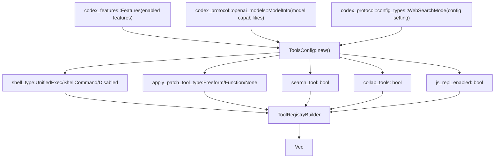
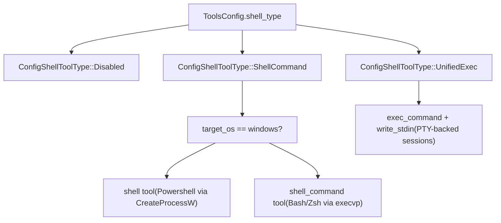

# Tool System

Relevant source files

-   [codex-rs/app-server/src/command\_exec.rs](https://github.com/openai/codex/blob/d807d44a/codex-rs/app-server/src/command_exec.rs)
-   [codex-rs/core/config.schema.json](https://github.com/openai/codex/blob/d807d44a/codex-rs/core/config.schema.json)
-   [codex-rs/core/src/config/agent\_roles.rs](https://github.com/openai/codex/blob/d807d44a/codex-rs/core/src/config/agent_roles.rs)
-   [codex-rs/core/src/config/config\_tests.rs](https://github.com/openai/codex/blob/d807d44a/codex-rs/core/src/config/config_tests.rs)
-   [codex-rs/core/src/config/edit.rs](https://github.com/openai/codex/blob/d807d44a/codex-rs/core/src/config/edit.rs)
-   [codex-rs/core/src/config/mod.rs](https://github.com/openai/codex/blob/d807d44a/codex-rs/core/src/config/mod.rs)
-   [codex-rs/core/src/config/profile.rs](https://github.com/openai/codex/blob/d807d44a/codex-rs/core/src/config/profile.rs)
-   [codex-rs/core/src/config/types.rs](https://github.com/openai/codex/blob/d807d44a/codex-rs/core/src/config/types.rs)
-   [codex-rs/core/src/exec.rs](https://github.com/openai/codex/blob/d807d44a/codex-rs/core/src/exec.rs)
-   [codex-rs/core/src/sandboxing/mod.rs](https://github.com/openai/codex/blob/d807d44a/codex-rs/core/src/sandboxing/mod.rs)
-   [codex-rs/core/src/tasks/user\_shell.rs](https://github.com/openai/codex/blob/d807d44a/codex-rs/core/src/tasks/user_shell.rs)
-   [codex-rs/core/src/tools/events.rs](https://github.com/openai/codex/blob/d807d44a/codex-rs/core/src/tools/events.rs)
-   [codex-rs/core/src/tools/handlers/mod.rs](https://github.com/openai/codex/blob/d807d44a/codex-rs/core/src/tools/handlers/mod.rs)
-   [codex-rs/core/src/tools/handlers/shell.rs](https://github.com/openai/codex/blob/d807d44a/codex-rs/core/src/tools/handlers/shell.rs)
-   [codex-rs/core/src/tools/handlers/unified\_exec.rs](https://github.com/openai/codex/blob/d807d44a/codex-rs/core/src/tools/handlers/unified_exec.rs)
-   [codex-rs/core/src/tools/orchestrator.rs](https://github.com/openai/codex/blob/d807d44a/codex-rs/core/src/tools/orchestrator.rs)
-   [codex-rs/core/src/tools/runtimes/apply\_patch.rs](https://github.com/openai/codex/blob/d807d44a/codex-rs/core/src/tools/runtimes/apply_patch.rs)
-   [codex-rs/core/src/tools/runtimes/mod.rs](https://github.com/openai/codex/blob/d807d44a/codex-rs/core/src/tools/runtimes/mod.rs)
-   [codex-rs/core/src/tools/runtimes/shell.rs](https://github.com/openai/codex/blob/d807d44a/codex-rs/core/src/tools/runtimes/shell.rs)
-   [codex-rs/core/src/tools/runtimes/unified\_exec.rs](https://github.com/openai/codex/blob/d807d44a/codex-rs/core/src/tools/runtimes/unified_exec.rs)
-   [codex-rs/core/src/tools/sandboxing.rs](https://github.com/openai/codex/blob/d807d44a/codex-rs/core/src/tools/sandboxing.rs)
-   [codex-rs/core/src/tools/spec.rs](https://github.com/openai/codex/blob/d807d44a/codex-rs/core/src/tools/spec.rs)
-   [codex-rs/core/src/tools/spec\_tests.rs](https://github.com/openai/codex/blob/d807d44a/codex-rs/core/src/tools/spec_tests.rs)
-   [codex-rs/core/src/unified\_exec/async\_watcher.rs](https://github.com/openai/codex/blob/d807d44a/codex-rs/core/src/unified_exec/async_watcher.rs)
-   [codex-rs/core/src/unified\_exec/errors.rs](https://github.com/openai/codex/blob/d807d44a/codex-rs/core/src/unified_exec/errors.rs)
-   [codex-rs/core/src/unified\_exec/mod.rs](https://github.com/openai/codex/blob/d807d44a/codex-rs/core/src/unified_exec/mod.rs)
-   [codex-rs/core/src/unified\_exec/process\_manager.rs](https://github.com/openai/codex/blob/d807d44a/codex-rs/core/src/unified_exec/process_manager.rs)
-   [codex-rs/core/tests/suite/exec.rs](https://github.com/openai/codex/blob/d807d44a/codex-rs/core/tests/suite/exec.rs)
-   [codex-rs/core/tests/suite/unified\_exec.rs](https://github.com/openai/codex/blob/d807d44a/codex-rs/core/tests/suite/unified_exec.rs)
-   [codex-rs/linux-sandbox/tests/suite/landlock.rs](https://github.com/openai/codex/blob/d807d44a/codex-rs/linux-sandbox/tests/suite/landlock.rs)
-   [docs/config.md](https://github.com/openai/codex/blob/d807d44a/docs/config.md?plain=1)
-   [docs/example-config.md](https://github.com/openai/codex/blob/d807d44a/docs/example-config.md?plain=1)
-   [docs/skills.md](https://github.com/openai/codex/blob/d807d44a/docs/skills.md?plain=1)
-   [docs/slash\_commands.md](https://github.com/openai/codex/blob/d807d44a/docs/slash_commands.md?plain=1)

## Purpose and Scope

The Tool System manages the registration, configuration, orchestration, and execution of tools that the model can invoke during a conversation turn. It provides a unified framework for:

-   **Tool registration and filtering** based on feature flags and model capabilities.
-   **Tool specification** using JSON Schema for function parameters.
-   **Tool orchestration** including approval workflows, sandbox selection, and retry semantics.
-   **Tool execution** through various backends (shell, unified exec, apply\_patch, MCP).
-   **Event emission** for tracking tool invocations and output streaming.

For details on the tool registry, see [Tool Registry and Configuration](/openai/codex/5.1-tool-registry-and-configuration). For details on the PTY-backed interactive process system, see [Unified Exec Process Management](/openai/codex/5.3-unified-exec-process-management).

---

## Tool Registry and Configuration

The `ToolRegistryBuilder` and `ToolRouter` manage the lifecycle of tool availability. The `ToolsConfig` struct determines which tools are available for a given session based on feature flags, model capabilities, and configuration settings.

**Diagram: Tool Configuration Flow**

Sources: [codex-rs/core/src/tools/spec.rs36-122](https://github.com/openai/codex/blob/d807d44a/codex-rs/core/src/tools/spec.rs#L36-L122) [codex-rs/core/src/tools/spec.rs57-111](https://github.com/openai/codex/blob/d807d44a/codex-rs/core/src/tools/spec.rs#L57-L111)

### Feature Flag Control

Tool availability is strictly controlled by feature flags defined in the `Feature` enum. For example, `Feature::UnifiedExec` enables the `exec_command` and `write_stdin` tools, while `Feature::ApplyPatchFreeform` enables the grammar-based `apply_patch` tool.

Sources: [codex-rs/core/src/tools/spec.rs63-109](https://github.com/openai/codex/blob/d807d44a/codex-rs/core/src/tools/spec.rs#L63-L109) [codex-rs/core/src/config/mod.rs64-68](https://github.com/openai/codex/blob/d807d44a/codex-rs/core/src/config/mod.rs#L64-L68)

For details, see [Tool Registry and Configuration](/openai/codex/5.1-tool-registry-and-configuration).

---

## Shell Execution Tools

Codex supports multiple shell execution backends. The `ShellHandler` and `ShellCommandHandler` manage non-interactive command execution, typically using the user's default shell (e.g., `zsh` or `bash`).

**Diagram: Shell Tool Selection**

Sources: [codex-rs/core/src/tools/spec.rs71-84](https://github.com/openai/codex/blob/d807d44a/codex-rs/core/src/tools/spec.rs#L71-L84) [codex-rs/core/src/tools/handlers/shell.rs41-49](https://github.com/openai/codex/blob/d807d44a/codex-rs/core/src/tools/handlers/shell.rs#L41-L49)

For details, see [Shell Execution Tools](/openai/codex/5.2-shell-execution-tools).

---

## Unified Exec Process Management

The `UnifiedExecProcessManager` orchestrates interactive PTY (Pseudo-Terminal) sessions. This system allows the model to start a process with `exec_command` and subsequently interact with it via `write_stdin`.

### Process Lifecycle

-   **Allocation**: Process IDs are allocated randomly (1000-99999) or sequentially in tests.
-   **Persistence**: Processes are stored in a `ProcessStore` with LRU pruning.
-   **Streaming**: A background `streaming_output` task reads from the PTY and emits `ExecCommandOutputDeltaEvent` messages.

Sources: [codex-rs/core/src/unified\_exec/mod.rs118-161](https://github.com/openai/codex/blob/d807d44a/codex-rs/core/src/unified_exec/mod.rs#L118-L161) [codex-rs/core/src/unified\_exec/process\_manager.rs106-133](https://github.com/openai/codex/blob/d807d44a/codex-rs/core/src/unified_exec/process_manager.rs#L106-L133)

For details, see [Unified Exec Process Management](/openai/codex/5.3-unified-exec-process-management).

---

## Apply Patch System

The `apply_patch` system is a specialized tool for file modifications. It supports both a structured JSON format and a "freeform" format using a custom grammar.

-   **Interception**: The system can intercept `apply_patch` calls embedded within shell scripts to provide better UI feedback and safety checks.
-   **Validation**: Patches are parsed into a `HashMap<PathBuf, FileChange>` before application.

Sources: [codex-rs/core/src/tools/handlers/apply\_patch.rs173-230](https://github.com/openai/codex/blob/d807d44a/codex-rs/core/src/tools/handlers/apply_patch.rs#L173-L230) [codex-rs/core/src/tools/handlers/apply\_patch.rs37-38](https://github.com/openai/codex/blob/d807d44a/codex-rs/core/src/tools/handlers/apply_patch.rs#L37-L38)

For details, see [Apply Patch System](/openai/codex/5.4-apply-patch-system).

---

## Tool Orchestration and Approval

The `ToolOrchestrator` centralizes the logic for tool safety. Before execution, it evaluates the `ExecApprovalRequirement`.

1.  **Approval**: Checks if the command is "known safe" or matches a trusted prefix rule. If not, it triggers an `AskForApproval` event.
2.  **Sandboxing**: Selects the appropriate sandbox (Landlock, Seatbelt, or Windows Restricted Token).
3.  **Retries**: If a command fails due to sandbox denial, the orchestrator can retry without a sandbox if the policy allows.

Sources: [codex-rs/core/src/tools/orchestrator.rs1-300](https://github.com/openai/codex/blob/d807d44a/codex-rs/core/src/tools/orchestrator.rs#L1-L300) [codex-rs/core/src/exec.rs101-114](https://github.com/openai/codex/blob/d807d44a/codex-rs/core/src/exec.rs#L101-L114)

For details, see [Tool Orchestration and Approval](/openai/codex/5.5-tool-orchestration-and-approval).

---

## Sandboxing Implementation

Codex implements platform-specific sandboxing to protect the host system:

-   **Linux**: Uses `bubblewrap` (bwrap) or `Landlock`.
-   **macOS**: Uses `Seatbelt` profiles.
-   **Windows**: Uses `Restricted Tokens` and private desktops (`Winsta0\Default`).

Sources: [codex-rs/core/src/exec.rs181-204](https://github.com/openai/codex/blob/d807d44a/codex-rs/core/src/exec.rs#L181-L204) [codex-rs/core/src/config/types.rs41-49](https://github.com/openai/codex/blob/d807d44a/codex-rs/core/src/config/types.rs#L41-L49)

For details, see [Sandboxing Implementation](/openai/codex/5.6-sandboxing-implementation).

---

## Tool Event Emission and Output

Tool execution follows a strict lifecycle: `begin` -> `emit` (optional deltas) -> `finish`. The `ToolEmitter` factory pattern ensures consistent event reporting across different tool types.

| Stage | Event Type | Description |
| --- | --- | --- |
| **Begin** | `ExecCommandBegin` | Signals command start with parsed arguments. |
| **Emit** | `ExecCommandOutputDelta` | Real-time output chunks from the PTY. |
| **Finish** | `ExecCommandEnd` | Final status, exit code, and aggregated output. |

Sources: [codex-rs/core/src/tools/events.rs52-62](https://github.com/openai/codex/blob/d807d44a/codex-rs/core/src/tools/events.rs#L52-L62) [codex-rs/core/src/tools/events.rs151-280](https://github.com/openai/codex/blob/d807d44a/codex-rs/core/src/tools/events.rs#L151-L280)

For details, see [Tool Event Emission and Output](/openai/codex/5.7-tool-event-emission-and-output).

---

## Skills and Plugins

The tool system is extensible via:

-   **Skills**: Discovered in `.codex/skills`, managed by `SkillsManager`. They provide context injection and implicit tool suggestions.
-   **Plugins**: A marketplace-style system where `PluginsManager` installs external tools and injects them into the session.

Sources: [codex-rs/core/src/config/mod.rs19-23](https://github.com/openai/codex/blob/d807d44a/codex-rs/core/src/config/mod.rs#L19-L23) [codex-rs/core/src/config/types.rs166-182](https://github.com/openai/codex/blob/d807d44a/codex-rs/core/src/config/types.rs#L166-L182)

For details, see [Skills System](/openai/codex/5.9-skills-system) and [Plugins System](/openai/codex/5.11-plugins-system).
