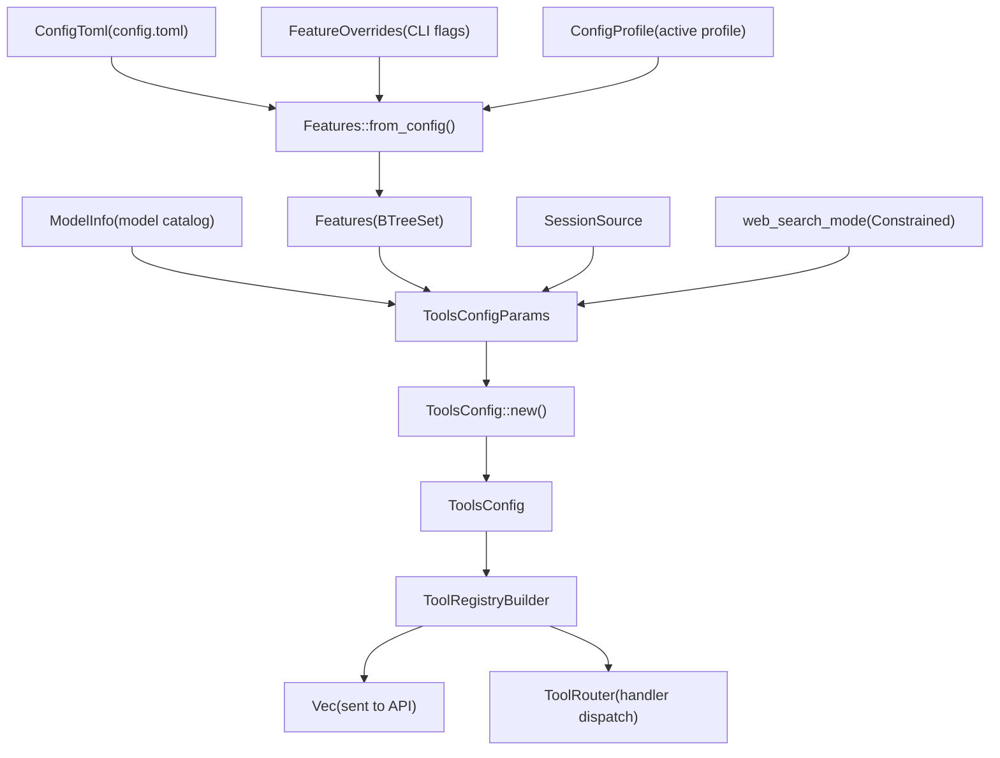
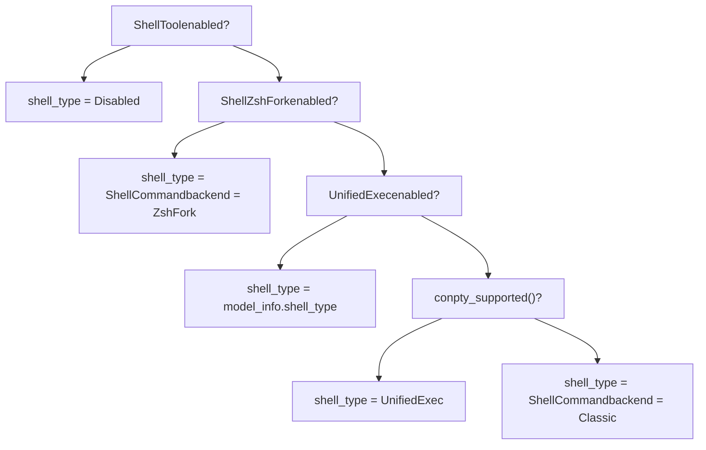
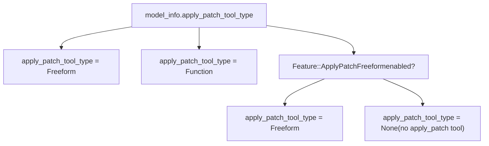
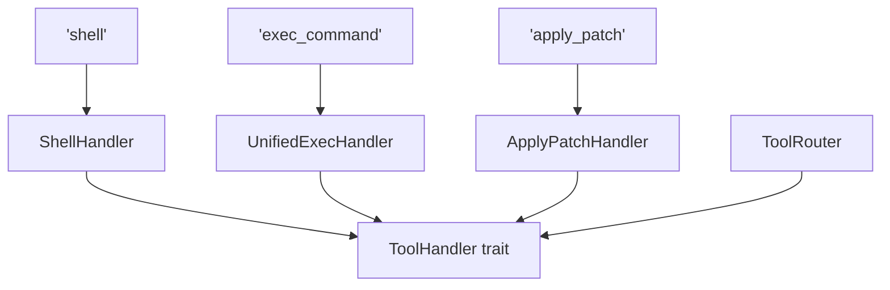

# Tool Registry and Configuration

Relevant source files

-   [codex-rs/core/config.schema.json](https://github.com/openai/codex/blob/d807d44a/codex-rs/core/config.schema.json)
-   [codex-rs/core/src/apply\_patch.rs](https://github.com/openai/codex/blob/d807d44a/codex-rs/core/src/apply_patch.rs)
-   [codex-rs/core/src/config/agent\_roles.rs](https://github.com/openai/codex/blob/d807d44a/codex-rs/core/src/config/agent_roles.rs)
-   [codex-rs/core/src/config/config\_tests.rs](https://github.com/openai/codex/blob/d807d44a/codex-rs/core/src/config/config_tests.rs)
-   [codex-rs/core/src/config/edit.rs](https://github.com/openai/codex/blob/d807d44a/codex-rs/core/src/config/edit.rs)
-   [codex-rs/core/src/config/mod.rs](https://github.com/openai/codex/blob/d807d44a/codex-rs/core/src/config/mod.rs)
-   [codex-rs/core/src/config/profile.rs](https://github.com/openai/codex/blob/d807d44a/codex-rs/core/src/config/profile.rs)
-   [codex-rs/core/src/config/types.rs](https://github.com/openai/codex/blob/d807d44a/codex-rs/core/src/config/types.rs)
-   [codex-rs/core/src/safety.rs](https://github.com/openai/codex/blob/d807d44a/codex-rs/core/src/safety.rs)
-   [codex-rs/core/src/sandbox\_tags.rs](https://github.com/openai/codex/blob/d807d44a/codex-rs/core/src/sandbox_tags.rs)
-   [codex-rs/core/src/tools/context.rs](https://github.com/openai/codex/blob/d807d44a/codex-rs/core/src/tools/context.rs)
-   [codex-rs/core/src/tools/handlers/apply\_patch.rs](https://github.com/openai/codex/blob/d807d44a/codex-rs/core/src/tools/handlers/apply_patch.rs)
-   [codex-rs/core/src/tools/handlers/mcp.rs](https://github.com/openai/codex/blob/d807d44a/codex-rs/core/src/tools/handlers/mcp.rs)
-   [codex-rs/core/src/tools/handlers/mod.rs](https://github.com/openai/codex/blob/d807d44a/codex-rs/core/src/tools/handlers/mod.rs)
-   [codex-rs/core/src/tools/handlers/plan.rs](https://github.com/openai/codex/blob/d807d44a/codex-rs/core/src/tools/handlers/plan.rs)
-   [codex-rs/core/src/tools/parallel.rs](https://github.com/openai/codex/blob/d807d44a/codex-rs/core/src/tools/parallel.rs)
-   [codex-rs/core/src/tools/registry.rs](https://github.com/openai/codex/blob/d807d44a/codex-rs/core/src/tools/registry.rs)
-   [codex-rs/core/src/tools/router.rs](https://github.com/openai/codex/blob/d807d44a/codex-rs/core/src/tools/router.rs)
-   [codex-rs/core/src/tools/spec.rs](https://github.com/openai/codex/blob/d807d44a/codex-rs/core/src/tools/spec.rs)
-   [codex-rs/core/src/tools/spec\_tests.rs](https://github.com/openai/codex/blob/d807d44a/codex-rs/core/src/tools/spec_tests.rs)
-   [codex-rs/core/src/turn\_metadata.rs](https://github.com/openai/codex/blob/d807d44a/codex-rs/core/src/turn_metadata.rs)
-   [codex-rs/hooks/BUILD.bazel](https://github.com/openai/codex/blob/d807d44a/codex-rs/hooks/BUILD.bazel)
-   [codex-rs/hooks/Cargo.toml](https://github.com/openai/codex/blob/d807d44a/codex-rs/hooks/Cargo.toml)
-   [codex-rs/hooks/src/lib.rs](https://github.com/openai/codex/blob/d807d44a/codex-rs/hooks/src/lib.rs)
-   [codex-rs/hooks/src/registry.rs](https://github.com/openai/codex/blob/d807d44a/codex-rs/hooks/src/registry.rs)
-   [codex-rs/hooks/src/types.rs](https://github.com/openai/codex/blob/d807d44a/codex-rs/hooks/src/types.rs)
-   [codex-rs/hooks/src/user\_notification.rs](https://github.com/openai/codex/blob/d807d44a/codex-rs/hooks/src/user_notification.rs)
-   [docs/config.md](https://github.com/openai/codex/blob/d807d44a/docs/config.md?plain=1)
-   [docs/example-config.md](https://github.com/openai/codex/blob/d807d44a/docs/example-config.md?plain=1)
-   [docs/skills.md](https://github.com/openai/codex/blob/d807d44a/docs/skills.md?plain=1)
-   [docs/slash\_commands.md](https://github.com/openai/codex/blob/d807d44a/docs/slash_commands.md?plain=1)

This page documents how Codex decides which tools are made available to the model in a given session. It covers `ToolsConfig`, `ToolsConfigParams`, the `Feature`/`Features` system, the `ToolRegistryBuilder`, `ToolRouter`, and the `ToolHandler` trait.

For how the tools themselves *execute* (shell, apply\_patch, unified exec, etc.) see pages [5.2](https://github.com/openai/codex/blob/d807d44a/5.2)–[5.8](https://github.com/openai/codex/blob/d807d44a/5.8) For MCP-specific tool configuration, see [6.1](https://github.com/openai/codex/blob/d807d44a/6.1) and [6.2](https://github.com/openai/codex/blob/d807d44a/6.2) For the overall sandbox and approval system, see [2.4](https://github.com/openai/codex/blob/d807d44a/2.4) and [5.5](https://github.com/openai/codex/blob/d807d44a/5.5) For the `Features` system as used outside of the tool context, see [2.3](https://github.com/openai/codex/blob/d807d44a/2.3)

---

## Overview

Every agent session calculates a set of tools once, before the first API request. Three inputs drive that calculation:

1.  **`ModelInfo`** — capabilities declared by the model catalog (e.g., which shell tool type the model expects, whether it supports image input, whether it has a built-in `apply_patch` function) \[codex-rs/core/src/tools/spec.rs:43-45\].
2.  **`Features`** — the resolved set of enabled feature flags, derived from `Config` + active profile + CLI overrides \[codex-rs/core/src/config/mod.rs:64-68\].
3.  **`SessionSource`** — whether this is a top-level session or a sub-agent (affects agent-jobs worker tools) \[codex-rs/core/src/tools/spec.rs:47-48\].

These inputs produce a `ToolsConfig` value. `ToolsConfig` is consumed by `ToolRegistryBuilder` to emit both `ToolSpec` values sent to the model API and a `ToolRouter` that routes incoming tool-call responses to handler implementations \[codex-rs/core/src/tools/registry.rs:31-32\].

**Data Flow — Config to Registry**


Sources: [codex-rs/core/src/tools/spec.rs48-162](https://github.com/openai/codex/blob/d807d44a/codex-rs/core/src/tools/spec.rs#L48-L162) [codex-rs/core/src/tools/registry.rs58-77](https://github.com/openai/codex/blob/d807d44a/codex-rs/core/src/tools/registry.rs#L58-L77)

---

## `ToolsConfig` and `ToolsConfigParams`

`ToolsConfig` is the resolved tool configuration for one session. `ToolsConfigParams` is the short-lived input bundle passed to its constructor.

### `ToolsConfigParams`

\[codex-rs/core/src/tools/spec.rs:67-72\]

| Field | Type | Description |
| --- | --- | --- |
| `model_info` | `&ModelInfo` | Model catalog entry for the active model |
| `features` | `&Features` | Resolved feature flag set |
| `web_search_mode` | `Option<WebSearchMode>` | Effective web search mode for the session |
| `session_source` | `SessionSource` | Top-level vs sub-agent context |

### `ToolsConfig` fields

\[codex-rs/core/src/tools/spec.rs:48-65\]

| Field | Type | Controls |
| --- | --- | --- |
| `shell_type` | `ConfigShellToolType` | Which shell tool variant is exposed (`Disabled`, `ShellCommand`, `UnifiedExec`) |
| `shell_command_backend` | `ShellCommandBackendConfig` | `Classic` or `ZshFork` backend for shell execution |
| `allow_login_shell` | `bool` | Whether the `login` parameter is included in shell tool schemas |
| `apply_patch_tool_type` | `Option<ApplyPatchToolType>` | `Freeform`, `Function`, or `None` (no apply\_patch tool) |
| `web_search_mode` | `Option<WebSearchMode>` | Passed through from params |
| `agent_roles` | `BTreeMap<String, AgentRoleConfig>` | Roles for multi-agent sub-agent spawning |
| `search_tool` | `bool` | BM25 search tool (enabled when `Feature::Apps` is on) |
| `request_permission_enabled` | `bool` | Whether models may request additional sandbox permissions |
| `js_repl_enabled` | `bool` | JavaScript REPL tool |
| `js_repl_tools_only` | `bool` | Force all tool calls through `js_repl` |
| `collab_tools` | `bool` | Multi-agent collaboration tools |
| `presentation_artifact` | `bool` | Presentation artifact tool |
| `default_mode_request_user_input` | `bool` | Allow `request_user_input` in Default collaboration mode |
| `experimental_supported_tools` | `Vec<String>` | Extra tool names declared by the model catalog |
| `agent_jobs_tools` | `bool` | Agent job scheduling tools |
| `agent_jobs_worker_tools` | `bool` | Worker-side job tools (only for `agent_job:` sub-agents) |

Sources: [codex-rs/core/src/tools/spec.rs48-162](https://github.com/openai/codex/blob/d807d44a/codex-rs/core/src/tools/spec.rs#L48-L162)

---

## Tool Selection Logic

### Shell Tool Type Selection

`ToolsConfig::new()` selects `ConfigShellToolType` by priority \[codex-rs/core/src/tools/spec.rs:93-113\]:

**Shell Type Decision Logic**


Sources: [codex-rs/core/src/tools/spec.rs93-113](https://github.com/openai/codex/blob/d807d44a/codex-rs/core/src/tools/spec.rs#L93-L113)

### `apply_patch` Tool Selection

The `apply_patch_tool_type` field on `ToolsConfig` is determined by merging model catalog preferences with the `ApplyPatchFreeform` feature flag \[codex-rs/core/src/tools/spec.rs:115-125\]:


Sources: [codex-rs/core/src/tools/spec.rs115-125](https://github.com/openai/codex/blob/d807d44a/codex-rs/core/src/tools/spec.rs#L115-L125)

---

## `ToolRouter` and `ToolHandler`

### `ToolRouter`

The `ToolRouter` handles the dispatch of tool calls to their respective handlers \[codex-rs/core/src/tools/router.rs:23\]. It manages parallel execution locks to ensure that tools that do not support concurrency are executed serially \[codex-rs/core/src/tools/parallel.rs:106-110\].

### `ToolHandler` trait

Handlers implement the logic for executing a specific tool call. Key handlers include:

| Handler Class | File Path | Tool Name(s) |
| --- | --- | --- |
| `ShellHandler` | \[codex-rs/core/src/tools/handlers/mod.rs:54\] | `shell` |
| `ShellCommandHandler` | \[codex-rs/core/src/tools/handlers/mod.rs:53\] | `shell_command` |
| `UnifiedExecHandler` | \[codex-rs/core/src/tools/handlers/mod.rs:61\] | `exec_command`, `write_stdin` |
| `ApplyPatchHandler` | \[codex-rs/core/src/tools/handlers/mod.rs:36\] | `apply_patch` |
| `JsReplHandler` | \[codex-rs/core/src/tools/handlers/mod.rs:42\] | `js_repl` |
| `McpHandler` | \[codex-rs/core/src/tools/handlers/mod.rs:45\] | (Dynamic from MCP servers) |

**Code Entity Space — Handler Mapping**


Sources: [codex-rs/core/src/tools/handlers/mod.rs34-62](https://github.com/openai/codex/blob/d807d44a/codex-rs/core/src/tools/handlers/mod.rs#L34-L62) [codex-rs/core/src/tools/router.rs23](https://github.com/openai/codex/blob/d807d44a/codex-rs/core/src/tools/router.rs#L23-L23)

---

## `ToolSpec` — Model-Facing Tool Definitions

`ToolSpec` is the type passed to the API request's `tools` array. Factory functions in `spec.rs` generate these definitions based on `ToolsConfig` \[codex-rs/core/src/tools/spec.rs:31\].

| Factory Function | Tool Name | Description |
| --- | --- | --- |
| `create_shell_tool` | `shell` | Standard shell execution tool \[codex-rs/core/src/tools/spec.rs:10\]. |
| `create_apply_patch_json_tool` | `apply_patch` | JSON-based patch application \[codex-rs/core/src/tools/spec.rs:25\]. |
| `create_apply_patch_freeform_tool` | `apply_patch` | Text-based patch application \[codex-rs/core/src/tools/spec.rs:24\]. |

The schemas include sandbox parameters such as `sandbox_permissions` and `justification` when `request_permission_enabled` is true \[codex-rs/core/src/tools/spec.rs:29\].

Sources: [codex-rs/core/src/tools/spec.rs1-50](https://github.com/openai/codex/blob/d807d44a/codex-rs/core/src/tools/spec.rs#L1-L50)

---

## Configuration via `config.toml`

Tool behavior is heavily influenced by the `[mcp_servers]` and `[tools]` tables in `config.toml`.

### MCP Server Configuration

Users can define external tool providers via the `[mcp_servers]` table \[codex-rs/core/src/config/types.rs:68\].

```
[mcp_servers.my-server]command = "npx"args = ["-y", "@modelcontextprotocol/server-everything"]enabled = true
```
| Field | Type | Description |
| --- | --- | --- |
| `command` | `String` | The command to start the stdio-based MCP server \[codex-rs/core/src/config/types.rs:119\]. |
| `args` | `Vec<String>` | Arguments for the command \[codex-rs/core/src/config/types.rs:121\]. |
| `enabled_tools` | `Vec<String>` | Allow-list of tools to register \[codex-rs/core/src/config/types.rs:98\]. |
| `disabled_tools` | `Vec<String>` | Deny-list of tools to ignore \[codex-rs/core/src/config/types.rs:102\]. |

Sources: [codex-rs/core/src/config/types.rs68-157](https://github.com/openai/codex/blob/d807d44a/codex-rs/core/src/config/types.rs#L68-L157) [codex-rs/core/src/config/edit.rs48](https://github.com/openai/codex/blob/d807d44a/codex-rs/core/src/config/edit.rs#L48-L48)
