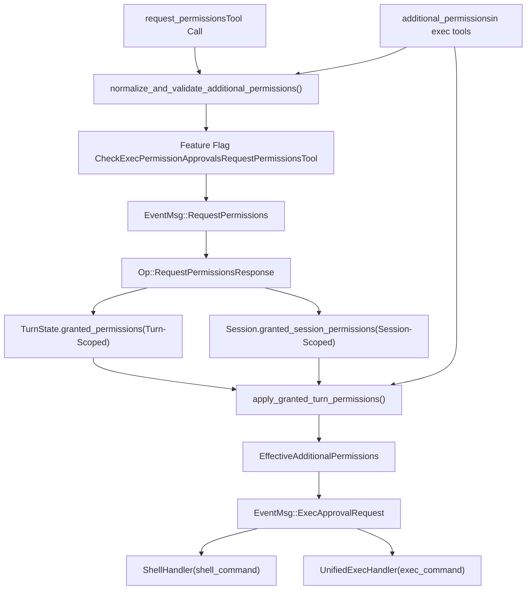
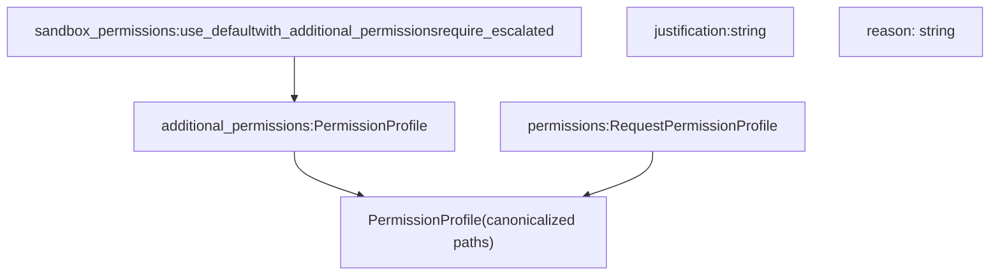
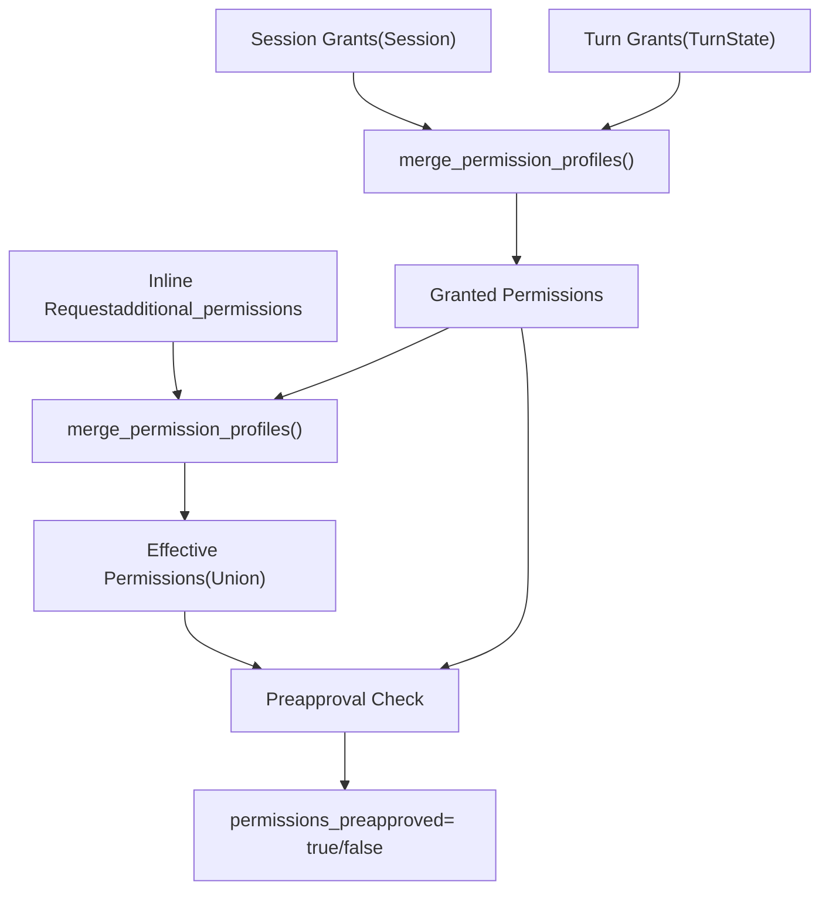

# Permission Request System

Relevant source files

-   [codex-rs/core/config.schema.json](https://github.com/openai/codex/blob/d807d44a/codex-rs/core/config.schema.json)
-   [codex-rs/core/src/config/agent\_roles.rs](https://github.com/openai/codex/blob/d807d44a/codex-rs/core/src/config/agent_roles.rs)
-   [codex-rs/core/src/config/config\_tests.rs](https://github.com/openai/codex/blob/d807d44a/codex-rs/core/src/config/config_tests.rs)
-   [codex-rs/core/src/config/edit.rs](https://github.com/openai/codex/blob/d807d44a/codex-rs/core/src/config/edit.rs)
-   [codex-rs/core/src/config/mod.rs](https://github.com/openai/codex/blob/d807d44a/codex-rs/core/src/config/mod.rs)
-   [codex-rs/core/src/config/profile.rs](https://github.com/openai/codex/blob/d807d44a/codex-rs/core/src/config/profile.rs)
-   [codex-rs/core/src/config/types.rs](https://github.com/openai/codex/blob/d807d44a/codex-rs/core/src/config/types.rs)
-   [codex-rs/core/src/exec\_policy.rs](https://github.com/openai/codex/blob/d807d44a/codex-rs/core/src/exec_policy.rs)
-   [codex-rs/core/src/exec\_policy\_tests.rs](https://github.com/openai/codex/blob/d807d44a/codex-rs/core/src/exec_policy_tests.rs)
-   [codex-rs/core/src/tasks/review.rs](https://github.com/openai/codex/blob/d807d44a/codex-rs/core/src/tasks/review.rs)
-   [codex-rs/core/src/tools/handlers/mod.rs](https://github.com/openai/codex/blob/d807d44a/codex-rs/core/src/tools/handlers/mod.rs)
-   [codex-rs/core/src/tools/spec.rs](https://github.com/openai/codex/blob/d807d44a/codex-rs/core/src/tools/spec.rs)
-   [codex-rs/core/src/tools/spec\_tests.rs](https://github.com/openai/codex/blob/d807d44a/codex-rs/core/src/tools/spec_tests.rs)
-   [codex-rs/core/tests/suite/approvals.rs](https://github.com/openai/codex/blob/d807d44a/codex-rs/core/tests/suite/approvals.rs)
-   [codex-rs/core/tests/suite/codex\_delegate.rs](https://github.com/openai/codex/blob/d807d44a/codex-rs/core/tests/suite/codex_delegate.rs)
-   [codex-rs/core/tests/suite/otel.rs](https://github.com/openai/codex/blob/d807d44a/codex-rs/core/tests/suite/otel.rs)
-   [codex-rs/core/tests/suite/review.rs](https://github.com/openai/codex/blob/d807d44a/codex-rs/core/tests/suite/review.rs)
-   [docs/config.md](https://github.com/openai/codex/blob/d807d44a/docs/config.md?plain=1)
-   [docs/example-config.md](https://github.com/openai/codex/blob/d807d44a/docs/example-config.md?plain=1)
-   [docs/skills.md](https://github.com/openai/codex/blob/d807d44a/docs/skills.md?plain=1)
-   [docs/slash\_commands.md](https://github.com/openai/codex/blob/d807d44a/docs/slash_commands.md?plain=1)

The Permission Request System enables the AI agent to dynamically request additional sandbox permissions (filesystem, network, macOS-specific) during execution. This system allows controlled escalation beyond the base `SandboxPolicy` through explicit user approval, with grants that can persist for a single turn or an entire session.

For information about the base sandbox policies and enforcement mechanisms, see [Sandbox and Approval Policies (2.4)](https://github.com/openai/codex/blob/d807d44a/Sandbox and Approval Policies (2.4)) For tool execution orchestration and approval workflows, see [Tool Orchestration and Approval (5.5)](https://github.com/openai/codex/blob/d807d44a/Tool Orchestration and Approval (5.5))

---

## Overview

The permission request system operates through two distinct mechanisms:

1.  **Standalone `request_permissions` tool**: Explicit permission request before execution.
2.  **Inline `additional_permissions` field**: Permissions requested alongside exec tool calls (`shell_command`, `exec_command`).

Both mechanisms result in normalized `PermissionProfile` structures that can be stored as turn-scoped or session-scoped grants. These grants enable a "sticky permissions" pattern where subsequent tool calls automatically inherit previously-approved permissions without repeated user prompts.

**Sources:** [codex-rs/core/src/tools/spec.rs461-523](https://github.com/openai/codex/blob/d807d44a/codex-rs/core/src/tools/spec.rs#L461-L523) [codex-rs/core/src/tools/handlers/mod.rs102-229](https://github.com/openai/codex/blob/d807d44a/codex-rs/core/src/tools/handlers/mod.rs#L102-L229)

---

## System Architecture

### Permission Data Flow and Components

**Sources:** [codex-rs/core/src/tools/handlers/mod.rs102-229](https://github.com/openai/codex/blob/d807d44a/codex-rs/core/src/tools/handlers/mod.rs#L102-L229) [codex-rs/core/src/tools/spec.rs31-49](https://github.com/openai/codex/blob/d807d44a/codex-rs/core/src/tools/spec.rs#L31-L49) [codex-rs/core/src/config/mod.rs100-130](https://github.com/openai/codex/blob/d807d44a/codex-rs/core/src/config/mod.rs#L100-L130)

---

## Permission Schema Definitions

### Request Permission Profile Structure

The structure used by models to specify requested access levels is defined in the tool registry.

| Field | Type | Description |
| --- | --- | --- |
| `file_system` | `FileSystemPermissions` | Read/write path arrays for sandbox escalation |
| `network` | `NetworkPermissions` | Boolean flag to enable network access |
| `macos` | `MacOSPermissions` | Specific entitlements for macOS Seatbelt profiles |

### Tool Schema Integration

The `create_approval_parameters()` function conditionally includes the `additional_permissions` field based on the `exec_permission_approvals_enabled` feature flag [codex-rs/core/src/tools/spec.rs525-576](https://github.com/openai/codex/blob/d807d44a/codex-rs/core/src/tools/spec.rs#L525-L576) The `create_request_permissions_schema()` function defines the standalone tool schema [codex-rs/core/src/tools/spec.rs511-523](https://github.com/openai/codex/blob/d807d44a/codex-rs/core/src/tools/spec.rs#L511-L523)

**Sources:** [codex-rs/core/src/tools/spec.rs461-659](https://github.com/openai/codex/blob/d807d44a/codex-rs/core/src/tools/spec.rs#L461-L659) [codex-rs/core/src/config/mod.rs84-86](https://github.com/openai/codex/blob/d807d44a/codex-rs/core/src/config/mod.rs#L84-L86)

---

## Permission Request Methods

### Standalone `request_permissions` Tool

The agent can request permissions proactively. This emits an `EventMsg::RequestPermissions` event and awaits `Op::RequestPermissionsResponse`. The user can grant these permissions for the current turn or the entire session.

### Inline `additional_permissions`

Exec tools (`shell_command`, `exec_command`) accept an inline `additional_permissions` field when `sandbox_permissions` is set to `"with_additional_permissions"`. This triggers the standard `ExecApprovalRequest` flow with merged permissions.

**Sources:** [codex-rs/core/src/tools/spec.rs461-576](https://github.com/openai/codex/blob/d807d44a/codex-rs/core/src/tools/spec.rs#L461-L576) [codex-rs/core/src/tools/handlers/mod.rs102-159](https://github.com/openai/codex/blob/d807d44a/codex-rs/core/src/tools/handlers/mod.rs#L102-L159)

---

## Validation and Normalization

The `normalize_and_validate_additional_permissions()` function performs several critical checks:

1.  **Feature validation**: Ensures `Feature::ExecPermissionApprovals` is enabled [codex-rs/core/src/tools/handlers/mod.rs102-110](https://github.com/openai/codex/blob/d807d44a/codex-rs/core/src/tools/handlers/mod.rs#L102-L110)
2.  **Policy validation**: Confirms `AskForApproval::OnRequest` is configured for fresh requests [codex-rs/core/src/tools/handlers/mod.rs115-125](https://github.com/openai/codex/blob/d807d44a/codex-rs/core/src/tools/handlers/mod.rs#L115-L125)
3.  **Path normalization**: Resolves relative paths against the tool's `workdir` and canonicalizes them [codex-rs/core/src/tools/handlers/mod.rs130-145](https://github.com/openai/codex/blob/d807d44a/codex-rs/core/src/tools/handlers/mod.rs#L130-L145)
4.  **Emptiness check**: Rejects requests that contain no actual permission changes [codex-rs/core/src/tools/handlers/mod.rs150-159](https://github.com/openai/codex/blob/d807d44a/codex-rs/core/src/tools/handlers/mod.rs#L150-L159)

**Sources:** [codex-rs/core/src/tools/handlers/mod.rs102-159](https://github.com/openai/codex/blob/d807d44a/codex-rs/core/src/tools/handlers/mod.rs#L102-L159) [codex-rs/core/src/config/mod.rs100-101](https://github.com/openai/codex/blob/d807d44a/codex-rs/core/src/config/mod.rs#L100-L101)

---

## Grant Scopes and Persistence

| Scope | Storage Location | Access Method | Lifecycle |
| --- | --- | --- | --- |
| **Turn** | `TurnState.granted_permissions` | `Session::granted_turn_permissions()` | Cleared at `TurnComplete` |
| **Session** | `Session.granted_session_permissions` | `Session::granted_session_permissions()` | Persists across turns until session end |

The `apply_granted_turn_permissions()` function implements the "sticky permissions" pattern by merging inline requests with existing turn and session grants [codex-rs/core/src/tools/handlers/mod.rs184-229](https://github.com/openai/codex/blob/d807d44a/codex-rs/core/src/tools/handlers/mod.rs#L184-L229)

### Sticky Permissions Merge Logic

If the requested `EffectivePerms` are already covered by the union of `Granted` permissions, `permissions_preapproved` is set to `true`, and the user is not prompted again [codex-rs/core/src/tools/handlers/mod.rs210-225](https://github.com/openai/codex/blob/d807d44a/codex-rs/core/src/tools/handlers/mod.rs#L210-L225)

**Sources:** [codex-rs/core/src/tools/handlers/mod.rs167-229](https://github.com/openai/codex/blob/d807d44a/codex-rs/core/src/tools/handlers/mod.rs#L167-L229) [codex-rs/core/src/config/mod.rs128-130](https://github.com/openai/codex/blob/d807d44a/codex-rs/core/src/config/mod.rs#L128-L130)

---

## Approval Policies and Guardian

The system integrates with `AskForApproval` policies defined in the configuration.

-   **Granular Policy**: Includes a `request_permissions` flag. If `false`, the tool auto-denies without prompting the user [codex-rs/core/src/exec\_policy.rs130-153](https://github.com/openai/codex/blob/d807d44a/codex-rs/core/src/exec_policy.rs#L130-L153)
-   **Guardian Integration**: The `guardian_subagent` (configured via `ApprovalsReviewer`) can be used to automatically evaluate permission requests based on risk [codex-rs/core/src/config/mod.rs131-133](https://github.com/openai/codex/blob/d807d44a/codex-rs/core/src/config/mod.rs#L131-L133)

**Sources:** [codex-rs/core/src/exec\_policy.rs130-153](https://github.com/openai/codex/blob/d807d44a/codex-rs/core/src/exec_policy.rs#L130-L153) [codex-rs/core/src/config/mod.rs131-133](https://github.com/openai/codex/blob/d807d44a/codex-rs/core/src/config/mod.rs#L131-L133) [codex-rs/core/src/tasks/review.rs107-109](https://github.com/openai/codex/blob/d807d44a/codex-rs/core/src/tasks/review.rs#L107-L109)
