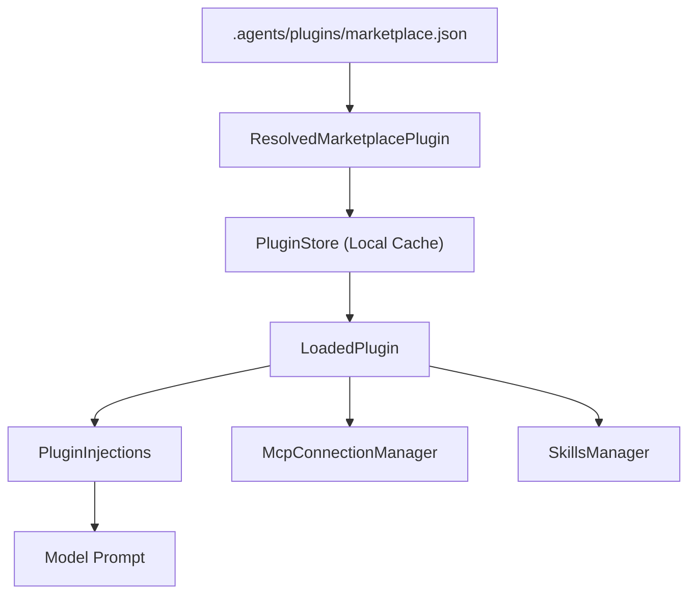

# Plugins System

Relevant source files

-   [codex-rs/app-server-protocol/schema/json/v2/PluginInstallResponse.json](https://github.com/openai/codex/blob/d807d44a/codex-rs/app-server-protocol/schema/json/v2/PluginInstallResponse.json)
-   [codex-rs/app-server-protocol/schema/json/v2/PluginListResponse.json](https://github.com/openai/codex/blob/d807d44a/codex-rs/app-server-protocol/schema/json/v2/PluginListResponse.json)
-   [codex-rs/app-server-protocol/schema/json/v2/PluginReadResponse.json](https://github.com/openai/codex/blob/d807d44a/codex-rs/app-server-protocol/schema/json/v2/PluginReadResponse.json)
-   [codex-rs/app-server-protocol/schema/typescript/v2/AppSummary.ts](https://github.com/openai/codex/blob/d807d44a/codex-rs/app-server-protocol/schema/typescript/v2/AppSummary.ts)
-   [codex-rs/app-server-protocol/schema/typescript/v2/PluginInstallResponse.ts](https://github.com/openai/codex/blob/d807d44a/codex-rs/app-server-protocol/schema/typescript/v2/PluginInstallResponse.ts)
-   [codex-rs/app-server/src/codex\_message\_processor/plugin\_app\_helpers.rs](https://github.com/openai/codex/blob/d807d44a/codex-rs/app-server/src/codex_message_processor/plugin_app_helpers.rs)
-   [codex-rs/app-server/tests/suite/v2/app\_list.rs](https://github.com/openai/codex/blob/d807d44a/codex-rs/app-server/tests/suite/v2/app_list.rs)
-   [codex-rs/app-server/tests/suite/v2/plugin\_install.rs](https://github.com/openai/codex/blob/d807d44a/codex-rs/app-server/tests/suite/v2/plugin_install.rs)
-   [codex-rs/app-server/tests/suite/v2/plugin\_list.rs](https://github.com/openai/codex/blob/d807d44a/codex-rs/app-server/tests/suite/v2/plugin_list.rs)
-   [codex-rs/app-server/tests/suite/v2/plugin\_read.rs](https://github.com/openai/codex/blob/d807d44a/codex-rs/app-server/tests/suite/v2/plugin_read.rs)
-   [codex-rs/chatgpt/src/connectors.rs](https://github.com/openai/codex/blob/d807d44a/codex-rs/chatgpt/src/connectors.rs)
-   [codex-rs/core/src/apps/render.rs](https://github.com/openai/codex/blob/d807d44a/codex-rs/core/src/apps/render.rs)
-   [codex-rs/core/src/arc\_monitor.rs](https://github.com/openai/codex/blob/d807d44a/codex-rs/core/src/arc_monitor.rs)
-   [codex-rs/core/src/arc\_monitor\_tests.rs](https://github.com/openai/codex/blob/d807d44a/codex-rs/core/src/arc_monitor_tests.rs)
-   [codex-rs/core/src/connectors.rs](https://github.com/openai/codex/blob/d807d44a/codex-rs/core/src/connectors.rs)
-   [codex-rs/core/src/connectors\_tests.rs](https://github.com/openai/codex/blob/d807d44a/codex-rs/core/src/connectors_tests.rs)
-   [codex-rs/core/src/consequential\_tool\_message\_templates.json](https://github.com/openai/codex/blob/d807d44a/codex-rs/core/src/consequential_tool_message_templates.json)
-   [codex-rs/core/src/mcp/mod.rs](https://github.com/openai/codex/blob/d807d44a/codex-rs/core/src/mcp/mod.rs)
-   [codex-rs/core/src/mcp/mod\_tests.rs](https://github.com/openai/codex/blob/d807d44a/codex-rs/core/src/mcp/mod_tests.rs)
-   [codex-rs/core/src/mcp\_tool\_approval\_templates.rs](https://github.com/openai/codex/blob/d807d44a/codex-rs/core/src/mcp_tool_approval_templates.rs)
-   [codex-rs/core/src/mcp\_tool\_call.rs](https://github.com/openai/codex/blob/d807d44a/codex-rs/core/src/mcp_tool_call.rs)
-   [codex-rs/core/src/mcp\_tool\_call\_tests.rs](https://github.com/openai/codex/blob/d807d44a/codex-rs/core/src/mcp_tool_call_tests.rs)
-   [codex-rs/core/src/plugins/discoverable.rs](https://github.com/openai/codex/blob/d807d44a/codex-rs/core/src/plugins/discoverable.rs)
-   [codex-rs/core/src/plugins/discoverable\_tests.rs](https://github.com/openai/codex/blob/d807d44a/codex-rs/core/src/plugins/discoverable_tests.rs)
-   [codex-rs/core/src/plugins/manager.rs](https://github.com/openai/codex/blob/d807d44a/codex-rs/core/src/plugins/manager.rs)
-   [codex-rs/core/src/plugins/manager\_tests.rs](https://github.com/openai/codex/blob/d807d44a/codex-rs/core/src/plugins/manager_tests.rs)
-   [codex-rs/core/src/plugins/marketplace.rs](https://github.com/openai/codex/blob/d807d44a/codex-rs/core/src/plugins/marketplace.rs)
-   [codex-rs/core/src/plugins/marketplace\_tests.rs](https://github.com/openai/codex/blob/d807d44a/codex-rs/core/src/plugins/marketplace_tests.rs)
-   [codex-rs/core/src/plugins/mod.rs](https://github.com/openai/codex/blob/d807d44a/codex-rs/core/src/plugins/mod.rs)
-   [codex-rs/core/src/plugins/render.rs](https://github.com/openai/codex/blob/d807d44a/codex-rs/core/src/plugins/render.rs)
-   [codex-rs/core/src/plugins/render\_tests.rs](https://github.com/openai/codex/blob/d807d44a/codex-rs/core/src/plugins/render_tests.rs)
-   [codex-rs/core/src/tools/discoverable.rs](https://github.com/openai/codex/blob/d807d44a/codex-rs/core/src/tools/discoverable.rs)
-   [codex-rs/core/src/tools/handlers/tool\_suggest.rs](https://github.com/openai/codex/blob/d807d44a/codex-rs/core/src/tools/handlers/tool_suggest.rs)
-   [codex-rs/core/src/turn\_metadata\_tests.rs](https://github.com/openai/codex/blob/d807d44a/codex-rs/core/src/turn_metadata_tests.rs)
-   [codex-rs/core/templates/search\_tool/tool\_description.md](https://github.com/openai/codex/blob/d807d44a/codex-rs/core/templates/search_tool/tool_description.md?plain=1)
-   [codex-rs/core/tests/common/apps\_test\_server.rs](https://github.com/openai/codex/blob/d807d44a/codex-rs/core/tests/common/apps_test_server.rs)
-   [codex-rs/core/tests/suite/plugins.rs](https://github.com/openai/codex/blob/d807d44a/codex-rs/core/tests/suite/plugins.rs)
-   [codex-rs/core/tests/suite/search\_tool.rs](https://github.com/openai/codex/blob/d807d44a/codex-rs/core/tests/suite/search_tool.rs)
-   [codex-rs/tui/src/bottom\_pane/mcp\_server\_elicitation.rs](https://github.com/openai/codex/blob/d807d44a/codex-rs/tui/src/bottom_pane/mcp_server_elicitation.rs)
-   [codex-rs/tui/src/bottom\_pane/snapshots/codex\_tui\_\_bottom\_pane\_\_mcp\_server\_elicitation\_\_tests\_\_mcp\_server\_elicitation\_approval\_form\_with\_param\_summary.snap](https://github.com/openai/codex/blob/d807d44a/codex-rs/tui/src/bottom_pane/snapshots/codex_tui__bottom_pane__mcp_server_elicitation__tests__mcp_server_elicitation_approval_form_with_param_summary.snap)
-   [codex-rs/tui/src/bottom\_pane/snapshots/codex\_tui\_\_bottom\_pane\_\_mcp\_server\_elicitation\_\_tests\_\_mcp\_server\_elicitation\_approval\_form\_with\_session\_persist.snap](https://github.com/openai/codex/blob/d807d44a/codex-rs/tui/src/bottom_pane/snapshots/codex_tui__bottom_pane__mcp_server_elicitation__tests__mcp_server_elicitation_approval_form_with_session_persist.snap)
-   [codex-rs/tui/src/bottom\_pane/snapshots/codex\_tui\_\_bottom\_pane\_\_mcp\_server\_elicitation\_\_tests\_\_mcp\_server\_elicitation\_approval\_form\_without\_schema.snap](https://github.com/openai/codex/blob/d807d44a/codex-rs/tui/src/bottom_pane/snapshots/codex_tui__bottom_pane__mcp_server_elicitation__tests__mcp_server_elicitation_approval_form_without_schema.snap)

The Plugins System provides an extensibility framework for Codex, allowing the discovery, installation, and execution of third-party capabilities. Plugins can bundle multiple entities, including **Skills** (natural language instructions), **MCP Servers** (external tool providers), and **App Connectors** (integrations with web services) [codex-rs/core/src/plugins/manager.rs145-157](https://github.com/openai/codex/blob/d807d44a/codex-rs/core/src/plugins/manager.rs#L145-L157)

## Overview and Marketplace

Plugins are distributed via **Marketplaces**, which are defined by a `marketplace.json` manifest file [codex-rs/core/src/plugins/marketplace.rs19-34](https://github.com/openai/codex/blob/d807d44a/codex-rs/core/src/plugins/marketplace.rs#L19-L34) Codex includes a built-in "OpenAI Curated" marketplace, but can also load local marketplaces from a repository's `.agents/plugins/` directory [codex-rs/core/src/plugins/marketplace.rs19-34](https://github.com/openai/codex/blob/d807d44a/codex-rs/core/src/plugins/marketplace.rs#L19-L34) [codex-rs/core/src/plugins/manager.rs71](https://github.com/openai/codex/blob/d807d44a/codex-rs/core/src/plugins/manager.rs#L71-L71)

### Plugin Lifecycle Data Flow

The following diagram illustrates how a plugin moves from a marketplace definition to being injected into an active session.

**Plugin Activation Flow**

Sources: [codex-rs/core/src/plugins/marketplace.rs146-150](https://github.com/openai/codex/blob/d807d44a/codex-rs/core/src/plugins/marketplace.rs#L146-L150) [codex-rs/core/src/plugins/manager.rs32-42](https://github.com/openai/codex/blob/d807d44a/codex-rs/core/src/plugins/manager.rs#L32-L42) [codex-rs/core/src/plugins/injection.rs15](https://github.com/openai/codex/blob/d807d44a/codex-rs/core/src/plugins/injection.rs#L15-L15) [codex-rs/core/src/plugins/mod.rs15-33](https://github.com/openai/codex/blob/d807d44a/codex-rs/core/src/plugins/mod.rs#L15-L33)

## PluginsManager

The `PluginsManager` is the central coordinator for plugin operations. It handles the discovery of marketplaces, the installation of plugins into a local cache, and the loading of plugin configurations into the system state [codex-rs/core/src/plugins/manager.rs32-63](https://github.com/openai/codex/blob/d807d44a/codex-rs/core/src/plugins/manager.rs#L32-L63)

### Key Structures

| Struct | Description |
| --- | --- |
| `LoadedPlugin` | Represents a plugin that has been validated and loaded from disk, containing its skills, MCP servers, and apps [codex-rs/core/src/plugins/manager.rs179-189](https://github.com/openai/codex/blob/d807d44a/codex-rs/core/src/plugins/manager.rs#L179-L189) |
| `PluginCapabilitySummary` | A high-level overview of what a plugin provides, used for telemetry and UI display [codex-rs/core/src/plugins/manager.rs198-205](https://github.com/openai/codex/blob/d807d44a/codex-rs/core/src/plugins/manager.rs#L198-L205) |
| `PluginInstallRequest` | Contains the plugin name and the absolute path to the marketplace manifest [codex-rs/core/src/plugins/manager.rs118-121](https://github.com/openai/codex/blob/d807d44a/codex-rs/core/src/plugins/manager.rs#L118-L121) |

Sources: [codex-rs/core/src/plugins/manager.rs118-205](https://github.com/openai/codex/blob/d807d44a/codex-rs/core/src/plugins/manager.rs#L118-L205)

## Plugin Installation and Storage

Plugins are installed to a local cache directory (typically `~/.codex/plugins/cache/`) [codex-rs/core/src/plugins/manager\_tests.rs89-90](https://github.com/openai/codex/blob/d807d44a/codex-rs/core/src/plugins/manager_tests.rs#L89-L90)

1.  **Resolution**: The system reads the `marketplace.json` to find the `MarketplacePluginSource` (currently supports `Local` paths) [codex-rs/core/src/plugins/marketplace.rs50-52](https://github.com/openai/codex/blob/d807d44a/codex-rs/core/src/plugins/marketplace.rs#L50-L52)
2.  **Validation**: It checks `MarketplacePluginPolicy` to ensure the plugin is available for the current `Product` (e.g., CHATGPT vs. ATLAS) [codex-rs/core/src/plugins/marketplace.rs55-61](https://github.com/openai/codex/blob/d807d44a/codex-rs/core/src/plugins/marketplace.rs#L55-L61)
3.  **Persistence**: The `PluginStore` manages the physical files and versions on disk [codex-rs/core/src/plugins/manager.rs26](https://github.com/openai/codex/blob/d807d44a/codex-rs/core/src/plugins/manager.rs#L26-L26)
4.  **Configuration**: Upon installation, the plugin is enabled in the user's `config.toml` under the `[plugins]` table [codex-rs/core/src/plugins/manager\_tests.rs54-56](https://github.com/openai/codex/blob/d807d44a/codex-rs/core/src/plugins/manager_tests.rs#L54-L56)

Sources: [codex-rs/core/src/plugins/marketplace.rs50-61](https://github.com/openai/codex/blob/d807d44a/codex-rs/core/src/plugins/marketplace.rs#L50-L61) [codex-rs/core/src/plugins/manager\_tests.rs54-90](https://github.com/openai/codex/blob/d807d44a/codex-rs/core/src/plugins/manager_tests.rs#L54-L90)

## Session Tool Injection

When a `Session` starts, the `PluginsManager` provides the `LoadedPlugin` set to the `McpManager` and `SkillsManager`.

### Tool and Skill Aggregation

Plugins contribute to the session in three ways:

1.  **Skills**: Markdown files in the plugin's `skills/` directory are loaded as natural language instructions [codex-rs/core/src/plugins/manager.rs68](https://github.com/openai/codex/blob/d807d44a/codex-rs/core/src/plugins/manager.rs#L68-L68) [codex-rs/core/src/plugins/manager\_tests.rs100-102](https://github.com/openai/codex/blob/d807d44a/codex-rs/core/src/plugins/manager_tests.rs#L100-L102)
2.  **MCP Servers**: Defined in `.mcp.json`, these are registered with the `McpConnectionManager`. Tool names are prefixed to avoid collisions (e.g., `mcp__<server>__<tool>`) [codex-rs/core/src/mcp/mod.rs31-33](https://github.com/openai/codex/blob/d807d44a/codex-rs/core/src/mcp/mod.rs#L31-L33) [codex-rs/core/src/plugins/manager\_tests.rs103-116](https://github.com/openai/codex/blob/d807d44a/codex-rs/core/src/plugins/manager_tests.rs#L103-L116)
3.  **App Connectors**: Defined in `.app.json`, these allow the agent to use "Codex Apps" (managed remote tools) [codex-rs/core/src/plugins/manager.rs70](https://github.com/openai/codex/blob/d807d44a/codex-rs/core/src/plugins/manager.rs#L70-L70) [codex-rs/core/src/plugins/manager\_tests.rs119-127](https://github.com/openai/codex/blob/d807d44a/codex-rs/core/src/plugins/manager_tests.rs#L119-L127)

### Tool Call Handling

When the model invokes a plugin tool, `handle_mcp_tool_call` manages the execution.

**Tool Execution and Approval Logic**

> **[Mermaid sequence]**
> *(图表结构无法解析)*

Sources: [codex-rs/core/src/mcp\_tool\_call.rs56-121](https://github.com/openai/codex/blob/d807d44a/codex-rs/core/src/mcp_tool_call.rs#L56-L121) [codex-rs/core/src/mcp\_tool\_call.rs131-187](https://github.com/openai/codex/blob/d807d44a/codex-rs/core/src/mcp_tool_call.rs#L131-L187)

## Security and Sandboxing

Plugin tools are subject to the system's `SandboxPolicy`. Most plugin-provided MCP tools default to requiring user approval unless the `AppToolPolicy` specifies `Auto` approval [codex-rs/core/src/mcp\_tool\_call.rs137](https://github.com/openai/codex/blob/d807d44a/codex-rs/core/src/mcp_tool_call.rs#L137-L137) [codex-rs/core/src/connectors.rs61-68](https://github.com/openai/codex/blob/d807d44a/codex-rs/core/src/connectors.rs#L61-L68)

-   **Policy Lookup**: `connectors::app_tool_policy` determines if a tool is enabled and what its approval requirements are [codex-rs/core/src/mcp\_tool\_call.rs86-102](https://github.com/openai/codex/blob/d807d44a/codex-rs/core/src/mcp_tool_call.rs#L86-L102)
-   **Elicitation**: If an MCP server requires additional configuration or authentication (OAuth) during a tool call, the system triggers an "Elicitation Request" to the UI [codex-rs/core/src/mcp\_tool\_call.rs5-8](https://github.com/openai/codex/blob/d807d44a/codex-rs/core/src/mcp_tool_call.rs#L5-L8) [codex-rs/core/src/mcp\_tool\_call.rs46-47](https://github.com/openai/codex/blob/d807d44a/codex-rs/core/src/mcp_tool_call.rs#L46-L47)

Sources: [codex-rs/core/src/mcp\_tool\_call.rs5-137](https://github.com/openai/codex/blob/d807d44a/codex-rs/core/src/mcp_tool_call.rs#L5-L137) [codex-rs/core/src/connectors.rs61-68](https://github.com/openai/codex/blob/d807d44a/codex-rs/core/src/connectors.rs#L61-L68)
