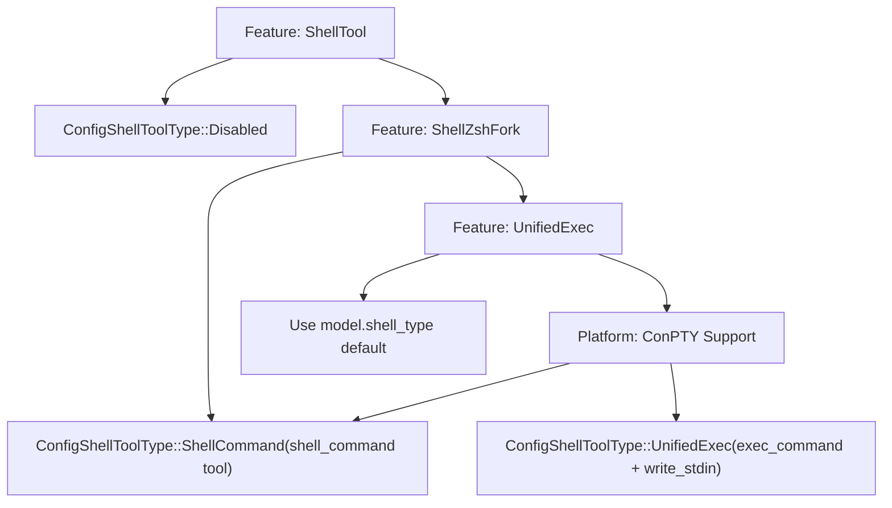
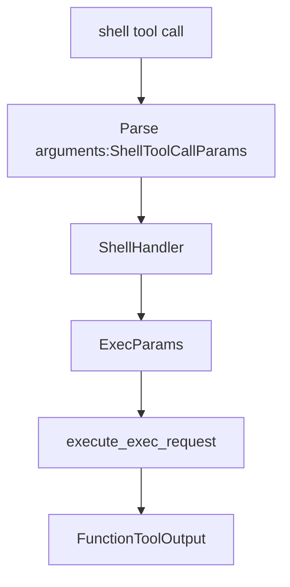
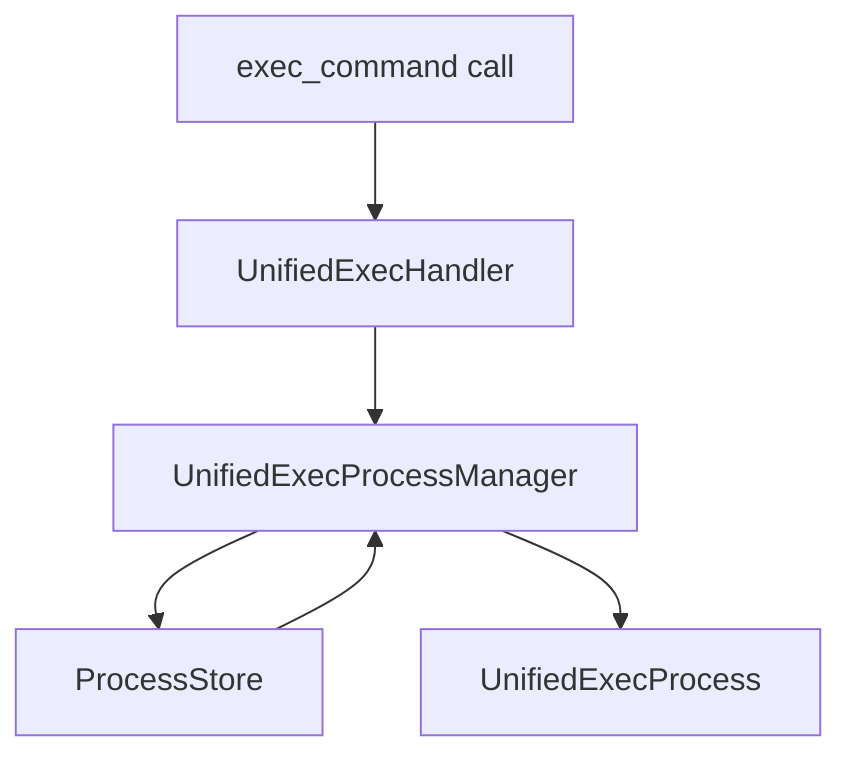

# Shell Execution Tools

Relevant source files

-   [codex-rs/app-server/src/command\_exec.rs](https://github.com/openai/codex/blob/d807d44a/codex-rs/app-server/src/command_exec.rs)
-   [codex-rs/core/src/environment\_context.rs](https://github.com/openai/codex/blob/d807d44a/codex-rs/core/src/environment_context.rs)
-   [codex-rs/core/src/exec.rs](https://github.com/openai/codex/blob/d807d44a/codex-rs/core/src/exec.rs)
-   [codex-rs/core/src/sandboxing/mod.rs](https://github.com/openai/codex/blob/d807d44a/codex-rs/core/src/sandboxing/mod.rs)
-   [codex-rs/core/src/shell.rs](https://github.com/openai/codex/blob/d807d44a/codex-rs/core/src/shell.rs)
-   [codex-rs/core/src/tasks/user\_shell.rs](https://github.com/openai/codex/blob/d807d44a/codex-rs/core/src/tasks/user_shell.rs)
-   [codex-rs/core/src/tools/events.rs](https://github.com/openai/codex/blob/d807d44a/codex-rs/core/src/tools/events.rs)
-   [codex-rs/core/src/tools/handlers/shell.rs](https://github.com/openai/codex/blob/d807d44a/codex-rs/core/src/tools/handlers/shell.rs)
-   [codex-rs/core/src/tools/handlers/unified\_exec.rs](https://github.com/openai/codex/blob/d807d44a/codex-rs/core/src/tools/handlers/unified_exec.rs)
-   [codex-rs/core/src/tools/orchestrator.rs](https://github.com/openai/codex/blob/d807d44a/codex-rs/core/src/tools/orchestrator.rs)
-   [codex-rs/core/src/tools/runtimes/apply\_patch.rs](https://github.com/openai/codex/blob/d807d44a/codex-rs/core/src/tools/runtimes/apply_patch.rs)
-   [codex-rs/core/src/tools/runtimes/mod.rs](https://github.com/openai/codex/blob/d807d44a/codex-rs/core/src/tools/runtimes/mod.rs)
-   [codex-rs/core/src/tools/runtimes/shell.rs](https://github.com/openai/codex/blob/d807d44a/codex-rs/core/src/tools/runtimes/shell.rs)
-   [codex-rs/core/src/tools/runtimes/unified\_exec.rs](https://github.com/openai/codex/blob/d807d44a/codex-rs/core/src/tools/runtimes/unified_exec.rs)
-   [codex-rs/core/src/tools/sandboxing.rs](https://github.com/openai/codex/blob/d807d44a/codex-rs/core/src/tools/sandboxing.rs)
-   [codex-rs/core/src/unified\_exec/async\_watcher.rs](https://github.com/openai/codex/blob/d807d44a/codex-rs/core/src/unified_exec/async_watcher.rs)
-   [codex-rs/core/src/unified\_exec/errors.rs](https://github.com/openai/codex/blob/d807d44a/codex-rs/core/src/unified_exec/errors.rs)
-   [codex-rs/core/src/unified\_exec/mod.rs](https://github.com/openai/codex/blob/d807d44a/codex-rs/core/src/unified_exec/mod.rs)
-   [codex-rs/core/src/unified\_exec/process\_manager.rs](https://github.com/openai/codex/blob/d807d44a/codex-rs/core/src/unified_exec/process_manager.rs)
-   [codex-rs/core/tests/suite/exec.rs](https://github.com/openai/codex/blob/d807d44a/codex-rs/core/tests/suite/exec.rs)
-   [codex-rs/core/tests/suite/shell\_command.rs](https://github.com/openai/codex/blob/d807d44a/codex-rs/core/tests/suite/shell_command.rs)
-   [codex-rs/core/tests/suite/unified\_exec.rs](https://github.com/openai/codex/blob/d807d44a/codex-rs/core/tests/suite/unified_exec.rs)
-   [codex-rs/features/src/lib.rs](https://github.com/openai/codex/blob/d807d44a/codex-rs/features/src/lib.rs)
-   [codex-rs/linux-sandbox/tests/suite/landlock.rs](https://github.com/openai/codex/blob/d807d44a/codex-rs/linux-sandbox/tests/suite/landlock.rs)
-   [codex-rs/tui/src/exec\_command.rs](https://github.com/openai/codex/blob/d807d44a/codex-rs/tui/src/exec_command.rs)
-   [codex-rs/tui/src/snapshots/codex\_tui\_\_status\_indicator\_widget\_\_tests\_\_renders\_wrapped\_details\_panama\_two\_lines.snap](https://github.com/openai/codex/blob/d807d44a/codex-rs/tui/src/snapshots/codex_tui__status_indicator_widget__tests__renders_wrapped_details_panama_two_lines.snap)
-   [codex-rs/tui/src/text\_formatting.rs](https://github.com/openai/codex/blob/d807d44a/codex-rs/tui/src/text_formatting.rs)

This page documents the shell execution tools that enable Codex to run commands on the user's system. These tools are the primary interface for executing shell commands, managing interactive processes, and handling multi-turn command interactions.

For information about sandbox enforcement and approval workflows, see **5.5 Tool Orchestration and Approval**. For details on the UnifiedExec process management system, see **5.3 Unified Exec Process Management**. For shell backend selection and configuration, see **5.1 Tool Registry and Configuration**.

## Overview

Codex provides three main shell execution tools, each serving different use cases:

| Tool Name | Purpose | Session Type | Backend Options |
| --- | --- | --- | --- |
| `shell` | Execute array-style commands | Non-interactive | Classic, ZshFork |
| `shell_command` | Execute script-style commands | Non-interactive | Classic, ZshFork |
| `exec_command` | Interactive PTY sessions | Interactive | Direct, ZshFork |
| `write_stdin` | Write to running exec sessions | Interactive | Same as exec\_command |

The tool selection is controlled by the `ConfigShellToolType` enum, which determines which tools are exposed to the model based on configuration and platform capabilities.

**Sources:** [codex-rs/core/src/tools/spec.rs199-262](https://github.com/openai/codex/blob/d807d44a/codex-rs/core/src/tools/spec.rs#L199-L262) [codex-rs/core/src/tools/handlers/shell.rs41-49](https://github.com/openai/codex/blob/d807d44a/codex-rs/core/src/tools/handlers/shell.rs#L41-L49)

## Tool Type Selection

The selection logic prioritizes the ZshFork backend when enabled, falls back to UnifiedExec when available, and uses the model's default `shell_type` otherwise. On Windows, ConPTY support is checked before enabling UnifiedExec.

**Diagram: Shell Tool Type Selection Flow**

**Sources:** [codex-rs/core/src/tools/spec.rs312-328](https://github.com/openai/codex/blob/d807d44a/codex-rs/core/src/tools/spec.rs#L312-L328) [codex-rs/core/src/tools/spec.rs211-239](https://github.com/openai/codex/blob/d807d44a/codex-rs/core/src/tools/spec.rs#L211-L239)

## Backend Configuration

### ShellCommandBackendConfig

Controls the execution backend for `shell` and `shell_command` tools. It maps to `ShellCommandBackend` in the handler [codex-rs/core/src/tools/handlers/shell.rs41-49](https://github.com/openai/codex/blob/d807d44a/codex-rs/core/src/tools/handlers/shell.rs#L41-L49)

-   **Classic**: Standard process spawning via the platform shell.
-   **ZshFork**: Custom patched Zsh binary for enhanced control and shell-escalation.

**Sources:** [codex-rs/core/src/tools/spec.rs199-203](https://github.com/openai/codex/blob/d807d44a/codex-rs/core/src/tools/spec.rs#L199-L203) [codex-rs/core/src/tools/handlers/shell.rs89-95](https://github.com/openai/codex/blob/d807d44a/codex-rs/core/src/tools/handlers/shell.rs#L89-L95)

### UnifiedExecBackendConfig

Controls the execution backend for `exec_command` and `write_stdin` tools.

-   **Direct**: Native PTY allocation via platform APIs (e.g., `codex_utils_pty`).
-   **ZshFork**: Uses the custom Zsh binary for PTY sessions.

**Sources:** [codex-rs/core/src/tools/spec.rs205-209](https://github.com/openai/codex/blob/d807d44a/codex-rs/core/src/tools/spec.rs#L205-L209) [codex-rs/core/src/unified\_exec/mod.rs1-22](https://github.com/openai/codex/blob/d807d44a/codex-rs/core/src/unified_exec/mod.rs#L1-L22)

## Tool Specifications

### shell Tool

The `shell` tool executes commands as an array of arguments passed directly to the system's process spawner.

**Diagram: shell Tool Execution Flow**

**Implementation Details:**

-   **Parameters**: `command` (string array), `workdir`, `timeout_ms`, `sandbox_permissions`.
-   **Unix**: Commands are passed to `execvp()` with shell wrapping (e.g., `bash -lc`). [codex-rs/core/src/shell.rs45-52](https://github.com/openai/codex/blob/d807d44a/codex-rs/core/src/shell.rs#L45-L52)
-   **Windows**: Executes via `powershell.exe -Command` or `cmd /c`. [codex-rs/core/src/shell.rs53-69](https://github.com/openai/codex/blob/d807d44a/codex-rs/core/src/shell.rs#L53-L69)

**Sources:** [codex-rs/core/src/tools/spec.rs760-815](https://github.com/openai/codex/blob/d807d44a/codex-rs/core/src/tools/spec.rs#L760-L815) [codex-rs/core/src/tools/handlers/shell.rs155-212](https://github.com/openai/codex/blob/d807d44a/codex-rs/core/src/tools/handlers/shell.rs#L155-L212) [codex-rs/core/src/exec.rs77-89](https://github.com/openai/codex/blob/d807d44a/codex-rs/core/src/exec.rs#L77-L89)

### shell\_command Tool

The `shell_command` tool executes a script string in the user's default shell.

**Parameters:**

-   `command`: Shell script string (e.g., `"ls -la | grep txt"`).
-   `login`: Whether to run as a login shell (defaults to true). [codex-rs/core/src/tools/handlers/shell.rs97-108](https://github.com/openai/codex/blob/d807d44a/codex-rs/core/src/tools/handlers/shell.rs#L97-L108)

The `ShellCommandHandler` uses `Shell::derive_exec_args` to transform the string into a process-ready argument list. [codex-rs/core/src/shell.rs43-70](https://github.com/openai/codex/blob/d807d44a/codex-rs/core/src/shell.rs#L43-L70)

**Sources:** [codex-rs/core/src/tools/spec.rs817-886](https://github.com/openai/codex/blob/d807d44a/codex-rs/core/src/tools/spec.rs#L817-L886) [codex-rs/core/src/tools/handlers/shell.rs47-49](https://github.com/openai/codex/blob/d807d44a/codex-rs/core/src/tools/handlers/shell.rs#L47-L49) [codex-rs/core/src/shell.rs18-28](https://github.com/openai/codex/blob/d807d44a/codex-rs/core/src/shell.rs#L18-L28)

### exec\_command Tool

Creates interactive PTY sessions using the `UnifiedExecProcessManager`.

**Diagram: exec\_command Interactive Session Flow**

**Yield Logic:** The tool waits for output for a duration specified by `yield_time_ms` (clamped between 250ms and 30s). [codex-rs/core/src/unified\_exec/mod.rs57-60](https://github.com/openai/codex/blob/d807d44a/codex-rs/core/src/unified_exec/mod.rs#L57-L60) If the process is still running after this time, it returns a `session_id` to allow subsequent `write_stdin` calls.

**Sources:** [codex-rs/core/src/tools/handlers/unified\_exec.rs143-205](https://github.com/openai/codex/blob/d807d44a/codex-rs/core/src/tools/handlers/unified_exec.rs#L143-L205) [codex-rs/core/src/unified\_exec/process\_manager.rs155-200](https://github.com/openai/codex/blob/d807d44a/codex-rs/core/src/unified_exec/process_manager.rs#L155-L200) [codex-rs/core/src/unified\_exec/mod.rs123-126](https://github.com/openai/codex/blob/d807d44a/codex-rs/core/src/unified_exec/mod.rs#L123-L126)

### write\_stdin Tool

Writes input to an ongoing session identified by `session_id`.

**Usage Pattern:**

1.  Model calls `exec_command`, receives `session_id: 1024`.
2.  Model calls `write_stdin` with `session_id: 1024` and `chars: "y\n"`. [codex-rs/core/src/tools/handlers/unified\_exec.rs60-70](https://github.com/openai/codex/blob/d807d44a/codex-rs/core/src/tools/handlers/unified_exec.rs#L60-L70)
3.  `UnifiedExecProcessManager` retrieves the process from `ProcessStore` and writes to the PTY. [codex-rs/core/src/unified\_exec/process\_manager.rs215-240](https://github.com/openai/codex/blob/d807d44a/codex-rs/core/src/unified_exec/process_manager.rs#L215-L240)

**Sources:** [codex-rs/core/src/tools/spec.rs661-708](https://github.com/openai/codex/blob/d807d44a/codex-rs/core/src/tools/spec.rs#L661-L708) [codex-rs/core/src/unified\_exec/mod.rs102-108](https://github.com/openai/codex/blob/d807d44a/codex-rs/core/src/unified_exec/mod.rs#L102-L108)

## UnifiedExec Session Management

The `UnifiedExecProcessManager` maintains a session-scoped cache of running processes.

-   **ProcessStore**: A mutex-protected map of `i32` process IDs to `ProcessEntry`. [codex-rs/core/src/unified\_exec/mod.rs111-121](https://github.com/openai/codex/blob/d807d44a/codex-rs/core/src/unified_exec/mod.rs#L111-L121)
-   **LRU Pruning**: The store limits the number of active processes to 64. [codex-rs/core/src/unified\_exec/mod.rs65](https://github.com/openai/codex/blob/d807d44a/codex-rs/core/src/unified_exec/mod.rs#L65-L65)
-   **ProcessEntry**: Contains the `Arc<UnifiedExecProcess>`, `tty` state, and `network_approval_id`. [codex-rs/core/src/unified\_exec/mod.rs144-153](https://github.com/openai/codex/blob/d807d44a/codex-rs/core/src/unified_exec/mod.rs#L144-L153)

**Sources:** [codex-rs/core/src/unified\_exec/mod.rs123-136](https://github.com/openai/codex/blob/d807d44a/codex-rs/core/src/unified_exec/mod.rs#L123-L136) [codex-rs/core/src/unified\_exec/process\_manager.rs106-131](https://github.com/openai/codex/blob/d807d44a/codex-rs/core/src/unified_exec/process_manager.rs#L106-L131)

## Tool Handler Implementation

All shell handlers follow a common execution pipeline within `handle()`:

1.  **Argument Parsing**: Uses `parse_arguments_with_base_path` to handle relative workdirs. [codex-rs/core/src/tools/handlers/unified\_exec.rs145-147](https://github.com/openai/codex/blob/d807d44a/codex-rs/core/src/tools/handlers/unified_exec.rs#L145-L147)
2.  **Skill Invocation**: Checks for implicit skill triggers via `maybe_emit_implicit_skill_invocation`. [codex-rs/core/src/tools/handlers/unified\_exec.rs148-154](https://github.com/openai/codex/blob/d807d44a/codex-rs/core/src/tools/handlers/unified_exec.rs#L148-L154)
3.  **Permission Resolution**: Merges turn-scoped grants and session-scoped grants using `apply_granted_turn_permissions`. [codex-rs/core/src/tools/handlers/unified\_exec.rs180-185](https://github.com/openai/codex/blob/d807d44a/codex-rs/core/src/tools/handlers/unified_exec.rs#L180-L185)
4.  **Approval Request**: Routes to `ToolOrchestrator` for user confirmation or Guardian review. [codex-rs/core/src/tools/runtimes/unified\_exec.rs108-161](https://github.com/openai/codex/blob/d807d44a/codex-rs/core/src/tools/runtimes/unified_exec.rs#L108-L161)
5.  **Execution**: Spawns the process via `execute_exec_request` or the `UnifiedExecProcessManager`. [codex-rs/core/src/exec.rs233-248](https://github.com/openai/codex/blob/d807d44a/codex-rs/core/src/exec.rs#L233-L248)

**Sources:** [codex-rs/core/src/tools/handlers/shell.rs181-212](https://github.com/openai/codex/blob/d807d44a/codex-rs/core/src/tools/handlers/shell.rs#L181-L212) [codex-rs/core/src/tools/handlers/unified\_exec.rs120-205](https://github.com/openai/codex/blob/d807d44a/codex-rs/core/src/tools/handlers/unified_exec.rs#L120-L205)

## Permission Integration

### Additional Permissions Validation

The system enforces strict validation on inline permission requests. If `exec_permission_approvals_enabled` is false, inline requests are rejected unless they were previously preapproved via the `request_permissions` tool. [codex-rs/core/src/tools/handlers/unified\_exec.rs177-189](https://github.com/openai/codex/blob/d807d44a/codex-rs/core/src/tools/handlers/unified_exec.rs#L177-L189)

### Effective Permissions

`EffectiveSandboxPermissions` merges the base `SandboxPolicy` with `PermissionProfile` extensions (network, file system, and macOS seatbelt profiles). [codex-rs/core/src/sandboxing/mod.rs122-151](https://github.com/openai/codex/blob/d807d44a/codex-rs/core/src/sandboxing/mod.rs#L122-L151)

**Sources:** [codex-rs/core/src/sandboxing/mod.rs153-178](https://github.com/openai/codex/blob/d807d44a/codex-rs/core/src/sandboxing/mod.rs#L153-L178) [codex-rs/core/src/tools/handlers/mod.rs183-229](https://github.com/openai/codex/blob/d807d44a/codex-rs/core/src/tools/handlers/mod.rs#L183-L229)

## Platform-Specific Behavior

### Windows

-   **ConPTY**: Required for `UnifiedExec`. [codex-rs/core/src/tools/spec.rs320-325](https://github.com/openai/codex/blob/d807d44a/codex-rs/core/src/tools/spec.rs#L320-L325)
-   **Restricted Token**: Platform-specific sandbox type. [codex-rs/core/src/exec.rs192](https://github.com/openai/codex/blob/d807d44a/codex-rs/core/src/exec.rs#L192-L192)

### Unix (Linux/macOS)

-   **ZshFork Backend**: Enabled via `ShellZshFork` feature flag. [codex-rs/core/src/tools/spec.rs294-305](https://github.com/openai/codex/blob/d807d44a/codex-rs/core/src/tools/spec.rs#L294-L305)
-   **Sandboxing**: Uses `LinuxSeccomp` (Landlock) or `MacosSeatbelt`. [codex-rs/core/src/exec.rs185-190](https://github.com/openai/codex/blob/d807d44a/codex-rs/core/src/exec.rs#L185-L190)
-   **Signal Handling**: Implements `kill_child_process_group` to clean up grandchild processes on timeout. [codex-rs/core/src/exec.rs42](https://github.com/openai/codex/blob/d807d44a/codex-rs/core/src/exec.rs#L42-L42)

**Sources:** [codex-rs/core/src/exec.rs1-8](https://github.com/openai/codex/blob/d807d44a/codex-rs/core/src/exec.rs#L1-L8) [codex-rs/core/src/shell.rs91-150](https://github.com/openai/codex/blob/d807d44a/codex-rs/core/src/shell.rs#L91-L150) [codex-rs/linux-sandbox/tests/suite/landlock.rs1-25](https://github.com/openai/codex/blob/d807d44a/codex-rs/linux-sandbox/tests/suite/landlock.rs#L1-L25)
