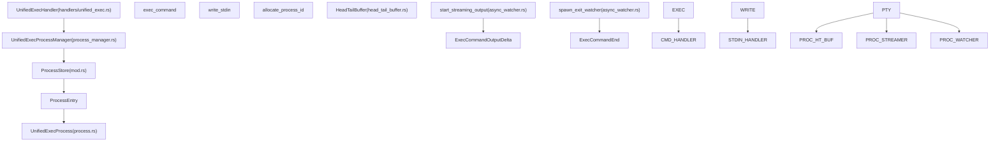

# Unified Exec Process Management

Relevant source files

-   [codex-rs/app-server/src/command\_exec.rs](https://github.com/openai/codex/blob/d807d44a/codex-rs/app-server/src/command_exec.rs)
-   [codex-rs/core/src/exec.rs](https://github.com/openai/codex/blob/d807d44a/codex-rs/core/src/exec.rs)
-   [codex-rs/core/src/memories/usage.rs](https://github.com/openai/codex/blob/d807d44a/codex-rs/core/src/memories/usage.rs)
-   [codex-rs/core/src/sandboxing/mod.rs](https://github.com/openai/codex/blob/d807d44a/codex-rs/core/src/sandboxing/mod.rs)
-   [codex-rs/core/src/spawn.rs](https://github.com/openai/codex/blob/d807d44a/codex-rs/core/src/spawn.rs)
-   [codex-rs/core/src/tasks/user\_shell.rs](https://github.com/openai/codex/blob/d807d44a/codex-rs/core/src/tasks/user_shell.rs)
-   [codex-rs/core/src/tools/events.rs](https://github.com/openai/codex/blob/d807d44a/codex-rs/core/src/tools/events.rs)
-   [codex-rs/core/src/tools/handlers/shell.rs](https://github.com/openai/codex/blob/d807d44a/codex-rs/core/src/tools/handlers/shell.rs)
-   [codex-rs/core/src/tools/handlers/unified\_exec.rs](https://github.com/openai/codex/blob/d807d44a/codex-rs/core/src/tools/handlers/unified_exec.rs)
-   [codex-rs/core/src/tools/handlers/unified\_exec\_tests.rs](https://github.com/openai/codex/blob/d807d44a/codex-rs/core/src/tools/handlers/unified_exec_tests.rs)
-   [codex-rs/core/src/tools/orchestrator.rs](https://github.com/openai/codex/blob/d807d44a/codex-rs/core/src/tools/orchestrator.rs)
-   [codex-rs/core/src/tools/runtimes/apply\_patch.rs](https://github.com/openai/codex/blob/d807d44a/codex-rs/core/src/tools/runtimes/apply_patch.rs)
-   [codex-rs/core/src/tools/runtimes/mod.rs](https://github.com/openai/codex/blob/d807d44a/codex-rs/core/src/tools/runtimes/mod.rs)
-   [codex-rs/core/src/tools/runtimes/shell.rs](https://github.com/openai/codex/blob/d807d44a/codex-rs/core/src/tools/runtimes/shell.rs)
-   [codex-rs/core/src/tools/runtimes/shell/zsh\_fork\_backend.rs](https://github.com/openai/codex/blob/d807d44a/codex-rs/core/src/tools/runtimes/shell/zsh_fork_backend.rs)
-   [codex-rs/core/src/tools/runtimes/unified\_exec.rs](https://github.com/openai/codex/blob/d807d44a/codex-rs/core/src/tools/runtimes/unified_exec.rs)
-   [codex-rs/core/src/tools/sandboxing.rs](https://github.com/openai/codex/blob/d807d44a/codex-rs/core/src/tools/sandboxing.rs)
-   [codex-rs/core/src/unified\_exec/async\_watcher.rs](https://github.com/openai/codex/blob/d807d44a/codex-rs/core/src/unified_exec/async_watcher.rs)
-   [codex-rs/core/src/unified\_exec/errors.rs](https://github.com/openai/codex/blob/d807d44a/codex-rs/core/src/unified_exec/errors.rs)
-   [codex-rs/core/src/unified\_exec/mod.rs](https://github.com/openai/codex/blob/d807d44a/codex-rs/core/src/unified_exec/mod.rs)
-   [codex-rs/core/src/unified\_exec/process.rs](https://github.com/openai/codex/blob/d807d44a/codex-rs/core/src/unified_exec/process.rs)
-   [codex-rs/core/src/unified\_exec/process\_manager.rs](https://github.com/openai/codex/blob/d807d44a/codex-rs/core/src/unified_exec/process_manager.rs)
-   [codex-rs/core/tests/suite/exec.rs](https://github.com/openai/codex/blob/d807d44a/codex-rs/core/tests/suite/exec.rs)
-   [codex-rs/core/tests/suite/unified\_exec.rs](https://github.com/openai/codex/blob/d807d44a/codex-rs/core/tests/suite/unified_exec.rs)
-   [codex-rs/linux-sandbox/tests/suite/landlock.rs](https://github.com/openai/codex/blob/d807d44a/codex-rs/linux-sandbox/tests/suite/landlock.rs)
-   [codex-rs/rmcp-client/tests/process\_group\_cleanup.rs](https://github.com/openai/codex/blob/d807d44a/codex-rs/rmcp-client/tests/process_group_cleanup.rs)
-   [codex-rs/utils/pty/README.md](https://github.com/openai/codex/blob/d807d44a/codex-rs/utils/pty/README.md?plain=1)
-   [codex-rs/utils/pty/src/pipe.rs](https://github.com/openai/codex/blob/d807d44a/codex-rs/utils/pty/src/pipe.rs)
-   [codex-rs/utils/pty/src/process.rs](https://github.com/openai/codex/blob/d807d44a/codex-rs/utils/pty/src/process.rs)
-   [codex-rs/utils/pty/src/process\_group.rs](https://github.com/openai/codex/blob/d807d44a/codex-rs/utils/pty/src/process_group.rs)
-   [codex-rs/utils/pty/src/pty.rs](https://github.com/openai/codex/blob/d807d44a/codex-rs/utils/pty/src/pty.rs)
-   [codex-rs/utils/pty/src/tests.rs](https://github.com/openai/codex/blob/d807d44a/codex-rs/utils/pty/src/tests.rs)

## Purpose and Scope

The Unified Exec system provides **interactive PTY-based process execution** orchestrated with approvals and sandboxing. Unlike standard shell execution tools, Unified Exec manages persistent pseudo-terminal (PTY) processes that can be reused across multiple tool calls, enabling stateful workflows where environment variables, working directories, and shell state persist.

This page documents the process management layer, including process lifecycle, ID allocation, output streaming, and LRU pruning.

**Sources**: [codex-rs/core/src/unified\_exec/mod.rs1-23](https://github.com/openai/codex/blob/d807d44a/codex-rs/core/src/unified_exec/mod.rs#L1-L23) [codex-rs/core/src/tools/handlers/unified\_exec.rs120-141](https://github.com/openai/codex/blob/d807d44a/codex-rs/core/src/tools/handlers/unified_exec.rs#L120-L141)

---

## Architecture Overview

The Unified Exec architecture bridges the gap between the high-level tool orchestration and low-level PTY management.


**Diagram: Unified Exec Component Architecture**

**Key Components**:

-   **UnifiedExecProcessManager**: The central coordinator for allocating IDs and managing process lifecycles [codex-rs/core/src/unified\_exec/mod.rs123-126](https://github.com/openai/codex/blob/d807d44a/codex-rs/core/src/unified_exec/mod.rs#L123-L126)
-   **ProcessStore**: A thread-safe container (`Mutex<ProcessStore>`) holding active `ProcessEntry` objects [codex-rs/core/src/unified\_exec/mod.rs111-121](https://github.com/openai/codex/blob/d807d44a/codex-rs/core/src/unified_exec/mod.rs#L111-L121)
-   **UnifiedExecProcess**: The low-level handle to the PTY, managing stdin/stdout pipes and the underlying child process [codex-rs/core/src/unified\_exec/mod.rs55](https://github.com/openai/codex/blob/d807d44a/codex-rs/core/src/unified_exec/mod.rs#L55-L55)
-   **HeadTailBuffer**: A specialized buffer that retains the beginning and end of large output streams while dropping the middle to stay within a 1MB cap [codex-rs/core/src/unified\_exec/mod.rs63](https://github.com/openai/codex/blob/d807d44a/codex-rs/core/src/unified_exec/mod.rs#L63-L63)

**Sources**: [codex-rs/core/src/unified\_exec/mod.rs1-154](https://github.com/openai/codex/blob/d807d44a/codex-rs/core/src/unified_exec/mod.rs#L1-L154) [codex-rs/core/src/unified\_exec/process\_manager.rs105-131](https://github.com/openai/codex/blob/d807d44a/codex-rs/core/src/unified_exec/process_manager.rs#L105-L131)

---

## Process ID Management

Unified Exec uses integer-based process IDs to allow models to track long-lived sessions.

### Allocation Strategy

The `allocate_process_id` function ensures unique IDs within the `ProcessStore`.

| Mode | Range | Implementation |
| --- | --- | --- |
| **Production** | `1,000` to `99,999` | `rand::rng().random_range(1_000..100_000)` [codex-rs/core/src/unified\_exec/process\_manager.rs121](https://github.com/openai/codex/blob/d807d44a/codex-rs/core/src/unified_exec/process_manager.rs#L121-L121) |
| **Test/Deterministic** | `1000`\+ (Sequential) | Increments from the maximum existing ID [codex-rs/core/src/unified\_exec/process\_manager.rs112-118](https://github.com/openai/codex/blob/d807d44a/codex-rs/core/src/unified_exec/process_manager.rs#L112-L118) |

### Process Tracking

Active processes are stored as `ProcessEntry` structs which track metadata and the last time the process was accessed for LRU pruning.

```
struct ProcessEntry {    process: Arc<UnifiedExecProcess>,    call_id: String,    process_id: i32,    command: Vec<String>,    tty: bool,    network_approval_id: Option<String>,    session: Weak<Session>,    last_used: tokio::time::Instant,}
```
**Sources**: [codex-rs/core/src/unified\_exec/mod.rs144-153](https://github.com/openai/codex/blob/d807d44a/codex-rs/core/src/unified_exec/mod.rs#L144-L153) [codex-rs/core/src/unified\_exec/process\_manager.rs106-131](https://github.com/openai/codex/blob/d807d44a/codex-rs/core/src/unified_exec/process_manager.rs#L106-L131)

---

## Execution Flow: exec\_command

The `exec_command` tool opens a new process or session.

> **[Mermaid sequence]**
> *(图表结构无法解析)*

**Diagram: exec\_command Execution Sequence**

**Implementation Details**:

1.  **Orchestration**: It uses `ToolOrchestrator` to handle security policies, including approval prompts and sandbox selection [codex-rs/core/src/unified\_exec/process\_manager.rs159-166](https://github.com/openai/codex/blob/d807d44a/codex-rs/core/src/unified_exec/process_manager.rs#L159-L166)
2.  **Output Yield**: The system waits for a specific `yield_time_ms` (clamped between 250ms and 30s) to gather initial output for the model [codex-rs/core/src/unified\_exec/mod.rs155-157](https://github.com/openai/codex/blob/d807d44a/codex-rs/core/src/unified_exec/mod.rs#L155-L157)
3.  **Persistence**: If the process is still alive after the yield, it is stored in the `ProcessStore`. If it finishes, the ID is released immediately [codex-rs/core/src/unified\_exec/process\_manager.rs168-176](https://github.com/openai/codex/blob/d807d44a/codex-rs/core/src/unified_exec/process_manager.rs#L168-L176)

**Sources**: [codex-rs/core/src/unified\_exec/process\_manager.rs155-295](https://github.com/openai/codex/blob/d807d44a/codex-rs/core/src/unified_exec/process_manager.rs#L155-L295) [codex-rs/core/src/unified\_exec/mod.rs57-60](https://github.com/openai/codex/blob/d807d44a/codex-rs/core/src/unified_exec/mod.rs#L57-L60)

---

## Interaction Flow: write\_stdin

The `write_stdin` tool sends input to an existing process identified by its ID.

1.  **Lookup**: The manager retrieves the `ProcessEntry` from the `ProcessStore` [codex-rs/core/src/unified\_exec/process\_manager.rs424-436](https://github.com/openai/codex/blob/d807d44a/codex-rs/core/src/unified_exec/process_manager.rs#L424-L436)
2.  **Input Transmission**: Input is sent via the `writer_tx` mpsc channel to the PTY's stdin [codex-rs/core/src/unified\_exec/process\_manager.rs316-324](https://github.com/openai/codex/blob/d807d44a/codex-rs/core/src/unified_exec/process_manager.rs#L316-L324)
3.  **Wait**: If the input is empty, a longer `MIN_EMPTY_YIELD_TIME_MS` (5s) is used to wait for background activity; otherwise, the requested `yield_time_ms` is used [codex-rs/core/src/unified\_exec/process\_manager.rs329-336](https://github.com/openai/codex/blob/d807d44a/codex-rs/core/src/unified_exec/process_manager.rs#L329-L336)
4.  **Cleanup**: If the process exits during this interaction, it is removed from the store and the network approval is unregistered [codex-rs/core/src/unified\_exec/process\_manager.rs392-411](https://github.com/openai/codex/blob/d807d44a/codex-rs/core/src/unified_exec/process_manager.rs#L392-L411)

**Sources**: [codex-rs/core/src/unified\_exec/process\_manager.rs297-390](https://github.com/openai/codex/blob/d807d44a/codex-rs/core/src/unified_exec/process_manager.rs#L297-L390) [codex-rs/core/src/unified\_exec/mod.rs59](https://github.com/openai/codex/blob/d807d44a/codex-rs/core/src/unified_exec/mod.rs#L59-L59)

---

## Output Streaming and Event Emission

Unified Exec provides live output streaming to the user interface via background tasks.

### Output Streamer

The `start_streaming_output` task reads from the PTY's broadcast channel and emits `ExecCommandOutputDelta` events [codex-rs/core/src/unified\_exec/async\_watcher.rs39-45](https://github.com/openai/codex/blob/d807d44a/codex-rs/core/src/unified_exec/async_watcher.rs#L39-L45)

-   **UTF-8 Safety**: It uses `bytes_to_string_smart` to handle potential splits in multi-byte UTF-8 characters across read chunks [codex-rs/core/src/unified\_exec/async\_watcher.rs163-167](https://github.com/openai/codex/blob/d807d44a/codex-rs/core/src/unified_exec/async_watcher.rs#L163-L167)
-   **Rate Limiting**: It caps the number of delta events per call to 10,000 to prevent UI flooding [codex-rs/core/src/exec.rs65](https://github.com/openai/codex/blob/d807d44a/codex-rs/core/src/exec.rs#L65-L65)

### Exit Watcher

The `spawn_exit_watcher` task waits for the process to terminate [codex-rs/core/src/unified\_exec/async\_watcher.rs106-114](https://github.com/openai/codex/blob/d807d44a/codex-rs/core/src/unified_exec/async_watcher.rs#L106-L114)

-   **Grace Period**: It waits for a `TRAILING_OUTPUT_GRACE` (100ms) to ensure all buffered stdout is processed before emitting the final `ExecCommandEnd` event [codex-rs/core/src/unified\_exec/async\_watcher.rs26-27](https://github.com/openai/codex/blob/d807d44a/codex-rs/core/src/unified_exec/async_watcher.rs#L26-L27)
-   **Cleanup**: Once finished, it triggers the `emit_exec_end_for_unified_exec` function to notify the session [codex-rs/core/src/unified\_exec/async\_watcher.rs136-139](https://github.com/openai/codex/blob/d807d44a/codex-rs/core/src/unified_exec/async_watcher.rs#L136-L139)

**Sources**: [codex-rs/core/src/unified\_exec/async\_watcher.rs39-140](https://github.com/openai/codex/blob/d807d44a/codex-rs/core/src/unified_exec/async_watcher.rs#L39-L140) [codex-rs/core/src/exec.rs63-65](https://github.com/openai/codex/blob/d807d44a/codex-rs/core/src/exec.rs#L63-L65)

---

## Resource Management and LRU Pruning

To prevent resource exhaustion, the `UnifiedExecProcessManager` implements an LRU (Least Recently Used) pruning strategy.

| Limit | Value | Description |
| --- | --- | --- |
| `MAX_UNIFIED_EXEC_PROCESSES` | 64 | Maximum concurrent processes allowed in the store [codex-rs/core/src/unified\_exec/mod.rs65](https://github.com/openai/codex/blob/d807d44a/codex-rs/core/src/unified_exec/mod.rs#L65-L65) |
| `WARNING_UNIFIED_EXEC_PROCESSES` | 60 | Threshold to send a warning message to the model [codex-rs/core/src/unified\_exec/mod.rs68](https://github.com/openai/codex/blob/d807d44a/codex-rs/core/src/unified_exec/mod.rs#L68-L68) |

### Pruning Logic

When the store is full and a new process is added:

1.  The manager sorts all `ProcessEntry` items by their `last_used` timestamp [codex-rs/core/src/unified\_exec/process\_manager.rs693-695](https://github.com/openai/codex/blob/d807d44a/codex-rs/core/src/unified_exec/process_manager.rs#L693-L695)
2.  The oldest process is removed from the store [codex-rs/core/src/unified\_exec/process\_manager.rs696-699](https://github.com/openai/codex/blob/d807d44a/codex-rs/core/src/unified_exec/process_manager.rs#L696-L699)
3.  The underlying PTY is terminated, and associated network approvals are unregistered [codex-rs/core/src/unified\_exec/process\_manager.rs143-153](https://github.com/openai/codex/blob/d807d44a/codex-rs/core/src/unified_exec/process_manager.rs#L143-L153)

**Sources**: [codex-rs/core/src/unified\_exec/process\_manager.rs680-705](https://github.com/openai/codex/blob/d807d44a/codex-rs/core/src/unified_exec/process_manager.rs#L680-L705) [codex-rs/core/src/unified\_exec/mod.rs61-69](https://github.com/openai/codex/blob/d807d44a/codex-rs/core/src/unified_exec/mod.rs#L61-L69)
