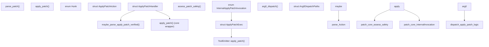

# Apply Patch System

Relevant source files

-   [codex-rs/apply-patch/Cargo.toml](https://github.com/openai/codex/blob/d807d44a/codex-rs/apply-patch/Cargo.toml)
-   [codex-rs/apply-patch/src/invocation.rs](https://github.com/openai/codex/blob/d807d44a/codex-rs/apply-patch/src/invocation.rs)
-   [codex-rs/apply-patch/src/lib.rs](https://github.com/openai/codex/blob/d807d44a/codex-rs/apply-patch/src/lib.rs)
-   [codex-rs/apply-patch/src/parser.rs](https://github.com/openai/codex/blob/d807d44a/codex-rs/apply-patch/src/parser.rs)
-   [codex-rs/apply-patch/src/seek\_sequence.rs](https://github.com/openai/codex/blob/d807d44a/codex-rs/apply-patch/src/seek_sequence.rs)
-   [codex-rs/apply-patch/tests/fixtures/scenarios/020\_whitespace\_padded\_patch\_marker\_lines/expected/file.txt](https://github.com/openai/codex/blob/d807d44a/codex-rs/apply-patch/tests/fixtures/scenarios/020_whitespace_padded_patch_marker_lines/expected/file.txt)
-   [codex-rs/apply-patch/tests/fixtures/scenarios/020\_whitespace\_padded\_patch\_marker\_lines/input/file.txt](https://github.com/openai/codex/blob/d807d44a/codex-rs/apply-patch/tests/fixtures/scenarios/020_whitespace_padded_patch_marker_lines/input/file.txt)
-   [codex-rs/apply-patch/tests/fixtures/scenarios/020\_whitespace\_padded\_patch\_marker\_lines/patch.txt](https://github.com/openai/codex/blob/d807d44a/codex-rs/apply-patch/tests/fixtures/scenarios/020_whitespace_padded_patch_marker_lines/patch.txt)
-   [codex-rs/arg0/Cargo.toml](https://github.com/openai/codex/blob/d807d44a/codex-rs/arg0/Cargo.toml)
-   [codex-rs/arg0/src/lib.rs](https://github.com/openai/codex/blob/d807d44a/codex-rs/arg0/src/lib.rs)
-   [codex-rs/core/src/apply\_patch.rs](https://github.com/openai/codex/blob/d807d44a/codex-rs/core/src/apply_patch.rs)
-   [codex-rs/core/src/safety.rs](https://github.com/openai/codex/blob/d807d44a/codex-rs/core/src/safety.rs)
-   [codex-rs/core/src/tools/context.rs](https://github.com/openai/codex/blob/d807d44a/codex-rs/core/src/tools/context.rs)
-   [codex-rs/core/src/tools/handlers/apply\_patch.rs](https://github.com/openai/codex/blob/d807d44a/codex-rs/core/src/tools/handlers/apply_patch.rs)
-   [codex-rs/core/src/tools/handlers/mcp.rs](https://github.com/openai/codex/blob/d807d44a/codex-rs/core/src/tools/handlers/mcp.rs)
-   [codex-rs/core/src/tools/handlers/plan.rs](https://github.com/openai/codex/blob/d807d44a/codex-rs/core/src/tools/handlers/plan.rs)
-   [codex-rs/core/src/tools/parallel.rs](https://github.com/openai/codex/blob/d807d44a/codex-rs/core/src/tools/parallel.rs)
-   [codex-rs/core/src/tools/router.rs](https://github.com/openai/codex/blob/d807d44a/codex-rs/core/src/tools/router.rs)

## Purpose and Scope

This page documents the `apply_patch` tool system: the patch format, parsing pipeline, interception mechanism, safety assessment, and filesystem execution. The system supports two primary invocation paths: a direct function tool call via `ApplyPatchHandler` and a shell-level interception that detects heredoc-wrapped `apply_patch` calls within shell commands before a subprocess is spawned.

The system is split between the `codex-apply-patch` crate (parsing and standalone execution logic) and `codex-core` (integration with the agent's tool orchestration, safety checks, and event emission).

Sources: [codex-rs/apply-patch/src/lib.rs1-51](https://github.com/openai/codex/blob/d807d44a/codex-rs/apply-patch/src/lib.rs#L1-L51) [codex-rs/core/src/tools/handlers/apply\_patch.rs42-155](https://github.com/openai/codex/blob/d807d44a/codex-rs/core/src/tools/handlers/apply_patch.rs#L42-L155)

---

## Patch Format

The system uses a custom diff-like format bounded by `*** Begin Patch` and `*** End Patch` delimiters. It supports three fundamental operation types represented by the `Hunk` enum in `codex-apply-patch`.

| Hunk Type | Marker | Description |
| --- | --- | --- |
| `AddFile` | `*** Add File: <path>` | Creates a new file with the provided lines. |
| `DeleteFile` | `*** Delete File: <path>` | Removes the specified file. |
| `UpdateFile` | `*** Update File: <path>` | Modifies an existing file using context-based matching. |
| `MoveTo` | `*** Move to: <path>` | (Inside Update) Renames the file during the update. |

### Context-based Matching

For `UpdateFile` hunks, the system uses `UpdateFileChunk` objects which contain:

-   `change_context`: An optional anchor line (e.g., `@@ class MyClass`) to narrow the search range [codex-rs/apply-patch/src/parser.rs91-94](https://github.com/openai/codex/blob/d807d44a/codex-rs/apply-patch/src/parser.rs#L91-L94)
-   `old_lines`: The exact sequence of lines to be replaced [codex-rs/apply-patch/src/parser.rs98](https://github.com/openai/codex/blob/d807d44a/codex-rs/apply-patch/src/parser.rs#L98-L98)
-   `new_lines`: The replacement content [codex-rs/apply-patch/src/parser.rs99](https://github.com/openai/codex/blob/d807d44a/codex-rs/apply-patch/src/parser.rs#L99-L99)

Sources: [codex-rs/apply-patch/src/parser.rs31-40](https://github.com/openai/codex/blob/d807d44a/codex-rs/apply-patch/src/parser.rs#L31-L40) [codex-rs/apply-patch/src/parser.rs60-76](https://github.com/openai/codex/blob/d807d44a/codex-rs/apply-patch/src/parser.rs#L60-L76) [codex-rs/apply-patch/src/lib.rs95-108](https://github.com/openai/codex/blob/d807d44a/codex-rs/apply-patch/src/lib.rs#L95-L108)

---

## Architecture Overview

The following diagram maps the relationship between the natural language intent (applying a patch) and the code entities across crates.

**Code-entity diagram: Apply Patch Component Map**

Sources: [codex-rs/apply-patch/src/lib.rs20-21](https://github.com/openai/codex/blob/d807d44a/codex-rs/apply-patch/src/lib.rs#L20-L21) [codex-rs/core/src/tools/handlers/apply\_patch.rs42-128](https://github.com/openai/codex/blob/d807d44a/codex-rs/core/src/tools/handlers/apply_patch.rs#L42-L128) [codex-rs/core/src/apply\_patch.rs13-40](https://github.com/openai/codex/blob/d807d44a/codex-rs/core/src/apply_patch.rs#L13-L40) [codex-rs/arg0/src/lib.rs89-107](https://github.com/openai/codex/blob/d807d44a/codex-rs/arg0/src/lib.rs#L89-L107)

---

## Safety and Approval Workflow

Before a patch is applied, it undergoes a safety assessment in `codex-core`. This determines if the operation can be auto-approved within a sandbox or if it requires explicit human intervention.

### Assessment Logic

The function `assess_patch_safety` evaluates the `ApplyPatchAction` against the current `SandboxPolicy` and `FileSystemSandboxPolicy` [codex-rs/core/src/safety.rs28-35](https://github.com/openai/codex/blob/d807d44a/codex-rs/core/src/safety.rs#L28-L35)

1.  **Path Constraint Check**: `is_write_patch_constrained_to_writable_paths` verifies that all files being added, deleted, or updated fall within the allowed writable roots [codex-rs/core/src/safety.rs125-158](https://github.com/openai/codex/blob/d807d44a/codex-rs/core/src/safety.rs#L125-L158)
2.  **Sandbox Enforcement**: If paths are constrained, the system attempts to find a platform-specific sandbox (e.g., `MacosSeatbelt`, `LinuxSeccomp`, or `WindowsRestrictedToken`) [codex-rs/core/src/safety.rs81-97](https://github.com/openai/codex/blob/d807d44a/codex-rs/core/src/safety.rs#L81-L97)
3.  **Result**:
    -   `SafetyCheck::AutoApprove`: The patch is safe to run in a restricted environment [codex-rs/core/src/safety.rs18-21](https://github.com/openai/codex/blob/d807d44a/codex-rs/core/src/safety.rs#L18-L21)
    -   `SafetyCheck::AskUser`: The patch touches paths outside the project or no sandbox is available [codex-rs/core/src/safety.rs22](https://github.com/openai/codex/blob/d807d44a/codex-rs/core/src/safety.rs#L22-L22)
    -   `SafetyCheck::Reject`: The patch is empty or violates "Never" approval settings [codex-rs/core/src/safety.rs23-26](https://github.com/openai/codex/blob/d807d44a/codex-rs/core/src/safety.rs#L23-L26)

Sources: [codex-rs/core/src/safety.rs28-107](https://github.com/openai/codex/blob/d807d44a/codex-rs/core/src/safety.rs#L28-L107) [codex-rs/core/src/apply\_patch.rs41-77](https://github.com/openai/codex/blob/d807d44a/codex-rs/core/src/apply_patch.rs#L41-L77)

---

## Execution and Self-Invocation

Codex uses a "self-invocation" pattern to execute the patch application in a separate, sandboxed process.

### Invocation Flow

1.  **Handler Level**: `ApplyPatchHandler` parses the model's arguments and calls `codex_core::apply_patch::apply_patch` [codex-rs/core/src/tools/handlers/apply\_patch.rs174-180](https://github.com/openai/codex/blob/d807d44a/codex-rs/core/src/tools/handlers/apply_patch.rs#L174-L180)
2.  **Delegation**: If approved, the core returns `InternalApplyPatchInvocation::DelegateToExec`. This contains an `ApplyPatchExec` struct with `exec_approval_requirement` [codex-rs/core/src/apply\_patch.rs52-72](https://github.com/openai/codex/blob/d807d44a/codex-rs/core/src/apply_patch.rs#L52-L72)
3.  **Subprocess**: The `ApplyPatchRuntime` (invoked via `ToolOrchestrator`) spawns a new instance of the Codex binary using the special flag `CODEX_CORE_APPLY_PATCH_ARG1` (`--codex-run-as-apply-patch`) [codex-rs/apply-patch/src/lib.rs35](https://github.com/openai/codex/blob/d807d44a/codex-rs/apply-patch/src/lib.rs#L35-L35)
4.  **Arg0 Dispatch**: The `arg0_dispatch` function in the `codex-arg0` crate detects this flag, extracts the patch text from the following argument, and executes the internal `codex_apply_patch::apply_patch` logic [codex-rs/arg0/src/lib.rs89-107](https://github.com/openai/codex/blob/d807d44a/codex-rs/arg0/src/lib.rs#L89-L107)

**Sequence Diagram: Patch Application Flow**

> **[Mermaid sequence]**
> *(图表结构无法解析)*

Sources: [codex-rs/core/src/apply\_patch.rs13-77](https://github.com/openai/codex/blob/d807d44a/codex-rs/core/src/apply_patch.rs#L13-L77) [codex-rs/core/src/tools/handlers/apply\_patch.rs178-195](https://github.com/openai/codex/blob/d807d44a/codex-rs/core/src/tools/handlers/apply_patch.rs#L178-L195) [codex-rs/arg0/src/lib.rs89-107](https://github.com/openai/codex/blob/d807d44a/codex-rs/arg0/src/lib.rs#L89-L107) [codex-rs/apply-patch/src/lib.rs183-213](https://github.com/openai/codex/blob/d807d44a/codex-rs/apply-patch/src/lib.rs#L183-L213)

---

## Tool Variants and Parsing

The system handles multiple input formats to accommodate different model behaviors.

### Freeform vs. JSON

-   **JSON (Standard)**: The model calls `apply_patch` with a JSON object containing an `input` field [codex-rs/core/src/tools/handlers/apply\_patch.rs158-161](https://github.com/openai/codex/blob/d807d44a/codex-rs/core/src/tools/handlers/apply_patch.rs#L158-L161)
-   **Custom/Freeform**: The model provides the raw patch body directly as a string [codex-rs/core/src/tools/handlers/apply\_patch.rs162](https://github.com/openai/codex/blob/d807d44a/codex-rs/core/src/tools/handlers/apply_patch.rs#L162-L162)

### Lenient Parsing

Models (specifically GPT-4.1) sometimes wrap patches in shell heredoc syntax (e.g., `<<'EOF' ... EOF`) even when calling tools directly. The `ParseMode::Lenient` setting in `codex-apply-patch` allows the parser to strip these markers and extract the underlying patch content [codex-rs/apply-patch/src/parser.rs115-152](https://github.com/openai/codex/blob/d807d44a/codex-rs/apply-patch/src/parser.rs#L115-L152)

Sources: [codex-rs/core/src/tools/handlers/apply\_patch.rs157-168](https://github.com/openai/codex/blob/d807d44a/codex-rs/core/src/tools/handlers/apply_patch.rs#L157-L168) [codex-rs/apply-patch/src/parser.rs106-113](https://github.com/openai/codex/blob/d807d44a/codex-rs/apply-patch/src/parser.rs#L106-L113) [codex-rs/apply-patch/src/parser.rs154-164](https://github.com/openai/codex/blob/d807d44a/codex-rs/apply-patch/src/parser.rs#L154-L164)
