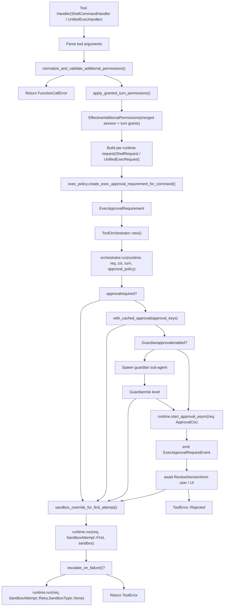

# Tool Orchestration and Approval

Relevant source files

-   [codex-rs/app-server/src/command\_exec.rs](https://github.com/openai/codex/blob/d807d44a/codex-rs/app-server/src/command_exec.rs)
-   [codex-rs/core/src/exec.rs](https://github.com/openai/codex/blob/d807d44a/codex-rs/core/src/exec.rs)
-   [codex-rs/core/src/exec\_policy.rs](https://github.com/openai/codex/blob/d807d44a/codex-rs/core/src/exec_policy.rs)
-   [codex-rs/core/src/exec\_policy\_tests.rs](https://github.com/openai/codex/blob/d807d44a/codex-rs/core/src/exec_policy_tests.rs)
-   [codex-rs/core/src/sandboxing/mod.rs](https://github.com/openai/codex/blob/d807d44a/codex-rs/core/src/sandboxing/mod.rs)
-   [codex-rs/core/src/tasks/review.rs](https://github.com/openai/codex/blob/d807d44a/codex-rs/core/src/tasks/review.rs)
-   [codex-rs/core/src/tasks/user\_shell.rs](https://github.com/openai/codex/blob/d807d44a/codex-rs/core/src/tasks/user_shell.rs)
-   [codex-rs/core/src/tools/events.rs](https://github.com/openai/codex/blob/d807d44a/codex-rs/core/src/tools/events.rs)
-   [codex-rs/core/src/tools/handlers/shell.rs](https://github.com/openai/codex/blob/d807d44a/codex-rs/core/src/tools/handlers/shell.rs)
-   [codex-rs/core/src/tools/handlers/unified\_exec.rs](https://github.com/openai/codex/blob/d807d44a/codex-rs/core/src/tools/handlers/unified_exec.rs)
-   [codex-rs/core/src/tools/orchestrator.rs](https://github.com/openai/codex/blob/d807d44a/codex-rs/core/src/tools/orchestrator.rs)
-   [codex-rs/core/src/tools/runtimes/apply\_patch.rs](https://github.com/openai/codex/blob/d807d44a/codex-rs/core/src/tools/runtimes/apply_patch.rs)
-   [codex-rs/core/src/tools/runtimes/mod.rs](https://github.com/openai/codex/blob/d807d44a/codex-rs/core/src/tools/runtimes/mod.rs)
-   [codex-rs/core/src/tools/runtimes/shell.rs](https://github.com/openai/codex/blob/d807d44a/codex-rs/core/src/tools/runtimes/shell.rs)
-   [codex-rs/core/src/tools/runtimes/unified\_exec.rs](https://github.com/openai/codex/blob/d807d44a/codex-rs/core/src/tools/runtimes/unified_exec.rs)
-   [codex-rs/core/src/tools/sandboxing.rs](https://github.com/openai/codex/blob/d807d44a/codex-rs/core/src/tools/sandboxing.rs)
-   [codex-rs/core/src/unified\_exec/async\_watcher.rs](https://github.com/openai/codex/blob/d807d44a/codex-rs/core/src/unified_exec/async_watcher.rs)
-   [codex-rs/core/src/unified\_exec/errors.rs](https://github.com/openai/codex/blob/d807d44a/codex-rs/core/src/unified_exec/errors.rs)
-   [codex-rs/core/src/unified\_exec/mod.rs](https://github.com/openai/codex/blob/d807d44a/codex-rs/core/src/unified_exec/mod.rs)
-   [codex-rs/core/src/unified\_exec/process\_manager.rs](https://github.com/openai/codex/blob/d807d44a/codex-rs/core/src/unified_exec/process_manager.rs)
-   [codex-rs/core/tests/suite/approvals.rs](https://github.com/openai/codex/blob/d807d44a/codex-rs/core/tests/suite/approvals.rs)
-   [codex-rs/core/tests/suite/codex\_delegate.rs](https://github.com/openai/codex/blob/d807d44a/codex-rs/core/tests/suite/codex_delegate.rs)
-   [codex-rs/core/tests/suite/exec.rs](https://github.com/openai/codex/blob/d807d44a/codex-rs/core/tests/suite/exec.rs)
-   [codex-rs/core/tests/suite/otel.rs](https://github.com/openai/codex/blob/d807d44a/codex-rs/core/tests/suite/otel.rs)
-   [codex-rs/core/tests/suite/review.rs](https://github.com/openai/codex/blob/d807d44a/codex-rs/core/tests/suite/review.rs)
-   [codex-rs/core/tests/suite/unified\_exec.rs](https://github.com/openai/codex/blob/d807d44a/codex-rs/core/tests/suite/unified_exec.rs)
-   [codex-rs/linux-sandbox/tests/suite/landlock.rs](https://github.com/openai/codex/blob/d807d44a/codex-rs/linux-sandbox/tests/suite/landlock.rs)

## Purpose and Scope

This page documents `ToolOrchestrator` and the surrounding infrastructure that centralizes **approval prompting**, **additional permissions handling**, **sandbox type selection**, and **retry-on-denial** semantics for all executable tool runtimes. It covers the shared traits (`Approvable`, `Sandboxable`, `ToolRuntime`), the `ExecApprovalRequirement` computation, permission validation via `normalize_and_validate_additional_permissions`, guardian sub-agent approval, and how those pieces coordinate across the three concrete runtimes: `ShellRuntime`, `UnifiedExecRuntime`, and `ApplyPatchRuntime`.

Key approval flows covered:

-   **Sandbox escalation approval**: Commands requiring `require_escalated` sandbox permissions [codex-rs/core/src/tools/spec.rs525-540](https://github.com/openai/codex/blob/d807d44a/codex-rs/core/src/tools/spec.rs#L525-L540)
-   **Additional permissions approval**: Commands requesting granular filesystem/network permissions via `with_additional_permissions` [codex-rs/core/src/tools/spec.rs541-576](https://github.com/openai/codex/blob/d807d44a/codex-rs/core/src/tools/spec.rs#L541-L576)
-   **Guardian auto-approval**: AI-powered low-risk command pre-approval [codex-rs/core/src/codex\_tests\_guardian.rs42-179](https://github.com/openai/codex/blob/d807d44a/codex-rs/core/src/codex_tests_guardian.rs#L42-L179)
-   **Sticky permission grants**: Turn-scoped and session-scoped permission caching via `request_permissions` tool [codex-rs/core/tests/suite/request\_permissions.rs999-1118](https://github.com/openai/codex/blob/d807d44a/codex-rs/core/tests/suite/request_permissions.rs#L999-L1118)

For sandbox *implementation* details (Landlock, Seatbelt, restricted tokens), see [Sandboxing Implementation](/openai/codex/5.6-sandboxing-implementation). For shell-specific tool construction, see [Shell Execution Tools](/openai/codex/5.2-shell-execution-tools). For unified exec process management, see [Unified Exec Process Management](/openai/codex/5.3-unified-exec-process-management). For the `request_permissions` tool, see [Permission Request System](/openai/codex/5.10-permission-request-system).

---

## Architecture Overview

Every executable tool passes through a centralized orchestration pipeline. This ensures that policy logic, such as checking against the `ExecPolicyManager` [codex-rs/core/src/exec\_policy.rs191-194](https://github.com/openai/codex/blob/d807d44a/codex-rs/core/src/exec_policy.rs#L191-L194) and user interaction remain consistent across different execution backends.

**Orchestration pipeline diagram:**


Sources: [codex-rs/core/src/tools/handlers/mod.rs100-159](https://github.com/openai/codex/blob/d807d44a/codex-rs/core/src/tools/handlers/mod.rs#L100-L159) [codex-rs/core/src/tools/orchestrator.rs1-50](https://github.com/openai/codex/blob/d807d44a/codex-rs/core/src/tools/orchestrator.rs#L1-L50) [codex-rs/core/src/exec\_policy.rs196-204](https://github.com/openai/codex/blob/d807d44a/codex-rs/core/src/exec_policy.rs#L196-L204) [codex-rs/core/src/unified\_exec/process\_manager.rs155-166](https://github.com/openai/codex/blob/d807d44a/codex-rs/core/src/unified_exec/process_manager.rs#L155-L166)

---

## Key Types

**Type relationship diagram:**

```mermaid
flowchart TD
    classId_ToolOrchestrator_51["ToolOrchestrator"]
    classId_ApprovalStore_52["ApprovalStore"]
    classId_ToolRuntime_53["«trait»"]
    classId_Approvable_54["«trait»"]
    classId_Sandboxable_55["«trait»"]
    classId_ShellRuntime_56["ShellRuntime"]
    classId_UnifiedExecRuntime_57["UnifiedExecRuntime"]
    classId_ExecApprovalRequirement_58["«enum»"]
    classId_AskForApproval_59["«enum»"]
```


Sources: [codex-rs/core/src/tools/sandboxing.rs1-50](https://github.com/openai/codex/blob/d807d44a/codex-rs/core/src/tools/sandboxing.rs#L1-L50) [codex-rs/core/src/tools/orchestrator.rs1-20](https://github.com/openai/codex/blob/d807d44a/codex-rs/core/src/tools/orchestrator.rs#L1-L20) [codex-rs/core/src/tools/runtimes/shell.rs31-33](https://github.com/openai/codex/blob/d807d44a/codex-rs/core/src/tools/runtimes/shell.rs#L31-L33) [codex-rs/core/src/tools/runtimes/unified\_exec.rs27-28](https://github.com/openai/codex/blob/d807d44a/codex-rs/core/src/tools/runtimes/unified_exec.rs#L27-L28)

| Type | File | Role |
| --- | --- | --- |
| `ToolOrchestrator` | `tools/orchestrator.rs` | Drives approval → sandbox → run → retry lifecycle. |
| `ApprovalStore` | `tools/sandboxing.rs` | Per-invocation approval decision cache [codex-rs/core/src/tools/sandboxing.rs31-45](https://github.com/openai/codex/blob/d807d44a/codex-rs/core/src/tools/sandboxing.rs#L31-L45) |
| `ExecApprovalRequirement` | `tools/sandboxing.rs` | Pre-computed requirement based on policy [codex-rs/core/src/tools/sandboxing.rs37](https://github.com/openai/codex/blob/d807d44a/codex-rs/core/src/tools/sandboxing.rs#L37-L37) |
| `ToolRuntime<R>` | `tools/sandboxing.rs` | Combined execution trait for all runtimes. |
| `ShellRuntime` | `tools/runtimes/shell.rs` | Implementation for shell/shell\_command execution. |
| `UnifiedExecRuntime` | `tools/runtimes/unified_exec.rs` | Implementation for unified exec PTY execution. |
| `ExecPolicyManager` | `core/src/exec_policy.rs` | Manages and evaluates rules from `.rules` files [codex-rs/core/src/exec\_policy.rs191-194](https://github.com/openai/codex/blob/d807d44a/codex-rs/core/src/exec_policy.rs#L191-L194) |

---

## ExecApprovalRequirement Computation

Before execution, each handler computes an `ExecApprovalRequirement` via the `ExecPolicyManager` [codex-rs/core/src/exec\_policy.rs213-230](https://github.com/openai/codex/blob/d807d44a/codex-rs/core/src/exec_policy.rs#L213-L230) This check determines if the command is "known safe" or if it matches a prefix rule in the configuration [codex-rs/core/src/exec\_policy.rs10-11](https://github.com/openai/codex/blob/d807d44a/codex-rs/core/src/exec_policy.rs#L10-L11)

```
// From ShellHandler::handle (tools/handlers/shell.rs)let exec_approval_requirement = session    .services    .exec_policy    .create_exec_approval_requirement_for_command(ExecApprovalRequest {        command: &exec_params.command,        approval_policy: turn.approval_policy.value(),        sandbox_policy: turn.sandbox_policy.get(),        sandbox_permissions: exec_params.sandbox_permissions,        prefix_rule,    })    .await;
```
Sources: [codex-rs/core/src/tools/handlers/shell.rs384-408](https://github.com/openai/codex/blob/d807d44a/codex-rs/core/src/tools/handlers/shell.rs#L384-L408) [codex-rs/core/src/exec\_policy.rs196-204](https://github.com/openai/codex/blob/d807d44a/codex-rs/core/src/exec_policy.rs#L196-L204)

---

## AskForApproval and Granular Policies

`AskForApproval` (defined in `codex-protocol`) controls the emission of `ExecApprovalRequestEvent` [codex-rs/core/src/exec\_policy.rs130-153](https://github.com/openai/codex/blob/d807d44a/codex-rs/core/src/exec_policy.rs#L130-L153)

| Variant | Behavior |
| --- | --- |
| `Never` | Approval always bypassed; command runs directly. |
| `OnFailure` | Approval requested only after a sandbox failure. |
| `OnRequest` | Approval required only when the model requests escalated permissions. |
| `Granular` | Fine-grained control over `sandbox_approval`, `rules`, and `skill_approval` [codex-rs/core/src/exec\_policy.rs139-152](https://github.com/openai/codex/blob/d807d44a/codex-rs/core/src/exec_policy.rs#L139-L152) |

If a prompt is required but the policy is set to `Never`, the system rejects the request with `PROMPT_CONFLICT_REASON` [codex-rs/core/src/exec\_policy.rs41-42](https://github.com/openai/codex/blob/d807d44a/codex-rs/core/src/exec_policy.rs#L41-L42)

---

## SandboxPermissions and Additional Permissions

The model can request specific sandbox behavior via `SandboxPermissions` [codex-rs/core/src/sandboxing/mod.rs34](https://github.com/openai/codex/blob/d807d44a/codex-rs/core/src/sandboxing/mod.rs#L34-L34)

-   `RequireEscalated`: Request running without sandbox; requires a `justification` [codex-rs/core/src/sandboxing/mod.rs62](https://github.com/openai/codex/blob/d807d44a/codex-rs/core/src/sandboxing/mod.rs#L62-L62)
-   `WithAdditionalPermissions`: Request granular filesystem/network access [codex-rs/core/src/sandboxing/mod.rs61](https://github.com/openai/codex/blob/d807d44a/codex-rs/core/src/sandboxing/mod.rs#L61-L61)

Pre-orchestrator validation via `normalize_and_validate_additional_permissions()` canonicalizes paths and ensures requests are non-empty [codex-rs/core/src/sandboxing/mod.rs153-178](https://github.com/openai/codex/blob/d807d44a/codex-rs/core/src/sandboxing/mod.rs#L153-L178)

### Sticky Grants

`apply_granted_turn_permissions()` merges session-scoped and turn-scoped sticky grants with the current request [codex-rs/core/src/tools/handlers/mod.rs184-229](https://github.com/openai/codex/blob/d807d44a/codex-rs/core/src/tools/handlers/mod.rs#L184-L229) This allows subsequent tool calls to use previously approved permissions without re-prompting [codex-rs/core/tests/suite/request\_permissions.rs1239-1346](https://github.com/openai/codex/blob/d807d44a/codex-rs/core/tests/suite/request_permissions.rs#L1239-L1346)

---

## Approval Caching and Store

`ToolOrchestrator` uses an `ApprovalStore` to prevent redundant prompts within a single orchestration flow (e.g., between the first attempt and a sandbox retry) [codex-rs/core/src/tools/sandboxing.rs31-45](https://github.com/openai/codex/blob/d807d44a/codex-rs/core/src/tools/sandboxing.rs#L31-L45)

Each runtime defines `approval_keys`. For `UnifiedExecRuntime`, this includes the command, working directory, and requested permissions [codex-rs/core/src/tools/runtimes/unified\_exec.rs55-62](https://github.com/openai/codex/blob/d807d44a/codex-rs/core/src/tools/runtimes/unified_exec.rs#L55-L62)

---

## User Approval Prompting

When a cache miss occurs, the runtime emits an `ExecApprovalRequestEvent` [codex-rs/core/src/tools/orchestrator.rs1-50](https://github.com/openai/codex/blob/d807d44a/codex-rs/core/src/tools/orchestrator.rs#L1-L50)

**Approval sequence diagram:**

> **[Mermaid sequence]**
> *(图表结构无法解析)*

Sources: [codex-rs/core/src/tools/orchestrator.rs1-50](https://github.com/openai/codex/blob/d807d44a/codex-rs/core/src/tools/orchestrator.rs#L1-L50) [codex-rs/core/src/tools/handlers/unified\_exec.rs120-140](https://github.com/openai/codex/blob/d807d44a/codex-rs/core/src/tools/handlers/unified_exec.rs#L120-L140) [codex-rs/core/src/tools/runtimes/unified\_exec.rs64-82](https://github.com/openai/codex/blob/d807d44a/codex-rs/core/src/tools/runtimes/unified_exec.rs#L64-L82)

---

## Retry on Sandbox Denial

The `ToolOrchestrator` implements a retry loop. If `run` fails with an error that `is_likely_sandbox_denied`, and the runtime's `escalate_on_failure()` returns `true`, it retries without a sandbox [codex-rs/core/src/tools/orchestrator.rs1-20](https://github.com/openai/codex/blob/d807d44a/codex-rs/core/src/tools/orchestrator.rs#L1-L20)

-   `UnifiedExecRuntime`: Returns `true` for `escalate_on_failure` [codex-rs/core/src/tools/runtimes/unified\_exec.rs81](https://github.com/openai/codex/blob/d807d44a/codex-rs/core/src/tools/runtimes/unified_exec.rs#L81-L81)
-   `ShellRuntime`: Behavior depends on backend configuration [codex-rs/core/src/tools/runtimes/shell.rs90-100](https://github.com/openai/codex/blob/d807d44a/codex-rs/core/src/tools/runtimes/shell.rs#L90-L100)

Sources: [codex-rs/core/src/tools/orchestrator.rs1-20](https://github.com/openai/codex/blob/d807d44a/codex-rs/core/src/tools/orchestrator.rs#L1-L20) [codex-rs/core/src/tools/runtimes/unified\_exec.rs74-82](https://github.com/openai/codex/blob/d807d44a/codex-rs/core/src/tools/runtimes/unified_exec.rs#L74-L82)

---

## Guardian Approval Sub-Agent

The Guardian system is an AI-powered auto-approval mechanism [codex-rs/core/src/codex\_tests\_guardian.rs42-179](https://github.com/openai/codex/blob/d807d44a/codex-rs/core/src/codex_tests_guardian.rs#L42-L179) Before prompting a human, the orchestrator can spawn a guardian sub-agent to analyze the risk of a command.

-   **Low Risk**: Guardian auto-approves; command runs without human intervention [codex-rs/core/src/codex\_tests\_guardian.rs310-410](https://github.com/openai/codex/blob/d807d44a/codex-rs/core/src/codex_tests_guardian.rs#L310-L410)
-   **High Risk**: Guardian defers to the user.

The guardian sub-agent runs with restricted capabilities (e.g., `approval_policy = Never`) to ensure it cannot perform unsafe actions itself while evaluating the primary agent's request [codex-rs/core/src/tasks/review.rs108-109](https://github.com/openai/codex/blob/d807d44a/codex-rs/core/src/tasks/review.rs#L108-L109)

Sources: [codex-rs/core/src/codex\_tests\_guardian.rs42-179](https://github.com/openai/codex/blob/d807d44a/codex-rs/core/src/codex_tests_guardian.rs#L42-L179) [codex-rs/core/src/tasks/review.rs87-130](https://github.com/openai/codex/blob/d807d44a/codex-rs/core/src/tasks/review.rs#L87-L130)
