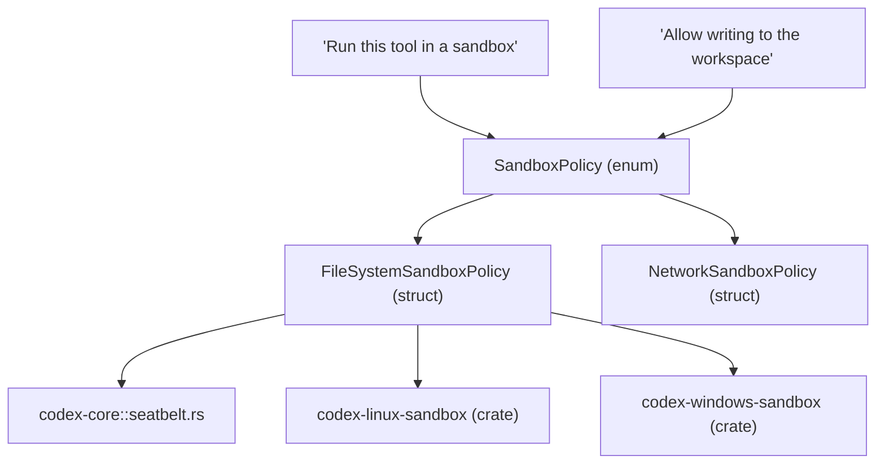
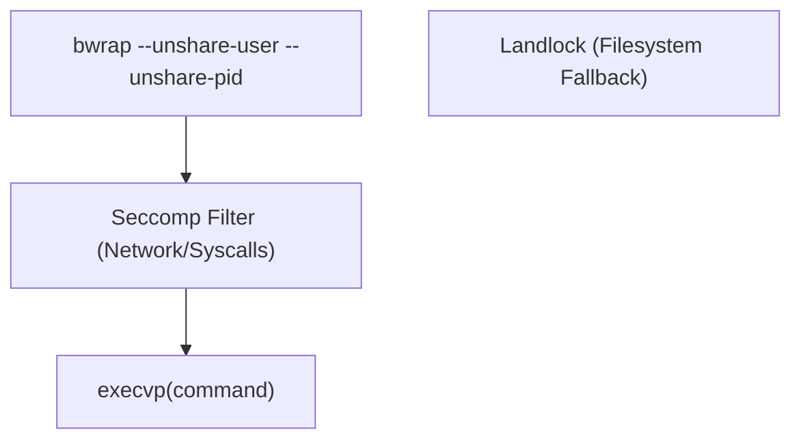

# Sandboxing Implementation

Relevant source files

-   [codex-rs/cli/src/debug\_sandbox.rs](https://github.com/openai/codex/blob/d807d44a/codex-rs/cli/src/debug_sandbox.rs)
-   [codex-rs/core/README.md](https://github.com/openai/codex/blob/d807d44a/codex-rs/core/README.md?plain=1)
-   [codex-rs/core/src/landlock.rs](https://github.com/openai/codex/blob/d807d44a/codex-rs/core/src/landlock.rs)
-   [codex-rs/core/src/landlock\_tests.rs](https://github.com/openai/codex/blob/d807d44a/codex-rs/core/src/landlock_tests.rs)
-   [codex-rs/core/src/seatbelt.rs](https://github.com/openai/codex/blob/d807d44a/codex-rs/core/src/seatbelt.rs)
-   [codex-rs/core/src/seatbelt\_base\_policy.sbpl](https://github.com/openai/codex/blob/d807d44a/codex-rs/core/src/seatbelt_base_policy.sbpl)
-   [codex-rs/core/src/seatbelt\_permissions.rs](https://github.com/openai/codex/blob/d807d44a/codex-rs/core/src/seatbelt_permissions.rs)
-   [codex-rs/core/tests/suite/seatbelt.rs](https://github.com/openai/codex/blob/d807d44a/codex-rs/core/tests/suite/seatbelt.rs)
-   [codex-rs/exec/tests/suite/sandbox.rs](https://github.com/openai/codex/blob/d807d44a/codex-rs/exec/tests/suite/sandbox.rs)
-   [codex-rs/linux-sandbox/Cargo.toml](https://github.com/openai/codex/blob/d807d44a/codex-rs/linux-sandbox/Cargo.toml)
-   [codex-rs/linux-sandbox/README.md](https://github.com/openai/codex/blob/d807d44a/codex-rs/linux-sandbox/README.md?plain=1)
-   [codex-rs/linux-sandbox/src/bwrap.rs](https://github.com/openai/codex/blob/d807d44a/codex-rs/linux-sandbox/src/bwrap.rs)
-   [codex-rs/linux-sandbox/src/landlock.rs](https://github.com/openai/codex/blob/d807d44a/codex-rs/linux-sandbox/src/landlock.rs)
-   [codex-rs/linux-sandbox/src/launcher.rs](https://github.com/openai/codex/blob/d807d44a/codex-rs/linux-sandbox/src/launcher.rs)
-   [codex-rs/linux-sandbox/src/lib.rs](https://github.com/openai/codex/blob/d807d44a/codex-rs/linux-sandbox/src/lib.rs)
-   [codex-rs/linux-sandbox/src/linux\_run\_main.rs](https://github.com/openai/codex/blob/d807d44a/codex-rs/linux-sandbox/src/linux_run_main.rs)
-   [codex-rs/linux-sandbox/src/linux\_run\_main\_tests.rs](https://github.com/openai/codex/blob/d807d44a/codex-rs/linux-sandbox/src/linux_run_main_tests.rs)
-   [codex-rs/linux-sandbox/src/vendored\_bwrap.rs](https://github.com/openai/codex/blob/d807d44a/codex-rs/linux-sandbox/src/vendored_bwrap.rs)
-   [codex-rs/utils/pty/Cargo.toml](https://github.com/openai/codex/blob/d807d44a/codex-rs/utils/pty/Cargo.toml)
-   [codex-rs/utils/pty/src/lib.rs](https://github.com/openai/codex/blob/d807d44a/codex-rs/utils/pty/src/lib.rs)
-   [codex-rs/utils/pty/src/win/conpty.rs](https://github.com/openai/codex/blob/d807d44a/codex-rs/utils/pty/src/win/conpty.rs)
-   [codex-rs/utils/pty/src/win/mod.rs](https://github.com/openai/codex/blob/d807d44a/codex-rs/utils/pty/src/win/mod.rs)
-   [codex-rs/utils/pty/src/win/procthreadattr.rs](https://github.com/openai/codex/blob/d807d44a/codex-rs/utils/pty/src/win/procthreadattr.rs)
-   [codex-rs/utils/pty/src/win/psuedocon.rs](https://github.com/openai/codex/blob/d807d44a/codex-rs/utils/pty/src/win/psuedocon.rs)
-   [codex-rs/windows-sandbox-rs/Cargo.toml](https://github.com/openai/codex/blob/d807d44a/codex-rs/windows-sandbox-rs/Cargo.toml)
-   [codex-rs/windows-sandbox-rs/src/acl.rs](https://github.com/openai/codex/blob/d807d44a/codex-rs/windows-sandbox-rs/src/acl.rs)
-   [codex-rs/windows-sandbox-rs/src/audit.rs](https://github.com/openai/codex/blob/d807d44a/codex-rs/windows-sandbox-rs/src/audit.rs)
-   [codex-rs/windows-sandbox-rs/src/bin/command\_runner.rs](https://github.com/openai/codex/blob/d807d44a/codex-rs/windows-sandbox-rs/src/bin/command_runner.rs)
-   [codex-rs/windows-sandbox-rs/src/conpty/mod.rs](https://github.com/openai/codex/blob/d807d44a/codex-rs/windows-sandbox-rs/src/conpty/mod.rs)
-   [codex-rs/windows-sandbox-rs/src/conpty/proc\_thread\_attr.rs](https://github.com/openai/codex/blob/d807d44a/codex-rs/windows-sandbox-rs/src/conpty/proc_thread_attr.rs)
-   [codex-rs/windows-sandbox-rs/src/elevated/command\_runner\_win.rs](https://github.com/openai/codex/blob/d807d44a/codex-rs/windows-sandbox-rs/src/elevated/command_runner_win.rs)
-   [codex-rs/windows-sandbox-rs/src/elevated/cwd\_junction.rs](https://github.com/openai/codex/blob/d807d44a/codex-rs/windows-sandbox-rs/src/elevated/cwd_junction.rs)
-   [codex-rs/windows-sandbox-rs/src/elevated/ipc\_framed.rs](https://github.com/openai/codex/blob/d807d44a/codex-rs/windows-sandbox-rs/src/elevated/ipc_framed.rs)
-   [codex-rs/windows-sandbox-rs/src/elevated\_impl.rs](https://github.com/openai/codex/blob/d807d44a/codex-rs/windows-sandbox-rs/src/elevated_impl.rs)
-   [codex-rs/windows-sandbox-rs/src/env.rs](https://github.com/openai/codex/blob/d807d44a/codex-rs/windows-sandbox-rs/src/env.rs)
-   [codex-rs/windows-sandbox-rs/src/firewall.rs](https://github.com/openai/codex/blob/d807d44a/codex-rs/windows-sandbox-rs/src/firewall.rs)
-   [codex-rs/windows-sandbox-rs/src/lib.rs](https://github.com/openai/codex/blob/d807d44a/codex-rs/windows-sandbox-rs/src/lib.rs)
-   [codex-rs/windows-sandbox-rs/src/logging.rs](https://github.com/openai/codex/blob/d807d44a/codex-rs/windows-sandbox-rs/src/logging.rs)
-   [codex-rs/windows-sandbox-rs/src/process.rs](https://github.com/openai/codex/blob/d807d44a/codex-rs/windows-sandbox-rs/src/process.rs)
-   [codex-rs/windows-sandbox-rs/src/sandbox\_users.rs](https://github.com/openai/codex/blob/d807d44a/codex-rs/windows-sandbox-rs/src/sandbox_users.rs)
-   [codex-rs/windows-sandbox-rs/src/setup\_main\_win.rs](https://github.com/openai/codex/blob/d807d44a/codex-rs/windows-sandbox-rs/src/setup_main_win.rs)
-   [codex-rs/windows-sandbox-rs/src/setup\_orchestrator.rs](https://github.com/openai/codex/blob/d807d44a/codex-rs/windows-sandbox-rs/src/setup_orchestrator.rs)
-   [codex-rs/windows-sandbox-rs/src/token.rs](https://github.com/openai/codex/blob/d807d44a/codex-rs/windows-sandbox-rs/src/token.rs)
-   [codex-rs/windows-sandbox-rs/src/winutil.rs](https://github.com/openai/codex/blob/d807d44a/codex-rs/windows-sandbox-rs/src/winutil.rs)
-   [third\_party/wezterm/LICENSE](https://github.com/openai/codex/blob/d807d44a/third_party/wezterm/LICENSE)

This page documents the implementation of Codex's sandboxing system, which provides platform-specific process isolation for tool execution. The system translates high-level `SandboxPolicy` requirements into OS-native primitives: **Seatbelt** on macOS, **Bubblewrap/Landlock** on Linux, and **Restricted Tokens** on Windows.

---

## Overview

The sandboxing architecture is divided into policy definition, platform-specific drivers, and a setup orchestration layer (primarily for Windows).

Sources: [codex-rs/core/src/seatbelt.rs18-26](https://github.com/openai/codex/blob/d807d44a/codex-rs/core/src/seatbelt.rs#L18-L26) [codex-rs/linux-sandbox/src/linux\_run\_main.rs17-20](https://github.com/openai/codex/blob/d807d44a/codex-rs/linux-sandbox/src/linux_run_main.rs#L17-L20) [codex-rs/windows-sandbox-rs/src/lib.rs91-94](https://github.com/openai/codex/blob/d807d44a/codex-rs/windows-sandbox-rs/src/lib.rs#L91-L94)

---

## macOS: Seatbelt (sandbox-exec)

On macOS, Codex utilizes the system's `sandbox-exec` utility. The implementation generates a Sandbox Profile Language (SBPL) script dynamically based on the requested permissions.

### Implementation Details

The core logic resides in `spawn_command_under_seatbelt`, which:

1.  Constructs SBPL arguments using `create_seatbelt_command_args`. [codex-rs/core/src/seatbelt.rs39-54](https://github.com/openai/codex/blob/d807d44a/codex-rs/core/src/seatbelt.rs#L39-L54)
2.  Sets the `CODEX_SANDBOX` environment variable to `seatbelt`. [codex-rs/core/src/seatbelt.rs56](https://github.com/openai/codex/blob/d807d44a/codex-rs/core/src/seatbelt.rs#L56-L56)
3.  Executes `/usr/bin/sandbox-exec`. [codex-rs/core/src/seatbelt.rs57-66](https://github.com/openai/codex/blob/d807d44a/codex-rs/core/src/seatbelt.rs#L57-L66)

### Network Proxy Support

If a `NetworkProxy` is provided, the sandbox is configured to allow loopback traffic to specific proxy ports parsed from environment variables like `HTTPS_PROXY`. [codex-rs/core/src/seatbelt.rs82-115](https://github.com/openai/codex/blob/d807d44a/codex-rs/core/src/seatbelt.rs#L82-L115)

### Policy Files

Codex embeds base SBPL policies:

-   `seatbelt_base_policy.sbpl`: Defines core denials and standard system allows (e.g., `/dev/null`, `sysctl-read`). [codex-rs/core/src/seatbelt\_base\_policy.sbpl1-109](https://github.com/openai/codex/blob/d807d44a/codex-rs/core/src/seatbelt_base_policy.sbpl#L1-L109)
-   `seatbelt_network_policy.sbpl`: Handles network-specific restrictions. [codex-rs/core/src/seatbelt.rs29](https://github.com/openai/codex/blob/d807d44a/codex-rs/core/src/seatbelt.rs#L29-L29)

Sources: [codex-rs/core/src/seatbelt.rs28-31](https://github.com/openai/codex/blob/d807d44a/codex-rs/core/src/seatbelt.rs#L28-L31) [codex-rs/core/src/seatbelt.rs39-68](https://github.com/openai/codex/blob/d807d44a/codex-rs/core/src/seatbelt.rs#L39-L68)

---

## Linux: Bubblewrap and Landlock

The Linux implementation is managed by the `codex-linux-sandbox` crate. It primarily uses **Bubblewrap** (`bwrap`) for filesystem namespacing and **Seccomp** for syscall filtering.

### Execution Flow

The `codex-linux-sandbox` binary acts as a wrapper. The sequence in `run_main` is:

1.  **Outer Stage**: Construct the filesystem view using `bwrap`. [codex-rs/linux-sandbox/src/linux\_run\_main.rs175-185](https://github.com/openai/codex/blob/d807d44a/codex-rs/linux-sandbox/src/linux_run_main.rs#L175-L185)
2.  **Inner Stage**: Re-enter the binary inside the namespace to apply `PR_SET_NO_NEW_PRIVS` and Seccomp filters via `apply_sandbox_policy_to_current_thread`. [codex-rs/linux-sandbox/src/linux\_run\_main.rs138-159](https://github.com/openai/codex/blob/d807d44a/codex-rs/linux-sandbox/src/linux_run_main.rs#L138-L159)
3.  **Final Exec**: `execvp` into the target command.

### Bubblewrap Configuration

`create_bwrap_command_args` determines if a full sandbox is needed. If the policy grants full disk access, it may return the command unchanged unless network isolation is required. [codex-rs/linux-sandbox/src/bwrap.rs94-110](https://github.com/openai/codex/blob/d807d44a/codex-rs/linux-sandbox/src/bwrap.rs#L94-L110)

**Platform Defaults**: Standard system paths (e.g., `/usr`, `/bin`, `/lib`) are mounted read-only by default to ensure binary execution is possible. [codex-rs/linux-sandbox/src/bwrap.rs28-37](https://github.com/openai/codex/blob/d807d44a/codex-rs/linux-sandbox/src/bwrap.rs#L28-L37)

Sources: [codex-rs/linux-sandbox/src/linux\_run\_main.rs99-159](https://github.com/openai/codex/blob/d807d44a/codex-rs/linux-sandbox/src/linux_run_main.rs#L99-L159) [codex-rs/linux-sandbox/src/bwrap.rs1-11](https://github.com/openai/codex/blob/d807d44a/codex-rs/linux-sandbox/src/bwrap.rs#L1-L11)

---

## Windows: Restricted Tokens and Setup

Windows sandboxing is the most complex, involving a multi-phase setup to manage Access Control Lists (ACLs) and specialized "Sandbox Users."

### Setup Orchestrator

Because Windows lacks a native "ephemeral" sandbox like Seatbelt, Codex provisions two local users: `CodexSandboxOffline` and `CodexSandboxOnline`. [codex-rs/windows-sandbox-rs/src/setup\_orchestrator.rs37-38](https://github.com/openai/codex/blob/d807d44a/codex-rs/windows-sandbox-rs/src/setup_orchestrator.rs#L37-L38)

The `run_setup_refresh` function ensures:

1.  **ACL Management**: Granting read/write access to specific workspace roots for the sandbox users. [codex-rs/windows-sandbox-rs/src/setup\_main\_win.rs136-207](https://github.com/openai/codex/blob/d807d44a/codex-rs/windows-sandbox-rs/src/setup_main_win.rs#L136-L207)
2.  **User Provisioning**: Creating the local accounts if they don't exist. [codex-rs/windows-sandbox-rs/src/setup\_main\_win.rs73](https://github.com/openai/codex/blob/d807d44a/codex-rs/windows-sandbox-rs/src/setup_main_win.rs#L73-L73)
3.  **Firewall Rules**: Configuring the Windows Firewall to block or allow traffic for these specific SIDs. [codex-rs/windows-sandbox-rs/src/firewall.rs1-10](https://github.com/openai/codex/blob/d807d44a/codex-rs/windows-sandbox-rs/src/firewall.rs#L1-L10)

### Execution via Restricted Token

Commands are launched using `CreateProcessAsUser` with a restricted token that strips sensitive privileges (e.g., `SeDebugPrivilege`). [codex-rs/windows-sandbox-rs/src/lib.rs95](https://github.com/openai/codex/blob/d807d44a/codex-rs/windows-sandbox-rs/src/lib.rs#L95-L95)

### Audit and Denial Detection

Windows includes a "Preflight Audit" (`audit_everyone_writable`) that scans the environment for directories with insecure "Everyone:Write" permissions, which could be used to escape the sandbox. [codex-rs/windows-sandbox-rs/src/audit.rs87-110](https://github.com/openai/codex/blob/d807d44a/codex-rs/windows-sandbox-rs/src/audit.rs#L87-L110)

Sources: [codex-rs/windows-sandbox-rs/src/setup\_orchestrator.rs1-40](https://github.com/openai/codex/blob/d807d44a/codex-rs/windows-sandbox-rs/src/setup_orchestrator.rs#L1-L40) [codex-rs/windows-sandbox-rs/src/setup\_main\_win.rs78-111](https://github.com/openai/codex/blob/d807d44a/codex-rs/windows-sandbox-rs/src/setup_main_win.rs#L78-L111) [codex-rs/windows-sandbox-rs/src/audit.rs24-33](https://github.com/openai/codex/blob/d807d44a/codex-rs/windows-sandbox-rs/src/audit.rs#L24-L33)

---

## Sandbox Denial Detection and Retry Logic

Codex implements logic to detect when a tool fails specifically due to sandbox restrictions, allowing for automated or user-prompted retries.

### Detection Patterns

The system looks for specific exit codes and stderr patterns:

-   **macOS**: `sandbox-exec: Operation not permitted`. [codex-rs/cli/src/debug\_sandbox.rs33](https://github.com/openai/codex/blob/d807d44a/codex-rs/cli/src/debug_sandbox.rs#L33-L33)
-   **Linux**: `bwrap: Permission denied`. [codex-rs/linux-sandbox/src/bwrap.rs1-11](https://github.com/openai/codex/blob/d807d44a/codex-rs/linux-sandbox/src/bwrap.rs#L1-L11)
-   **Windows**: `Access is denied` (Win32 Error 5). [codex-rs/windows-sandbox-rs/src/setup\_error.rs121](https://github.com/openai/codex/blob/d807d44a/codex-rs/windows-sandbox-rs/src/setup_error.rs#L121-L121)

### Debugging Tools

The CLI provides `debug-sandbox` commands to test these implementations in isolation:

-   `run_command_under_seatbelt`: [codex-rs/cli/src/debug\_sandbox.rs36-55](https://github.com/openai/codex/blob/d807d44a/codex-rs/cli/src/debug_sandbox.rs#L36-L55)
-   `run_command_under_landlock`: [codex-rs/cli/src/debug\_sandbox.rs65-83](https://github.com/openai/codex/blob/d807d44a/codex-rs/cli/src/debug_sandbox.rs#L65-L83)
-   `run_command_under_windows`: [codex-rs/cli/src/debug\_sandbox.rs85-103](https://github.com/openai/codex/blob/d807d44a/codex-rs/cli/src/debug_sandbox.rs#L85-L103)

### Retry Workflow

When a denial is detected, the `ToolOrchestrator` (documented in 5.5) can request elevated permissions from the user. If granted, the sandbox policy is widened (e.g., from `ReadOnly` to `WorkspaceWrite`) and the command is retried.

Sources: [codex-rs/cli/src/debug\_sandbox.rs105-127](https://github.com/openai/codex/blob/d807d44a/codex-rs/cli/src/debug_sandbox.rs#L105-L127) [codex-rs/windows-sandbox-rs/src/setup\_error.rs129-135](https://github.com/openai/codex/blob/d807d44a/codex-rs/windows-sandbox-rs/src/setup_error.rs#L129-L135)
