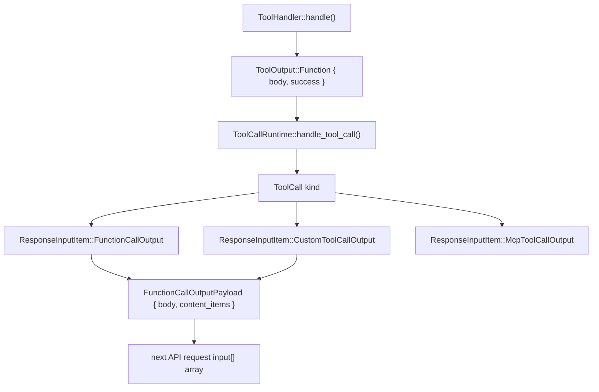

# Tool Event Emission and Output

Relevant source files

-   [codex-rs/app-server/src/command\_exec.rs](https://github.com/openai/codex/blob/d807d44a/codex-rs/app-server/src/command_exec.rs)
-   [codex-rs/core/src/context\_manager/history.rs](https://github.com/openai/codex/blob/d807d44a/codex-rs/core/src/context_manager/history.rs)
-   [codex-rs/core/src/context\_manager/history\_tests.rs](https://github.com/openai/codex/blob/d807d44a/codex-rs/core/src/context_manager/history_tests.rs)
-   [codex-rs/core/src/context\_manager/mod.rs](https://github.com/openai/codex/blob/d807d44a/codex-rs/core/src/context_manager/mod.rs)
-   [codex-rs/core/src/context\_manager/normalize.rs](https://github.com/openai/codex/blob/d807d44a/codex-rs/core/src/context_manager/normalize.rs)
-   [codex-rs/core/src/event\_mapping.rs](https://github.com/openai/codex/blob/d807d44a/codex-rs/core/src/event_mapping.rs)
-   [codex-rs/core/src/exec.rs](https://github.com/openai/codex/blob/d807d44a/codex-rs/core/src/exec.rs)
-   [codex-rs/core/src/sandboxing/mod.rs](https://github.com/openai/codex/blob/d807d44a/codex-rs/core/src/sandboxing/mod.rs)
-   [codex-rs/core/src/stream\_events\_utils.rs](https://github.com/openai/codex/blob/d807d44a/codex-rs/core/src/stream_events_utils.rs)
-   [codex-rs/core/src/stream\_events\_utils\_tests.rs](https://github.com/openai/codex/blob/d807d44a/codex-rs/core/src/stream_events_utils_tests.rs)
-   [codex-rs/core/src/tasks/user\_shell.rs](https://github.com/openai/codex/blob/d807d44a/codex-rs/core/src/tasks/user_shell.rs)
-   [codex-rs/core/src/tools/events.rs](https://github.com/openai/codex/blob/d807d44a/codex-rs/core/src/tools/events.rs)
-   [codex-rs/core/src/tools/handlers/shell.rs](https://github.com/openai/codex/blob/d807d44a/codex-rs/core/src/tools/handlers/shell.rs)
-   [codex-rs/core/src/tools/handlers/unified\_exec.rs](https://github.com/openai/codex/blob/d807d44a/codex-rs/core/src/tools/handlers/unified_exec.rs)
-   [codex-rs/core/src/tools/mod.rs](https://github.com/openai/codex/blob/d807d44a/codex-rs/core/src/tools/mod.rs)
-   [codex-rs/core/src/tools/orchestrator.rs](https://github.com/openai/codex/blob/d807d44a/codex-rs/core/src/tools/orchestrator.rs)
-   [codex-rs/core/src/tools/runtimes/apply\_patch.rs](https://github.com/openai/codex/blob/d807d44a/codex-rs/core/src/tools/runtimes/apply_patch.rs)
-   [codex-rs/core/src/tools/runtimes/mod.rs](https://github.com/openai/codex/blob/d807d44a/codex-rs/core/src/tools/runtimes/mod.rs)
-   [codex-rs/core/src/tools/runtimes/shell.rs](https://github.com/openai/codex/blob/d807d44a/codex-rs/core/src/tools/runtimes/shell.rs)
-   [codex-rs/core/src/tools/runtimes/unified\_exec.rs](https://github.com/openai/codex/blob/d807d44a/codex-rs/core/src/tools/runtimes/unified_exec.rs)
-   [codex-rs/core/src/tools/sandboxing.rs](https://github.com/openai/codex/blob/d807d44a/codex-rs/core/src/tools/sandboxing.rs)
-   [codex-rs/core/src/truncate.rs](https://github.com/openai/codex/blob/d807d44a/codex-rs/core/src/truncate.rs)
-   [codex-rs/core/src/unified\_exec/async\_watcher.rs](https://github.com/openai/codex/blob/d807d44a/codex-rs/core/src/unified_exec/async_watcher.rs)
-   [codex-rs/core/src/unified\_exec/errors.rs](https://github.com/openai/codex/blob/d807d44a/codex-rs/core/src/unified_exec/errors.rs)
-   [codex-rs/core/src/unified\_exec/mod.rs](https://github.com/openai/codex/blob/d807d44a/codex-rs/core/src/unified_exec/mod.rs)
-   [codex-rs/core/src/unified\_exec/process\_manager.rs](https://github.com/openai/codex/blob/d807d44a/codex-rs/core/src/unified_exec/process_manager.rs)
-   [codex-rs/core/tests/suite/exec.rs](https://github.com/openai/codex/blob/d807d44a/codex-rs/core/tests/suite/exec.rs)
-   [codex-rs/core/tests/suite/items.rs](https://github.com/openai/codex/blob/d807d44a/codex-rs/core/tests/suite/items.rs)
-   [codex-rs/core/tests/suite/shell\_serialization.rs](https://github.com/openai/codex/blob/d807d44a/codex-rs/core/tests/suite/shell_serialization.rs)
-   [codex-rs/core/tests/suite/tool\_harness.rs](https://github.com/openai/codex/blob/d807d44a/codex-rs/core/tests/suite/tool_harness.rs)
-   [codex-rs/core/tests/suite/tools.rs](https://github.com/openai/codex/blob/d807d44a/codex-rs/core/tests/suite/tools.rs)
-   [codex-rs/core/tests/suite/unified\_exec.rs](https://github.com/openai/codex/blob/d807d44a/codex-rs/core/tests/suite/unified_exec.rs)
-   [codex-rs/linux-sandbox/tests/suite/landlock.rs](https://github.com/openai/codex/blob/d807d44a/codex-rs/linux-sandbox/tests/suite/landlock.rs)
-   [codex-rs/protocol/src/items.rs](https://github.com/openai/codex/blob/d807d44a/codex-rs/protocol/src/items.rs)

## Purpose and Scope

This page covers how a tool handler's execution results are packaged and returned to the model, and how lifecycle events are broadcast to the UI. Specifically, it documents:

-   `ToolOutput`, `FunctionCallOutputBody`, and `ResponseInputItem` — the types that carry tool results.
-   `ToolEmitter` and `ToolEventCtx` — the factory pattern that emits begin/end events to the TUI or exec mode.
-   The `UnifiedExecProcessManager` and its background `async_watcher` tasks for streaming output.
-   The exact text formats placed in function call output for each tool family.

For tool handler implementation details see [Shell Execution Tools](/openai/codex/5.2-shell-execution-tools), [Apply Patch System](/openai/codex/5.4-apply-patch-system), and [JavaScript REPL Tool](/openai/codex/5.8-code-mode-and-javascript-repl). For orchestration and sandbox selection see [Tool Orchestration and Approval](/openai/codex/5.5-tool-orchestration-and-approval).

---

## Core Output Types

### `ToolOutput`

Every `ToolHandler::handle()` implementation returns a variant of the output enum. The primary variant used by all current handlers is:

```
ToolOutput::Function {    body: FunctionCallOutputBody,    success: Option<bool>,}
```
### `FunctionCallOutputBody`

This enum selects the wire format for the model response:

| Variant | Wire representation |
| --- | --- |
| `FunctionCallOutputBody::Text(String)` | `output` field is a JSON string containing text. |
| `FunctionCallOutputBody::ContentItems(Vec<FunctionCallOutputContentItem>)` | `output` field is a JSON array of structured items (e.g., images). |

### `ResponseInputItem`

The wire type appended to the `input` array of the next API request. It maps the tool result back to the model's conversation history.

| Variant | Used for |
| --- | --- |
| `ResponseInputItem::FunctionCallOutput { call_id, output }` | Regular tools (`shell`, `shell_command`, `apply_patch`). |
| `ResponseInputItem::CustomToolCallOutput { call_id, output }` | Specialized tools like `js_repl`. |
| `ResponseInputItem::McpToolCallOutput { call_id, result }` | Tools provided via Model Context Protocol. |

Sources: [codex-rs/core/src/tools/handlers/shell.rs181-190](https://github.com/openai/codex/blob/d807d44a/codex-rs/core/src/tools/handlers/shell.rs#L181-L190) [codex-rs/core/src/tools/handlers/unified\_exec.rs120-130](https://github.com/openai/codex/blob/d807d44a/codex-rs/core/src/tools/handlers/unified_exec.rs#L120-L130) [codex-rs/protocol/src/models.rs13-18](https://github.com/openai/codex/blob/d807d44a/codex-rs/protocol/src/models.rs#L13-L18)

---

## Data Flow: Handler Result to API Request

The pipeline transforms a raw tool result into a formatted item suitable for the model's next prompt.

**Diagram: ToolOutput to ResponseInputItem Pipeline**


Sources: [codex-rs/core/src/tools/handlers/shell.rs425-440](https://github.com/openai/codex/blob/d807d44a/codex-rs/core/src/tools/handlers/shell.rs#L425-L440) [codex-rs/core/src/tools/handlers/unified\_exec.rs276-282](https://github.com/openai/codex/blob/d807d44a/codex-rs/core/src/tools/handlers/unified_exec.rs#L276-L282) [codex-rs/core/src/context\_manager/history.rs112-117](https://github.com/openai/codex/blob/d807d44a/codex-rs/core/src/context_manager/history.rs#L112-L117)

---

## Event Emission: `ToolEmitter`

Every tool execution emits lifecycle events to the UI through `Session::send_event`. The `ToolEmitter` enum centralizes this logic, ensuring consistent event fields across different tool implementations.

### `ToolEmitter` Variants

| Variant | Fields | Events emitted |
| --- | --- | --- |
| `ToolEmitter::Shell` | `command`, `cwd`, `source`, `parsed_cmd`, `freeform` | `ExecCommandBegin` / `ExecCommandEnd` |
| `ToolEmitter::ApplyPatch` | `changes`, `auto_approved` | `PatchApplyBegin` / `PatchApplyEnd` |
| `ToolEmitter::UnifiedExec` | `command`, `cwd`, `source`, `process_id` | `ExecCommandBegin` / `ExecCommandEnd` + streaming deltas |

### `ToolEventCtx`

A short-lived context holding references needed for event emission:

```
pub(crate) struct ToolEventCtx<'a> {    pub session: &'a Session,    pub turn: &'a TurnContext,    pub call_id: &'a str,    pub turn_diff_tracker: Option<&'a SharedTurnDiffTracker>,}
```
Sources: [codex-rs/core/src/tools/events.rs29-50](https://github.com/openai/codex/blob/d807d44a/codex-rs/core/src/tools/events.rs#L29-L50) [codex-rs/core/src/tools/events.rs90-109](https://github.com/openai/codex/blob/d807d44a/codex-rs/core/src/tools/events.rs#L90-L109)

---

## Lifecycle Event Sequence

**Diagram: Per-Tool-Call Event Sequence**

> **[Mermaid sequence]**
> *(图表结构无法解析)*

Sources: [codex-rs/core/src/tools/events.rs64-109](https://github.com/openai/codex/blob/d807d44a/codex-rs/core/src/tools/events.rs#L64-L109) [codex-rs/core/src/unified\_exec/process\_manager.rs191-193](https://github.com/openai/codex/blob/d807d44a/codex-rs/core/src/unified_exec/process_manager.rs#L191-L193) [codex-rs/core/src/unified\_exec/async\_watcher.rs45-55](https://github.com/openai/codex/blob/d807d44a/codex-rs/core/src/unified_exec/async_watcher.rs#L45-L55)

---

## Unified Exec: Background Async Watchers

Unified Exec introduces background tasks to handle long-running processes that may span multiple turns.

### `start_streaming_output`

This function spawns a task that monitors the `UnifiedExecProcess` output buffer. It emits `ExecCommandOutputDelta` events to the UI in real-time as data arrives in the PTY.

### `spawn_exit_watcher`

This task waits for the process to terminate. Upon exit, it:

1.  Captures the final exit code.
2.  Emits the `ExecCommandEnd` event.
3.  Cleans up process resources in the `UnifiedExecProcessManager`.

Sources: [codex-rs/core/src/unified\_exec/process\_manager.rs193-195](https://github.com/openai/codex/blob/d807d44a/codex-rs/core/src/unified_exec/process_manager.rs#L193-L195) [codex-rs/core/src/unified\_exec/async\_watcher.rs45-100](https://github.com/openai/codex/blob/d807d44a/codex-rs/core/src/unified_exec/async_watcher.rs#L45-L100) [codex-rs/core/src/unified\_exec/async\_watcher.rs130-150](https://github.com/openai/codex/blob/d807d44a/codex-rs/core/src/unified_exec/async_watcher.rs#L130-L150)

---

## Output Formatting

### Shell Tool Output (Two Modes)

The `freeform` flag on `ToolEmitter::Shell` determines the wire format. It is enabled when `include_apply_patch_tool` is set in the session config.

**JSON format (`freeform = false`):**

```
{"metadata":{"exit_code":0,"duration_seconds":0.123},"output":"hello\n"}
```
**Plain text format (`freeform = true`):**

```
Exit code: 0
Wall time: 0.1234 seconds
Output:
hello
```
Sources: [codex-rs/core/tests/suite/shell\_serialization.rs174-213](https://github.com/openai/codex/blob/d807d44a/codex-rs/core/tests/suite/shell_serialization.rs#L174-L213) [codex-rs/core/tests/suite/shell\_serialization.rs283-334](https://github.com/openai/codex/blob/d807d44a/codex-rs/core/tests/suite/shell_serialization.rs#L283-L334)

### Unified Exec Output: `format_response()`

The `UnifiedExecProcessManager` formats the yield response based on whether the process finished or is still running.

**If the process is still alive after the yield window:**

```
Chunk ID: a3f0c1
Wall time: 0.2500 seconds
Process running with session ID 1000
Output:
partial output so far
```
**If the process exited:**

```
Chunk ID: a3f0c1
Wall time: 1.2345 seconds
Process exited with code 0
Output:
hello from the process
```
Sources: [codex-rs/core/src/tools/handlers/unified\_exec.rs310-337](https://github.com/openai/codex/blob/d807d44a/codex-rs/core/src/tools/handlers/unified_exec.rs#L310-L337) [codex-rs/core/tests/suite/unified\_exec.rs59-112](https://github.com/openai/codex/blob/d807d44a/codex-rs/core/tests/suite/unified_exec.rs#L59-L112)

---

## Output Size Limits and Truncation

To prevent context window overflow, outputs are capped before being returned to the model.

| Constant | Value | Description |
| --- | --- | --- |
| `UNIFIED_EXEC_OUTPUT_MAX_BYTES` | 1 MiB | Hard cap on total bytes retained in memory. |
| `DEFAULT_MAX_OUTPUT_TOKENS` | 10,000 | Default limit for a single tool response. |
| `IO_DRAIN_TIMEOUT_MS` | 2,000 | Timeout for draining pipes after process exit. |

When truncation occurs, the `HeadTailBuffer` ensures that both the beginning and the end of the output are preserved, which is critical for seeing error messages at the end of large logs.

Sources: [codex-rs/core/src/unified\_exec/mod.rs54-66](https://github.com/openai/codex/blob/d807d44a/codex-rs/core/src/unified_exec/mod.rs#L54-L66) [codex-rs/core/src/exec.rs61-74](https://github.com/openai/codex/blob/d807d44a/codex-rs/core/src/exec.rs#L61-L74) [codex-rs/core/src/unified\_exec/process\_manager.rs48-52](https://github.com/openai/codex/blob/d807d44a/codex-rs/core/src/unified_exec/process_manager.rs#L48-L52)
