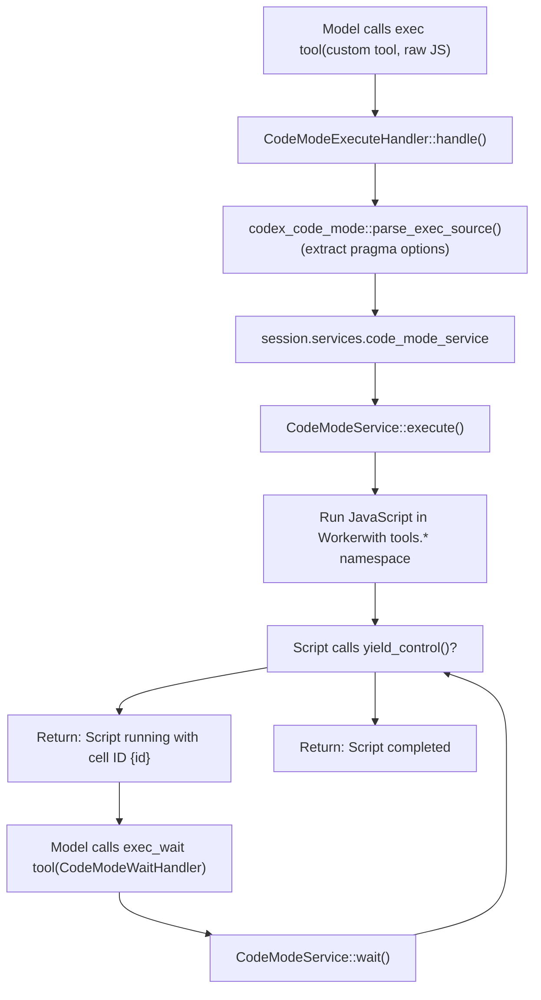
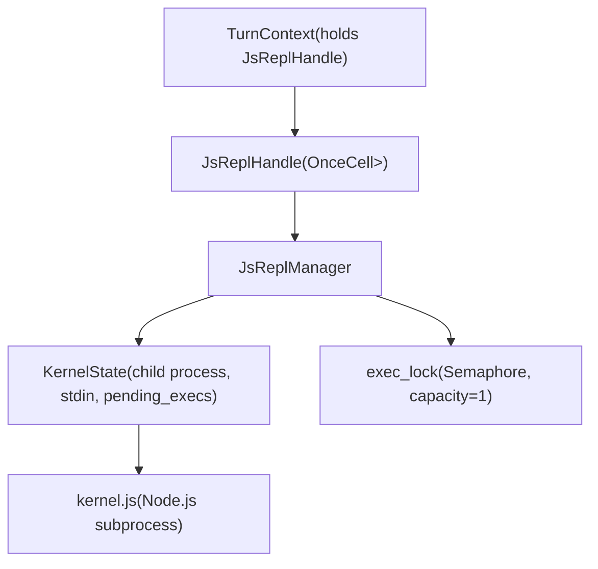

# Code Mode and JavaScript REPL

Relevant source files

-   [codex-rs/app-server-protocol/schema/typescript/v2/DynamicToolSpec.ts](https://github.com/openai/codex/blob/d807d44a/codex-rs/app-server-protocol/schema/typescript/v2/DynamicToolSpec.ts)
-   [codex-rs/app-server/tests/suite/v2/dynamic\_tools.rs](https://github.com/openai/codex/blob/d807d44a/codex-rs/app-server/tests/suite/v2/dynamic_tools.rs)
-   [codex-rs/core/src/project\_doc.rs](https://github.com/openai/codex/blob/d807d44a/codex-rs/core/src/project_doc.rs)
-   [codex-rs/core/src/project\_doc\_tests.rs](https://github.com/openai/codex/blob/d807d44a/codex-rs/core/src/project_doc_tests.rs)
-   [codex-rs/core/src/skills/render.rs](https://github.com/openai/codex/blob/d807d44a/codex-rs/core/src/skills/render.rs)
-   [codex-rs/core/src/tools/code\_mode/execute\_handler.rs](https://github.com/openai/codex/blob/d807d44a/codex-rs/core/src/tools/code_mode/execute_handler.rs)
-   [codex-rs/core/src/tools/code\_mode/mod.rs](https://github.com/openai/codex/blob/d807d44a/codex-rs/core/src/tools/code_mode/mod.rs)
-   [codex-rs/core/src/tools/code\_mode/wait\_handler.rs](https://github.com/openai/codex/blob/d807d44a/codex-rs/core/src/tools/code_mode/wait_handler.rs)
-   [codex-rs/core/src/tools/code\_mode\_description.rs](https://github.com/openai/codex/blob/d807d44a/codex-rs/core/src/tools/code_mode_description.rs)
-   [codex-rs/core/src/tools/code\_mode\_description\_tests.rs](https://github.com/openai/codex/blob/d807d44a/codex-rs/core/src/tools/code_mode_description_tests.rs)
-   [codex-rs/core/src/tools/js\_repl/kernel.js](https://github.com/openai/codex/blob/d807d44a/codex-rs/core/src/tools/js_repl/kernel.js)
-   [codex-rs/core/src/tools/js\_repl/mod.rs](https://github.com/openai/codex/blob/d807d44a/codex-rs/core/src/tools/js_repl/mod.rs)
-   [codex-rs/core/src/tools/js\_repl/mod\_tests.rs](https://github.com/openai/codex/blob/d807d44a/codex-rs/core/src/tools/js_repl/mod_tests.rs)
-   [codex-rs/core/tests/suite/code\_mode.rs](https://github.com/openai/codex/blob/d807d44a/codex-rs/core/tests/suite/code_mode.rs)
-   [codex-rs/core/tests/suite/js\_repl.rs](https://github.com/openai/codex/blob/d807d44a/codex-rs/core/tests/suite/js_repl.rs)
-   [codex-rs/protocol/src/dynamic\_tools.rs](https://github.com/openai/codex/blob/d807d44a/codex-rs/protocol/src/dynamic_tools.rs)
-   [docs/js\_repl.md](https://github.com/openai/codex/blob/d807d44a/docs/js_repl.md?plain=1)

This page documents two JavaScript execution systems in Codex:

1.  **Code Mode** (`exec` / `exec_wait` tools) – A yielding JavaScript execution environment that supports long-running scripts with yield/resume semantics and multi-session concurrency.
2.  **JavaScript REPL** (`js_repl` / `js_repl_reset` tools) – A persistent Node.js kernel for interactive JavaScript evaluation with stateful variable bindings.

Both systems run JavaScript with access to Codex tools via nested tool calls, but they differ in execution model, state management, and use cases.

---

## Overview and Feature Gates

Both systems are controlled by feature flags:

| Feature flag | Effect |
| --- | --- |
| `Feature::CodeMode` | Enables the `exec` and `exec_wait` tools for yielding JavaScript execution. |
| `Feature::JsRepl` | Enables the `js_repl` and `js_repl_reset` tools with a persistent Node.js kernel. |
| `Feature::JsReplToolsOnly` | Blocks all direct model tool calls except `js_repl` / `js_repl_reset`; forces all other tools through `codex.tool(...)`. |

Sources: [codex-rs/core/src/tools/code\_mode/mod.rs34](https://github.com/openai/codex/blob/d807d44a/codex-rs/core/src/tools/code_mode/mod.rs#L34-L34) [codex-rs/core/src/project\_doc.rs44-46](https://github.com/openai/codex/blob/d807d44a/codex-rs/core/src/project_doc.rs#L44-L46) [codex-rs/core/src/project\_doc.rs66-70](https://github.com/openai/codex/blob/d807d44a/codex-rs/core/src/project_doc.rs#L66-L70)

---

## Code Mode System

### Purpose and Architecture

Code Mode provides a **yielding execution model** for JavaScript that allows scripts to run for extended periods, yield control back to the model, and maintain execution state across multiple turns using `cell_id` management.

**Code Mode execution flow diagram**


Sources: [codex-rs/core/src/tools/code\_mode/execute\_handler.rs15-87](https://github.com/openai/codex/blob/d807d44a/codex-rs/core/src/tools/code_mode/execute_handler.rs#L15-L87) [codex-rs/core/src/tools/code\_mode/mod.rs50-106](https://github.com/openai/codex/blob/d807d44a/codex-rs/core/src/tools/code_mode/mod.rs#L50-L106) [codex-rs/core/src/tools/code\_mode/execute\_handler.rs25-26](https://github.com/openai/codex/blob/d807d44a/codex-rs/core/src/tools/code_mode/execute_handler.rs#L25-L26)

### Tool Names and Registration

Code Mode uses two tool names defined as constants:

| Constant | Value | Tool Type | Purpose |
| --- | --- | --- | --- |
| `PUBLIC_TOOL_NAME` | `"exec"` | Custom/Freeform | Execute JavaScript with optional yield. |
| `WAIT_TOOL_NAME` | `"exec_wait"` | Function | Resume, poll, or terminate a yielded cell. |

Sources: [codex-rs/core/src/tools/code\_mode/mod.rs40-42](https://github.com/openai/codex/blob/d807d44a/codex-rs/core/src/tools/code_mode/mod.rs#L40-L42)

### Pragma-based Configuration

Code Mode supports inline configuration via a pragma comment on the first line, parsed by `codex_code_mode::parse_exec_source`:

```
// @exec: {"max_output_tokens": 500, "yield_time_ms": 1000}text("Starting task...");yield_control();
```
Sources: [codex-rs/core/src/tools/code\_mode/execute\_handler.rs25-26](https://github.com/openai/codex/blob/d807d44a/codex-rs/core/src/tools/code_mode/execute_handler.rs#L25-L26) [codex-rs/core/src/tools/code\_mode/execute\_handler.rs40-47](https://github.com/openai/codex/blob/d807d44a/codex-rs/core/src/tools/code_mode/execute_handler.rs#L40-L47)

### Multi-Session and Cell Management

The `CodeModeService` manages concurrent execution cells. Each cell is identified by a `cell_id` returned to the model. The service maintains state using `stored_values` which are persisted and replaced across execution turns.

Sources: [codex-rs/core/src/tools/code\_mode/mod.rs61-77](https://github.com/openai/codex/blob/d807d44a/codex-rs/core/src/tools/code_mode/mod.rs#L61-L77) [codex-rs/core/src/tools/code\_mode/execute\_handler.rs29-34](https://github.com/openai/codex/blob/d807d44a/codex-rs/core/src/tools/code_mode/execute_handler.rs#L29-L34)

---

## JavaScript REPL Tool

### Purpose and Scope

The JavaScript REPL (`js_repl`) provides a **persistent Node.js kernel** that maintains variable bindings across multiple tool calls within a session.

**js\_repl kernel architecture diagram**


Sources: [codex-rs/core/src/tools/js\_repl/mod.rs65-101](https://github.com/openai/codex/blob/d807d44a/codex-rs/core/src/tools/js_repl/mod.rs#L65-L101) [codex-rs/core/src/tools/js\_repl/mod.rs117-125](https://github.com/openai/codex/blob/d807d44a/codex-rs/core/src/tools/js_repl/mod.rs#L117-L125)

### Host–Kernel Communication

The Rust host and the Node.js kernel communicate over **newline-delimited JSON** on `stdin`/`stdout`. The kernel uses a VM context and a custom ESM "cell" model to persist bindings.

**js\_repl protocol message flow diagram**

> **[Mermaid sequence]**
> *(图表结构无法解析)*

Sources: [codex-rs/core/src/tools/js\_repl/mod.rs117-125](https://github.com/openai/codex/blob/d807d44a/codex-rs/core/src/tools/js_repl/mod.rs#L117-L125) [codex-rs/core/src/tools/js\_repl/kernel.js1-50](https://github.com/openai/codex/blob/d807d44a/codex-rs/core/src/tools/js_repl/kernel.js#L1-L50)

### Binding Persistence and Meriyah

The kernel uses a vendored **Meriyah** parser to analyze each snippet's AST and extract top-level declarations (`const`, `let`, `var`, `function`, `class`). These names are exported from the current "cell" and imported by the next, preserving REPL state.

Sources: [codex-rs/core/src/tools/js\_repl/kernel.js18-21](https://github.com/openai/codex/blob/d807d44a/codex-rs/core/src/tools/js_repl/kernel.js#L18-L21) [codex-rs/core/src/tools/js\_repl/kernel.js79-94](https://github.com/openai/codex/blob/d807d44a/codex-rs/core/src/tools/js_repl/kernel.js#L79-L94) [codex-rs/core/src/tools/js\_repl/mod.rs53](https://github.com/openai/codex/blob/d807d44a/codex-rs/core/src/tools/js_repl/mod.rs#L53-L53)

### Helper APIs and Module Resolution

The `js_repl` environment exposes a `codex` global with several helpers:

-   `codex.tool(name, args?)`: Executes a Codex tool call.
-   `codex.emitImage(imageLike)`: Emits an image to the output.
-   `codex.cwd`, `codex.homeDir`, `codex.tmpDir`: Path information.

**Module Resolution Order:**

1.  `CODEX_JS_REPL_NODE_MODULE_DIRS` environment variable.
2.  `js_repl_node_module_dirs` in configuration.
3.  Thread working directory (cwd).

Sources: [codex-rs/core/src/project\_doc.rs54-57](https://github.com/openai/codex/blob/d807d44a/codex-rs/core/src/project_doc.rs#L54-L57) [docs/js\_repl.md42-51](https://github.com/openai/codex/blob/d807d44a/docs/js_repl.md?plain=1#L42-L51) [codex-rs/core/src/tools/js\_repl/kernel.js135-160](https://github.com/openai/codex/blob/d807d44a/codex-rs/core/src/tools/js_repl/kernel.js#L135-L160)

### Diagnostics and Safety

The system captures a rolling tail of `stderr` for diagnostics (limited to 20 lines / 4KB). If the kernel fails, it returns a JSON-encoded diagnostic block to the model.

| Constant | Value |
| --- | --- |
| `JS_REPL_STDERR_TAIL_LINE_LIMIT` | 20 |
| `JS_REPL_STDERR_TAIL_MAX_BYTES` | 4,096 |

Sources: [codex-rs/core/src/tools/js\_repl/mod.rs55-57](https://github.com/openai/codex/blob/d807d44a/codex-rs/core/src/tools/js_repl/mod.rs#L55-L57) [codex-rs/core/src/tools/js\_repl/mod\_tests.rs80-127](https://github.com/openai/codex/blob/d807d44a/codex-rs/core/src/tools/js_repl/mod_tests.rs#L80-L127)

---

## Logging

Nested tool calls inside `js_repl` emit structured log events:

-   `info`: Bounded summary (response type, item counts).
-   `trace`: Full raw response JSON.

Sources: [codex-rs/core/src/tools/js\_repl/mod.rs456-489](https://github.com/openai/codex/blob/d807d44a/codex-rs/core/src/tools/js_repl/mod.rs#L456-L489) [docs/js\_repl.md95-103](https://github.com/openai/codex/blob/d807d44a/docs/js_repl.md?plain=1#L95-L103)
