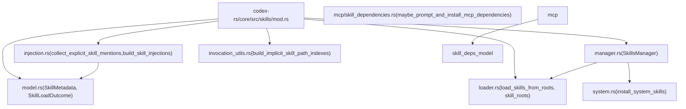
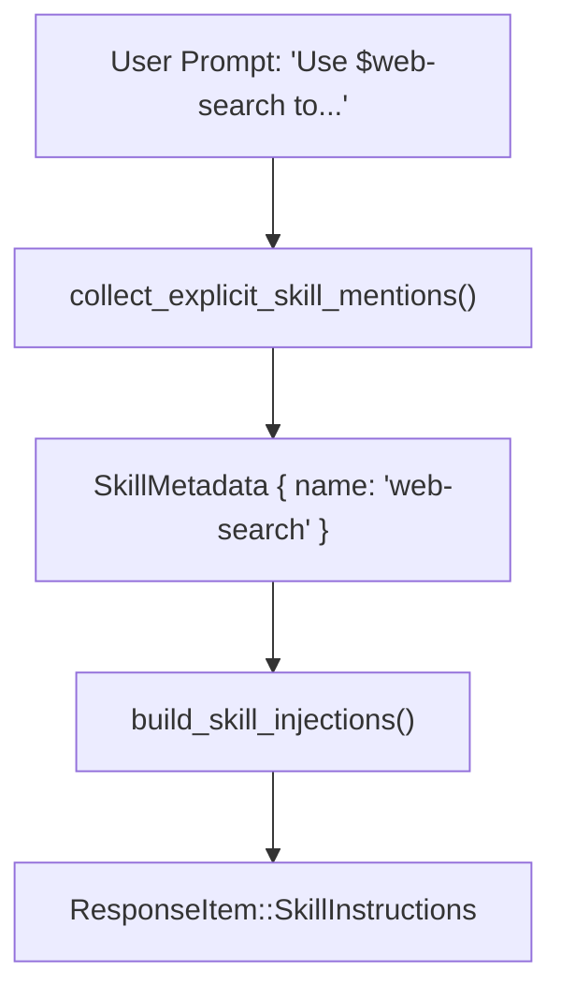
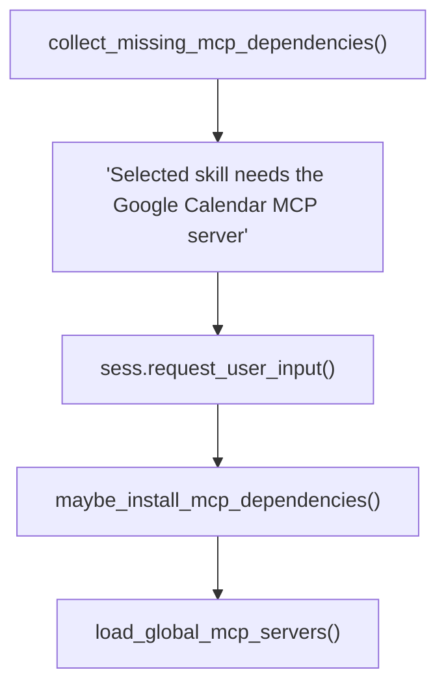

# Skills System

Relevant source files

-   [codex-rs/core/src/apps/render.rs](https://github.com/openai/codex/blob/d807d44a/codex-rs/core/src/apps/render.rs)
-   [codex-rs/core/src/arc\_monitor.rs](https://github.com/openai/codex/blob/d807d44a/codex-rs/core/src/arc_monitor.rs)
-   [codex-rs/core/src/arc\_monitor\_tests.rs](https://github.com/openai/codex/blob/d807d44a/codex-rs/core/src/arc_monitor_tests.rs)
-   [codex-rs/core/src/consequential\_tool\_message\_templates.json](https://github.com/openai/codex/blob/d807d44a/codex-rs/core/src/consequential_tool_message_templates.json)
-   [codex-rs/core/src/mcp/mod\_tests.rs](https://github.com/openai/codex/blob/d807d44a/codex-rs/core/src/mcp/mod_tests.rs)
-   [codex-rs/core/src/mcp/skill\_dependencies.rs](https://github.com/openai/codex/blob/d807d44a/codex-rs/core/src/mcp/skill_dependencies.rs)
-   [codex-rs/core/src/mcp\_tool\_approval\_templates.rs](https://github.com/openai/codex/blob/d807d44a/codex-rs/core/src/mcp_tool_approval_templates.rs)
-   [codex-rs/core/src/mcp\_tool\_call.rs](https://github.com/openai/codex/blob/d807d44a/codex-rs/core/src/mcp_tool_call.rs)
-   [codex-rs/core/src/mcp\_tool\_call\_tests.rs](https://github.com/openai/codex/blob/d807d44a/codex-rs/core/src/mcp_tool_call_tests.rs)
-   [codex-rs/core/src/mention\_syntax.rs](https://github.com/openai/codex/blob/d807d44a/codex-rs/core/src/mention_syntax.rs)
-   [codex-rs/core/src/mentions.rs](https://github.com/openai/codex/blob/d807d44a/codex-rs/core/src/mentions.rs)
-   [codex-rs/core/src/plugins/injection.rs](https://github.com/openai/codex/blob/d807d44a/codex-rs/core/src/plugins/injection.rs)
-   [codex-rs/core/src/plugins/render.rs](https://github.com/openai/codex/blob/d807d44a/codex-rs/core/src/plugins/render.rs)
-   [codex-rs/core/src/plugins/render\_tests.rs](https://github.com/openai/codex/blob/d807d44a/codex-rs/core/src/plugins/render_tests.rs)
-   [codex-rs/core/src/skills/injection.rs](https://github.com/openai/codex/blob/d807d44a/codex-rs/core/src/skills/injection.rs)
-   [codex-rs/core/src/skills/invocation\_utils.rs](https://github.com/openai/codex/blob/d807d44a/codex-rs/core/src/skills/invocation_utils.rs)
-   [codex-rs/core/src/skills/loader.rs](https://github.com/openai/codex/blob/d807d44a/codex-rs/core/src/skills/loader.rs)
-   [codex-rs/core/src/skills/manager.rs](https://github.com/openai/codex/blob/d807d44a/codex-rs/core/src/skills/manager.rs)
-   [codex-rs/core/src/skills/manager\_tests.rs](https://github.com/openai/codex/blob/d807d44a/codex-rs/core/src/skills/manager_tests.rs)
-   [codex-rs/core/src/skills/mod.rs](https://github.com/openai/codex/blob/d807d44a/codex-rs/core/src/skills/mod.rs)
-   [codex-rs/core/src/skills/model.rs](https://github.com/openai/codex/blob/d807d44a/codex-rs/core/src/skills/model.rs)
-   [codex-rs/core/src/tools/discoverable.rs](https://github.com/openai/codex/blob/d807d44a/codex-rs/core/src/tools/discoverable.rs)
-   [codex-rs/core/src/tools/handlers/tool\_suggest.rs](https://github.com/openai/codex/blob/d807d44a/codex-rs/core/src/tools/handlers/tool_suggest.rs)
-   [codex-rs/core/src/turn\_metadata\_tests.rs](https://github.com/openai/codex/blob/d807d44a/codex-rs/core/src/turn_metadata_tests.rs)
-   [codex-rs/core/templates/search\_tool/tool\_description.md](https://github.com/openai/codex/blob/d807d44a/codex-rs/core/templates/search_tool/tool_description.md?plain=1)
-   [codex-rs/core/tests/common/apps\_test\_server.rs](https://github.com/openai/codex/blob/d807d44a/codex-rs/core/tests/common/apps_test_server.rs)
-   [codex-rs/core/tests/suite/plugins.rs](https://github.com/openai/codex/blob/d807d44a/codex-rs/core/tests/suite/plugins.rs)
-   [codex-rs/core/tests/suite/search\_tool.rs](https://github.com/openai/codex/blob/d807d44a/codex-rs/core/tests/suite/search_tool.rs)
-   [codex-rs/tui/src/bottom\_pane/mcp\_server\_elicitation.rs](https://github.com/openai/codex/blob/d807d44a/codex-rs/tui/src/bottom_pane/mcp_server_elicitation.rs)
-   [codex-rs/tui/src/bottom\_pane/snapshots/codex\_tui\_\_bottom\_pane\_\_mcp\_server\_elicitation\_\_tests\_\_mcp\_server\_elicitation\_approval\_form\_with\_param\_summary.snap](https://github.com/openai/codex/blob/d807d44a/codex-rs/tui/src/bottom_pane/snapshots/codex_tui__bottom_pane__mcp_server_elicitation__tests__mcp_server_elicitation_approval_form_with_param_summary.snap)
-   [codex-rs/tui/src/bottom\_pane/snapshots/codex\_tui\_\_bottom\_pane\_\_mcp\_server\_elicitation\_\_tests\_\_mcp\_server\_elicitation\_approval\_form\_with\_session\_persist.snap](https://github.com/openai/codex/blob/d807d44a/codex-rs/tui/src/bottom_pane/snapshots/codex_tui__bottom_pane__mcp_server_elicitation__tests__mcp_server_elicitation_approval_form_with_session_persist.snap)
-   [codex-rs/tui/src/bottom\_pane/snapshots/codex\_tui\_\_bottom\_pane\_\_mcp\_server\_elicitation\_\_tests\_\_mcp\_server\_elicitation\_approval\_form\_without\_schema.snap](https://github.com/openai/codex/blob/d807d44a/codex-rs/tui/src/bottom_pane/snapshots/codex_tui__bottom_pane__mcp_server_elicitation__tests__mcp_server_elicitation_approval_form_without_schema.snap)
-   [codex-rs/tui/src/chatwidget/skills.rs](https://github.com/openai/codex/blob/d807d44a/codex-rs/tui/src/chatwidget/skills.rs)
-   [codex-rs/tui/src/mention\_codec.rs](https://github.com/openai/codex/blob/d807d44a/codex-rs/tui/src/mention_codec.rs)

This page documents the Skills System in `codex-core`: how skills are defined on disk, discovered at runtime, injected into model prompts, and how their sandbox permissions are compiled and enforced. It also covers the MCP dependency installation pipeline that triggers when a skill requires external MCP servers.

For details about MCP servers themselves, see [6.2 MCP Connection Manager](https://github.com/openai/codex/blob/d807d44a/6.2 MCP Connection Manager) For how the TUI presents the skill picker overlay, see [4.1.5 Interactive Overlays and Popups](https://github.com/openai/codex/blob/d807d44a/4.1.5 Interactive Overlays and Popups) For sandbox enforcement mechanics, see [5.6 Sandboxing Implementation](https://github.com/openai/codex/blob/d807d44a/5.6 Sandboxing Implementation)

---

## Overview

Skills are reusable instruction documents that a user can reference in a prompt (e.g., `$my-skill`) to inject curated instructions into the model context. Each skill is stored as a directory containing a `SKILL.md` file with a YAML frontmatter header, and optionally an `agents/openai.yaml` metadata file. The system handles:

-   **Discovery** — Scanning filesystem roots by scope (Repo, User, System, Admin).
-   **Parsing** — Extracting frontmatter, metadata, and permission profiles.
-   **Injection** — Inserting skill content into the model prompt as `ResponseItem`s.
-   **Permission compilation** — Translating a skill's `PermissionProfile` into a `SandboxPolicy`.
-   **MCP dependency management** — Installing missing MCP servers declared by a skill.

---

## Key Data Structures

All core types are defined in [codex-rs/core/src/skills/model.rs](https://github.com/openai/codex/blob/d807d44a/codex-rs/core/src/skills/model.rs)

| Type | Role |
| --- | --- |
| `SkillMetadata` | The fully parsed representation of one skill (name, description, path, scope, permissions, etc.). |
| `SkillLoadOutcome` | The result of a scan: a list of `SkillMetadata`, errors, disabled paths, and implicit invocation indexes. |
| `SkillInterface` | Optional UI display fields (display name, icon paths, brand color, default prompt). |
| `SkillDependencies` | List of `SkillToolDependency` entries declaring required MCP or other tool backends. |
| `SkillToolDependency` | One dependency entry: type, value, transport, command, URL. |
| `SkillPolicy` | Policy flags: currently `allow_implicit_invocation` and product restrictions. |
| `SkillError` | A parse failure with path and message. |

`SkillScope` (from `codex-protocol`) controls priority during deduplication:

| Scope | Meaning |
| --- | --- |
| `Repo` | Per-project (`.codex/skills/` or `.agents/skills/`). |
| `User` | Per-user (`$CODEX_HOME/skills/` or `$HOME/.agents/skills/`). |
| `System` | Embedded system skills cached in `$CODEX_HOME/skills/.system`. |
| `Admin` | System-wide (`/etc/codex/skills/`). |

Sources: [codex-rs/core/src/skills/model.rs24-132](https://github.com/openai/codex/blob/d807d44a/codex-rs/core/src/skills/model.rs#L24-L132) [codex-rs/core/src/skills/loader.rs198-206](https://github.com/openai/codex/blob/d807d44a/codex-rs/core/src/skills/loader.rs#L198-L206)

---

## Module Structure

**Skills System module map:**


Sources: [codex-rs/core/src/skills/mod.rs1-25](https://github.com/openai/codex/blob/d807d44a/codex-rs/core/src/skills/mod.rs#L1-L25)

---

## Skill File Format

Each skill is a directory with a required `SKILL.md` and optional `agents/openai.yaml`.

**`SKILL.md` structure:** The loader extracts YAML frontmatter delimited by `---` [codex-rs/core/src/skills/loader.rs165-168](https://github.com/openai/codex/blob/d807d44a/codex-rs/core/src/skills/loader.rs#L165-L168)

```
---name: my-skilldescription: A short description of what this skill does.metadata:  short-description: Even shorter blurb--- # Full Skill Instructions...full markdown instructions for the model...
```
**`agents/openai.yaml` structure** (optional metadata): This file provides structured configuration for tools and permissions [codex-rs/core/src/skills/loader.rs58-67](https://github.com/openai/codex/blob/d807d44a/codex-rs/core/src/skills/loader.rs#L58-L67)

```
interface:  display_name: My Skill  brand_color: "#3A86FF"  default_prompt: "Use $my-skill to..." dependencies:  tools:    - type: mcp      value: my-mcp-server      transport: stdio      command: "npx my-mcp-server" policy:  allow_implicit_invocation: true permissions:  file_system:    read: ["./data"]    write: ["./output"]  network:    enabled: true    allowed_domains: ["example.com"]
```
Field length limits enforced during parsing:

-   `MAX_NAME_LEN`: 64 [codex-rs/core/src/skills/loader.rs138](https://github.com/openai/codex/blob/d807d44a/codex-rs/core/src/skills/loader.rs#L138-L138)
-   `MAX_DESCRIPTION_LEN`: 1024 [codex-rs/core/src/skills/loader.rs139](https://github.com/openai/codex/blob/d807d44a/codex-rs/core/src/skills/loader.rs#L139-L139)

---

## Discovery and Loading

### Skill Roots

`skill_roots()` in [codex-rs/core/src/skills/loader.rs218-223](https://github.com/openai/codex/blob/d807d44a/codex-rs/core/src/skills/loader.rs#L218-L223) determines which filesystem directories to scan. It includes paths from the `ConfigLayerStack`, the current working directory, and any roots provided by the `PluginsManager` [codex-rs/core/src/skills/manager.rs101-112](https://github.com/openai/codex/blob/d807d44a/codex-rs/core/src/skills/manager.rs#L101-L112)

### Discovery Process

`load_skills_from_roots()` iterates through all provided roots and performs a breadth-first search (BFS) [codex-rs/core/src/skills/loader.rs184-216](https://github.com/openai/codex/blob/d807d44a/codex-rs/core/src/skills/loader.rs#L184-L216)

-   **Depth Limit**: Traversal stops at `MAX_SCAN_DEPTH = 6` [codex-rs/core/src/skills/loader.rs149](https://github.com/openai/codex/blob/d807d44a/codex-rs/core/src/skills/loader.rs#L149-L149)
-   **Deduplication**: Skills are deduplicated by their path to `SKILL.md`, with higher priority scopes (Repo > User > System > Admin) winning [codex-rs/core/src/skills/loader.rs193-213](https://github.com/openai/codex/blob/d807d44a/codex-rs/core/src/skills/loader.rs#L193-L213)

### Parsing Pipeline

`parse_skill_file()` [codex-rs/core/src/skills/loader.rs497](https://github.com/openai/codex/blob/d807d44a/codex-rs/core/src/skills/loader.rs#L497-L497) performs the following:

1.  Extracts YAML frontmatter from `SKILL.md`.
2.  Loads optional metadata from `agents/openai.yaml` using `load_skill_metadata()`.
3.  Determines the skill name (using the frontmatter `name` or the directory name if missing).
4.  Handles plugin namespaces via `plugin_namespace_for_skill_path()` [codex-rs/core/src/skills/loader.rs6](https://github.com/openai/codex/blob/d807d44a/codex-rs/core/src/skills/loader.rs#L6-L6)

---

## SkillsManager

`SkillsManager` [codex-rs/core/src/skills/manager.rs31](https://github.com/openai/codex/blob/d807d44a/codex-rs/core/src/skills/manager.rs#L31-L31) is the central coordinator for skill lifecycle. It maintains caches keyed by both current working directory (`cache_by_cwd`) and specific configuration state (`cache_by_config`) to ensure that session-local overrides do not bleed [codex-rs/core/src/skills/manager.rs35-36](https://github.com/openai/codex/blob/d807d44a/codex-rs/core/src/skills/manager.rs#L35-L36)


Sources: [codex-rs/core/src/skills/manager.rs31-112](https://github.com/openai/codex/blob/d807d44a/codex-rs/core/src/skills/manager.rs#L31-L112)

---

## Skill Injection into Prompts

### Mention Parsing

`collect_explicit_skill_mentions()` [codex-rs/core/src/skills/injection.rs100](https://github.com/openai/codex/blob/d807d44a/codex-rs/core/src/skills/injection.rs#L100-L100) identifies which skills the user wants to activate:

1.  **Structured Mentions**: Explicitly selected skills in `UserInput::Skill` [codex-rs/core/src/skills/injection.rs120](https://github.com/openai/codex/blob/d807d44a/codex-rs/core/src/skills/injection.rs#L120-L120)
2.  **Text Mentions**: Scanning `UserInput::Text` for `$name` or `skill://` patterns [codex-rs/core/src/skills/injection.rs139-140](https://github.com/openai/codex/blob/d807d44a/codex-rs/core/src/skills/injection.rs#L139-L140)

### Content Injection

`build_skill_injections()` [codex-rs/core/src/skills/injection.rs24](https://github.com/openai/codex/blob/d807d44a/codex-rs/core/src/skills/injection.rs#L24-L24) asynchronously reads the markdown content of mentioned skills and converts them into `ResponseItem::SkillInstructions` [codex-rs/core/src/skills/injection.rs50-54](https://github.com/openai/codex/blob/d807d44a/codex-rs/core/src/skills/injection.rs#L50-L54) This allows the LLM to "see" the instructions as part of the conversation history.


Sources: [codex-rs/core/src/skills/injection.rs24-153](https://github.com/openai/codex/blob/d807d44a/codex-rs/core/src/skills/injection.rs#L24-L153)

---

## Implicit Invocation and Tools

Skills can be implicitly invoked when the agent uses tools that interact with skill-owned resources.

### Implicit Detection

`build_implicit_skill_path_indexes()` [codex-rs/core/src/skills/invocation\_utils.rs16](https://github.com/openai/codex/blob/d807d44a/codex-rs/core/src/skills/invocation_utils.rs#L16-L16) maps script directories and documentation paths to skills. This allows the system to detect when a tool call (like `python .agents/skills/my-skill/scripts/run.py`) is actually utilizing a skill.

### MCP Dependency Management

If a skill requires an MCP server not yet installed, `maybe_prompt_and_install_mcp_dependencies()` [codex-rs/core/src/mcp/skill\_dependencies.rs136](https://github.com/openai/codex/blob/d807d44a/codex-rs/core/src/mcp/skill_dependencies.rs#L136-L136) triggers:

1.  It identifies missing dependencies via `collect_missing_mcp_dependencies()` [codex-rs/core/src/mcp/skill\_dependencies.rs157](https://github.com/openai/codex/blob/d807d44a/codex-rs/core/src/mcp/skill_dependencies.rs#L157-L157)
2.  It prompts the user for installation using `RequestUserInput` [codex-rs/core/src/mcp/skill\_dependencies.rs103](https://github.com/openai/codex/blob/d807d44a/codex-rs/core/src/mcp/skill_dependencies.rs#L103-L103)
3.  If approved, it updates the global config and performs OAuth login if required [codex-rs/core/src/mcp/skill\_dependencies.rs218-245](https://github.com/openai/codex/blob/d807d44a/codex-rs/core/src/mcp/skill_dependencies.rs#L218-L245)


Sources: [codex-rs/core/src/mcp/skill\_dependencies.rs136-245](https://github.com/openai/codex/blob/d807d44a/codex-rs/core/src/mcp/skill_dependencies.rs#L136-L245)

---

## TUI Integration

The TUI provides interactive management of skills via `ChatWidget`:

-   **Discovery**: Uses `set_skills_from_response()` to update local state from core events [codex-rs/tui/src/chatwidget/skills.rs140](https://github.com/openai/codex/blob/d807d44a/codex-rs/tui/src/chatwidget/skills.rs#L140-L140)
-   **Management**: `open_manage_skills_popup()` displays a `SkillsToggleView` allowing users to enable/disable skills [codex-rs/tui/src/chatwidget/skills.rs62-95](https://github.com/openai/codex/blob/d807d44a/codex-rs/tui/src/chatwidget/skills.rs#L62-L95)
-   **Visuals**: Uses `skill_display_name` and `skill_description` helpers to render the menu [codex-rs/tui/src/chatwidget/skills.rs79-80](https://github.com/openai/codex/blob/d807d44a/codex-rs/tui/src/chatwidget/skills.rs#L79-L80)

Sources: [codex-rs/tui/src/chatwidget/skills.rs1-145](https://github.com/openai/codex/blob/d807d44a/codex-rs/tui/src/chatwidget/skills.rs#L1-L145)
