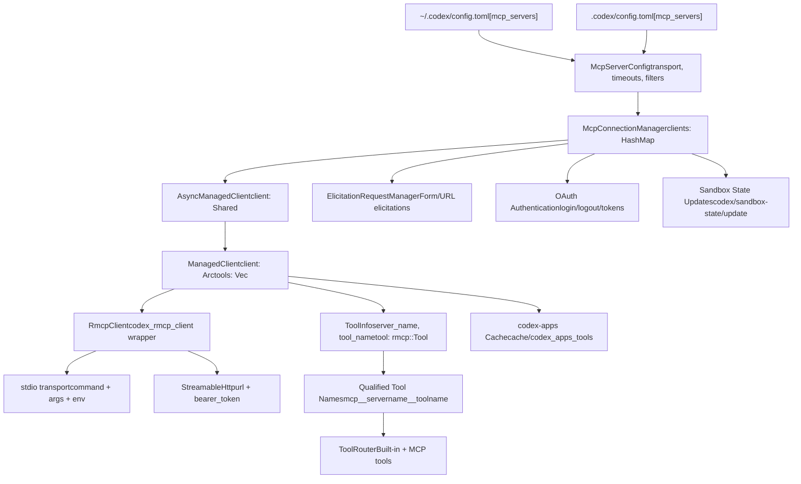

# Model Context Protocol (MCP)

Relevant source files

-   [codex-rs/app-server/tests/suite/v2/mcp\_server\_elicitation.rs](https://github.com/openai/codex/blob/d807d44a/codex-rs/app-server/tests/suite/v2/mcp_server_elicitation.rs)
-   [codex-rs/cli/src/mcp\_cmd.rs](https://github.com/openai/codex/blob/d807d44a/codex-rs/cli/src/mcp_cmd.rs)
-   [codex-rs/cli/tests/mcp\_add\_remove.rs](https://github.com/openai/codex/blob/d807d44a/codex-rs/cli/tests/mcp_add_remove.rs)
-   [codex-rs/cli/tests/mcp\_list.rs](https://github.com/openai/codex/blob/d807d44a/codex-rs/cli/tests/mcp_list.rs)
-   [codex-rs/core/src/mcp\_connection\_manager.rs](https://github.com/openai/codex/blob/d807d44a/codex-rs/core/src/mcp_connection_manager.rs)
-   [codex-rs/core/src/mcp\_connection\_manager\_tests.rs](https://github.com/openai/codex/blob/d807d44a/codex-rs/core/src/mcp_connection_manager_tests.rs)
-   [codex-rs/core/src/state/session.rs](https://github.com/openai/codex/blob/d807d44a/codex-rs/core/src/state/session.rs)
-   [codex-rs/core/src/state/turn.rs](https://github.com/openai/codex/blob/d807d44a/codex-rs/core/src/state/turn.rs)
-   [codex-rs/core/src/tasks/mod.rs](https://github.com/openai/codex/blob/d807d44a/codex-rs/core/src/tasks/mod.rs)
-   [codex-rs/core/src/tools/handlers/tool\_search\_tests.rs](https://github.com/openai/codex/blob/d807d44a/codex-rs/core/src/tools/handlers/tool_search_tests.rs)
-   [codex-rs/core/tests/suite/rmcp\_client.rs](https://github.com/openai/codex/blob/d807d44a/codex-rs/core/tests/suite/rmcp_client.rs)
-   [codex-rs/core/tests/suite/truncation.rs](https://github.com/openai/codex/blob/d807d44a/codex-rs/core/tests/suite/truncation.rs)
-   [codex-rs/core/tests/suite/user\_shell\_cmd.rs](https://github.com/openai/codex/blob/d807d44a/codex-rs/core/tests/suite/user_shell_cmd.rs)
-   [codex-rs/exec/src/main.rs](https://github.com/openai/codex/blob/d807d44a/codex-rs/exec/src/main.rs)
-   [codex-rs/mcp-server/Cargo.toml](https://github.com/openai/codex/blob/d807d44a/codex-rs/mcp-server/Cargo.toml)
-   [codex-rs/mcp-server/src/codex\_tool\_config.rs](https://github.com/openai/codex/blob/d807d44a/codex-rs/mcp-server/src/codex_tool_config.rs)
-   [codex-rs/mcp-server/src/lib.rs](https://github.com/openai/codex/blob/d807d44a/codex-rs/mcp-server/src/lib.rs)
-   [codex-rs/mcp-server/src/main.rs](https://github.com/openai/codex/blob/d807d44a/codex-rs/mcp-server/src/main.rs)
-   [codex-rs/mcp-server/src/message\_processor.rs](https://github.com/openai/codex/blob/d807d44a/codex-rs/mcp-server/src/message_processor.rs)
-   [codex-rs/mcp-server/src/outgoing\_message.rs](https://github.com/openai/codex/blob/d807d44a/codex-rs/mcp-server/src/outgoing_message.rs)
-   [codex-rs/mcp-server/tests/common/Cargo.toml](https://github.com/openai/codex/blob/d807d44a/codex-rs/mcp-server/tests/common/Cargo.toml)
-   [codex-rs/mcp-server/tests/common/lib.rs](https://github.com/openai/codex/blob/d807d44a/codex-rs/mcp-server/tests/common/lib.rs)
-   [codex-rs/mcp-server/tests/common/mcp\_process.rs](https://github.com/openai/codex/blob/d807d44a/codex-rs/mcp-server/tests/common/mcp_process.rs)
-   [codex-rs/mcp-server/tests/suite/mod.rs](https://github.com/openai/codex/blob/d807d44a/codex-rs/mcp-server/tests/suite/mod.rs)
-   [codex-rs/rmcp-client/src/rmcp\_client.rs](https://github.com/openai/codex/blob/d807d44a/codex-rs/rmcp-client/src/rmcp_client.rs)
-   [codex-rs/rmcp-client/tests/streamable\_http\_recovery.rs](https://github.com/openai/codex/blob/d807d44a/codex-rs/rmcp-client/tests/streamable_http_recovery.rs)
-   [codex-rs/tui/src/main.rs](https://github.com/openai/codex/blob/d807d44a/codex-rs/tui/src/main.rs)

The Model Context Protocol (MCP) system enables Codex to integrate with external tool servers, extending its capabilities beyond built-in tools. MCP servers expose tools, resources, and prompts that the agent can invoke during conversation turns. This document covers MCP server configuration, connection management, tool discovery, authentication, and CLI commands.

For information about built-in tool execution, see [Tool System](/openai/codex/5-tool-system). For general configuration management, see [Configuration System](/openai/codex/2.2-configuration-system).

---

## Overview

The MCP integration consists of three major subsystems:

1.  **Connection Management** - Manages lifecycle of `RmcpClient` instances per configured server.
2.  **Tool Aggregation** - Discovers, qualifies, and routes tool calls to appropriate servers.
3.  **Authentication** - Handles OAuth flows for servers requiring authorization.

MCP servers can be configured globally in `~/.codex/config.toml` or per-project in `.codex/config.toml` under the `[mcp_servers]` table. Each server operates independently with its own transport (stdio or HTTP), timeout settings, and tool filters.

---

## System Architecture

### MCP Integration Overview

The following diagram illustrates how the `McpConnectionManager` bridges the Codex session logic to external MCP servers via the `rmcp` protocol.

**Sources:** [codex-rs/core/src/mcp\_connection\_manager.rs1-100](https://github.com/openai/codex/blob/d807d44a/codex-rs/core/src/mcp_connection_manager.rs#L1-L100) [codex-rs/core/src/config/types.rs](https://github.com/openai/codex/blob/d807d44a/codex-rs/core/src/config/types.rs) [codex-rs/rmcp-client/src/rmcp\_client.rs44-55](https://github.com/openai/codex/blob/d807d44a/codex-rs/rmcp-client/src/rmcp_client.rs#L44-L55)

The `McpConnectionManager` owns one `RmcpClient` per configured server [codex-rs/core/src/mcp\_connection\_manager.rs3-7](https://github.com/openai/codex/blob/d807d44a/codex-rs/core/src/mcp_connection_manager.rs#L3-L7) Each client is wrapped in `AsyncManagedClient` which handles asynchronous startup and provides startup snapshots from cache while initialization completes [codex-rs/core/src/mcp\_connection\_manager.rs634-650](https://github.com/openai/codex/blob/d807d44a/codex-rs/core/src/mcp_connection_manager.rs#L634-L650)

---

## MCP Server Configuration

### Configuration Structure

MCP servers are defined using the `McpServerConfig` struct, which includes transport details and execution policies.

**Sources:** [codex-rs/core/src/config/types.rs](https://github.com/openai/codex/blob/d807d44a/codex-rs/core/src/config/types.rs)

### Transport Types

#### stdio Transport

Launches a subprocess via command line.

-   **Fields:** `command`, `args`, `env`, `env_vars`, `cwd`.

**Sources:** [codex-rs/core/src/config/types.rs](https://github.com/openai/codex/blob/d807d44a/codex-rs/core/src/config/types.rs) [codex-rs/core/tests/suite/rmcp\_client.rs91-101](https://github.com/openai/codex/blob/d807d44a/codex-rs/core/tests/suite/rmcp_client.rs#L91-L101)

#### StreamableHttp Transport

Connects to a remote HTTP server using the Model Context Protocol's SSE-based transport.

-   **Fields:** `url`, `bearer_token_env_var`, `http_headers`.

**Sources:** [codex-rs/core/src/config/types.rs](https://github.com/openai/codex/blob/d807d44a/codex-rs/core/src/config/types.rs) [codex-rs/cli/src/mcp\_cmd.rs121-134](https://github.com/openai/codex/blob/d807d44a/codex-rs/cli/src/mcp_cmd.rs#L121-L134)

For details on all configuration fields, see [MCP Server Configuration](/openai/codex/6.1-mcp-server-configuration).

---

## Server Lifecycle and Startup

### Startup Flow

The startup process uses `AsyncManagedClient` to initialize servers asynchronously. For the special `codex-apps` server, a disk cache provides instant tool availability while the server initializes in the background [codex-rs/core/src/mcp\_connection\_manager.rs434-450](https://github.com/openai/codex/blob/d807d44a/codex-rs/core/src/mcp_connection_manager.rs#L434-L450)

> **[Mermaid sequence]**
> *(图表结构无法解析)*

**Sources:** [codex-rs/core/src/mcp\_connection\_manager.rs634-756](https://github.com/openai/codex/blob/d807d44a/codex-rs/core/src/mcp_connection_manager.rs#L634-L756) [codex-rs/core/src/mcp\_connection\_manager.rs101-106](https://github.com/openai/codex/blob/d807d44a/codex-rs/core/src/mcp_connection_manager.rs#L101-L106)

For details on client lifecycle and state management, see [MCP Connection Manager](/openai/codex/6.2-mcp-connection-manager).

---

## Tool Discovery and Qualification

### Tool Qualification Process

MCP tools must be transformed into qualified names that conform to the Responses API constraint `^[a-zA-Z0-9_-]+$` with a max length of 64 characters [codex-rs/core/src/mcp\_connection\_manager.rs110-125](https://github.com/openai/codex/blob/d807d44a/codex-rs/core/src/mcp_connection_manager.rs#L110-L125)

1.  **Format:** If not `codex-apps`, format is `mcp__{server_name}__{tool_name}` [codex-rs/core/src/mcp\_connection\_manager.rs163-170](https://github.com/openai/codex/blob/d807d44a/codex-rs/core/src/mcp_connection_manager.rs#L163-L170)
2.  **Sanitization:** Disallowed characters are replaced with `_` [codex-rs/core/src/mcp\_connection\_manager.rs110-125](https://github.com/openai/codex/blob/d807d44a/codex-rs/core/src/mcp_connection_manager.rs#L110-L125)
3.  **Deduplication:** Collisions are handled by appending a SHA1 hash of the raw name if the length exceeds 64 characters [codex-rs/core/src/mcp\_connection\_manager.rs183-187](https://github.com/openai/codex/blob/d807d44a/codex-rs/core/src/mcp_connection_manager.rs#L183-L187)

**Sources:** [codex-rs/core/src/mcp\_connection\_manager.rs155-199](https://github.com/openai/codex/blob/d807d44a/codex-rs/core/src/mcp_connection_manager.rs#L155-L199)

---

## OAuth Authentication

MCP servers using `StreamableHttp` transport can require OAuth authentication. The flow supports both discovered scopes and explicit configuration.

-   **Login:** `codex mcp login <name>` initiates the OAuth flow, opening a browser for user authorization [codex-rs/cli/src/mcp\_cmd.rs382-430](https://github.com/openai/codex/blob/d807d44a/codex-rs/cli/src/mcp_cmd.rs#L382-L430)
-   **Credential Storage:** Tokens are stored either in a file or the OS keychain based on `mcp_oauth_credentials_store_mode` [codex-rs/rmcp-client/src/rmcp\_client.rs72-74](https://github.com/openai/codex/blob/d807d44a/codex-rs/rmcp-client/src/rmcp_client.rs#L72-L74)

For details, see [OAuth Authentication for MCP](/openai/codex/6.5-oauth-authentication-for-mcp).

---

## Codex as an MCP Server

Codex can itself act as an MCP server (`codex-mcp-server`), exposing its agentic capabilities as tools to other MCP-compatible clients.

-   **Entry Point:** `codex-mcp-server` binary [codex-rs/mcp-server/src/main.rs1-10](https://github.com/openai/codex/blob/d807d44a/codex-rs/mcp-server/src/main.rs#L1-L10)
-   **Tool Exposure:** Exposes a `codex` tool that accepts a prompt and configuration [codex-rs/mcp-server/src/codex\_tool\_config.rs110-135](https://github.com/openai/codex/blob/d807d44a/codex-rs/mcp-server/src/codex_tool_config.rs#L110-L135)
-   **Message Processing:** Handles JSON-RPC requests via `MessageProcessor` [codex-rs/mcp-server/src/message\_processor.rs40-78](https://github.com/openai/codex/blob/d807d44a/codex-rs/mcp-server/src/message_processor.rs#L40-L78)

For details, see [MCP Server Implementation (codex-mcp-server)](/openai/codex/6.4-mcp-server-implementation-(codex-mcp-server)).

---

## Sandbox State Synchronization

MCP servers that support the `codex/sandbox-state` capability receive notifications when the sandbox policy changes [codex-rs/core/src/mcp\_connection\_manager.rs581-595](https://github.com/openai/codex/blob/d807d44a/codex-rs/core/src/mcp_connection_manager.rs#L581-L595)

-   **Notification:** `codex/sandbox-state/update`.
-   **Content:** Propagates `SandboxPolicy`, `sandbox_cwd`, and sandbox executable paths [codex-rs/core/src/mcp\_connection\_manager.rs407-420](https://github.com/openai/codex/blob/d807d44a/codex-rs/core/src/mcp_connection_manager.rs#L407-L420)

For details, see [Sandbox State Synchronization](/openai/codex/6.6-sandbox-state-synchronization).

---

## CLI Commands

The `codex mcp` subcommand allows users to manage their external server integrations.

| Command | Description |
| --- | --- |
| `list` | Lists all configured MCP servers and their current status [codex-rs/cli/src/mcp\_cmd.rs48-61](https://github.com/openai/codex/blob/d807d44a/codex-rs/cli/src/mcp_cmd.rs#L48-L61) |
| `add` | Adds a new stdio or HTTP server to the configuration [codex-rs/cli/src/mcp\_cmd.rs74-98](https://github.com/openai/codex/blob/d807d44a/codex-rs/cli/src/mcp_cmd.rs#L74-L98) |
| `remove` | Removes a server entry [codex-rs/cli/src/mcp\_cmd.rs137-140](https://github.com/openai/codex/blob/d807d44a/codex-rs/cli/src/mcp_cmd.rs#L137-L140) |
| `login` | Performs OAuth authentication for a server [codex-rs/cli/src/mcp\_cmd.rs143-150](https://github.com/openai/codex/blob/d807d44a/codex-rs/cli/src/mcp_cmd.rs#L143-L150) |
| `logout` | Deauthenticates and removes stored tokens [codex-rs/cli/src/mcp\_cmd.rs153-156](https://github.com/openai/codex/blob/d807d44a/codex-rs/cli/src/mcp_cmd.rs#L153-L156) |

For details, see [MCP CLI Commands](/openai/codex/6.3-mcp-cli-commands).

**Sources:** [codex-rs/cli/src/mcp\_cmd.rs30-188](https://github.com/openai/codex/blob/d807d44a/codex-rs/cli/src/mcp_cmd.rs#L30-L188)
