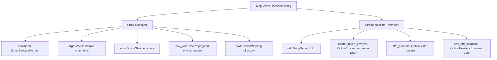
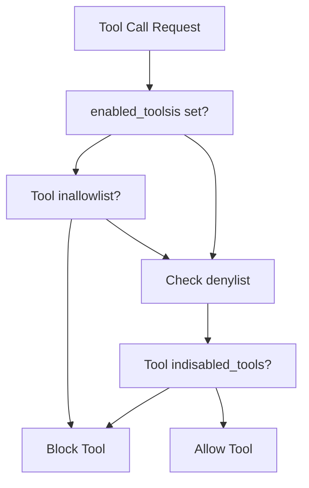
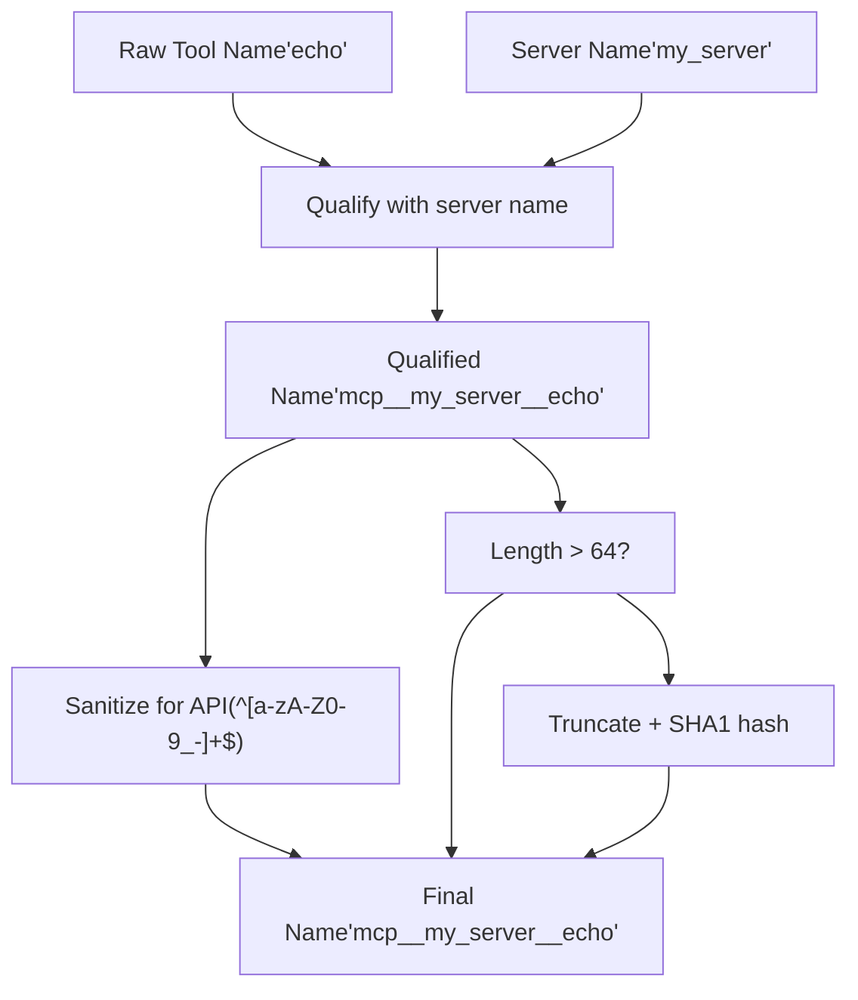

# MCP Server Configuration

Relevant source files

-   [codex-rs/app-server/tests/suite/v2/mcp\_server\_elicitation.rs](https://github.com/openai/codex/blob/d807d44a/codex-rs/app-server/tests/suite/v2/mcp_server_elicitation.rs)
-   [codex-rs/cli/src/mcp\_cmd.rs](https://github.com/openai/codex/blob/d807d44a/codex-rs/cli/src/mcp_cmd.rs)
-   [codex-rs/cli/tests/mcp\_add\_remove.rs](https://github.com/openai/codex/blob/d807d44a/codex-rs/cli/tests/mcp_add_remove.rs)
-   [codex-rs/cli/tests/mcp\_list.rs](https://github.com/openai/codex/blob/d807d44a/codex-rs/cli/tests/mcp_list.rs)
-   [codex-rs/core/config.schema.json](https://github.com/openai/codex/blob/d807d44a/codex-rs/core/config.schema.json)
-   [codex-rs/core/src/config/agent\_roles.rs](https://github.com/openai/codex/blob/d807d44a/codex-rs/core/src/config/agent_roles.rs)
-   [codex-rs/core/src/config/config\_tests.rs](https://github.com/openai/codex/blob/d807d44a/codex-rs/core/src/config/config_tests.rs)
-   [codex-rs/core/src/config/edit.rs](https://github.com/openai/codex/blob/d807d44a/codex-rs/core/src/config/edit.rs)
-   [codex-rs/core/src/config/mod.rs](https://github.com/openai/codex/blob/d807d44a/codex-rs/core/src/config/mod.rs)
-   [codex-rs/core/src/config/profile.rs](https://github.com/openai/codex/blob/d807d44a/codex-rs/core/src/config/profile.rs)
-   [codex-rs/core/src/config/types.rs](https://github.com/openai/codex/blob/d807d44a/codex-rs/core/src/config/types.rs)
-   [codex-rs/core/src/mcp\_connection\_manager.rs](https://github.com/openai/codex/blob/d807d44a/codex-rs/core/src/mcp_connection_manager.rs)
-   [codex-rs/core/src/mcp\_connection\_manager\_tests.rs](https://github.com/openai/codex/blob/d807d44a/codex-rs/core/src/mcp_connection_manager_tests.rs)
-   [codex-rs/core/src/state/session.rs](https://github.com/openai/codex/blob/d807d44a/codex-rs/core/src/state/session.rs)
-   [codex-rs/core/src/state/turn.rs](https://github.com/openai/codex/blob/d807d44a/codex-rs/core/src/state/turn.rs)
-   [codex-rs/core/src/tasks/mod.rs](https://github.com/openai/codex/blob/d807d44a/codex-rs/core/src/tasks/mod.rs)
-   [codex-rs/core/src/tools/handlers/mod.rs](https://github.com/openai/codex/blob/d807d44a/codex-rs/core/src/tools/handlers/mod.rs)
-   [codex-rs/core/src/tools/handlers/tool\_search\_tests.rs](https://github.com/openai/codex/blob/d807d44a/codex-rs/core/src/tools/handlers/tool_search_tests.rs)
-   [codex-rs/core/src/tools/spec.rs](https://github.com/openai/codex/blob/d807d44a/codex-rs/core/src/tools/spec.rs)
-   [codex-rs/core/src/tools/spec\_tests.rs](https://github.com/openai/codex/blob/d807d44a/codex-rs/core/src/tools/spec_tests.rs)
-   [codex-rs/core/tests/suite/rmcp\_client.rs](https://github.com/openai/codex/blob/d807d44a/codex-rs/core/tests/suite/rmcp_client.rs)
-   [codex-rs/core/tests/suite/truncation.rs](https://github.com/openai/codex/blob/d807d44a/codex-rs/core/tests/suite/truncation.rs)
-   [codex-rs/core/tests/suite/user\_shell\_cmd.rs](https://github.com/openai/codex/blob/d807d44a/codex-rs/core/tests/suite/user_shell_cmd.rs)
-   [codex-rs/rmcp-client/src/rmcp\_client.rs](https://github.com/openai/codex/blob/d807d44a/codex-rs/rmcp-client/src/rmcp_client.rs)
-   [codex-rs/rmcp-client/tests/streamable\_http\_recovery.rs](https://github.com/openai/codex/blob/d807d44a/codex-rs/rmcp-client/tests/streamable_http_recovery.rs)
-   [docs/config.md](https://github.com/openai/codex/blob/d807d44a/docs/config.md?plain=1)
-   [docs/example-config.md](https://github.com/openai/codex/blob/d807d44a/docs/example-config.md?plain=1)
-   [docs/skills.md](https://github.com/openai/codex/blob/d807d44a/docs/skills.md?plain=1)
-   [docs/slash\_commands.md](https://github.com/openai/codex/blob/d807d44a/docs/slash_commands.md?plain=1)

This document describes how to configure MCP (Model Context Protocol) servers in Codex. MCP servers extend Codex's capabilities by providing external tools, resources, and data sources that the AI can access during conversations.

For information about how MCP servers are initialized and managed at runtime, see [MCP Connection Manager](/openai/codex/6.2-mcp-connection-manager). For CLI commands to manage MCP servers, see [MCP CLI Commands](/openai/codex/6.3-mcp-cli-commands). For OAuth authentication flows, see [OAuth Authentication for MCP](/openai/codex/6.5-oauth-authentication-for-mcp).

---

## Configuration Structure

MCP servers are configured in `config.toml` files (system, user, or project level) under the `[mcp_servers]` table. Each server is identified by a unique name and maps to an `McpServerConfig` structure.

### McpServerConfig Fields

| Field | Type | Description |
| --- | --- | --- |
| `transport` | `McpServerTransportConfig` | Transport configuration (Stdio or StreamableHttp). |
| `enabled` | `bool` | Whether the server is enabled (default: `true`). |
| `required` | `bool` | If true, `codex exec` fails if this server cannot be initialized. |
| `disabled_reason` | `Option<McpServerDisabledReason>` | Reason for disabling (e.g., failed requirements). |
| `startup_timeout_sec` | `Option<Duration>` | Timeout for server initialization and tool listing. |
| `tool_timeout_sec` | `Option<Duration>` | Timeout for individual tool calls. |
| `enabled_tools` | `Option<Vec<String>>` | Explicit allow-list of tools. |
| `disabled_tools` | `Option<Vec<String>>` | Explicit deny-list of tools. |
| `scopes` | `Option<Vec<String>>` | OAuth scopes to request during login. |
| `oauth_resource` | `Option<String>` | RFC 8707 resource parameter for OAuth. |

**Sources:** [codex-rs/core/src/config/types.rs68-111](https://github.com/openai/codex/blob/d807d44a/codex-rs/core/src/config/types.rs#L68-L111) [codex-rs/core/src/mcp\_connection\_manager.rs95-100](https://github.com/openai/codex/blob/d807d44a/codex-rs/core/src/mcp_connection_manager.rs#L95-L100)

---

## Transport Types

MCP servers communicate via two primary transport mechanisms: **Stdio** (local subprocess) or **StreamableHttp** (remote/local HTTP endpoint).

### Transport Configuration Diagram

**Sources:** [codex-rs/core/src/config/types.rs232-262](https://github.com/openai/codex/blob/d807d44a/codex-rs/core/src/config/types.rs#L232-L262) [codex-rs/cli/src/mcp\_cmd.rs92-134](https://github.com/openai/codex/blob/d807d44a/codex-rs/cli/src/mcp_cmd.rs#L92-L134)

### Stdio Transport

The Stdio transport launches an MCP server as a subprocess and communicates via stdin/stdout. This is commonly used for local tools (e.g., filesystem access, database explorers).

**Configuration Fields:**

-   **`command`**: The executable to run.
-   **`args`**: List of arguments passed to the command.
-   **`env`**: Map of environment variables specifically for this subprocess.
-   **`env_vars`**: List of existing environment variables to inherit from the parent process.
-   **`cwd`**: Specific working directory for the server process.

**Sources:** [codex-rs/core/src/config/types.rs232-246](https://github.com/openai/codex/blob/d807d44a/codex-rs/core/src/config/types.rs#L232-L246) [codex-rs/core/tests/suite/rmcp\_client.rs92-101](https://github.com/openai/codex/blob/d807d44a/codex-rs/core/tests/suite/rmcp_client.rs#L92-L101)

### StreamableHttp Transport

The StreamableHttp transport connects to a server over HTTP/HTTPS. This transport supports OAuth 2.0 flows and bearer token authentication.

**Configuration Fields:**

-   **`url`**: The HTTP(S) endpoint of the MCP server.
-   **`bearer_token_env_var`**: Name of the environment variable containing the authentication token.
-   **`http_headers`**: Static headers (e.g., `X-API-Key`).
-   **`env_http_headers`**: Headers whose values are pulled from environment variables.

**Sources:** [codex-rs/core/src/config/types.rs247-261](https://github.com/openai/codex/blob/d807d44a/codex-rs/core/src/config/types.rs#L247-L261) [codex-rs/cli/src/mcp\_cmd.rs121-134](https://github.com/openai/codex/blob/d807d44a/codex-rs/cli/src/mcp_cmd.rs#L121-L134)

---

## Tool Filtering

Tool filtering allows users to restrict which tools from a given server are exposed to the AI model. This is critical for security and reducing context window noise.

### Tool Filter Logic

**Filter Implementation:** The `McpConnectionManager` applies these filters during the tool discovery phase. If `enabled_tools` is present, only those specific tools are registered. If `disabled_tools` is present, those tools are removed from the final list regardless of the allow-list.

**Sources:** [codex-rs/core/src/config/types.rs96-102](https://github.com/openai/codex/blob/d807d44a/codex-rs/core/src/config/types.rs#L96-L102) [codex-rs/core/src/mcp\_connection\_manager.rs155-161](https://github.com/openai/codex/blob/d807d44a/codex-rs/core/src/mcp_connection_manager.rs#L155-L161)

---

## Requirements-Based Filtering

Codex supports enforcing "Requirements" (typically from an organization's `requirements.toml` or MDM policy) that can forcibly disable MCP servers that do not match an approved identity.

### Identity Matching

-   **Stdio Servers**: Matched by the `command` string.
-   **HTTP Servers**: Matched by the `url` string.

If a server fails to match the requirements, it is marked with `McpServerDisabledReason::Requirements`.

**Sources:** [codex-rs/core/src/config/types.rs51-65](https://github.com/openai/codex/blob/d807d44a/codex-rs/core/src/config/types.rs#L51-L65) [codex-rs/core/src/config/mod.rs37-38](https://github.com/openai/codex/blob/d807d44a/codex-rs/core/src/config/mod.rs#L37-L38)

---

## Server Name Qualification and Sanitization

To prevent collisions between multiple MCP servers and to satisfy LLM API constraints (which often require tool names to match `^[a-zA-Z0-9_-]+$`), Codex performs qualification and sanitization.

### Tool Name Transformation

**Qualification Logic:**

1.  The prefix `mcp` is added.
2.  The `server_name` is appended.
3.  The raw `tool_name` is appended.
4.  Characters are joined by the `MCP_TOOL_NAME_DELIMITER` (`__`).
5.  Any non-alphanumeric/underscore character is replaced with `_` via `sanitize_responses_api_tool_name`.

**Sources:** [codex-rs/core/src/mcp\_connection\_manager.rs92-125](https://github.com/openai/codex/blob/d807d44a/codex-rs/core/src/mcp_connection_manager.rs#L92-L125) [codex-rs/core/src/mcp\_connection\_manager.rs163-188](https://github.com/openai/codex/blob/d807d44a/codex-rs/core/src/mcp_connection_manager.rs#L163-L188)

---

## Timeout Configuration

Timeouts are configurable per-server to handle slow initialization or long-running tool executions.

| Parameter | Code Symbol | Default |
| --- | --- | --- |
| Startup Timeout | `DEFAULT_STARTUP_TIMEOUT` | 10 seconds |
| Tool Timeout | `DEFAULT_TOOL_TIMEOUT` | 120 seconds |

**Sources:** [codex-rs/core/src/mcp\_connection\_manager.rs96-99](https://github.com/openai/codex/blob/d807d44a/codex-rs/core/src/mcp_connection_manager.rs#L96-L99) [codex-rs/core/src/config/types.rs84-94](https://github.com/openai/codex/blob/d807d44a/codex-rs/core/src/config/types.rs#L84-L94)

---

## Special Server: `codex-apps`

The `codex-apps` server is a built-in virtual MCP server that exposes internal Codex capabilities (like ChatGPT connectors) as MCP tools.

-   **Namespace**: Unlike other servers, `codex-apps` tools do not use the `mcp__` prefix if they are internal.
-   **Caching**: Tool lists for `codex-apps` are cached to improve performance, as they rarely change within a session.

**Sources:** [codex-rs/core/src/mcp\_connection\_manager.rs22](https://github.com/openai/codex/blob/d807d44a/codex-rs/core/src/mcp_connection_manager.rs#L22-L22) [codex-rs/core/src/mcp\_connection\_manager.rs163-170](https://github.com/openai/codex/blob/d807d44a/codex-rs/core/src/mcp_connection_manager.rs#L163-L170) [codex-rs/core/src/mcp\_connection\_manager.rs101-105](https://github.com/openai/codex/blob/d807d44a/codex-rs/core/src/mcp_connection_manager.rs#L101-L105)

---

## Configuration Persistence and Editing

The CLI uses `ConfigEditsBuilder` to programmatically update `config.toml` when users run `codex mcp add` or `codex mcp remove`.

**Key Functions:**

-   `run_add`: Validates the server name and transport before appending to the config file.
-   `run_remove`: Removes the entry from the `mcp_servers` table.
-   `validate_server_name`: Ensures names only contain alphanumeric characters, hyphens, or underscores.

**Sources:** [codex-rs/cli/src/mcp\_cmd.rs238-280](https://github.com/openai/codex/blob/d807d44a/codex-rs/cli/src/mcp_cmd.rs#L238-L280) [codex-rs/cli/src/mcp\_cmd.rs819-830](https://github.com/openai/codex/blob/d807d44a/codex-rs/cli/src/mcp_cmd.rs#L819-L830) [codex-rs/core/src/config/edit.rs43](https://github.com/openai/codex/blob/d807d44a/codex-rs/core/src/config/edit.rs#L43-L43)
