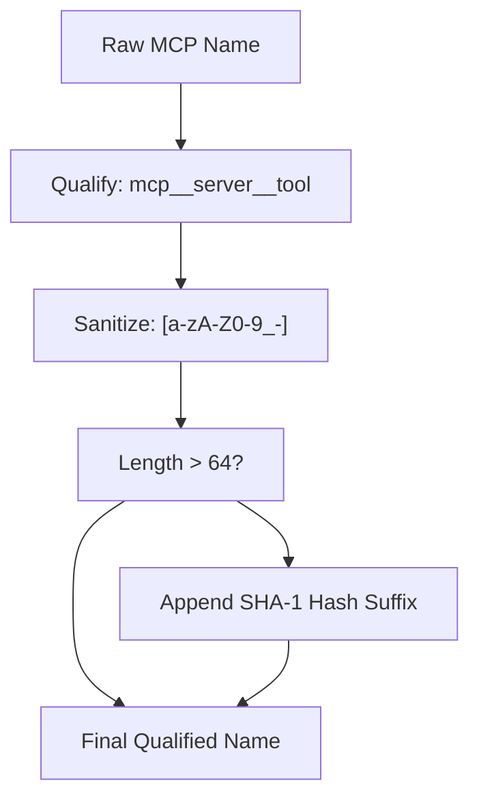

# MCP Connection Manager

Relevant source files

-   [codex-rs/app-server/tests/suite/v2/mcp\_server\_elicitation.rs](https://github.com/openai/codex/blob/d807d44a/codex-rs/app-server/tests/suite/v2/mcp_server_elicitation.rs)
-   [codex-rs/cli/src/mcp\_cmd.rs](https://github.com/openai/codex/blob/d807d44a/codex-rs/cli/src/mcp_cmd.rs)
-   [codex-rs/cli/tests/mcp\_add\_remove.rs](https://github.com/openai/codex/blob/d807d44a/codex-rs/cli/tests/mcp_add_remove.rs)
-   [codex-rs/cli/tests/mcp\_list.rs](https://github.com/openai/codex/blob/d807d44a/codex-rs/cli/tests/mcp_list.rs)
-   [codex-rs/core/src/mcp/auth.rs](https://github.com/openai/codex/blob/d807d44a/codex-rs/core/src/mcp/auth.rs)
-   [codex-rs/core/src/mcp\_connection\_manager.rs](https://github.com/openai/codex/blob/d807d44a/codex-rs/core/src/mcp_connection_manager.rs)
-   [codex-rs/core/src/mcp\_connection\_manager\_tests.rs](https://github.com/openai/codex/blob/d807d44a/codex-rs/core/src/mcp_connection_manager_tests.rs)
-   [codex-rs/core/src/state/session.rs](https://github.com/openai/codex/blob/d807d44a/codex-rs/core/src/state/session.rs)
-   [codex-rs/core/src/state/turn.rs](https://github.com/openai/codex/blob/d807d44a/codex-rs/core/src/state/turn.rs)
-   [codex-rs/core/src/tasks/mod.rs](https://github.com/openai/codex/blob/d807d44a/codex-rs/core/src/tasks/mod.rs)
-   [codex-rs/core/src/tools/handlers/mcp\_resource.rs](https://github.com/openai/codex/blob/d807d44a/codex-rs/core/src/tools/handlers/mcp_resource.rs)
-   [codex-rs/core/src/tools/handlers/tool\_search\_tests.rs](https://github.com/openai/codex/blob/d807d44a/codex-rs/core/src/tools/handlers/tool_search_tests.rs)
-   [codex-rs/core/tests/suite/rmcp\_client.rs](https://github.com/openai/codex/blob/d807d44a/codex-rs/core/tests/suite/rmcp_client.rs)
-   [codex-rs/core/tests/suite/truncation.rs](https://github.com/openai/codex/blob/d807d44a/codex-rs/core/tests/suite/truncation.rs)
-   [codex-rs/core/tests/suite/user\_shell\_cmd.rs](https://github.com/openai/codex/blob/d807d44a/codex-rs/core/tests/suite/user_shell_cmd.rs)
-   [codex-rs/rmcp-client/Cargo.toml](https://github.com/openai/codex/blob/d807d44a/codex-rs/rmcp-client/Cargo.toml)
-   [codex-rs/rmcp-client/src/auth\_status.rs](https://github.com/openai/codex/blob/d807d44a/codex-rs/rmcp-client/src/auth_status.rs)
-   [codex-rs/rmcp-client/src/bin/rmcp\_test\_server.rs](https://github.com/openai/codex/blob/d807d44a/codex-rs/rmcp-client/src/bin/rmcp_test_server.rs)
-   [codex-rs/rmcp-client/src/bin/test\_stdio\_server.rs](https://github.com/openai/codex/blob/d807d44a/codex-rs/rmcp-client/src/bin/test_stdio_server.rs)
-   [codex-rs/rmcp-client/src/bin/test\_streamable\_http\_server.rs](https://github.com/openai/codex/blob/d807d44a/codex-rs/rmcp-client/src/bin/test_streamable_http_server.rs)
-   [codex-rs/rmcp-client/src/lib.rs](https://github.com/openai/codex/blob/d807d44a/codex-rs/rmcp-client/src/lib.rs)
-   [codex-rs/rmcp-client/src/logging\_client\_handler.rs](https://github.com/openai/codex/blob/d807d44a/codex-rs/rmcp-client/src/logging_client_handler.rs)
-   [codex-rs/rmcp-client/src/oauth.rs](https://github.com/openai/codex/blob/d807d44a/codex-rs/rmcp-client/src/oauth.rs)
-   [codex-rs/rmcp-client/src/perform\_oauth\_login.rs](https://github.com/openai/codex/blob/d807d44a/codex-rs/rmcp-client/src/perform_oauth_login.rs)
-   [codex-rs/rmcp-client/src/rmcp\_client.rs](https://github.com/openai/codex/blob/d807d44a/codex-rs/rmcp-client/src/rmcp_client.rs)
-   [codex-rs/rmcp-client/tests/resources.rs](https://github.com/openai/codex/blob/d807d44a/codex-rs/rmcp-client/tests/resources.rs)
-   [codex-rs/rmcp-client/tests/streamable\_http\_recovery.rs](https://github.com/openai/codex/blob/d807d44a/codex-rs/rmcp-client/tests/streamable_http_recovery.rs)
-   [codex-rs/utils/home-dir/BUILD.bazel](https://github.com/openai/codex/blob/d807d44a/codex-rs/utils/home-dir/BUILD.bazel)
-   [codex-rs/utils/home-dir/Cargo.toml](https://github.com/openai/codex/blob/d807d44a/codex-rs/utils/home-dir/Cargo.toml)
-   [codex-rs/utils/home-dir/src/lib.rs](https://github.com/openai/codex/blob/d807d44a/codex-rs/utils/home-dir/src/lib.rs)

The MCP Connection Manager is the runtime component in `codex-core` responsible for establishing and maintaining connections to one or more external MCP (Model Context Protocol) servers. It owns one `codex_rmcp_client::RmcpClient` per configured server and aggregates tool, resource, and resource template listings from all connected servers into unified maps, routes tool calls to the correct server, and forwards elicitation requests to the user interface. [codex-rs/core/src/mcp\_connection\_manager.rs1-7](https://github.com/openai/codex/blob/d807d44a/codex-rs/core/src/mcp_connection_manager.rs#L1-L7)

This page covers the internal mechanics of `McpConnectionManager` and the types that support it. For MCP server configuration (`McpServerConfig`, transport variants, `config.toml` layout) see [6.1](https://github.com/openai/codex/blob/d807d44a/6.1) For the `mcp` CLI subcommands (`add`, `remove`, `login`) see [6.3](https://github.com/openai/codex/blob/d807d44a/6.3) For OAuth credential storage see [6.5](https://github.com/openai/codex/blob/d807d44a/6.5)

---

## Structural Overview

All code for the connection manager lives in [codex-rs/core/src/mcp\_connection\_manager.rs](https://github.com/openai/codex/blob/d807d44a/codex-rs/core/src/mcp_connection_manager.rs) The underlying MCP SDK wrapper lives in the `codex-rmcp-client` crate [codex-rs/rmcp-client/src/rmcp\_client.rs28-29](https://github.com/openai/codex/blob/d807d44a/codex-rs/rmcp-client/src/rmcp_client.rs#L28-L29)

### Class Relationship Diagram

Sources: [codex-rs/core/src/mcp\_connection\_manager.rs337-513](https://github.com/openai/codex/blob/d807d44a/codex-rs/core/src/mcp_connection_manager.rs#L337-L513) [codex-rs/rmcp-client/src/rmcp\_client.rs28-29](https://github.com/openai/codex/blob/d807d44a/codex-rs/rmcp-client/src/rmcp_client.rs#L28-L29)

---

## Initialization and Startup Sequence

`McpConnectionManager::new()` is the primary constructor [codex-rs/core/src/mcp\_connection\_manager.rs546-547](https://github.com/openai/codex/blob/d807d44a/codex-rs/core/src/mcp_connection_manager.rs#L546-L547) It accepts a map of `McpServerConfig` entries and spawns an `AsyncManagedClient` for each enabled server concurrently [codex-rs/core/src/mcp\_connection\_manager.rs596-600](https://github.com/openai/codex/blob/d807d44a/codex-rs/core/src/mcp_connection_manager.rs#L596-L600)

### Startup Flow Diagram

> **[Mermaid sequence]**
> *(图表结构无法解析)*

Sources: [codex-rs/core/src/mcp\_connection\_manager.rs546-664](https://github.com/openai/codex/blob/d807d44a/codex-rs/core/src/mcp_connection_manager.rs#L546-L664) [codex-rs/core/src/mcp\_connection\_manager.rs411-455](https://github.com/openai/codex/blob/d807d44a/codex-rs/core/src/mcp_connection_manager.rs#L411-L455)

`new_uninitialized()` creates an empty manager with no servers, primarily used in tests [codex-rs/core/src/mcp\_connection\_manager.rs516-522](https://github.com/openai/codex/blob/d807d44a/codex-rs/core/src/mcp_connection_manager.rs#L516-L522)

---

## Tool Name Qualification

The Responses API requires tool names to match `^[a-zA-Z0-9_-]+$`. MCP tool names are qualified and sanitized before exposure to the model [codex-rs/core/src/mcp\_connection\_manager.rs107-118](https://github.com/openai/codex/blob/d807d44a/codex-rs/core/src/mcp_connection_manager.rs#L107-L118)

### Qualification Logic

1.  **Raw Format**: `mcp__{server_name}__{tool_name}` using `__` as `MCP_TOOL_NAME_DELIMITER` [codex-rs/core/src/mcp\_connection\_manager.rs92](https://github.com/openai/codex/blob/d807d44a/codex-rs/core/src/mcp_connection_manager.rs#L92-L92)
2.  **Sanitization**: `sanitize_responses_api_tool_name` replaces non-alphanumeric/underscore characters with `_` [codex-rs/core/src/mcp\_connection\_manager.rs110-125](https://github.com/openai/codex/blob/d807d44a/codex-rs/core/src/mcp_connection_manager.rs#L110-L125)
3.  **Length Constraint**: If the name exceeds `MAX_TOOL_NAME_LENGTH` (64), the suffix is replaced with a SHA-1 hash of the raw name to ensure stability and uniqueness [codex-rs/core/src/mcp\_connection\_manager.rs93](https://github.com/openai/codex/blob/d807d44a/codex-rs/core/src/mcp_connection_manager.rs#L93-L93) [codex-rs/core/src/mcp\_connection\_manager.rs183-187](https://github.com/openai/codex/blob/d807d44a/codex-rs/core/src/mcp_connection_manager.rs#L183-L187)

### Tool Name Flow

Sources: [codex-rs/core/src/mcp\_connection\_manager.rs155-191](https://github.com/openai/codex/blob/d807d44a/codex-rs/core/src/mcp_connection_manager.rs#L155-L191)

---

## Tool Execution and Filtering

### Tool Calls

`McpConnectionManager::call_tool` routes requests to the specific server [codex-rs/core/src/mcp\_connection\_manager.rs916-921](https://github.com/openai/codex/blob/d807d44a/codex-rs/core/src/mcp_connection_manager.rs#L916-L921) It enforces a `DEFAULT_TOOL_TIMEOUT` of 120 seconds unless overridden in config [codex-rs/core/src/mcp\_connection\_manager.rs99](https://github.com/openai/codex/blob/d807d44a/codex-rs/core/src/mcp_connection_manager.rs#L99-L99)

### Tool Filtering

`ToolFilter` [codex-rs/core/src/mcp\_connection\_manager.rs1025-1028](https://github.com/openai/codex/blob/d807d44a/codex-rs/core/src/mcp_connection_manager.rs#L1025-L1028) restricts which tools are exposed based on `enabled_tools` or `disabled_tools` lists in `McpServerConfig` [codex-rs/core/src/mcp\_connection\_manager.rs1030-1049](https://github.com/openai/codex/blob/d807d44a/codex-rs/core/src/mcp_connection_manager.rs#L1030-L1049)

---

## Elicitation Handling

MCP servers can request user input mid-turn via "elicitation" [codex-rs/core/src/mcp\_connection\_manager.rs250-252](https://github.com/openai/codex/blob/d807d44a/codex-rs/core/src/mcp_connection_manager.rs#L250-L252)

1.  **Request**: Server sends a `CreateElicitationRequest` [codex-rs/rmcp-client/src/rmcp\_client.rs27-28](https://github.com/openai/codex/blob/d807d44a/codex-rs/rmcp-client/src/rmcp_client.rs#L27-L28)
2.  **Management**: `ElicitationRequestManager` checks the `AskForApproval` policy [codex-rs/core/src/mcp\_connection\_manager.rs260-264](https://github.com/openai/codex/blob/d807d44a/codex-rs/core/src/mcp_connection_manager.rs#L260-L264)
3.  **Event**: If allowed, an `ElicitationRequestEvent` is emitted to the UI [codex-rs/core/src/mcp\_connection\_manager.rs284-290](https://github.com/openai/codex/blob/d807d44a/codex-rs/core/src/mcp_connection_manager.rs#L284-L290)
4.  **Resolution**: The UI calls `resolve_elicitation`, which completes the internal `oneshot` channel [codex-rs/core/src/mcp\_connection\_manager.rs675-684](https://github.com/openai/codex/blob/d807d44a/codex-rs/core/src/mcp_connection_manager.rs#L675-L684)

### Elicitation State Mapping

| Code Entity | System Role |
| --- | --- |
| `ElicitationRequestManager` | State store for pending user prompts |
| `oneshot::Sender<ElicitationResponse>` | Internal bridge between async request and UI response |
| `EventMsg::ElicitationRequest` | Protocol message sent to frontend |
| `McpConnectionManager::resolve_elicitation` | Entry point for UI to provide the user's answer |

Sources: [codex-rs/core/src/mcp\_connection\_manager.rs250-334](https://github.com/openai/codex/blob/d807d44a/codex-rs/core/src/mcp_connection_manager.rs#L250-L334) [codex-rs/core/src/state/turn.rs81](https://github.com/openai/codex/blob/d807d44a/codex-rs/core/src/state/turn.rs#L81-L81)

---

## Sandbox State Synchronization

Codex synchronizes its sandbox environment state with MCP servers that support the `codex/sandbox-state` capability [codex-rs/core/src/mcp\_connection\_manager.rs373-375](https://github.com/openai/codex/blob/d807d44a/codex-rs/core/src/mcp_connection_manager.rs#L373-L375)

When a `SandboxPolicy` changes or a server initializes, the manager sends a custom notification containing [codex-rs/core/src/mcp\_connection\_manager.rs499-506](https://github.com/openai/codex/blob/d807d44a/codex-rs/core/src/mcp_connection_manager.rs#L499-L506):

-   `sandbox_policy`: The current security profile (e.g., `ReadOnly`, `WorkspaceWrite`).
-   `sandbox_cwd`: The root directory for sandboxed operations.
-   `codex_linux_sandbox_exe`: Path to the sandbox wrapper binary.

Sources: [codex-rs/core/src/mcp\_connection\_manager.rs1008-1017](https://github.com/openai/codex/blob/d807d44a/codex-rs/core/src/mcp_connection_manager.rs#L1008-L1017) [codex-rs/core/src/mcp\_connection\_manager.rs373-387](https://github.com/openai/codex/blob/d807d44a/codex-rs/core/src/mcp_connection_manager.rs#L373-L387)

---

## RmcpClient and Transport

The `RmcpClient` handles the low-level protocol details [codex-rs/rmcp-client/src/rmcp\_client.rs28-29](https://github.com/openai/codex/blob/d807d44a/codex-rs/rmcp-client/src/rmcp_client.rs#L28-L29)

### Transport Types

-   **Stdio**: Spawns a subprocess and communicates over stdin/stdout [codex-rs/rmcp-client/src/rmcp\_client.rs51](https://github.com/openai/codex/blob/d807d44a/codex-rs/rmcp-client/src/rmcp_client.rs#L51-L51)
-   **Streamable HTTP**: Communicates over SSE (Server-Sent Events) for server-to-client notifications and POST for requests [codex-rs/rmcp-client/src/rmcp\_client.rs53-56](https://github.com/openai/codex/blob/d807d44a/codex-rs/rmcp-client/src/rmcp_client.rs#L53-L56)

### Stdio Process Management

For stdio transports, `RmcpClient` uses `TokioChildProcess` [codex-rs/rmcp-client/src/rmcp\_client.rs51](https://github.com/openai/codex/blob/d807d44a/codex-rs/rmcp-client/src/rmcp_client.rs#L51-L51) On Unix, it creates a new process group to ensure all child processes are cleaned up on exit [codex-rs/rmcp-client/src/rmcp\_client.rs113-118](https://github.com/openai/codex/blob/d807d44a/codex-rs/rmcp-client/src/rmcp_client.rs#L113-L118)

Sources: [codex-rs/rmcp-client/src/rmcp\_client.rs44-56](https://github.com/openai/codex/blob/d807d44a/codex-rs/rmcp-client/src/rmcp_client.rs#L44-L56) [codex-rs/rmcp-client/src/rmcp\_client.rs86-101](https://github.com/openai/codex/blob/d807d44a/codex-rs/rmcp-client/src/rmcp_client.rs#L86-L101)
