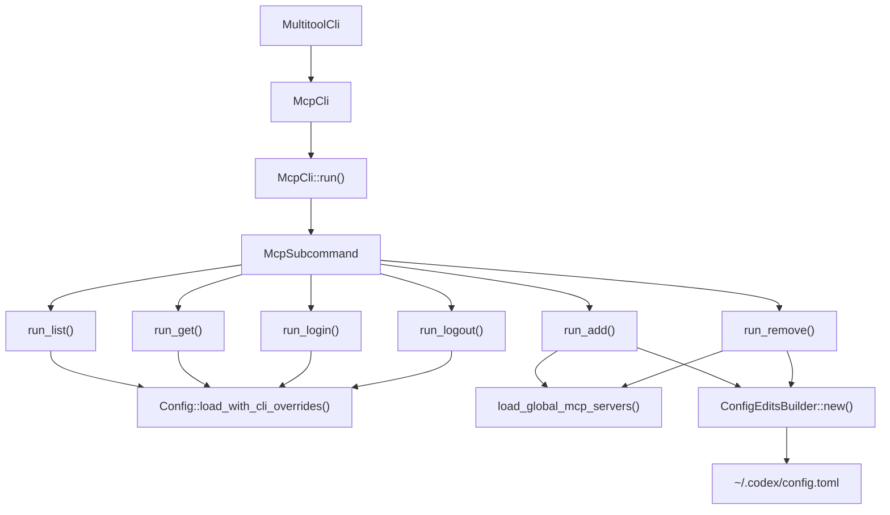
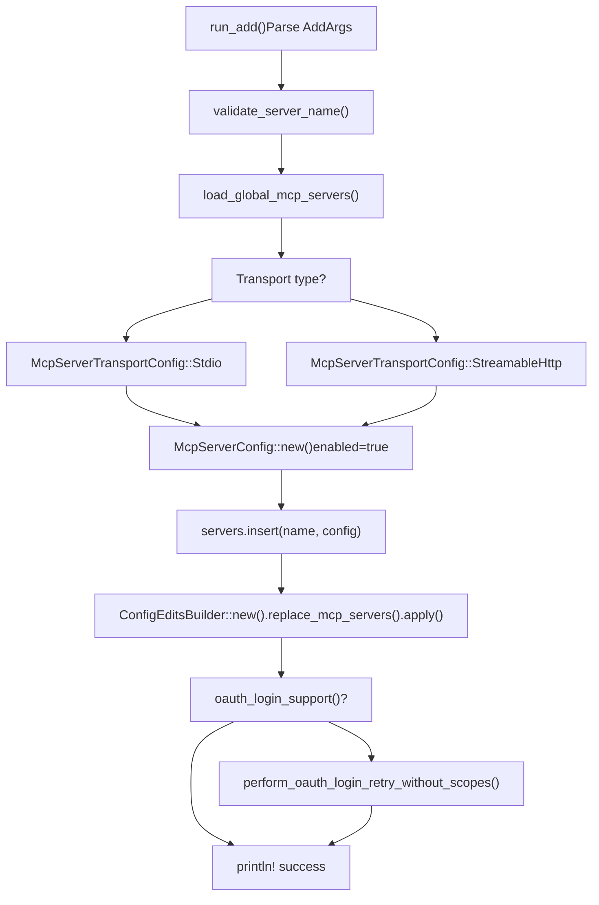

# MCP CLI Commands

Relevant source files

-   [codex-rs/app-server/tests/suite/v2/mcp\_server\_elicitation.rs](https://github.com/openai/codex/blob/d807d44a/codex-rs/app-server/tests/suite/v2/mcp_server_elicitation.rs)
-   [codex-rs/cli/src/mcp\_cmd.rs](https://github.com/openai/codex/blob/d807d44a/codex-rs/cli/src/mcp_cmd.rs)
-   [codex-rs/cli/tests/mcp\_add\_remove.rs](https://github.com/openai/codex/blob/d807d44a/codex-rs/cli/tests/mcp_add_remove.rs)
-   [codex-rs/cli/tests/mcp\_list.rs](https://github.com/openai/codex/blob/d807d44a/codex-rs/cli/tests/mcp_list.rs)
-   [codex-rs/core/src/mcp\_connection\_manager.rs](https://github.com/openai/codex/blob/d807d44a/codex-rs/core/src/mcp_connection_manager.rs)
-   [codex-rs/core/src/mcp\_connection\_manager\_tests.rs](https://github.com/openai/codex/blob/d807d44a/codex-rs/core/src/mcp_connection_manager_tests.rs)
-   [codex-rs/core/src/state/session.rs](https://github.com/openai/codex/blob/d807d44a/codex-rs/core/src/state/session.rs)
-   [codex-rs/core/src/state/turn.rs](https://github.com/openai/codex/blob/d807d44a/codex-rs/core/src/state/turn.rs)
-   [codex-rs/core/src/tasks/mod.rs](https://github.com/openai/codex/blob/d807d44a/codex-rs/core/src/tasks/mod.rs)
-   [codex-rs/core/src/tools/handlers/tool\_search\_tests.rs](https://github.com/openai/codex/blob/d807d44a/codex-rs/core/src/tools/handlers/tool_search_tests.rs)
-   [codex-rs/core/tests/suite/rmcp\_client.rs](https://github.com/openai/codex/blob/d807d44a/codex-rs/core/tests/suite/rmcp_client.rs)
-   [codex-rs/core/tests/suite/truncation.rs](https://github.com/openai/codex/blob/d807d44a/codex-rs/core/tests/suite/truncation.rs)
-   [codex-rs/core/tests/suite/user\_shell\_cmd.rs](https://github.com/openai/codex/blob/d807d44a/codex-rs/core/tests/suite/user_shell_cmd.rs)
-   [codex-rs/rmcp-client/src/rmcp\_client.rs](https://github.com/openai/codex/blob/d807d44a/codex-rs/rmcp-client/src/rmcp_client.rs)
-   [codex-rs/rmcp-client/tests/streamable\_http\_recovery.rs](https://github.com/openai/codex/blob/d807d44a/codex-rs/rmcp-client/tests/streamable_http_recovery.rs)

This page documents the `codex mcp` subcommands that allow users to manage Model Context Protocol (MCP) server configurations from the command line. These commands provide a convenient interface for adding, removing, listing, and authenticating with MCP servers without manually editing configuration files.

For information about the MCP server configuration structure and connection lifecycle, see [6.1 MCP Server Configuration](https://github.com/openai/codex/blob/d807d44a/6.1 MCP Server Configuration) and [6.2 MCP Connection Manager](https://github.com/openai/codex/blob/d807d44a/6.2 MCP Connection Manager) For details on OAuth implementation, see [6.5 OAuth Authentication for MCP](https://github.com/openai/codex/blob/d807d44a/6.5 OAuth Authentication for MCP)

---

## Command Overview

The MCP CLI commands are implemented as subcommands under `codex mcp`. All commands operate on the global MCP server configuration stored in `~/.codex/config.toml` (or `$CODEX_HOME/config.toml`).

**Available Commands**:

-   `list` — Display all configured MCP servers with their status. [codex-rs/cli/src/mcp\_cmd.rs48](https://github.com/openai/codex/blob/d807d44a/codex-rs/cli/src/mcp_cmd.rs#L48-L48)
-   `get <name>` — Show detailed configuration for a specific server. [codex-rs/cli/src/mcp\_cmd.rs49](https://github.com/openai/codex/blob/d807d44a/codex-rs/cli/src/mcp_cmd.rs#L49-L49)
-   `add <name>` — Add a new MCP server configuration. [codex-rs/cli/src/mcp\_cmd.rs50](https://github.com/openai/codex/blob/d807d44a/codex-rs/cli/src/mcp_cmd.rs#L50-L50)
-   `remove <name>` — Delete an MCP server configuration. [codex-rs/cli/src/mcp\_cmd.rs51](https://github.com/openai/codex/blob/d807d44a/codex-rs/cli/src/mcp_cmd.rs#L51-L51)
-   `login <name>` — Authenticate with an MCP server via OAuth. [codex-rs/cli/src/mcp\_cmd.rs52](https://github.com/openai/codex/blob/d807d44a/codex-rs/cli/src/mcp_cmd.rs#L52-L52)
-   `logout <name>` — Remove stored OAuth credentials. [codex-rs/cli/src/mcp\_cmd.rs53](https://github.com/openai/codex/blob/d807d44a/codex-rs/cli/src/mcp_cmd.rs#L53-L53)

Sources: [codex-rs/cli/src/mcp\_cmd.rs30-54](https://github.com/openai/codex/blob/d807d44a/codex-rs/cli/src/mcp_cmd.rs#L30-L54)

---

## Command Dispatch Architecture

The following diagram shows how the CLI entry point dispatches to specific logic handlers and interacts with the configuration system.

**Diagram: MCP Command Dispatch Flow**


The `McpCli` struct serves as the entry point [codex-rs/cli/src/mcp\_cmd.rs38](https://github.com/openai/codex/blob/d807d44a/codex-rs/cli/src/mcp_cmd.rs#L38-L38) with its `run()` method delegating to dedicated handler functions for each `McpSubcommand` variant [codex-rs/cli/src/mcp\_cmd.rs159-187](https://github.com/openai/codex/blob/d807d44a/codex-rs/cli/src/mcp_cmd.rs#L159-L187) Read operations (`list`, `get`) load the full `Config` to access merged configuration from all layers, while write operations (`add`, `remove`) directly manipulate the global MCP servers map via `ConfigEditsBuilder` [codex-rs/cli/src/mcp\_cmd.rs313-318](https://github.com/openai/codex/blob/d807d44a/codex-rs/cli/src/mcp_cmd.rs#L313-L318)

Sources: [codex-rs/cli/src/mcp\_cmd.rs38-54](https://github.com/openai/codex/blob/d807d44a/codex-rs/cli/src/mcp_cmd.rs#L38-L54) [codex-rs/cli/src/mcp\_cmd.rs159-187](https://github.com/openai/codex/blob/d807d44a/codex-rs/cli/src/mcp_cmd.rs#L159-L187)

---

## List Command

The `list` command displays all configured MCP servers. It supports both human-readable table output and JSON format via the `--json` flag.

### Usage

```
codex mcp list [--json]
```
### Human-Readable Output

The command groups servers by transport type (stdio vs streamable-http) and displays them in separate tables. Environment variables are displayed with their values masked (e.g., `TOKEN=*****`) for security [codex-rs/cli/src/mcp\_cmd.rs605-707](https://github.com/openai/codex/blob/d807d44a/codex-rs/cli/src/mcp_cmd.rs#L605-L707)

### JSON Output

With `--json`, the command outputs an array of server configurations including `auth_status` [codex-rs/cli/src/mcp\_cmd.rs478-534](https://github.com/openai/codex/blob/d807d44a/codex-rs/cli/src/mcp_cmd.rs#L478-L534)

### Authentication Status Computation

The `list` command calls `compute_auth_statuses()` [codex-rs/cli/src/mcp\_cmd.rs475](https://github.com/openai/codex/blob/d807d44a/codex-rs/cli/src/mcp_cmd.rs#L475-L475) to determine OAuth status for each server. This function checks if the transport supports OAuth and attempts to load stored credentials [codex-rs/core/src/mcp/auth.rs](https://github.com/openai/codex/blob/d807d44a/codex-rs/core/src/mcp/auth.rs)

Sources: [codex-rs/cli/src/mcp\_cmd.rs478-534](https://github.com/openai/codex/blob/d807d44a/codex-rs/cli/src/mcp_cmd.rs#L478-L534) [codex-rs/cli/src/mcp\_cmd.rs542-707](https://github.com/openai/codex/blob/d807d44a/codex-rs/cli/src/mcp_cmd.rs#L542-L707) [codex-rs/cli/tests/mcp\_list.rs33-119](https://github.com/openai/codex/blob/d807d44a/codex-rs/cli/tests/mcp_list.rs#L33-L119)

---

## Add Command

The `add` command creates a new MCP server configuration. It supports two transport types: stdio (for local executables) and streamable-http (for remote HTTP servers).

### Usage

**Stdio transport**:

```
codex mcp add <name> [--env KEY=VALUE]... -- <command> [args...]
```
**Streamable HTTP transport**:

```
codex mcp add <name> --url <url> [--bearer-token-env-var <var>]
```
### Add Flow

**Diagram: Add Command Logic**


### OAuth Auto-Detection

After adding a streamable-http server, the `add` command automatically checks for OAuth support by calling `oauth_login_support()` [codex-rs/cli/src/mcp\_cmd.rs321](https://github.com/openai/codex/blob/d807d44a/codex-rs/cli/src/mcp_cmd.rs#L321-L321) If supported, it initiates `perform_oauth_login_retry_without_scopes()` [codex-rs/cli/src/mcp\_cmd.rs331](https://github.com/openai/codex/blob/d807d44a/codex-rs/cli/src/mcp_cmd.rs#L331-L331)

Sources: [codex-rs/cli/src/mcp\_cmd.rs73-134](https://github.com/openai/codex/blob/d807d44a/codex-rs/cli/src/mcp_cmd.rs#L73-L134) [codex-rs/cli/src/mcp\_cmd.rs238-347](https://github.com/openai/codex/blob/d807d44a/codex-rs/cli/src/mcp_cmd.rs#L238-L347) [codex-rs/core/src/connectors.rs59-79](https://github.com/openai/codex/blob/d807d44a/codex-rs/core/src/connectors.rs#L59-L79)

---

## Login and Logout Commands

### Login Flow

The `login` command initiates the OAuth 2.0 flow. It uses `perform_oauth_login()` from the `codex-rmcp-client` crate, which spawns a temporary HTTP callback server [codex-rs/rmcp-client/src/perform\_oauth\_login.rs108-358](https://github.com/openai/codex/blob/d807d44a/codex-rs/rmcp-client/src/perform_oauth_login.rs#L108-L358)

**Diagram: OAuth Interaction**

> **[Mermaid sequence]**
> *(图表结构无法解析)*

### Logout Behavior

The `logout` command removes stored OAuth credentials for an MCP server by calling `delete_oauth_tokens()` [codex-rs/cli/src/mcp\_cmd.rs454](https://github.com/openai/codex/blob/d807d44a/codex-rs/cli/src/mcp_cmd.rs#L454-L454) This affects the storage defined by `mcp_oauth_credentials_store_mode` [codex-rs/rmcp-client/src/oauth.rs79-97](https://github.com/openai/codex/blob/d807d44a/codex-rs/rmcp-client/src/oauth.rs#L79-L97)

Sources: [codex-rs/cli/src/mcp\_cmd.rs382-431](https://github.com/openai/codex/blob/d807d44a/codex-rs/cli/src/mcp_cmd.rs#L382-L431) [codex-rs/cli/src/mcp\_cmd.rs433-461](https://github.com/openai/codex/blob/d807d44a/codex-rs/cli/src/mcp_cmd.rs#L433-L461) [codex-rs/rmcp-client/src/rmcp\_client.rs1-85](https://github.com/openai/codex/blob/d807d44a/codex-rs/rmcp-client/src/rmcp_client.rs#L1-L85)

---

## Configuration Persistence

All write operations use the `ConfigEditsBuilder` API to safely modify the global configuration file.

### Edit Pipeline

1.  **Load**: `load_global_mcp_servers()` reads `~/.codex/config.toml` [codex-rs/cli/src/mcp\_cmd.rs313](https://github.com/openai/codex/blob/d807d44a/codex-rs/cli/src/mcp_cmd.rs#L313-L313)
2.  **Modify**: The `HashMap<String, McpServerConfig>` is updated in memory [codex-rs/cli/src/mcp\_cmd.rs315](https://github.com/openai/codex/blob/d807d44a/codex-rs/cli/src/mcp_cmd.rs#L315-L315)
3.  **Apply**: `ConfigEditsBuilder::replace_mcp_servers()` performs an atomic write to disk [codex-rs/cli/src/mcp\_cmd.rs318](https://github.com/openai/codex/blob/d807d44a/codex-rs/cli/src/mcp_cmd.rs#L318-L318)

### Server Configuration Structure

Each server entry is a `McpServerConfig` [codex-rs/core/src/config/types.rs464](https://github.com/openai/codex/blob/d807d44a/codex-rs/core/src/config/types.rs#L464-L464) which includes fields for `transport`, `enabled`, `required`, and tool filters (`enabled_tools`, `disabled_tools`).

Sources: [codex-rs/cli/src/mcp\_cmd.rs313-318](https://github.com/openai/codex/blob/d807d44a/codex-rs/cli/src/mcp_cmd.rs#L313-L318) [codex-rs/core/src/config/types.rs464-476](https://github.com/openai/codex/blob/d807d44a/codex-rs/core/src/config/types.rs#L464-L476)

---

## OAuth Credential Storage Modes

The `mcp_oauth_credentials_store_mode` config option controls persistence.

-   **Auto**: Uses platform keyring if available, falling back to `File` [codex-rs/rmcp-client/src/oauth.rs83](https://github.com/openai/codex/blob/d807d44a/codex-rs/rmcp-client/src/oauth.rs#L83-L83)
-   **File**: Stores tokens in `$CODEX_HOME/.credentials/{server_key}.json` [codex-rs/rmcp-client/src/oauth.rs85](https://github.com/openai/codex/blob/d807d44a/codex-rs/rmcp-client/src/oauth.rs#L85-L85)
-   **Keyring**: Uses platform-specific secure storage (macOS Keychain, Windows Credential Manager) [codex-rs/rmcp-client/src/oauth.rs87](https://github.com/openai/codex/blob/d807d44a/codex-rs/rmcp-client/src/oauth.rs#L87-L87)

Sources: [codex-rs/rmcp-client/src/oauth.rs79-97](https://github.com/openai/codex/blob/d807d44a/codex-rs/rmcp-client/src/oauth.rs#L79-L97) [codex-rs/rmcp-client/src/oauth.rs285-347](https://github.com/openai/codex/blob/d807d44a/codex-rs/rmcp-client/src/oauth.rs#L285-L347)
