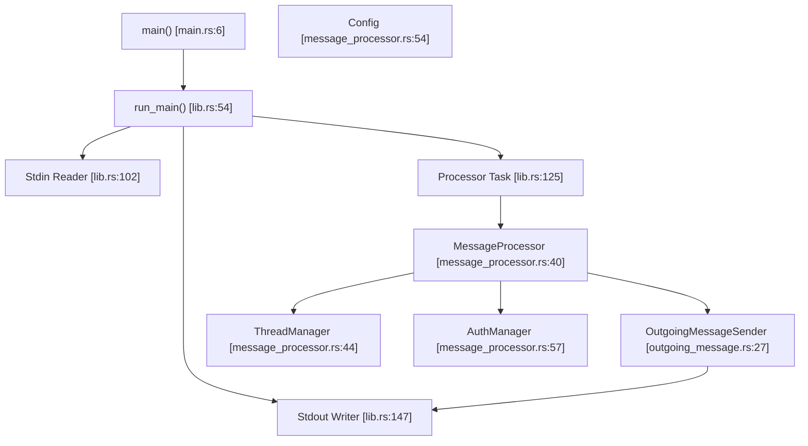

# MCP Server Implementation (codex-mcp-server)

Relevant source files

-   [codex-rs/exec/src/main.rs](https://github.com/openai/codex/blob/d807d44a/codex-rs/exec/src/main.rs)
-   [codex-rs/mcp-server/Cargo.toml](https://github.com/openai/codex/blob/d807d44a/codex-rs/mcp-server/Cargo.toml)
-   [codex-rs/mcp-server/src/codex\_tool\_config.rs](https://github.com/openai/codex/blob/d807d44a/codex-rs/mcp-server/src/codex_tool_config.rs)
-   [codex-rs/mcp-server/src/exec\_approval.rs](https://github.com/openai/codex/blob/d807d44a/codex-rs/mcp-server/src/exec_approval.rs)
-   [codex-rs/mcp-server/src/lib.rs](https://github.com/openai/codex/blob/d807d44a/codex-rs/mcp-server/src/lib.rs)
-   [codex-rs/mcp-server/src/main.rs](https://github.com/openai/codex/blob/d807d44a/codex-rs/mcp-server/src/main.rs)
-   [codex-rs/mcp-server/src/message\_processor.rs](https://github.com/openai/codex/blob/d807d44a/codex-rs/mcp-server/src/message_processor.rs)
-   [codex-rs/mcp-server/src/outgoing\_message.rs](https://github.com/openai/codex/blob/d807d44a/codex-rs/mcp-server/src/outgoing_message.rs)
-   [codex-rs/mcp-server/src/patch\_approval.rs](https://github.com/openai/codex/blob/d807d44a/codex-rs/mcp-server/src/patch_approval.rs)
-   [codex-rs/mcp-server/tests/common/Cargo.toml](https://github.com/openai/codex/blob/d807d44a/codex-rs/mcp-server/tests/common/Cargo.toml)
-   [codex-rs/mcp-server/tests/common/lib.rs](https://github.com/openai/codex/blob/d807d44a/codex-rs/mcp-server/tests/common/lib.rs)
-   [codex-rs/mcp-server/tests/common/mcp\_process.rs](https://github.com/openai/codex/blob/d807d44a/codex-rs/mcp-server/tests/common/mcp_process.rs)
-   [codex-rs/mcp-server/tests/suite/codex\_tool.rs](https://github.com/openai/codex/blob/d807d44a/codex-rs/mcp-server/tests/suite/codex_tool.rs)
-   [codex-rs/mcp-server/tests/suite/mod.rs](https://github.com/openai/codex/blob/d807d44a/codex-rs/mcp-server/tests/suite/mod.rs)
-   [codex-rs/tui/src/main.rs](https://github.com/openai/codex/blob/d807d44a/codex-rs/tui/src/main.rs)

## Purpose and Scope

This document describes the `codex-mcp-server` implementation, which exposes Codex as an MCP (Model Context Protocol) server. This allows external MCP clients—such as Claude Desktop, Zed Editor, or custom applications—to invoke Codex as a tool over stdio JSON-RPC. The server provides the `codex` tool for starting and continuing conversations, managing the underlying agent sessions via `ThreadManager`. [codex-rs/mcp-server/src/lib.rs1-13](https://github.com/openai/codex/blob/d807d44a/codex-rs/mcp-server/src/lib.rs#L1-L13)

**CLI Entry Point**: The server is typically launched via the `codex mcp-server` subcommand. The binary uses `arg0_dispatch_or_else` to handle its execution logic. [codex-rs/mcp-server/src/main.rs6-11](https://github.com/openai/codex/blob/d807d44a/codex-rs/mcp-server/src/main.rs#L6-L11)

For information about Codex acting as an MCP *client* to consume external MCP tools, see pages 6.1 (MCP Server Configuration) and 6.2 (MCP Connection Manager).

## Overview

The `codex-mcp-server` crate implements a JSON-RPC server that communicates over stdio, following the [Model Context Protocol specification](https://modelcontextprotocol.io). When an MCP client invokes the `codex` tool, the server spawns a Codex session using `ThreadManager` from `codex-core`, streams events back to the client as notifications, and returns the final response when the turn completes. [codex-rs/mcp-server/src/message\_processor.rs113-118](https://github.com/openai/codex/blob/d807d44a/codex-rs/mcp-server/src/message_processor.rs#L113-L118) [codex-rs/mcp-server/src/message\_processor.rs62-71](https://github.com/openai/codex/blob/d807d44a/codex-rs/mcp-server/src/message_processor.rs#L62-L71)

**Key characteristics:**

-   **Transport**: stdio JSON-RPC (line-delimited JSON messages). [codex-rs/mcp-server/src/lib.rs102-122](https://github.com/openai/codex/blob/d807d44a/codex-rs/mcp-server/src/lib.rs#L102-L122)
-   **Tools exposed**: `codex` (managed via `CodexToolCallParam`). [codex-rs/mcp-server/src/codex\_tool\_config.rs110-135](https://github.com/openai/codex/blob/d807d44a/codex-rs/mcp-server/src/codex_tool_config.rs#L110-L135)
-   **Event streaming**: Codex `Event` types are translated to `codex/event` notifications. [codex-rs/mcp-server/src/outgoing\_message.rs102-125](https://github.com/openai/codex/blob/d807d44a/codex-rs/mcp-server/src/outgoing_message.rs#L102-L125)
-   **Session multiplexing**: Multiple threads can share a single MCP connection via `threadId` metadata in notification `_meta` fields. [codex-rs/mcp-server/src/outgoing\_message.rs195-201](https://github.com/openai/codex/blob/d807d44a/codex-rs/mcp-server/src/outgoing_message.rs#L195-L201)
-   **Approval flows**: Interactive approval requests for command execution (elicitation protocol). [codex-rs/mcp-server/src/exec\_approval.rs51-110](https://github.com/openai/codex/blob/d807d44a/codex-rs/mcp-server/src/exec_approval.rs#L51-L110)

Sources: [codex-rs/mcp-server/src/lib.rs1-175](https://github.com/openai/codex/blob/d807d44a/codex-rs/mcp-server/src/lib.rs#L1-L175) [codex-rs/mcp-server/src/message\_processor.rs40-79](https://github.com/openai/codex/blob/d807d44a/codex-rs/mcp-server/src/message_processor.rs#L40-L79)

## System Architecture

### Component Diagram (Code Entity Space)

This diagram shows how the MCP server components interact with the core Codex systems.

Sources: [codex-rs/mcp-server/src/main.rs6-11](https://github.com/openai/codex/blob/d807d44a/codex-rs/mcp-server/src/main.rs#L6-L11) [codex-rs/mcp-server/src/lib.rs54-175](https://github.com/openai/codex/blob/d807d44a/codex-rs/mcp-server/src/lib.rs#L54-L175) [codex-rs/mcp-server/src/message\_processor.rs40-79](https://github.com/openai/codex/blob/d807d44a/codex-rs/mcp-server/src/message_processor.rs#L40-L79)

### Message Flow (Natural Language to Code Space)

This diagram illustrates the flow of a tool call from the client into the Codex execution engine.

> **[Mermaid sequence]**
> *(图表结构无法解析)*

Sources: [codex-rs/mcp-server/src/message\_processor.rs81-155](https://github.com/openai/codex/blob/d807d44a/codex-rs/mcp-server/src/message_processor.rs#L81-L155) [codex-rs/mcp-server/src/outgoing\_message.rs42-136](https://github.com/openai/codex/blob/d807d44a/codex-rs/mcp-server/src/outgoing_message.rs#L42-L136) [codex-rs/mcp-server/src/lib.rs97-172](https://github.com/openai/codex/blob/d807d44a/codex-rs/mcp-server/src/lib.rs#L97-L172)

## Tool Definitions

The server exposes the `codex` tool, with its schema derived from `CodexToolCallParam`. [codex-rs/mcp-server/src/codex\_tool\_config.rs110-135](https://github.com/openai/codex/blob/d807d44a/codex-rs/mcp-server/src/codex_tool_config.rs#L110-L135)

### Tool: `codex`

**Input Schema Fields (`CodexToolCallParam`):**

| Field | Type | Required | Description |
| --- | --- | --- | --- |
| `prompt` | string | Yes | Initial user prompt to start the conversation. [codex-rs/mcp-server/src/codex\_tool\_config.rs25](https://github.com/openai/codex/blob/d807d44a/codex-rs/mcp-server/src/codex_tool_config.rs#L25-L25) |
| `model` | string | No | Model name override (e.g., `gpt-4o`). [codex-rs/mcp-server/src/codex\_tool\_config.rs29](https://github.com/openai/codex/blob/d807d44a/codex-rs/mcp-server/src/codex_tool_config.rs#L29-L29) |
| `profile` | string | No | Configuration profile from `config.toml`. [codex-rs/mcp-server/src/codex\_tool\_config.rs33](https://github.com/openai/codex/blob/d807d44a/codex-rs/mcp-server/src/codex_tool_config.rs#L33-L33) |
| `cwd` | string | No | Working directory for the session. [codex-rs/mcp-server/src/codex\_tool\_config.rs38](https://github.com/openai/codex/blob/d807d44a/codex-rs/mcp-server/src/codex_tool_config.rs#L38-L38) |
| `approval-policy` | enum | No | `untrusted`, `on-failure`, `on-request`, `never`. [codex-rs/mcp-server/src/codex\_tool\_config.rs43](https://github.com/openai/codex/blob/d807d44a/codex-rs/mcp-server/src/codex_tool_config.rs#L43-L43) |
| `sandbox` | enum | No | `read-only`, `workspace-write`, `danger-full-access`. [codex-rs/mcp-server/src/codex\_tool\_config.rs47](https://github.com/openai/codex/blob/d807d44a/codex-rs/mcp-server/src/codex_tool_config.rs#L47-L47) |
| `config` | object | No | Individual config settings overriding `config.toml`. [codex-rs/mcp-server/src/codex\_tool\_config.rs52](https://github.com/openai/codex/blob/d807d44a/codex-rs/mcp-server/src/codex_tool_config.rs#L52-L52) |

**Output Schema:** The tool returns a `threadId` and the response `content`. [codex-rs/mcp-server/src/codex\_tool\_config.rs137-150](https://github.com/openai/codex/blob/d807d44a/codex-rs/mcp-server/src/codex_tool_config.rs#L137-L150)

Sources: [codex-rs/mcp-server/src/codex\_tool\_config.rs21-65](https://github.com/openai/codex/blob/d807d44a/codex-rs/mcp-server/src/codex_tool_config.rs#L21-L65) [codex-rs/mcp-server/src/codex\_tool\_config.rs110-150](https://github.com/openai/codex/blob/d807d44a/codex-rs/mcp-server/src/codex_tool_config.rs#L110-L150)

## Message Processing

### MessageProcessor Implementation

The `MessageProcessor` is the central dispatcher for the server. It is initialized with a `ThreadManager` configured for `SessionSource::Mcp`. [codex-rs/mcp-server/src/message\_processor.rs40-79](https://github.com/openai/codex/blob/d807d44a/codex-rs/mcp-server/src/message_processor.rs#L40-L79)

**Request Handling:** The `process_request` method routes incoming JSON-RPC requests to specific handlers: [codex-rs/mcp-server/src/message\_processor.rs81-155](https://github.com/openai/codex/blob/d807d44a/codex-rs/mcp-server/src/message_processor.rs#L81-L155)

-   `InitializeRequest`: Sets up the connection and server capabilities. [codex-rs/mcp-server/src/message\_processor.rs86-88](https://github.com/openai/codex/blob/d807d44a/codex-rs/mcp-server/src/message_processor.rs#L86-L88)
-   `ListToolsRequest`: Returns the available tools (e.g., `codex`). [codex-rs/mcp-server/src/message\_processor.rs113-115](https://github.com/openai/codex/blob/d807d44a/codex-rs/mcp-server/src/message_processor.rs#L113-L115)
-   `CallToolRequest`: Triggers a Codex turn. [codex-rs/mcp-server/src/message\_processor.rs116-118](https://github.com/openai/codex/blob/d807d44a/codex-rs/mcp-server/src/message_processor.rs#L116-L118)

### Outgoing Message Management

The `OutgoingMessageSender` handles sending responses, notifications, and requests (for elicitation) back to the client. [codex-rs/mcp-server/src/outgoing\_message.rs27-40](https://github.com/openai/codex/blob/d807d44a/codex-rs/mcp-server/src/outgoing_message.rs#L27-L40)

It maintains a `request_id_to_callback` map to correlate client responses to elicitation requests sent by the server. [codex-rs/mcp-server/src/outgoing\_message.rs30](https://github.com/openai/codex/blob/d807d44a/codex-rs/mcp-server/src/outgoing_message.rs#L30-L30) [codex-rs/mcp-server/src/outgoing\_message.rs64-80](https://github.com/openai/codex/blob/d807d44a/codex-rs/mcp-server/src/outgoing_message.rs#L64-L80)

Sources: [codex-rs/mcp-server/src/message\_processor.rs40-155](https://github.com/openai/codex/blob/d807d44a/codex-rs/mcp-server/src/message_processor.rs#L40-L155) [codex-rs/mcp-server/src/outgoing\_message.rs27-136](https://github.com/openai/codex/blob/d807d44a/codex-rs/mcp-server/src/outgoing_message.rs#L27-L136)

## Approval Flows (Elicitation)

When Codex needs user approval to execute a command (based on the `approval_policy`), the MCP server uses the `elicitation/create` method. [codex-rs/mcp-server/src/exec\_approval.rs51-110](https://github.com/openai/codex/blob/d807d44a/codex-rs/mcp-server/src/exec_approval.rs#L51-L110)

**Execution Approval Flow:**

1.  `handle_exec_approval_request` is called with the command details. [codex-rs/mcp-server/src/exec\_approval.rs51-63](https://github.com/openai/codex/blob/d807d44a/codex-rs/mcp-server/src/exec_approval.rs#L51-L63)
2.  An `ExecApprovalElicitRequestParams` is constructed and sent to the client via `elicitation/create`. [codex-rs/mcp-server/src/exec\_approval.rs71-99](https://github.com/openai/codex/blob/d807d44a/codex-rs/mcp-server/src/exec_approval.rs#L71-L99)
3.  The server spawns a task to wait for the client's response. [codex-rs/mcp-server/src/exec\_approval.rs102-109](https://github.com/openai/codex/blob/d807d44a/codex-rs/mcp-server/src/exec_approval.rs#L102-L109)
4.  Upon response, the decision is submitted back to the `CodexThread` via `Op::ExecApproval`. [codex-rs/mcp-server/src/exec\_approval.rs112-147](https://github.com/openai/codex/blob/d807d44a/codex-rs/mcp-server/src/exec_approval.rs#L112-L147)

Sources: [codex-rs/mcp-server/src/exec\_approval.rs19-147](https://github.com/openai/codex/blob/d807d44a/codex-rs/mcp-server/src/exec_approval.rs#L19-L147)

## Task Orchestration

The `run_main` function sets up three primary async tasks to manage the stdio lifecycle: [codex-rs/mcp-server/src/lib.rs54-175](https://github.com/openai/codex/blob/d807d44a/codex-rs/mcp-server/src/lib.rs#L54-L175)

1.  **Stdin Reader Task**: Reads line-delimited JSON from `io::stdin`, deserializes into `IncomingMessage`, and sends to the processor channel. [codex-rs/mcp-server/src/lib.rs102-122](https://github.com/openai/codex/blob/d807d44a/codex-rs/mcp-server/src/lib.rs#L102-L122)
2.  **Processor Task**: Receives messages from the channel and calls `MessageProcessor` methods. [codex-rs/mcp-server/src/lib.rs125-144](https://github.com/openai/codex/blob/d807d44a/codex-rs/mcp-server/src/lib.rs#L125-L144)
3.  **Stdout Writer Task**: Receives `OutgoingMessage` from the sender channel, serializes to JSON, and writes to `io::stdout`. [codex-rs/mcp-server/src/lib.rs147-167](https://github.com/openai/codex/blob/d807d44a/codex-rs/mcp-server/src/lib.rs#L147-L167)

Sources: [codex-rs/mcp-server/src/lib.rs97-175](https://github.com/openai/codex/blob/d807d44a/codex-rs/mcp-server/src/lib.rs#L97-L175)

## Testing

The implementation includes an `McpProcess` test harness that spawns the server binary and performs the initialization handshake. [codex-rs/mcp-server/tests/common/mcp\_process.rs35-111](https://github.com/openai/codex/blob/d807d44a/codex-rs/mcp-server/tests/common/mcp_process.rs#L35-L111)

**Example Test Workflow:**

-   `initialize()`: Validates the protocol handshake and server info. [codex-rs/mcp-server/tests/common/mcp\_process.rs114-198](https://github.com/openai/codex/blob/d807d44a/codex-rs/mcp-server/tests/common/mcp_process.rs#L114-L198)
-   `test_shell_command_approval_triggers_elicitation`: Verifies that an untrusted command triggers an elicitation request and correctly processes the approval response. [codex-rs/mcp-server/tests/suite/codex\_tool.rs39-179](https://github.com/openai/codex/blob/d807d44a/codex-rs/mcp-server/tests/suite/codex_tool.rs#L39-L179)

Sources: [codex-rs/mcp-server/tests/common/mcp\_process.rs35-202](https://github.com/openai/codex/blob/d807d44a/codex-rs/mcp-server/tests/common/mcp_process.rs#L35-L202) [codex-rs/mcp-server/tests/suite/codex\_tool.rs39-179](https://github.com/openai/codex/blob/d807d44a/codex-rs/mcp-server/tests/suite/codex_tool.rs#L39-L179)
