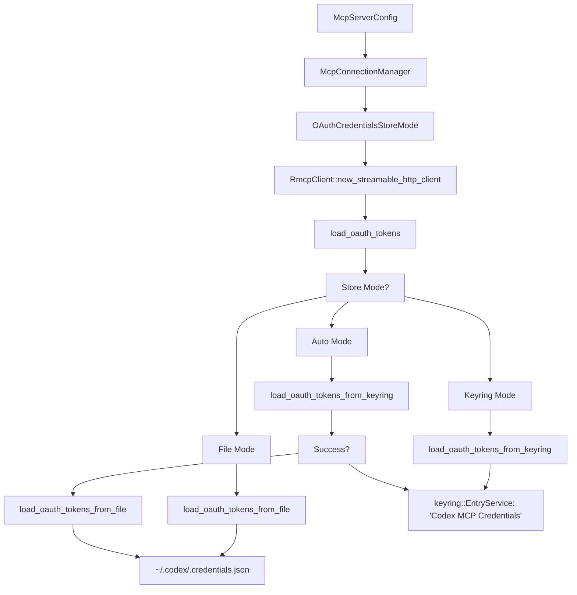

# OAuth Authentication for MCP

Relevant source files

-   [codex-rs/app-server/tests/suite/v2/mcp\_server\_elicitation.rs](https://github.com/openai/codex/blob/d807d44a/codex-rs/app-server/tests/suite/v2/mcp_server_elicitation.rs)
-   [codex-rs/cli/src/mcp\_cmd.rs](https://github.com/openai/codex/blob/d807d44a/codex-rs/cli/src/mcp_cmd.rs)
-   [codex-rs/cli/tests/mcp\_add\_remove.rs](https://github.com/openai/codex/blob/d807d44a/codex-rs/cli/tests/mcp_add_remove.rs)
-   [codex-rs/cli/tests/mcp\_list.rs](https://github.com/openai/codex/blob/d807d44a/codex-rs/cli/tests/mcp_list.rs)
-   [codex-rs/core/src/mcp/auth.rs](https://github.com/openai/codex/blob/d807d44a/codex-rs/core/src/mcp/auth.rs)
-   [codex-rs/core/src/mcp\_connection\_manager.rs](https://github.com/openai/codex/blob/d807d44a/codex-rs/core/src/mcp_connection_manager.rs)
-   [codex-rs/core/src/mcp\_connection\_manager\_tests.rs](https://github.com/openai/codex/blob/d807d44a/codex-rs/core/src/mcp_connection_manager_tests.rs)
-   [codex-rs/core/src/state/session.rs](https://github.com/openai/codex/blob/d807d44a/codex-rs/core/src/state/session.rs)
-   [codex-rs/core/src/state/turn.rs](https://github.com/openai/codex/blob/d807d44a/codex-rs/core/src/state/turn.rs)
-   [codex-rs/core/src/tasks/mod.rs](https://github.com/openai/codex/blob/d807d44a/codex-rs/core/src/tasks/mod.rs)
-   [codex-rs/core/src/tools/handlers/mcp\_resource.rs](https://github.com/openai/codex/blob/d807d44a/codex-rs/core/src/tools/handlers/mcp_resource.rs)
-   [codex-rs/core/src/tools/handlers/tool\_search\_tests.rs](https://github.com/openai/codex/blob/d807d44a/codex-rs/core/src/tools/handlers/tool_search_tests.rs)
-   [codex-rs/core/tests/suite/rmcp\_client.rs](https://github.com/openai/codex/blob/d807d44a/codex-rs/core/tests/suite/rmcp_client.rs)
-   [codex-rs/core/tests/suite/truncation.rs](https://github.com/openai/codex/blob/d807d44a/codex-rs/core/tests/suite/truncation.rs)
-   [codex-rs/core/tests/suite/user\_shell\_cmd.rs](https://github.com/openai/codex/blob/d807d44a/codex-rs/core/tests/suite/user_shell_cmd.rs)
-   [codex-rs/rmcp-client/Cargo.toml](https://github.com/openai/codex/blob/d807d44a/codex-rs/rmcp-client/Cargo.toml)
-   [codex-rs/rmcp-client/src/auth\_status.rs](https://github.com/openai/codex/blob/d807d44a/codex-rs/rmcp-client/src/auth_status.rs)
-   [codex-rs/rmcp-client/src/bin/rmcp\_test\_server.rs](https://github.com/openai/codex/blob/d807d44a/codex-rs/rmcp-client/src/bin/rmcp_test_server.rs)
-   [codex-rs/rmcp-client/src/bin/test\_stdio\_server.rs](https://github.com/openai/codex/blob/d807d44a/codex-rs/rmcp-client/src/bin/test_stdio_server.rs)
-   [codex-rs/rmcp-client/src/bin/test\_streamable\_http\_server.rs](https://github.com/openai/codex/blob/d807d44a/codex-rs/rmcp-client/src/bin/test_streamable_http_server.rs)
-   [codex-rs/rmcp-client/src/lib.rs](https://github.com/openai/codex/blob/d807d44a/codex-rs/rmcp-client/src/lib.rs)
-   [codex-rs/rmcp-client/src/logging\_client\_handler.rs](https://github.com/openai/codex/blob/d807d44a/codex-rs/rmcp-client/src/logging_client_handler.rs)
-   [codex-rs/rmcp-client/src/oauth.rs](https://github.com/openai/codex/blob/d807d44a/codex-rs/rmcp-client/src/oauth.rs)
-   [codex-rs/rmcp-client/src/perform\_oauth\_login.rs](https://github.com/openai/codex/blob/d807d44a/codex-rs/rmcp-client/src/perform_oauth_login.rs)
-   [codex-rs/rmcp-client/src/rmcp\_client.rs](https://github.com/openai/codex/blob/d807d44a/codex-rs/rmcp-client/src/rmcp_client.rs)
-   [codex-rs/rmcp-client/tests/resources.rs](https://github.com/openai/codex/blob/d807d44a/codex-rs/rmcp-client/tests/resources.rs)
-   [codex-rs/rmcp-client/tests/streamable\_http\_recovery.rs](https://github.com/openai/codex/blob/d807d44a/codex-rs/rmcp-client/tests/streamable_http_recovery.rs)
-   [codex-rs/utils/home-dir/BUILD.bazel](https://github.com/openai/codex/blob/d807d44a/codex-rs/utils/home-dir/BUILD.bazel)
-   [codex-rs/utils/home-dir/Cargo.toml](https://github.com/openai/codex/blob/d807d44a/codex-rs/utils/home-dir/Cargo.toml)
-   [codex-rs/utils/home-dir/src/lib.rs](https://github.com/openai/codex/blob/d807d44a/codex-rs/utils/home-dir/src/lib.rs)

## Overview

OAuth 2.0 authentication is supported exclusively for MCP servers using the **StreamableHttp** transport. Stdio transport servers do not support OAuth through Codex's built-in mechanisms. When configured, Codex performs an OAuth 2.0 authorization code flow with PKCE (Proof Key for Code Exchange) that opens a browser for user authorization, then stores the resulting credentials securely in the system keyring or a fallback file. [codex-rs/rmcp-client/src/perform\_oauth\_login.rs73-103](https://github.com/openai/codex/blob/d807d44a/codex-rs/rmcp-client/src/perform_oauth_login.rs#L73-L103)

The OAuth system consists of four main components:

1.  **OAuth Flow** - Browser-based authorization with local callback server via `perform_oauth_login` [codex-rs/rmcp-client/src/perform\_oauth\_login.rs73-103](https://github.com/openai/codex/blob/d807d44a/codex-rs/rmcp-client/src/perform_oauth_login.rs#L73-L103)
2.  **Credential Storage** - Platform-specific secure storage via `keyring` crate with fallback [codex-rs/rmcp-client/src/oauth.rs66-110](https://github.com/openai/codex/blob/d807d44a/codex-rs/rmcp-client/src/oauth.rs#L66-L110)
3.  **OAuthPersistor** - Manages token lifecycle, refresh, and persistence [codex-rs/rmcp-client/src/oauth.rs295-336](https://github.com/openai/codex/blob/d807d44a/codex-rs/rmcp-client/src/oauth.rs#L295-L336)
4.  **Auth Status Tracking** - Runtime detection of authentication state [codex-rs/core/src/mcp/auth.rs1-100](https://github.com/openai/codex/blob/d807d44a/codex-rs/core/src/mcp/auth.rs#L1-L100)

OAuth credentials are managed by the `codex_rmcp_client` crate. The `OAuthPersistor` wraps an `AuthorizationManager` from the `rmcp` SDK and handles automatic token refresh and persistence [codex-rs/rmcp-client/src/oauth.rs338-431](https://github.com/openai/codex/blob/d807d44a/codex-rs/rmcp-client/src/oauth.rs#L338-L431) The `McpConnectionManager` integrates these components when establishing StreamableHttp connections [codex-rs/core/src/mcp\_connection\_manager.rs974-1016](https://github.com/openai/codex/blob/d807d44a/codex-rs/core/src/mcp_connection_manager.rs#L974-L1016)

Sources: [codex-rs/rmcp-client/src/oauth.rs1-17](https://github.com/openai/codex/blob/d807d44a/codex-rs/rmcp-client/src/oauth.rs#L1-L17) [codex-rs/rmcp-client/src/perform\_oauth\_login.rs1-71](https://github.com/openai/codex/blob/d807d44a/codex-rs/rmcp-client/src/perform_oauth_login.rs#L1-L71) [codex-rs/rmcp-client/src/rmcp\_client.rs1-64](https://github.com/openai/codex/blob/d807d44a/codex-rs/rmcp-client/src/rmcp_client.rs#L1-L64)

---

## OAuth Flow for StreamableHttp Servers

### Flow Architecture

When a user runs `codex mcp login <server-name>`, Codex initiates an OAuth 2.0 authorization code flow with PKCE. The flow involves starting a local HTTP server to receive the authorization callback, opening the user's browser to the authorization URL, and exchanging the authorization code for access and refresh tokens [codex-rs/cli/src/mcp\_cmd.rs322-363](https://github.com/openai/codex/blob/d807d44a/codex-rs/cli/src/mcp_cmd.rs#L322-L363)

**OAuth Authorization Flow**

> **[Mermaid sequence]**
> *(图表结构无法解析)*

Sources: [codex-rs/cli/src/mcp\_cmd.rs322-363](https://github.com/openai/codex/blob/d807d44a/codex-rs/cli/src/mcp_cmd.rs#L322-L363) [codex-rs/rmcp-client/src/perform\_oauth\_login.rs142-185](https://github.com/openai/codex/blob/d807d44a/codex-rs/rmcp-client/src/perform_oauth_login.rs#L142-L185)

### OAuth Configuration Fields

The OAuth flow is triggered when a StreamableHttp MCP server is configured. The `McpServerConfig` supports the following fields [codex-rs/core/src/config/types.rs44-80](https://github.com/openai/codex/blob/d807d44a/codex-rs/core/src/config/types.rs#L44-L80):

| Field | Type | Required | Description |
| --- | --- | --- | --- |
| `url` | `String` | Yes | MCP server endpoint URL |
| `scopes` | `Option<Vec<String>>` | No | OAuth scopes to request during authorization |
| `bearer_token_env_var` | `Option<String>` | No | Alternative: read bearer token from environment variable |
| `oauth_resource` | `Option<String>` | No | Optional resource parameter for OAuth request |

**OAuth vs Environment Variable Authentication:**

-   If `bearer_token_env_var` is set, Codex uses that token and skips OAuth entirely [codex-rs/rmcp-client/src/rmcp\_client.rs248-259](https://github.com/openai/codex/blob/d807d44a/codex-rs/rmcp-client/src/rmcp_client.rs#L248-L259)
-   If `bearer_token_env_var` is not set and no OAuth credentials exist, Codex checks if the server supports OAuth via `supports_oauth_login` [codex-rs/rmcp-client/src/auth\_status.rs1-50](https://github.com/openai/codex/blob/d807d44a/codex-rs/rmcp-client/src/auth_status.rs#L1-L50)
-   If OAuth is supported, the user is prompted to run `codex mcp login` [codex-rs/cli/src/mcp\_cmd.rs265-285](https://github.com/openai/codex/blob/d807d44a/codex-rs/cli/src/mcp_cmd.rs#L265-L285)

Sources: [codex-rs/core/src/config/types.rs44-80](https://github.com/openai/codex/blob/d807d44a/codex-rs/core/src/config/types.rs#L44-L80) [codex-rs/cli/src/mcp\_cmd.rs265-285](https://github.com/openai/codex/blob/d807d44a/codex-rs/cli/src/mcp_cmd.rs#L265-L285) [codex-rs/rmcp-client/src/rmcp\_client.rs248-259](https://github.com/openai/codex/blob/d807d44a/codex-rs/rmcp-client/src/rmcp_client.rs#L248-L259)

### OAuth Callback Server

The `OauthLoginFlow` starts a temporary `tiny_http::Server` on `localhost` to receive the OAuth callback [codex-rs/rmcp-client/src/perform\_oauth\_login.rs142-185](https://github.com/openai/codex/blob/d807d44a/codex-rs/rmcp-client/src/perform_oauth_login.rs#L142-L185) The server lifecycle is managed by a `CallbackServerGuard` that ensures cleanup [codex-rs/rmcp-client/src/perform\_oauth\_login.rs32-40](https://github.com/openai/codex/blob/d807d44a/codex-rs/rmcp-client/src/perform_oauth_login.rs#L32-L40)

**Callback Flow:**

1.  `spawn_callback_server` spawns a blocking task that waits for HTTP requests [codex-rs/rmcp-client/src/perform\_oauth\_login.rs142-147](https://github.com/openai/codex/blob/d807d44a/codex-rs/rmcp-client/src/perform_oauth_login.rs#L142-L147)
2.  `parse_oauth_callback` validates the callback path and extracts `code` and `state` query parameters [codex-rs/rmcp-client/src/perform\_oauth\_login.rs206-236](https://github.com/openai/codex/blob/d807d44a/codex-rs/rmcp-client/src/perform_oauth_login.rs#L206-L236)
3.  The server responds with "Authentication complete" or an error message [codex-rs/rmcp-client/src/perform\_oauth\_login.rs152-166](https://github.com/openai/codex/blob/d807d44a/codex-rs/rmcp-client/src/perform_oauth_login.rs#L152-L166)
4.  `CallbackServerGuard::drop` calls `server.unblock()` to shut down the server [codex-rs/rmcp-client/src/perform\_oauth\_login.rs36-40](https://github.com/openai/codex/blob/d807d44a/codex-rs/rmcp-client/src/perform_oauth_login.rs#L36-L40)

Sources: [codex-rs/rmcp-client/src/perform\_oauth\_login.rs108-146](https://github.com/openai/codex/blob/d807d44a/codex-rs/rmcp-client/src/perform_oauth_login.rs#L108-L146) [codex-rs/rmcp-client/src/perform\_oauth\_login.rs206-236](https://github.com/openai/codex/blob/d807d44a/codex-rs/rmcp-client/src/perform_oauth_login.rs#L206-L236) [codex-rs/rmcp-client/src/perform\_oauth\_login.rs32-40](https://github.com/openai/codex/blob/d807d44a/codex-rs/rmcp-client/src/perform_oauth_login.rs#L32-L40)

---

## Credential Storage

### Storage Modes

Codex supports three credential storage modes via the `OAuthCredentialsStoreMode` enum [codex-rs/rmcp-client/src/oauth.rs66-79](https://github.com/openai/codex/blob/d807d44a/codex-rs/rmcp-client/src/oauth.rs#L66-L79):

| Mode | Description | Behavior |
| --- | --- | --- |
| `Auto` (default) | Try keyring, fallback to file | Attempts `keyring` crate storage; falls back to `~/.codex/.credentials.json` |
| `File` | Always use file storage | Directly writes to `~/.codex/.credentials.json` |
| `Keyring` | Require keyring storage | Fails if keyring is unavailable |

**Platform-Specific Keyring Backends:**

The `keyring` crate uses platform-specific secure storage [codex-rs/rmcp-client/Cargo.toml66-73](https://github.com/openai/codex/blob/d807d44a/codex-rs/rmcp-client/Cargo.toml#L66-L73):

-   **macOS**: macOS Keychain (`apple-native`)
-   **Windows**: Windows Credential Manager (`windows-native`)
-   **Linux**: Kernel `keyutils` or DBus Secret Service (`linux-native-async-persistent`)

**Credential Storage Architecture**


Sources: [codex-rs/rmcp-client/src/oauth.rs66-79](https://github.com/openai/codex/blob/d807d44a/codex-rs/rmcp-client/src/oauth.rs#L66-L79) [codex-rs/rmcp-client/src/oauth.rs94-110](https://github.com/openai/codex/blob/d807d44a/codex-rs/rmcp-client/src/oauth.rs#L94-L110) [codex-rs/rmcp-client/Cargo.toml66-73](https://github.com/openai/codex/blob/d807d44a/codex-rs/rmcp-client/Cargo.toml#L66-L73)

### Credential Key Structure and Data Model

OAuth credentials are stored using a composite key derived from `(server_name, server_url)` using a SHA-256 hash [codex-rs/rmcp-client/src/oauth.rs56-64](https://github.com/openai/codex/blob/d807d44a/codex-rs/rmcp-client/src/oauth.rs#L56-L64)

**StoredOAuthTokens Structure:** [codex-rs/rmcp-client/src/oauth.rs248-260](https://github.com/openai/codex/blob/d807d44a/codex-rs/rmcp-client/src/oauth.rs#L248-L260)

```
pub struct StoredOAuthTokens {    pub server_name: String,    pub url: String,    pub client_id: String,    pub token_response: WrappedOAuthTokenResponse,    pub expires_at: Option<u64>,}
```
Sources: [codex-rs/rmcp-client/src/oauth.rs56-64](https://github.com/openai/codex/blob/d807d44a/codex-rs/rmcp-client/src/oauth.rs#L56-L64) [codex-rs/rmcp-client/src/oauth.rs248-260](https://github.com/openai/codex/blob/d807d44a/codex-rs/rmcp-client/src/oauth.rs#L248-L260)

---

## OAuthPersistor and Token Refresh

### OAuthPersistor Structure

The `OAuthPersistor` manages the OAuth token lifecycle, wrapping an `AuthorizationManager` [codex-rs/rmcp-client/src/oauth.rs295-336](https://github.com/openai/codex/blob/d807d44a/codex-rs/rmcp-client/src/oauth.rs#L295-L336)

```
pub struct OAuthPersistor {    server_name: String,    url: String,    auth_manager: Arc<Mutex<AuthorizationManager>>,    credentials_store: OAuthCredentialsStoreMode,    // ...}
```
### Automatic Token Refresh

Token refresh is triggered automatically by the `AuthClient` wrapper. The `OAuthPersistor` ensures that refreshed tokens are persisted back to secure storage [codex-rs/rmcp-client/src/oauth.rs338-431](https://github.com/openai/codex/blob/d807d44a/codex-rs/rmcp-client/src/oauth.rs#L338-L431)

**Token Refresh Flow**

> **[Mermaid sequence]**
> *(图表结构无法解析)*

Sources: [codex-rs/rmcp-client/src/oauth.rs338-431](https://github.com/openai/codex/blob/d807d44a/codex-rs/rmcp-client/src/oauth.rs#L338-L431) [codex-rs/rmcp-client/src/rmcp\_client.rs569-583](https://github.com/openai/codex/blob/d807d44a/codex-rs/rmcp-client/src/rmcp_client.rs#L569-L583)

---

## Auth Status Tracking

Codex tracks the authentication status of each configured MCP server. The `McpAuthStatus` enum defines the states [codex-rs/cli/src/mcp\_cmd.rs395-409](https://github.com/openai/codex/blob/d807d44a/codex-rs/cli/src/mcp_cmd.rs#L395-L409):

| Status | Description |
| --- | --- |
| `Authenticated` | Valid OAuth credentials are stored [codex-rs/cli/src/mcp\_cmd.rs519-535](https://github.com/openai/codex/blob/d807d44a/codex-rs/cli/src/mcp_cmd.rs#L519-L535) |
| `Unauthenticated` | OAuth supported but user has not logged in [codex-rs/cli/src/mcp\_cmd.rs519-535](https://github.com/openai/codex/blob/d807d44a/codex-rs/cli/src/mcp_cmd.rs#L519-L535) |
| `Unsupported` | Server uses `bearer_token_env_var` or Stdio transport [codex-rs/cli/src/mcp\_cmd.rs519-535](https://github.com/openai/codex/blob/d807d44a/codex-rs/cli/src/mcp_cmd.rs#L519-L535) |

The `compute_auth_statuses` function in `codex_core::mcp::auth` performs the detection by checking credential storage for each configured server [codex-rs/cli/src/mcp\_cmd.rs16-18](https://github.com/openai/codex/blob/d807d44a/codex-rs/cli/src/mcp_cmd.rs#L16-L18)

Sources: [codex-rs/cli/src/mcp\_cmd.rs395-409](https://github.com/openai/codex/blob/d807d44a/codex-rs/cli/src/mcp_cmd.rs#L395-L409) [codex-rs/cli/src/mcp\_cmd.rs519-535](https://github.com/openai/codex/blob/d807d44a/codex-rs/cli/src/mcp_cmd.rs#L519-L535) [codex-rs/core/src/mcp/auth.rs1-100](https://github.com/openai/codex/blob/d807d44a/codex-rs/core/src/mcp/auth.rs#L1-L100)

---

## CLI Commands

### `codex mcp login`

Initiates the OAuth flow for a StreamableHttp MCP server [codex-rs/cli/src/mcp\_cmd.rs322-363](https://github.com/openai/codex/blob/d807d44a/codex-rs/cli/src/mcp_cmd.rs#L322-L363)

**Usage:**

```
codex mcp login <server-name> --scopes scope1,scope2
```
### `codex mcp logout`

Removes stored OAuth credentials for an MCP server [codex-rs/cli/src/mcp\_cmd.rs365-393](https://github.com/openai/codex/blob/d807d44a/codex-rs/cli/src/mcp_cmd.rs#L365-L393)

**Usage:**

```
codex mcp logout <server-name>
```
Sources: [codex-rs/cli/src/mcp\_cmd.rs322-363](https://github.com/openai/codex/blob/d807d44a/codex-rs/cli/src/mcp_cmd.rs#L322-L363) [codex-rs/cli/src/mcp\_cmd.rs365-393](https://github.com/openai/codex/blob/d807d44a/codex-rs/cli/src/mcp_cmd.rs#L365-L393)

---

## Security Considerations

### Storage Security

-   **Keyring**: Encrypted via OS-level security (Keychain, Credential Manager) [codex-rs/rmcp-client/Cargo.toml66-73](https://github.com/openai/codex/blob/d807d44a/codex-rs/rmcp-client/Cargo.toml#L66-L73)
-   **File Fallback**: Stored in `~/.codex/.credentials.json`. Codex attempts to set restrictive permissions (0600), but it remains unencrypted at rest [codex-rs/rmcp-client/src/oauth.rs1-17](https://github.com/openai/codex/blob/d807d44a/codex-rs/rmcp-client/src/oauth.rs#L1-L17)

### Bearer Token Alternative

If `bearer_token_env_var` is configured, Codex reads the token from the environment and skips OAuth. This is useful for CI or servers that use static API keys [codex-rs/rmcp-client/src/rmcp\_client.rs248-259](https://github.com/openai/codex/blob/d807d44a/codex-rs/rmcp-client/src/rmcp_client.rs#L248-L259)

Sources: [codex-rs/rmcp-client/src/oauth.rs1-17](https://github.com/openai/codex/blob/d807d44a/codex-rs/rmcp-client/src/oauth.rs#L1-L17) [codex-rs/rmcp-client/src/rmcp\_client.rs248-259](https://github.com/openai/codex/blob/d807d44a/codex-rs/rmcp-client/src/rmcp_client.rs#L248-L259)
