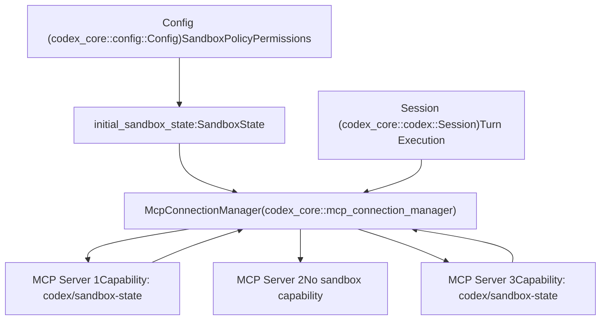
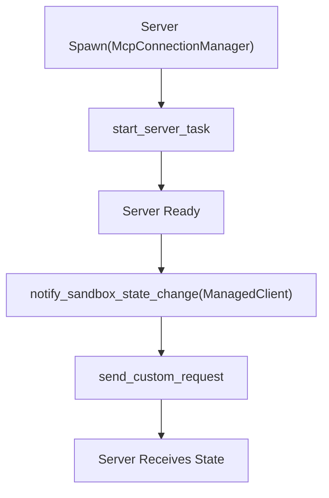

# Sandbox State Synchronization

Relevant source files

-   [codex-rs/ansi-escape/Cargo.toml](https://github.com/openai/codex/blob/d807d44a/codex-rs/ansi-escape/Cargo.toml)
-   [codex-rs/app-server/tests/suite/v2/mcp\_server\_elicitation.rs](https://github.com/openai/codex/blob/d807d44a/codex-rs/app-server/tests/suite/v2/mcp_server_elicitation.rs)
-   [codex-rs/cli/src/mcp\_cmd.rs](https://github.com/openai/codex/blob/d807d44a/codex-rs/cli/src/mcp_cmd.rs)
-   [codex-rs/cli/tests/mcp\_add\_remove.rs](https://github.com/openai/codex/blob/d807d44a/codex-rs/cli/tests/mcp_add_remove.rs)
-   [codex-rs/cli/tests/mcp\_list.rs](https://github.com/openai/codex/blob/d807d44a/codex-rs/cli/tests/mcp_list.rs)
-   [codex-rs/core/src/mcp\_connection\_manager.rs](https://github.com/openai/codex/blob/d807d44a/codex-rs/core/src/mcp_connection_manager.rs)
-   [codex-rs/core/src/mcp\_connection\_manager\_tests.rs](https://github.com/openai/codex/blob/d807d44a/codex-rs/core/src/mcp_connection_manager_tests.rs)
-   [codex-rs/core/src/state/session.rs](https://github.com/openai/codex/blob/d807d44a/codex-rs/core/src/state/session.rs)
-   [codex-rs/core/src/state/turn.rs](https://github.com/openai/codex/blob/d807d44a/codex-rs/core/src/state/turn.rs)
-   [codex-rs/core/src/tasks/mod.rs](https://github.com/openai/codex/blob/d807d44a/codex-rs/core/src/tasks/mod.rs)
-   [codex-rs/core/src/tools/handlers/tool\_search\_tests.rs](https://github.com/openai/codex/blob/d807d44a/codex-rs/core/src/tools/handlers/tool_search_tests.rs)
-   [codex-rs/core/tests/suite/rmcp\_client.rs](https://github.com/openai/codex/blob/d807d44a/codex-rs/core/tests/suite/rmcp_client.rs)
-   [codex-rs/core/tests/suite/truncation.rs](https://github.com/openai/codex/blob/d807d44a/codex-rs/core/tests/suite/truncation.rs)
-   [codex-rs/core/tests/suite/user\_shell\_cmd.rs](https://github.com/openai/codex/blob/d807d44a/codex-rs/core/tests/suite/user_shell_cmd.rs)
-   [codex-rs/rmcp-client/src/rmcp\_client.rs](https://github.com/openai/codex/blob/d807d44a/codex-rs/rmcp-client/src/rmcp_client.rs)
-   [codex-rs/rmcp-client/tests/streamable\_http\_recovery.rs](https://github.com/openai/codex/blob/d807d44a/codex-rs/rmcp-client/tests/streamable_http_recovery.rs)

## Purpose and Scope

This document describes how Codex synchronizes sandbox execution state with MCP servers through a custom protocol extension. When Codex enforces sandbox restrictions (read-only access, workspace boundaries, specific sandboxing mechanisms), MCP servers need awareness of these constraints to adapt their tool behavior accordingly.

For general MCP server configuration and lifecycle management, see [6.2 MCP Connection Manager](https://github.com/openai/codex/blob/d807d44a/6.2 MCP Connection Manager) For sandbox policy configuration within Codex itself, see [2.4 Sandbox and Approval Policies](https://github.com/openai/codex/blob/d807d44a/2.4 Sandbox and Approval Policies)

---

## Overview

Sandbox state synchronization is a Codex-specific extension to the Model Context Protocol that enables MCP servers to receive notifications about the current sandbox execution environment. This allows external tool servers to:

-   Understand which sandbox policy is active (`ReadOnly`, `WorkspaceWrite`, `DangerFullAccess`).
-   Know the working directory for sandboxed operations.
-   Receive platform-specific sandbox executor paths (e.g., Landlock for Linux).
-   Adapt tool execution to match Codex's security constraints.

The synchronization uses a custom MCP capability (`codex/sandbox-state`) and notification method (`codex/sandbox-state/update`) to propagate state changes from Codex to connected servers.

Sources: [codex-rs/core/src/mcp\_connection\_manager.rs581-595](https://github.com/openai/codex/blob/d807d44a/codex-rs/core/src/mcp_connection_manager.rs#L581-L595)

---

## System Architecture

The following diagram illustrates how sandbox state flows from the core configuration through the `McpConnectionManager` to external servers.

### Sandbox State Propagation Flow


Sources: [codex-rs/core/src/mcp\_connection\_manager.rs635-756](https://github.com/openai/codex/blob/d807d44a/codex-rs/core/src/mcp_connection_manager.rs#L635-L756) [codex-rs/core/src/mcp\_connection\_manager.rs1058-1069](https://github.com/openai/codex/blob/d807d44a/codex-rs/core/src/mcp_connection_manager.rs#L1058-L1069)

---

## SandboxState Structure

The `SandboxState` struct contains all information MCP servers need to understand Codex's execution environment.

| Field | Type | Description |
| --- | --- | --- |
| `sandbox_policy` | `SandboxPolicy` | Active policy: `ReadOnly`, `WorkspaceWrite`, or `DangerFullAccess`. |
| `codex_linux_sandbox_exe` | `Option<PathBuf>` | Path to Linux sandbox wrapper executable (landlock implementation). |
| `sandbox_cwd` | `PathBuf` | Current working directory for sandboxed operations. |
| `use_legacy_landlock` | `bool` | Whether to use legacy landlock implementation (default: false). |

The structure is serialized as JSON when sent over MCP transport with camelCase field names.

Sources: [codex-rs/core/src/mcp\_connection\_manager.rs587-595](https://github.com/openai/codex/blob/d807d44a/codex-rs/core/src/mcp_connection_manager.rs#L587-L595)

---

## Capability Negotiation

### Server Capability Declaration

MCP servers advertise support for sandbox state notifications by including the `codex/sandbox-state` capability in their initialization response:

```
{  "capabilities": {    "experimental": {      "codex/sandbox-state": {}    }  }}
```
### Client Capability Checking

During server initialization, Codex checks for capability support and stores the result in the `ManagedClient` struct.

### Negotiation Sequence

> **[Mermaid sequence]**
> *(图表结构无法解析)*

The capability flag is checked within `ManagedClient::notify_sandbox_state_change` before sending any notifications.

Sources: [codex-rs/core/src/mcp\_connection\_manager.rs370-421](https://github.com/openai/codex/blob/d807d44a/codex-rs/core/src/mcp_connection_manager.rs#L370-L421) [codex-rs/core/src/mcp\_connection\_manager.rs407-420](https://github.com/openai/codex/blob/d807d44a/codex-rs/core/src/mcp_connection_manager.rs#L407-L420)

---

## Notification Timing

### Initial Notification on Startup

When an MCP server transitions to `Ready` status within `start_server_task`, Codex immediately sends the current sandbox state.

### Initial Notification Flow


The initial state is captured during the construction of `McpConnectionManager` using the current `Config` and session environment.

Sources: [codex-rs/core/src/mcp\_connection\_manager.rs687-703](https://github.com/openai/codex/blob/d807d44a/codex-rs/core/src/mcp_connection_manager.rs#L687-L703)

### Runtime Notifications

The public API method `notify_all_sandbox_state_change` allows Codex to push updates when sandbox configuration changes during execution (e.g., via a session policy update).

### Runtime Notification Sequence

> **[Mermaid sequence]**
> *(图表结构无法解析)*

Sources: [codex-rs/core/src/mcp\_connection\_manager.rs1058-1069](https://github.com/openai/codex/blob/d807d44a/codex-rs/core/src/mcp_connection_manager.rs#L1058-L1069)

---

## Protocol Details

### Custom Request Method

The notification uses the MCP custom request mechanism with the following Codex-specific identifiers:

| Constant | Value | Usage |
| --- | --- | --- |
| `MCP_SANDBOX_STATE_CAPABILITY` | `"codex/sandbox-state"` | Capability identifier in server metadata. |
| `MCP_SANDBOX_STATE_METHOD` | `"codex/sandbox-state/update"` | Custom request method name. |

The request is sent as an MCP custom request with the `SandboxState` struct serialized as the `params`. The server is expected to acknowledge the request with an empty response or error status.

Sources: [codex-rs/core/src/mcp\_connection\_manager.rs581-585](https://github.com/openai/codex/blob/d807d44a/codex-rs/core/src/mcp_connection_manager.rs#L581-L585) [codex-rs/core/src/mcp\_connection\_manager.rs412-418](https://github.com/openai/codex/blob/d807d44a/codex-rs/core/src/mcp_connection_manager.rs#L412-L418)

---

## Implementation Reference

### Key Types

| Type | Location | Purpose |
| --- | --- | --- |
| `SandboxState` | [codex-rs/core/src/mcp\_connection\_manager.rs587-595](https://github.com/openai/codex/blob/d807d44a/codex-rs/core/src/mcp_connection_manager.rs#L587-L595) | Data structure containing the sandbox policy and environment. |
| `ManagedClient` | [codex-rs/core/src/mcp\_connection\_manager.rs370-421](https://github.com/openai/codex/blob/d807d44a/codex-rs/core/src/mcp_connection_manager.rs#L370-L421) | Internal wrapper for an MCP client that tracks capabilities. |
| `AsyncManagedClient` | [codex-rs/core/src/mcp\_connection\_manager.rs423-579](https://github.com/openai/codex/blob/d807d44a/codex-rs/core/src/mcp_connection_manager.rs#L423-L579) | Handles the asynchronous lifecycle and notification dispatch. |
| `McpConnectionManager` | [codex-rs/core/src/mcp\_connection\_manager.rs598-1095](https://github.com/openai/codex/blob/d807d44a/codex-rs/core/src/mcp_connection_manager.rs#L598-L1095) | Coordinates all MCP connections and broadcasts state updates. |

### Key Methods

-   `ManagedClient::notify_sandbox_state_change`: Checks capability and sends the `codex/sandbox-state/update` request. [codex-rs/core/src/mcp\_connection\_manager.rs407-420](https://github.com/openai/codex/blob/d807d44a/codex-rs/core/src/mcp_connection_manager.rs#L407-L420)
-   `McpConnectionManager::notify_all_sandbox_state_change`: Public broadcast method used for runtime updates. [codex-rs/core/src/mcp\_connection\_manager.rs1058-1069](https://github.com/openai/codex/blob/d807d44a/codex-rs/core/src/mcp_connection_manager.rs#L1058-L1069)

Sources: [codex-rs/core/src/mcp\_connection\_manager.rs407-420](https://github.com/openai/codex/blob/d807d44a/codex-rs/core/src/mcp_connection_manager.rs#L407-L420) [codex-rs/core/src/mcp\_connection\_manager.rs1058-1069](https://github.com/openai/codex/blob/d807d44a/codex-rs/core/src/mcp_connection_manager.rs#L1058-L1069)

---

## Error Handling

The synchronization mechanism is designed to be non-blocking and resilient:

-   **Capability Check**: Servers without the capability are silently skipped without error.
-   **Individual Failures**: Errors from individual servers (e.g., timeout or rejection) are logged using `tracing::warn!` but do not abort the notification loop for other servers. [codex-rs/core/src/mcp\_connection\_manager.rs1064-1068](https://github.com/openai/codex/blob/d807d44a/codex-rs/core/src/mcp_connection_manager.rs#L1064-L1068)
-   **Transport Resilience**: Transport-level errors are propagated through `RmcpClient` but caught at the manager level.

Sources: [codex-rs/core/src/mcp\_connection\_manager.rs1058-1069](https://github.com/openai/codex/blob/d807d44a/codex-rs/core/src/mcp_connection_manager.rs#L1058-L1069) [codex-rs/core/src/mcp\_connection\_manager.rs695-703](https://github.com/openai/codex/blob/d807d44a/codex-rs/core/src/mcp_connection_manager.rs#L695-L703)

---

## Platform Considerations

### Linux Sandbox Executable

The `codex_linux_sandbox_exe` field provides the path to the Linux-specific sandboxing wrapper that uses Landlock LSM. This allows MCP servers on Linux to maintain consistent security boundaries with Codex.

### Cross-Platform Behavior

| Platform | Sandbox Mechanism | `codex_linux_sandbox_exe` Value |
| --- | --- | --- |
| Linux | Landlock LSM | Path to `codex-linux-sandbox` binary. |
| macOS | Seatbelt profiles | `None`. |
| Windows | Restricted tokens | `None`. |

Sources: [codex-rs/core/src/mcp\_connection\_manager.rs587-595](https://github.com/openai/codex/blob/d807d44a/codex-rs/core/src/mcp_connection_manager.rs#L587-L595)
