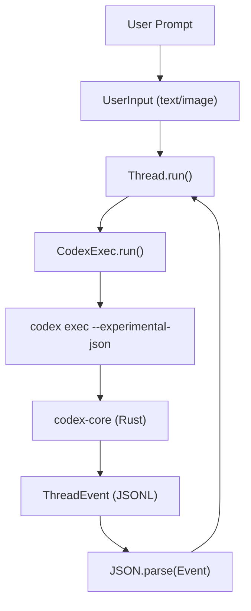
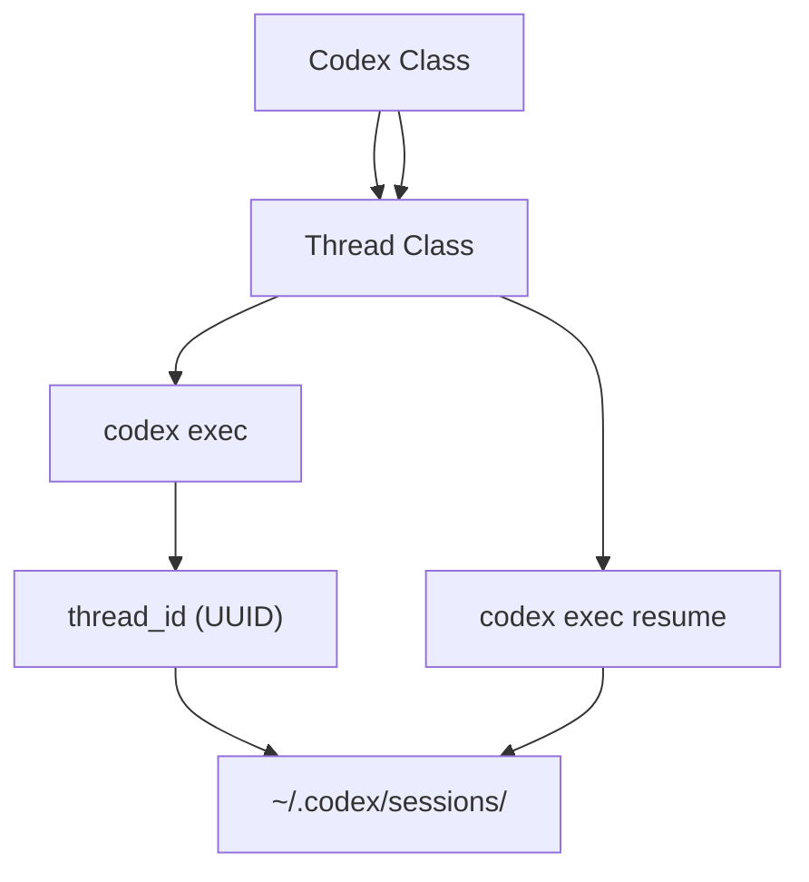

# SDKs and External Integrations

Relevant source files

-   [.github/workflows/shell-tool-mcp-ci.yml](https://github.com/openai/codex/blob/d807d44a/.github/workflows/shell-tool-mcp-ci.yml)
-   [CHANGELOG.md](https://github.com/openai/codex/blob/d807d44a/CHANGELOG.md?plain=1)
-   [cliff.toml](https://github.com/openai/codex/blob/d807d44a/cliff.toml)
-   [codex-cli/package.json](https://github.com/openai/codex/blob/d807d44a/codex-cli/package.json)
-   [codex-rs/exec/tests/suite/add\_dir.rs](https://github.com/openai/codex/blob/d807d44a/codex-rs/exec/tests/suite/add_dir.rs)
-   [codex-rs/responses-api-proxy/npm/package.json](https://github.com/openai/codex/blob/d807d44a/codex-rs/responses-api-proxy/npm/package.json)
-   [package.json](https://github.com/openai/codex/blob/d807d44a/package.json)
-   [pnpm-lock.yaml](https://github.com/openai/codex/blob/d807d44a/pnpm-lock.yaml)
-   [pnpm-workspace.yaml](https://github.com/openai/codex/blob/d807d44a/pnpm-workspace.yaml)
-   [sdk/typescript/.prettierignore](https://github.com/openai/codex/blob/d807d44a/sdk/typescript/.prettierignore)
-   [sdk/typescript/README.md](https://github.com/openai/codex/blob/d807d44a/sdk/typescript/README.md?plain=1)
-   [sdk/typescript/eslint.config.js](https://github.com/openai/codex/blob/d807d44a/sdk/typescript/eslint.config.js)
-   [sdk/typescript/jest.config.cjs](https://github.com/openai/codex/blob/d807d44a/sdk/typescript/jest.config.cjs)
-   [sdk/typescript/package.json](https://github.com/openai/codex/blob/d807d44a/sdk/typescript/package.json)
-   [sdk/typescript/samples/basic\_streaming.ts](https://github.com/openai/codex/blob/d807d44a/sdk/typescript/samples/basic_streaming.ts)
-   [sdk/typescript/src/codex.ts](https://github.com/openai/codex/blob/d807d44a/sdk/typescript/src/codex.ts)
-   [sdk/typescript/src/codexOptions.ts](https://github.com/openai/codex/blob/d807d44a/sdk/typescript/src/codexOptions.ts)
-   [sdk/typescript/src/events.ts](https://github.com/openai/codex/blob/d807d44a/sdk/typescript/src/events.ts)
-   [sdk/typescript/src/exec.ts](https://github.com/openai/codex/blob/d807d44a/sdk/typescript/src/exec.ts)
-   [sdk/typescript/src/index.ts](https://github.com/openai/codex/blob/d807d44a/sdk/typescript/src/index.ts)
-   [sdk/typescript/src/items.ts](https://github.com/openai/codex/blob/d807d44a/sdk/typescript/src/items.ts)
-   [sdk/typescript/src/thread.ts](https://github.com/openai/codex/blob/d807d44a/sdk/typescript/src/thread.ts)
-   [sdk/typescript/src/threadOptions.ts](https://github.com/openai/codex/blob/d807d44a/sdk/typescript/src/threadOptions.ts)
-   [sdk/typescript/src/turnOptions.ts](https://github.com/openai/codex/blob/d807d44a/sdk/typescript/src/turnOptions.ts)
-   [sdk/typescript/tests/abort.test.ts](https://github.com/openai/codex/blob/d807d44a/sdk/typescript/tests/abort.test.ts)
-   [sdk/typescript/tests/codexExecSpy.ts](https://github.com/openai/codex/blob/d807d44a/sdk/typescript/tests/codexExecSpy.ts)
-   [sdk/typescript/tests/exec.test.ts](https://github.com/openai/codex/blob/d807d44a/sdk/typescript/tests/exec.test.ts)
-   [sdk/typescript/tests/responsesProxy.ts](https://github.com/openai/codex/blob/d807d44a/sdk/typescript/tests/responsesProxy.ts)
-   [sdk/typescript/tests/run.test.ts](https://github.com/openai/codex/blob/d807d44a/sdk/typescript/tests/run.test.ts)
-   [sdk/typescript/tests/runStreamed.test.ts](https://github.com/openai/codex/blob/d807d44a/sdk/typescript/tests/runStreamed.test.ts)
-   [sdk/typescript/tsconfig.json](https://github.com/openai/codex/blob/d807d44a/sdk/typescript/tsconfig.json)
-   [shell-tool-mcp/package.json](https://github.com/openai/codex/blob/d807d44a/shell-tool-mcp/package.json)
-   [shell-tool-mcp/src/index.ts](https://github.com/openai/codex/blob/d807d44a/shell-tool-mcp/src/index.ts)

This page provides a high-level overview of the official SDKs and integration packages available for embedding Codex into external applications and workflows. These tools allow developers to interact with the Codex agent programmatically, manage conversation lifecycles, and extend shell capabilities via the Model Context Protocol (MCP).

## TypeScript SDK (`@openai/codex-sdk`)

The TypeScript SDK provides a high-level, promise-based interface for interacting with Codex from Node.js environments (v18+). It functions by wrapping the `@openai/codex` CLI and exchanging structured JSONL events over standard I/O [sdk/typescript/README.md5-13](https://github.com/openai/codex/blob/d807d44a/sdk/typescript/README.md?plain=1#L5-L13)

### Core Components

-   **`Codex` Class**: The entry point for the SDK. It handles global configuration such as API keys, base URLs, and environment variable overrides [sdk/typescript/src/codex.ts14-22](https://github.com/openai/codex/blob/d807d44a/sdk/typescript/src/codex.ts#L14-L22)
-   **`Thread` Class**: Manages a specific conversation session. It tracks the `thread_id` and provides methods to execute turns [sdk/typescript/src/thread.ts41-63](https://github.com/openai/codex/blob/d807d44a/sdk/typescript/src/thread.ts#L41-L63)
-   **`CodexExec`**: An internal utility that handles the `spawn` logic for the underlying Rust binary, serializing configuration into CLI flags like `--config` and `--experimental-json` [sdk/typescript/src/exec.ts57-79](https://github.com/openai/codex/blob/d807d44a/sdk/typescript/src/exec.ts#L57-L79)

### Execution Modes

The SDK supports both atomic and streaming execution:

-   **`thread.run()`**: Buffers all events and returns a completed `Turn` object containing the final response and usage statistics [sdk/typescript/src/thread.ts115-138](https://github.com/openai/codex/blob/d807d44a/sdk/typescript/src/thread.ts#L115-L138)
-   **`thread.runStreamed()`**: Returns an `AsyncGenerator` of `ThreadEvent` objects, allowing real-time UI updates for tool calls, reasoning, and file changes [sdk/typescript/src/thread.ts66-112](https://github.com/openai/codex/blob/d807d44a/sdk/typescript/src/thread.ts#L66-L112)

For details, see [TypeScript SDK](/openai/codex/7.1-typescript-sdk).

---

## Python SDK (`codex-app-server-sdk`)

The Python SDK provides a native client for the Codex App Server. Unlike the TypeScript SDK which wraps the CLI, the Python SDK typically communicates with a running Codex server instance via JSON-RPC or REST-like endpoints.

It utilizes Pydantic models for type-safe wire communication and supports both synchronous and asynchronous client implementations for managing thread lifecycles and turn execution.

For details, see [Python SDK](/openai/codex/7.2-python-sdk).

---

## Shell Tool MCP Package (`@openai/codex-shell-tool-mcp`)

The `@openai/codex-shell-tool-mcp` package is an NPM-distributed tool that enables the Model Context Protocol (MCP) to interact with local shell environments [shell-tool-mcp/package.json2-10](https://github.com/openai/codex/blob/d807d44a/shell-tool-mcp/package.json#L2-L10)

### Key Features

-   **Patched Shells**: Includes specialized versions of Bash and Zsh compiled with an `EXEC_WRAPPER` to allow the agent to intercept and safely execute commands.
-   **Sandbox State**: Implements the `codex/sandbox-state/update` capability to synchronize the agent's current permission level (e.g., `ReadOnly` vs `WorkspaceWrite`) with the shell environment.
-   **Rule Enforcement**: Automatically respects `.rules` files found in the working directory to constrain agent behavior during shell sessions.

For details, see [Shell Tool MCP Package](/openai/codex/7.3-shell-tool-mcp-package).

---

## Integration Architecture

The following diagram illustrates how the TypeScript SDK bridges the gap between Natural Language (user input) and the Code Entity Space (CLI execution and event processing).

### SDK to CLI Bridge

**Sources:** [sdk/typescript/src/thread.ts70-112](https://github.com/openai/codex/blob/d807d44a/sdk/typescript/src/thread.ts#L70-L112) [sdk/typescript/src/exec.ts164-208](https://github.com/openai/codex/blob/d807d44a/sdk/typescript/src/exec.ts#L164-L208) [sdk/typescript/README.md5-10](https://github.com/openai/codex/blob/d807d44a/sdk/typescript/README.md?plain=1#L5-L10)

### Thread Lifecycle and Persistence

This diagram shows how system identifiers in the code manage session state.

**Sources:** [sdk/typescript/src/thread.ts104-106](https://github.com/openai/codex/blob/d807d44a/sdk/typescript/src/thread.ts#L104-L106) [sdk/typescript/src/exec.ts137-139](https://github.com/openai/codex/blob/d807d44a/sdk/typescript/src/exec.ts#L137-L139) [sdk/typescript/README.md98-106](https://github.com/openai/codex/blob/d807d44a/sdk/typescript/README.md?plain=1#L98-L106)

---

## Summary Table

| Feature | TypeScript SDK | Python SDK | Shell Tool MCP |
| --- | --- | --- | --- |
| **Primary Target** | Web/Node.js Apps | Data Science/Backend | Terminal/IDE |
| **Communication** | CLI Stdout (JSONL) | App Server (JSON-RPC) | MCP Protocol |
| **Package** | `@openai/codex-sdk` | `codex-app-server-sdk` | `@openai/codex-shell-tool-mcp` |
| **Source Path** | `sdk/typescript/` | `sdk/python/` | `shell-tool-mcp/` |
| **Main Class** | `Codex` [sdk/typescript/src/codex.ts14](https://github.com/openai/codex/blob/d807d44a/sdk/typescript/src/codex.ts#L14-L14) | `CodexClient` | N/A (Server) |

**Sources:** [pnpm-workspace.yaml1-5](https://github.com/openai/codex/blob/d807d44a/pnpm-workspace.yaml#L1-L5) [sdk/typescript/package.json2-3](https://github.com/openai/codex/blob/d807d44a/sdk/typescript/package.json#L2-L3) [shell-tool-mcp/package.json2](https://github.com/openai/codex/blob/d807d44a/shell-tool-mcp/package.json#L2-L2)
