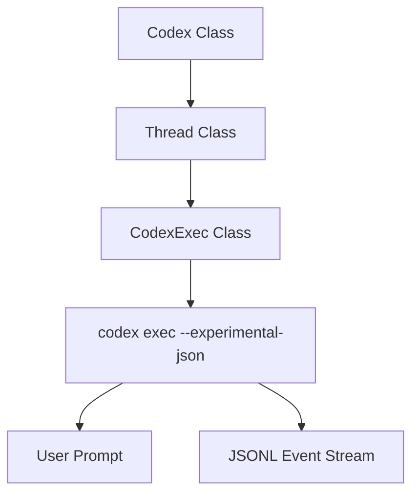

# TypeScript SDK

Relevant source files

-   [.github/workflows/shell-tool-mcp-ci.yml](https://github.com/openai/codex/blob/d807d44a/.github/workflows/shell-tool-mcp-ci.yml)
-   [CHANGELOG.md](https://github.com/openai/codex/blob/d807d44a/CHANGELOG.md?plain=1)
-   [cliff.toml](https://github.com/openai/codex/blob/d807d44a/cliff.toml)
-   [codex-cli/package.json](https://github.com/openai/codex/blob/d807d44a/codex-cli/package.json)
-   [codex-rs/exec/tests/suite/add\_dir.rs](https://github.com/openai/codex/blob/d807d44a/codex-rs/exec/tests/suite/add_dir.rs)
-   [codex-rs/responses-api-proxy/npm/package.json](https://github.com/openai/codex/blob/d807d44a/codex-rs/responses-api-proxy/npm/package.json)
-   [package.json](https://github.com/openai/codex/blob/d807d44a/package.json)
-   [pnpm-lock.yaml](https://github.com/openai/codex/blob/d807d44a/pnpm-lock.yaml)
-   [pnpm-workspace.yaml](https://github.com/openai/codex/blob/d807d44a/pnpm-workspace.yaml)
-   [sdk/typescript/.prettierignore](https://github.com/openai/codex/blob/d807d44a/sdk/typescript/.prettierignore)
-   [sdk/typescript/README.md](https://github.com/openai/codex/blob/d807d44a/sdk/typescript/README.md?plain=1)
-   [sdk/typescript/eslint.config.js](https://github.com/openai/codex/blob/d807d44a/sdk/typescript/eslint.config.js)
-   [sdk/typescript/jest.config.cjs](https://github.com/openai/codex/blob/d807d44a/sdk/typescript/jest.config.cjs)
-   [sdk/typescript/package.json](https://github.com/openai/codex/blob/d807d44a/sdk/typescript/package.json)
-   [sdk/typescript/samples/basic\_streaming.ts](https://github.com/openai/codex/blob/d807d44a/sdk/typescript/samples/basic_streaming.ts)
-   [sdk/typescript/src/codex.ts](https://github.com/openai/codex/blob/d807d44a/sdk/typescript/src/codex.ts)
-   [sdk/typescript/src/codexOptions.ts](https://github.com/openai/codex/blob/d807d44a/sdk/typescript/src/codexOptions.ts)
-   [sdk/typescript/src/events.ts](https://github.com/openai/codex/blob/d807d44a/sdk/typescript/src/events.ts)
-   [sdk/typescript/src/exec.ts](https://github.com/openai/codex/blob/d807d44a/sdk/typescript/src/exec.ts)
-   [sdk/typescript/src/index.ts](https://github.com/openai/codex/blob/d807d44a/sdk/typescript/src/index.ts)
-   [sdk/typescript/src/items.ts](https://github.com/openai/codex/blob/d807d44a/sdk/typescript/src/items.ts)
-   [sdk/typescript/src/thread.ts](https://github.com/openai/codex/blob/d807d44a/sdk/typescript/src/thread.ts)
-   [sdk/typescript/src/threadOptions.ts](https://github.com/openai/codex/blob/d807d44a/sdk/typescript/src/threadOptions.ts)
-   [sdk/typescript/src/turnOptions.ts](https://github.com/openai/codex/blob/d807d44a/sdk/typescript/src/turnOptions.ts)
-   [sdk/typescript/tests/abort.test.ts](https://github.com/openai/codex/blob/d807d44a/sdk/typescript/tests/abort.test.ts)
-   [sdk/typescript/tests/codexExecSpy.ts](https://github.com/openai/codex/blob/d807d44a/sdk/typescript/tests/codexExecSpy.ts)
-   [sdk/typescript/tests/exec.test.ts](https://github.com/openai/codex/blob/d807d44a/sdk/typescript/tests/exec.test.ts)
-   [sdk/typescript/tests/responsesProxy.ts](https://github.com/openai/codex/blob/d807d44a/sdk/typescript/tests/responsesProxy.ts)
-   [sdk/typescript/tests/run.test.ts](https://github.com/openai/codex/blob/d807d44a/sdk/typescript/tests/run.test.ts)
-   [sdk/typescript/tests/runStreamed.test.ts](https://github.com/openai/codex/blob/d807d44a/sdk/typescript/tests/runStreamed.test.ts)
-   [sdk/typescript/tsconfig.json](https://github.com/openai/codex/blob/d807d44a/sdk/typescript/tsconfig.json)
-   [shell-tool-mcp/package.json](https://github.com/openai/codex/blob/d807d44a/shell-tool-mcp/package.json)
-   [shell-tool-mcp/src/index.ts](https://github.com/openai/codex/blob/d807d44a/shell-tool-mcp/src/index.ts)

The `@openai/codex-sdk` package provides a high-level TypeScript interface for embedding the Codex agent into external workflows and applications. It acts as a wrapper around the `codex` CLI, managing the execution of the binary and orchestrating communication via JSONL events over standard I/O [sdk/typescript/README.md1-5](https://github.com/openai/codex/blob/d807d44a/sdk/typescript/README.md?plain=1#L1-L5)

## Overview

The SDK is designed to manage the lifecycle of conversations (Threads) and individual interactions (Turns). It handles binary discovery, environment configuration, and the parsing of structured events into typed TypeScript objects [sdk/typescript/src/thread.ts9-25](https://github.com/openai/codex/blob/d807d44a/sdk/typescript/src/thread.ts#L9-L25)

### Key Components

| Component | Role |
| --- | --- |
| `Codex` | The entry-point class for initializing the SDK and managing sessions [sdk/typescript/src/codex.ts1-30](https://github.com/openai/codex/blob/d807d44a/sdk/typescript/src/codex.ts#L1-L30) |
| `Thread` | Represents a persistent conversation state. Manages turn execution and ID tracking [sdk/typescript/src/thread.ts41-50](https://github.com/openai/codex/blob/d807d44a/sdk/typescript/src/thread.ts#L41-L50) |
| `CodexExec` | The low-level execution engine that spawns the `codex` process and handles JSONL streaming [sdk/typescript/src/exec.ts57-72](https://github.com/openai/codex/blob/d807d44a/sdk/typescript/src/exec.ts#L57-L72) |

## Codex/Thread/Turn API

The SDK follows a hierarchical structure where a `Codex` instance creates or resumes `Thread` instances, which in turn execute `run` or `runStreamed` operations [sdk/typescript/src/thread.ts66-115](https://github.com/openai/codex/blob/d807d44a/sdk/typescript/src/thread.ts#L66-L115)

### System and Code Entity Mapping

The following diagram illustrates how the SDK's high-level classes map to the underlying execution entities.

**SDK to CLI Mapping**

Sources: [sdk/typescript/src/codex.ts18-25](https://github.com/openai/codex/blob/d807d44a/sdk/typescript/src/codex.ts#L18-L25) [sdk/typescript/src/thread.ts77-80](https://github.com/openai/codex/blob/d807d44a/sdk/typescript/src/thread.ts#L77-L80) [sdk/typescript/src/exec.ts72-74](https://github.com/openai/codex/blob/d807d44a/sdk/typescript/src/exec.ts#L72-L74) [sdk/typescript/src/exec.ts164-177](https://github.com/openai/codex/blob/d807d44a/sdk/typescript/src/exec.ts#L164-L177)

### Thread Lifecycle

Threads are identified by a `thread_id` which is returned by the CLI after the first turn starts [sdk/typescript/src/thread.ts48-50](https://github.com/openai/codex/blob/d807d44a/sdk/typescript/src/thread.ts#L48-L50)

-   **Initialization**: `codex.startThread(options)` creates a new thread context [sdk/typescript/src/codex.ts18-20](https://github.com/openai/codex/blob/d807d44a/sdk/typescript/src/codex.ts#L18-L20)
-   **Resumption**: `codex.resumeThread(threadId)` allows continuing a session stored in `~/.codex/sessions` [sdk/typescript/src/codex.ts22-25](https://github.com/openai/codex/blob/d807d44a/sdk/typescript/src/codex.ts#L22-L25)
-   **Execution**: `thread.run(input)` is used for atomic request-response patterns [sdk/typescript/src/thread.ts115-138](https://github.com/openai/codex/blob/d807d44a/sdk/typescript/src/thread.ts#L115-L138)

## Streaming Events

The `runStreamed` method returns an `AsyncGenerator<ThreadEvent>`, allowing real-time observation of the agent's actions [sdk/typescript/src/thread.ts66-68](https://github.com/openai/codex/blob/d807d44a/sdk/typescript/src/thread.ts#L66-L68)

### Event Types

The SDK parses the JSONL stream into several typed events defined in `events.ts`:

-   `thread.started`: Contains the `thread_id` [sdk/typescript/src/thread.ts104-106](https://github.com/openai/codex/blob/d807d44a/sdk/typescript/src/thread.ts#L104-L106)
-   `item.started` / `item.completed`: Marks the lifecycle of a `ThreadItem` (e.g., a tool call or message) [sdk/typescript/src/items.ts1-127](https://github.com/openai/codex/blob/d807d44a/sdk/typescript/src/items.ts#L1-L127)
-   `turn.completed`: Signals the end of the current interaction and includes `Usage` statistics [sdk/typescript/src/thread.ts127-128](https://github.com/openai/codex/blob/d807d44a/sdk/typescript/src/thread.ts#L127-L128)

**Event Data Flow**

> **[Mermaid sequence]**
> *(图表结构无法解析)*

Sources: [sdk/typescript/src/thread.ts70-112](https://github.com/openai/codex/blob/d807d44a/sdk/typescript/src/thread.ts#L70-L112) [sdk/typescript/src/exec.ts204-208](https://github.com/openai/codex/blob/d807d44a/sdk/typescript/src/exec.ts#L204-L208) [sdk/typescript/src/exec.ts164-167](https://github.com/openai/codex/blob/d807d44a/sdk/typescript/src/exec.ts#L164-L167)

## Structured Output

Codex supports generating JSON that adheres to a specific schema. The SDK facilitates this by writing the provided `outputSchema` to a temporary file and passing the path via the `--output-schema` flag [sdk/typescript/src/thread.ts74-87](https://github.com/openai/codex/blob/d807d44a/sdk/typescript/src/thread.ts#L74-L87)

### Implementation

1.  **Schema Input**: The user provides a JSON schema in `TurnOptions` [sdk/typescript/src/turnOptions.ts1-10](https://github.com/openai/codex/blob/d807d44a/sdk/typescript/src/turnOptions.ts#L1-L10)
2.  **File Creation**: `createOutputSchemaFile` generates a temporary `.json` file [sdk/typescript/src/thread.ts74](https://github.com/openai/codex/blob/d807d44a/sdk/typescript/src/thread.ts#L74-L74)
3.  **CLI Invocation**: The `CodexExec` adds `--output-schema <path>` to the command arguments [sdk/typescript/src/exec.ts110-112](https://github.com/openai/codex/blob/d807d44a/sdk/typescript/src/exec.ts#L110-L112)
4.  **Parsing**: The final `agent_message` item contains the JSON string in its `text` field [sdk/typescript/src/items.ts73-79](https://github.com/openai/codex/blob/d807d44a/sdk/typescript/src/items.ts#L73-L79)

## Session Resumption

Session persistence is handled by the underlying CLI. The SDK exposes this via the `resumeThread` method and the `threadId` argument in `CodexExecArgs` [sdk/typescript/src/exec.ts14-15](https://github.com/openai/codex/blob/d807d44a/sdk/typescript/src/exec.ts#L14-L15)

### Implementation Detail

When `thread.run()` is called on a resumed thread, the SDK includes the `threadId` in the CLI command: `codex exec --experimental-json resume <threadId>` [sdk/typescript/src/exec.ts137-139](https://github.com/openai/codex/blob/d807d44a/sdk/typescript/src/exec.ts#L137-L139)

This causes the agent to load the historical context of that specific session before processing the new input.

## Configuration and Environment

The SDK allows fine-grained control over the execution environment:

-   **Base URL & API Key**: Passed via `--config openai_base_url` and `CODEX_API_KEY` environment variable respectively [sdk/typescript/src/exec.ts81-86](https://github.com/openai/codex/blob/d807d44a/sdk/typescript/src/exec.ts#L81-L86) [sdk/typescript/src/exec.ts160-162](https://github.com/openai/codex/blob/d807d44a/sdk/typescript/src/exec.ts#L160-L162)
-   **Sandbox Modes**: Supports `read-only`, `workspace-write`, and `danger-full-access` via the `--sandbox` flag [sdk/typescript/src/exec.ts92-94](https://github.com/openai/codex/blob/d807d44a/sdk/typescript/src/exec.ts#L92-L94)
-   **Config Overrides**: Arbitrary configuration objects are flattened into dotted paths (e.g., `{ a: { b: true } }` becomes `a.b=true`) and passed via repeated `--config` flags [sdk/typescript/src/exec.ts229-233](https://github.com/openai/codex/blob/d807d44a/sdk/typescript/src/exec.ts#L229-L233)

Sources:

-   [sdk/typescript/src/exec.ts9-40](https://github.com/openai/codex/blob/d807d44a/sdk/typescript/src/exec.ts#L9-L40) (CodexExecArgs definition)
-   [sdk/typescript/src/thread.ts41-139](https://github.com/openai/codex/blob/d807d44a/sdk/typescript/src/thread.ts#L41-L139) (Thread implementation)
-   [sdk/typescript/src/codex.ts1-30](https://github.com/openai/codex/blob/d807d44a/sdk/typescript/src/codex.ts#L1-L30) (Codex entry point)
-   [sdk/typescript/src/items.ts1-127](https://github.com/openai/codex/blob/d807d44a/sdk/typescript/src/items.ts#L1-L127) (Thread item types)
-   [sdk/typescript/README.md1-150](https://github.com/openai/codex/blob/d807d44a/sdk/typescript/README.md?plain=1#L1-L150) (Usage and patterns)
