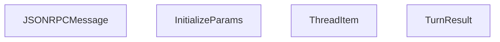

# Python SDK

Relevant source files

-   [codex-rs/app-server-protocol/src/export.rs](https://github.com/openai/codex/blob/d807d44a/codex-rs/app-server-protocol/src/export.rs)
-   [codex-rs/app-server-protocol/src/lib.rs](https://github.com/openai/codex/blob/d807d44a/codex-rs/app-server-protocol/src/lib.rs)
-   [codex-rs/app-server-protocol/src/protocol/v1.rs](https://github.com/openai/codex/blob/d807d44a/codex-rs/app-server-protocol/src/protocol/v1.rs)
-   [codex-rs/app-server/tests/suite/v2/initialize.rs](https://github.com/openai/codex/blob/d807d44a/codex-rs/app-server/tests/suite/v2/initialize.rs)
-   [codex-rs/exec/tests/suite/add\_dir.rs](https://github.com/openai/codex/blob/d807d44a/codex-rs/exec/tests/suite/add_dir.rs)
-   [codex-rs/protocol/src/account.rs](https://github.com/openai/codex/blob/d807d44a/codex-rs/protocol/src/account.rs)
-   [pnpm-lock.yaml](https://github.com/openai/codex/blob/d807d44a/pnpm-lock.yaml)
-   [sdk/typescript/README.md](https://github.com/openai/codex/blob/d807d44a/sdk/typescript/README.md?plain=1)
-   [sdk/typescript/eslint.config.js](https://github.com/openai/codex/blob/d807d44a/sdk/typescript/eslint.config.js)
-   [sdk/typescript/jest.config.cjs](https://github.com/openai/codex/blob/d807d44a/sdk/typescript/jest.config.cjs)
-   [sdk/typescript/package.json](https://github.com/openai/codex/blob/d807d44a/sdk/typescript/package.json)
-   [sdk/typescript/samples/basic\_streaming.ts](https://github.com/openai/codex/blob/d807d44a/sdk/typescript/samples/basic_streaming.ts)
-   [sdk/typescript/src/codex.ts](https://github.com/openai/codex/blob/d807d44a/sdk/typescript/src/codex.ts)
-   [sdk/typescript/src/codexOptions.ts](https://github.com/openai/codex/blob/d807d44a/sdk/typescript/src/codexOptions.ts)
-   [sdk/typescript/src/events.ts](https://github.com/openai/codex/blob/d807d44a/sdk/typescript/src/events.ts)
-   [sdk/typescript/src/exec.ts](https://github.com/openai/codex/blob/d807d44a/sdk/typescript/src/exec.ts)
-   [sdk/typescript/src/index.ts](https://github.com/openai/codex/blob/d807d44a/sdk/typescript/src/index.ts)
-   [sdk/typescript/src/items.ts](https://github.com/openai/codex/blob/d807d44a/sdk/typescript/src/items.ts)
-   [sdk/typescript/src/thread.ts](https://github.com/openai/codex/blob/d807d44a/sdk/typescript/src/thread.ts)
-   [sdk/typescript/src/threadOptions.ts](https://github.com/openai/codex/blob/d807d44a/sdk/typescript/src/threadOptions.ts)
-   [sdk/typescript/src/turnOptions.ts](https://github.com/openai/codex/blob/d807d44a/sdk/typescript/src/turnOptions.ts)
-   [sdk/typescript/tests/abort.test.ts](https://github.com/openai/codex/blob/d807d44a/sdk/typescript/tests/abort.test.ts)
-   [sdk/typescript/tests/codexExecSpy.ts](https://github.com/openai/codex/blob/d807d44a/sdk/typescript/tests/codexExecSpy.ts)
-   [sdk/typescript/tests/exec.test.ts](https://github.com/openai/codex/blob/d807d44a/sdk/typescript/tests/exec.test.ts)
-   [sdk/typescript/tests/responsesProxy.ts](https://github.com/openai/codex/blob/d807d44a/sdk/typescript/tests/responsesProxy.ts)
-   [sdk/typescript/tests/run.test.ts](https://github.com/openai/codex/blob/d807d44a/sdk/typescript/tests/run.test.ts)
-   [sdk/typescript/tests/runStreamed.test.ts](https://github.com/openai/codex/blob/d807d44a/sdk/typescript/tests/runStreamed.test.ts)
-   [sdk/typescript/tsconfig.json](https://github.com/openai/codex/blob/d807d44a/sdk/typescript/tsconfig.json)

The Python SDK (`codex-app-server-sdk`) provides a high-level interface for embedding the Codex agent into Python applications. It acts as a wrapper around the Codex CLI and the App Server JSON-RPC protocol, facilitating thread management, turn execution, and structured data exchange.

## Overview

The SDK allows developers to interact with Codex using either synchronous or asynchronous clients. It manages the lifecycle of the underlying `codex` process, handles JSON-RPC communication, and provides Pydantic models for type-safe interaction with the protocol's wire format.

### Key Components

-   **Codex Client**: The primary entry point for starting or resuming conversations.
-   **Thread**: Represents a persistent conversation session.
-   **Turn**: Represents a single exchange (input and response) within a thread.
-   **Pydantic Models**: Mirror the Rust-defined protocol for validation and IDE autocompletion.

---

## Architecture and Data Flow

The Python SDK communicates with the Codex core through the `app-server` protocol. It typically spawns a Codex process in the background and uses standard I/O (stdin/stdout) to exchange JSON-RPC messages.

### Process Lifecycle and Communication

The SDK abstracts the complexity of process management and protocol negotiation.

| Component | Responsibility |
| --- | --- |
| `Codex` Class | Manages process spawning and global configuration. |
| `Thread` Class | Tracks `thread_id` and manages turn-based state. |
| `CodexExec` | Low-level utility that handles `spawn` and environment variables. |

### SDK-to-Core Interaction Diagram

This diagram illustrates how the Python SDK entities map to the underlying system processes and protocol structures.

**SDK to Code Entity Mapping**

> **[Mermaid sequence]**
> *(图表结构无法解析)*

**Sources:** [sdk/typescript/src/exec.ts72-178](https://github.com/openai/codex/blob/d807d44a/sdk/typescript/src/exec.ts#L72-L178) [sdk/typescript/src/thread.ts70-112](https://github.com/openai/codex/blob/d807d44a/sdk/typescript/src/thread.ts#L70-L112) [codex-rs/app-server-protocol/src/protocol/v1.rs28-65](https://github.com/openai/codex/blob/d807d44a/codex-rs/app-server-protocol/src/protocol/v1.rs#L28-L65)

---

## Client and Thread Management

The SDK supports two main modes of execution: **Direct Exec** (spawning the CLI for short-lived tasks) and **App Server** (connecting to a persistent JSON-RPC server).

### Thread Lifecycle

A `Thread` is initialized either by starting a fresh session or resuming an existing one via a `thread_id`.

-   **Start**: `codex.start_thread()` generates a new session in `~/.codex/sessions`.
-   **Resume**: `codex.resume_thread(thread_id)` reloads history from the rollout file [sdk/typescript/src/thread.ts160-161](https://github.com/openai/codex/blob/d807d44a/sdk/typescript/src/thread.ts#L160-L161)
-   **Execution**: The `run()` method is a blocking call that returns a completed `Turn`, while `run_streamed()` returns an async generator [sdk/typescript/src/thread.ts66-138](https://github.com/openai/codex/blob/d807d44a/sdk/typescript/src/thread.ts#L66-L138)

### Configuration and Environment

The SDK allows overriding core behavior via environment variables and CLI flags passed through the `CodexExec` wrapper.

| Parameter | Code Entity / Flag | Description |
| --- | --- | --- |
| API Key | `CODEX_API_KEY` | Authentication for OpenAI/Remote models. |
| Base URL | `--config openai_base_url` | Redirects API calls to custom endpoints. |
| Sandbox | `--sandbox` | Sets policy (e.g., `workspace-write`). |
| Originator | `CODEX_INTERNAL_ORIGINATOR_OVERRIDE` | Identifies the client (e.g., `codex_sdk_py`). |

**Sources:** [sdk/typescript/src/exec.ts42-53](https://github.com/openai/codex/blob/d807d44a/sdk/typescript/src/exec.ts#L42-L53) [sdk/typescript/src/exec.ts81-95](https://github.com/openai/codex/blob/d807d44a/sdk/typescript/src/exec.ts#L81-L95) [codex-rs/app-server/tests/suite/v2/initialize.rs62-74](https://github.com/openai/codex/blob/d807d44a/codex-rs/app-server/tests/suite/v2/initialize.rs#L62-L74)

---

## Protocol and Wire Models

The SDK relies on Pydantic models that are kept in sync with the Rust `app-server-protocol` crate. These models define the structure of every message sent over the wire.

### JSON-RPC Message Structure

All communication follows the JSON-RPC 2.0 specification, wrapped in a `JSONRPCMessage` enum-like structure.

**Protocol Entity Mapping**

**Sources:** [codex-rs/app-server-protocol/src/protocol/v1.rs26-53](https://github.com/openai/codex/blob/d807d44a/codex-rs/app-server-protocol/src/protocol/v1.rs#L26-L53) [sdk/typescript/src/items.ts118-128](https://github.com/openai/codex/blob/d807d44a/sdk/typescript/src/items.ts#L118-L128) [codex-rs/app-server-protocol/src/lib.rs15-40](https://github.com/openai/codex/blob/d807d44a/codex-rs/app-server-protocol/src/lib.rs#L15-L40)

### Pydantic Model Categories

1.  **Initialization**: `InitializeParams` and `InitializeResponse` for the handshake [codex-rs/app-server-protocol/src/protocol/v1.rs26-65](https://github.com/openai/codex/blob/d807d44a/codex-rs/app-server-protocol/src/protocol/v1.rs#L26-L65)
2.  **Thread Events**: Models like `ItemStartedEvent`, `TurnCompletedEvent`, and `ThreadError` [sdk/typescript/src/events.ts1-13](https://github.com/openai/codex/blob/d807d44a/sdk/typescript/src/events.ts#L1-L13)
3.  **Thread Items**: Representing the content of a conversation, such as `AgentMessageItem`, `CommandExecutionItem`, and `McpToolCallItem` [sdk/typescript/src/items.ts5-116](https://github.com/openai/codex/blob/d807d44a/sdk/typescript/src/items.ts#L5-L116)

---

## Advanced Features

### Structured Output

The SDK supports forcing the agent to return JSON matching a specific schema. This is handled by passing a `JSON Schema` to the `output_schema` parameter in `TurnOptions`.

-   **Implementation**: The SDK writes the schema to a temporary file and passes `--output-schema <path>` to the Codex process [sdk/typescript/src/thread.ts74-87](https://github.com/openai/codex/blob/d807d44a/sdk/typescript/src/thread.ts#L74-L87)
-   **Validation**: Responses are returned as part of an `AgentMessageItem` with the `text` field containing the JSON string [sdk/typescript/src/items.ts73-79](https://github.com/openai/codex/blob/d807d44a/sdk/typescript/src/items.ts#L73-L79)

### Tool and MCP Integration

When Codex invokes tools (shell, patches, or MCP), the SDK surfaces these as specific `ThreadItem` types:

-   **CommandExecutionItem**: Captures command, status, and `aggregated_output` [sdk/typescript/src/items.ts9-20](https://github.com/openai/codex/blob/d807d44a/sdk/typescript/src/items.ts#L9-L20)
-   **McpToolCallItem**: Captures the server name, tool name, and arguments [sdk/typescript/src/items.ts51-71](https://github.com/openai/codex/blob/d807d44a/sdk/typescript/src/items.ts#L51-L71)

**Sources:** [sdk/typescript/src/items.ts1-128](https://github.com/openai/codex/blob/d807d44a/sdk/typescript/src/items.ts#L1-L128) [sdk/typescript/README.md53-84](https://github.com/openai/codex/blob/d807d44a/sdk/typescript/README.md?plain=1#L53-L84)
