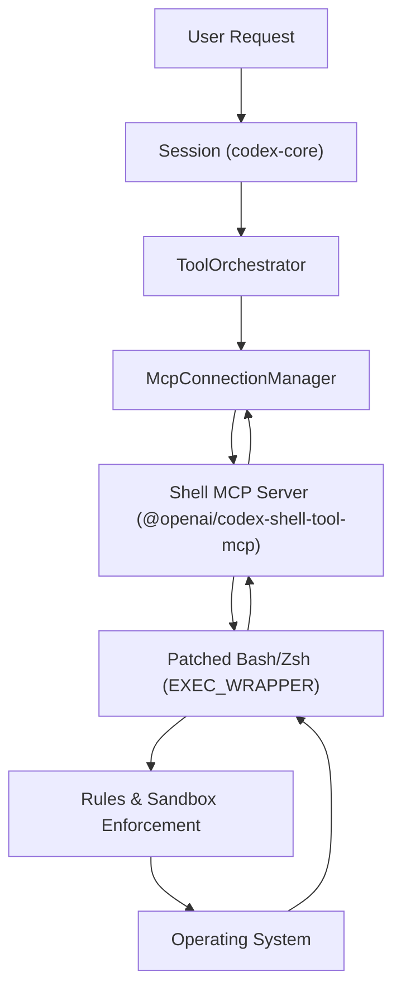

# Shell Tool MCP Package

Relevant source files

-   [.github/actions/windows-code-sign/action.yml](https://github.com/openai/codex/blob/d807d44a/.github/actions/windows-code-sign/action.yml)
-   [.github/scripts/install-musl-build-tools.sh](https://github.com/openai/codex/blob/d807d44a/.github/scripts/install-musl-build-tools.sh)
-   [.github/workflows/ci.yml](https://github.com/openai/codex/blob/d807d44a/.github/workflows/ci.yml)
-   [.github/workflows/rust-ci.yml](https://github.com/openai/codex/blob/d807d44a/.github/workflows/rust-ci.yml)
-   [.github/workflows/rust-release-windows.yml](https://github.com/openai/codex/blob/d807d44a/.github/workflows/rust-release-windows.yml)
-   [.github/workflows/rust-release.yml](https://github.com/openai/codex/blob/d807d44a/.github/workflows/rust-release.yml)
-   [.github/workflows/sdk.yml](https://github.com/openai/codex/blob/d807d44a/.github/workflows/sdk.yml)
-   [.github/workflows/shell-tool-mcp.yml](https://github.com/openai/codex/blob/d807d44a/.github/workflows/shell-tool-mcp.yml)
-   [.github/workflows/zstd](https://github.com/openai/codex/blob/d807d44a/.github/workflows/zstd)
-   [codex-rs/.cargo/config.toml](https://github.com/openai/codex/blob/d807d44a/codex-rs/.cargo/config.toml)
-   [codex-rs/app-server/tests/suite/v2/mcp\_server\_elicitation.rs](https://github.com/openai/codex/blob/d807d44a/codex-rs/app-server/tests/suite/v2/mcp_server_elicitation.rs)
-   [codex-rs/cli/src/mcp\_cmd.rs](https://github.com/openai/codex/blob/d807d44a/codex-rs/cli/src/mcp_cmd.rs)
-   [codex-rs/cli/tests/mcp\_add\_remove.rs](https://github.com/openai/codex/blob/d807d44a/codex-rs/cli/tests/mcp_add_remove.rs)
-   [codex-rs/cli/tests/mcp\_list.rs](https://github.com/openai/codex/blob/d807d44a/codex-rs/cli/tests/mcp_list.rs)
-   [codex-rs/core/src/mcp\_connection\_manager.rs](https://github.com/openai/codex/blob/d807d44a/codex-rs/core/src/mcp_connection_manager.rs)
-   [codex-rs/core/src/mcp\_connection\_manager\_tests.rs](https://github.com/openai/codex/blob/d807d44a/codex-rs/core/src/mcp_connection_manager_tests.rs)
-   [codex-rs/core/src/state/session.rs](https://github.com/openai/codex/blob/d807d44a/codex-rs/core/src/state/session.rs)
-   [codex-rs/core/src/state/turn.rs](https://github.com/openai/codex/blob/d807d44a/codex-rs/core/src/state/turn.rs)
-   [codex-rs/core/src/tasks/mod.rs](https://github.com/openai/codex/blob/d807d44a/codex-rs/core/src/tasks/mod.rs)
-   [codex-rs/core/src/tools/handlers/tool\_search\_tests.rs](https://github.com/openai/codex/blob/d807d44a/codex-rs/core/src/tools/handlers/tool_search_tests.rs)
-   [codex-rs/core/tests/suite/rmcp\_client.rs](https://github.com/openai/codex/blob/d807d44a/codex-rs/core/tests/suite/rmcp_client.rs)
-   [codex-rs/core/tests/suite/truncation.rs](https://github.com/openai/codex/blob/d807d44a/codex-rs/core/tests/suite/truncation.rs)
-   [codex-rs/core/tests/suite/user\_shell\_cmd.rs](https://github.com/openai/codex/blob/d807d44a/codex-rs/core/tests/suite/user_shell_cmd.rs)
-   [codex-rs/rmcp-client/src/rmcp\_client.rs](https://github.com/openai/codex/blob/d807d44a/codex-rs/rmcp-client/src/rmcp_client.rs)
-   [codex-rs/rmcp-client/tests/streamable\_http\_recovery.rs](https://github.com/openai/codex/blob/d807d44a/codex-rs/rmcp-client/tests/streamable_http_recovery.rs)
-   [codex-rs/rust-toolchain.toml](https://github.com/openai/codex/blob/d807d44a/codex-rs/rust-toolchain.toml)
-   [codex-rs/scripts/setup-windows.ps1](https://github.com/openai/codex/blob/d807d44a/codex-rs/scripts/setup-windows.ps1)
-   [codex-rs/shell-escalation/README.md](https://github.com/openai/codex/blob/d807d44a/codex-rs/shell-escalation/README.md?plain=1)

The `@openai/codex-shell-tool-mcp` package is a specialized Model Context Protocol (MCP) server designed to provide high-fidelity terminal access to Codex. Unlike standard shell execution tools, this package uses patched versions of common shells (Bash and Zsh) to provide deep integration with the Codex sandbox and security policy engine.

## Overview and Purpose

The primary goal of the Shell Tool MCP package is to enable an AI agent to interact with a local or remote terminal while maintaining strict safety boundaries and state awareness. It implements several advanced features:

-   **Patched Binaries**: Custom-compiled Bash and Zsh binaries that support an `EXEC_WRAPPER` for command interception [\`.github/workflows/shell-tool-mcp.yml152-155](https://github.com/openai/codex/blob/d807d44a/`.github/workflows/shell-tool-mcp.yml#L152-L155)
-   **Sandbox Synchronization**: Capability to receive and enforce sandbox state updates via the MCP protocol [\`codex-rs/core/src/mcp\_connection\_manager.rs43-44](https://github.com/openai/codex/blob/d807d44a/`codex-rs/core/src/mcp_connection_manager.rs#L43-L44)
-   **Rules Enforcement**: Application of `.rules` files to constrain shell behavior based on workspace context.

## Patched Shell Implementation

The package distributes binaries for 11 different OS/architecture variants, including various Linux distributions (Ubuntu, Debian, CentOS) and macOS versions [\`.github/workflows/shell-tool-mcp.yml83-127](https://github.com/openai/codex/blob/d807d44a/`.github/workflows/shell-tool-mcp.yml#L83-L127)

### EXEC\_WRAPPER Patch

The core of the shell integration is a patch applied to the shell source code (e.g., `bash-exec-wrapper.patch`). This patch modifies the shell's execution logic to route all command executions through a wrapper. This allows the MCP server to:

1.  **Intercept Commands**: Validate commands against the current `SandboxPolicy` [\`codex-rs/core/src/mcp\_connection\_manager.rs43](https://github.com/openai/codex/blob/d807d44a/`codex-rs/core/src/mcp_connection_manager.rs#L43-L43)
2.  **Inject Context**: Automatically prepend environment variables or aliases required by the Codex session.
3.  **Monitor State**: Track changes to the working directory or environment variables in real-time.

### Build and Distribution

The build system automates the compilation of these patched shells across a matrix of environments to ensure compatibility with the user's host system [\`.github/workflows/shell-tool-mcp.yml73-81](https://github.com/openai/codex/blob/d807d44a/`.github/workflows/shell-tool-mcp.yml#L73-L81)

| Component | Source | Version/Commit |
| --- | --- | --- |
| **Bash** | `savannah.gnu.org/git/bash` | `a8a1c2fac029...` [\`.github/workflows/shell-tool-mcp.yml154](https://github.com/openai/codex/blob/d807d44a/`.github/workflows/shell-tool-mcp.yml#L154-L154) |
| **Patch** | `shell-tool-mcp/patches/` | `bash-exec-wrapper.patch` [\`.github/workflows/shell-tool-mcp.yml155](https://github.com/openai/codex/blob/d807d44a/`.github/workflows/shell-tool-mcp.yml#L155-L155) |

**Sources:** [\`.github/workflows/shell-tool-mcp.yml73-205](https://github.com/openai/codex/blob/d807d44a/`.github/workflows/shell-tool-mcp.yml#L73-L205)

## MCP Integration and Data Flow

The package operates as an MCP server, communicating with the `codex-core` through the `McpConnectionManager`.

### Connection Lifecycle

1.  **Initialization**: The `McpConnectionManager` spawns the MCP server using the configured transport (usually `stdio`) [\`codex-rs/core/src/mcp\_connection\_manager.rs3-7](https://github.com/openai/codex/blob/d807d44a/`codex-rs/core/src/mcp_connection_manager.rs#L3-L7)
2.  **Tool Discovery**: The server exposes tools like `run_terminal_command` to the agent [\`codex-rs/core/src/mcp\_connection\_manager.rs155-160](https://github.com/openai/codex/blob/d807d44a/`codex-rs/core/src/mcp_connection_manager.rs#L155-L160)
3.  **Sandbox Sync**: The core sends `codex/sandbox-state/update` notifications to the MCP server to propagate the current `SandboxPolicy` [\`codex-rs/core/src/mcp\_connection\_manager.rs43](https://github.com/openai/codex/blob/d807d44a/`codex-rs/core/src/mcp_connection_manager.rs#L43-L43)

### Data Flow Diagram: Shell Execution

This diagram shows how a natural language request for a shell command flows through the system into the patched binary.


**Sources:** [\`codex-rs/core/src/mcp\_connection\_manager.rs1-46](https://github.com/openai/codex/blob/d807d44a/`codex-rs/core/src/mcp_connection_manager.rs#L1-L46) [\`codex-rs/core/src/tasks/mod.rs148-158](https://github.com/openai/codex/blob/d807d44a/`codex-rs/core/src/tasks/mod.rs#L148-L158)

## Sandbox State and Permissions

The Shell Tool MCP package is "sandbox-aware." It consumes `SandboxPolicy` definitions from the core to determine what operations are permissible.

### Policy Enforcement Levels

The package respects the three primary sandbox modes defined in the protocol:

1.  **ReadOnly**: The shell is restricted from modifying the filesystem [\`codex-rs/core/tests/suite/rmcp\_client.rs132](https://github.com/openai/codex/blob/d807d44a/`codex-rs/core/tests/suite/rmcp_client.rs#L132-L132)
2.  **WorkspaceWrite**: The shell can only modify files within the detected workspace.
3.  **DangerFullAccess**: The shell has standard user permissions [\`codex-rs/core/tests/suite/truncation.rs77](https://github.com/openai/codex/blob/d807d44a/`codex-rs/core/tests/suite/truncation.rs#L77-L77)

### Permission Synchronization

When a user grants a permission (e.g., through the `request_permissions` tool), the `SessionState` updates the `granted_permissions` [\`codex-rs/core/src/state/session.rs35-36](https://github.com/openai/codex/blob/d807d44a/`codex-rs/core/src/state/session.rs#L35-L36) These are then synchronized to the MCP server to dynamically relax shell restrictions without restarting the session.

**Sources:** [\`codex-rs/core/src/state/session.rs35-53](https://github.com/openai/codex/blob/d807d44a/`codex-rs/core/src/state/session.rs#L35-L53) [\`codex-rs/core/src/mcp\_connection\_manager.rs43-44](https://github.com/openai/codex/blob/d807d44a/`codex-rs/core/src/mcp_connection_manager.rs#L43-L44)

## Tool Output and Truncation

Shell commands often produce large volumes of text. The MCP package works with the core's truncation logic to ensure the model context is not overwhelmed.

### Truncation Logic

When shell output exceeds the configured `tool_output_token_limit`, the system truncates the text and appends a summary (e.g., "X chars truncated") [\`codex-rs/core/tests/suite/truncation.rs168-170](https://github.com/openai/codex/blob/d807d44a/`codex-rs/core/tests/suite/truncation.rs#L168-L170) The `McpConnectionManager` handles the aggregation of these results before they are recorded in the `ContextManager` [\`codex-rs/core/src/mcp\_connection\_manager.rs5-7](https://github.com/openai/codex/blob/d807d44a/`codex-rs/core/src/mcp_connection_manager.rs#L5-L7)

| Feature | Behavior |
| --- | --- |
| **Max Output** | Configurable via `tool_output_token_limit` [\`codex-rs/core/tests/suite/truncation.rs41](https://github.com/openai/codex/blob/d807d44a/`codex-rs/core/tests/suite/truncation.rs#L41-L41) |
| **Exit Codes** | Captured and returned in `CallToolResult` [\`codex-rs/core/tests/suite/truncation.rs168](https://github.com/openai/codex/blob/d807d44a/`codex-rs/core/tests/suite/truncation.rs#L168-L168) |
| **Wall Time** | Execution duration is tracked and reported [\`codex-rs/core/tests/suite/truncation.rs168](https://github.com/openai/codex/blob/d807d44a/`codex-rs/core/tests/suite/truncation.rs#L168-L168) |

**Sources:** [\`codex-rs/core/tests/suite/truncation.rs34-179](https://github.com/openai/codex/blob/d807d44a/`codex-rs/core/tests/suite/truncation.rs#L34-L179) [\`codex-rs/core/src/mcp\_connection\_manager.rs98-100](https://github.com/openai/codex/blob/d807d44a/`codex-rs/core/src/mcp_connection_manager.rs#L98-L100)

## Configuration

MCP servers are configured in the `config.toml` file. The Shell Tool MCP can be added via the CLI or manual editing.

### Example Configuration

```
[mcp_servers.shell]enabled = truecommand = "npx"args = ["-y", "@openai/codex-shell-tool-mcp"]env = { "DEBUG" = "codex:*" }
```
The `McpCli` provides commands to manage these entries, such as `codex mcp add` [\`codex-rs/cli/src/mcp\_cmd.rs74-81](https://github.com/openai/codex/blob/d807d44a/`codex-rs/cli/src/mcp_cmd.rs#L74-L81)

**Sources:** [\`codex-rs/cli/src/mcp\_cmd.rs37-54](https://github.com/openai/codex/blob/d807d44a/`codex-rs/cli/src/mcp_cmd.rs#L37-L54) [\`codex-rs/core/src/mcp\_connection\_manager.rs81-83](https://github.com/openai/codex/blob/d807d44a/`codex-rs/core/src/mcp_connection_manager.rs#L81-L83)
