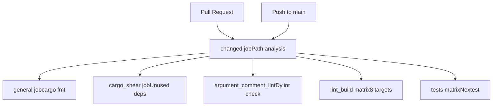
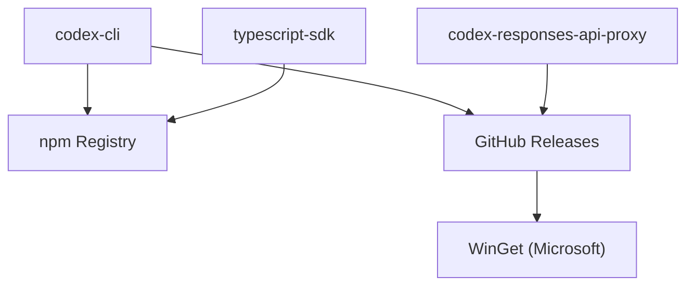

# Build and Distribution

Relevant source files

-   [.github/actions/windows-code-sign/action.yml](https://github.com/openai/codex/blob/d807d44a/.github/actions/windows-code-sign/action.yml)
-   [.github/scripts/install-musl-build-tools.sh](https://github.com/openai/codex/blob/d807d44a/.github/scripts/install-musl-build-tools.sh)
-   [.github/workflows/ci.yml](https://github.com/openai/codex/blob/d807d44a/.github/workflows/ci.yml)
-   [.github/workflows/rust-ci.yml](https://github.com/openai/codex/blob/d807d44a/.github/workflows/rust-ci.yml)
-   [.github/workflows/rust-release-windows.yml](https://github.com/openai/codex/blob/d807d44a/.github/workflows/rust-release-windows.yml)
-   [.github/workflows/rust-release.yml](https://github.com/openai/codex/blob/d807d44a/.github/workflows/rust-release.yml)
-   [.github/workflows/sdk.yml](https://github.com/openai/codex/blob/d807d44a/.github/workflows/sdk.yml)
-   [.github/workflows/shell-tool-mcp.yml](https://github.com/openai/codex/blob/d807d44a/.github/workflows/shell-tool-mcp.yml)
-   [.github/workflows/zstd](https://github.com/openai/codex/blob/d807d44a/.github/workflows/zstd)
-   [codex-rs/.cargo/config.toml](https://github.com/openai/codex/blob/d807d44a/codex-rs/.cargo/config.toml)
-   [codex-rs/Cargo.lock](https://github.com/openai/codex/blob/d807d44a/codex-rs/Cargo.lock)
-   [codex-rs/Cargo.toml](https://github.com/openai/codex/blob/d807d44a/codex-rs/Cargo.toml)
-   [codex-rs/README.md](https://github.com/openai/codex/blob/d807d44a/codex-rs/README.md?plain=1)
-   [codex-rs/cli/Cargo.toml](https://github.com/openai/codex/blob/d807d44a/codex-rs/cli/Cargo.toml)
-   [codex-rs/cli/src/lib.rs](https://github.com/openai/codex/blob/d807d44a/codex-rs/cli/src/lib.rs)
-   [codex-rs/cli/src/main.rs](https://github.com/openai/codex/blob/d807d44a/codex-rs/cli/src/main.rs)
-   [codex-rs/config.md](https://github.com/openai/codex/blob/d807d44a/codex-rs/config.md?plain=1)
-   [codex-rs/core/Cargo.toml](https://github.com/openai/codex/blob/d807d44a/codex-rs/core/Cargo.toml)
-   [codex-rs/core/src/flags.rs](https://github.com/openai/codex/blob/d807d44a/codex-rs/core/src/flags.rs)
-   [codex-rs/core/src/lib.rs](https://github.com/openai/codex/blob/d807d44a/codex-rs/core/src/lib.rs)
-   [codex-rs/core/src/model\_provider\_info.rs](https://github.com/openai/codex/blob/d807d44a/codex-rs/core/src/model_provider_info.rs)
-   [codex-rs/exec/Cargo.toml](https://github.com/openai/codex/blob/d807d44a/codex-rs/exec/Cargo.toml)
-   [codex-rs/exec/src/cli.rs](https://github.com/openai/codex/blob/d807d44a/codex-rs/exec/src/cli.rs)
-   [codex-rs/exec/src/lib.rs](https://github.com/openai/codex/blob/d807d44a/codex-rs/exec/src/lib.rs)
-   [codex-rs/rust-toolchain.toml](https://github.com/openai/codex/blob/d807d44a/codex-rs/rust-toolchain.toml)
-   [codex-rs/scripts/setup-windows.ps1](https://github.com/openai/codex/blob/d807d44a/codex-rs/scripts/setup-windows.ps1)
-   [codex-rs/shell-escalation/README.md](https://github.com/openai/codex/blob/d807d44a/codex-rs/shell-escalation/README.md?plain=1)
-   [codex-rs/tui/Cargo.toml](https://github.com/openai/codex/blob/d807d44a/codex-rs/tui/Cargo.toml)
-   [codex-rs/tui/src/cli.rs](https://github.com/openai/codex/blob/d807d44a/codex-rs/tui/src/cli.rs)
-   [codex-rs/tui/src/lib.rs](https://github.com/openai/codex/blob/d807d44a/codex-rs/tui/src/lib.rs)

This document describes the build system, CI/CD pipelines, and distribution infrastructure for Codex. It covers the Cargo workspace structure, platform build matrix, code signing procedures, artifact packaging, and distribution channels (npm, Homebrew, WinGet, GitHub Releases).

For information about development environment setup and local tooling, see [Development Setup](/openai/codex/9.1-development-setup). For workspace organization and crate relationships, see [Repository Structure](/openai/codex/1.2-repository-structure).

---

## Overview

The Codex build and distribution system supports multiple execution modes and platforms through a layered pipeline:

1.  **CI Pipeline** (`rust-ci.yml`): Runs on every pull request and push to `main`, performing lint/test checks across all supported platforms.
2.  **Release Pipeline** (`rust-release.yml`): Triggered by git tags matching `rust-v*.*.*`, builds release binaries with platform-specific code signing.
3.  **Shell Tool MCP Pipeline** (`shell-tool-mcp.yml`): Builds patched Bash and Zsh shells across 11 OS/distribution variants.
4.  **Distribution Channels**: Publishes to npm (default and alpha tags), Homebrew cask (macOS), WinGet (Windows), and GitHub Releases (all platforms).

**Build Targets**: The release pipeline builds for 8 platform triples:

-   macOS: `aarch64-apple-darwin`, `x86_64-apple-darwin`
-   Linux GNU: `x86_64-unknown-linux-gnu`, `aarch64-unknown-linux-gnu`
-   Linux MUSL: `x86_64-unknown-linux-musl`, `aarch64-unknown-linux-musl`
-   Windows: `x86_64-pc-windows-msvc`, `aarch64-pc-windows-msvc`

**Version Format**: Releases use semantic versioning (`x.y.z` for stable, `x.y.z-alpha.N` for pre-releases). The version format determines distribution behavior: stable releases publish to all channels with the `default` npm tag, alpha releases publish with the `alpha` npm tag and skip WinGet.

**Sources**: [.github/workflows/rust-release.yml1-80](https://github.com/openai/codex/blob/d807d44a/.github/workflows/rust-release.yml#L1-L80) [.github/workflows/rust-ci.yml1-10](https://github.com/openai/codex/blob/d807d44a/.github/workflows/rust-ci.yml#L1-L10)

---

## Cargo Workspace Structure

The Codex project uses a Cargo workspace with multiple crates managed in a single repository. For details, see [Cargo Workspace Structure](/openai/codex/8.1-cargo-workspace-structure).

| Crate | Purpose | Binary Outputs |
| --- | --- | --- |
| `codex-cli` | Main CLI entry point and multitool dispatch | `codex` |
| `codex-tui` | Terminal User Interface implementation | \- |
| `codex-core` | Core agent engine and session logic | `codex-write-config-schema` |
| `codex-exec` | Headless execution mode logic | \- |
| `codex-app-server` | JSON-RPC server for IDE integrations | \- |
| `codex-responses-api-proxy` | Internal API proxy for response streaming | `codex-responses-api-proxy` |

**Toolchain Management**: The workspace pins the Rust toolchain version in `rust-toolchain.toml` to ensure consistent builds across developer machines and CI:

```
[toolchain]channel = "1.93.0"components = ["clippy", "rustfmt", "rust-src"]
```
**Platform-Specific Configuration**: The `.cargo/config.toml` file defines platform-specific linker flags and stack sizes, particularly for Windows targets to handle deep recursion in model-generated code.

**Sources**: [codex-rs/Cargo.toml1-77](https://github.com/openai/codex/blob/d807d44a/codex-rs/Cargo.toml#L1-L77) [codex-rs/rust-toolchain.toml1-4](https://github.com/openai/codex/blob/d807d44a/codex-rs/rust-toolchain.toml#L1-L4) [codex-rs/core/Cargo.toml12-14](https://github.com/openai/codex/blob/d807d44a/codex-rs/core/Cargo.toml#L12-L14)

---

## CI Pipeline

The CI pipeline validates code quality and correctness on every change. For details, see [CI Pipeline](/openai/codex/8.2-ci-pipeline).

### Workflow Triggers and Detection

The `rust-ci.yml` workflow uses a `changed` job to analyze path changes, allowing it to skip expensive build steps if only documentation or unrelated tools were modified. It detects changes in `codex-rs/*`, `.github/*`, and specific linting tools.

### Build and Test Matrix

The CI runs a comprehensive matrix across Linux (GNU/MUSL), macOS, and Windows. It utilizes `cargo nextest` for parallel test execution and `cargo clippy` for linting.

**Sources**: [.github/workflows/rust-ci.yml13-58](https://github.com/openai/codex/blob/d807d44a/.github/workflows/rust-ci.yml#L13-L58) [.github/workflows/rust-ci.yml161-182](https://github.com/openai/codex/blob/d807d44a/.github/workflows/rust-ci.yml#L161-L182)

### CI Workflow Diagram


**Sources**: [.github/workflows/rust-ci.yml1-182](https://github.com/openai/codex/blob/d807d44a/.github/workflows/rust-ci.yml#L1-L182)

---

## Release Pipeline

The release pipeline automates the creation of production-ready artifacts. For details, see [Release Pipeline](/openai/codex/8.3-release-pipeline).

### Tag-Based Workflow

Releases are triggered by pushing a tag (e.g., `rust-v0.1.0`). The `tag-check` job validates that the tag matches the version defined in `codex-rs/Cargo.toml`.

### Code Signing and Notarization

-   **macOS**: Uses Apple Developer ID certificates and `notarytool` to sign binaries and DMG files.
-   **Windows**: Uses Azure Trusted Signing via OIDC for `codex.exe` and helper binaries like `codex-windows-sandbox-setup.exe`.
-   **Linux**: Uses Sigstore/Cosign for detached signature bundles.

**Sources**: [.github/workflows/rust-release.yml19-47](https://github.com/openai/codex/blob/d807d44a/.github/workflows/rust-release.yml#L19-L47) [.github/actions/windows-code-sign/action.yml1-58](https://github.com/openai/codex/blob/d807d44a/.github/actions/windows-code-sign/action.yml#L1-L58)

---

## Distribution Channels

Codex is distributed through multiple channels to support different user workflows. For details, see [Distribution Channels](/openai/codex/8.4-distribution-channels).

-   **npm Registry**: Packages `@openai/codex` and the TypeScript SDK. Uses `optionalDependencies` for platform-specific binary fetching.
-   **GitHub Releases**: The primary source for binaries, signatures, and the `config-schema.json`.
-   **WinGet**: Automatically updated via `winget-releaser` for stable Windows releases.
-   **Homebrew**: Distributed via a cask for macOS users.

### Distribution Mapping


**Sources**: [.github/workflows/rust-release.yml539-668](https://github.com/openai/codex/blob/d807d44a/.github/workflows/rust-release.yml#L539-L668)

---

## Shell Tool MCP Build System

Codex includes a specialized build system for patched versions of Bash and Zsh that support execution wrapping. For details, see [Shell Tool MCP Build System](/openai/codex/8.5-shell-tool-mcp-build-system).

### Patched Shell Compilation

The `shell-tool-mcp.yml` workflow compiles shells across 11 OS variants (Ubuntu, Debian, CentOS, macOS) to ensure binary compatibility with target environments. It applies `bash-exec-wrapper.patch` and `zsh-exec-wrapper.patch` to intercept `execve` calls for sandboxing and escalation.

**Sources**: [.github/workflows/shell-tool-mcp.yml73-127](https://github.com/openai/codex/blob/d807d44a/.github/workflows/shell-tool-mcp.yml#L73-L127) [.github/workflows/shell-tool-mcp.yml148-163](https://github.com/openai/codex/blob/d807d44a/.github/workflows/shell-tool-mcp.yml#L148-L163)
