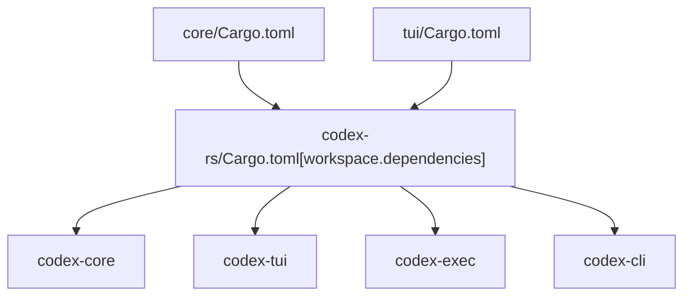
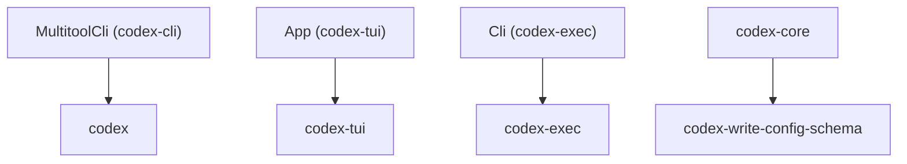

# Cargo Workspace Structure

Relevant source files

-   [.bazelrc](https://github.com/openai/codex/blob/d807d44a/.bazelrc)
-   [.github/workflows/Dockerfile.bazel](https://github.com/openai/codex/blob/d807d44a/.github/workflows/Dockerfile.bazel)
-   [.github/workflows/ci.bazelrc](https://github.com/openai/codex/blob/d807d44a/.github/workflows/ci.bazelrc)
-   [BUILD.bazel](https://github.com/openai/codex/blob/d807d44a/BUILD.bazel)
-   [MODULE.bazel](https://github.com/openai/codex/blob/d807d44a/MODULE.bazel)
-   [MODULE.bazel.lock](https://github.com/openai/codex/blob/d807d44a/MODULE.bazel.lock)
-   [codex-rs/Cargo.lock](https://github.com/openai/codex/blob/d807d44a/codex-rs/Cargo.lock)
-   [codex-rs/Cargo.toml](https://github.com/openai/codex/blob/d807d44a/codex-rs/Cargo.toml)
-   [codex-rs/README.md](https://github.com/openai/codex/blob/d807d44a/codex-rs/README.md?plain=1)
-   [codex-rs/ansi-escape/BUILD.bazel](https://github.com/openai/codex/blob/d807d44a/codex-rs/ansi-escape/BUILD.bazel)
-   [codex-rs/app-server-protocol/BUILD.bazel](https://github.com/openai/codex/blob/d807d44a/codex-rs/app-server-protocol/BUILD.bazel)
-   [codex-rs/app-server/BUILD.bazel](https://github.com/openai/codex/blob/d807d44a/codex-rs/app-server/BUILD.bazel)
-   [codex-rs/cli/Cargo.toml](https://github.com/openai/codex/blob/d807d44a/codex-rs/cli/Cargo.toml)
-   [codex-rs/cli/src/lib.rs](https://github.com/openai/codex/blob/d807d44a/codex-rs/cli/src/lib.rs)
-   [codex-rs/cli/src/main.rs](https://github.com/openai/codex/blob/d807d44a/codex-rs/cli/src/main.rs)
-   [codex-rs/config.md](https://github.com/openai/codex/blob/d807d44a/codex-rs/config.md?plain=1)
-   [codex-rs/core/BUILD.bazel](https://github.com/openai/codex/blob/d807d44a/codex-rs/core/BUILD.bazel)
-   [codex-rs/core/Cargo.toml](https://github.com/openai/codex/blob/d807d44a/codex-rs/core/Cargo.toml)
-   [codex-rs/core/src/flags.rs](https://github.com/openai/codex/blob/d807d44a/codex-rs/core/src/flags.rs)
-   [codex-rs/core/src/lib.rs](https://github.com/openai/codex/blob/d807d44a/codex-rs/core/src/lib.rs)
-   [codex-rs/core/src/model\_provider\_info.rs](https://github.com/openai/codex/blob/d807d44a/codex-rs/core/src/model_provider_info.rs)
-   [codex-rs/deny.toml](https://github.com/openai/codex/blob/d807d44a/codex-rs/deny.toml)
-   [codex-rs/exec/Cargo.toml](https://github.com/openai/codex/blob/d807d44a/codex-rs/exec/Cargo.toml)
-   [codex-rs/exec/src/cli.rs](https://github.com/openai/codex/blob/d807d44a/codex-rs/exec/src/cli.rs)
-   [codex-rs/exec/src/lib.rs](https://github.com/openai/codex/blob/d807d44a/codex-rs/exec/src/lib.rs)
-   [codex-rs/mcp-server/BUILD.bazel](https://github.com/openai/codex/blob/d807d44a/codex-rs/mcp-server/BUILD.bazel)
-   [codex-rs/tui/Cargo.toml](https://github.com/openai/codex/blob/d807d44a/codex-rs/tui/Cargo.toml)
-   [codex-rs/tui/src/cli.rs](https://github.com/openai/codex/blob/d807d44a/codex-rs/tui/src/cli.rs)
-   [codex-rs/tui/src/lib.rs](https://github.com/openai/codex/blob/d807d44a/codex-rs/tui/src/lib.rs)
-   [codex-rs/utils/cargo-bin/BUILD.bazel](https://github.com/openai/codex/blob/d807d44a/codex-rs/utils/cargo-bin/BUILD.bazel)
-   [defs.bzl](https://github.com/openai/codex/blob/d807d44a/defs.bzl)
-   [patches/BUILD.bazel](https://github.com/openai/codex/blob/d807d44a/patches/BUILD.bazel)
-   [patches/v8\_bazel\_rules.patch](https://github.com/openai/codex/blob/d807d44a/patches/v8_bazel_rules.patch)
-   [rbe.bzl](https://github.com/openai/codex/blob/d807d44a/rbe.bzl)
-   [third\_party/v8/BUILD.bazel](https://github.com/openai/codex/blob/d807d44a/third_party/v8/BUILD.bazel)
-   [third\_party/v8/README.md](https://github.com/openai/codex/blob/d807d44a/third_party/v8/README.md?plain=1)

This page covers the layout of the Rust Cargo workspace located at `codex-rs/`, including crate membership, how shared dependencies are declared, build profiles, and workspace-wide lint configuration. For information about the CI pipeline that builds and tests this workspace, see [CI Pipeline](/openai/codex/8.2-ci-pipeline). For the release pipeline that produces binaries, see [Release Pipeline](/openai/codex/8.3-release-pipeline). For an overview of how the individual crates relate to each other at a system level, see [Architecture Overview](/openai/codex/1.3-architecture-overview).

---

## Workspace Root

The workspace is defined in [codex-rs/Cargo.toml1-164](https://github.com/openai/codex/blob/d807d44a/codex-rs/Cargo.toml#L1-L164) It uses Cargo's `resolver = "2"` [codex-rs/Cargo.toml78](https://github.com/openai/codex/blob/d807d44a/codex-rs/Cargo.toml#L78-L78) for feature resolution and sets a single shared `[workspace.package]` block [codex-rs/Cargo.toml80-88](https://github.com/openai/codex/blob/d807d44a/codex-rs/Cargo.toml#L80-L88) that all member crates inherit via `.workspace = true` in their own manifests.

| Field | Value |
| --- | --- |
| `resolver` | `"2"` |
| `version` | `"0.0.0"` (all crates share the same in-development version) |
| `edition` | `"2024"` |
| `license` | `"Apache-2.0"` |

Sources: [codex-rs/Cargo.toml78-88](https://github.com/openai/codex/blob/d807d44a/codex-rs/Cargo.toml#L78-L88)

---

## Crate Membership

The workspace contains 76 member crates declared in [codex-rs/Cargo.toml2-77](https://github.com/openai/codex/blob/d807d44a/codex-rs/Cargo.toml#L2-L77) They are organized into several functional groups.

### Crate Groups

**Core logic and protocol**

| Path in workspace | Crate name | Role |
| --- | --- | --- |
| `core` | `codex-core` | Central business logic library [codex-rs/core/src/lib.rs1-189](https://github.com/openai/codex/blob/d807d44a/codex-rs/core/src/lib.rs#L1-L189) |
| `config` | `codex-config` | Configuration loading and merging |
| `protocol` | `codex-protocol` | Op/Event protocol types |
| `state` | `codex-state` | SQLite-backed session/thread state |

**User interfaces**

| Path in workspace | Crate name | Role |
| --- | --- | --- |
| `tui` | `codex-tui` | Ratatui-based interactive TUI [codex-rs/tui/src/lib.rs1-134](https://github.com/openai/codex/blob/d807d44a/codex-rs/tui/src/lib.rs#L1-L134) |
| `exec` | `codex-exec` | Headless/non-interactive execution [codex-rs/exec/src/lib.rs1-15](https://github.com/openai/codex/blob/d807d44a/codex-rs/exec/src/lib.rs#L1-L15) |
| `cli` | `codex-cli` | Multitool CLI entry point (`codex` binary) [codex-rs/cli/src/main.rs56-86](https://github.com/openai/codex/blob/d807d44a/codex-rs/cli/src/main.rs#L56-L86) |
| `app-server` | `codex-app-server` | App server for IDE integration |
| `app-server-protocol` | `codex-app-server-protocol` | JSON-RPC protocol types for the app server |
| `tui_app_server` | `codex-tui-app-server` | TUI variant backed by app-server protocol |

**Tool execution and sandboxing**

| Path in workspace | Crate name | Role |
| --- | --- | --- |
| `apply-patch` | `codex-apply-patch` | Patch application logic |
| `execpolicy` | `codex-execpolicy` | Exec approval policy evaluation |
| `linux-sandbox` | `codex-linux-sandbox` | Landlock/seccomp sandboxing on Linux |
| `shell-command` | `codex-shell-command` | Shell command construction |
| `shell-escalation` | `codex-shell-escalation` | Shell privilege escalation helpers |

**Utilities (under `utils/`)**

| Path in workspace | Crate name |
| --- | --- |
| `utils/absolute-path` | `codex-utils-absolute-path` |
| `utils/approval-presets` | `codex-utils-approval-presets` |
| `utils/cache` | `codex-utils-cache` |
| `utils/git` | `codex-git` |
| `utils/home-dir` | `codex-utils-home-dir` |
| `utils/pty` | `codex-utils-pty` |
| `utils/oss` | `codex-utils-oss` |

Sources: [codex-rs/Cargo.toml2-77](https://github.com/openai/codex/blob/d807d44a/codex-rs/Cargo.toml#L2-L77) [codex-rs/core/src/lib.rs1-189](https://github.com/openai/codex/blob/d807d44a/codex-rs/core/src/lib.rs#L1-L189) [codex-rs/tui/src/lib.rs1-134](https://github.com/openai/codex/blob/d807d44a/codex-rs/tui/src/lib.rs#L1-L134) [codex-rs/cli/src/main.rs88-153](https://github.com/openai/codex/blob/d807d44a/codex-rs/cli/src/main.rs#L88-L153)

---

## Dependency Graph (Key Crates)

The following diagram shows how the primary user-facing crates depend on the core library and the protocol layer.

**Primary crate dependency graph**

```mermaid
flowchart TD
    MultitoolCli["MultitoolCli (codex-cli)"]
    codex_tui["codex-tui"]
    codex_exec["codex-exec"]
    codex_app_server["codex-app-server"]
    codex_mcp_server["codex-mcp-server"]
    codex_core["codex-core"]
    codex_config["codex-config"]
    codex_protocol["codex-protocol"]
    codex_state["codex-state"]
    codex_api["codex-api"]
    codex_apply_patch["codex-apply-patch"]
    codex_execpolicy["codex-execpolicy"]
    codex_app_server_client["codex-app-server-client"]

    MultitoolCli --> codex_tui
    MultitoolCli --> codex_exec
    MultitoolCli --> codex_app_server
    MultitoolCli --> codex_mcp_server
    codex --> tui_codex_core
    codex --> exec_codex_core
    codex --> core_codex_config
    codex --> core_codex_protocol
    codex --> core_codex_state
    codex --> core_codex_api
    codex --> core_codex_apply_patch
    codex --> core_codex_execpolicy
    codex --> exec_codex_app_server_client
```

Sources: [codex-rs/core/Cargo.toml19-62](https://github.com/openai/codex/blob/d807d44a/codex-rs/core/Cargo.toml#L19-L62) [codex-rs/tui/Cargo.toml27-49](https://github.com/openai/codex/blob/d807d44a/codex-rs/tui/Cargo.toml#L27-L49) [codex-rs/exec/Cargo.toml18-49](https://github.com/openai/codex/blob/d807d44a/codex-rs/exec/Cargo.toml#L18-L49) [codex-rs/cli/src/main.rs88-153](https://github.com/openai/codex/blob/d807d44a/codex-rs/cli/src/main.rs#L88-L153)

---

## Workspace Path Mappings

The `[workspace.dependencies]` table declares canonical path references so that individual crates can use `{ workspace = true }` instead of repeating the path. This is the single source of truth for all internal crate paths.

**Workspace dependency declaration pattern**

In a member crate's `Cargo.toml`, a dependency is declared as: `codex-core = { workspace = true }` [codex-rs/core/Cargo.toml111](https://github.com/openai/codex/blob/d807d44a/codex-rs/core/Cargo.toml#L111-L111)

The actual path is resolved from the workspace root entry: `codex-core = { path = "core" }` [codex-rs/Cargo.toml111](https://github.com/openai/codex/blob/d807d44a/codex-rs/Cargo.toml#L111-L111)

Sources: [codex-rs/Cargo.toml89-164](https://github.com/openai/codex/blob/d807d44a/codex-rs/Cargo.toml#L89-L164) [codex-rs/core/Cargo.toml19-62](https://github.com/openai/codex/blob/d807d44a/codex-rs/core/Cargo.toml#L19-L62)

---

## Shared Tooling and Configuration

### sccache

The project utilizes `sccache` for distributed compilation caching, integrated via the build environment. This is critical for maintaining fast CI build times across the 76 workspace members.

### rust-toolchain.toml

The workspace specifies its Rust version and components (like `clippy` and `rustfmt`) in a `rust-toolchain.toml` file (implied by workspace-wide edition 2024). This ensures all developers and CI runners use the exact same compiler version.

### Model Providers Registry

`codex-core` maintains a registry of model providers, including built-in defaults for `OpenAI`, `LMStudio`, and `Ollama`.

| Provider ID | Name | Default Port |
| --- | --- | --- |
| `openai` | OpenAI | N/A |
| `lmstudio` | LM Studio | 1234 |
| `ollama` | Ollama | 11434 |

Sources: [codex-rs/core/src/model\_provider\_info.rs31-91](https://github.com/openai/codex/blob/d807d44a/codex-rs/core/src/model_provider_info.rs#L31-L91) [codex-rs/core/src/lib.rs83-88](https://github.com/openai/codex/blob/d807d44a/codex-rs/core/src/lib.rs#L83-L88)

---

## Crate-to-Binary Mapping

The `codex` multitool is the primary entry point, but the workspace defines several specialized binaries.

**Crate/binary mapping**

The `MultitoolCli` [codex-rs/cli/src/main.rs71-86](https://github.com/openai/codex/blob/d807d44a/codex-rs/cli/src/main.rs#L71-L86) dispatches to various modes:

-   `Subcommand::Exec` [codex-rs/cli/src/main.rs92](https://github.com/openai/codex/blob/d807d44a/codex-rs/cli/src/main.rs#L92-L92) calls into `codex-exec`.
-   `Subcommand::McpServer` [codex-rs/cli/src/main.rs107](https://github.com/openai/codex/blob/d807d44a/codex-rs/cli/src/main.rs#L107-L107) launches the MCP server.
-   `Subcommand::Resume` [codex-rs/cli/src/main.rs134](https://github.com/openai/codex/blob/d807d44a/codex-rs/cli/src/main.rs#L134-L134) and `Fork` [codex-rs/cli/src/main.rs137](https://github.com/openai/codex/blob/d807d44a/codex-rs/cli/src/main.rs#L137-L137) handle session state.

Sources: [codex-rs/cli/src/main.rs71-153](https://github.com/openai/codex/blob/d807d44a/codex-rs/cli/src/main.rs#L71-L153) [codex-rs/core/Cargo.toml12-14](https://github.com/openai/codex/blob/d807d44a/codex-rs/core/Cargo.toml#L12-L14) [codex-rs/exec/src/cli.rs8-10](https://github.com/openai/codex/blob/d807d44a/codex-rs/exec/src/cli.rs#L8-L10)
