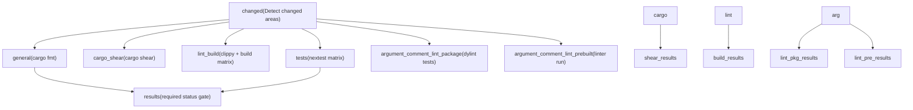
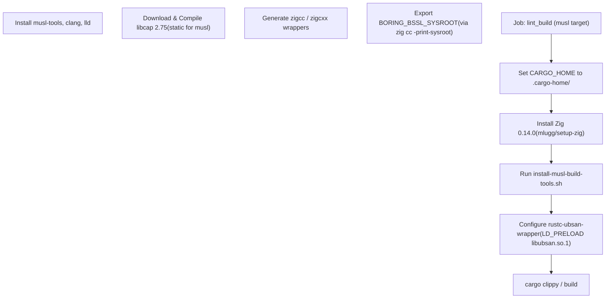

# CI Pipeline

Relevant source files

-   [.github/actions/linux-code-sign/action.yml](https://github.com/openai/codex/blob/d807d44a/.github/actions/linux-code-sign/action.yml)
-   [.github/actions/macos-code-sign/action.yml](https://github.com/openai/codex/blob/d807d44a/.github/actions/macos-code-sign/action.yml)
-   [.github/actions/macos-code-sign/codex.entitlements.plist](https://github.com/openai/codex/blob/d807d44a/.github/actions/macos-code-sign/codex.entitlements.plist)
-   [.github/actions/macos-code-sign/notary\_helpers.sh](https://github.com/openai/codex/blob/d807d44a/.github/actions/macos-code-sign/notary_helpers.sh)
-   [.github/actions/windows-code-sign/action.yml](https://github.com/openai/codex/blob/d807d44a/.github/actions/windows-code-sign/action.yml)
-   [.github/blob-size-allowlist.txt](https://github.com/openai/codex/blob/d807d44a/.github/blob-size-allowlist.txt)
-   [.github/scripts/install-musl-build-tools.sh](https://github.com/openai/codex/blob/d807d44a/.github/scripts/install-musl-build-tools.sh)
-   [.github/workflows/blob-size-policy.yml](https://github.com/openai/codex/blob/d807d44a/.github/workflows/blob-size-policy.yml)
-   [.github/workflows/ci.yml](https://github.com/openai/codex/blob/d807d44a/.github/workflows/ci.yml)
-   [.github/workflows/close-stale-contributor-prs.yml](https://github.com/openai/codex/blob/d807d44a/.github/workflows/close-stale-contributor-prs.yml)
-   [.github/workflows/issue-deduplicator.yml](https://github.com/openai/codex/blob/d807d44a/.github/workflows/issue-deduplicator.yml)
-   [.github/workflows/issue-labeler.yml](https://github.com/openai/codex/blob/d807d44a/.github/workflows/issue-labeler.yml)
-   [.github/workflows/rust-ci.yml](https://github.com/openai/codex/blob/d807d44a/.github/workflows/rust-ci.yml)
-   [.github/workflows/rust-release-prepare.yml](https://github.com/openai/codex/blob/d807d44a/.github/workflows/rust-release-prepare.yml)
-   [.github/workflows/rust-release-windows.yml](https://github.com/openai/codex/blob/d807d44a/.github/workflows/rust-release-windows.yml)
-   [.github/workflows/rust-release.yml](https://github.com/openai/codex/blob/d807d44a/.github/workflows/rust-release.yml)
-   [.github/workflows/sdk.yml](https://github.com/openai/codex/blob/d807d44a/.github/workflows/sdk.yml)
-   [.github/workflows/shell-tool-mcp.yml](https://github.com/openai/codex/blob/d807d44a/.github/workflows/shell-tool-mcp.yml)
-   [.github/workflows/zstd](https://github.com/openai/codex/blob/d807d44a/.github/workflows/zstd)
-   [codex-rs/.cargo/config.toml](https://github.com/openai/codex/blob/d807d44a/codex-rs/.cargo/config.toml)
-   [codex-rs/rust-toolchain.toml](https://github.com/openai/codex/blob/d807d44a/codex-rs/rust-toolchain.toml)
-   [codex-rs/scripts/setup-windows.ps1](https://github.com/openai/codex/blob/d807d44a/codex-rs/scripts/setup-windows.ps1)
-   [codex-rs/shell-escalation/README.md](https://github.com/openai/codex/blob/d807d44a/codex-rs/shell-escalation/README.md?plain=1)
-   [scripts/check\_blob\_size.py](https://github.com/openai/codex/blob/d807d44a/scripts/check_blob_size.py)

This page documents the continuous integration (CI) workflows that gate pull requests and pushes to the `main` branch of the `openai/codex` repository. It covers the Rust-specific `rust-ci` workflow, the Node.js/TypeScript `ci` workflow, the specialized `shell-tool-mcp` build system, and the AI-driven issue management workflows.

---

## Trigger Conditions

| Workflow | File | Triggers |
| --- | --- | --- |
| `rust-ci` | [\`.github/workflows/rust-ci.yml1-8](https://github.com/openai/codex/blob/d807d44a/`.github/workflows/rust-ci.yml#L1-L8) | `pull_request`, `push` to `main`, `workflow_dispatch` |
| `ci` | [\`.github/workflows/ci.yml1-6](https://github.com/openai/codex/blob/d807d44a/`.github/workflows/ci.yml#L1-L6) | `pull_request`, `push` to `main` |
| `shell-tool-mcp` | [\`.github/workflows/shell-tool-mcp.yml1-18](https://github.com/openai/codex/blob/d807d44a/`.github/workflows/shell-tool-mcp.yml#L1-L18) | `workflow_call` (triggered by release or manual runs) |
| `issue-labeler` | [\`.github/workflows/issue-labeler.yml1-8](https://github.com/openai/codex/blob/d807d44a/`.github/workflows/issue-labeler.yml#L1-L8) | `issues` (opened or labeled) |

Sources: [\`.github/workflows/rust-ci.yml1-8](https://github.com/openai/codex/blob/d807d44a/`.github/workflows/rust-ci.yml#L1-L8) [\`.github/workflows/ci.yml1-6](https://github.com/openai/codex/blob/d807d44a/`.github/workflows/ci.yml#L1-L6) [\`.github/workflows/shell-tool-mcp.yml1-18](https://github.com/openai/codex/blob/d807d44a/`.github/workflows/shell-tool-mcp.yml#L1-L18) [\`.github/workflows/issue-labeler.yml1-8](https://github.com/openai/codex/blob/d807d44a/`.github/workflows/issue-labeler.yml#L1-L8)

---

## rust-ci Workflow Overview

The `rust-ci` workflow is organized into jobs with explicit dependency relationships. A single terminal `results` job aggregates all outcomes and serves as the required status check.

### rust-ci job dependency diagram

Sources: [\`.github/workflows/rust-ci.yml12-689](https://github.com/openai/codex/blob/d807d44a/`.github/workflows/rust-ci.yml#L12-L689)

---

## Change Detection (`changed` job)

The `changed` job inspects the diff between the PR base and head to optimize CI resources. It emits boolean outputs used to gate downstream jobs.

| Output | Logic / Path |
| --- | --- |
| `codex` | `codex-rs/*` [\`.github/workflows/rust-ci.yml48](https://github.com/openai/codex/blob/d807d44a/`.github/workflows/rust-ci.yml#L48-L48) |
| `argument_comment_lint` | `codex-rs/*` OR `tools/argument-comment-lint/*` OR `justfile` [\`.github/workflows/rust-ci.yml49](https://github.com/openai/codex/blob/d807d44a/`.github/workflows/rust-ci.yml#L49-L49) |
| `workflows` | `.github/*` [\`.github/workflows/rust-ci.yml51](https://github.com/openai/codex/blob/d807d44a/`.github/workflows/rust-ci.yml#L51-L51) |

On `push` events to `main`, detection is bypassed and all flags are forced to `true` to ensure full validation [\`.github/workflows/rust-ci.yml39-41](https://github.com/openai/codex/blob/d807d44a/`.github/workflows/rust-ci.yml#L39-L41)

Sources: [\`.github/workflows/rust-ci.yml13-58](https://github.com/openai/codex/blob/d807d44a/`.github/workflows/rust-ci.yml#L13-L58)

---

## Lint and Build Matrix (`lint_build`)

The `lint_build` job runs `cargo clippy` across a comprehensive matrix of runners and targets.

| OS | Target | Profiles |
| --- | --- | --- |
| macOS 15 | `aarch64-apple-darwin`, `x86_64-apple-darwin` | `dev`, `release` |
| Ubuntu 24.04 | `x86_64-unknown-linux-musl`, `x86_64-unknown-linux-gnu` | `dev`, `release` |
| Ubuntu 24.04 ARM | `aarch64-unknown-linux-musl`, `aarch64-unknown-linux-gnu` | `dev`, `release` |
| Windows (x64/ARM64) | `x86_64-pc-windows-msvc`, `aarch64-pc-windows-msvc` | `dev`, `release` |

### Specialized Linting: Argument Comment Lint

The pipeline includes a custom linter for verifying argument comments in Rust code.

-   **Package Testing**: The `argument_comment_lint_package` job tests the linter itself using `cargo-dylint` [\`.github/workflows/rust-ci.yml94-124](https://github.com/openai/codex/blob/d807d44a/`.github/workflows/rust-ci.yml#L94-L124)
-   **Prebuilt Execution**: The `argument_comment_lint_prebuilt` job runs a pre-compiled version of the linter across Linux, macOS, and Windows via `dotslash` [\`.github/workflows/rust-ci.yml125-159](https://github.com/openai/codex/blob/d807d44a/`.github/workflows/rust-ci.yml#L125-L159)

Sources: [\`.github/workflows/rust-ci.yml161-451](https://github.com/openai/codex/blob/d807d44a/`.github/workflows/rust-ci.yml#L161-L451) [\`.github/workflows/rust-ci.yml94-159](https://github.com/openai/codex/blob/d807d44a/`.github/workflows/rust-ci.yml#L94-L159)

---

## MUSL Cross-Compilation Setup

Compiling for MUSL targets (to produce static binaries) requires a complex hermetic environment orchestrated by [\`.github/scripts/install-musl-build-tools.sh\`](https://github.com/openai/codex/blob/d807d44a/`.github/scripts/install-musl-build-tools.sh`)

### MUSL Toolchain Initialization

Key implementations in the script:

-   **Zig Wrappers**: The script creates `zigcc` and `zigcxx` scripts that wrap `zig cc -target <arch>-linux-musl` while stripping incompatible Rust-generated flags like `--target` [\`.github/scripts/install-musl-build-tools.sh98-212](https://github.com/openai/codex/blob/d807d44a/`.github/scripts/install-musl-build-tools.sh#L98-L212)
-   **BoringSSL Integration**: It detects the Zig sysroot to set `BORING_BSSL_SYSROOT`, ensuring `aws-lc-sys` (used by `ring`) compiles correctly for MUSL [\`.github/scripts/install-musl-build-tools.sh227-232](https://github.com/openai/codex/blob/d807d44a/`.github/scripts/install-musl-build-tools.sh#L227-L232)
-   **Static libcap**: Since `libcap` is a system dependency for the sandbox, the script compiles it statically using the `musl-gcc` linker [\`.github/scripts/install-musl-build-tools.sh60-90](https://github.com/openai/codex/blob/d807d44a/`.github/scripts/install-musl-build-tools.sh#L60-L90)

Sources: [\`.github/scripts/install-musl-build-tools.sh1-280](https://github.com/openai/codex/blob/d807d44a/`.github/scripts/install-musl-build-tools.sh#L1-L280) [\`.github/workflows/rust-ci.yml320-373](https://github.com/openai/codex/blob/d807d44a/`.github/workflows/rust-ci.yml#L320-L373)

---

## Shell Tool MCP Build System

The `shell-tool-mcp` package requires patched versions of Bash and Zsh compiled for 11 different OS variants.

### Build Orchestration

The workflow [\`.github/workflows/shell-tool-mcp.yml\`](https://github.com/openai/codex/blob/d807d44a/`.github/workflows/shell-tool-mcp.yml`) handles the compilation of these shells with the `EXEC_WRAPPER` patch.

-   **Bash Patching**: The build clones upstream Bash, applies `shell-tool-mcp/patches/bash-exec-wrapper.patch`, and compiles with `--without-bash-malloc` [\`.github/workflows/shell-tool-mcp.yml152-158](https://github.com/openai/codex/blob/d807d44a/`.github/workflows/shell-tool-mcp.yml#L152-L158)
-   **Target Matrix**: Includes `x86_64` and `aarch64` variants for Ubuntu (20.04, 22.04, 24.04), Debian (11, 12), CentOS 9, and macOS (14, 15) [\`.github/workflows/shell-tool-mcp.yml82-127](https://github.com/openai/codex/blob/d807d44a/`.github/workflows/shell-tool-mcp.yml#L82-L127)

Sources: [\`.github/workflows/shell-tool-mcp.yml73-200](https://github.com/openai/codex/blob/d807d44a/`.github/workflows/shell-tool-mcp.yml#L73-L200)

---

## AI-Driven Workflow Automation

The repository utilizes AI (via `openai/codex-action`) to automate maintenance tasks.

### Issue Deduplication and Labeling

-   **Issue Labeler**: Automatically suggests and applies labels (e.g., `bug`, `CLI`, `windows-os`, `mcp`) based on the issue title and body [\`.github/workflows/issue-labeler.yml27-87](https://github.com/openai/codex/blob/d807d44a/`.github/workflows/issue-labeler.yml#L27-L87)
-   **Issue Deduplicator**: Compares new issues against existing ones (up to 1000 recent issues) to identify potential duplicates, providing a reasoning string for its findings [\`.github/workflows/issue-deduplicator.yml68-99](https://github.com/openai/codex/blob/d807d44a/`.github/workflows/issue-deduplicator.yml#L68-L99)

### Model Metadata Sync

The `rust-release-prepare` workflow runs every 4 hours to fetch the latest model metadata from the ChatGPT backend and update `codex-rs/core/models.json` via a Pull Request [\`.github/workflows/rust-release-prepare.yml26-54](https://github.com/openai/codex/blob/d807d44a/`.github/workflows/rust-release-prepare.yml#L26-L54)

Sources: [\`.github/workflows/issue-labeler.yml1-134](https://github.com/openai/codex/blob/d807d44a/`.github/workflows/issue-labeler.yml#L1-L134) [\`.github/workflows/issue-deduplicator.yml1-156](https://github.com/openai/codex/blob/d807d44a/`.github/workflows/issue-deduplicator.yml#L1-L156) [\`.github/workflows/rust-release-prepare.yml1-54](https://github.com/openai/codex/blob/d807d44a/`.github/workflows/rust-release-prepare.yml#L1-L54)

---

## Caching and Performance

### sccache Integration

The pipeline uses `sccache` (v0.7.5) to speed up compilation.

-   **GHA Backend**: It integrates with the GitHub Actions cache backend using `SCCACHE_GHA_ENABLED=true` [\`.github/workflows/rust-ci.yml262-267](https://github.com/openai/codex/blob/d807d44a/`.github/workflows/rust-ci.yml#L262-L267)
-   **Windows Exclusion**: `sccache` is disabled on Windows and for macOS ARM cross-compiling x86\_64 to avoid architecture-mismatch corruption in archives [\`.github/workflows/rust-ci.yml175](https://github.com/openai/codex/blob/d807d44a/`.github/workflows/rust-ci.yml#L175-L175)

### Cargo Chef

For `release` profile builds, `cargo-chef` is used to pre-compile dependencies in a separate layer, maximizing cache hits for the heavy release optimization phase [\`.github/workflows/rust-ci.yml389-408](https://github.com/openai/codex/blob/d807d44a/`.github/workflows/rust-ci.yml#L389-L408)

Sources: [\`.github/workflows/rust-ci.yml172-178](https://github.com/openai/codex/blob/d807d44a/`.github/workflows/rust-ci.yml#L172-L178) [\`.github/workflows/rust-ci.yml389-408](https://github.com/openai/codex/blob/d807d44a/`.github/workflows/rust-ci.yml#L389-L408)
