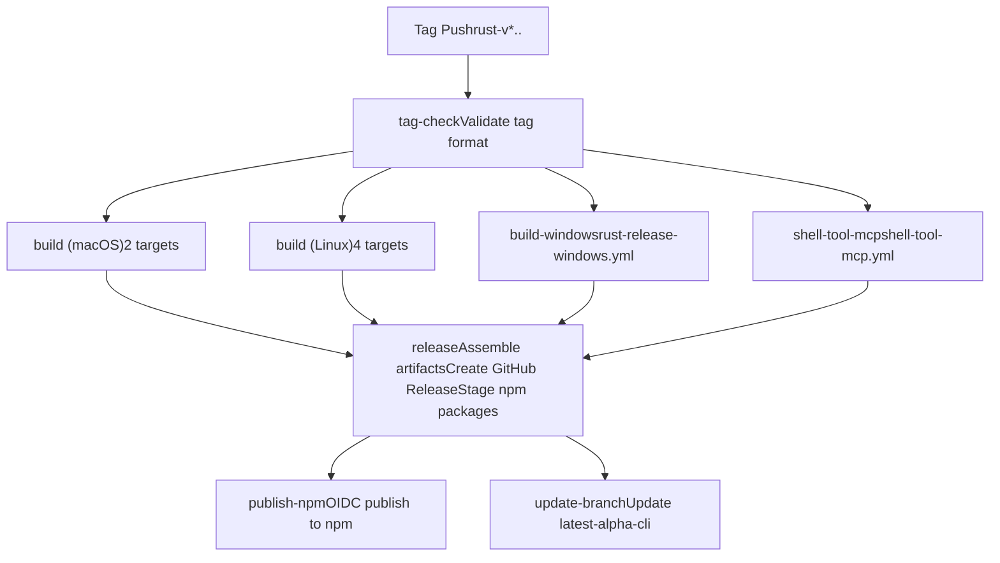
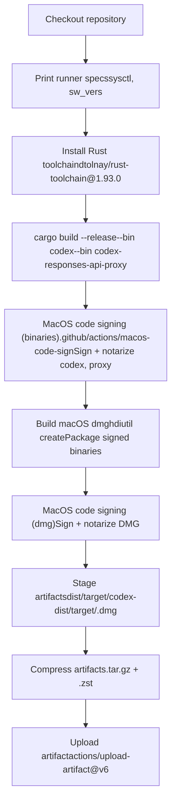
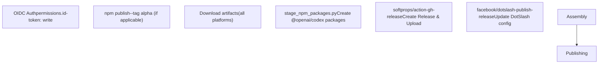

# Release Pipeline

Relevant source files

-   [.github/actions/windows-code-sign/action.yml](https://github.com/openai/codex/blob/d807d44a/.github/actions/windows-code-sign/action.yml)
-   [.github/scripts/install-musl-build-tools.sh](https://github.com/openai/codex/blob/d807d44a/.github/scripts/install-musl-build-tools.sh)
-   [.github/workflows/ci.yml](https://github.com/openai/codex/blob/d807d44a/.github/workflows/ci.yml)
-   [.github/workflows/rust-ci.yml](https://github.com/openai/codex/blob/d807d44a/.github/workflows/rust-ci.yml)
-   [.github/workflows/rust-release-windows.yml](https://github.com/openai/codex/blob/d807d44a/.github/workflows/rust-release-windows.yml)
-   [.github/workflows/rust-release.yml](https://github.com/openai/codex/blob/d807d44a/.github/workflows/rust-release.yml)
-   [.github/workflows/sdk.yml](https://github.com/openai/codex/blob/d807d44a/.github/workflows/sdk.yml)
-   [.github/workflows/shell-tool-mcp.yml](https://github.com/openai/codex/blob/d807d44a/.github/workflows/shell-tool-mcp.yml)
-   [.github/workflows/zstd](https://github.com/openai/codex/blob/d807d44a/.github/workflows/zstd)
-   [codex-rs/.cargo/config.toml](https://github.com/openai/codex/blob/d807d44a/codex-rs/.cargo/config.toml)
-   [codex-rs/rust-toolchain.toml](https://github.com/openai/codex/blob/d807d44a/codex-rs/rust-toolchain.toml)
-   [codex-rs/scripts/setup-windows.ps1](https://github.com/openai/codex/blob/d807d44a/codex-rs/scripts/setup-windows.ps1)
-   [codex-rs/shell-escalation/README.md](https://github.com/openai/codex/blob/d807d44a/codex-rs/shell-escalation/README.md?plain=1)

## Purpose and Scope

This document describes the release pipeline defined in [.github/workflows/rust-release.yml](https://github.com/openai/codex/blob/d807d44a/.github/workflows/rust-release.yml) that builds, signs, and publishes Codex binaries for all supported platforms. The pipeline is triggered by pushing a version tag and orchestrates multi-platform builds, platform-specific code signing (Apple, Cosign, Azure), artifact compression, GitHub release creation, and npm package publishing.

For information about continuous integration testing, see [CI Pipeline](https://github.com/openai/codex/blob/d807d44a/CI Pipeline) For details on distribution channels (GitHub Releases, npm, Homebrew), see [Distribution Channels](https://github.com/openai/codex/blob/d807d44a/Distribution Channels) For the separate shell-tool-mcp build process, see [Shell Tool MCP Build System](https://github.com/openai/codex/blob/d807d44a/Shell Tool MCP Build System)

---

## Release Trigger and Tag Validation

The release pipeline is triggered by pushing a Git tag that matches the pattern `rust-v*.*.*` [.github/workflows/rust-release.yml9-12](https://github.com/openai/codex/blob/d807d44a/.github/workflows/rust-release.yml#L9-L12):

```
git tag -a rust-v0.1.0 -m "Release 0.1.0"git push origin rust-v0.1.0
```
The `tag-check` job validates that the tag format is correct and matches the version declared in [codex-rs/Cargo.toml](https://github.com/openai/codex/blob/d807d44a/codex-rs/Cargo.toml) Accepted tag formats include stable releases (e.g., `rust-v1.2.3`) and alpha/beta pre-releases (e.g., `rust-v1.2.3-alpha.1`) [.github/workflows/rust-release.yml33-34](https://github.com/openai/codex/blob/d807d44a/.github/workflows/rust-release.yml#L33-L34)

The validation logic [.github/workflows/rust-release.yml37-43](https://github.com/openai/codex/blob/d807d44a/.github/workflows/rust-release.yml#L37-L43) extracts the version from the tag, reads the version from `Cargo.toml` using `grep` and `sed`, and fails the workflow if they do not match. This prevents accidental releases with mismatched versions.

**Sources:** [.github/workflows/rust-release.yml9-46](https://github.com/openai/codex/blob/d807d44a/.github/workflows/rust-release.yml#L9-L46)

---

## Workflow Job Dependencies

The pipeline uses concurrent builds for all platforms, then gates the final release assembly on all builds completing successfully.

**Diagram: Release Pipeline Job Graph**


**Sources:** [.github/workflows/rust-release.yml48-635](https://github.com/openai/codex/blob/d807d44a/.github/workflows/rust-release.yml#L48-L635)

---

## Build Matrix Strategy

### Platform Coverage

The `build` job uses a matrix strategy to build binaries for 6 platform/libc combinations in parallel [.github/workflows/rust-release.yml64-80](https://github.com/openai/codex/blob/d807d44a/.github/workflows/rust-release.yml#L64-L80):

| Runner | Target | libc |
| --- | --- | --- |
| `macos-15-xlarge` | `aarch64-apple-darwin` | system |
| `macos-15-xlarge` | `x86_64-apple-darwin` | system |
| `ubuntu-24.04` | `x86_64-unknown-linux-musl` | musl |
| `ubuntu-24.04` | `x86_64-unknown-linux-gnu` | glibc |
| `ubuntu-24.04-arm` | `aarch64-unknown-linux-musl` | musl |
| `ubuntu-24.04-arm` | `aarch64-unknown-linux-gnu` | glibc |

Windows builds are handled by a separate reusable workflow [.github/workflows/rust-release-windows.yml](https://github.com/openai/codex/blob/d807d44a/.github/workflows/rust-release-windows.yml) that builds 2 targets (`x86_64-pc-windows-msvc`, `aarch64-pc-windows-msvc`).

### LTO Configuration

The pipeline sets `CARGO_PROFILE_RELEASE_LTO` based on the release type [.github/workflows/rust-release.yml60-62](https://github.com/openai/codex/blob/d807d44a/.github/workflows/rust-release.yml#L60-L62) Alpha releases use `thin` LTO for faster builds, while stable releases typically use `fat` LTO for maximum optimization (though currently configured to `thin` to avoid Ubuntu ARM timeouts).

**Sources:** [.github/workflows/rust-release.yml60-80](https://github.com/openai/codex/blob/d807d44a/.github/workflows/rust-release.yml#L60-L80) [.github/workflows/rust-release-windows.yml38-68](https://github.com/openai/codex/blob/d807d44a/.github/workflows/rust-release-windows.yml#L38-L68)

---

## macOS Build and Code Signing

**Diagram: macOS Release Build Flow**


The macOS build process features two-stage signing and notarization:

1.  **Binary Signing** [.github/workflows/rust-release.yml224-235](https://github.com/openai/codex/blob/d807d44a/.github/workflows/rust-release.yml#L224-L235): Uses the `macos-code-sign` action to sign and notarize `codex` and `codex-responses-api-proxy` binaries individually.
2.  **DMG Creation** [.github/workflows/rust-release.yml237-281](https://github.com/openai/codex/blob/d807d44a/.github/workflows/rust-release.yml#L237-L281): Packages the signed binaries into a DMG volume using `hdiutil create`.
3.  **DMG Signing** [.github/workflows/rust-release.yml283-294](https://github.com/openai/codex/blob/d807d44a/.github/workflows/rust-release.yml#L283-L294): The resulting DMG is itself signed and notarized.

**Sources:** [.github/workflows/rust-release.yml224-294](https://github.com/openai/codex/blob/d807d44a/.github/workflows/rust-release.yml#L224-L294)

---

## Linux Build and musl Cross-Compilation

### musl Toolchain Setup

Linux builds produce both musl and glibc variants. The musl builds require a specialized environment configured via [.github/scripts/install-musl-build-tools.sh](https://github.com/openai/codex/blob/d807d44a/.github/scripts/install-musl-build-tools.sh):

-   **Zig Integration**: Uses Zig 0.14.0 as a C/C++ compiler for musl cross-compilation [.github/workflows/rust-release.yml144-147](https://github.com/openai/codex/blob/d807d44a/.github/workflows/rust-release.yml#L144-L147)
-   **Hermetic Cargo Home**: Creates isolated `$GITHUB_WORKSPACE/.cargo-home` to avoid host toolchain pollution [.github/workflows/rust-release.yml133-141](https://github.com/openai/codex/blob/d807d44a/.github/workflows/rust-release.yml#L133-L141)
-   **libcap**: Builds `libcap` from source for the target architecture using `musl-gcc` or Zig [.github/scripts/install-musl-build-tools.sh35-90](https://github.com/openai/codex/blob/d807d44a/.github/scripts/install-musl-build-tools.sh#L35-L90)
-   **UBSan Wrapper**: Configures a `rustc-ubsan-wrapper` script to preload `libubsan.so.1` for musl hosts [.github/workflows/rust-release.yml156-175](https://github.com/openai/codex/blob/d807d44a/.github/workflows/rust-release.yml#L156-L175)

### Linux Code Signing

Linux binaries are signed using Cosign with keyless signing via the `linux-code-sign` action [.github/workflows/rust-release.yml217-222](https://github.com/openai/codex/blob/d807d44a/.github/workflows/rust-release.yml#L217-L222) This produces `.sigstore` bundles alongside each binary for verification.

**Sources:** [.github/workflows/rust-release.yml112-222](https://github.com/openai/codex/blob/d807d44a/.github/workflows/rust-release.yml#L112-L222) [.github/scripts/install-musl-build-tools.sh](https://github.com/openai/codex/blob/d807d44a/.github/scripts/install-musl-build-tools.sh)

---

## Windows Build and Azure Trusted Signing

Windows builds are delegated to [.github/workflows/rust-release-windows.yml](https://github.com/openai/codex/blob/d807d44a/.github/workflows/rust-release-windows.yml)

1.  **Bundle Splitting**: Compiles binaries in two bundles: `primary` (`codex.exe`, `codex-responses-api-proxy.exe`) and `helpers` (`codex-windows-sandbox-setup.exe`, `codex-command-runner.exe`) [.github/workflows/rust-release-windows.yml38-68](https://github.com/openai/codex/blob/d807d44a/.github/workflows/rust-release-windows.yml#L38-L68)
2.  **Azure Trusted Signing**: Uses the `windows-code-sign` composite action [.github/actions/windows-code-sign/action.yml](https://github.com/openai/codex/blob/d807d44a/.github/actions/windows-code-sign/action.yml) to sign all four binaries using Azure Trusted Signing.
3.  **OIDC Authentication**: Authenticates with Azure using OIDC via `azure/login@v2` [.github/actions/windows-code-sign/action.yml29-34](https://github.com/openai/codex/blob/d807d44a/.github/actions/windows-code-sign/action.yml#L29-L34)
4.  **Verification**: After signing, the workflow verifies the existence of all four executables before staging [.github/workflows/rust-release-windows.yml164-171](https://github.com/openai/codex/blob/d807d44a/.github/workflows/rust-release-windows.yml#L164-L171)

**Sources:** [.github/workflows/rust-release-windows.yml](https://github.com/openai/codex/blob/d807d44a/.github/workflows/rust-release-windows.yml) [.github/actions/windows-code-sign/action.yml](https://github.com/openai/codex/blob/d807d44a/.github/actions/windows-code-sign/action.yml)

---

## Artifact Packaging and Compression

After signing, binaries are staged and compressed into multiple formats [.github/workflows/rust-release.yml296-356](https://github.com/openai/codex/blob/d807d44a/.github/workflows/rust-release.yml#L296-L356):

-   **Naming Convention**: Binaries are renamed to include the target triple (e.g., `codex-x86_64-unknown-linux-musl`).
-   **Compression Formats**:
    -   `.tar.gz`: Standard Unix compression [.github/workflows/rust-release.yml327](https://github.com/openai/codex/blob/d807d44a/.github/workflows/rust-release.yml#L327-L327)
    -   `.zst`: High-performance Zstandard compression (level 19) [.github/workflows/rust-release.yml328](https://github.com/openai/codex/blob/d807d44a/.github/workflows/rust-release.yml#L328-L328)
    -   `.zip`: Standard Windows compression (using `7z`) [.github/workflows/rust-release-windows.yml241](https://github.com/openai/codex/blob/d807d44a/.github/workflows/rust-release-windows.yml#L241-L241)
-   **DMG**: For macOS, the signed `.dmg` is included [.github/workflows/rust-release.yml315-318](https://github.com/openai/codex/blob/d807d44a/.github/workflows/rust-release.yml#L315-L318)

**Sources:** [.github/workflows/rust-release.yml296-356](https://github.com/openai/codex/blob/d807d44a/.github/workflows/rust-release.yml#L296-L356) [.github/workflows/rust-release-windows.yml236-250](https://github.com/openai/codex/blob/d807d44a/.github/workflows/rust-release-windows.yml#L236-L250)

---

## Release Assembly and npm Publishing

The `release` job assembles the final GitHub Release and stages npm packages.

**Diagram: Release Assembly and Publishing**


### npm Publishing via OIDC

Codex uses OpenID Connect (OIDC) to publish to npm without long-lived tokens [.github/workflows/rust-release.yml522-615](https://github.com/openai/codex/blob/d807d44a/.github/workflows/rust-release.yml#L522-L615)

-   **Version Logic**: Stable versions publish to the default tag; versions with `-alpha` or `-beta` suffixes use the `alpha` tag [.github/workflows/rust-release.yml447-464](https://github.com/openai/codex/blob/d807d44a/.github/workflows/rust-release.yml#L447-L464)
-   **Packages**: Publishes the umbrella `@openai/codex` package, platform-specific binaries, the `@openai/codex-sdk`, and the `@openai/codex-responses-api-proxy` [.github/workflows/rust-release.yml571-615](https://github.com/openai/codex/blob/d807d44a/.github/workflows/rust-release.yml#L571-L615)

**Sources:** [.github/workflows/rust-release.yml374-615](https://github.com/openai/codex/blob/d807d44a/.github/workflows/rust-release.yml#L374-L615)
