# Distribution Channels

Relevant source files

-   [.github/actions/windows-code-sign/action.yml](https://github.com/openai/codex/blob/d807d44a/.github/actions/windows-code-sign/action.yml)
-   [.github/dotslash-config.json](https://github.com/openai/codex/blob/d807d44a/.github/dotslash-config.json)
-   [.github/scripts/install-musl-build-tools.sh](https://github.com/openai/codex/blob/d807d44a/.github/scripts/install-musl-build-tools.sh)
-   [.github/workflows/ci.yml](https://github.com/openai/codex/blob/d807d44a/.github/workflows/ci.yml)
-   [.github/workflows/rust-ci.yml](https://github.com/openai/codex/blob/d807d44a/.github/workflows/rust-ci.yml)
-   [.github/workflows/rust-release-windows.yml](https://github.com/openai/codex/blob/d807d44a/.github/workflows/rust-release-windows.yml)
-   [.github/workflows/rust-release.yml](https://github.com/openai/codex/blob/d807d44a/.github/workflows/rust-release.yml)
-   [.github/workflows/sdk.yml](https://github.com/openai/codex/blob/d807d44a/.github/workflows/sdk.yml)
-   [.github/workflows/shell-tool-mcp-ci.yml](https://github.com/openai/codex/blob/d807d44a/.github/workflows/shell-tool-mcp-ci.yml)
-   [.github/workflows/shell-tool-mcp.yml](https://github.com/openai/codex/blob/d807d44a/.github/workflows/shell-tool-mcp.yml)
-   [.github/workflows/zstd](https://github.com/openai/codex/blob/d807d44a/.github/workflows/zstd)
-   [CHANGELOG.md](https://github.com/openai/codex/blob/d807d44a/CHANGELOG.md?plain=1)
-   [cliff.toml](https://github.com/openai/codex/blob/d807d44a/cliff.toml)
-   [codex-cli/.gitignore](https://github.com/openai/codex/blob/d807d44a/codex-cli/.gitignore)
-   [codex-cli/README.md](https://github.com/openai/codex/blob/d807d44a/codex-cli/README.md?plain=1)
-   [codex-cli/bin/codex.js](https://github.com/openai/codex/blob/d807d44a/codex-cli/bin/codex.js)
-   [codex-cli/bin/rg](https://github.com/openai/codex/blob/d807d44a/codex-cli/bin/rg)
-   [codex-cli/package.json](https://github.com/openai/codex/blob/d807d44a/codex-cli/package.json)
-   [codex-cli/scripts/README.md](https://github.com/openai/codex/blob/d807d44a/codex-cli/scripts/README.md?plain=1)
-   [codex-cli/scripts/build\_npm\_package.py](https://github.com/openai/codex/blob/d807d44a/codex-cli/scripts/build_npm_package.py)
-   [codex-cli/scripts/install\_native\_deps.py](https://github.com/openai/codex/blob/d807d44a/codex-cli/scripts/install_native_deps.py)
-   [codex-rs/.cargo/config.toml](https://github.com/openai/codex/blob/d807d44a/codex-rs/.cargo/config.toml)
-   [codex-rs/process-hardening/README.md](https://github.com/openai/codex/blob/d807d44a/codex-rs/process-hardening/README.md?plain=1)
-   [codex-rs/responses-api-proxy/npm/README.md](https://github.com/openai/codex/blob/d807d44a/codex-rs/responses-api-proxy/npm/README.md?plain=1)
-   [codex-rs/responses-api-proxy/npm/bin/codex-responses-api-proxy.js](https://github.com/openai/codex/blob/d807d44a/codex-rs/responses-api-proxy/npm/bin/codex-responses-api-proxy.js)
-   [codex-rs/responses-api-proxy/npm/package.json](https://github.com/openai/codex/blob/d807d44a/codex-rs/responses-api-proxy/npm/package.json)
-   [codex-rs/rust-toolchain.toml](https://github.com/openai/codex/blob/d807d44a/codex-rs/rust-toolchain.toml)
-   [codex-rs/scripts/setup-windows.ps1](https://github.com/openai/codex/blob/d807d44a/codex-rs/scripts/setup-windows.ps1)
-   [codex-rs/shell-escalation/README.md](https://github.com/openai/codex/blob/d807d44a/codex-rs/shell-escalation/README.md?plain=1)
-   [package.json](https://github.com/openai/codex/blob/d807d44a/package.json)
-   [pnpm-workspace.yaml](https://github.com/openai/codex/blob/d807d44a/pnpm-workspace.yaml)
-   [scripts/stage\_npm\_packages.py](https://github.com/openai/codex/blob/d807d44a/scripts/stage_npm_packages.py)
-   [sdk/typescript/.prettierignore](https://github.com/openai/codex/blob/d807d44a/sdk/typescript/.prettierignore)
-   [shell-tool-mcp/package.json](https://github.com/openai/codex/blob/d807d44a/shell-tool-mcp/package.json)
-   [shell-tool-mcp/src/index.ts](https://github.com/openai/codex/blob/d807d44a/shell-tool-mcp/src/index.ts)

## Purpose and Scope

This document describes how Codex binaries and packages are distributed to end users after being built by the release pipeline. It covers the primary distribution channels (GitHub Releases, npm Registry, Homebrew Cask, WinGet, and DotSlash), how artifacts are staged and published, and the installation methods available to users.

The distribution system is designed to handle multi-platform native binaries (Rust-based) and their corresponding wrappers (Node.js/TypeScript) across Linux (musl/gnu), macOS (Darwin), and Windows (MSVC).

---

## Distribution Architecture

The Codex release system distributes artifacts through multiple channels to support different user preferences and platform conventions. All channels source their artifacts from the same GitHub Actions release workflow triggered by version tags.

### Release Data Flow

```mermaid
flowchart TD
    TAG["Git Tagrust-v*.."]
    CHECK["tag-check jobValidate version"]
    BUILD_LINUX["Build Linux(musl/gnu)"]
    BUILD_MACOS["Build macOS(aarch64/x86_64)"]
    BUILD_WIN["Build Windows(MSVC)"]
    SIGN_WIN["Windows Code SignAzure Trusted Signing"]
    STAGE_NPM["stage_npm_packages.pyCreate .tgz bundles"]
    DMG["DMG Creationhdiutil + notarization"]
    DOTSLASH["DotSlash Generationdotslash-config.json"]
    GITHUB_RELEASE["GitHub Releasessoftprops/action-gh-release"]
    NPM_REGISTRY["npm Registry@openai/codex"]
    SHELL_MCP["npm Registry@openai/codex-shell-tool-mcp"]
    WINGET["WinGet Releaser(Windows)"]

    TAG --> CHECK
    CHECK --> BUILD_LINUX
    CHECK --> BUILD_MACOS
    CHECK --> BUILD_WIN
    BUILD --> WIN_SIGN_WIN
    BUILD --> LINUX_STAGE_NPM
    BUILD --> MACOS_STAGE_NPM
    SIGN --> WIN_STAGE_NPM
    BUILD --> MACOS_DMG
    BUILD --> LINUX_DOTSLASH
    BUILD --> MACOS_DOTSLASH
    SIGN --> WIN_DOTSLASH
    STAGE --> NPM_NPM_REGISTRY
    DMG --> GITHUB_RELEASE
    DOTSLASH --> GITHUB_RELEASE
    SIGN --> WIN_WINGET
```

**Sources:** [.github/workflows/rust-release.yml8-12](https://github.com/openai/codex/blob/d807d44a/.github/workflows/rust-release.yml#L8-L12) [.github/workflows/rust-release.yml374-521](https://github.com/openai/codex/blob/d807d44a/.github/workflows/rust-release.yml#L374-L521) [.github/workflows/rust-release-windows.yml1-22](https://github.com/openai/codex/blob/d807d44a/.github/workflows/rust-release-windows.yml#L1-L22)

---

## GitHub Releases

GitHub Releases serve as the primary distribution channel for direct binary downloads and the source of truth for other package managers.

### Release Creation and Validation

The `tag-check` job ensures that the pushed tag (e.g., `rust-v0.1.0`) exactly matches the version defined in `codex-rs/Cargo.toml` before proceeding with the build.

**Sources:** [.github/workflows/rust-release.yml19-47](https://github.com/openai/codex/blob/d807d44a/.github/workflows/rust-release.yml#L19-L47)

### Artifact Organization

Artifacts are organized by target triple and compressed into multiple formats to maximize compatibility:

| Target Triple | Platform | Format |
| --- | --- | --- |
| `x86_64-unknown-linux-musl` | Linux x64 | `.zst`, `.tar.gz` |
| `aarch64-unknown-linux-musl` | Linux ARM64 | `.zst`, `.tar.gz` |
| `aarch64-apple-darwin` | macOS Silicon | `.zst`, `.tar.gz`, `.dmg` |
| `x86_64-pc-windows-msvc` | Windows x64 | `.zst`, `.zip`, `.exe` |

**Sources:** [.github/workflows/rust-release.yml67-80](https://github.com/openai/codex/blob/d807d44a/.github/workflows/rust-release.yml#L67-L80) [.github/workflows/rust-release-windows.yml39-68](https://github.com/openai/codex/blob/d807d44a/.github/workflows/rust-release-windows.yml#L39-L68) [.github/dotslash-config.json1-84](https://github.com/openai/codex/blob/d807d44a/.github/dotslash-config.json#L1-L84)

---

## npm Registry

The npm distribution involves a primary wrapper package and several platform-specific optional dependencies that contain the native binaries.

### npm Package Structure

The `@openai/codex` package acts as a selector. When installed, it uses a shim to execute the correct native binary for the user's current architecture.

**Sources:** [codex-cli/package.json1-22](https://github.com/openai/codex/blob/d807d44a/codex-cli/package.json#L1-L22) [codex-cli/bin/codex.js15-22](https://github.com/openai/codex/blob/d807d44a/codex-cli/bin/codex.js#L15-L22) [codex-cli/scripts/build\_npm\_package.py21-64](https://github.com/openai/codex/blob/d807d44a/codex-cli/scripts/build_npm_package.py#L21-L64)

### The Execution Shim (`bin/codex.js`)

The `codex.js` entry point performs runtime detection of the platform and architecture to locate the native binary within the `node_modules` tree.

1.  **Platform Detection:** Uses `process.platform` and `process.arch` to map to a target triple (e.g., `linux` + `x64` → `x86_64-unknown-linux-musl`).
2.  **Path Resolution:** Looks for the binary in the local `vendor` directory or within the installed platform-specific package (e.g., `@openai/codex-linux-x64/vendor/...`).
3.  **Signal Forwarding:** Uses `child_process.spawn` to run the binary, forwarding `SIGINT`, `SIGTERM`, and `SIGHUP` to the child process to ensure graceful shutdown of the Rust engine.

**Sources:** [codex-cli/bin/codex.js24-67](https://github.com/openai/codex/blob/d807d44a/codex-cli/bin/codex.js#L24-L67) [codex-cli/bin/codex.js117-124](https://github.com/openai/codex/blob/d807d44a/codex-cli/bin/codex.js#L117-L124) [codex-cli/bin/codex.js193-206](https://github.com/openai/codex/blob/d807d44a/codex-cli/bin/codex.js#L193-L206)

### Publishing Flow

Publishing to npm uses **OIDC (OpenID Connect)** for secure, tokenless authentication from GitHub Actions.

-   **Stable Versions:** Published to the `latest` tag.
-   **Alpha Versions:** Published to the `alpha` tag if the version matches `*.*.*-alpha.*`.
-   **Duplicate Prevention:** The script checks if a version is already published to avoid workflow failures.

**Sources:** [.github/workflows/rust-release.yml531-545](https://github.com/openai/codex/blob/d807d44a/.github/workflows/rust-release.yml#L531-L545) [.github/workflows/rust-release.yml589-606](https://github.com/openai/codex/blob/d807d44a/.github/workflows/rust-release.yml#L589-L606) [.github/workflows/rust-release.yml614-629](https://github.com/openai/codex/blob/d807d44a/.github/workflows/rust-release.yml#L614-L629)

---

## Windows Distribution (WinGet)

Codex provides first-class support for Windows via signed binaries and WinGet.

### Code Signing

All Windows binaries (`codex.exe`, `codex-responses-api-proxy.exe`, etc.) are signed using **Azure Trusted Signing**. This process is mandatory for distribution via WinGet and to avoid Windows SmartScreen warnings.

**Sources:** [.github/workflows/rust-release-windows.yml173-183](https://github.com/openai/codex/blob/d807d44a/.github/workflows/rust-release-windows.yml#L173-L183) [.github/actions/windows-code-sign/action.yml1-58](https://github.com/openai/codex/blob/d807d44a/.github/actions/windows-code-sign/action.yml#L1-L58)

### WinGet Releaser

The pipeline includes a `winget-releaser` job that automatically submits the new version to the Microsoft Community Training repository when a stable release is tagged.

**Sources:** [.github/workflows/rust-release.yml435-437](https://github.com/openai/codex/blob/d807d44a/.github/workflows/rust-release.yml#L435-L437)

---

## Shell Tool MCP Distribution

The `@openai/codex-shell-tool-mcp` package is a specialized distribution containing patched versions of Bash and Zsh for 11 different OS variants.

### Build Matrix

The `shell-tool-mcp.yml` workflow compiles patched shells for:

-   **Linux:** Ubuntu (20.04, 22.04, 24.04), Debian (11, 12), CentOS Stream 9.
-   **macOS:** macOS 14, macOS 15.
-   **Architectures:** x86\_64 and aarch64.

### Patch Application

The workflow clones upstream Bash and applies the `bash-exec-wrapper.patch` before compilation. This patch enables the `EXEC_WRAPPER` functionality used for sandboxing and capability enforcement.

**Sources:** [.github/workflows/shell-tool-mcp.yml73-127](https://github.com/openai/codex/blob/d807d44a/.github/workflows/shell-tool-mcp.yml#L73-L127) [.github/workflows/shell-tool-mcp.yml148-163](https://github.com/openai/codex/blob/d807d44a/.github/workflows/shell-tool-mcp.yml#L148-L163) [.github/workflows/shell-tool-mcp.yml171-205](https://github.com/openai/codex/blob/d807d44a/.github/workflows/shell-tool-mcp.yml#L171-L205)

---

## Summary of Channels

| Channel | Tool | Command / URL |
| --- | --- | --- |
| **npm** | `npm` / `pnpm` | `npm install -g @openai/codex` |
| **Homebrew** | `brew` | `brew install --cask codex` |
| **WinGet** | `winget` | `winget install OpenAI.Codex` |
| **GitHub** | Browser/curl | `https://github.com/openai/codex/releases` |
| **DotSlash** | `dotslash` | Reference `.github/dotslash-config.json` |

**Sources:** [README.md1-61](https://github.com/openai/codex/blob/d807d44a/README.md?plain=1#L1-L61) [.github/dotslash-config.json1-30](https://github.com/openai/codex/blob/d807d44a/.github/dotslash-config.json#L1-L30)
