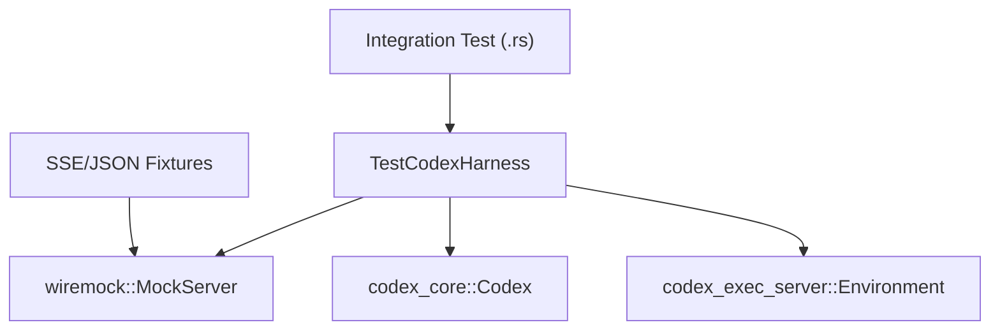
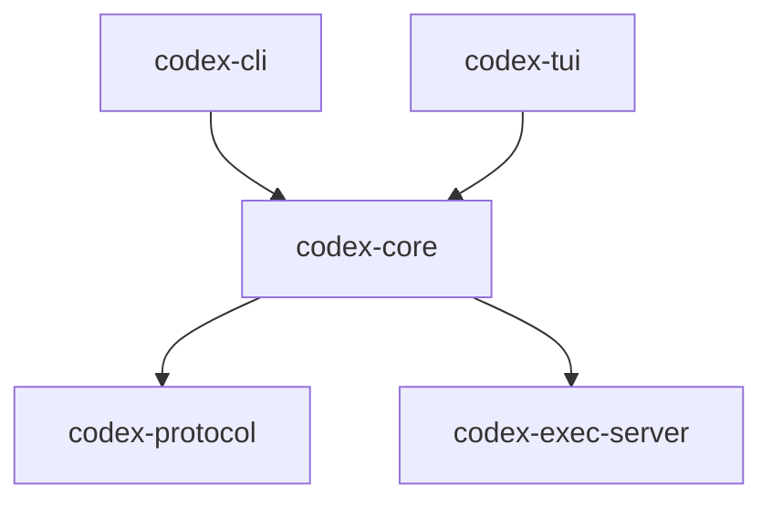

# Development and Testing

Relevant source files

-   [AGENTS.md](https://github.com/openai/codex/blob/d807d44a/AGENTS.md?plain=1)
-   [codex-rs/core/tests/common/Cargo.toml](https://github.com/openai/codex/blob/d807d44a/codex-rs/core/tests/common/Cargo.toml)
-   [codex-rs/core/tests/common/lib.rs](https://github.com/openai/codex/blob/d807d44a/codex-rs/core/tests/common/lib.rs)
-   [codex-rs/core/tests/common/test\_codex.rs](https://github.com/openai/codex/blob/d807d44a/codex-rs/core/tests/common/test_codex.rs)
-   [codex-rs/core/tests/suite/apply\_patch\_cli.rs](https://github.com/openai/codex/blob/d807d44a/codex-rs/core/tests/suite/apply_patch_cli.rs)
-   [codex-rs/core/tests/suite/fork\_thread.rs](https://github.com/openai/codex/blob/d807d44a/codex-rs/core/tests/suite/fork_thread.rs)
-   [codex-rs/core/tests/suite/mod.rs](https://github.com/openai/codex/blob/d807d44a/codex-rs/core/tests/suite/mod.rs)
-   [codex-rs/core/tests/suite/remote\_env.rs](https://github.com/openai/codex/blob/d807d44a/codex-rs/core/tests/suite/remote_env.rs)
-   [codex-rs/core/tests/suite/stream\_error\_allows\_next\_turn.rs](https://github.com/openai/codex/blob/d807d44a/codex-rs/core/tests/suite/stream_error_allows_next_turn.rs)
-   [codex-rs/core/tests/suite/stream\_no\_completed.rs](https://github.com/openai/codex/blob/d807d44a/codex-rs/core/tests/suite/stream_no_completed.rs)
-   [docs/authentication.md](https://github.com/openai/codex/blob/d807d44a/docs/authentication.md?plain=1)
-   [docs/contributing.md](https://github.com/openai/codex/blob/d807d44a/docs/contributing.md?plain=1)
-   [docs/exec.md](https://github.com/openai/codex/blob/d807d44a/docs/exec.md?plain=1)
-   [docs/getting-started.md](https://github.com/openai/codex/blob/d807d44a/docs/getting-started.md?plain=1)
-   [docs/install.md](https://github.com/openai/codex/blob/d807d44a/docs/install.md?plain=1)
-   [docs/license.md](https://github.com/openai/codex/blob/d807d44a/docs/license.md?plain=1)
-   [docs/open-source-fund.md](https://github.com/openai/codex/blob/d807d44a/docs/open-source-fund.md?plain=1)
-   [docs/sandbox.md](https://github.com/openai/codex/blob/d807d44a/docs/sandbox.md?plain=1)
-   [justfile](https://github.com/openai/codex/blob/d807d44a/justfile)
-   [scripts/test-remote-env.sh](https://github.com/openai/codex/blob/d807d44a/scripts/test-remote-env.sh)

This page provides a high-level guide for developers contributing to the Codex codebase. It covers the essential setup, testing philosophies, and coding standards required to maintain the system's reliability and performance.

For detailed setup instructions, see [Development Setup](/openai/codex/9.1-development-setup). For an in-depth look at our testing tools, see [Testing Infrastructure](/openai/codex/9.2-testing-infrastructure).

## Core Development Principles

The Codex codebase follows strict Rust idioms and organizational patterns to ensure maintainability. Key constraints include:

-   **Module Size**: Target modules under 500 lines of code (LoC). If a file exceeds 800 LoC, functionality should be extracted into new modules [AGENTS.md32-40](https://github.com/openai/codex/blob/d807d44a/AGENTS.md?plain=1#L32-L40)
-   **API Design**: Avoid ambiguous `bool` or `Option` parameters. Prefer enums or newtypes for self-documenting callsites [AGENTS.md14-18](https://github.com/openai/codex/blob/d807d44a/AGENTS.md?plain=1#L14-L18)
-   **Tooling**: The project relies on `just` as a command runner, `cargo-nextest` for fast test execution, and `cargo-insta` for snapshot testing [AGENTS.md7-47](https://github.com/openai/codex/blob/d807d44a/AGENTS.md?plain=1#L7-L47) [justfile40-47](https://github.com/openai/codex/blob/d807d44a/justfile#L40-L47)

## Development Setup and Workflow

Developers use the `justfile` located in the `codex-rs` directory to manage common tasks. This ensures consistency across different development environments.

| Command | Purpose |
| --- | --- |
| `just fmt` | Formats code with specific import granularity [justfile27-28](https://github.com/openai/codex/blob/d807d44a/justfile#L27-L28) |
| `just fix -p <crate>` | Runs Clippy fixes on a specific project [justfile30-31](https://github.com/openai/codex/blob/d807d44a/justfile#L30-L31) |
| `just write-config-schema` | Updates the JSON schema for `config.toml` [justfile78-79](https://github.com/openai/codex/blob/d807d44a/justfile#L78-L79) |
| `just argument-comment-lint` | Enforces exact parameter name comments for literal arguments [justfile90-92](https://github.com/openai/codex/blob/d807d44a/justfile#L90-L92) |

For details, see [Development Setup](/openai/codex/9.1-development-setup).

Sources: [justfile1-101](https://github.com/openai/codex/blob/d807d44a/justfile#L1-L101) [AGENTS.md44-52](https://github.com/openai/codex/blob/d807d44a/AGENTS.md?plain=1#L44-L52)

## Testing Infrastructure

Codex employs a multi-layered testing strategy, ranging from unit tests to complex integration tests that simulate model interactions.

### Integration Test Harness

The `TestCodexHarness` and `TestEnv` utilities provide a controlled environment for integration tests, supporting both local and remote execution environments [codex-rs/core/tests/common/test\_codex.rs94-149](https://github.com/openai/codex/blob/d807d44a/codex-rs/core/tests/common/test_codex.rs#L94-L149)

Sources: [codex-rs/core/tests/common/test\_codex.rs124-149](https://github.com/openai/codex/blob/d807d44a/codex-rs/core/tests/common/test_codex.rs#L124-L149) [codex-rs/core/tests/suite/mod.rs1-145](https://github.com/openai/codex/blob/d807d44a/codex-rs/core/tests/suite/mod.rs#L1-L145)

### Key Testing Patterns

-   **Snapshot Testing**: Used extensively for UI and complex state trees via `cargo insta` [codex-rs/core/tests/common/lib.rs43-60](https://github.com/openai/codex/blob/d807d44a/codex-rs/core/tests/common/lib.rs#L43-L60)
-   **SSE Mocking**: The `StreamingSseServer` allows testing of agent resilience against incomplete streams or API errors [codex-rs/core/tests/suite/stream\_no\_completed.rs32-42](https://github.com/openai/codex/blob/d807d44a/codex-rs/core/tests/suite/stream_no_completed.rs#L32-L42) [codex-rs/core/tests/suite/stream\_error\_allows\_next\_turn.rs24-61](https://github.com/openai/codex/blob/d807d44a/codex-rs/core/tests/suite/stream_error_allows_next_turn.rs#L24-L61)
-   **Sandboxing Tests**: Integration tests verify that sandbox policies (e.g., Seatbelt on macOS) are correctly enforced and that the agent handles permission denials gracefully [AGENTS.md8-10](https://github.com/openai/codex/blob/d807d44a/AGENTS.md?plain=1#L8-L10)

For details, see [Testing Infrastructure](/openai/codex/9.2-testing-infrastructure).

Sources: [codex-rs/core/tests/common/lib.rs1-200](https://github.com/openai/codex/blob/d807d44a/codex-rs/core/tests/common/lib.rs#L1-L200) [codex-rs/core/tests/suite/mod.rs57-145](https://github.com/openai/codex/blob/d807d44a/codex-rs/core/tests/suite/mod.rs#L57-L145)

## Code Organization and Conventions

The project uses a Cargo workspace where crate names are prefixed with `codex-` [AGENTS.md5](https://github.com/openai/codex/blob/d807d44a/AGENTS.md?plain=1#L5-L5)

### Protocol and Schema Management

Changes to the `app-server` protocol or configuration structures require regenerating schemas to keep IDE integrations and the TUI in sync [justfile78-88](https://github.com/openai/codex/blob/d807d44a/justfile#L78-L88) [AGENTS.md22-24](https://github.com/openai/codex/blob/d807d44a/AGENTS.md?plain=1#L22-L24)

For details, see [Code Organization Patterns](/openai/codex/9.3-code-organization-patterns).

Sources: [AGENTS.md1-60](https://github.com/openai/codex/blob/d807d44a/AGENTS.md?plain=1#L1-L60) [justfile1-101](https://github.com/openai/codex/blob/d807d44a/justfile#L1-L101)

## Observability

Development and testing are supported by a robust telemetry system. The `codex-otel` crate integrates OpenTelemetry for tracing and metrics. During development, logs are typically routed to `~/.codex/log/codex-tui.log`, and the `RUST_LOG` environment variable is used to tune verbosity [docs/install.md54-60](https://github.com/openai/codex/blob/d807d44a/docs/install.md?plain=1#L54-L60)

For details, see [Observability and Telemetry](/openai/codex/9.4-observability-and-telemetry).

Sources: [docs/install.md52-65](https://github.com/openai/codex/blob/d807d44a/docs/install.md?plain=1#L52-L65) [codex-rs/core/tests/suite/mod.rs96](https://github.com/openai/codex/blob/d807d44a/codex-rs/core/tests/suite/mod.rs#L96-L96)
