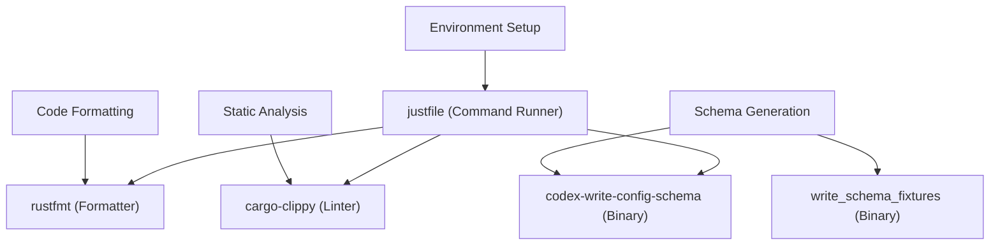

# Development Setup

Relevant source files

-   [.gitignore](https://github.com/openai/codex/blob/d807d44a/.gitignore)
-   [AGENTS.md](https://github.com/openai/codex/blob/d807d44a/AGENTS.md?plain=1)
-   [codex-rs/default.nix](https://github.com/openai/codex/blob/d807d44a/codex-rs/default.nix)
-   [docs/authentication.md](https://github.com/openai/codex/blob/d807d44a/docs/authentication.md?plain=1)
-   [docs/contributing.md](https://github.com/openai/codex/blob/d807d44a/docs/contributing.md?plain=1)
-   [docs/exec.md](https://github.com/openai/codex/blob/d807d44a/docs/exec.md?plain=1)
-   [docs/getting-started.md](https://github.com/openai/codex/blob/d807d44a/docs/getting-started.md?plain=1)
-   [docs/install.md](https://github.com/openai/codex/blob/d807d44a/docs/install.md?plain=1)
-   [docs/license.md](https://github.com/openai/codex/blob/d807d44a/docs/license.md?plain=1)
-   [docs/open-source-fund.md](https://github.com/openai/codex/blob/d807d44a/docs/open-source-fund.md?plain=1)
-   [docs/sandbox.md](https://github.com/openai/codex/blob/d807d44a/docs/sandbox.md?plain=1)
-   [flake.lock](https://github.com/openai/codex/blob/d807d44a/flake.lock)
-   [flake.nix](https://github.com/openai/codex/blob/d807d44a/flake.nix)
-   [justfile](https://github.com/openai/codex/blob/d807d44a/justfile)

## Purpose and Scope

This page documents the development environment setup for the Codex codebase. It covers toolchain requirements, workspace organization, build configuration, development workflows (formatting, linting, fixing), and schema generation.

---

## Prerequisites and Toolchain

The Codex project is a Rust-based monorepo that requires a modern Rust toolchain and platform-specific build dependencies.

### Rust Toolchain

The workspace uses **Rust 2024 edition** as the default for all member crates [codex-rs/Cargo.toml80](https://github.com/openai/codex/blob/d807d44a/codex-rs/Cargo.toml#L80-L80)

### System Dependencies

The build system relies on several native libraries and tools.

| Requirement | Details | Purpose |
| --- | --- | --- |
| **OS** | macOS 12+, Ubuntu 20.04+, or Windows 11 (WSL2) [docs/install.md7](https://github.com/openai/codex/blob/d807d44a/docs/install.md?plain=1#L7-L7) | Supported development environments |
| **Rust** | `rustup`, `rustfmt`, `clippy` [docs/install.md23-26](https://github.com/openai/codex/blob/d807d44a/docs/install.md?plain=1#L23-L26) | Core compiler and standard tooling |
| **Just** | `cargo install just` [docs/install.md28](https://github.com/openai/codex/blob/d807d44a/docs/install.md?plain=1#L28-L28) | Command runner for development tasks |
| **Nextest** | `cargo install cargo-nextest` [docs/install.md30](https://github.com/openai/codex/blob/d807d44a/docs/install.md?plain=1#L30-L30) | Optimized test runner (recommended) |
| **Native Libs** | `cmake`, `openssl`, `pkg-config`, `libcap` (Linux) [codex-rs/default.nix30-38](https://github.com/openai/codex/blob/d807d44a/codex-rs/default.nix#L30-L38) | Dependencies for C-bindings and security |

For Nix users, a `flake.nix` is provided which sets up a complete development shell with `rust-analyzer`, `clang`, and necessary libraries [flake.nix67-85](https://github.com/openai/codex/blob/d807d44a/flake.nix#L67-L85)

**Sources:** [docs/install.md5-30](https://github.com/openai/codex/blob/d807d44a/docs/install.md?plain=1#L5-L30) [codex-rs/default.nix30-38](https://github.com/openai/codex/blob/d807d44a/codex-rs/default.nix#L30-L38) [flake.nix67-85](https://github.com/openai/codex/blob/d807d44a/flake.nix#L67-L85)

---

## Workspace Structure and Build Organization

The Codex codebase is organized as a Cargo workspace with specific crates for the core engine, user interfaces, and specialized tools.

### Key Workspace Members

-   **`codex-cli`**: The main multitool dispatcher and entry point [codex-rs/Cargo.toml13](https://github.com/openai/codex/blob/d807d44a/codex-rs/Cargo.toml#L13-L13)
-   **`codex-core`**: The central agent engine, session management, and tool orchestration [codex-rs/Cargo.toml15](https://github.com/openai/codex/blob/d807d44a/codex-rs/Cargo.toml#L15-L15)
-   **`codex-tui`**: The Terminal User Interface implementation [codex-rs/Cargo.toml63](https://github.com/openai/codex/blob/d807d44a/codex-rs/Cargo.toml#L63-L63)
-   **`codex-app-server`**: The JSON-RPC server for IDE integrations [codex-rs/Cargo.toml6](https://github.com/openai/codex/blob/d807d44a/codex-rs/Cargo.toml#L6-L6)
-   **`codex-mcp-server`**: Implementation of the Model Context Protocol server [codex-rs/Cargo.toml41](https://github.com/openai/codex/blob/d807d44a/codex-rs/Cargo.toml#L41-L41)

### Build Profiles

The workspace defines custom profiles to optimize build times and binary size:

| Profile | Purpose | Optimization |
| --- | --- | --- |
| `dev` | Local development | Fast compilation, incremental [codex-rs/Cargo.toml367](https://github.com/openai/codex/blob/d807d44a/codex-rs/Cargo.toml#L367-L367) |
| `release` | Production binaries | `lto = "fat"`, `strip = "symbols"`, `codegen-units = 1` [codex-rs/Cargo.toml367-372](https://github.com/openai/codex/blob/d807d44a/codex-rs/Cargo.toml#L367-L372) |
| `ci-test` | Continuous Integration | `debug = 1`, inherits from `test` [codex-rs/Cargo.toml374-380](https://github.com/openai/codex/blob/d807d44a/codex-rs/Cargo.toml#L374-L380) |

**Sources:** [codex-rs/Cargo.toml1-80](https://github.com/openai/codex/blob/d807d44a/codex-rs/Cargo.toml#L1-L80) [codex-rs/Cargo.toml367-380](https://github.com/openai/codex/blob/d807d44a/codex-rs/Cargo.toml#L367-L380)

---

## Development Workflows

The project uses `just` as a command runner to standardize common development tasks.

### Core Development Commands

| Command | Action | Implementation |
| --- | --- | --- |
| `just fmt` | Format all code | `cargo fmt -- --config imports_granularity=Item` [justfile27-28](https://github.com/openai/codex/blob/d807d44a/justfile#L27-L28) |
| `just fix` | Run clippy fixes | `cargo clippy --fix --tests --allow-dirty` [justfile30-31](https://github.com/openai/codex/blob/d807d44a/justfile#L30-L31) |
| `just clippy` | Check for lints | `cargo clippy --tests` [justfile33-34](https://github.com/openai/codex/blob/d807d44a/justfile#L33-L34) |
| `just test` | Run tests via nextest | `cargo nextest run --no-fail-fast` [justfile46-47](https://github.com/openai/codex/blob/d807d44a/justfile#L46-L47) |
| `just install` | Fetch dependencies | `rustup show active-toolchain && cargo fetch` [justfile36-38](https://github.com/openai/codex/blob/d807d44a/justfile#L36-L38) |

### Schema Generation

Several crates require generated schemas for configuration or protocol synchronization.

-   **Config Schema**: Generates `config.schema.json` from Rust types [AGENTS.md22](https://github.com/openai/codex/blob/d807d44a/AGENTS.md?plain=1#L22-L22)
    -   Command: `just write-config-schema` [justfile78-79](https://github.com/openai/codex/blob/d807d44a/justfile#L78-L79)
-   **App Server Protocol**: Generates vendored protocol artifacts.
    -   Command: `just write-app-server-schema` [justfile82-83](https://github.com/openai/codex/blob/d807d44a/justfile#L82-L83)
-   **Hooks Schema**: Generates fixtures for the hooks system.
    -   Command: `just write-hooks-schema` [justfile85-87](https://github.com/openai/codex/blob/d807d44a/justfile#L85-L87)

**Sources:** [justfile26-87](https://github.com/openai/codex/blob/d807d44a/justfile#L26-L87) [AGENTS.md22-26](https://github.com/openai/codex/blob/d807d44a/AGENTS.md?plain=1#L22-L26)

---

## Code Conventions and Formatting

### General Rules

-   **Variable Inlining**: Always inline variables into `{}` in `format!` macros [AGENTS.md6](https://github.com/openai/codex/blob/d807d44a/AGENTS.md?plain=1#L6-L6)
-   **Clippy Defaults**: Follow `collapsible_if`, `uninlined_format_args`, and `redundant_closure_for_method_calls` [AGENTS.md11-13](https://github.com/openai/codex/blob/d807d44a/AGENTS.md?plain=1#L11-L13)
-   **Positional Arguments**: Use `/*param_name*/` comments for opaque literals (e.g., `foo(/*is_enabled*/ true)`) [AGENTS.md14-18](https://github.com/openai/codex/blob/d807d44a/AGENTS.md?plain=1#L14-L18)
-   **Module Size**: Target modules under 500 lines of code; extract new modules if a file exceeds 800 lines [AGENTS.md32-40](https://github.com/openai/codex/blob/d807d44a/AGENTS.md?plain=1#L32-L40)

### TUI Styling (Ratatui)

The TUI uses the `Stylize` trait for concise styling [AGENTS.md61](https://github.com/openai/codex/blob/d807d44a/AGENTS.md?plain=1#L61-L61)

-   **Helpers**: Use `.red()`, `.dim()`, `.bold()` instead of manual `Style` structs [AGENTS.md63-70](https://github.com/openai/codex/blob/d807d44a/AGENTS.md?plain=1#L63-L70)
-   **Conversions**: Prefer `"text".into()` for spans and `vec![...].into()` for lines [AGENTS.md71-76](https://github.com/openai/codex/blob/d807d44a/AGENTS.md?plain=1#L71-L76)
-   **Colors**: Avoid hardcoded `.white()`; use the default foreground [AGENTS.md73](https://github.com/openai/codex/blob/d807d44a/AGENTS.md?plain=1#L73-L73)

### Build System Bridge (NL Space to Code Entity Space)

The following diagram maps high-level development concepts to the specific code entities that implement them.

**Sources:** [justfile1-101](https://github.com/openai/codex/blob/d807d44a/justfile#L1-L101) [AGENTS.md1-80](https://github.com/openai/codex/blob/d807d44a/AGENTS.md?plain=1#L1-L80) [codex-rs/Cargo.toml1-400](https://github.com/openai/codex/blob/d807d44a/codex-rs/Cargo.toml#L1-L400)

---

## Integration and Testing Flow

Developers should follow a specific sequence when finalizing changes to ensure stability.

### Development Loop

> **[Mermaid sequence]**
> *(图表结构无法解析)*

### Sandbox Restrictions in Development

When developing or testing tools, be aware of environment-based sandbox flags:

-   `CODEX_SANDBOX_NETWORK_DISABLED=1`: Set automatically when using the `shell` tool [AGENTS.md9](https://github.com/openai/codex/blob/d807d44a/AGENTS.md?plain=1#L9-L9)
-   `CODEX_SANDBOX=seatbelt`: Set when spawning processes via `/usr/bin/sandbox-exec` on macOS [AGENTS.md10](https://github.com/openai/codex/blob/d807d44a/AGENTS.md?plain=1#L10-L10)
-   Tests often check these variables to early-exit if the environment doesn't support the required permissions [AGENTS.md9-10](https://github.com/openai/codex/blob/d807d44a/AGENTS.md?plain=1#L9-L10)

**Sources:** [AGENTS.md8-10](https://github.com/openai/codex/blob/d807d44a/AGENTS.md?plain=1#L8-L10) [AGENTS.md44-51](https://github.com/openai/codex/blob/d807d44a/AGENTS.md?plain=1#L44-L51) [justfile46-48](https://github.com/openai/codex/blob/d807d44a/justfile#L46-L48)
