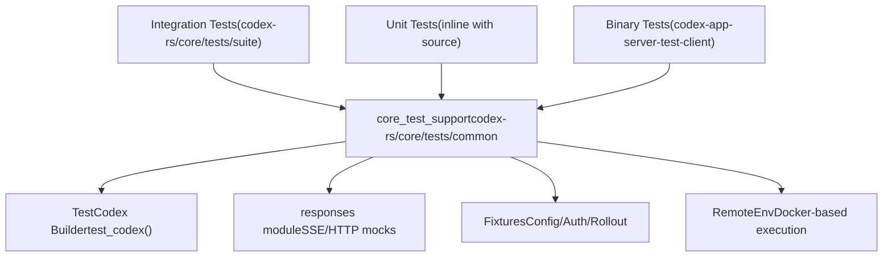
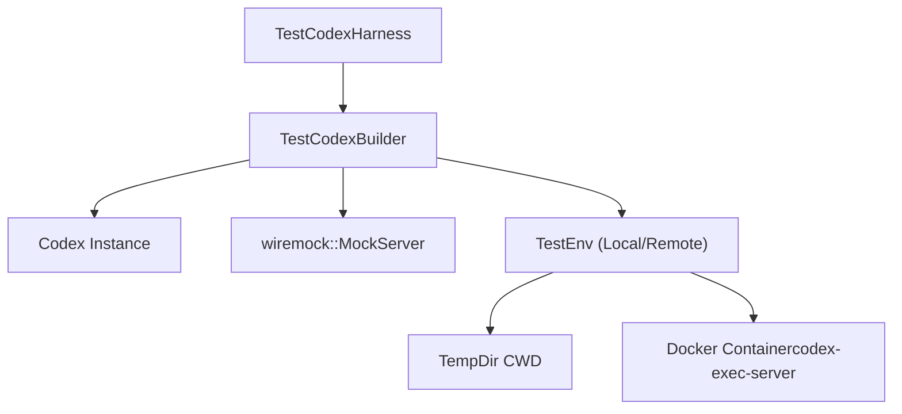

# Testing Infrastructure

Relevant source files

-   [codex-rs/app-server-test-client/Cargo.toml](https://github.com/openai/codex/blob/d807d44a/codex-rs/app-server-test-client/Cargo.toml)
-   [codex-rs/app-server-test-client/README.md](https://github.com/openai/codex/blob/d807d44a/codex-rs/app-server-test-client/README.md?plain=1)
-   [codex-rs/app-server-test-client/src/lib.rs](https://github.com/openai/codex/blob/d807d44a/codex-rs/app-server-test-client/src/lib.rs)
-   [codex-rs/core/tests/common/Cargo.toml](https://github.com/openai/codex/blob/d807d44a/codex-rs/core/tests/common/Cargo.toml)
-   [codex-rs/core/tests/common/lib.rs](https://github.com/openai/codex/blob/d807d44a/codex-rs/core/tests/common/lib.rs)
-   [codex-rs/core/tests/common/test\_codex.rs](https://github.com/openai/codex/blob/d807d44a/codex-rs/core/tests/common/test_codex.rs)
-   [codex-rs/core/tests/suite/apply\_patch\_cli.rs](https://github.com/openai/codex/blob/d807d44a/codex-rs/core/tests/suite/apply_patch_cli.rs)
-   [codex-rs/core/tests/suite/fork\_thread.rs](https://github.com/openai/codex/blob/d807d44a/codex-rs/core/tests/suite/fork_thread.rs)
-   [codex-rs/core/tests/suite/mod.rs](https://github.com/openai/codex/blob/d807d44a/codex-rs/core/tests/suite/mod.rs)
-   [codex-rs/core/tests/suite/remote\_env.rs](https://github.com/openai/codex/blob/d807d44a/codex-rs/core/tests/suite/remote_env.rs)
-   [codex-rs/core/tests/suite/stream\_error\_allows\_next\_turn.rs](https://github.com/openai/codex/blob/d807d44a/codex-rs/core/tests/suite/stream_error_allows_next_turn.rs)
-   [codex-rs/core/tests/suite/stream\_no\_completed.rs](https://github.com/openai/codex/blob/d807d44a/codex-rs/core/tests/suite/stream_no_completed.rs)
-   [scripts/test-remote-env.sh](https://github.com/openai/codex/blob/d807d44a/scripts/test-remote-env.sh)

This document describes the testing infrastructure for the Codex Rust codebase, including test organization, key testing tools, support utilities, and patterns for writing tests. For development environment setup, see [9.1](https://github.com/openai/codex/blob/d807d44a/9.1) For code organization patterns and conventions, see [9.3](https://github.com/openai/codex/blob/d807d44a/9.3)

## Overview

The Codex test infrastructure is built around **cargo nextest** as the primary test runner, with **snapshot testing** (via `insta`) for output validation and **HTTP mocking** (via `wiremock`) for integration tests. Tests are organized into unit tests (inline with source files), integration tests (in `tests/` directories), and test support crates that provide reusable fixtures, mocks, and utilities.

The testing approach emphasizes:

-   **Isolation**: Tests use temporary directories and mock servers to avoid external dependencies.
-   **Reproducibility**: Snapshot testing captures expected outputs for regression detection.
-   **Maintainability**: Shared test utilities reduce boilerplate across test suites.
-   **Speed**: Nextest parallelizes test execution and provides improved output.

Sources: [codex-rs/core/tests/suite/mod.rs1-145](https://github.com/openai/codex/blob/d807d44a/codex-rs/core/tests/suite/mod.rs#L1-L145) [codex-rs/core/tests/common/lib.rs1-161](https://github.com/openai/codex/blob/d807d44a/codex-rs/core/tests/common/lib.rs#L1-L161)

## Test Organization

Sources: [codex-rs/core/tests/suite/mod.rs1-145](https://github.com/openai/codex/blob/d807d44a/codex-rs/core/tests/suite/mod.rs#L1-L145) [codex-rs/core/tests/common/Cargo.toml1-42](https://github.com/openai/codex/blob/d807d44a/codex-rs/core/tests/common/Cargo.toml#L1-L42)

### Integration Tests

Integration tests are aggregated in `codex-rs/core/tests/suite/mod.rs`. This file uses the `#[ctor]` attribute to perform global setup before any tests run, specifically initializing `arg0_dispatch` so that the test binary can behave like the `codex` CLI (e.g., for `apply_patch` or `codex-linux-sandbox` calls) [codex-rs/core/tests/suite/mod.rs17-55](https://github.com/openai/codex/blob/d807d44a/codex-rs/core/tests/suite/mod.rs#L17-L55)

### Test Support Crates

The `core_test_support` crate (located at `codex-rs/core/tests/common`) is the primary provider of shared infrastructure. It includes:

-   **`test_codex`**: A harness for spawning a `Codex` instance with mock configurations [codex-rs/core/tests/common/test\_codex.rs124-149](https://github.com/openai/codex/blob/d807d44a/codex-rs/core/tests/common/test_codex.rs#L124-L149)
-   **`responses`**: Utilities for mounting `wiremock` responses and SSE streams [codex-rs/core/tests/common/lib.rs203-215](https://github.com/openai/codex/blob/d807d44a/codex-rs/core/tests/common/lib.rs#L203-L215)
-   **`process`**: Helpers for managing external processes and `codex-exec-server` [codex-rs/core/tests/common/test\_codex.rs60-91](https://github.com/openai/codex/blob/d807d44a/codex-rs/core/tests/common/test_codex.rs#L60-L91)

Sources: [codex-rs/core/tests/common/lib.rs1-161](https://github.com/openai/codex/blob/d807d44a/codex-rs/core/tests/common/lib.rs#L1-L161) [codex-rs/core/tests/common/test\_codex.rs1-149](https://github.com/openai/codex/blob/d807d44a/codex-rs/core/tests/common/test_codex.rs#L1-L149)

## Key Testing Dependencies

### cargo nextest

The project uses `cargo nextest` for parallelized test execution. It handles the large suite of integration tests efficiently, providing better isolation and retry logic than standard `cargo test`.

### Snapshot Testing (insta)

The `insta` crate is used for snapshot testing. The infrastructure ensures `INSTA_WORKSPACE_ROOT` is set correctly during test initialization so that snapshots are stored in the correct repository location [codex-rs/core/tests/common/lib.rs43-60](https://github.com/openai/codex/blob/d807d44a/codex-rs/core/tests/common/lib.rs#L43-L60)

### HTTP Mocking (wiremock)

`wiremock` is the standard for mocking model provider APIs. It is used to simulate OpenAI-compatible endpoints, including complex SSE streams for streaming responses [codex-rs/core/tests/suite/stream\_no\_completed.rs32-42](https://github.com/openai/codex/blob/d807d44a/codex-rs/core/tests/suite/stream_no_completed.rs#L32-L42)

Sources: [codex-rs/core/tests/common/lib.rs43-60](https://github.com/openai/codex/blob/d807d44a/codex-rs/core/tests/common/lib.rs#L43-L60) [codex-rs/core/tests/common/Cargo.toml35-41](https://github.com/openai/codex/blob/d807d44a/codex-rs/core/tests/common/Cargo.toml#L35-L41)

## Test Support Infrastructure

### TestCodex Builder Pattern

The `TestCodex` and `TestCodexHarness` provide a high-level API for integration tests.

Sources: [codex-rs/core/tests/common/test\_codex.rs94-122](https://github.com/openai/codex/blob/d807d44a/codex-rs/core/tests/common/test_codex.rs#L94-L122) [codex-rs/core/tests/suite/apply\_patch\_cli.rs44-55](https://github.com/openai/codex/blob/d807d44a/codex-rs/core/tests/suite/apply_patch_cli.rs#L44-L55)

### Remote Execution Testing

Codex supports testing against remote environments using Docker. The `TestEnv` struct can initialize a `codex-exec-server` inside a container to verify that tools and shell commands work correctly across network boundaries [codex-rs/core/tests/common/test\_codex.rs124-149](https://github.com/openai/codex/blob/d807d44a/codex-rs/core/tests/common/test_codex.rs#L124-L149)

Key components:

-   **`start_remote_exec_server`**: Deploys the `codex-exec-server` binary to a container and starts it [codex-rs/core/tests/common/test\_codex.rs156-199](https://github.com/openai/codex/blob/d807d44a/codex-rs/core/tests/common/test_codex.rs#L156-L199)
-   **`scripts/test-remote-env.sh`**: A helper script to set up the environment for manual or CI testing [scripts/test-remote-env.sh18-54](https://github.com/openai/codex/blob/d807d44a/scripts/test-remote-env.sh#L18-L54)

Sources: [codex-rs/core/tests/common/test\_codex.rs156-199](https://github.com/openai/codex/blob/d807d44a/codex-rs/core/tests/common/test_codex.rs#L156-L199) [scripts/test-remote-env.sh1-79](https://github.com/openai/codex/blob/d807d44a/scripts/test-remote-env.sh#L1-L79)

### SSE Mocking Utilities

Tests often need to simulate incomplete or erroneous streams to verify agent robustness.

-   **`load_sse_fixture`**: Converts a JSON array of events into a valid SSE stream body [codex-rs/core/tests/common/lib.rs203-215](https://github.com/openai/codex/blob/d807d44a/codex-rs/core/tests/common/lib.rs#L203-L215)
-   **`StreamingSseServer`**: A specialized wrapper around `wiremock` for testing mid-stream failures and retries [codex-rs/core/tests/suite/stream\_no\_completed.rs32-42](https://github.com/openai/codex/blob/d807d44a/codex-rs/core/tests/suite/stream_no_completed.rs#L32-L42)

Sources: [codex-rs/core/tests/common/lib.rs203-215](https://github.com/openai/codex/blob/d807d44a/codex-rs/core/tests/common/lib.rs#L203-L215) [codex-rs/core/tests/suite/stream\_no\_completed.rs1-100](https://github.com/openai/codex/blob/d807d44a/codex-rs/core/tests/suite/stream_no_completed.rs#L1-L100)

## Common Testing Patterns

### Multi-Operation Integration

Tests like `apply_patch_cli_multiple_operations_integration` verify complex tool workflows by:

1.  Seeding a temporary workspace with files [codex-rs/core/tests/suite/apply\_patch\_cli.rs103-106](https://github.com/openai/codex/blob/d807d44a/codex-rs/core/tests/suite/apply_patch_cli.rs#L103-L106)
2.  Mocking a model response that calls a tool (e.g., `apply_patch`) [codex-rs/core/tests/suite/apply\_patch\_cli.rs111-113](https://github.com/openai/codex/blob/d807d44a/codex-rs/core/tests/suite/apply_patch_cli.rs#L111-L113)
3.  Verifying the filesystem state and CLI output using regex matchers [codex-rs/core/tests/suite/apply\_patch\_cli.rs115-133](https://github.com/openai/codex/blob/d807d44a/codex-rs/core/tests/suite/apply_patch_cli.rs#L115-L133)

### Thread Forking and Rollout Validation

Integration tests verify that forking a thread correctly truncates history. The test `fork_thread_twice_drops_to_first_message` performs multiple turns, forks the thread at specific indices, and inspects the resulting `.jsonl` rollout files to ensure the `RolloutItem` sequence matches expectations [codex-rs/core/tests/suite/fork\_thread.rs21-151](https://github.com/openai/codex/blob/d807d44a/codex-rs/core/tests/suite/fork_thread.rs#L21-L151)

Sources: [codex-rs/core/tests/suite/apply\_patch\_cli.rs95-135](https://github.com/openai/codex/blob/d807d44a/codex-rs/core/tests/suite/apply_patch_cli.rs#L95-L135) [codex-rs/core/tests/suite/fork\_thread.rs21-151](https://github.com/openai/codex/blob/d807d44a/codex-rs/core/tests/suite/fork_thread.rs#L21-L151)

### App Server Testing

The `codex-app-server-test-client` is a dedicated utility for testing the JSON-RPC protocol. It can:

-   Start the `app-server` as a child process [codex-rs/app-server-test-client/src/lib.rs110-113](https://github.com/openai/codex/blob/d807d44a/codex-rs/app-server-test-client/src/lib.rs#L110-L113)
-   Send V2 protocol messages like `SendMessageV2` or `ThreadResume` [codex-rs/app-server-test-client/src/lib.rs168-185](https://github.com/openai/codex/blob/d807d44a/codex-rs/app-server-test-client/src/lib.rs#L168-L185)
-   Watch raw inbound traffic for debugging protocol transitions [codex-rs/app-server-test-client/README.md21-28](https://github.com/openai/codex/blob/d807d44a/codex-rs/app-server-test-client/README.md?plain=1#L21-L28)

Sources: [codex-rs/app-server-test-client/src/lib.rs1-185](https://github.com/openai/codex/blob/d807d44a/codex-rs/app-server-test-client/src/lib.rs#L1-L185) [codex-rs/app-server-test-client/README.md1-59](https://github.com/openai/codex/blob/d807d44a/codex-rs/app-server-test-client/README.md?plain=1#L1-L59)

## Test Configuration and Environment

### Deterministic IDs

To make snapshots and logs reproducible, tests use a global `#[ctor]` to enable deterministic process IDs and thread manager test modes [codex-rs/core/tests/common/lib.rs31-35](https://github.com/openai/codex/blob/d807d44a/codex-rs/core/tests/common/lib.rs#L31-L35)

### Config Overrides

Tests use `ConfigBuilder` with `harness_overrides` to ensure that paths like `codex_linux_sandbox_exe` point to the test-built binaries rather than system-installed ones [codex-rs/core/tests/common/lib.rs154-171](https://github.com/openai/codex/blob/d807d44a/codex-rs/core/tests/common/lib.rs#L154-L171)

Sources: [codex-rs/core/tests/common/lib.rs31-40](https://github.com/openai/codex/blob/d807d44a/codex-rs/core/tests/common/lib.rs#L31-L40) [codex-rs/core/tests/common/lib.rs154-171](https://github.com/openai/codex/blob/d807d44a/codex-rs/core/tests/common/lib.rs#L154-L171)
