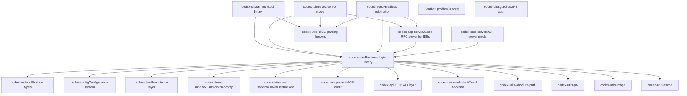
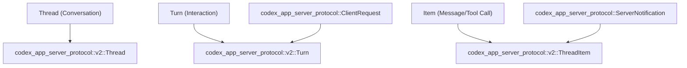
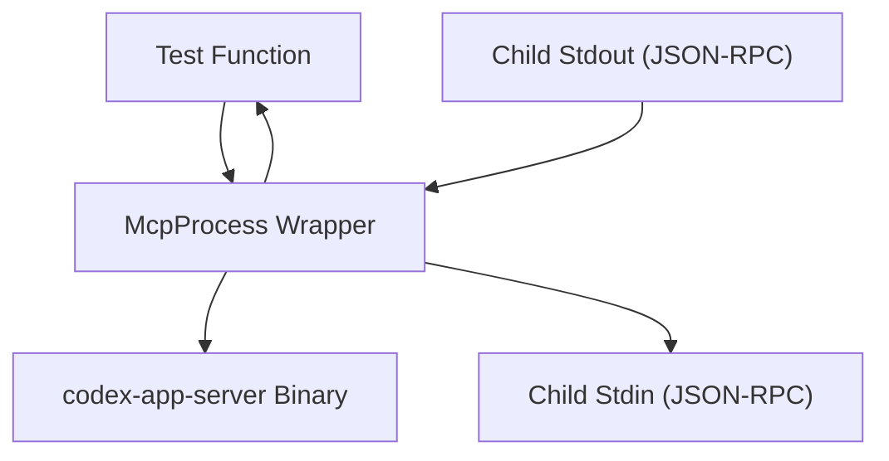

# Code Organization Patterns

Relevant source files

-   [AGENTS.md](https://github.com/openai/codex/blob/d807d44a/AGENTS.md?plain=1)
-   [codex-rs/app-server-protocol/schema/json/ClientRequest.json](https://github.com/openai/codex/blob/d807d44a/codex-rs/app-server-protocol/schema/json/ClientRequest.json)
-   [codex-rs/app-server-protocol/schema/json/ServerNotification.json](https://github.com/openai/codex/blob/d807d44a/codex-rs/app-server-protocol/schema/json/ServerNotification.json)
-   [codex-rs/app-server-protocol/schema/json/codex\_app\_server\_protocol.schemas.json](https://github.com/openai/codex/blob/d807d44a/codex-rs/app-server-protocol/schema/json/codex_app_server_protocol.schemas.json)
-   [codex-rs/app-server-protocol/schema/json/codex\_app\_server\_protocol.v2.schemas.json](https://github.com/openai/codex/blob/d807d44a/codex-rs/app-server-protocol/schema/json/codex_app_server_protocol.v2.schemas.json)
-   [codex-rs/app-server-protocol/schema/typescript/ServerNotification.ts](https://github.com/openai/codex/blob/d807d44a/codex-rs/app-server-protocol/schema/typescript/ServerNotification.ts)
-   [codex-rs/app-server-protocol/schema/typescript/v2/index.ts](https://github.com/openai/codex/blob/d807d44a/codex-rs/app-server-protocol/schema/typescript/v2/index.ts)
-   [codex-rs/app-server-protocol/src/protocol/common.rs](https://github.com/openai/codex/blob/d807d44a/codex-rs/app-server-protocol/src/protocol/common.rs)
-   [codex-rs/app-server-protocol/src/protocol/v2.rs](https://github.com/openai/codex/blob/d807d44a/codex-rs/app-server-protocol/src/protocol/v2.rs)
-   [codex-rs/app-server/README.md](https://github.com/openai/codex/blob/d807d44a/codex-rs/app-server/README.md?plain=1)
-   [codex-rs/app-server/src/bespoke\_event\_handling.rs](https://github.com/openai/codex/blob/d807d44a/codex-rs/app-server/src/bespoke_event_handling.rs)
-   [codex-rs/app-server/src/codex\_message\_processor.rs](https://github.com/openai/codex/blob/d807d44a/codex-rs/app-server/src/codex_message_processor.rs)
-   [codex-rs/app-server/tests/common/mcp\_process.rs](https://github.com/openai/codex/blob/d807d44a/codex-rs/app-server/tests/common/mcp_process.rs)
-   [codex-rs/app-server/tests/suite/v2/mod.rs](https://github.com/openai/codex/blob/d807d44a/codex-rs/app-server/tests/suite/v2/mod.rs)
-   [docs/authentication.md](https://github.com/openai/codex/blob/d807d44a/docs/authentication.md?plain=1)
-   [docs/contributing.md](https://github.com/openai/codex/blob/d807d44a/docs/contributing.md?plain=1)
-   [docs/exec.md](https://github.com/openai/codex/blob/d807d44a/docs/exec.md?plain=1)
-   [docs/getting-started.md](https://github.com/openai/codex/blob/d807d44a/docs/getting-started.md?plain=1)
-   [docs/install.md](https://github.com/openai/codex/blob/d807d44a/docs/install.md?plain=1)
-   [docs/license.md](https://github.com/openai/codex/blob/d807d44a/docs/license.md?plain=1)
-   [docs/open-source-fund.md](https://github.com/openai/codex/blob/d807d44a/docs/open-source-fund.md?plain=1)
-   [docs/sandbox.md](https://github.com/openai/codex/blob/d807d44a/docs/sandbox.md?plain=1)
-   [justfile](https://github.com/openai/codex/blob/d807d44a/justfile)

## Purpose and Scope

This page documents the code organization patterns, conventions, and architectural guidelines used throughout the Codex Rust codebase. It covers workspace structure, crate categorization, module organization, platform-specific code handling, and code quality enforcement mechanisms.

Key architectural drivers include the **AGENTS.md** conventions for AI-assisted development, the **app-server protocol v2** for IDE integrations, and strict **Clippy** enforcement at the workspace level.

---

## Workspace Structure and Crate Categorization

The Codex codebase is organized as a Cargo workspace containing 71+ crates, each with a focused responsibility. The workspace root [codex-rs/Cargo.toml1-395](https://github.com/openai/codex/blob/d807d44a/codex-rs/Cargo.toml#L1-L395) defines shared dependencies, lints, and build profiles.

### Crate Categories


**Sources:** [codex-rs/Cargo.toml1-71](https://github.com/openai/codex/blob/d807d44a/codex-rs/Cargo.toml#L1-L71) [codex-rs/app-server/README.md1-12](https://github.com/openai/codex/blob/d807d44a/codex-rs/app-server/README.md?plain=1#L1-L12)

### Workspace-Level Configuration

The workspace enforces consistency through centralized configuration in the root `Cargo.toml`.

| Configuration Type | Location | Purpose |
| --- | --- | --- |
| **Edition** | `workspace.edition = "2024"` | Rust 2024 edition for all crates |
| **Version** | `workspace.version = "0.0.0"` | Unified version across workspace |
| **Dependencies** | `[workspace.dependencies]` | Single source of truth for versions |
| **Lints** | `[workspace.lints.clippy]` | Strict clippy rules enforced |
| **Build Profiles** | `[profile.release]`, `[profile.ci-test]` | Optimized release builds, fast CI builds |

**Sources:** [codex-rs/Cargo.toml74-81](https://github.com/openai/codex/blob/d807d44a/codex-rs/Cargo.toml#L74-L81) [codex-rs/Cargo.toml367-380](https://github.com/openai/codex/blob/d807d44a/codex-rs/Cargo.toml#L367-L380)

---

## AGENTS.md Conventions

The `AGENTS.md` file defines critical development patterns and safety rules that must be followed by both human and AI contributors.

### Core Development Rules

-   **Module Size:** Target Rust modules under 500 LoC. If a file exceeds 800 LoC, functionality must be moved to a new module [AGENTS.md32-37](https://github.com/openai/codex/blob/d807d44a/AGENTS.md?plain=1#L32-L37)
-   **Safety Restrictions:** Never modify code related to `CODEX_SANDBOX_NETWORK_DISABLED_ENV_VAR` or `CODEX_SANDBOX_ENV_VAR` as these govern the execution environment security [AGENTS.md8-10](https://github.com/openai/codex/blob/d807d44a/AGENTS.md?plain=1#L8-L10)
-   **Explicit Arguments:** Use `/*param_name*/` comments before opaque literal arguments (e.g., `None`, `false`) to maintain readability [AGENTS.md15-18](https://github.com/openai/codex/blob/d807d44a/AGENTS.md?plain=1#L15-L18)
-   **Dependency Management:** Changes to `Cargo.toml` require running `just bazel-lock-update` to keep the Bazel build synchronized [AGENTS.md23-26](https://github.com/openai/codex/blob/d807d44a/AGENTS.md?plain=1#L23-L26)

### TUI Style Guidelines

-   **Stylize Trait:** Prefer `ratatui`'s `Stylize` trait helpers (e.g., `.red()`, `.dim()`) over manual `Style` construction [AGENTS.md61-64](https://github.com/openai/codex/blob/d807d44a/AGENTS.md?plain=1#L61-L64)
-   **Color Usage:** Avoid hardcoded `.white()`; use the default foreground instead [AGENTS.md73-74](https://github.com/openai/codex/blob/d807d44a/AGENTS.md?plain=1#L73-L74)

**Sources:** [AGENTS.md1-80](https://github.com/openai/codex/blob/d807d44a/AGENTS.md?plain=1#L1-L80)

---

## App Server Protocol v2 Patterns

The `codex-app-server` implements a JSON-RPC 2.0 bidirectional protocol [codex-rs/app-server/README.md20-25](https://github.com/openai/codex/blob/d807d44a/codex-rs/app-server/README.md?plain=1#L20-L25) Version 2 of the protocol focuses on camelCase serialization and clear separation from core types.

### Protocol Layering

The protocol is split into `common`, `v1`, and `v2` modules. `v2` types often mirror core types but with API-friendly naming [codex-rs/app-server-protocol/src/protocol/v2.rs100-129](https://github.com/openai/codex/blob/d807d44a/codex-rs/app-server-protocol/src/protocol/v2.rs#L100-L129)


**Sources:** [codex-rs/app-server-protocol/src/protocol/v2.rs1-150](https://github.com/openai/codex/blob/d807d44a/codex-rs/app-server-protocol/src/protocol/v2.rs#L1-L150) [codex-rs/app-server/README.md57-66](https://github.com/openai/codex/blob/d807d44a/codex-rs/app-server/README.md?plain=1#L57-L66)

### Message Processing and Translation

The `CodexMessageProcessor` routes incoming JSON-RPC requests to core functions [codex-rs/app-server/src/codex\_message\_processor.rs1-100](https://github.com/openai/codex/blob/d807d44a/codex-rs/app-server/src/codex_message_processor.rs#L1-L100) Bespoke event handling translates core `EventMsg` items into protocol-compliant notifications [codex-rs/app-server/src/bespoke\_event\_handling.rs1-106](https://github.com/openai/codex/blob/d807d44a/codex-rs/app-server/src/bespoke_event_handling.rs#L1-L106)

**Sources:** [codex-rs/app-server/src/codex\_message\_processor.rs1-40](https://github.com/openai/codex/blob/d807d44a/codex-rs/app-server/src/codex_message_processor.rs#L1-L40) [codex-rs/app-server/src/bespoke\_event\_handling.rs97-125](https://github.com/openai/codex/blob/d807d44a/codex-rs/app-server/src/bespoke_event_handling.rs#L97-L125)

---

## Code Quality and Enforcement

### Workspace-Level Lints

The workspace enforces strict Clippy rules to ensure safety and code consistency.

```
[workspace.lints.clippy]expect_used = "deny"          # Force error handlingunwrap_used = "deny"          # Prevent panicsmanual_clamp = "deny"         # Use idiomatic Rustuninlined_format_args = "deny" # AGENTS.md requirement
```
**Sources:** [codex-rs/Cargo.toml319-356](https://github.com/openai/codex/blob/d807d44a/codex-rs/Cargo.toml#L319-L356) [AGENTS.md11-14](https://github.com/openai/codex/blob/d807d44a/AGENTS.md?plain=1#L11-L14)

### Library vs. Exec Mode Discipline

-   **Core/TUI:** Prevent direct console writes to ensure all logs go through the tracing subscriber [codex-rs/core/src/lib.rs4-6](https://github.com/openai/codex/blob/d807d44a/codex-rs/core/src/lib.rs#L4-L6)
-   **Exec Mode:** Strictly controls stdout to ensure machine-parseable output (JSONL) is not corrupted by logging [codex-rs/exec/src/lib.rs1-5](https://github.com/openai/codex/blob/d807d44a/codex-rs/exec/src/lib.rs#L1-L5)

---

## Testing Infrastructure Patterns

Tests are organized into integration suites that often spawn the `codex-app-server` binary to verify end-to-end protocol behavior.

### The McpProcess Pattern

Tests use the `McpProcess` struct to manage the lifecycle of a background app-server instance [codex-rs/app-server/tests/common/mcp\_process.rs83-93](https://github.com/openai/codex/blob/d807d44a/codex-rs/app-server/tests/common/mcp_process.rs#L83-L93)


**Sources:** [codex-rs/app-server/tests/common/mcp\_process.rs123-150](https://github.com/openai/codex/blob/d807d44a/codex-rs/app-server/tests/common/mcp_process.rs#L123-L150) [codex-rs/app-server/tests/suite/v2/mod.rs1-20](https://github.com/openai/codex/blob/d807d44a/codex-rs/app-server/tests/suite/v2/mod.rs#L1-L20)

---

## Summary of Patterns

1.  **Crate Prefixes:** All internal crates use the `codex-` prefix (e.g., `codex-core`, `codex-tui`) [AGENTS.md5](https://github.com/openai/codex/blob/d807d44a/AGENTS.md?plain=1#L5-L5)
2.  **Flat Module Declarations:** Core crates declare modules at the root level and re-export types for a clean public API [codex-rs/core/src/lib.rs1-178](https://github.com/openai/codex/blob/d807d44a/codex-rs/core/src/lib.rs#L1-L178)
3.  **Protocol v2 Handshake:** Clients must call `initialize` before any other RPC method [codex-rs/app-server/README.md69-75](https://github.com/openai/codex/blob/d807d44a/codex-rs/app-server/README.md?plain=1#L69-L75)
4.  **Conditional Compilation:** Platform-specific logic (Sandboxing, Keyring) is gated by `target_os` attributes in `Cargo.toml` [codex-rs/core/Cargo.toml120-147](https://github.com/openai/codex/blob/d807d44a/codex-rs/core/Cargo.toml#L120-L147)

**Sources:** [AGENTS.md1-80](https://github.com/openai/codex/blob/d807d44a/AGENTS.md?plain=1#L1-L80) [codex-rs/Cargo.toml1-395](https://github.com/openai/codex/blob/d807d44a/codex-rs/Cargo.toml#L1-L395) [codex-rs/app-server/README.md1-150](https://github.com/openai/codex/blob/d807d44a/codex-rs/app-server/README.md?plain=1#L1-L150)
