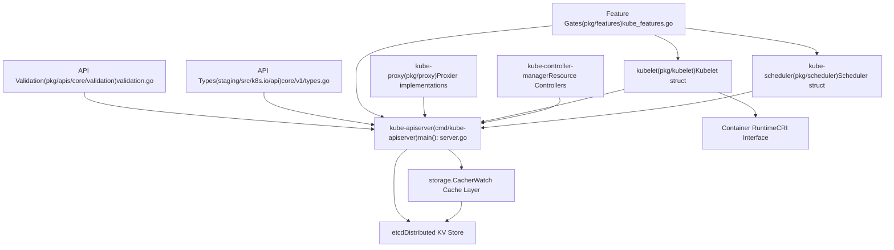
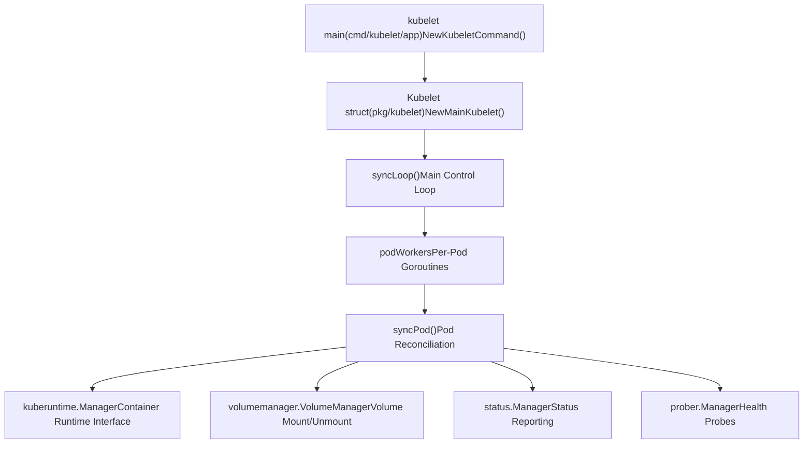
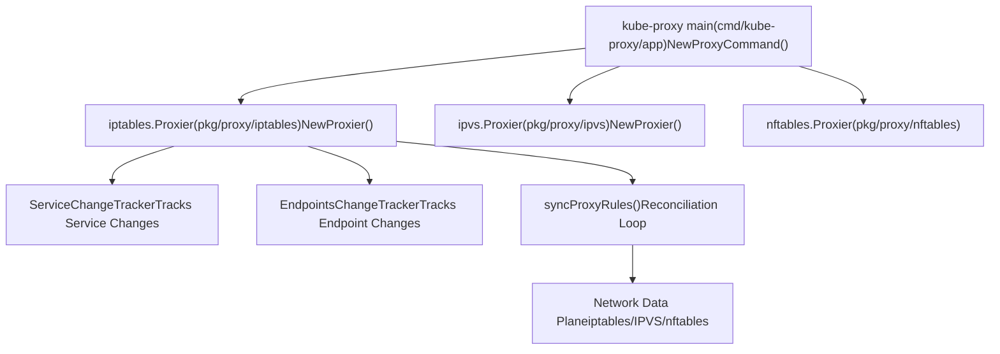
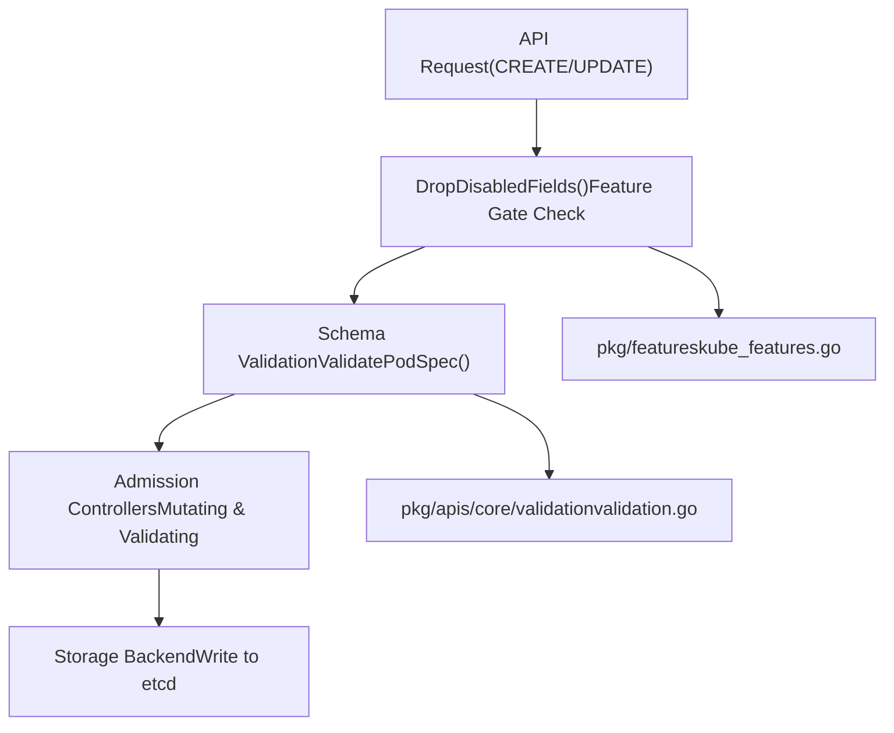
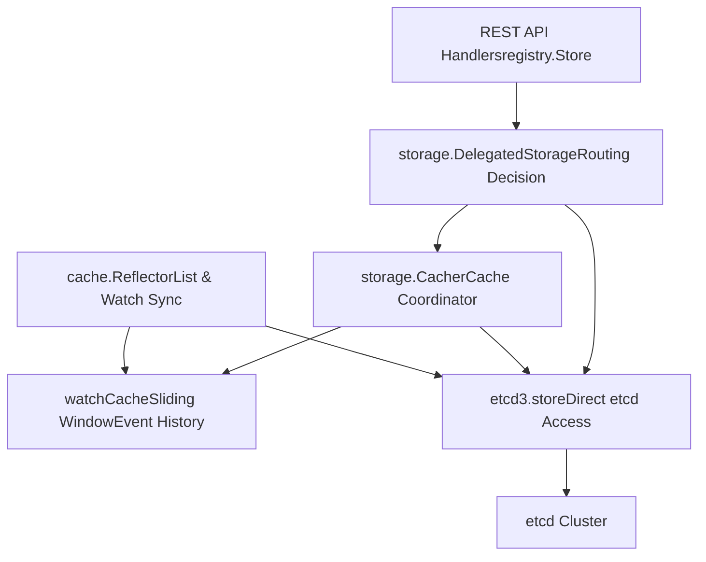

# Overview

Relevant source files

-   [api/openapi-spec/swagger.json](https://github.com/kubernetes/kubernetes/blob/2757a872/api/openapi-spec/swagger.json)
-   [api/openapi-spec/v3/api\_\_v1\_openapi.json](https://github.com/kubernetes/kubernetes/blob/2757a872/api/openapi-spec/v3/api__v1_openapi.json)
-   [api/openapi-spec/v3/apis\_\_admissionregistration.k8s.io\_\_v1\_openapi.json](https://github.com/kubernetes/kubernetes/blob/2757a872/api/openapi-spec/v3/apis__admissionregistration.k8s.io__v1_openapi.json)
-   [api/openapi-spec/v3/apis\_\_apiextensions.k8s.io\_\_v1\_openapi.json](https://github.com/kubernetes/kubernetes/blob/2757a872/api/openapi-spec/v3/apis__apiextensions.k8s.io__v1_openapi.json)
-   [api/openapi-spec/v3/apis\_\_apps\_\_v1\_openapi.json](https://github.com/kubernetes/kubernetes/blob/2757a872/api/openapi-spec/v3/apis__apps__v1_openapi.json)
-   [api/openapi-spec/v3/apis\_\_autoscaling\_\_v1\_openapi.json](https://github.com/kubernetes/kubernetes/blob/2757a872/api/openapi-spec/v3/apis__autoscaling__v1_openapi.json)
-   [api/openapi-spec/v3/apis\_\_autoscaling\_\_v2\_openapi.json](https://github.com/kubernetes/kubernetes/blob/2757a872/api/openapi-spec/v3/apis__autoscaling__v2_openapi.json)
-   [api/openapi-spec/v3/apis\_\_batch\_\_v1\_openapi.json](https://github.com/kubernetes/kubernetes/blob/2757a872/api/openapi-spec/v3/apis__batch__v1_openapi.json)
-   [api/openapi-spec/v3/apis\_\_certificates.k8s.io\_\_v1\_openapi.json](https://github.com/kubernetes/kubernetes/blob/2757a872/api/openapi-spec/v3/apis__certificates.k8s.io__v1_openapi.json)
-   [api/openapi-spec/v3/apis\_\_coordination.k8s.io\_\_v1\_openapi.json](https://github.com/kubernetes/kubernetes/blob/2757a872/api/openapi-spec/v3/apis__coordination.k8s.io__v1_openapi.json)
-   [api/openapi-spec/v3/apis\_\_internal.apiserver.k8s.io\_\_v1alpha1\_openapi.json](https://github.com/kubernetes/kubernetes/blob/2757a872/api/openapi-spec/v3/apis__internal.apiserver.k8s.io__v1alpha1_openapi.json)
-   [api/openapi-spec/v3/apis\_\_networking.k8s.io\_\_v1\_openapi.json](https://github.com/kubernetes/kubernetes/blob/2757a872/api/openapi-spec/v3/apis__networking.k8s.io__v1_openapi.json)
-   [api/openapi-spec/v3/apis\_\_node.k8s.io\_\_v1\_openapi.json](https://github.com/kubernetes/kubernetes/blob/2757a872/api/openapi-spec/v3/apis__node.k8s.io__v1_openapi.json)
-   [api/openapi-spec/v3/apis\_\_policy\_\_v1\_openapi.json](https://github.com/kubernetes/kubernetes/blob/2757a872/api/openapi-spec/v3/apis__policy__v1_openapi.json)
-   [api/openapi-spec/v3/apis\_\_rbac.authorization.k8s.io\_\_v1\_openapi.json](https://github.com/kubernetes/kubernetes/blob/2757a872/api/openapi-spec/v3/apis__rbac.authorization.k8s.io__v1_openapi.json)
-   [api/openapi-spec/v3/apis\_\_storage.k8s.io\_\_v1\_openapi.json](https://github.com/kubernetes/kubernetes/blob/2757a872/api/openapi-spec/v3/apis__storage.k8s.io__v1_openapi.json)
-   [cmd/kube-apiserver/app/options/options.go](https://github.com/kubernetes/kubernetes/blob/2757a872/cmd/kube-apiserver/app/options/options.go)
-   [cmd/kube-apiserver/app/options/options\_test.go](https://github.com/kubernetes/kubernetes/blob/2757a872/cmd/kube-apiserver/app/options/options_test.go)
-   [cmd/kube-apiserver/app/options/validation.go](https://github.com/kubernetes/kubernetes/blob/2757a872/cmd/kube-apiserver/app/options/validation.go)
-   [cmd/kube-apiserver/app/options/validation\_test.go](https://github.com/kubernetes/kubernetes/blob/2757a872/cmd/kube-apiserver/app/options/validation_test.go)
-   [cmd/kube-apiserver/app/server.go](https://github.com/kubernetes/kubernetes/blob/2757a872/cmd/kube-apiserver/app/server.go)
-   [cmd/kube-proxy/app/options.go](https://github.com/kubernetes/kubernetes/blob/2757a872/cmd/kube-proxy/app/options.go)
-   [cmd/kube-proxy/app/options\_test.go](https://github.com/kubernetes/kubernetes/blob/2757a872/cmd/kube-proxy/app/options_test.go)
-   [cmd/kube-proxy/app/server.go](https://github.com/kubernetes/kubernetes/blob/2757a872/cmd/kube-proxy/app/server.go)
-   [cmd/kube-proxy/app/server\_linux.go](https://github.com/kubernetes/kubernetes/blob/2757a872/cmd/kube-proxy/app/server_linux.go)
-   [cmd/kube-proxy/app/server\_linux\_test.go](https://github.com/kubernetes/kubernetes/blob/2757a872/cmd/kube-proxy/app/server_linux_test.go)
-   [cmd/kube-proxy/app/server\_test.go](https://github.com/kubernetes/kubernetes/blob/2757a872/cmd/kube-proxy/app/server_test.go)
-   [cmd/kube-proxy/app/server\_windows.go](https://github.com/kubernetes/kubernetes/blob/2757a872/cmd/kube-proxy/app/server_windows.go)
-   [cmd/kube-scheduler/app/server\_test.go](https://github.com/kubernetes/kubernetes/blob/2757a872/cmd/kube-scheduler/app/server_test.go)
-   [cmd/kubelet/app/server.go](https://github.com/kubernetes/kubernetes/blob/2757a872/cmd/kubelet/app/server.go)
-   [cmd/kubemark/hollow-node.go](https://github.com/kubernetes/kubernetes/blob/2757a872/cmd/kubemark/hollow-node.go)
-   [pkg/api/pod/util.go](https://github.com/kubernetes/kubernetes/blob/2757a872/pkg/api/pod/util.go)
-   [pkg/api/pod/util\_test.go](https://github.com/kubernetes/kubernetes/blob/2757a872/pkg/api/pod/util_test.go)
-   [pkg/api/v1/pod/util.go](https://github.com/kubernetes/kubernetes/blob/2757a872/pkg/api/v1/pod/util.go)
-   [pkg/api/v1/pod/util\_test.go](https://github.com/kubernetes/kubernetes/blob/2757a872/pkg/api/v1/pod/util_test.go)
-   [pkg/apis/core/fuzzer/fuzzer.go](https://github.com/kubernetes/kubernetes/blob/2757a872/pkg/apis/core/fuzzer/fuzzer.go)
-   [pkg/apis/core/types.go](https://github.com/kubernetes/kubernetes/blob/2757a872/pkg/apis/core/types.go)
-   [pkg/apis/core/v1/defaults.go](https://github.com/kubernetes/kubernetes/blob/2757a872/pkg/apis/core/v1/defaults.go)
-   [pkg/apis/core/v1/defaults\_test.go](https://github.com/kubernetes/kubernetes/blob/2757a872/pkg/apis/core/v1/defaults_test.go)
-   [pkg/apis/core/v1/zz\_generated.conversion.go](https://github.com/kubernetes/kubernetes/blob/2757a872/pkg/apis/core/v1/zz_generated.conversion.go)
-   [pkg/apis/core/validation/validation.go](https://github.com/kubernetes/kubernetes/blob/2757a872/pkg/apis/core/validation/validation.go)
-   [pkg/apis/core/validation/validation\_test.go](https://github.com/kubernetes/kubernetes/blob/2757a872/pkg/apis/core/validation/validation_test.go)
-   [pkg/apis/core/zz\_generated.deepcopy.go](https://github.com/kubernetes/kubernetes/blob/2757a872/pkg/apis/core/zz_generated.deepcopy.go)
-   [pkg/controlplane/controller/defaultservicecidr/OWNERS](https://github.com/kubernetes/kubernetes/blob/2757a872/pkg/controlplane/controller/defaultservicecidr/OWNERS)
-   [pkg/controlplane/controller/defaultservicecidr/default\_servicecidr\_controller.go](https://github.com/kubernetes/kubernetes/blob/2757a872/pkg/controlplane/controller/defaultservicecidr/default_servicecidr_controller.go)
-   [pkg/controlplane/controller/defaultservicecidr/default\_servicecidr\_controller\_test.go](https://github.com/kubernetes/kubernetes/blob/2757a872/pkg/controlplane/controller/defaultservicecidr/default_servicecidr_controller_test.go)
-   [pkg/features/kube\_features.go](https://github.com/kubernetes/kubernetes/blob/2757a872/pkg/features/kube_features.go)
-   [pkg/generated/openapi/zz\_generated.openapi.go](https://github.com/kubernetes/kubernetes/blob/2757a872/pkg/generated/openapi/zz_generated.openapi.go)
-   [pkg/kubeapiserver/options/serving.go](https://github.com/kubernetes/kubernetes/blob/2757a872/pkg/kubeapiserver/options/serving.go)
-   [pkg/kubelet/allocation/allocation\_manager.go](https://github.com/kubernetes/kubernetes/blob/2757a872/pkg/kubelet/allocation/allocation_manager.go)
-   [pkg/kubelet/allocation/allocation\_manager\_test.go](https://github.com/kubernetes/kubernetes/blob/2757a872/pkg/kubelet/allocation/allocation_manager_test.go)
-   [pkg/kubelet/allocation/features\_linux.go](https://github.com/kubernetes/kubernetes/blob/2757a872/pkg/kubelet/allocation/features_linux.go)
-   [pkg/kubelet/allocation/features\_unsupported.go](https://github.com/kubernetes/kubernetes/blob/2757a872/pkg/kubelet/allocation/features_unsupported.go)
-   [pkg/kubelet/allocation/features\_windows.go](https://github.com/kubernetes/kubernetes/blob/2757a872/pkg/kubelet/allocation/features_windows.go)
-   [pkg/kubelet/allocation/state/checkpoint.go](https://github.com/kubernetes/kubernetes/blob/2757a872/pkg/kubelet/allocation/state/checkpoint.go)
-   [pkg/kubelet/allocation/state/state.go](https://github.com/kubernetes/kubernetes/blob/2757a872/pkg/kubelet/allocation/state/state.go)
-   [pkg/kubelet/allocation/state/state\_checkpoint.go](https://github.com/kubernetes/kubernetes/blob/2757a872/pkg/kubelet/allocation/state/state_checkpoint.go)
-   [pkg/kubelet/allocation/state/state\_checkpoint\_test.go](https://github.com/kubernetes/kubernetes/blob/2757a872/pkg/kubelet/allocation/state/state_checkpoint_test.go)
-   [pkg/kubelet/allocation/state/state\_mem.go](https://github.com/kubernetes/kubernetes/blob/2757a872/pkg/kubelet/allocation/state/state_mem.go)
-   [pkg/kubelet/container/helpers.go](https://github.com/kubernetes/kubernetes/blob/2757a872/pkg/kubelet/container/helpers.go)
-   [pkg/kubelet/container/helpers\_test.go](https://github.com/kubernetes/kubernetes/blob/2757a872/pkg/kubelet/container/helpers_test.go)
-   [pkg/kubelet/container/runtime.go](https://github.com/kubernetes/kubernetes/blob/2757a872/pkg/kubelet/container/runtime.go)
-   [pkg/kubelet/container/testing/fake\_cache.go](https://github.com/kubernetes/kubernetes/blob/2757a872/pkg/kubelet/container/testing/fake_cache.go)
-   [pkg/kubelet/container/testing/fake\_runtime.go](https://github.com/kubernetes/kubernetes/blob/2757a872/pkg/kubelet/container/testing/fake_runtime.go)
-   [pkg/kubelet/container/testing/fake\_runtime\_helper.go](https://github.com/kubernetes/kubernetes/blob/2757a872/pkg/kubelet/container/testing/fake_runtime_helper.go)
-   [pkg/kubelet/container/testing/mocks.go](https://github.com/kubernetes/kubernetes/blob/2757a872/pkg/kubelet/container/testing/mocks.go)
-   [pkg/kubelet/images/helpers.go](https://github.com/kubernetes/kubernetes/blob/2757a872/pkg/kubelet/images/helpers.go)
-   [pkg/kubelet/images/image\_manager.go](https://github.com/kubernetes/kubernetes/blob/2757a872/pkg/kubelet/images/image_manager.go)
-   [pkg/kubelet/images/image\_manager\_test.go](https://github.com/kubernetes/kubernetes/blob/2757a872/pkg/kubelet/images/image_manager_test.go)
-   [pkg/kubelet/images/puller.go](https://github.com/kubernetes/kubernetes/blob/2757a872/pkg/kubelet/images/puller.go)
-   [pkg/kubelet/images/types.go](https://github.com/kubernetes/kubernetes/blob/2757a872/pkg/kubelet/images/types.go)
-   [pkg/kubelet/kubelet.go](https://github.com/kubernetes/kubernetes/blob/2757a872/pkg/kubelet/kubelet.go)
-   [pkg/kubelet/kubelet\_node\_status.go](https://github.com/kubernetes/kubernetes/blob/2757a872/pkg/kubelet/kubelet_node_status.go)
-   [pkg/kubelet/kubelet\_node\_status\_test.go](https://github.com/kubernetes/kubernetes/blob/2757a872/pkg/kubelet/kubelet_node_status_test.go)
-   [pkg/kubelet/kubelet\_pods.go](https://github.com/kubernetes/kubernetes/blob/2757a872/pkg/kubelet/kubelet_pods.go)
-   [pkg/kubelet/kubelet\_pods\_test.go](https://github.com/kubernetes/kubernetes/blob/2757a872/pkg/kubelet/kubelet_pods_test.go)
-   [pkg/kubelet/kubelet\_test.go](https://github.com/kubernetes/kubernetes/blob/2757a872/pkg/kubelet/kubelet_test.go)
-   [pkg/kubelet/kubelet\_volumes.go](https://github.com/kubernetes/kubernetes/blob/2757a872/pkg/kubelet/kubelet_volumes.go)
-   [pkg/kubelet/kubelet\_volumes\_linux\_test.go](https://github.com/kubernetes/kubernetes/blob/2757a872/pkg/kubelet/kubelet_volumes_linux_test.go)
-   [pkg/kubelet/kubelet\_volumes\_test.go](https://github.com/kubernetes/kubernetes/blob/2757a872/pkg/kubelet/kubelet_volumes_test.go)
-   [pkg/kubelet/kuberuntime/convert.go](https://github.com/kubernetes/kubernetes/blob/2757a872/pkg/kubelet/kuberuntime/convert.go)
-   [pkg/kubelet/kuberuntime/convert\_test.go](https://github.com/kubernetes/kubernetes/blob/2757a872/pkg/kubelet/kuberuntime/convert_test.go)
-   [pkg/kubelet/kuberuntime/helpers.go](https://github.com/kubernetes/kubernetes/blob/2757a872/pkg/kubelet/kuberuntime/helpers.go)
-   [pkg/kubelet/kuberuntime/helpers\_test.go](https://github.com/kubernetes/kubernetes/blob/2757a872/pkg/kubelet/kuberuntime/helpers_test.go)
-   [pkg/kubelet/kuberuntime/kuberuntime\_container.go](https://github.com/kubernetes/kubernetes/blob/2757a872/pkg/kubelet/kuberuntime/kuberuntime_container.go)
-   [pkg/kubelet/kuberuntime/kuberuntime\_container\_test.go](https://github.com/kubernetes/kubernetes/blob/2757a872/pkg/kubelet/kuberuntime/kuberuntime_container_test.go)
-   [pkg/kubelet/kuberuntime/kuberuntime\_gc.go](https://github.com/kubernetes/kubernetes/blob/2757a872/pkg/kubelet/kuberuntime/kuberuntime_gc.go)
-   [pkg/kubelet/kuberuntime/kuberuntime\_gc\_test.go](https://github.com/kubernetes/kubernetes/blob/2757a872/pkg/kubelet/kuberuntime/kuberuntime_gc_test.go)
-   [pkg/kubelet/kuberuntime/kuberuntime\_image.go](https://github.com/kubernetes/kubernetes/blob/2757a872/pkg/kubelet/kuberuntime/kuberuntime_image.go)
-   [pkg/kubelet/kuberuntime/kuberuntime\_image\_test.go](https://github.com/kubernetes/kubernetes/blob/2757a872/pkg/kubelet/kuberuntime/kuberuntime_image_test.go)
-   [pkg/kubelet/kuberuntime/kuberuntime\_manager.go](https://github.com/kubernetes/kubernetes/blob/2757a872/pkg/kubelet/kuberuntime/kuberuntime_manager.go)
-   [pkg/kubelet/kuberuntime/kuberuntime\_manager\_test.go](https://github.com/kubernetes/kubernetes/blob/2757a872/pkg/kubelet/kuberuntime/kuberuntime_manager_test.go)
-   [pkg/kubelet/kuberuntime/kuberuntime\_sandbox.go](https://github.com/kubernetes/kubernetes/blob/2757a872/pkg/kubelet/kuberuntime/kuberuntime_sandbox.go)
-   [pkg/kubelet/kuberuntime/kuberuntime\_sandbox\_test.go](https://github.com/kubernetes/kubernetes/blob/2757a872/pkg/kubelet/kuberuntime/kuberuntime_sandbox_test.go)
-   [pkg/kubelet/kuberuntime/labels.go](https://github.com/kubernetes/kubernetes/blob/2757a872/pkg/kubelet/kuberuntime/labels.go)
-   [pkg/kubelet/kuberuntime/labels\_test.go](https://github.com/kubernetes/kubernetes/blob/2757a872/pkg/kubelet/kuberuntime/labels_test.go)
-   [pkg/kubelet/kuberuntime/security\_context.go](https://github.com/kubernetes/kubernetes/blob/2757a872/pkg/kubelet/kuberuntime/security_context.go)
-   [pkg/kubelet/kuberuntime/util/util.go](https://github.com/kubernetes/kubernetes/blob/2757a872/pkg/kubelet/kuberuntime/util/util.go)
-   [pkg/kubelet/kuberuntime/util/util\_test.go](https://github.com/kubernetes/kubernetes/blob/2757a872/pkg/kubelet/kuberuntime/util/util_test.go)
-   [pkg/kubelet/nodestatus/setters.go](https://github.com/kubernetes/kubernetes/blob/2757a872/pkg/kubelet/nodestatus/setters.go)
-   [pkg/kubelet/nodestatus/setters\_test.go](https://github.com/kubernetes/kubernetes/blob/2757a872/pkg/kubelet/nodestatus/setters_test.go)
-   [pkg/kubelet/pod\_workers.go](https://github.com/kubernetes/kubernetes/blob/2757a872/pkg/kubelet/pod_workers.go)
-   [pkg/kubelet/pod\_workers\_test.go](https://github.com/kubernetes/kubernetes/blob/2757a872/pkg/kubelet/pod_workers_test.go)
-   [pkg/kubelet/prober/common\_test.go](https://github.com/kubernetes/kubernetes/blob/2757a872/pkg/kubelet/prober/common_test.go)
-   [pkg/kubelet/prober/prober.go](https://github.com/kubernetes/kubernetes/blob/2757a872/pkg/kubelet/prober/prober.go)
-   [pkg/kubelet/prober/prober\_manager.go](https://github.com/kubernetes/kubernetes/blob/2757a872/pkg/kubelet/prober/prober_manager.go)
-   [pkg/kubelet/prober/prober\_manager\_test.go](https://github.com/kubernetes/kubernetes/blob/2757a872/pkg/kubelet/prober/prober_manager_test.go)
-   [pkg/kubelet/prober/prober\_test.go](https://github.com/kubernetes/kubernetes/blob/2757a872/pkg/kubelet/prober/prober_test.go)
-   [pkg/kubelet/prober/worker.go](https://github.com/kubernetes/kubernetes/blob/2757a872/pkg/kubelet/prober/worker.go)
-   [pkg/kubelet/prober/worker\_test.go](https://github.com/kubernetes/kubernetes/blob/2757a872/pkg/kubelet/prober/worker_test.go)
-   [pkg/kubelet/status/generate.go](https://github.com/kubernetes/kubernetes/blob/2757a872/pkg/kubelet/status/generate.go)
-   [pkg/kubelet/status/generate\_test.go](https://github.com/kubernetes/kubernetes/blob/2757a872/pkg/kubelet/status/generate_test.go)
-   [pkg/kubelet/status/status\_manager.go](https://github.com/kubernetes/kubernetes/blob/2757a872/pkg/kubelet/status/status_manager.go)
-   [pkg/kubelet/status/status\_manager\_test.go](https://github.com/kubernetes/kubernetes/blob/2757a872/pkg/kubelet/status/status_manager_test.go)
-   [pkg/kubelet/types/constants.go](https://github.com/kubernetes/kubernetes/blob/2757a872/pkg/kubelet/types/constants.go)
-   [pkg/kubelet/types/doc.go](https://github.com/kubernetes/kubernetes/blob/2757a872/pkg/kubelet/types/doc.go)
-   [pkg/kubelet/types/pod\_status.go](https://github.com/kubernetes/kubernetes/blob/2757a872/pkg/kubelet/types/pod_status.go)
-   [pkg/kubelet/types/pod\_status\_test.go](https://github.com/kubernetes/kubernetes/blob/2757a872/pkg/kubelet/types/pod_status_test.go)
-   [pkg/kubemark/hollow\_kubelet.go](https://github.com/kubernetes/kubernetes/blob/2757a872/pkg/kubemark/hollow_kubelet.go)
-   [pkg/proxy/apis/config/fuzzer/fuzzer.go](https://github.com/kubernetes/kubernetes/blob/2757a872/pkg/proxy/apis/config/fuzzer/fuzzer.go)
-   [pkg/proxy/apis/config/scheme/testdata/KubeProxyConfiguration/after/v1alpha1.yaml](https://github.com/kubernetes/kubernetes/blob/2757a872/pkg/proxy/apis/config/scheme/testdata/KubeProxyConfiguration/after/v1alpha1.yaml)
-   [pkg/proxy/apis/config/scheme/testdata/KubeProxyConfiguration/roundtrip/default/v1alpha1.yaml](https://github.com/kubernetes/kubernetes/blob/2757a872/pkg/proxy/apis/config/scheme/testdata/KubeProxyConfiguration/roundtrip/default/v1alpha1.yaml)
-   [pkg/proxy/apis/config/types.go](https://github.com/kubernetes/kubernetes/blob/2757a872/pkg/proxy/apis/config/types.go)
-   [pkg/proxy/apis/config/v1alpha1/conversion.go](https://github.com/kubernetes/kubernetes/blob/2757a872/pkg/proxy/apis/config/v1alpha1/conversion.go)
-   [pkg/proxy/apis/config/v1alpha1/defaults.go](https://github.com/kubernetes/kubernetes/blob/2757a872/pkg/proxy/apis/config/v1alpha1/defaults.go)
-   [pkg/proxy/apis/config/v1alpha1/defaults\_test.go](https://github.com/kubernetes/kubernetes/blob/2757a872/pkg/proxy/apis/config/v1alpha1/defaults_test.go)
-   [pkg/proxy/apis/config/v1alpha1/zz\_generated.conversion.go](https://github.com/kubernetes/kubernetes/blob/2757a872/pkg/proxy/apis/config/v1alpha1/zz_generated.conversion.go)
-   [pkg/proxy/apis/config/validation/validation.go](https://github.com/kubernetes/kubernetes/blob/2757a872/pkg/proxy/apis/config/validation/validation.go)
-   [pkg/proxy/apis/config/validation/validation\_test.go](https://github.com/kubernetes/kubernetes/blob/2757a872/pkg/proxy/apis/config/validation/validation_test.go)
-   [pkg/proxy/apis/config/zz\_generated.deepcopy.go](https://github.com/kubernetes/kubernetes/blob/2757a872/pkg/proxy/apis/config/zz_generated.deepcopy.go)
-   [pkg/proxy/apis/well\_known\_labels.go](https://github.com/kubernetes/kubernetes/blob/2757a872/pkg/proxy/apis/well_known_labels.go)
-   [pkg/proxy/config/api\_test.go](https://github.com/kubernetes/kubernetes/blob/2757a872/pkg/proxy/config/api_test.go)
-   [pkg/proxy/config/config.go](https://github.com/kubernetes/kubernetes/blob/2757a872/pkg/proxy/config/config.go)
-   [pkg/proxy/config/config\_test.go](https://github.com/kubernetes/kubernetes/blob/2757a872/pkg/proxy/config/config_test.go)
-   [pkg/proxy/endpointschangetracker.go](https://github.com/kubernetes/kubernetes/blob/2757a872/pkg/proxy/endpointschangetracker.go)
-   [pkg/proxy/endpointschangetracker\_test.go](https://github.com/kubernetes/kubernetes/blob/2757a872/pkg/proxy/endpointschangetracker_test.go)
-   [pkg/proxy/endpointslicecache.go](https://github.com/kubernetes/kubernetes/blob/2757a872/pkg/proxy/endpointslicecache.go)
-   [pkg/proxy/endpointslicecache\_test.go](https://github.com/kubernetes/kubernetes/blob/2757a872/pkg/proxy/endpointslicecache_test.go)
-   [pkg/proxy/healthcheck/common.go](https://github.com/kubernetes/kubernetes/blob/2757a872/pkg/proxy/healthcheck/common.go)
-   [pkg/proxy/healthcheck/healthcheck\_test.go](https://github.com/kubernetes/kubernetes/blob/2757a872/pkg/proxy/healthcheck/healthcheck_test.go)
-   [pkg/proxy/healthcheck/proxy\_health.go](https://github.com/kubernetes/kubernetes/blob/2757a872/pkg/proxy/healthcheck/proxy_health.go)
-   [pkg/proxy/healthcheck/service\_health.go](https://github.com/kubernetes/kubernetes/blob/2757a872/pkg/proxy/healthcheck/service_health.go)
-   [pkg/proxy/iptables/proxier.go](https://github.com/kubernetes/kubernetes/blob/2757a872/pkg/proxy/iptables/proxier.go)
-   [pkg/proxy/iptables/proxier\_test.go](https://github.com/kubernetes/kubernetes/blob/2757a872/pkg/proxy/iptables/proxier_test.go)
-   [pkg/proxy/ipvs/proxier.go](https://github.com/kubernetes/kubernetes/blob/2757a872/pkg/proxy/ipvs/proxier.go)
-   [pkg/proxy/ipvs/proxier\_test.go](https://github.com/kubernetes/kubernetes/blob/2757a872/pkg/proxy/ipvs/proxier_test.go)
-   [pkg/proxy/kubemark/hollow\_proxy.go](https://github.com/kubernetes/kubernetes/blob/2757a872/pkg/proxy/kubemark/hollow_proxy.go)
-   [pkg/proxy/metaproxier/meta\_proxier.go](https://github.com/kubernetes/kubernetes/blob/2757a872/pkg/proxy/metaproxier/meta_proxier.go)
-   [pkg/proxy/metrics/metrics.go](https://github.com/kubernetes/kubernetes/blob/2757a872/pkg/proxy/metrics/metrics.go)
-   [pkg/proxy/nftables/README.md](https://github.com/kubernetes/kubernetes/blob/2757a872/pkg/proxy/nftables/README.md?plain=1)
-   [pkg/proxy/nftables/helpers\_test.go](https://github.com/kubernetes/kubernetes/blob/2757a872/pkg/proxy/nftables/helpers_test.go)
-   [pkg/proxy/nftables/proxier.go](https://github.com/kubernetes/kubernetes/blob/2757a872/pkg/proxy/nftables/proxier.go)
-   [pkg/proxy/nftables/proxier\_test.go](https://github.com/kubernetes/kubernetes/blob/2757a872/pkg/proxy/nftables/proxier_test.go)
-   [pkg/proxy/node.go](https://github.com/kubernetes/kubernetes/blob/2757a872/pkg/proxy/node.go)
-   [pkg/proxy/node\_test.go](https://github.com/kubernetes/kubernetes/blob/2757a872/pkg/proxy/node_test.go)
-   [pkg/proxy/servicechangetracker.go](https://github.com/kubernetes/kubernetes/blob/2757a872/pkg/proxy/servicechangetracker.go)
-   [pkg/proxy/servicechangetracker\_test.go](https://github.com/kubernetes/kubernetes/blob/2757a872/pkg/proxy/servicechangetracker_test.go)
-   [pkg/proxy/serviceport.go](https://github.com/kubernetes/kubernetes/blob/2757a872/pkg/proxy/serviceport.go)
-   [pkg/proxy/topology.go](https://github.com/kubernetes/kubernetes/blob/2757a872/pkg/proxy/topology.go)
-   [pkg/proxy/topology\_test.go](https://github.com/kubernetes/kubernetes/blob/2757a872/pkg/proxy/topology_test.go)
-   [pkg/proxy/types.go](https://github.com/kubernetes/kubernetes/blob/2757a872/pkg/proxy/types.go)
-   [pkg/proxy/util/endpoints.go](https://github.com/kubernetes/kubernetes/blob/2757a872/pkg/proxy/util/endpoints.go)
-   [pkg/proxy/util/endpoints\_test.go](https://github.com/kubernetes/kubernetes/blob/2757a872/pkg/proxy/util/endpoints_test.go)
-   [pkg/proxy/util/nodeport\_addresses.go](https://github.com/kubernetes/kubernetes/blob/2757a872/pkg/proxy/util/nodeport_addresses.go)
-   [pkg/proxy/util/nodeport\_addresses\_test.go](https://github.com/kubernetes/kubernetes/blob/2757a872/pkg/proxy/util/nodeport_addresses_test.go)
-   [pkg/proxy/util/utils.go](https://github.com/kubernetes/kubernetes/blob/2757a872/pkg/proxy/util/utils.go)
-   [pkg/proxy/util/utils\_test.go](https://github.com/kubernetes/kubernetes/blob/2757a872/pkg/proxy/util/utils_test.go)
-   [pkg/proxy/winkernel/hcnutils.go](https://github.com/kubernetes/kubernetes/blob/2757a872/pkg/proxy/winkernel/hcnutils.go)
-   [pkg/proxy/winkernel/hns.go](https://github.com/kubernetes/kubernetes/blob/2757a872/pkg/proxy/winkernel/hns.go)
-   [pkg/proxy/winkernel/hns\_test.go](https://github.com/kubernetes/kubernetes/blob/2757a872/pkg/proxy/winkernel/hns_test.go)
-   [pkg/proxy/winkernel/proxier.go](https://github.com/kubernetes/kubernetes/blob/2757a872/pkg/proxy/winkernel/proxier.go)
-   [pkg/proxy/winkernel/proxier\_test.go](https://github.com/kubernetes/kubernetes/blob/2757a872/pkg/proxy/winkernel/proxier_test.go)
-   [pkg/proxy/winkernel/testing/hcnutils\_mock.go](https://github.com/kubernetes/kubernetes/blob/2757a872/pkg/proxy/winkernel/testing/hcnutils_mock.go)
-   [pkg/registry/core/pod/strategy.go](https://github.com/kubernetes/kubernetes/blob/2757a872/pkg/registry/core/pod/strategy.go)
-   [pkg/registry/core/pod/strategy\_test.go](https://github.com/kubernetes/kubernetes/blob/2757a872/pkg/registry/core/pod/strategy_test.go)
-   [pkg/registry/networking/servicecidr/doc.go](https://github.com/kubernetes/kubernetes/blob/2757a872/pkg/registry/networking/servicecidr/doc.go)
-   [pkg/registry/networking/servicecidr/storage/storage.go](https://github.com/kubernetes/kubernetes/blob/2757a872/pkg/registry/networking/servicecidr/storage/storage.go)
-   [pkg/registry/networking/servicecidr/strategy.go](https://github.com/kubernetes/kubernetes/blob/2757a872/pkg/registry/networking/servicecidr/strategy.go)
-   [pkg/registry/networking/servicecidr/strategy\_test.go](https://github.com/kubernetes/kubernetes/blob/2757a872/pkg/registry/networking/servicecidr/strategy_test.go)
-   [pkg/scheduler/apis/config/types\_test.go](https://github.com/kubernetes/kubernetes/blob/2757a872/pkg/scheduler/apis/config/types_test.go)
-   [pkg/scheduler/extender.go](https://github.com/kubernetes/kubernetes/blob/2757a872/pkg/scheduler/extender.go)
-   [pkg/scheduler/extender\_test.go](https://github.com/kubernetes/kubernetes/blob/2757a872/pkg/scheduler/extender_test.go)
-   [pkg/scheduler/framework/events.go](https://github.com/kubernetes/kubernetes/blob/2757a872/pkg/scheduler/framework/events.go)
-   [pkg/scheduler/framework/events\_test.go](https://github.com/kubernetes/kubernetes/blob/2757a872/pkg/scheduler/framework/events_test.go)
-   [pkg/scheduler/framework/interface.go](https://github.com/kubernetes/kubernetes/blob/2757a872/pkg/scheduler/framework/interface.go)
-   [pkg/scheduler/framework/interface\_test.go](https://github.com/kubernetes/kubernetes/blob/2757a872/pkg/scheduler/framework/interface_test.go)
-   [pkg/scheduler/framework/plugins/defaultpreemption/default\_preemption.go](https://github.com/kubernetes/kubernetes/blob/2757a872/pkg/scheduler/framework/plugins/defaultpreemption/default_preemption.go)
-   [pkg/scheduler/framework/plugins/defaultpreemption/default\_preemption\_test.go](https://github.com/kubernetes/kubernetes/blob/2757a872/pkg/scheduler/framework/plugins/defaultpreemption/default_preemption_test.go)
-   [pkg/scheduler/framework/preemption/preemption.go](https://github.com/kubernetes/kubernetes/blob/2757a872/pkg/scheduler/framework/preemption/preemption.go)
-   [pkg/scheduler/framework/preemption/preemption\_test.go](https://github.com/kubernetes/kubernetes/blob/2757a872/pkg/scheduler/framework/preemption/preemption_test.go)
-   [pkg/scheduler/framework/runtime/framework.go](https://github.com/kubernetes/kubernetes/blob/2757a872/pkg/scheduler/framework/runtime/framework.go)
-   [pkg/scheduler/framework/runtime/framework\_test.go](https://github.com/kubernetes/kubernetes/blob/2757a872/pkg/scheduler/framework/runtime/framework_test.go)
-   [pkg/scheduler/framework/types.go](https://github.com/kubernetes/kubernetes/blob/2757a872/pkg/scheduler/framework/types.go)
-   [pkg/scheduler/framework/types\_test.go](https://github.com/kubernetes/kubernetes/blob/2757a872/pkg/scheduler/framework/types_test.go)
-   [pkg/scheduler/schedule\_one.go](https://github.com/kubernetes/kubernetes/blob/2757a872/pkg/scheduler/schedule_one.go)
-   [pkg/scheduler/schedule\_one\_test.go](https://github.com/kubernetes/kubernetes/blob/2757a872/pkg/scheduler/schedule_one_test.go)
-   [pkg/scheduler/scheduler.go](https://github.com/kubernetes/kubernetes/blob/2757a872/pkg/scheduler/scheduler.go)
-   [pkg/scheduler/scheduler\_test.go](https://github.com/kubernetes/kubernetes/blob/2757a872/pkg/scheduler/scheduler_test.go)
-   [pkg/scheduler/testing/framework/fake\_extender.go](https://github.com/kubernetes/kubernetes/blob/2757a872/pkg/scheduler/testing/framework/fake_extender.go)
-   [pkg/scheduler/testing/framework/fake\_plugins.go](https://github.com/kubernetes/kubernetes/blob/2757a872/pkg/scheduler/testing/framework/fake_plugins.go)
-   [pkg/scheduler/util/utils.go](https://github.com/kubernetes/kubernetes/blob/2757a872/pkg/scheduler/util/utils.go)
-   [pkg/scheduler/util/utils\_test.go](https://github.com/kubernetes/kubernetes/blob/2757a872/pkg/scheduler/util/utils_test.go)
-   [staging/src/k8s.io/api/core/v1/generated.pb.go](https://github.com/kubernetes/kubernetes/blob/2757a872/staging/src/k8s.io/api/core/v1/generated.pb.go)
-   [staging/src/k8s.io/api/core/v1/generated.proto](https://github.com/kubernetes/kubernetes/blob/2757a872/staging/src/k8s.io/api/core/v1/generated.proto)
-   [staging/src/k8s.io/api/core/v1/types.go](https://github.com/kubernetes/kubernetes/blob/2757a872/staging/src/k8s.io/api/core/v1/types.go)
-   [staging/src/k8s.io/api/core/v1/types\_swagger\_doc\_generated.go](https://github.com/kubernetes/kubernetes/blob/2757a872/staging/src/k8s.io/api/core/v1/types_swagger_doc_generated.go)
-   [staging/src/k8s.io/api/core/v1/zz\_generated.deepcopy.go](https://github.com/kubernetes/kubernetes/blob/2757a872/staging/src/k8s.io/api/core/v1/zz_generated.deepcopy.go)
-   [staging/src/k8s.io/apiserver/pkg/apis/example/install/install.go](https://github.com/kubernetes/kubernetes/blob/2757a872/staging/src/k8s.io/apiserver/pkg/apis/example/install/install.go)
-   [staging/src/k8s.io/apiserver/pkg/apis/example2/install/install.go](https://github.com/kubernetes/kubernetes/blob/2757a872/staging/src/k8s.io/apiserver/pkg/apis/example2/install/install.go)
-   [staging/src/k8s.io/apiserver/pkg/endpoints/filters/mux\_discovery\_complete.go](https://github.com/kubernetes/kubernetes/blob/2757a872/staging/src/k8s.io/apiserver/pkg/endpoints/filters/mux_discovery_complete.go)
-   [staging/src/k8s.io/apiserver/pkg/endpoints/filters/mux\_discovery\_complete\_test.go](https://github.com/kubernetes/kubernetes/blob/2757a872/staging/src/k8s.io/apiserver/pkg/endpoints/filters/mux_discovery_complete_test.go)
-   [staging/src/k8s.io/apiserver/pkg/endpoints/request/server\_shutdown\_signal.go](https://github.com/kubernetes/kubernetes/blob/2757a872/staging/src/k8s.io/apiserver/pkg/endpoints/request/server_shutdown_signal.go)
-   [staging/src/k8s.io/apiserver/pkg/features/kube\_features.go](https://github.com/kubernetes/kubernetes/blob/2757a872/staging/src/k8s.io/apiserver/pkg/features/kube_features.go)
-   [staging/src/k8s.io/apiserver/pkg/server/config.go](https://github.com/kubernetes/kubernetes/blob/2757a872/staging/src/k8s.io/apiserver/pkg/server/config.go)
-   [staging/src/k8s.io/apiserver/pkg/server/config\_selfclient.go](https://github.com/kubernetes/kubernetes/blob/2757a872/staging/src/k8s.io/apiserver/pkg/server/config_selfclient.go)
-   [staging/src/k8s.io/apiserver/pkg/server/config\_selfclient\_test.go](https://github.com/kubernetes/kubernetes/blob/2757a872/staging/src/k8s.io/apiserver/pkg/server/config_selfclient_test.go)
-   [staging/src/k8s.io/apiserver/pkg/server/config\_test.go](https://github.com/kubernetes/kubernetes/blob/2757a872/staging/src/k8s.io/apiserver/pkg/server/config_test.go)
-   [staging/src/k8s.io/apiserver/pkg/server/filters/with\_retry\_after.go](https://github.com/kubernetes/kubernetes/blob/2757a872/staging/src/k8s.io/apiserver/pkg/server/filters/with_retry_after.go)
-   [staging/src/k8s.io/apiserver/pkg/server/filters/with\_retry\_after\_test.go](https://github.com/kubernetes/kubernetes/blob/2757a872/staging/src/k8s.io/apiserver/pkg/server/filters/with_retry_after_test.go)
-   [staging/src/k8s.io/apiserver/pkg/server/genericapiserver.go](https://github.com/kubernetes/kubernetes/blob/2757a872/staging/src/k8s.io/apiserver/pkg/server/genericapiserver.go)
-   [staging/src/k8s.io/apiserver/pkg/server/genericapiserver\_graceful\_termination\_test.go](https://github.com/kubernetes/kubernetes/blob/2757a872/staging/src/k8s.io/apiserver/pkg/server/genericapiserver_graceful_termination_test.go)
-   [staging/src/k8s.io/apiserver/pkg/server/genericapiserver\_test.go](https://github.com/kubernetes/kubernetes/blob/2757a872/staging/src/k8s.io/apiserver/pkg/server/genericapiserver_test.go)
-   [staging/src/k8s.io/apiserver/pkg/server/lifecycle\_signals.go](https://github.com/kubernetes/kubernetes/blob/2757a872/staging/src/k8s.io/apiserver/pkg/server/lifecycle_signals.go)
-   [staging/src/k8s.io/apiserver/pkg/server/options/etcd.go](https://github.com/kubernetes/kubernetes/blob/2757a872/staging/src/k8s.io/apiserver/pkg/server/options/etcd.go)
-   [staging/src/k8s.io/apiserver/pkg/server/options/etcd\_test.go](https://github.com/kubernetes/kubernetes/blob/2757a872/staging/src/k8s.io/apiserver/pkg/server/options/etcd_test.go)
-   [staging/src/k8s.io/apiserver/pkg/server/options/server\_run\_options.go](https://github.com/kubernetes/kubernetes/blob/2757a872/staging/src/k8s.io/apiserver/pkg/server/options/server_run_options.go)
-   [staging/src/k8s.io/apiserver/pkg/server/options/server\_run\_options\_test.go](https://github.com/kubernetes/kubernetes/blob/2757a872/staging/src/k8s.io/apiserver/pkg/server/options/server_run_options_test.go)
-   [staging/src/k8s.io/apiserver/pkg/server/options/serving.go](https://github.com/kubernetes/kubernetes/blob/2757a872/staging/src/k8s.io/apiserver/pkg/server/options/serving.go)
-   [staging/src/k8s.io/apiserver/pkg/server/options/serving\_test.go](https://github.com/kubernetes/kubernetes/blob/2757a872/staging/src/k8s.io/apiserver/pkg/server/options/serving_test.go)
-   [staging/src/k8s.io/apiserver/pkg/server/storage/resource\_encoding\_config.go](https://github.com/kubernetes/kubernetes/blob/2757a872/staging/src/k8s.io/apiserver/pkg/server/storage/resource_encoding_config.go)
-   [staging/src/k8s.io/apiserver/pkg/server/storage/storage\_factory.go](https://github.com/kubernetes/kubernetes/blob/2757a872/staging/src/k8s.io/apiserver/pkg/server/storage/storage_factory.go)
-   [staging/src/k8s.io/apiserver/pkg/server/storage/storage\_factory\_test.go](https://github.com/kubernetes/kubernetes/blob/2757a872/staging/src/k8s.io/apiserver/pkg/server/storage/storage_factory_test.go)
-   [staging/src/k8s.io/apiserver/pkg/storage/storagebackend/config.go](https://github.com/kubernetes/kubernetes/blob/2757a872/staging/src/k8s.io/apiserver/pkg/storage/storagebackend/config.go)
-   [staging/src/k8s.io/apiserver/pkg/storage/storagebackend/factory/etcd3.go](https://github.com/kubernetes/kubernetes/blob/2757a872/staging/src/k8s.io/apiserver/pkg/storage/storagebackend/factory/etcd3.go)
-   [staging/src/k8s.io/apiserver/pkg/storage/storagebackend/factory/factory.go](https://github.com/kubernetes/kubernetes/blob/2757a872/staging/src/k8s.io/apiserver/pkg/storage/storagebackend/factory/factory.go)
-   [staging/src/k8s.io/apiserver/pkg/util/notfoundhandler/not\_found\_handler.go](https://github.com/kubernetes/kubernetes/blob/2757a872/staging/src/k8s.io/apiserver/pkg/util/notfoundhandler/not_found_handler.go)
-   [staging/src/k8s.io/apiserver/pkg/util/notfoundhandler/not\_found\_handler\_test.go](https://github.com/kubernetes/kubernetes/blob/2757a872/staging/src/k8s.io/apiserver/pkg/util/notfoundhandler/not_found_handler_test.go)
-   [staging/src/k8s.io/client-go/applyconfigurations/internal/internal.go](https://github.com/kubernetes/kubernetes/blob/2757a872/staging/src/k8s.io/client-go/applyconfigurations/internal/internal.go)
-   [staging/src/k8s.io/client-go/applyconfigurations/utils.go](https://github.com/kubernetes/kubernetes/blob/2757a872/staging/src/k8s.io/client-go/applyconfigurations/utils.go)
-   [staging/src/k8s.io/component-base/version/version.go](https://github.com/kubernetes/kubernetes/blob/2757a872/staging/src/k8s.io/component-base/version/version.go)
-   [staging/src/k8s.io/cri-api/pkg/errors/doc.go](https://github.com/kubernetes/kubernetes/blob/2757a872/staging/src/k8s.io/cri-api/pkg/errors/doc.go)
-   [staging/src/k8s.io/cri-api/pkg/errors/errors.go](https://github.com/kubernetes/kubernetes/blob/2757a872/staging/src/k8s.io/cri-api/pkg/errors/errors.go)
-   [staging/src/k8s.io/cri-api/pkg/errors/errors\_test.go](https://github.com/kubernetes/kubernetes/blob/2757a872/staging/src/k8s.io/cri-api/pkg/errors/errors_test.go)
-   [staging/src/k8s.io/kube-proxy/config/v1alpha1/types.go](https://github.com/kubernetes/kubernetes/blob/2757a872/staging/src/k8s.io/kube-proxy/config/v1alpha1/types.go)
-   [staging/src/k8s.io/kube-proxy/config/v1alpha1/zz\_generated.deepcopy.go](https://github.com/kubernetes/kubernetes/blob/2757a872/staging/src/k8s.io/kube-proxy/config/v1alpha1/zz_generated.deepcopy.go)
-   [test/compatibility\_lifecycle/reference/feature\_list.md](https://github.com/kubernetes/kubernetes/blob/2757a872/test/compatibility_lifecycle/reference/feature_list.md?plain=1)
-   [test/compatibility\_lifecycle/reference/versioned\_feature\_list.yaml](https://github.com/kubernetes/kubernetes/blob/2757a872/test/compatibility_lifecycle/reference/versioned_feature_list.yaml)
-   [test/integration/openshift/openshift\_test.go](https://github.com/kubernetes/kubernetes/blob/2757a872/test/integration/openshift/openshift_test.go)
-   [test/integration/scheduler/eventhandler/eventhandler\_test.go](https://github.com/kubernetes/kubernetes/blob/2757a872/test/integration/scheduler/eventhandler/eventhandler_test.go)
-   [test/integration/scheduler/filters/filters\_test.go](https://github.com/kubernetes/kubernetes/blob/2757a872/test/integration/scheduler/filters/filters_test.go)
-   [test/integration/scheduler/plugins/plugins\_test.go](https://github.com/kubernetes/kubernetes/blob/2757a872/test/integration/scheduler/plugins/plugins_test.go)
-   [test/integration/scheduler/preemption/preemption\_test.go](https://github.com/kubernetes/kubernetes/blob/2757a872/test/integration/scheduler/preemption/preemption_test.go)
-   [test/integration/scheduler/rescheduling\_test.go](https://github.com/kubernetes/kubernetes/blob/2757a872/test/integration/scheduler/rescheduling_test.go)
-   [test/integration/scheduler/scheduler\_test.go](https://github.com/kubernetes/kubernetes/blob/2757a872/test/integration/scheduler/scheduler_test.go)
-   [test/integration/scheduler/scoring/priorities\_test.go](https://github.com/kubernetes/kubernetes/blob/2757a872/test/integration/scheduler/scoring/priorities_test.go)
-   [test/integration/scheduler/util.go](https://github.com/kubernetes/kubernetes/blob/2757a872/test/integration/scheduler/util.go)
-   [test/integration/scheduler\_perf/dra/dra\_test.go](https://github.com/kubernetes/kubernetes/blob/2757a872/test/integration/scheduler_perf/dra/dra_test.go)
-   [test/integration/util/util.go](https://github.com/kubernetes/kubernetes/blob/2757a872/test/integration/util/util.go)

## Purpose and Scope

This document provides a high-level introduction to the Kubernetes codebase located at [https://github.com/kubernetes/kubernetes](https://github.com/kubernetes/kubernetes). It describes the fundamental architecture, major subsystems, and how they interact to form a complete container orchestration system.

This overview focuses on the runtime components and their organization within the monorepo. For detailed information on specific subsystems:

-   Core API system and feature gates: see [Core API System and Feature Management](/kubernetes/kubernetes/2-core-api-system-and-feature-management)
-   Control plane components: see [Control Plane Components](/kubernetes/kubernetes/3-control-plane-components)
-   Node components: see [Node Components](/kubernetes/kubernetes/4-node-components)
-   Build and test infrastructure: see [Build System and Dependencies](/kubernetes/kubernetes/7-build-system-and-dependencies)

---

## Repository Organization

The Kubernetes repository is a monorepo containing all components needed to build, test, and run a Kubernetes cluster. The codebase is organized into several key directories:

| Directory | Purpose |
| --- | --- |
| `cmd/` | Main executables (`kube-apiserver`, `kubelet`, `kube-proxy`, `kube-scheduler`, `kube-controller-manager`, `kubectl`) |
| `pkg/` | Core implementation packages for all components |
| `staging/src/k8s.io/` | Published modules (API types, client libraries) that are vendored back into main repo |
| `test/` | End-to-end and integration tests |
| `build/` | Build scripts and tooling |
| `cluster/` | Cluster provisioning scripts (GCE, local clusters, etc.) |
| `api/` | Generated OpenAPI specifications |

**Sources:** Repository structure, [staging/src/k8s.io/api/core/v1/types.go1-25](https://github.com/kubernetes/kubernetes/blob/2757a872/staging/src/k8s.io/api/core/v1/types.go#L1-L25) [cmd/kube-apiserver/app/server.go1-20](https://github.com/kubernetes/kubernetes/blob/2757a872/cmd/kube-apiserver/app/server.go#L1-L20)

---

## System Architecture


Kubernetes consists of a control plane that manages cluster state and worker nodes that run application containers. The control plane components coordinate through the API server, which persists state in etcd. Worker node components (kubelet and kube-proxy) watch the API server for changes and reconcile local state accordingly.

**Sources:** [pkg/kubelet/kubelet.go150-242](https://github.com/kubernetes/kubernetes/blob/2757a872/pkg/kubelet/kubelet.go#L150-L242) [cmd/kube-apiserver/app/server.go1-60](https://github.com/kubernetes/kubernetes/blob/2757a872/cmd/kube-apiserver/app/server.go#L1-L60) [pkg/scheduler/scheduler.go1-40](https://github.com/kubernetes/kubernetes/blob/2757a872/pkg/scheduler/scheduler.go#L1-L40) [pkg/proxy/iptables/proxier.go1-90](https://github.com/kubernetes/kubernetes/blob/2757a872/pkg/proxy/iptables/proxier.go#L1-L90)

---

## Major Components

### kube-apiserver

The API server is the central hub of Kubernetes. It exposes the Kubernetes API, validates and processes requests, and persists state to etcd.

**Key Code Entities:**

-   Entry point: `cmd/kube-apiserver/app/server.go`
-   Main server initialization: `CreateServerChain()` function
-   Storage backend: `staging/src/k8s.io/apiserver/pkg/storage/cacher/cacher.go`
-   API types: `staging/src/k8s.io/api/core/v1/types.go`

The API server uses a delegation chain pattern where multiple `GenericAPIServer` instances are chained together to serve different API groups.

**Sources:** [cmd/kube-apiserver/app/server.go60-120](https://github.com/kubernetes/kubernetes/blob/2757a872/cmd/kube-apiserver/app/server.go#L60-L120) [staging/src/k8s.io/apiserver/pkg/server/config.go1-50](https://github.com/kubernetes/kubernetes/blob/2757a872/staging/src/k8s.io/apiserver/pkg/server/config.go#L1-L50)

### kubelet

The kubelet runs on each worker node and manages pod lifecycle. It watches the API server for pod assignments, ensures containers are running, and reports status back.


**Key Code Entities:**

-   Main struct: `pkg/kubelet.Kubelet`
-   Initialization: `pkg/kubelet.NewMainKubelet()`
-   Pod sync: `pkg/kubelet.syncPod()`
-   Container runtime: `pkg/kubelet/kuberuntime.kubeGenericRuntimeManager`
-   Volume manager: `pkg/kubelet/volumemanager.volumeManager`

**Sources:** [pkg/kubelet/kubelet.go450-650](https://github.com/kubernetes/kubernetes/blob/2757a872/pkg/kubelet/kubelet.go#L450-L650) [cmd/kubelet/app/server.go138-300](https://github.com/kubernetes/kubernetes/blob/2757a872/cmd/kubelet/app/server.go#L138-L300) [pkg/kubelet/kubelet\_pods.go1-80](https://github.com/kubernetes/kubernetes/blob/2757a872/pkg/kubelet/kubelet_pods.go#L1-L80)

### kube-proxy

The kube-proxy implements Kubernetes service networking by translating Service and EndpointSlice objects into network rules (iptables, IPVS, or nftables).


**Key Code Entities:**

-   Main entry: `cmd/kube-proxy/app.NewProxyCommand()`
-   iptables mode: `pkg/proxy/iptables.Proxier`
-   IPVS mode: `pkg/proxy/ipvs.Proxier`
-   Sync logic: `pkg/proxy/iptables.syncProxyRules()`
-   Service tracking: `pkg/proxy.ServiceChangeTracker`

**Sources:** [pkg/proxy/iptables/proxier.go132-324](https://github.com/kubernetes/kubernetes/blob/2757a872/pkg/proxy/iptables/proxier.go#L132-L324) [pkg/proxy/ipvs/proxier.go160-260](https://github.com/kubernetes/kubernetes/blob/2757a872/pkg/proxy/ipvs/proxier.go#L160-L260) [cmd/kube-proxy/app/server.go1-83](https://github.com/kubernetes/kubernetes/blob/2757a872/cmd/kube-proxy/app/server.go#L1-L83)

### kube-scheduler

The scheduler assigns pods to nodes based on resource requirements, constraints, and plugin-based scoring.

**Key Code Entities:**

-   Main struct: `pkg/scheduler.Scheduler`
-   Scheduling cycle: `pkg/scheduler.scheduleOne()`
-   Framework: `pkg/scheduler/framework.Framework`
-   Plugin registration: `pkg/scheduler/framework/runtime.frameworkImpl`

**Sources:** [pkg/scheduler/scheduler.go1-100](https://github.com/kubernetes/kubernetes/blob/2757a872/pkg/scheduler/scheduler.go#L1-L100)

---

## API Type System and Validation

All Kubernetes resources are defined as strongly-typed Go structs with validation rules and feature gate integration.

### Core API Types

The API object model is defined in the `staging/` directory and published as separate modules:

| Package | Purpose | Example Types |
| --- | --- | --- |
| `k8s.io/api/core/v1` | Core resource types | `Pod`, `Service`, `Volume`, `Container` |
| `k8s.io/api/apps/v1` | Application types | `Deployment`, `StatefulSet`, `DaemonSet` |
| `k8s.io/apimachinery/pkg/apis/meta/v1` | API machinery types | `ObjectMeta`, `TypeMeta`, `ListMeta` |

**Sources:** [staging/src/k8s.io/api/core/v1/types.go35-212](https://github.com/kubernetes/kubernetes/blob/2757a872/staging/src/k8s.io/api/core/v1/types.go#L35-L212)

### Validation Pipeline


**Key Code Entities:**

-   Validation entry: `pkg/apis/core/validation.ValidatePod()`
-   Feature-aware dropping: `pkg/apis/core.DropDisabledPodFields()`
-   Container validation: `pkg/apis/core/validation.ValidateContainers()`
-   Volume validation: `pkg/apis/core/validation.ValidateVolumes()`

**Sources:** [pkg/apis/core/validation/validation.go1-100](https://github.com/kubernetes/kubernetes/blob/2757a872/pkg/apis/core/validation/validation.go#L1-L100) [pkg/features/kube\_features.go1-50](https://github.com/kubernetes/kubernetes/blob/2757a872/pkg/features/kube_features.go#L1-L50)

---

## Feature Gate System

Feature gates provide evolutionary control over Kubernetes functionality, allowing features to progress through maturity stages: Alpha → Beta → GA → Locked → Removed.

### Feature Gate Registry

All feature gates are defined in `pkg/features/kube_features.go`:

```
const (    // Example feature gate constants    DynamicResourceAllocation featuregate.Feature = "DynamicResourceAllocation"    ImageVolume featuregate.Feature = "ImageVolume"    InPlacePodVerticalScaling featuregate.Feature = "InPlacePodVerticalScaling")
```
Each feature gate has a specification that defines its default state and lifecycle:

```
var defaultKubernetesFeatureGates = map[featuregate.Feature]featuregate.FeatureSpec{    DynamicResourceAllocation: {Default: true, PreRelease: featuregate.Beta},}
```
**Integration Points:**

-   API validation: Fields are dropped if their gate is disabled via `DropDisabledFields()`
-   API defaults: Default values may change based on gates
-   OpenAPI generation: Schema fields are excluded if gates are disabled
-   Component behavior: Each component queries gates at runtime

**Sources:** [pkg/features/kube\_features.go41-300](https://github.com/kubernetes/kubernetes/blob/2757a872/pkg/features/kube_features.go#L41-L300) [test/compatibility\_lifecycle/reference/versioned\_feature\_list.yaml1-100](https://github.com/kubernetes/kubernetes/blob/2757a872/test/compatibility_lifecycle/reference/versioned_feature_list.yaml#L1-L100)

---

## Storage Architecture

Kubernetes uses a sophisticated caching layer between the API server and etcd to optimize read performance:


**Key Code Entities:**

-   Cacher: `staging/src/k8s.io/apiserver/pkg/storage/cacher.Cacher`
-   Watch cache: `staging/src/k8s.io/apiserver/pkg/storage/cacher.watchCache`
-   Reflector: `staging/src/k8s.io/client-go/tools/cache.Reflector`
-   etcd3 store: `staging/src/k8s.io/apiserver/pkg/storage/etcd3.store`

Write operations always go directly to etcd, while read operations (Get, List, Watch) can be served from the watch cache when possible. The cache is kept up-to-date by a Reflector that continuously watches etcd.

**Sources:** Diagram 6 from high-level architecture diagrams

---

## Request Processing Flow

A typical API request flows through multiple layers:

1.  **HTTP Handler** → Receives request, authenticates, authorizes
2.  **Feature Gate Check** → Drops fields for disabled features
3.  **Validation** → Validates object schema and constraints
4.  **Admission** → Mutating and validating admission webhooks
5.  **Storage** → Persists to etcd (for writes) or reads from cache
6.  **Watch Notification** → Notifies watchers of changes

**Sources:** Diagram 2 from high-level architecture diagrams, [pkg/apis/core/validation/validation.go410-450](https://github.com/kubernetes/kubernetes/blob/2757a872/pkg/apis/core/validation/validation.go#L410-L450)

---

## Build and Test Infrastructure

The repository includes comprehensive build and test tooling:

| Component | Location | Purpose |
| --- | --- | --- |
| Build scripts | `build/` | Cross-compilation, binary generation |
| E2E framework | `test/e2e/framework/` | End-to-end test infrastructure |
| Integration tests | `test/integration/` | Component integration tests |
| Dependency management | `dependencies.yaml` | Component version tracking |
| kubeadm | `cmd/kubeadm/` | Cluster bootstrap tool |

**Sources:** [build/common.sh](https://github.com/kubernetes/kubernetes/blob/2757a872/build/common.sh) Diagram 5 from high-level architecture diagrams

---

## Summary

The Kubernetes codebase is a large monorepo organized around several core components:

-   **Control Plane**: API server, scheduler, and controllers manage cluster state
-   **Node Components**: kubelet and kube-proxy run workloads and implement networking
-   **API System**: Strongly-typed API objects with validation and feature gate integration
-   **Storage**: Layered caching architecture optimizes etcd access
-   **Build System**: Comprehensive tooling for builds, tests, and deployments

All components coordinate through the central API server, which provides a consistent RESTful interface backed by etcd storage. Feature gates enable gradual evolution of functionality across the entire system.

For detailed information on specific subsystems, see the child pages in the table of contents.

**Sources:** All diagrams and file references throughout this document
