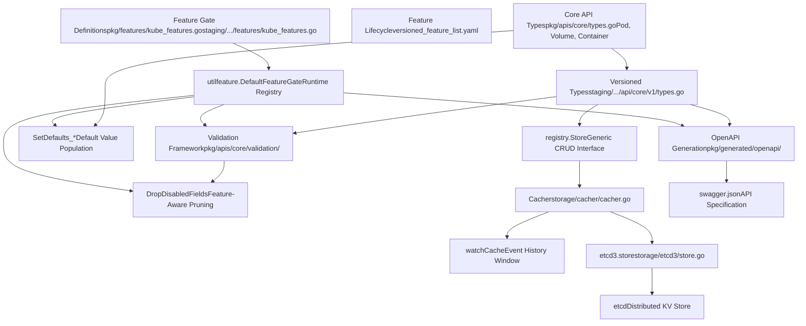
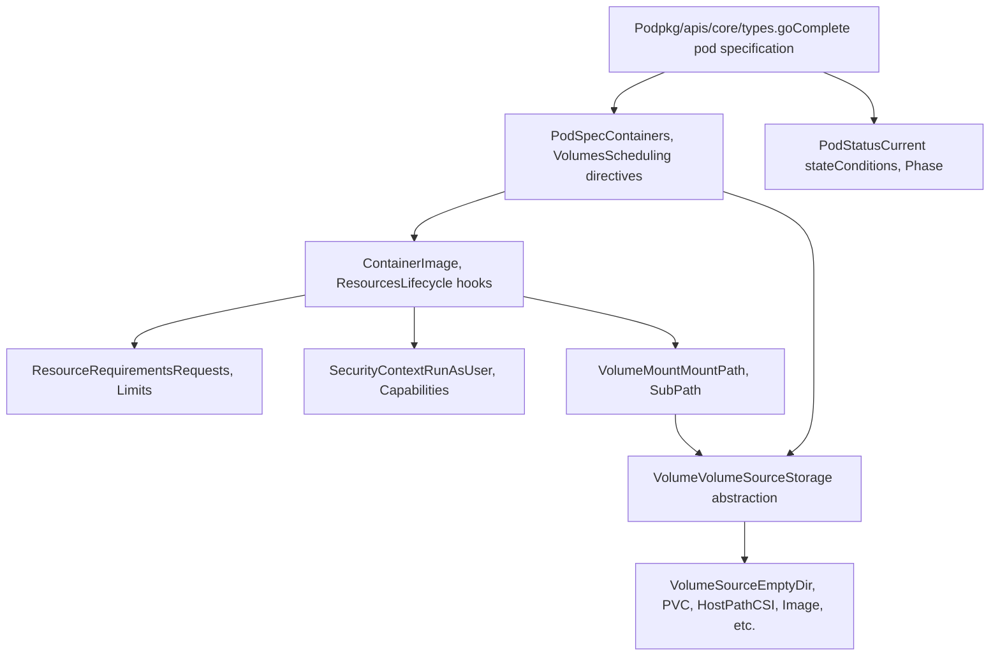
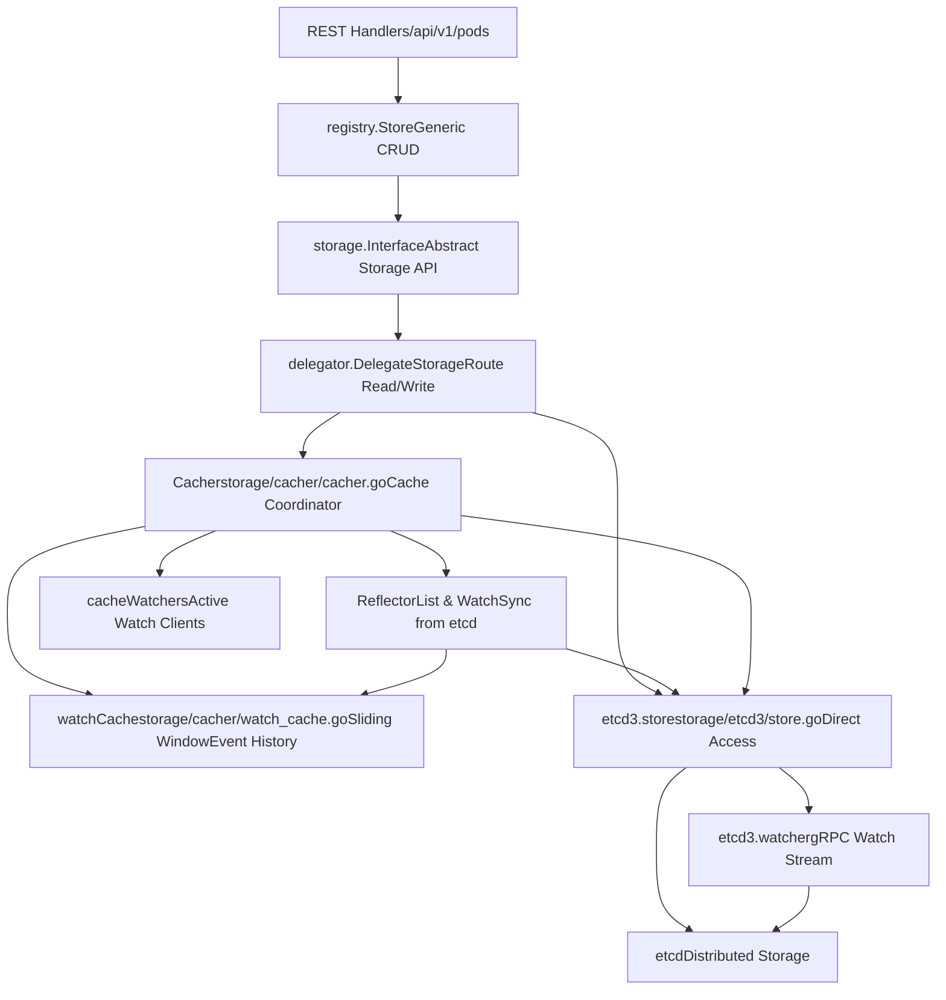

# Core API System and Feature Management

Relevant source files

-   [api/openapi-spec/swagger.json](https://github.com/kubernetes/kubernetes/blob/2757a872/api/openapi-spec/swagger.json)
-   [api/openapi-spec/v3/api\_\_v1\_openapi.json](https://github.com/kubernetes/kubernetes/blob/2757a872/api/openapi-spec/v3/api__v1_openapi.json)
-   [api/openapi-spec/v3/apis\_\_admissionregistration.k8s.io\_\_v1\_openapi.json](https://github.com/kubernetes/kubernetes/blob/2757a872/api/openapi-spec/v3/apis__admissionregistration.k8s.io__v1_openapi.json)
-   [api/openapi-spec/v3/apis\_\_apiextensions.k8s.io\_\_v1\_openapi.json](https://github.com/kubernetes/kubernetes/blob/2757a872/api/openapi-spec/v3/apis__apiextensions.k8s.io__v1_openapi.json)
-   [api/openapi-spec/v3/apis\_\_apps\_\_v1\_openapi.json](https://github.com/kubernetes/kubernetes/blob/2757a872/api/openapi-spec/v3/apis__apps__v1_openapi.json)
-   [api/openapi-spec/v3/apis\_\_autoscaling\_\_v1\_openapi.json](https://github.com/kubernetes/kubernetes/blob/2757a872/api/openapi-spec/v3/apis__autoscaling__v1_openapi.json)
-   [api/openapi-spec/v3/apis\_\_autoscaling\_\_v2\_openapi.json](https://github.com/kubernetes/kubernetes/blob/2757a872/api/openapi-spec/v3/apis__autoscaling__v2_openapi.json)
-   [api/openapi-spec/v3/apis\_\_batch\_\_v1\_openapi.json](https://github.com/kubernetes/kubernetes/blob/2757a872/api/openapi-spec/v3/apis__batch__v1_openapi.json)
-   [api/openapi-spec/v3/apis\_\_certificates.k8s.io\_\_v1\_openapi.json](https://github.com/kubernetes/kubernetes/blob/2757a872/api/openapi-spec/v3/apis__certificates.k8s.io__v1_openapi.json)
-   [api/openapi-spec/v3/apis\_\_coordination.k8s.io\_\_v1\_openapi.json](https://github.com/kubernetes/kubernetes/blob/2757a872/api/openapi-spec/v3/apis__coordination.k8s.io__v1_openapi.json)
-   [api/openapi-spec/v3/apis\_\_internal.apiserver.k8s.io\_\_v1alpha1\_openapi.json](https://github.com/kubernetes/kubernetes/blob/2757a872/api/openapi-spec/v3/apis__internal.apiserver.k8s.io__v1alpha1_openapi.json)
-   [api/openapi-spec/v3/apis\_\_networking.k8s.io\_\_v1\_openapi.json](https://github.com/kubernetes/kubernetes/blob/2757a872/api/openapi-spec/v3/apis__networking.k8s.io__v1_openapi.json)
-   [api/openapi-spec/v3/apis\_\_node.k8s.io\_\_v1\_openapi.json](https://github.com/kubernetes/kubernetes/blob/2757a872/api/openapi-spec/v3/apis__node.k8s.io__v1_openapi.json)
-   [api/openapi-spec/v3/apis\_\_policy\_\_v1\_openapi.json](https://github.com/kubernetes/kubernetes/blob/2757a872/api/openapi-spec/v3/apis__policy__v1_openapi.json)
-   [api/openapi-spec/v3/apis\_\_rbac.authorization.k8s.io\_\_v1\_openapi.json](https://github.com/kubernetes/kubernetes/blob/2757a872/api/openapi-spec/v3/apis__rbac.authorization.k8s.io__v1_openapi.json)
-   [api/openapi-spec/v3/apis\_\_storage.k8s.io\_\_v1\_openapi.json](https://github.com/kubernetes/kubernetes/blob/2757a872/api/openapi-spec/v3/apis__storage.k8s.io__v1_openapi.json)
-   [pkg/api/pod/util.go](https://github.com/kubernetes/kubernetes/blob/2757a872/pkg/api/pod/util.go)
-   [pkg/api/pod/util\_test.go](https://github.com/kubernetes/kubernetes/blob/2757a872/pkg/api/pod/util_test.go)
-   [pkg/api/v1/pod/util.go](https://github.com/kubernetes/kubernetes/blob/2757a872/pkg/api/v1/pod/util.go)
-   [pkg/api/v1/pod/util\_test.go](https://github.com/kubernetes/kubernetes/blob/2757a872/pkg/api/v1/pod/util_test.go)
-   [pkg/apis/core/fuzzer/fuzzer.go](https://github.com/kubernetes/kubernetes/blob/2757a872/pkg/apis/core/fuzzer/fuzzer.go)
-   [pkg/apis/core/types.go](https://github.com/kubernetes/kubernetes/blob/2757a872/pkg/apis/core/types.go)
-   [pkg/apis/core/v1/defaults.go](https://github.com/kubernetes/kubernetes/blob/2757a872/pkg/apis/core/v1/defaults.go)
-   [pkg/apis/core/v1/defaults\_test.go](https://github.com/kubernetes/kubernetes/blob/2757a872/pkg/apis/core/v1/defaults_test.go)
-   [pkg/apis/core/v1/zz\_generated.conversion.go](https://github.com/kubernetes/kubernetes/blob/2757a872/pkg/apis/core/v1/zz_generated.conversion.go)
-   [pkg/apis/core/validation/validation.go](https://github.com/kubernetes/kubernetes/blob/2757a872/pkg/apis/core/validation/validation.go)
-   [pkg/apis/core/validation/validation\_test.go](https://github.com/kubernetes/kubernetes/blob/2757a872/pkg/apis/core/validation/validation_test.go)
-   [pkg/apis/core/zz\_generated.deepcopy.go](https://github.com/kubernetes/kubernetes/blob/2757a872/pkg/apis/core/zz_generated.deepcopy.go)
-   [pkg/features/kube\_features.go](https://github.com/kubernetes/kubernetes/blob/2757a872/pkg/features/kube_features.go)
-   [pkg/generated/openapi/zz\_generated.openapi.go](https://github.com/kubernetes/kubernetes/blob/2757a872/pkg/generated/openapi/zz_generated.openapi.go)
-   [pkg/kubelet/status/generate.go](https://github.com/kubernetes/kubernetes/blob/2757a872/pkg/kubelet/status/generate.go)
-   [pkg/kubelet/status/generate\_test.go](https://github.com/kubernetes/kubernetes/blob/2757a872/pkg/kubelet/status/generate_test.go)
-   [pkg/kubelet/types/constants.go](https://github.com/kubernetes/kubernetes/blob/2757a872/pkg/kubelet/types/constants.go)
-   [pkg/kubelet/types/pod\_status.go](https://github.com/kubernetes/kubernetes/blob/2757a872/pkg/kubelet/types/pod_status.go)
-   [pkg/kubelet/types/pod\_status\_test.go](https://github.com/kubernetes/kubernetes/blob/2757a872/pkg/kubelet/types/pod_status_test.go)
-   [pkg/registry/core/pod/strategy.go](https://github.com/kubernetes/kubernetes/blob/2757a872/pkg/registry/core/pod/strategy.go)
-   [pkg/registry/core/pod/strategy\_test.go](https://github.com/kubernetes/kubernetes/blob/2757a872/pkg/registry/core/pod/strategy_test.go)
-   [staging/src/k8s.io/api/core/v1/generated.pb.go](https://github.com/kubernetes/kubernetes/blob/2757a872/staging/src/k8s.io/api/core/v1/generated.pb.go)
-   [staging/src/k8s.io/api/core/v1/generated.proto](https://github.com/kubernetes/kubernetes/blob/2757a872/staging/src/k8s.io/api/core/v1/generated.proto)
-   [staging/src/k8s.io/api/core/v1/types.go](https://github.com/kubernetes/kubernetes/blob/2757a872/staging/src/k8s.io/api/core/v1/types.go)
-   [staging/src/k8s.io/api/core/v1/types\_swagger\_doc\_generated.go](https://github.com/kubernetes/kubernetes/blob/2757a872/staging/src/k8s.io/api/core/v1/types_swagger_doc_generated.go)
-   [staging/src/k8s.io/api/core/v1/zz\_generated.deepcopy.go](https://github.com/kubernetes/kubernetes/blob/2757a872/staging/src/k8s.io/api/core/v1/zz_generated.deepcopy.go)
-   [staging/src/k8s.io/apiserver/pkg/features/kube\_features.go](https://github.com/kubernetes/kubernetes/blob/2757a872/staging/src/k8s.io/apiserver/pkg/features/kube_features.go)
-   [staging/src/k8s.io/apiserver/pkg/registry/generic/options.go](https://github.com/kubernetes/kubernetes/blob/2757a872/staging/src/k8s.io/apiserver/pkg/registry/generic/options.go)
-   [staging/src/k8s.io/apiserver/pkg/registry/generic/registry/dryrun.go](https://github.com/kubernetes/kubernetes/blob/2757a872/staging/src/k8s.io/apiserver/pkg/registry/generic/registry/dryrun.go)
-   [staging/src/k8s.io/apiserver/pkg/registry/generic/registry/storage\_factory.go](https://github.com/kubernetes/kubernetes/blob/2757a872/staging/src/k8s.io/apiserver/pkg/registry/generic/registry/storage_factory.go)
-   [staging/src/k8s.io/apiserver/pkg/registry/generic/registry/store.go](https://github.com/kubernetes/kubernetes/blob/2757a872/staging/src/k8s.io/apiserver/pkg/registry/generic/registry/store.go)
-   [staging/src/k8s.io/apiserver/pkg/registry/generic/registry/store\_test.go](https://github.com/kubernetes/kubernetes/blob/2757a872/staging/src/k8s.io/apiserver/pkg/registry/generic/registry/store_test.go)
-   [staging/src/k8s.io/apiserver/pkg/registry/generic/storage\_decorator.go](https://github.com/kubernetes/kubernetes/blob/2757a872/staging/src/k8s.io/apiserver/pkg/registry/generic/storage_decorator.go)
-   [staging/src/k8s.io/apiserver/pkg/storage/cacher/cache\_watcher.go](https://github.com/kubernetes/kubernetes/blob/2757a872/staging/src/k8s.io/apiserver/pkg/storage/cacher/cache_watcher.go)
-   [staging/src/k8s.io/apiserver/pkg/storage/cacher/cache\_watcher\_test.go](https://github.com/kubernetes/kubernetes/blob/2757a872/staging/src/k8s.io/apiserver/pkg/storage/cacher/cache_watcher_test.go)
-   [staging/src/k8s.io/apiserver/pkg/storage/cacher/cacher.go](https://github.com/kubernetes/kubernetes/blob/2757a872/staging/src/k8s.io/apiserver/pkg/storage/cacher/cacher.go)
-   [staging/src/k8s.io/apiserver/pkg/storage/cacher/cacher\_test.go](https://github.com/kubernetes/kubernetes/blob/2757a872/staging/src/k8s.io/apiserver/pkg/storage/cacher/cacher_test.go)
-   [staging/src/k8s.io/apiserver/pkg/storage/cacher/cacher\_testing\_utils\_test.go](https://github.com/kubernetes/kubernetes/blob/2757a872/staging/src/k8s.io/apiserver/pkg/storage/cacher/cacher_testing_utils_test.go)
-   [staging/src/k8s.io/apiserver/pkg/storage/cacher/cacher\_whitebox\_test.go](https://github.com/kubernetes/kubernetes/blob/2757a872/staging/src/k8s.io/apiserver/pkg/storage/cacher/cacher_whitebox_test.go)
-   [staging/src/k8s.io/apiserver/pkg/storage/cacher/delegator.go](https://github.com/kubernetes/kubernetes/blob/2757a872/staging/src/k8s.io/apiserver/pkg/storage/cacher/delegator.go)
-   [staging/src/k8s.io/apiserver/pkg/storage/cacher/delegator\_test.go](https://github.com/kubernetes/kubernetes/blob/2757a872/staging/src/k8s.io/apiserver/pkg/storage/cacher/delegator_test.go)
-   [staging/src/k8s.io/apiserver/pkg/storage/cacher/lister\_watcher.go](https://github.com/kubernetes/kubernetes/blob/2757a872/staging/src/k8s.io/apiserver/pkg/storage/cacher/lister_watcher.go)
-   [staging/src/k8s.io/apiserver/pkg/storage/cacher/lister\_watcher\_test.go](https://github.com/kubernetes/kubernetes/blob/2757a872/staging/src/k8s.io/apiserver/pkg/storage/cacher/lister_watcher_test.go)
-   [staging/src/k8s.io/apiserver/pkg/storage/cacher/metrics/metrics.go](https://github.com/kubernetes/kubernetes/blob/2757a872/staging/src/k8s.io/apiserver/pkg/storage/cacher/metrics/metrics.go)
-   [staging/src/k8s.io/apiserver/pkg/storage/cacher/store/store.go](https://github.com/kubernetes/kubernetes/blob/2757a872/staging/src/k8s.io/apiserver/pkg/storage/cacher/store/store.go)
-   [staging/src/k8s.io/apiserver/pkg/storage/cacher/store/store\_btree.go](https://github.com/kubernetes/kubernetes/blob/2757a872/staging/src/k8s.io/apiserver/pkg/storage/cacher/store/store_btree.go)
-   [staging/src/k8s.io/apiserver/pkg/storage/cacher/store/store\_btree\_test.go](https://github.com/kubernetes/kubernetes/blob/2757a872/staging/src/k8s.io/apiserver/pkg/storage/cacher/store/store_btree_test.go)
-   [staging/src/k8s.io/apiserver/pkg/storage/cacher/store/store\_test.go](https://github.com/kubernetes/kubernetes/blob/2757a872/staging/src/k8s.io/apiserver/pkg/storage/cacher/store/store_test.go)
-   [staging/src/k8s.io/apiserver/pkg/storage/cacher/watch\_cache.go](https://github.com/kubernetes/kubernetes/blob/2757a872/staging/src/k8s.io/apiserver/pkg/storage/cacher/watch_cache.go)
-   [staging/src/k8s.io/apiserver/pkg/storage/cacher/watch\_cache\_interval.go](https://github.com/kubernetes/kubernetes/blob/2757a872/staging/src/k8s.io/apiserver/pkg/storage/cacher/watch_cache_interval.go)
-   [staging/src/k8s.io/apiserver/pkg/storage/cacher/watch\_cache\_interval\_test.go](https://github.com/kubernetes/kubernetes/blob/2757a872/staging/src/k8s.io/apiserver/pkg/storage/cacher/watch_cache_interval_test.go)
-   [staging/src/k8s.io/apiserver/pkg/storage/cacher/watch\_cache\_test.go](https://github.com/kubernetes/kubernetes/blob/2757a872/staging/src/k8s.io/apiserver/pkg/storage/cacher/watch_cache_test.go)
-   [staging/src/k8s.io/apiserver/pkg/storage/etcd3/event.go](https://github.com/kubernetes/kubernetes/blob/2757a872/staging/src/k8s.io/apiserver/pkg/storage/etcd3/event.go)
-   [staging/src/k8s.io/apiserver/pkg/storage/etcd3/event\_test.go](https://github.com/kubernetes/kubernetes/blob/2757a872/staging/src/k8s.io/apiserver/pkg/storage/etcd3/event_test.go)
-   [staging/src/k8s.io/apiserver/pkg/storage/etcd3/store.go](https://github.com/kubernetes/kubernetes/blob/2757a872/staging/src/k8s.io/apiserver/pkg/storage/etcd3/store.go)
-   [staging/src/k8s.io/apiserver/pkg/storage/etcd3/store\_test.go](https://github.com/kubernetes/kubernetes/blob/2757a872/staging/src/k8s.io/apiserver/pkg/storage/etcd3/store_test.go)
-   [staging/src/k8s.io/apiserver/pkg/storage/etcd3/watcher.go](https://github.com/kubernetes/kubernetes/blob/2757a872/staging/src/k8s.io/apiserver/pkg/storage/etcd3/watcher.go)
-   [staging/src/k8s.io/apiserver/pkg/storage/etcd3/watcher\_test.go](https://github.com/kubernetes/kubernetes/blob/2757a872/staging/src/k8s.io/apiserver/pkg/storage/etcd3/watcher_test.go)
-   [staging/src/k8s.io/apiserver/pkg/storage/interfaces.go](https://github.com/kubernetes/kubernetes/blob/2757a872/staging/src/k8s.io/apiserver/pkg/storage/interfaces.go)
-   [staging/src/k8s.io/apiserver/pkg/storage/testing/store\_benchmarks.go](https://github.com/kubernetes/kubernetes/blob/2757a872/staging/src/k8s.io/apiserver/pkg/storage/testing/store_benchmarks.go)
-   [staging/src/k8s.io/apiserver/pkg/storage/testing/store\_tests.go](https://github.com/kubernetes/kubernetes/blob/2757a872/staging/src/k8s.io/apiserver/pkg/storage/testing/store_tests.go)
-   [staging/src/k8s.io/apiserver/pkg/storage/testing/utils.go](https://github.com/kubernetes/kubernetes/blob/2757a872/staging/src/k8s.io/apiserver/pkg/storage/testing/utils.go)
-   [staging/src/k8s.io/apiserver/pkg/storage/testing/watcher\_tests.go](https://github.com/kubernetes/kubernetes/blob/2757a872/staging/src/k8s.io/apiserver/pkg/storage/testing/watcher_tests.go)
-   [staging/src/k8s.io/apiserver/pkg/storage/util.go](https://github.com/kubernetes/kubernetes/blob/2757a872/staging/src/k8s.io/apiserver/pkg/storage/util.go)
-   [staging/src/k8s.io/apiserver/pkg/storage/util\_test.go](https://github.com/kubernetes/kubernetes/blob/2757a872/staging/src/k8s.io/apiserver/pkg/storage/util_test.go)
-   [staging/src/k8s.io/client-go/applyconfigurations/internal/internal.go](https://github.com/kubernetes/kubernetes/blob/2757a872/staging/src/k8s.io/client-go/applyconfigurations/internal/internal.go)
-   [staging/src/k8s.io/client-go/applyconfigurations/utils.go](https://github.com/kubernetes/kubernetes/blob/2757a872/staging/src/k8s.io/client-go/applyconfigurations/utils.go)
-   [test/compatibility\_lifecycle/reference/feature\_list.md](https://github.com/kubernetes/kubernetes/blob/2757a872/test/compatibility_lifecycle/reference/feature_list.md?plain=1)
-   [test/compatibility\_lifecycle/reference/versioned\_feature\_list.yaml](https://github.com/kubernetes/kubernetes/blob/2757a872/test/compatibility_lifecycle/reference/versioned_feature_list.yaml)
-   [test/integration/metrics/metrics\_test.go](https://github.com/kubernetes/kubernetes/blob/2757a872/test/integration/metrics/metrics_test.go)
-   [test/integration/scheduler\_perf/dra/dra\_test.go](https://github.com/kubernetes/kubernetes/blob/2757a872/test/integration/scheduler_perf/dra/dra_test.go)

## Purpose and Scope

This page documents the foundational layers of Kubernetes: the API object model, feature gate system, validation framework, and storage backend. These systems work together to define what objects exist in Kubernetes, how they evolve over time, how they are validated, and how they are persisted.

For detailed information about:

-   Feature gate lifecycles and Alpha→Beta→GA progression, see [Feature Gates and Lifecycle](/kubernetes/kubernetes/2.1-feature-gates-and-lifecycle)
-   API type definitions, validation rules, and field pruning, see [API Object Types and Validation](/kubernetes/kubernetes/2.2-api-object-types-and-validation)
-   Storage backend implementation and caching mechanisms, see [Storage Backend and Caching](/kubernetes/kubernetes/2.3-storage-backend-and-caching)

## System Overview

The core API system consists of three interconnected subsystems:

1.  **Feature Gate System**: Controls evolutionary rollout of functionality across all Kubernetes components through a defined lifecycle (Alpha → Beta → GA → Locked → Removed)

2.  **API Object Model and Validation**: Defines the structure of Kubernetes objects (Pod, Volume, Container, etc.) and enforces validation rules that can be feature-gated

3.  **Storage Backend and Caching**: Persists API objects to etcd and provides a sophisticated caching layer to reduce etcd load and improve read performance


## System Integration Architecture


**System Integration Flow**: Feature gates control which API fields are available. Validation uses feature gates to determine field validity. Default values are populated based on enabled features. The storage layer persists validated objects to etcd via a caching layer. OpenAPI specs reflect the current feature gate configuration.

Sources: [pkg/features/kube\_features.go1-1000](https://github.com/kubernetes/kubernetes/blob/2757a872/pkg/features/kube_features.go#L1-L1000) [staging/src/k8s.io/apiserver/pkg/features/kube\_features.go1-300](https://github.com/kubernetes/kubernetes/blob/2757a872/staging/src/k8s.io/apiserver/pkg/features/kube_features.go#L1-L300) [pkg/apis/core/validation/validation.go1-100](https://github.com/kubernetes/kubernetes/blob/2757a872/pkg/apis/core/validation/validation.go#L1-L100) [staging/src/k8s.io/apiserver/pkg/storage/cacher/cacher.go1-200](https://github.com/kubernetes/kubernetes/blob/2757a872/staging/src/k8s.io/apiserver/pkg/storage/cacher/cacher.go#L1-L200) [staging/src/k8s.io/apiserver/pkg/storage/etcd3/store.go1-100](https://github.com/kubernetes/kubernetes/blob/2757a872/staging/src/k8s.io/apiserver/pkg/storage/etcd3/store.go#L1-L100)

## Feature Gate System

The feature gate system provides controlled rollout of functionality across Kubernetes. Each feature gate goes through a defined lifecycle with specific default settings and stability guarantees.

### Feature Gate Definition

Feature gates are defined in [pkg/features/kube\_features.go41-1000](https://github.com/kubernetes/kubernetes/blob/2757a872/pkg/features/kube_features.go#L41-L1000) and [staging/src/k8s.io/apiserver/pkg/features/kube\_features.go36-200](https://github.com/kubernetes/kubernetes/blob/2757a872/staging/src/k8s.io/apiserver/pkg/features/kube_features.go#L36-L200) Each feature is declared as a constant:

| Property | Description | Example |
| --- | --- | --- |
| Name | Unique identifier | `ImageVolume`, `DynamicResourceAllocation` |
| Owner | Responsible maintainer | `@saschagrunert`, `@pohly` |
| KEP | Enhancement proposal link | `https://kep.k8s.io/4639` |
| Stage | Current lifecycle stage | Alpha, Beta, GA, Locked, Deprecated |
| Default | Whether enabled by default | `true` or `false` |

Example feature gate definitions from [pkg/features/kube\_features.go373-395](https://github.com/kubernetes/kubernetes/blob/2757a872/pkg/features/kube_features.go#L373-L395):

```
// ImageVolume enables the image volume sourceImageVolume featuregate.Feature = "ImageVolume" // InPlacePodVerticalScaling enables In-Place Pod Vertical Scaling  InPlacePodVerticalScaling featuregate.Feature = "InPlacePodVerticalScaling" // DynamicResourceAllocation enables support for resources with custom parametersDynamicResourceAllocation featuregate.Feature = "DynamicResourceAllocation"
```
Sources: [pkg/features/kube\_features.go31-1000](https://github.com/kubernetes/kubernetes/blob/2757a872/pkg/features/kube_features.go#L31-L1000) [staging/src/k8s.io/apiserver/pkg/features/kube\_features.go27-200](https://github.com/kubernetes/kubernetes/blob/2757a872/staging/src/k8s.io/apiserver/pkg/features/kube_features.go#L27-L200)

### Feature Gate Lifecycle Stages

> **[Mermaid stateDiagram]**
> *(图表结构无法解析)*

**Feature Lifecycle**: Features progress through defined stages with increasing stability guarantees. Alpha features are experimental and off by default. Beta features are well-tested and typically on by default. GA features are stable and locked on. After locking, the gate is eventually removed from the codebase.

Sources: [test/compatibility\_lifecycle/reference/versioned\_feature\_list.yaml1-500](https://github.com/kubernetes/kubernetes/blob/2757a872/test/compatibility_lifecycle/reference/versioned_feature_list.yaml#L1-L500) [test/compatibility\_lifecycle/reference/feature\_list.md1-100](https://github.com/kubernetes/kubernetes/blob/2757a872/test/compatibility_lifecycle/reference/feature_list.md?plain=1#L1-L100)

### Runtime Feature Gate Registry

The feature gate runtime registry is implemented through `utilfeature.DefaultFeatureGate` from [staging/src/k8s.io/apiserver/pkg/util/feature/](https://github.com/kubernetes/kubernetes/blob/2757a872/staging/src/k8s.io/apiserver/pkg/util/feature/) Components query this registry to determine if features are enabled:

```
// Example usage from validation codeif utilfeature.DefaultFeatureGate.Enabled(features.ImageVolume) {    // Validate ImageVolume fields}
```
The registry is initialized at component startup and feature states can be overridden via command-line flags like `--feature-gates=ImageVolume=true`.

Sources: [pkg/apis/core/validation/validation.go54-70](https://github.com/kubernetes/kubernetes/blob/2757a872/pkg/apis/core/validation/validation.go#L54-L70) [staging/src/k8s.io/apiserver/pkg/util/feature/](https://github.com/kubernetes/kubernetes/blob/2757a872/staging/src/k8s.io/apiserver/pkg/util/feature/)

## API Object Model

Kubernetes defines API objects in both internal (unversioned) and external (versioned) representations. The internal types in [pkg/apis/core/types.go1-5000](https://github.com/kubernetes/kubernetes/blob/2757a872/pkg/apis/core/types.go#L1-L5000) define the canonical form, while versioned types like those in [staging/src/k8s.io/api/core/v1/types.go1-5000](https://github.com/kubernetes/kubernetes/blob/2757a872/staging/src/k8s.io/api/core/v1/types.go#L1-L5000) define wire formats.

### Core API Types Hierarchy


**Core Type Structure**: Pod is the fundamental execution unit containing one or more Containers and Volumes. Containers specify resource requirements, security context, and volume mounts. Volumes abstract storage backends through VolumeSource.

Sources: [pkg/apis/core/types.go44-227](https://github.com/kubernetes/kubernetes/blob/2757a872/pkg/apis/core/types.go#L44-L227) [staging/src/k8s.io/api/core/v1/types.go36-222](https://github.com/kubernetes/kubernetes/blob/2757a872/staging/src/k8s.io/api/core/v1/types.go#L36-L222)

### Feature-Gated Field Handling

Feature gates control API field availability through multiple mechanisms:

1.  **DropDisabledFields**: Removes fields for disabled features during validation
2.  **Validation Rules**: Conditional validation based on feature gate state
3.  **Default Value Population**: Sets defaults only when features are enabled
4.  **OpenAPI Generation**: Excludes fields from schemas when features are disabled

Example from [pkg/apis/core/validation/validation.go544-565](https://github.com/kubernetes/kubernetes/blob/2757a872/pkg/apis/core/validation/validation.go#L544-L565) showing feature-gated volume validation:

```
func validateVolumeSource(source *core.VolumeSource, fldPath *field.Path, ...) {    // Check ImageVolume feature gate    if source.Image != nil {        if !utilfeature.DefaultFeatureGate.Enabled(features.ImageVolume) {            allErrs = append(allErrs, field.Forbidden(                fldPath.Child("image"),                 "ImageVolume feature is disabled"))        }        // Additional validation when enabled    }}
```
Sources: [pkg/apis/core/validation/validation.go544-1000](https://github.com/kubernetes/kubernetes/blob/2757a872/pkg/apis/core/validation/validation.go#L544-L1000) [pkg/api/pod/util.go1-200](https://github.com/kubernetes/kubernetes/blob/2757a872/pkg/api/pod/util.go#L1-L200)

## Validation Framework

The validation framework in [pkg/apis/core/validation/validation.go1-15000](https://github.com/kubernetes/kubernetes/blob/2757a872/pkg/apis/core/validation/validation.go#L1-L15000) enforces constraints on API objects. Validation is feature-gate-aware and can accept or reject fields based on enabled features.

### Validation Pipeline

> **[Mermaid sequence]**
> *(图表结构无法解析)*

**Validation Flow**: When a client creates a Pod, the API server invokes validation through the registry strategy. Validation checks feature gates to determine field validity, applies appropriate rules, and returns errors if constraints are violated.

Sources: [pkg/apis/core/validation/validation.go1-500](https://github.com/kubernetes/kubernetes/blob/2757a872/pkg/apis/core/validation/validation.go#L1-L500) [pkg/registry/core/pod/strategy.go1-300](https://github.com/kubernetes/kubernetes/blob/2757a872/pkg/registry/core/pod/strategy.go#L1-L300) [staging/src/k8s.io/apiserver/pkg/registry/generic/registry/store.go1-200](https://github.com/kubernetes/kubernetes/blob/2757a872/staging/src/k8s.io/apiserver/pkg/registry/generic/registry/store.go#L1-L200)

### Key Validation Functions

Major validation functions from [pkg/apis/core/validation/validation.go1-15000](https://github.com/kubernetes/kubernetes/blob/2757a872/pkg/apis/core/validation/validation.go#L1-L15000):

| Function | Purpose | Feature Gate Integration |
| --- | --- | --- |
| `ValidatePod` | Validates entire Pod spec | Calls sub-validators with gate checks |
| `ValidateVolumes` | Validates volume definitions | Checks volume type feature gates |
| `ValidateContainers` | Validates container specs | Validates feature-gated container fields |
| `ValidatePodUpdate` | Validates Pod updates | Enforces immutability rules with gates |
| `DropDisabledFields` | Removes disabled fields | Prunes based on feature gate state |

Sources: [pkg/apis/core/validation/validation.go445-15000](https://github.com/kubernetes/kubernetes/blob/2757a872/pkg/apis/core/validation/validation.go#L445-L15000) [pkg/apis/core/validation/validation\_test.go1-1000](https://github.com/kubernetes/kubernetes/blob/2757a872/pkg/apis/core/validation/validation_test.go#L1-L1000)

## Storage Backend Architecture

The storage backend persists API objects to etcd and provides a caching layer to optimize read operations. The architecture uses a delegator pattern to route requests between cache and direct storage.

### Storage Stack Diagram


**Storage Architecture**: REST handlers use the generic registry which delegates to the storage interface. The delegator routes writes directly to `etcd3.store` while routing reads through the `Cacher`. The `Cacher` maintains a `watchCache` synchronized by a `Reflector` and serves active watch clients.

Sources: [staging/src/k8s.io/apiserver/pkg/storage/cacher/cacher.go1-200](https://github.com/kubernetes/kubernetes/blob/2757a872/staging/src/k8s.io/apiserver/pkg/storage/cacher/cacher.go#L1-L200) [staging/src/k8s.io/apiserver/pkg/storage/etcd3/store.go1-100](https://github.com/kubernetes/kubernetes/blob/2757a872/staging/src/k8s.io/apiserver/pkg/storage/etcd3/store.go#L1-L100) [staging/src/k8s.io/apiserver/pkg/registry/generic/registry/store.go1-150](https://github.com/kubernetes/kubernetes/blob/2757a872/staging/src/k8s.io/apiserver/pkg/registry/generic/registry/store.go#L1-L150) [staging/src/k8s.io/apiserver/pkg/storage/cacher/delegator/](https://github.com/kubernetes/kubernetes/blob/2757a872/staging/src/k8s.io/apiserver/pkg/storage/cacher/delegator/)

### Cacher Implementation

The `Cacher` type in [staging/src/k8s.io/apiserver/pkg/storage/cacher/cacher.go79-600](https://github.com/kubernetes/kubernetes/blob/2757a872/staging/src/k8s.io/apiserver/pkg/storage/cacher/cacher.go#L79-L600) provides the core caching functionality:

**Key Components**:

-   **watchCache**: Circular buffer storing recent events with a configurable retention window (default from `DefaultEventFreshDuration` at [staging/src/k8s.io/apiserver/pkg/storage/cacher/cacher.go62-72](https://github.com/kubernetes/kubernetes/blob/2757a872/staging/src/k8s.io/apiserver/pkg/storage/cacher/cacher.go#L62-L72))
-   **Reflector**: Background goroutine that lists and watches etcd, populating the `watchCache`
-   **cacheWatchers**: Registry of active watch clients receiving events from the cache
-   **bookmarkFrequency**: Periodic bookmark events sent to watchers (default 1 minute from [staging/src/k8s.io/apiserver/pkg/storage/cacher/cacher.go74-76](https://github.com/kubernetes/kubernetes/blob/2757a872/staging/src/k8s.io/apiserver/pkg/storage/cacher/cacher.go#L74-L76))

**Read Path**: Get/List operations are served from `watchCache` if the requested ResourceVersion is available in the cache. If the RV is too old (outside the retention window), the request falls back to direct etcd access via `etcd3.store`.

**Write Path**: Create/Update/Delete operations bypass the cache entirely and go directly to `etcd3.store`. The Reflector observes these changes and updates the `watchCache` asynchronously.

Sources: [staging/src/k8s.io/apiserver/pkg/storage/cacher/cacher.go56-600](https://github.com/kubernetes/kubernetes/blob/2757a872/staging/src/k8s.io/apiserver/pkg/storage/cacher/cacher.go#L56-L600) [staging/src/k8s.io/apiserver/pkg/storage/cacher/watch\_cache.go1-200](https://github.com/kubernetes/kubernetes/blob/2757a872/staging/src/k8s.io/apiserver/pkg/storage/cacher/watch_cache.go#L1-L200)

### Feature Gates Controlling Storage Behavior

| Feature Gate | Purpose | Storage Impact |
| --- | --- | --- |
| `ConsistentListFromCache` | Linearizable reads from cache | Ensures cache serves consistent data |
| `ResilientWatchCacheInitialization` | Resilient cache startup | Improves cache initialization reliability |
| `WatchList` | Efficient initial watch state | Reduces initial watch latency |
| `BtreeWatchCache` | Btree-based cache index | Improves cache performance |

Sources: [staging/src/k8s.io/apiserver/pkg/features/kube\_features.go94-170](https://github.com/kubernetes/kubernetes/blob/2757a872/staging/src/k8s.io/apiserver/pkg/features/kube_features.go#L94-L170) [staging/src/k8s.io/apiserver/pkg/storage/cacher/cacher.go1-200](https://github.com/kubernetes/kubernetes/blob/2757a872/staging/src/k8s.io/apiserver/pkg/storage/cacher/cacher.go#L1-L200)

## OpenAPI Specification Generation

OpenAPI specifications are generated from API types and reflect the current feature gate configuration. The generated specs in [pkg/generated/openapi/zz\_generated.openapi.go125-5000](https://github.com/kubernetes/kubernetes/blob/2757a872/pkg/generated/openapi/zz_generated.openapi.go#L125-L5000) and [api/openapi-spec/swagger.json1-5000](https://github.com/kubernetes/kubernetes/blob/2757a872/api/openapi-spec/swagger.json#L1-L5000) provide:

-   **Field Definitions**: Descriptions, types, and constraints
-   **Schema Validation**: Required fields, formats, patterns
-   **Feature Gate Annotations**: Which features control field availability
-   **Resource Discovery**: Available resources and operations

Example OpenAPI structure from [api/openapi-spec/swagger.json1-100](https://github.com/kubernetes/kubernetes/blob/2757a872/api/openapi-spec/swagger.json#L1-L100):

```
{  "definitions": {    "io.k8s.api.core.v1.Pod": {      "description": "Pod is a collection of containers that can run on a host",      "properties": {        "spec": {          "$ref": "#/definitions/io.k8s.api.core.v1.PodSpec"        },        "status": {          "$ref": "#/definitions/io.k8s.api.core.v1.PodStatus"        }      }    }  }}
```
The OpenAPI generation code in [pkg/generated/openapi/zz\_generated.openapi.go125-500](https://github.com/kubernetes/kubernetes/blob/2757a872/pkg/generated/openapi/zz_generated.openapi.go#L125-L500) creates a map of schema definitions with type information for all API objects.

Sources: [api/openapi-spec/swagger.json1-1000](https://github.com/kubernetes/kubernetes/blob/2757a872/api/openapi-spec/swagger.json#L1-L1000) [pkg/generated/openapi/zz\_generated.openapi.go125-500](https://github.com/kubernetes/kubernetes/blob/2757a872/pkg/generated/openapi/zz_generated.openapi.go#L125-L500) [api/openapi-spec/v3/api\_\_v1\_openapi.json1-100](https://github.com/kubernetes/kubernetes/blob/2757a872/api/openapi-spec/v3/api__v1_openapi.json#L1-L100)

## Request Lifecycle with Feature Gates

The following diagram shows how feature gates, validation, and storage interact during a typical API request:

> **[Mermaid sequence]**
> *(图表结构无法解析)*

**Complete Request Flow**: For writes, the API server checks feature gates, validates the object (potentially dropping disabled fields), and writes to etcd. The Cacher observes the write asynchronously. For reads, the Cacher serves from `watchCache` if possible, otherwise falls back to etcd.

Sources: [pkg/apis/core/validation/validation.go1-500](https://github.com/kubernetes/kubernetes/blob/2757a872/pkg/apis/core/validation/validation.go#L1-L500) [staging/src/k8s.io/apiserver/pkg/storage/cacher/cacher.go1-500](https://github.com/kubernetes/kubernetes/blob/2757a872/staging/src/k8s.io/apiserver/pkg/storage/cacher/cacher.go#L1-L500) [staging/src/k8s.io/apiserver/pkg/storage/etcd3/store.go1-300](https://github.com/kubernetes/kubernetes/blob/2757a872/staging/src/k8s.io/apiserver/pkg/storage/etcd3/store.go#L1-L300) [staging/src/k8s.io/apiserver/pkg/registry/generic/registry/store.go1-300](https://github.com/kubernetes/kubernetes/blob/2757a872/staging/src/k8s.io/apiserver/pkg/registry/generic/registry/store.go#L1-L300)

## Version Compatibility and Feature Gates

Feature gates enable controlled rollout across Kubernetes versions. The compatibility tracking in [test/compatibility\_lifecycle/reference/versioned\_feature\_list.yaml1-5000](https://github.com/kubernetes/kubernetes/blob/2757a872/test/compatibility_lifecycle/reference/versioned_feature_list.yaml#L1-L5000) records:

-   Version when feature was introduced
-   Default state in each version
-   Lock-to-default status
-   Deprecation and removal timelines

Example from [test/compatibility\_lifecycle/reference/versioned\_feature\_list.yaml287-295](https://github.com/kubernetes/kubernetes/blob/2757a872/test/compatibility_lifecycle/reference/versioned_feature_list.yaml#L287-L295):

```
- name: ContainerRestartRules  versionedSpecs:  - default: false    lockToDefault: false    preRelease: Alpha    version: "1.34"  - default: true    lockToDefault: false    preRelease: Beta    version: "1.35"
```
This ensures predictable feature evolution and provides clear migration paths for cluster administrators.

Sources: [test/compatibility\_lifecycle/reference/versioned\_feature\_list.yaml1-5000](https://github.com/kubernetes/kubernetes/blob/2757a872/test/compatibility_lifecycle/reference/versioned_feature_list.yaml#L1-L5000) [test/compatibility\_lifecycle/reference/feature\_list.md1-1000](https://github.com/kubernetes/kubernetes/blob/2757a872/test/compatibility_lifecycle/reference/feature_list.md?plain=1#L1-L1000)

## Summary

The Core API System and Feature Management encompasses:

1.  **Feature Gates**: Controlled evolution through Alpha→Beta→GA→Locked stages defined in [pkg/features/kube\_features.go41-1000](https://github.com/kubernetes/kubernetes/blob/2757a872/pkg/features/kube_features.go#L41-L1000) and [staging/src/k8s.io/apiserver/pkg/features/kube\_features.go36-200](https://github.com/kubernetes/kubernetes/blob/2757a872/staging/src/k8s.io/apiserver/pkg/features/kube_features.go#L36-L200)

2.  **API Types**: Structured object definitions in [pkg/apis/core/types.go44-5000](https://github.com/kubernetes/kubernetes/blob/2757a872/pkg/apis/core/types.go#L44-L5000) and [staging/src/k8s.io/api/core/v1/types.go36-5000](https://github.com/kubernetes/kubernetes/blob/2757a872/staging/src/k8s.io/api/core/v1/types.go#L36-L5000)

3.  **Validation**: Feature-aware constraint enforcement in [pkg/apis/core/validation/validation.go1-15000](https://github.com/kubernetes/kubernetes/blob/2757a872/pkg/apis/core/validation/validation.go#L1-L15000)

4.  **Storage**: etcd3 backend with sophisticated caching in [staging/src/k8s.io/apiserver/pkg/storage/cacher/cacher.go1-2000](https://github.com/kubernetes/kubernetes/blob/2757a872/staging/src/k8s.io/apiserver/pkg/storage/cacher/cacher.go#L1-L2000) and [staging/src/k8s.io/apiserver/pkg/storage/etcd3/store.go1-2000](https://github.com/kubernetes/kubernetes/blob/2757a872/staging/src/k8s.io/apiserver/pkg/storage/etcd3/store.go#L1-L2000)

5.  **OpenAPI**: Auto-generated specifications in [api/openapi-spec/swagger.json1-5000](https://github.com/kubernetes/kubernetes/blob/2757a872/api/openapi-spec/swagger.json#L1-L5000) and [pkg/generated/openapi/zz\_generated.openapi.go125-10000](https://github.com/kubernetes/kubernetes/blob/2757a872/pkg/generated/openapi/zz_generated.openapi.go#L125-L10000)


For detailed information on each subsystem, see child pages [Feature Gates and Lifecycle](/kubernetes/kubernetes/2.1-feature-gates-and-lifecycle), [API Object Types and Validation](/kubernetes/kubernetes/2.2-api-object-types-and-validation), and [Storage Backend and Caching](/kubernetes/kubernetes/2.3-storage-backend-and-caching).
