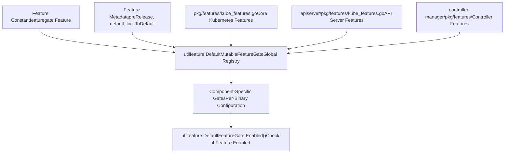
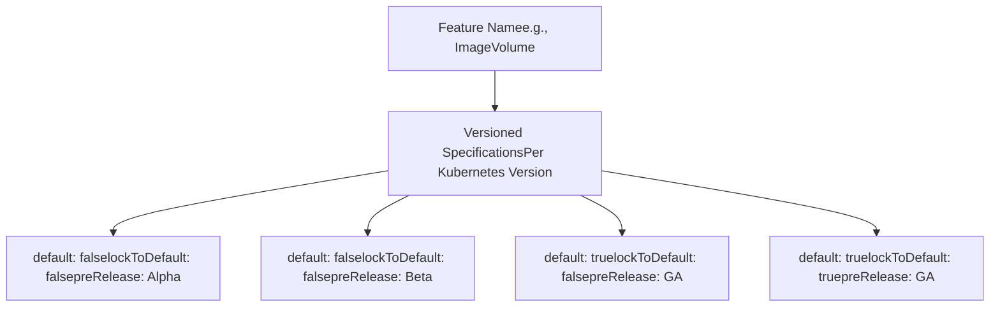
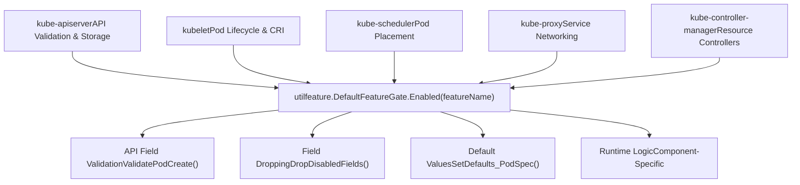
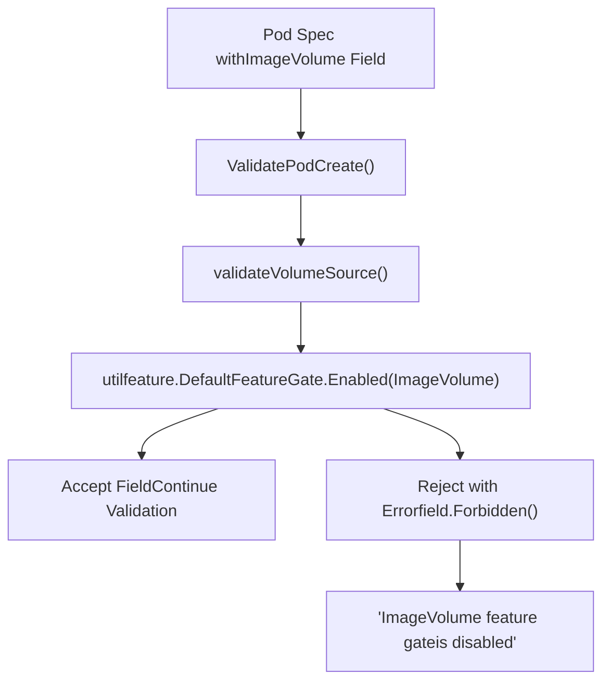
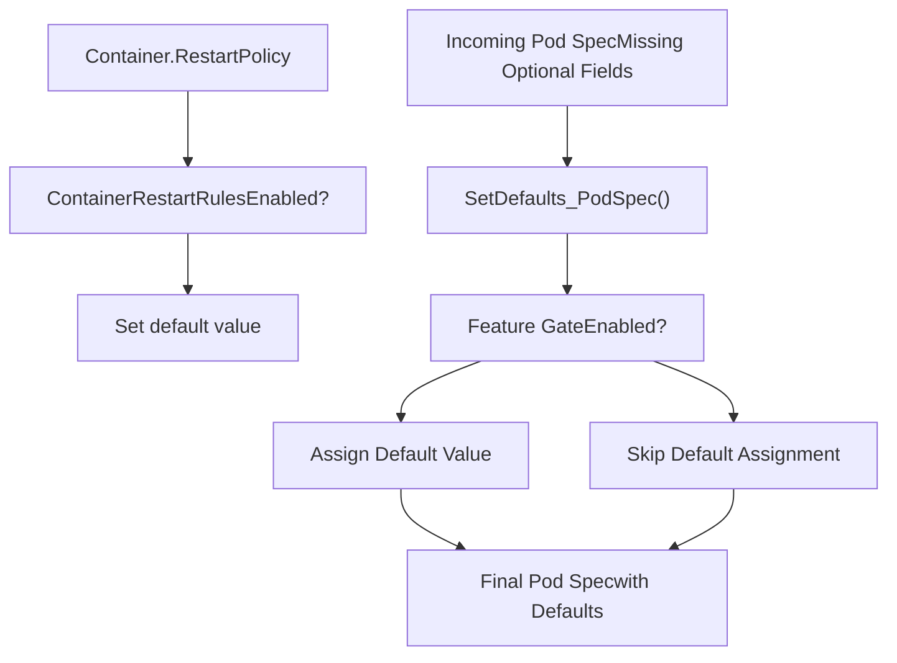
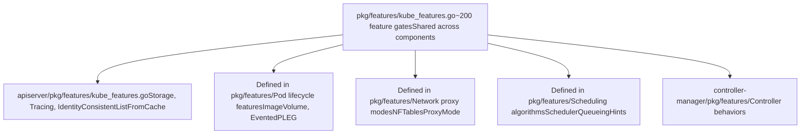
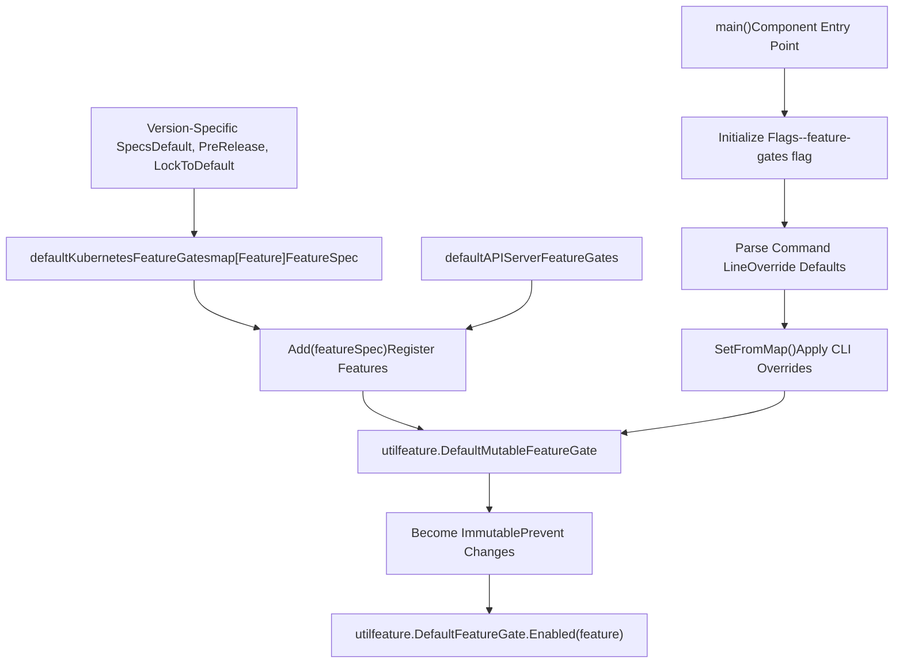
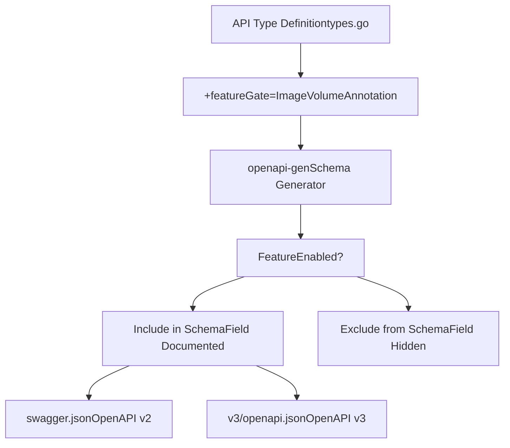

# Feature Gates and Lifecycle

Relevant source files

-   [api/openapi-spec/swagger.json](https://github.com/kubernetes/kubernetes/blob/2757a872/api/openapi-spec/swagger.json)
-   [api/openapi-spec/v3/api\_\_v1\_openapi.json](https://github.com/kubernetes/kubernetes/blob/2757a872/api/openapi-spec/v3/api__v1_openapi.json)
-   [api/openapi-spec/v3/apis\_\_admissionregistration.k8s.io\_\_v1\_openapi.json](https://github.com/kubernetes/kubernetes/blob/2757a872/api/openapi-spec/v3/apis__admissionregistration.k8s.io__v1_openapi.json)
-   [api/openapi-spec/v3/apis\_\_apiextensions.k8s.io\_\_v1\_openapi.json](https://github.com/kubernetes/kubernetes/blob/2757a872/api/openapi-spec/v3/apis__apiextensions.k8s.io__v1_openapi.json)
-   [api/openapi-spec/v3/apis\_\_apps\_\_v1\_openapi.json](https://github.com/kubernetes/kubernetes/blob/2757a872/api/openapi-spec/v3/apis__apps__v1_openapi.json)
-   [api/openapi-spec/v3/apis\_\_autoscaling\_\_v1\_openapi.json](https://github.com/kubernetes/kubernetes/blob/2757a872/api/openapi-spec/v3/apis__autoscaling__v1_openapi.json)
-   [api/openapi-spec/v3/apis\_\_autoscaling\_\_v2\_openapi.json](https://github.com/kubernetes/kubernetes/blob/2757a872/api/openapi-spec/v3/apis__autoscaling__v2_openapi.json)
-   [api/openapi-spec/v3/apis\_\_batch\_\_v1\_openapi.json](https://github.com/kubernetes/kubernetes/blob/2757a872/api/openapi-spec/v3/apis__batch__v1_openapi.json)
-   [api/openapi-spec/v3/apis\_\_certificates.k8s.io\_\_v1\_openapi.json](https://github.com/kubernetes/kubernetes/blob/2757a872/api/openapi-spec/v3/apis__certificates.k8s.io__v1_openapi.json)
-   [api/openapi-spec/v3/apis\_\_coordination.k8s.io\_\_v1\_openapi.json](https://github.com/kubernetes/kubernetes/blob/2757a872/api/openapi-spec/v3/apis__coordination.k8s.io__v1_openapi.json)
-   [api/openapi-spec/v3/apis\_\_internal.apiserver.k8s.io\_\_v1alpha1\_openapi.json](https://github.com/kubernetes/kubernetes/blob/2757a872/api/openapi-spec/v3/apis__internal.apiserver.k8s.io__v1alpha1_openapi.json)
-   [api/openapi-spec/v3/apis\_\_networking.k8s.io\_\_v1\_openapi.json](https://github.com/kubernetes/kubernetes/blob/2757a872/api/openapi-spec/v3/apis__networking.k8s.io__v1_openapi.json)
-   [api/openapi-spec/v3/apis\_\_node.k8s.io\_\_v1\_openapi.json](https://github.com/kubernetes/kubernetes/blob/2757a872/api/openapi-spec/v3/apis__node.k8s.io__v1_openapi.json)
-   [api/openapi-spec/v3/apis\_\_policy\_\_v1\_openapi.json](https://github.com/kubernetes/kubernetes/blob/2757a872/api/openapi-spec/v3/apis__policy__v1_openapi.json)
-   [api/openapi-spec/v3/apis\_\_rbac.authorization.k8s.io\_\_v1\_openapi.json](https://github.com/kubernetes/kubernetes/blob/2757a872/api/openapi-spec/v3/apis__rbac.authorization.k8s.io__v1_openapi.json)
-   [api/openapi-spec/v3/apis\_\_storage.k8s.io\_\_v1\_openapi.json](https://github.com/kubernetes/kubernetes/blob/2757a872/api/openapi-spec/v3/apis__storage.k8s.io__v1_openapi.json)
-   [pkg/api/pod/util.go](https://github.com/kubernetes/kubernetes/blob/2757a872/pkg/api/pod/util.go)
-   [pkg/api/pod/util\_test.go](https://github.com/kubernetes/kubernetes/blob/2757a872/pkg/api/pod/util_test.go)
-   [pkg/api/v1/pod/util.go](https://github.com/kubernetes/kubernetes/blob/2757a872/pkg/api/v1/pod/util.go)
-   [pkg/api/v1/pod/util\_test.go](https://github.com/kubernetes/kubernetes/blob/2757a872/pkg/api/v1/pod/util_test.go)
-   [pkg/apis/core/fuzzer/fuzzer.go](https://github.com/kubernetes/kubernetes/blob/2757a872/pkg/apis/core/fuzzer/fuzzer.go)
-   [pkg/apis/core/types.go](https://github.com/kubernetes/kubernetes/blob/2757a872/pkg/apis/core/types.go)
-   [pkg/apis/core/v1/defaults.go](https://github.com/kubernetes/kubernetes/blob/2757a872/pkg/apis/core/v1/defaults.go)
-   [pkg/apis/core/v1/defaults\_test.go](https://github.com/kubernetes/kubernetes/blob/2757a872/pkg/apis/core/v1/defaults_test.go)
-   [pkg/apis/core/v1/zz\_generated.conversion.go](https://github.com/kubernetes/kubernetes/blob/2757a872/pkg/apis/core/v1/zz_generated.conversion.go)
-   [pkg/apis/core/validation/validation.go](https://github.com/kubernetes/kubernetes/blob/2757a872/pkg/apis/core/validation/validation.go)
-   [pkg/apis/core/validation/validation\_test.go](https://github.com/kubernetes/kubernetes/blob/2757a872/pkg/apis/core/validation/validation_test.go)
-   [pkg/apis/core/zz\_generated.deepcopy.go](https://github.com/kubernetes/kubernetes/blob/2757a872/pkg/apis/core/zz_generated.deepcopy.go)
-   [pkg/features/kube\_features.go](https://github.com/kubernetes/kubernetes/blob/2757a872/pkg/features/kube_features.go)
-   [pkg/generated/openapi/zz\_generated.openapi.go](https://github.com/kubernetes/kubernetes/blob/2757a872/pkg/generated/openapi/zz_generated.openapi.go)
-   [pkg/kubelet/status/generate.go](https://github.com/kubernetes/kubernetes/blob/2757a872/pkg/kubelet/status/generate.go)
-   [pkg/kubelet/status/generate\_test.go](https://github.com/kubernetes/kubernetes/blob/2757a872/pkg/kubelet/status/generate_test.go)
-   [pkg/kubelet/types/constants.go](https://github.com/kubernetes/kubernetes/blob/2757a872/pkg/kubelet/types/constants.go)
-   [pkg/kubelet/types/pod\_status.go](https://github.com/kubernetes/kubernetes/blob/2757a872/pkg/kubelet/types/pod_status.go)
-   [pkg/kubelet/types/pod\_status\_test.go](https://github.com/kubernetes/kubernetes/blob/2757a872/pkg/kubelet/types/pod_status_test.go)
-   [pkg/registry/core/pod/strategy.go](https://github.com/kubernetes/kubernetes/blob/2757a872/pkg/registry/core/pod/strategy.go)
-   [pkg/registry/core/pod/strategy\_test.go](https://github.com/kubernetes/kubernetes/blob/2757a872/pkg/registry/core/pod/strategy_test.go)
-   [staging/src/k8s.io/api/core/v1/generated.pb.go](https://github.com/kubernetes/kubernetes/blob/2757a872/staging/src/k8s.io/api/core/v1/generated.pb.go)
-   [staging/src/k8s.io/api/core/v1/generated.proto](https://github.com/kubernetes/kubernetes/blob/2757a872/staging/src/k8s.io/api/core/v1/generated.proto)
-   [staging/src/k8s.io/api/core/v1/types.go](https://github.com/kubernetes/kubernetes/blob/2757a872/staging/src/k8s.io/api/core/v1/types.go)
-   [staging/src/k8s.io/api/core/v1/types\_swagger\_doc\_generated.go](https://github.com/kubernetes/kubernetes/blob/2757a872/staging/src/k8s.io/api/core/v1/types_swagger_doc_generated.go)
-   [staging/src/k8s.io/api/core/v1/zz\_generated.deepcopy.go](https://github.com/kubernetes/kubernetes/blob/2757a872/staging/src/k8s.io/api/core/v1/zz_generated.deepcopy.go)
-   [staging/src/k8s.io/apiserver/pkg/features/kube\_features.go](https://github.com/kubernetes/kubernetes/blob/2757a872/staging/src/k8s.io/apiserver/pkg/features/kube_features.go)
-   [staging/src/k8s.io/client-go/applyconfigurations/internal/internal.go](https://github.com/kubernetes/kubernetes/blob/2757a872/staging/src/k8s.io/client-go/applyconfigurations/internal/internal.go)
-   [staging/src/k8s.io/client-go/applyconfigurations/utils.go](https://github.com/kubernetes/kubernetes/blob/2757a872/staging/src/k8s.io/client-go/applyconfigurations/utils.go)
-   [test/compatibility\_lifecycle/reference/feature\_list.md](https://github.com/kubernetes/kubernetes/blob/2757a872/test/compatibility_lifecycle/reference/feature_list.md?plain=1)
-   [test/compatibility\_lifecycle/reference/versioned\_feature\_list.yaml](https://github.com/kubernetes/kubernetes/blob/2757a872/test/compatibility_lifecycle/reference/versioned_feature_list.yaml)
-   [test/integration/scheduler\_perf/dra/dra\_test.go](https://github.com/kubernetes/kubernetes/blob/2757a872/test/integration/scheduler_perf/dra/dra_test.go)

## Purpose and Scope

This document describes the feature gate system in Kubernetes, which provides a mechanism for gradually introducing, testing, and stabilizing new functionality across all cluster components. Feature gates enable alpha, beta, and GA features to be controlled independently, allowing safe evolution of the Kubernetes API and implementation without breaking compatibility.

For information about API object types and validation rules, see [API Object Types and Validation](/kubernetes/kubernetes/2.2-api-object-types-and-validation). For storage backend details, see [Storage Backend and Caching](/kubernetes/kubernetes/2.3-storage-backend-and-caching).

---

## Feature Gate Fundamentals

### Overview

Feature gates are named boolean flags that control whether specific features are enabled in Kubernetes components. Each feature gate progresses through a defined lifecycle from Alpha to GA (General Availability), with specific defaults and capabilities at each stage.

The feature gate system is implemented across multiple packages:

-   Core Kubernetes features: [pkg/features/kube\_features.go](https://github.com/kubernetes/kubernetes/blob/2757a872/pkg/features/kube_features.go)
-   API server features: [staging/src/k8s.io/apiserver/pkg/features/kube\_features.go](https://github.com/kubernetes/kubernetes/blob/2757a872/staging/src/k8s.io/apiserver/pkg/features/kube_features.go)
-   Component-base features: Various component-specific packages

### Lifecycle Stages

> **[Mermaid stateDiagram]**
> *(图表结构无法解析)*

**Sources:** [pkg/features/kube\_features.go](https://github.com/kubernetes/kubernetes/blob/2757a872/pkg/features/kube_features.go) [test/compatibility\_lifecycle/reference/versioned\_feature\_list.yaml](https://github.com/kubernetes/kubernetes/blob/2757a872/test/compatibility_lifecycle/reference/versioned_feature_list.yaml)

---

## Feature Gate Definition and Registration

### Feature Gate Structure

Feature gates are defined as constants of type `featuregate.Feature` with associated metadata describing their lifecycle:


**Example Feature Definition:**

[pkg/features/kube\_features.go374-378](https://github.com/kubernetes/kubernetes/blob/2757a872/pkg/features/kube_features.go#L374-L378) defines the `ImageVolume` feature:

```
// owner: @saschagrunert
// kep: https://kep.k8s.io/4639
//
// Enables the image volume source.
ImageVolume featuregate.Feature = "ImageVolume"
```
The feature is registered in [pkg/features/kube\_features.go1130-1140](https://github.com/kubernetes/kubernetes/blob/2757a872/pkg/features/kube_features.go#L1130-L1140):

```
ImageVolume: {
    Default: false,
    PreRelease: featuregate.Alpha,
}
```
**Sources:** [pkg/features/kube\_features.go1-996](https://github.com/kubernetes/kubernetes/blob/2757a872/pkg/features/kube_features.go#L1-L996) [staging/src/k8s.io/apiserver/pkg/features/kube\_features.go1-560](https://github.com/kubernetes/kubernetes/blob/2757a872/staging/src/k8s.io/apiserver/pkg/features/kube_features.go#L1-L560)

---

## Lifecycle Progression and Versioning

### Stage Characteristics

| Stage | Default | Locked | Compatibility | Use Case |
| --- | --- | --- | --- | --- |
| **Alpha** | OFF | No | None - may change/break | Early development, testing |
| **Beta** | ON | No | Backward compatible within release | Production testing |
| **GA** | ON | No | Full compatibility | Stable production |
| **Locked** | ON | Yes | Full compatibility | Removal pending |
| **Deprecated** | Varies | No | Best effort | Migration period |

### Versioned Feature Tracking


The complete lifecycle history for all features is tracked in [test/compatibility\_lifecycle/reference/versioned\_feature\_list.yaml](https://github.com/kubernetes/kubernetes/blob/2757a872/test/compatibility_lifecycle/reference/versioned_feature_list.yaml) This file is machine-generated and used for compatibility testing across Kubernetes versions.

**Example from versioned\_feature\_list.yaml:**

[test/compatibility\_lifecycle/reference/versioned\_feature\_list.yaml374-378](https://github.com/kubernetes/kubernetes/blob/2757a872/test/compatibility_lifecycle/reference/versioned_feature_list.yaml#L374-L378) shows the `ImageVolume` feature:

```
- name: ImageVolume  versionedSpecs:  - default: false    lockToDefault: false    preRelease: Alpha    version: "1.32"
```
**Sources:** [test/compatibility\_lifecycle/reference/versioned\_feature\_list.yaml1-3500](https://github.com/kubernetes/kubernetes/blob/2757a872/test/compatibility_lifecycle/reference/versioned_feature_list.yaml#L1-L3500) [pkg/features/kube\_features.go](https://github.com/kubernetes/kubernetes/blob/2757a872/pkg/features/kube_features.go)

---

## Feature Gate Integration Across Components

### Component Query Pattern


**Sources:** [pkg/apis/core/validation/validation.go](https://github.com/kubernetes/kubernetes/blob/2757a872/pkg/apis/core/validation/validation.go) [pkg/features/kube\_features.go](https://github.com/kubernetes/kubernetes/blob/2757a872/pkg/features/kube_features.go)

---

## API Validation and Feature Gates

### Field Validation Based on Feature Gates

The validation framework uses feature gates to conditionally validate API fields. When a feature is disabled, attempts to use that feature's fields result in validation errors.


**Example Implementation:**

[pkg/apis/core/validation/validation.go544-700](https://github.com/kubernetes/kubernetes/blob/2757a872/pkg/apis/core/validation/validation.go#L544-L700) implements `validateVolumeSource()` which checks feature gates for different volume types. For the `ImageVolume` feature, the validation logic checks:

```
if source.Image != nil {    if !utilfeature.DefaultFeatureGate.Enabled(features.ImageVolume) {        allErrs = append(allErrs, field.Forbidden(fldPath.Child("image"),             "ImageVolume feature gate is disabled"))    }}
```
**Sources:** [pkg/apis/core/validation/validation.go1-8000](https://github.com/kubernetes/kubernetes/blob/2757a872/pkg/apis/core/validation/validation.go#L1-L8000) [pkg/features/kube\_features.go](https://github.com/kubernetes/kubernetes/blob/2757a872/pkg/features/kube_features.go)

---

## Field Dropping for Disabled Features

### DropDisabledFields Mechanism

When a feature is disabled, the API server automatically removes (drops) fields associated with that feature from API objects during creation or update. This prevents disabled features from being configured.

> **[Mermaid sequence]**
> *(图表结构无法解析)*

The `DropDisabledFields()` pattern is used extensively in validation code to ensure that disabled features cannot be persisted to storage, even if clients send them.

**Example Usage Pattern:**

[pkg/apis/core/validation/validation.go](https://github.com/kubernetes/kubernetes/blob/2757a872/pkg/apis/core/validation/validation.go) uses drop functions throughout validation:

```
// Drop fields that are disabled by feature gatesif !utilfeature.DefaultFeatureGate.Enabled(features.ImageVolume) {    // Clear the image volume field if present    for i := range spec.Volumes {        spec.Volumes[i].Image = nil    }}
```
**Sources:** [pkg/apis/core/validation/validation.go](https://github.com/kubernetes/kubernetes/blob/2757a872/pkg/apis/core/validation/validation.go) [pkg/apis/core/v1/defaults.go](https://github.com/kubernetes/kubernetes/blob/2757a872/pkg/apis/core/v1/defaults.go)

---

## Default Value Assignment

### Feature-Gated Default Values

The default value assignment logic uses feature gates to conditionally populate fields with default values. This ensures that fields for disabled features are not assigned defaults.


**Implementation:**

[pkg/apis/core/v1/defaults.go1-500](https://github.com/kubernetes/kubernetes/blob/2757a872/pkg/apis/core/v1/defaults.go#L1-L500) implements default value assignment with feature gate checks:

```
func SetDefaults_PodSpec(obj *v1.PodSpec) {    // Only set defaults for enabled features    if utilfeature.DefaultFeatureGate.Enabled(features.ContainerRestartRules) {        // Set container restart policy defaults    }}
```
**Sources:** [pkg/apis/core/v1/defaults.go1-500](https://github.com/kubernetes/kubernetes/blob/2757a872/pkg/apis/core/v1/defaults.go#L1-L500) [pkg/apis/core/v1/defaults\_test.go](https://github.com/kubernetes/kubernetes/blob/2757a872/pkg/apis/core/v1/defaults_test.go)

---

## Component-Specific Feature Gates

### Distribution Across Components

Different Kubernetes components define and use their own feature gates in addition to the core feature gates:


**Key Component-Specific Features:**

| Component | Example Features | Purpose |
| --- | --- | --- |
| **API Server** | `APIServerTracing`, `ConsistentListFromCache` | Storage and serving optimizations |
| **Kubelet** | `ImageVolume`, `EventedPLEG`, `UserNamespacesSupport` | Pod and container lifecycle |
| **kube-proxy** | `NFTablesProxyMode`, `PreferSameTrafficDistribution` | Service networking modes |
| **Scheduler** | `SchedulerQueueingHints`, `SchedulerAsyncPreemption` | Scheduling performance |

**Sources:** [pkg/features/kube\_features.go1-2000](https://github.com/kubernetes/kubernetes/blob/2757a872/pkg/features/kube_features.go#L1-L2000) [staging/src/k8s.io/apiserver/pkg/features/kube\_features.go](https://github.com/kubernetes/kubernetes/blob/2757a872/staging/src/k8s.io/apiserver/pkg/features/kube_features.go)

---

## Feature Gate Registration and Initialization

### Registration Flow


**Registration Example:**

[pkg/features/kube\_features.go1000-1200](https://github.com/kubernetes/kubernetes/blob/2757a872/pkg/features/kube_features.go#L1000-L1200) defines the feature specifications:

```
var defaultKubernetesFeatureGates = map[featuregate.Feature]featuregate.FeatureSpec{    ImageVolume: {        Default: false,        PreRelease: featuregate.Alpha,    },    DynamicResourceAllocation: {        Default: true,        PreRelease: featuregate.Beta,    },}
```
The `init()` function registers these features:

[pkg/features/kube\_features.go2000-2020](https://github.com/kubernetes/kubernetes/blob/2757a872/pkg/features/kube_features.go#L2000-L2020):

```
func init() {    runtime.Must(utilfeature.DefaultMutableFeatureGate.Add(defaultKubernetesFeatureGates))}
```
**Sources:** [pkg/features/kube\_features.go2000-2020](https://github.com/kubernetes/kubernetes/blob/2757a872/pkg/features/kube_features.go#L2000-L2020) [staging/src/k8s.io/apiserver/pkg/util/feature/feature\_gate.go](https://github.com/kubernetes/kubernetes/blob/2757a872/staging/src/k8s.io/apiserver/pkg/util/feature/feature_gate.go)

---

## Lifecycle Management and Compatibility Testing

### Versioned Feature List

The [test/compatibility\_lifecycle/reference/versioned\_feature\_list.yaml](https://github.com/kubernetes/kubernetes/blob/2757a872/test/compatibility_lifecycle/reference/versioned_feature_list.yaml) file maintains the complete history of every feature gate across all Kubernetes versions. This enables:

1.  **Compatibility Testing**: Ensuring old clients work with new servers
2.  **Upgrade Validation**: Verifying safe version transitions
3.  **Documentation Generation**: Auto-generating feature gate documentation

**Structure:**

```
- name: FeatureName  versionedSpecs:  - default: false    lockToDefault: false    preRelease: Alpha    version: "1.30"  - default: true    lockToDefault: false    preRelease: Beta    version: "1.32"  - default: true    lockToDefault: true    preRelease: GA    version: "1.34"
```
### Feature Gate Lifecycle Timeline

> **[Mermaid gantt]**
> *(图表结构无法解析)*

**Sources:** [test/compatibility\_lifecycle/reference/versioned\_feature\_list.yaml1-3500](https://github.com/kubernetes/kubernetes/blob/2757a872/test/compatibility_lifecycle/reference/versioned_feature_list.yaml#L1-L3500) [test/compatibility\_lifecycle/reference/feature\_list.md](https://github.com/kubernetes/kubernetes/blob/2757a872/test/compatibility_lifecycle/reference/feature_list.md?plain=1)

---

## Feature Gate Best Practices and Patterns

### Common Usage Patterns

**Pattern 1: Simple Feature Check**

```
if utilfeature.DefaultFeatureGate.Enabled(features.ImageVolume) {    // Feature-specific logic}
```
**Pattern 2: Validation with Feature Gate**

[pkg/apis/core/validation/validation.go544-700](https://github.com/kubernetes/kubernetes/blob/2757a872/pkg/apis/core/validation/validation.go#L544-L700):

```
if source.Image != nil {    if !utilfeature.DefaultFeatureGate.Enabled(features.ImageVolume) {        allErrs = append(allErrs, field.Forbidden(fldPath.Child("image"),             "ImageVolume feature gate is disabled"))        return allErrs    }    // Validate image volume configuration    allErrs = append(allErrs, validateImageVolumeSource(source.Image, fldPath.Child("image"), opts)...)}
```
**Pattern 3: Field Dropping**

```
// Drop disabled fields to prevent persistencefunc DropDisabledImageVolumeFields(podSpec *core.PodSpec) {    if !utilfeature.DefaultFeatureGate.Enabled(features.ImageVolume) {        for i := range podSpec.Volumes {            podSpec.Volumes[i].Image = nil        }    }}
```
### Lifecycle Transition Guidelines

| From Stage | To Stage | Requirements |
| --- | --- | --- |
| Alpha → Beta | Enable by default, stabilize API, comprehensive testing |  |
| Beta → GA | Production proven, full test coverage, documentation complete |  |
| GA → Locked | Mandatory for cluster operation, no disable option |  |
| Locked → Removed | Gate code removed, feature becomes standard behavior |  |
| Any → Deprecated | Migration path documented, timeline announced |  |

**Sources:** [pkg/apis/core/validation/validation.go](https://github.com/kubernetes/kubernetes/blob/2757a872/pkg/apis/core/validation/validation.go) [pkg/features/kube\_features.go](https://github.com/kubernetes/kubernetes/blob/2757a872/pkg/features/kube_features.go)

---

## OpenAPI Schema Generation

### Feature-Gated Schema Fields

OpenAPI schemas automatically reflect feature gate state. Fields controlled by disabled feature gates are excluded from the generated schema, preventing clients from discovering or using disabled features.


**Example from API Types:**

[staging/src/k8s.io/api/core/v1/types.go205-221](https://github.com/kubernetes/kubernetes/blob/2757a872/staging/src/k8s.io/api/core/v1/types.go#L205-L221) shows the `Image` field with feature gate annotation:

```
// image represents an OCI object (a container image or artifact) pulled and mounted on the kubelet's host machine.// ...// +featureGate=ImageVolume// +optionalImage *ImageVolumeSource `json:"image,omitempty" protobuf:"bytes,30,opt,name=image"`
```
The generated OpenAPI specification in [api/openapi-spec/swagger.json](https://github.com/kubernetes/kubernetes/blob/2757a872/api/openapi-spec/swagger.json) conditionally includes this field based on the `ImageVolume` feature gate state.

**Sources:** [staging/src/k8s.io/api/core/v1/types.go36-227](https://github.com/kubernetes/kubernetes/blob/2757a872/staging/src/k8s.io/api/core/v1/types.go#L36-L227) [api/openapi-spec/swagger.json](https://github.com/kubernetes/kubernetes/blob/2757a872/api/openapi-spec/swagger.json) [pkg/generated/openapi/zz\_generated.openapi.go](https://github.com/kubernetes/kubernetes/blob/2757a872/pkg/generated/openapi/zz_generated.openapi.go)

---

## Summary

The feature gate system provides a robust mechanism for evolutionary development in Kubernetes:

1.  **Controlled Introduction**: New features start as Alpha (disabled by default) and progress through Beta to GA
2.  **Safe Graduation**: Features must meet stability and testing requirements at each stage
3.  **Component Integration**: All major components (API server, kubelet, scheduler, proxy) query feature gates
4.  **API Protection**: Validation and field dropping prevent disabled features from being configured
5.  **Lifecycle Tracking**: Machine-readable history enables compatibility testing and documentation
6.  **Eventual Cleanup**: Locked and removed stages ensure old code is eventually removed

The feature gate lifecycle ensures that Kubernetes can evolve rapidly while maintaining backward compatibility and stability guarantees for production users.

**Sources:** [pkg/features/kube\_features.go](https://github.com/kubernetes/kubernetes/blob/2757a872/pkg/features/kube_features.go) [staging/src/k8s.io/apiserver/pkg/features/kube\_features.go](https://github.com/kubernetes/kubernetes/blob/2757a872/staging/src/k8s.io/apiserver/pkg/features/kube_features.go) [test/compatibility\_lifecycle/reference/versioned\_feature\_list.yaml](https://github.com/kubernetes/kubernetes/blob/2757a872/test/compatibility_lifecycle/reference/versioned_feature_list.yaml) [pkg/apis/core/validation/validation.go](https://github.com/kubernetes/kubernetes/blob/2757a872/pkg/apis/core/validation/validation.go)
