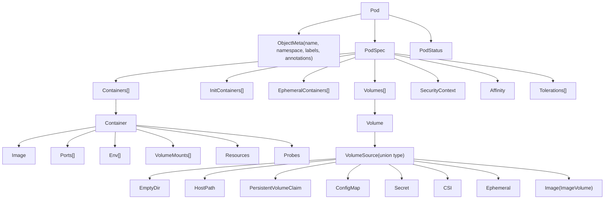
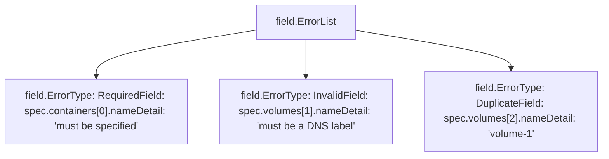
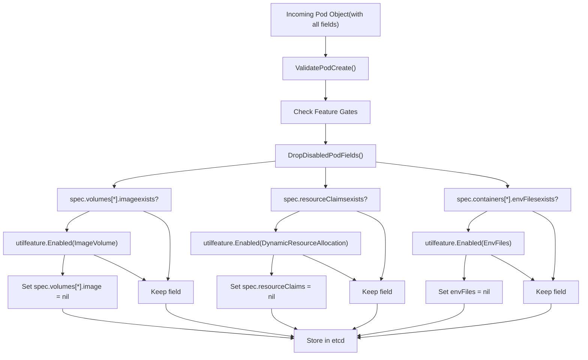
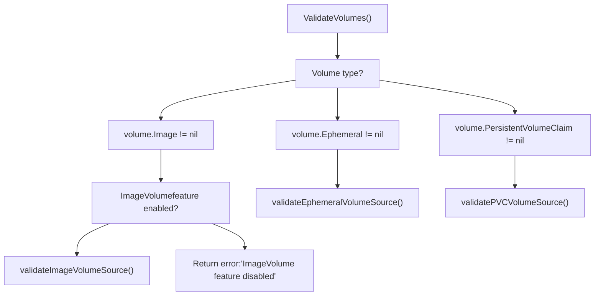

# API Object Types and Validation

Relevant source files

-   [api/openapi-spec/swagger.json](https://github.com/kubernetes/kubernetes/blob/2757a872/api/openapi-spec/swagger.json)
-   [api/openapi-spec/v3/api\_\_v1\_openapi.json](https://github.com/kubernetes/kubernetes/blob/2757a872/api/openapi-spec/v3/api__v1_openapi.json)
-   [api/openapi-spec/v3/apis\_\_admissionregistration.k8s.io\_\_v1\_openapi.json](https://github.com/kubernetes/kubernetes/blob/2757a872/api/openapi-spec/v3/apis__admissionregistration.k8s.io__v1_openapi.json)
-   [api/openapi-spec/v3/apis\_\_apiextensions.k8s.io\_\_v1\_openapi.json](https://github.com/kubernetes/kubernetes/blob/2757a872/api/openapi-spec/v3/apis__apiextensions.k8s.io__v1_openapi.json)
-   [api/openapi-spec/v3/apis\_\_apps\_\_v1\_openapi.json](https://github.com/kubernetes/kubernetes/blob/2757a872/api/openapi-spec/v3/apis__apps__v1_openapi.json)
-   [api/openapi-spec/v3/apis\_\_autoscaling\_\_v1\_openapi.json](https://github.com/kubernetes/kubernetes/blob/2757a872/api/openapi-spec/v3/apis__autoscaling__v1_openapi.json)
-   [api/openapi-spec/v3/apis\_\_autoscaling\_\_v2\_openapi.json](https://github.com/kubernetes/kubernetes/blob/2757a872/api/openapi-spec/v3/apis__autoscaling__v2_openapi.json)
-   [api/openapi-spec/v3/apis\_\_batch\_\_v1\_openapi.json](https://github.com/kubernetes/kubernetes/blob/2757a872/api/openapi-spec/v3/apis__batch__v1_openapi.json)
-   [api/openapi-spec/v3/apis\_\_certificates.k8s.io\_\_v1\_openapi.json](https://github.com/kubernetes/kubernetes/blob/2757a872/api/openapi-spec/v3/apis__certificates.k8s.io__v1_openapi.json)
-   [api/openapi-spec/v3/apis\_\_coordination.k8s.io\_\_v1\_openapi.json](https://github.com/kubernetes/kubernetes/blob/2757a872/api/openapi-spec/v3/apis__coordination.k8s.io__v1_openapi.json)
-   [api/openapi-spec/v3/apis\_\_internal.apiserver.k8s.io\_\_v1alpha1\_openapi.json](https://github.com/kubernetes/kubernetes/blob/2757a872/api/openapi-spec/v3/apis__internal.apiserver.k8s.io__v1alpha1_openapi.json)
-   [api/openapi-spec/v3/apis\_\_networking.k8s.io\_\_v1\_openapi.json](https://github.com/kubernetes/kubernetes/blob/2757a872/api/openapi-spec/v3/apis__networking.k8s.io__v1_openapi.json)
-   [api/openapi-spec/v3/apis\_\_node.k8s.io\_\_v1\_openapi.json](https://github.com/kubernetes/kubernetes/blob/2757a872/api/openapi-spec/v3/apis__node.k8s.io__v1_openapi.json)
-   [api/openapi-spec/v3/apis\_\_policy\_\_v1\_openapi.json](https://github.com/kubernetes/kubernetes/blob/2757a872/api/openapi-spec/v3/apis__policy__v1_openapi.json)
-   [api/openapi-spec/v3/apis\_\_rbac.authorization.k8s.io\_\_v1\_openapi.json](https://github.com/kubernetes/kubernetes/blob/2757a872/api/openapi-spec/v3/apis__rbac.authorization.k8s.io__v1_openapi.json)
-   [api/openapi-spec/v3/apis\_\_storage.k8s.io\_\_v1\_openapi.json](https://github.com/kubernetes/kubernetes/blob/2757a872/api/openapi-spec/v3/apis__storage.k8s.io__v1_openapi.json)
-   [pkg/api/pod/util.go](https://github.com/kubernetes/kubernetes/blob/2757a872/pkg/api/pod/util.go)
-   [pkg/api/pod/util\_test.go](https://github.com/kubernetes/kubernetes/blob/2757a872/pkg/api/pod/util_test.go)
-   [pkg/api/v1/pod/util.go](https://github.com/kubernetes/kubernetes/blob/2757a872/pkg/api/v1/pod/util.go)
-   [pkg/api/v1/pod/util\_test.go](https://github.com/kubernetes/kubernetes/blob/2757a872/pkg/api/v1/pod/util_test.go)
-   [pkg/apis/core/fuzzer/fuzzer.go](https://github.com/kubernetes/kubernetes/blob/2757a872/pkg/apis/core/fuzzer/fuzzer.go)
-   [pkg/apis/core/types.go](https://github.com/kubernetes/kubernetes/blob/2757a872/pkg/apis/core/types.go)
-   [pkg/apis/core/v1/defaults.go](https://github.com/kubernetes/kubernetes/blob/2757a872/pkg/apis/core/v1/defaults.go)
-   [pkg/apis/core/v1/defaults\_test.go](https://github.com/kubernetes/kubernetes/blob/2757a872/pkg/apis/core/v1/defaults_test.go)
-   [pkg/apis/core/v1/zz\_generated.conversion.go](https://github.com/kubernetes/kubernetes/blob/2757a872/pkg/apis/core/v1/zz_generated.conversion.go)
-   [pkg/apis/core/validation/validation.go](https://github.com/kubernetes/kubernetes/blob/2757a872/pkg/apis/core/validation/validation.go)
-   [pkg/apis/core/validation/validation\_test.go](https://github.com/kubernetes/kubernetes/blob/2757a872/pkg/apis/core/validation/validation_test.go)
-   [pkg/apis/core/zz\_generated.deepcopy.go](https://github.com/kubernetes/kubernetes/blob/2757a872/pkg/apis/core/zz_generated.deepcopy.go)
-   [pkg/features/kube\_features.go](https://github.com/kubernetes/kubernetes/blob/2757a872/pkg/features/kube_features.go)
-   [pkg/generated/openapi/zz\_generated.openapi.go](https://github.com/kubernetes/kubernetes/blob/2757a872/pkg/generated/openapi/zz_generated.openapi.go)
-   [pkg/kubelet/status/generate.go](https://github.com/kubernetes/kubernetes/blob/2757a872/pkg/kubelet/status/generate.go)
-   [pkg/kubelet/status/generate\_test.go](https://github.com/kubernetes/kubernetes/blob/2757a872/pkg/kubelet/status/generate_test.go)
-   [pkg/kubelet/types/constants.go](https://github.com/kubernetes/kubernetes/blob/2757a872/pkg/kubelet/types/constants.go)
-   [pkg/kubelet/types/pod\_status.go](https://github.com/kubernetes/kubernetes/blob/2757a872/pkg/kubelet/types/pod_status.go)
-   [pkg/kubelet/types/pod\_status\_test.go](https://github.com/kubernetes/kubernetes/blob/2757a872/pkg/kubelet/types/pod_status_test.go)
-   [pkg/registry/core/pod/strategy.go](https://github.com/kubernetes/kubernetes/blob/2757a872/pkg/registry/core/pod/strategy.go)
-   [pkg/registry/core/pod/strategy\_test.go](https://github.com/kubernetes/kubernetes/blob/2757a872/pkg/registry/core/pod/strategy_test.go)
-   [staging/src/k8s.io/api/core/v1/generated.pb.go](https://github.com/kubernetes/kubernetes/blob/2757a872/staging/src/k8s.io/api/core/v1/generated.pb.go)
-   [staging/src/k8s.io/api/core/v1/generated.proto](https://github.com/kubernetes/kubernetes/blob/2757a872/staging/src/k8s.io/api/core/v1/generated.proto)
-   [staging/src/k8s.io/api/core/v1/types.go](https://github.com/kubernetes/kubernetes/blob/2757a872/staging/src/k8s.io/api/core/v1/types.go)
-   [staging/src/k8s.io/api/core/v1/types\_swagger\_doc\_generated.go](https://github.com/kubernetes/kubernetes/blob/2757a872/staging/src/k8s.io/api/core/v1/types_swagger_doc_generated.go)
-   [staging/src/k8s.io/api/core/v1/zz\_generated.deepcopy.go](https://github.com/kubernetes/kubernetes/blob/2757a872/staging/src/k8s.io/api/core/v1/zz_generated.deepcopy.go)
-   [staging/src/k8s.io/apiserver/pkg/features/kube\_features.go](https://github.com/kubernetes/kubernetes/blob/2757a872/staging/src/k8s.io/apiserver/pkg/features/kube_features.go)
-   [staging/src/k8s.io/client-go/applyconfigurations/internal/internal.go](https://github.com/kubernetes/kubernetes/blob/2757a872/staging/src/k8s.io/client-go/applyconfigurations/internal/internal.go)
-   [staging/src/k8s.io/client-go/applyconfigurations/utils.go](https://github.com/kubernetes/kubernetes/blob/2757a872/staging/src/k8s.io/client-go/applyconfigurations/utils.go)
-   [test/compatibility\_lifecycle/reference/feature\_list.md](https://github.com/kubernetes/kubernetes/blob/2757a872/test/compatibility_lifecycle/reference/feature_list.md?plain=1)
-   [test/compatibility\_lifecycle/reference/versioned\_feature\_list.yaml](https://github.com/kubernetes/kubernetes/blob/2757a872/test/compatibility_lifecycle/reference/versioned_feature_list.yaml)
-   [test/integration/scheduler\_perf/dra/dra\_test.go](https://github.com/kubernetes/kubernetes/blob/2757a872/test/integration/scheduler_perf/dra/dra_test.go)

## Purpose and Scope

This page details the core API object types that form the foundation of Kubernetes (Pod, Volume, Container), the validation framework that ensures API objects meet structural and semantic requirements, and how the `DropDisabledFields` mechanism integrates with feature gates to control field availability based on feature lifecycle stages.

For information about feature gate lifecycle management (Alpha→Beta→GA→Locked→Removed), see [Feature Gates and Lifecycle](/kubernetes/kubernetes/2.1-feature-gates-and-lifecycle). For details on how validated objects are stored in etcd, see [Storage Backend and Caching](/kubernetes/kubernetes/2.3-storage-backend-and-caching).

## Core API Object Types

### Pod Object Hierarchy

The Pod is the fundamental workload unit in Kubernetes. It consists of a nested structure of types that define containers, volumes, security policies, and scheduling constraints.


**Sources:** [staging/src/k8s.io/api/core/v1/types.go1-6000](https://github.com/kubernetes/kubernetes/blob/2757a872/staging/src/k8s.io/api/core/v1/types.go#L1-L6000) [pkg/apis/core/types.go1-6000](https://github.com/kubernetes/kubernetes/blob/2757a872/pkg/apis/core/types.go#L1-L6000)

### Key Type Definitions

The table below summarizes the primary types and their locations in the codebase:

| Type | External (v1) | Internal | Purpose |
| --- | --- | --- | --- |
| `Pod` | [staging/src/k8s.io/api/core/v1/types.go36-239](https://github.com/kubernetes/kubernetes/blob/2757a872/staging/src/k8s.io/api/core/v1/types.go#L36-L239) | [pkg/apis/core/types.go4000-4200](https://github.com/kubernetes/kubernetes/blob/2757a872/pkg/apis/core/types.go#L4000-L4200) | Top-level workload object |
| `PodSpec` | [staging/src/k8s.io/api/core/v1/types.go2895-3900](https://github.com/kubernetes/kubernetes/blob/2757a872/staging/src/k8s.io/api/core/v1/types.go#L2895-L3900) | [pkg/apis/core/types.go3000-4000](https://github.com/kubernetes/kubernetes/blob/2757a872/pkg/apis/core/types.go#L3000-L4000) | Desired state specification |
| `Container` | [staging/src/k8s.io/api/core/v1/types.go2265-2590](https://github.com/kubernetes/kubernetes/blob/2757a872/staging/src/k8s.io/api/core/v1/types.go#L2265-L2590) | [pkg/apis/core/types.go2300-2600](https://github.com/kubernetes/kubernetes/blob/2757a872/pkg/apis/core/types.go#L2300-L2600) | Container definition |
| `Volume` | [staging/src/k8s.io/api/core/v1/types.go35-45](https://github.com/kubernetes/kubernetes/blob/2757a872/staging/src/k8s.io/api/core/v1/types.go#L35-L45) | [pkg/apis/core/types.go44-54](https://github.com/kubernetes/kubernetes/blob/2757a872/pkg/apis/core/types.go#L44-L54) | Named volume in pod |
| `VolumeSource` | [staging/src/k8s.io/api/core/v1/types.go48-222](https://github.com/kubernetes/kubernetes/blob/2757a872/staging/src/k8s.io/api/core/v1/types.go#L48-L222) | [pkg/apis/core/types.go56-227](https://github.com/kubernetes/kubernetes/blob/2757a872/pkg/apis/core/types.go#L56-L227) | Union type for volume backends |
| `PodStatus` | [staging/src/k8s.io/api/core/v1/types.go3902-4080](https://github.com/kubernetes/kubernetes/blob/2757a872/staging/src/k8s.io/api/core/v1/types.go#L3902-L4080) | [pkg/apis/core/types.go4200-4400](https://github.com/kubernetes/kubernetes/blob/2757a872/pkg/apis/core/types.go#L4200-L4400) | Observed state |

### VolumeSource Union Type

`VolumeSource` is a union type where exactly one field must be set. The available volume types include:

| Volume Type | Field | Feature Gate | Purpose |
| --- | --- | --- | --- |
| EmptyDir | `EmptyDir *EmptyDirVolumeSource` | None | Temporary directory tied to pod lifetime |
| HostPath | `HostPath *HostPathVolumeSource` | None | Mount from host filesystem |
| PersistentVolumeClaim | `PersistentVolumeClaim *PersistentVolumeClaimVolumeSource` | None | Reference to PVC |
| ConfigMap | `ConfigMap *ConfigMapVolumeSource` | None | Populate from ConfigMap |
| Secret | `Secret *SecretVolumeSource` | None | Populate from Secret |
| CSI | `CSI *CSIVolumeSource` | None | Ephemeral CSI volume |
| Ephemeral | `Ephemeral *EphemeralVolumeSource` | None | Generic ephemeral volume via PVC |
| Image | `Image *ImageVolumeSource` | `ImageVolume` | OCI image/artifact as volume |

**Sources:** [staging/src/k8s.io/api/core/v1/types.go48-222](https://github.com/kubernetes/kubernetes/blob/2757a872/staging/src/k8s.io/api/core/v1/types.go#L48-L222) [pkg/apis/core/types.go56-227](https://github.com/kubernetes/kubernetes/blob/2757a872/pkg/apis/core/types.go#L56-L227)

## Validation Framework

### Validation Pipeline

When an API request arrives at the API server, the object undergoes validation before being persisted to etcd. The validation pipeline integrates with feature gates to conditionally validate fields.

> **[Mermaid sequence]**
> *(图表结构无法解析)*

**Sources:** [pkg/apis/core/validation/validation.go1-100](https://github.com/kubernetes/kubernetes/blob/2757a872/pkg/apis/core/validation/validation.go#L1-L100) [pkg/registry/core/pod/strategy.go1-300](https://github.com/kubernetes/kubernetes/blob/2757a872/pkg/registry/core/pod/strategy.go#L1-L300)

### Core Validation Functions

The validation framework is located in `pkg/apis/core/validation/validation.go` and provides hierarchical validation:

| Function | Location | Purpose |
| --- | --- | --- |
| `ValidatePodCreate` | [pkg/apis/core/validation/validation.go3500-3600](https://github.com/kubernetes/kubernetes/blob/2757a872/pkg/apis/core/validation/validation.go#L3500-L3600) | Top-level validation for pod creation |
| `ValidatePodUpdate` | [pkg/apis/core/validation/validation.go3700-3900](https://github.com/kubernetes/kubernetes/blob/2757a872/pkg/apis/core/validation/validation.go#L3700-L3900) | Validation for pod updates (checks immutable fields) |
| `ValidatePodSpec` | [pkg/apis/core/validation/validation.go3100-3400](https://github.com/kubernetes/kubernetes/blob/2757a872/pkg/apis/core/validation/validation.go#L3100-L3400) | Validates PodSpec structure |
| `ValidateVolumes` | [pkg/apis/core/validation/validation.go445-488](https://github.com/kubernetes/kubernetes/blob/2757a872/pkg/apis/core/validation/validation.go#L445-L488) | Validates volume definitions and uniqueness |
| `validateVolumeSource` | [pkg/apis/core/validation/validation.go544-800](https://github.com/kubernetes/kubernetes/blob/2757a872/pkg/apis/core/validation/validation.go#L544-L800) | Validates individual volume source (union type) |
| `ValidateContainers` | [pkg/apis/core/validation/validation.go2200-2400](https://github.com/kubernetes/kubernetes/blob/2757a872/pkg/apis/core/validation/validation.go#L2200-L2400) | Validates container specifications |
| `ValidateResourceRequirements` | [pkg/apis/core/validation/validation.go1800-1950](https://github.com/kubernetes/kubernetes/blob/2757a872/pkg/apis/core/validation/validation.go#L1800-L1950) | Validates resource requests/limits |
| `ValidateEnvVar` | [pkg/apis/core/validation/validation.go2000-2100](https://github.com/kubernetes/kubernetes/blob/2757a872/pkg/apis/core/validation/validation.go#L2000-L2100) | Validates environment variable definitions |

**Sources:** [pkg/apis/core/validation/validation.go1-10000](https://github.com/kubernetes/kubernetes/blob/2757a872/pkg/apis/core/validation/validation.go#L1-L10000)

### Validation Error Reporting

Validation errors are reported using `field.ErrorList`, which provides structured error information with field paths:


Field path examples:

-   `spec.containers[0].image` - First container's image field
-   `spec.volumes[1].persistentVolumeClaim.claimName` - Second volume's PVC name
-   `metadata.labels` - Pod labels

**Sources:** [pkg/apis/core/validation/validation.go1-100](https://github.com/kubernetes/kubernetes/blob/2757a872/pkg/apis/core/validation/validation.go#L1-L100)

### Validation Options

Validation behavior is controlled by `PodValidationOptions` passed through the validation call stack:

```
// From pkg/apis/core/validation/validation.gotype PodValidationOptions struct {    AllowInvalidPodDeletionCost bool    AllowIndivisibleHugePagesValues bool    AllowHostPIDSharingWithoutHostNetwork bool    AllowWindowsHostProcessField bool    AllowExpandedDNSConfig bool    // ... additional options}
```
**Sources:** [pkg/apis/core/validation/validation.go100-200](https://github.com/kubernetes/kubernetes/blob/2757a872/pkg/apis/core/validation/validation.go#L100-L200)

## Feature Gate Integration

### DropDisabledFields Mechanism

The `DropDisabledFields` functions ensure that fields controlled by disabled feature gates are removed from objects before storage. This prevents invalid state from being persisted when a feature is not enabled.


**Sources:** [pkg/apis/core/validation/validation.go445-488](https://github.com/kubernetes/kubernetes/blob/2757a872/pkg/apis/core/validation/validation.go#L445-L488) [pkg/registry/core/pod/strategy.go1-300](https://github.com/kubernetes/kubernetes/blob/2757a872/pkg/registry/core/pod/strategy.go#L1-L300)

### Field Dropping Implementation

The field dropping logic is implemented in the pod strategy and validation packages:

| Function | Location | Purpose |
| --- | --- | --- |
| `DropDisabledPodFields` | [pkg/apis/core/validation/validation.go3000-3100](https://github.com/kubernetes/kubernetes/blob/2757a872/pkg/apis/core/validation/validation.go#L3000-L3100) | Top-level field dropper for pods |
| `dropDisabledFields` | [pkg/apis/core/validation/validation.go3000-3050](https://github.com/kubernetes/kubernetes/blob/2757a872/pkg/apis/core/validation/validation.go#L3000-L3050) | Helper that checks gates and conditionally drops |
| `DropDisabledTemplateFields` | [pkg/apis/core/validation/validation.go3100-3200](https://github.com/kubernetes/kubernetes/blob/2757a872/pkg/apis/core/validation/validation.go#L3100-L3200) | Drops fields from pod templates (in Deployments, etc.) |

The dropping logic follows this pattern:

```
// Pseudocode from pkg/apis/core/validation/validation.gofunc DropDisabledPodFields(pod *core.Pod, oldPod *core.Pod) {    // Drop ImageVolume if feature is disabled    if !utilfeature.DefaultFeatureGate.Enabled(features.ImageVolume) {        // Unless the field existed in oldPod (grandfathering)        if oldPod == nil || !hasImageVolume(oldPod) {            for i := range pod.Spec.Volumes {                pod.Spec.Volumes[i].Image = nil            }        }    }        // Drop DRA fields if feature is disabled    if !utilfeature.DefaultFeatureGate.Enabled(features.DynamicResourceAllocation) {        if oldPod == nil || len(oldPod.Spec.ResourceClaims) == 0 {            pod.Spec.ResourceClaims = nil        }    }        // Similar logic for other gated fields...}
```
**Grandfathering:** If a field existed in `oldPod` (during update), it is preserved even if the feature gate is now disabled. This prevents existing pods from being rejected during updates.

**Sources:** [pkg/apis/core/validation/validation.go3000-3100](https://github.com/kubernetes/kubernetes/blob/2757a872/pkg/apis/core/validation/validation.go#L3000-L3100) [pkg/registry/core/pod/strategy.go100-200](https://github.com/kubernetes/kubernetes/blob/2757a872/pkg/registry/core/pod/strategy.go#L100-L200)

### Validation with Feature Gates

Validation functions check feature gates to determine whether to validate gated fields or reject them:


**Sources:** [pkg/apis/core/validation/validation.go544-800](https://github.com/kubernetes/kubernetes/blob/2757a872/pkg/apis/core/validation/validation.go#L544-L800)

## Field-Level Validation Rules

### Volume Validation

Volume validation ensures that:

1.  Each volume has a unique name (DNS label format)
2.  Exactly one VolumeSource field is set (union type constraint)
3.  Volume-specific constraints are satisfied

Example volume validation rules:

| Volume Type | Key Validation Rules | Implementation |
| --- | --- | --- |
| `EmptyDir` | Optional sizeLimit must be positive | [pkg/apis/core/validation/validation.go700-750](https://github.com/kubernetes/kubernetes/blob/2757a872/pkg/apis/core/validation/validation.go#L700-L750) |
| `HostPath` | Path must not be empty, type must be valid | [pkg/apis/core/validation/validation.go750-850](https://github.com/kubernetes/kubernetes/blob/2757a872/pkg/apis/core/validation/validation.go#L750-L850) |
| `PersistentVolumeClaim` | ClaimName must be valid DNS subdomain | [pkg/apis/core/validation/validation.go850-900](https://github.com/kubernetes/kubernetes/blob/2757a872/pkg/apis/core/validation/validation.go#L850-L900) |
| `Secret` | SecretName must exist, items must have valid keys | [pkg/apis/core/validation/validation.go1000-1100](https://github.com/kubernetes/kubernetes/blob/2757a872/pkg/apis/core/validation/validation.go#L1000-L1100) |
| `ConfigMap` | ConfigMapName must exist, items must have valid keys | [pkg/apis/core/validation/validation.go1100-1200](https://github.com/kubernetes/kubernetes/blob/2757a872/pkg/apis/core/validation/validation.go#L1100-L1200) |
| `Image` | Requires ImageVolume feature gate, must specify reference | [pkg/apis/core/validation/validation.go900-950](https://github.com/kubernetes/kubernetes/blob/2757a872/pkg/apis/core/validation/validation.go#L900-L950) |

**Sources:** [pkg/apis/core/validation/validation.go544-1500](https://github.com/kubernetes/kubernetes/blob/2757a872/pkg/apis/core/validation/validation.go#L544-L1500)

### Container Validation

Container validation rules include:

| Field | Validation Rules | Implementation |
| --- | --- | --- |
| `Name` | Required, must be DNS label | [pkg/apis/core/validation/validation.go2200-2250](https://github.com/kubernetes/kubernetes/blob/2757a872/pkg/apis/core/validation/validation.go#L2200-L2250) |
| `Image` | Required (except for init containers in some cases) | [pkg/apis/core/validation/validation.go2250-2300](https://github.com/kubernetes/kubernetes/blob/2757a872/pkg/apis/core/validation/validation.go#L2250-L2300) |
| `Ports` | Unique container port numbers, valid port range (1-65535) | [pkg/apis/core/validation/validation.go2400-2500](https://github.com/kubernetes/kubernetes/blob/2757a872/pkg/apis/core/validation/validation.go#L2400-L2500) |
| `Env` | Unique env var names, valid names (C identifier or relaxed) | [pkg/apis/core/validation/validation.go2000-2100](https://github.com/kubernetes/kubernetes/blob/2757a872/pkg/apis/core/validation/validation.go#L2000-L2100) |
| `Resources` | Requests ≤ Limits, positive values, valid resource names | [pkg/apis/core/validation/validation.go1800-1950](https://github.com/kubernetes/kubernetes/blob/2757a872/pkg/apis/core/validation/validation.go#L1800-L1950) |
| `VolumeMounts` | Referenced volume must exist, unique mount paths | [pkg/apis/core/validation/validation.go2600-2700](https://github.com/kubernetes/kubernetes/blob/2757a872/pkg/apis/core/validation/validation.go#L2600-L2700) |

**Sources:** [pkg/apis/core/validation/validation.go1800-2700](https://github.com/kubernetes/kubernetes/blob/2757a872/pkg/apis/core/validation/validation.go#L1800-L2700)

### Pod-Level Validation

Pod-level validation includes:

```
// Key validation checks from ValidatePodSpec// - At least one container must be specified// - Container names must be unique across all container types// - RestartPolicy must be valid (Always, OnFailure, Never)// - DNSPolicy must be valid// - NodeSelector must have valid label selectors// - ServiceAccountName must be valid DNS subdomain// - HostNetwork/HostIPC/HostPID constraints// - SecurityContext constraints (runAsUser, fsGroup, etc.)// - Affinity rules must be valid// - Tolerations must be valid
```
**Sources:** [pkg/apis/core/validation/validation.go3100-3400](https://github.com/kubernetes/kubernetes/blob/2757a872/pkg/apis/core/validation/validation.go#L3100-L3400)

## OpenAPI Schema Generation

API types are converted to OpenAPI schemas for API discovery and client generation. The schemas are generated from the Go struct tags and comments.

### Schema Files

| File | Purpose |
| --- | --- |
| `api/openapi-spec/swagger.json` | OpenAPI v2 schema for all API groups |
| `api/openapi-spec/v3/api__v1_openapi.json` | OpenAPI v3 schema for core/v1 |
| `pkg/generated/openapi/zz_generated.openapi.go` | Generated OpenAPI definitions |

**Example from OpenAPI schema:**

```
{  "io.k8s.api.core.v1.Pod": {    "description": "Pod is a collection of containers that can run on a host...",    "properties": {      "apiVersion": { "type": "string" },      "kind": { "type": "string" },      "metadata": { "$ref": "#/definitions/io.k8s.apimachinery.pkg.apis.meta.v1.ObjectMeta" },      "spec": { "$ref": "#/definitions/io.k8s.api.core.v1.PodSpec" },      "status": { "$ref": "#/definitions/io.k8s.api.core.v1.PodStatus" }    },    "required": ["spec"],    "x-kubernetes-group-version-kind": [      { "group": "", "kind": "Pod", "version": "v1" }    ]  }}
```
Feature-gated fields are conditionally included in the schema based on the feature gate status during schema generation.

**Sources:** [api/openapi-spec/swagger.json1-100](https://github.com/kubernetes/kubernetes/blob/2757a872/api/openapi-spec/swagger.json#L1-L100) [pkg/generated/openapi/zz\_generated.openapi.go1-200](https://github.com/kubernetes/kubernetes/blob/2757a872/pkg/generated/openapi/zz_generated.openapi.go#L1-L200)

## Validation Testing

The validation framework is extensively tested with both unit tests and table-driven tests:

| Test File | Coverage |
| --- | --- |
| `pkg/apis/core/validation/validation_test.go` | Comprehensive pod, volume, container validation tests |
| `pkg/registry/core/pod/strategy_test.go` | Integration tests for pod strategy including validation |
| `pkg/api/pod/util_test.go` | Helper function tests |

Test structure typically uses table-driven tests with scenarios covering:

-   Valid configurations that should pass
-   Invalid configurations with expected error messages
-   Feature gate combinations (enabled/disabled)
-   Update scenarios (immutability checks)
-   Edge cases (empty values, boundary conditions)

**Sources:** [pkg/apis/core/validation/validation\_test.go1-500](https://github.com/kubernetes/kubernetes/blob/2757a872/pkg/apis/core/validation/validation_test.go#L1-L500) [pkg/registry/core/pod/strategy\_test.go1-200](https://github.com/kubernetes/kubernetes/blob/2757a872/pkg/registry/core/pod/strategy_test.go#L1-L200)

## Summary

The API object type and validation system provides:

1.  **Structured Types:** Hierarchical Go structs defining Pod, Container, Volume, and related objects in both versioned (v1) and internal representations
2.  **Comprehensive Validation:** Field-level and object-level validation with detailed error reporting via `field.ErrorList`
3.  **Feature Gate Integration:** Conditional field availability and validation based on feature gate status through `DropDisabledFields` and feature gate checks in validators
4.  **Schema Generation:** Automatic OpenAPI schema generation for API discovery and client tooling
5.  **Grandfathering Support:** Existing objects with gated fields are preserved during updates even when features are disabled

This validation framework ensures that only valid, well-formed objects reach the storage layer while providing flexibility for feature evolution through the feature gate system.

**Sources:** [staging/src/k8s.io/api/core/v1/types.go1-6000](https://github.com/kubernetes/kubernetes/blob/2757a872/staging/src/k8s.io/api/core/v1/types.go#L1-L6000) [pkg/apis/core/types.go1-6000](https://github.com/kubernetes/kubernetes/blob/2757a872/pkg/apis/core/types.go#L1-L6000) [pkg/apis/core/validation/validation.go1-10000](https://github.com/kubernetes/kubernetes/blob/2757a872/pkg/apis/core/validation/validation.go#L1-L10000) [pkg/registry/core/pod/strategy.go1-300](https://github.com/kubernetes/kubernetes/blob/2757a872/pkg/registry/core/pod/strategy.go#L1-L300) [pkg/features/kube\_features.go1-1000](https://github.com/kubernetes/kubernetes/blob/2757a872/pkg/features/kube_features.go#L1-L1000)
