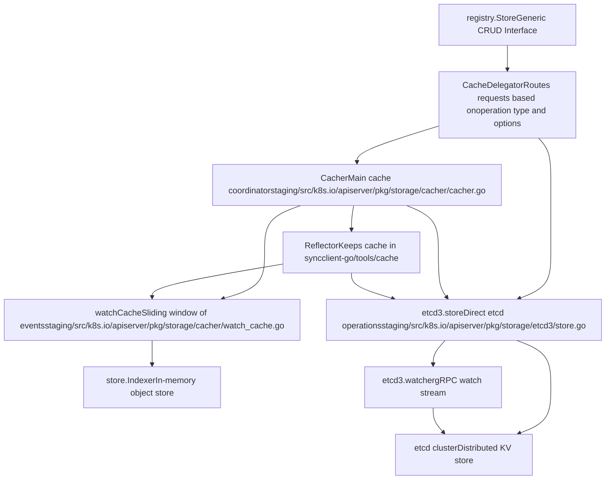
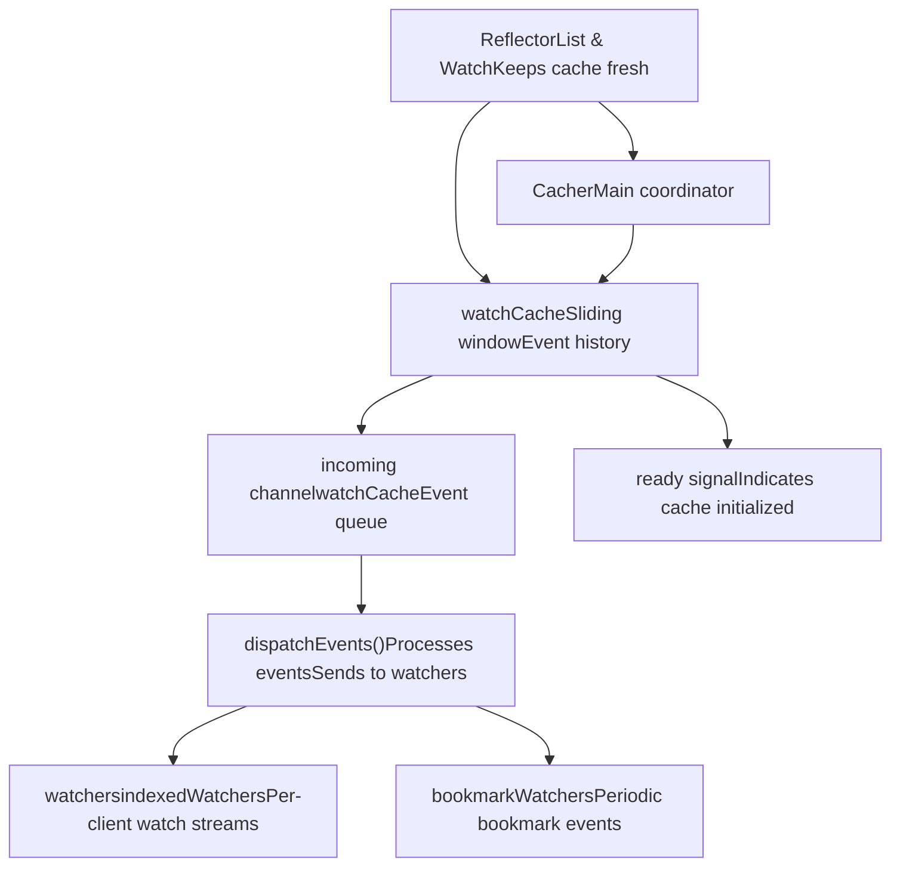
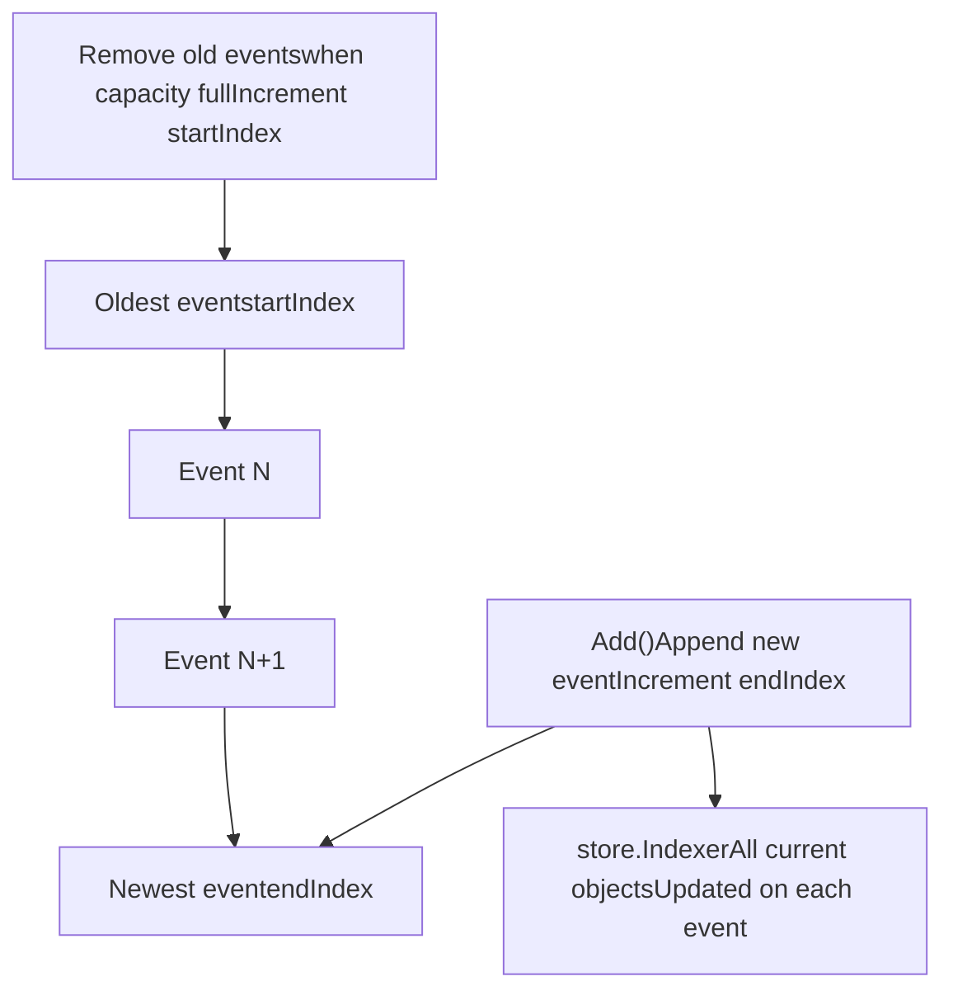
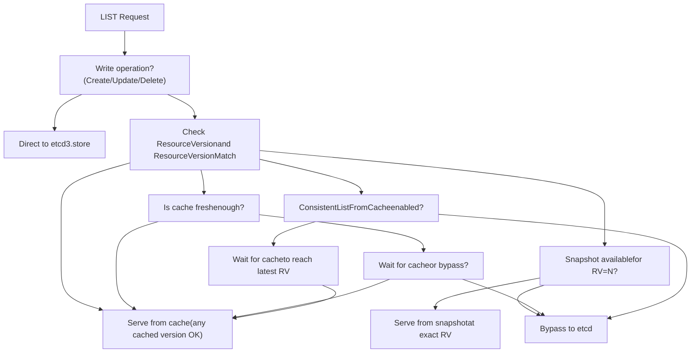

# Storage Backend and Caching

Relevant source files

-   [cmd/kube-apiserver/app/options/options.go](https://github.com/kubernetes/kubernetes/blob/2757a872/cmd/kube-apiserver/app/options/options.go)
-   [cmd/kube-apiserver/app/options/options\_test.go](https://github.com/kubernetes/kubernetes/blob/2757a872/cmd/kube-apiserver/app/options/options_test.go)
-   [cmd/kube-apiserver/app/options/validation.go](https://github.com/kubernetes/kubernetes/blob/2757a872/cmd/kube-apiserver/app/options/validation.go)
-   [cmd/kube-apiserver/app/options/validation\_test.go](https://github.com/kubernetes/kubernetes/blob/2757a872/cmd/kube-apiserver/app/options/validation_test.go)
-   [cmd/kube-apiserver/app/server.go](https://github.com/kubernetes/kubernetes/blob/2757a872/cmd/kube-apiserver/app/server.go)
-   [pkg/controlplane/controller/defaultservicecidr/OWNERS](https://github.com/kubernetes/kubernetes/blob/2757a872/pkg/controlplane/controller/defaultservicecidr/OWNERS)
-   [pkg/controlplane/controller/defaultservicecidr/default\_servicecidr\_controller.go](https://github.com/kubernetes/kubernetes/blob/2757a872/pkg/controlplane/controller/defaultservicecidr/default_servicecidr_controller.go)
-   [pkg/controlplane/controller/defaultservicecidr/default\_servicecidr\_controller\_test.go](https://github.com/kubernetes/kubernetes/blob/2757a872/pkg/controlplane/controller/defaultservicecidr/default_servicecidr_controller_test.go)
-   [pkg/kubeapiserver/options/serving.go](https://github.com/kubernetes/kubernetes/blob/2757a872/pkg/kubeapiserver/options/serving.go)
-   [pkg/registry/networking/servicecidr/doc.go](https://github.com/kubernetes/kubernetes/blob/2757a872/pkg/registry/networking/servicecidr/doc.go)
-   [pkg/registry/networking/servicecidr/storage/storage.go](https://github.com/kubernetes/kubernetes/blob/2757a872/pkg/registry/networking/servicecidr/storage/storage.go)
-   [pkg/registry/networking/servicecidr/strategy.go](https://github.com/kubernetes/kubernetes/blob/2757a872/pkg/registry/networking/servicecidr/strategy.go)
-   [pkg/registry/networking/servicecidr/strategy\_test.go](https://github.com/kubernetes/kubernetes/blob/2757a872/pkg/registry/networking/servicecidr/strategy_test.go)
-   [staging/src/k8s.io/apiserver/pkg/apis/example/install/install.go](https://github.com/kubernetes/kubernetes/blob/2757a872/staging/src/k8s.io/apiserver/pkg/apis/example/install/install.go)
-   [staging/src/k8s.io/apiserver/pkg/apis/example2/install/install.go](https://github.com/kubernetes/kubernetes/blob/2757a872/staging/src/k8s.io/apiserver/pkg/apis/example2/install/install.go)
-   [staging/src/k8s.io/apiserver/pkg/endpoints/filters/mux\_discovery\_complete.go](https://github.com/kubernetes/kubernetes/blob/2757a872/staging/src/k8s.io/apiserver/pkg/endpoints/filters/mux_discovery_complete.go)
-   [staging/src/k8s.io/apiserver/pkg/endpoints/filters/mux\_discovery\_complete\_test.go](https://github.com/kubernetes/kubernetes/blob/2757a872/staging/src/k8s.io/apiserver/pkg/endpoints/filters/mux_discovery_complete_test.go)
-   [staging/src/k8s.io/apiserver/pkg/endpoints/request/server\_shutdown\_signal.go](https://github.com/kubernetes/kubernetes/blob/2757a872/staging/src/k8s.io/apiserver/pkg/endpoints/request/server_shutdown_signal.go)
-   [staging/src/k8s.io/apiserver/pkg/registry/generic/options.go](https://github.com/kubernetes/kubernetes/blob/2757a872/staging/src/k8s.io/apiserver/pkg/registry/generic/options.go)
-   [staging/src/k8s.io/apiserver/pkg/registry/generic/registry/dryrun.go](https://github.com/kubernetes/kubernetes/blob/2757a872/staging/src/k8s.io/apiserver/pkg/registry/generic/registry/dryrun.go)
-   [staging/src/k8s.io/apiserver/pkg/registry/generic/registry/storage\_factory.go](https://github.com/kubernetes/kubernetes/blob/2757a872/staging/src/k8s.io/apiserver/pkg/registry/generic/registry/storage_factory.go)
-   [staging/src/k8s.io/apiserver/pkg/registry/generic/registry/store.go](https://github.com/kubernetes/kubernetes/blob/2757a872/staging/src/k8s.io/apiserver/pkg/registry/generic/registry/store.go)
-   [staging/src/k8s.io/apiserver/pkg/registry/generic/registry/store\_test.go](https://github.com/kubernetes/kubernetes/blob/2757a872/staging/src/k8s.io/apiserver/pkg/registry/generic/registry/store_test.go)
-   [staging/src/k8s.io/apiserver/pkg/registry/generic/storage\_decorator.go](https://github.com/kubernetes/kubernetes/blob/2757a872/staging/src/k8s.io/apiserver/pkg/registry/generic/storage_decorator.go)
-   [staging/src/k8s.io/apiserver/pkg/server/config.go](https://github.com/kubernetes/kubernetes/blob/2757a872/staging/src/k8s.io/apiserver/pkg/server/config.go)
-   [staging/src/k8s.io/apiserver/pkg/server/config\_selfclient.go](https://github.com/kubernetes/kubernetes/blob/2757a872/staging/src/k8s.io/apiserver/pkg/server/config_selfclient.go)
-   [staging/src/k8s.io/apiserver/pkg/server/config\_selfclient\_test.go](https://github.com/kubernetes/kubernetes/blob/2757a872/staging/src/k8s.io/apiserver/pkg/server/config_selfclient_test.go)
-   [staging/src/k8s.io/apiserver/pkg/server/config\_test.go](https://github.com/kubernetes/kubernetes/blob/2757a872/staging/src/k8s.io/apiserver/pkg/server/config_test.go)
-   [staging/src/k8s.io/apiserver/pkg/server/filters/with\_retry\_after.go](https://github.com/kubernetes/kubernetes/blob/2757a872/staging/src/k8s.io/apiserver/pkg/server/filters/with_retry_after.go)
-   [staging/src/k8s.io/apiserver/pkg/server/filters/with\_retry\_after\_test.go](https://github.com/kubernetes/kubernetes/blob/2757a872/staging/src/k8s.io/apiserver/pkg/server/filters/with_retry_after_test.go)
-   [staging/src/k8s.io/apiserver/pkg/server/genericapiserver.go](https://github.com/kubernetes/kubernetes/blob/2757a872/staging/src/k8s.io/apiserver/pkg/server/genericapiserver.go)
-   [staging/src/k8s.io/apiserver/pkg/server/genericapiserver\_graceful\_termination\_test.go](https://github.com/kubernetes/kubernetes/blob/2757a872/staging/src/k8s.io/apiserver/pkg/server/genericapiserver_graceful_termination_test.go)
-   [staging/src/k8s.io/apiserver/pkg/server/genericapiserver\_test.go](https://github.com/kubernetes/kubernetes/blob/2757a872/staging/src/k8s.io/apiserver/pkg/server/genericapiserver_test.go)
-   [staging/src/k8s.io/apiserver/pkg/server/lifecycle\_signals.go](https://github.com/kubernetes/kubernetes/blob/2757a872/staging/src/k8s.io/apiserver/pkg/server/lifecycle_signals.go)
-   [staging/src/k8s.io/apiserver/pkg/server/options/etcd.go](https://github.com/kubernetes/kubernetes/blob/2757a872/staging/src/k8s.io/apiserver/pkg/server/options/etcd.go)
-   [staging/src/k8s.io/apiserver/pkg/server/options/etcd\_test.go](https://github.com/kubernetes/kubernetes/blob/2757a872/staging/src/k8s.io/apiserver/pkg/server/options/etcd_test.go)
-   [staging/src/k8s.io/apiserver/pkg/server/options/server\_run\_options.go](https://github.com/kubernetes/kubernetes/blob/2757a872/staging/src/k8s.io/apiserver/pkg/server/options/server_run_options.go)
-   [staging/src/k8s.io/apiserver/pkg/server/options/server\_run\_options\_test.go](https://github.com/kubernetes/kubernetes/blob/2757a872/staging/src/k8s.io/apiserver/pkg/server/options/server_run_options_test.go)
-   [staging/src/k8s.io/apiserver/pkg/server/options/serving.go](https://github.com/kubernetes/kubernetes/blob/2757a872/staging/src/k8s.io/apiserver/pkg/server/options/serving.go)
-   [staging/src/k8s.io/apiserver/pkg/server/options/serving\_test.go](https://github.com/kubernetes/kubernetes/blob/2757a872/staging/src/k8s.io/apiserver/pkg/server/options/serving_test.go)
-   [staging/src/k8s.io/apiserver/pkg/server/storage/resource\_encoding\_config.go](https://github.com/kubernetes/kubernetes/blob/2757a872/staging/src/k8s.io/apiserver/pkg/server/storage/resource_encoding_config.go)
-   [staging/src/k8s.io/apiserver/pkg/server/storage/storage\_factory.go](https://github.com/kubernetes/kubernetes/blob/2757a872/staging/src/k8s.io/apiserver/pkg/server/storage/storage_factory.go)
-   [staging/src/k8s.io/apiserver/pkg/server/storage/storage\_factory\_test.go](https://github.com/kubernetes/kubernetes/blob/2757a872/staging/src/k8s.io/apiserver/pkg/server/storage/storage_factory_test.go)
-   [staging/src/k8s.io/apiserver/pkg/storage/cacher/cache\_watcher.go](https://github.com/kubernetes/kubernetes/blob/2757a872/staging/src/k8s.io/apiserver/pkg/storage/cacher/cache_watcher.go)
-   [staging/src/k8s.io/apiserver/pkg/storage/cacher/cache\_watcher\_test.go](https://github.com/kubernetes/kubernetes/blob/2757a872/staging/src/k8s.io/apiserver/pkg/storage/cacher/cache_watcher_test.go)
-   [staging/src/k8s.io/apiserver/pkg/storage/cacher/cacher.go](https://github.com/kubernetes/kubernetes/blob/2757a872/staging/src/k8s.io/apiserver/pkg/storage/cacher/cacher.go)
-   [staging/src/k8s.io/apiserver/pkg/storage/cacher/cacher\_test.go](https://github.com/kubernetes/kubernetes/blob/2757a872/staging/src/k8s.io/apiserver/pkg/storage/cacher/cacher_test.go)
-   [staging/src/k8s.io/apiserver/pkg/storage/cacher/cacher\_testing\_utils\_test.go](https://github.com/kubernetes/kubernetes/blob/2757a872/staging/src/k8s.io/apiserver/pkg/storage/cacher/cacher_testing_utils_test.go)
-   [staging/src/k8s.io/apiserver/pkg/storage/cacher/cacher\_whitebox\_test.go](https://github.com/kubernetes/kubernetes/blob/2757a872/staging/src/k8s.io/apiserver/pkg/storage/cacher/cacher_whitebox_test.go)
-   [staging/src/k8s.io/apiserver/pkg/storage/cacher/delegator.go](https://github.com/kubernetes/kubernetes/blob/2757a872/staging/src/k8s.io/apiserver/pkg/storage/cacher/delegator.go)
-   [staging/src/k8s.io/apiserver/pkg/storage/cacher/delegator\_test.go](https://github.com/kubernetes/kubernetes/blob/2757a872/staging/src/k8s.io/apiserver/pkg/storage/cacher/delegator_test.go)
-   [staging/src/k8s.io/apiserver/pkg/storage/cacher/lister\_watcher.go](https://github.com/kubernetes/kubernetes/blob/2757a872/staging/src/k8s.io/apiserver/pkg/storage/cacher/lister_watcher.go)
-   [staging/src/k8s.io/apiserver/pkg/storage/cacher/lister\_watcher\_test.go](https://github.com/kubernetes/kubernetes/blob/2757a872/staging/src/k8s.io/apiserver/pkg/storage/cacher/lister_watcher_test.go)
-   [staging/src/k8s.io/apiserver/pkg/storage/cacher/metrics/metrics.go](https://github.com/kubernetes/kubernetes/blob/2757a872/staging/src/k8s.io/apiserver/pkg/storage/cacher/metrics/metrics.go)
-   [staging/src/k8s.io/apiserver/pkg/storage/cacher/store/store.go](https://github.com/kubernetes/kubernetes/blob/2757a872/staging/src/k8s.io/apiserver/pkg/storage/cacher/store/store.go)
-   [staging/src/k8s.io/apiserver/pkg/storage/cacher/store/store\_btree.go](https://github.com/kubernetes/kubernetes/blob/2757a872/staging/src/k8s.io/apiserver/pkg/storage/cacher/store/store_btree.go)
-   [staging/src/k8s.io/apiserver/pkg/storage/cacher/store/store\_btree\_test.go](https://github.com/kubernetes/kubernetes/blob/2757a872/staging/src/k8s.io/apiserver/pkg/storage/cacher/store/store_btree_test.go)
-   [staging/src/k8s.io/apiserver/pkg/storage/cacher/store/store\_test.go](https://github.com/kubernetes/kubernetes/blob/2757a872/staging/src/k8s.io/apiserver/pkg/storage/cacher/store/store_test.go)
-   [staging/src/k8s.io/apiserver/pkg/storage/cacher/watch\_cache.go](https://github.com/kubernetes/kubernetes/blob/2757a872/staging/src/k8s.io/apiserver/pkg/storage/cacher/watch_cache.go)
-   [staging/src/k8s.io/apiserver/pkg/storage/cacher/watch\_cache\_interval.go](https://github.com/kubernetes/kubernetes/blob/2757a872/staging/src/k8s.io/apiserver/pkg/storage/cacher/watch_cache_interval.go)
-   [staging/src/k8s.io/apiserver/pkg/storage/cacher/watch\_cache\_interval\_test.go](https://github.com/kubernetes/kubernetes/blob/2757a872/staging/src/k8s.io/apiserver/pkg/storage/cacher/watch_cache_interval_test.go)
-   [staging/src/k8s.io/apiserver/pkg/storage/cacher/watch\_cache\_test.go](https://github.com/kubernetes/kubernetes/blob/2757a872/staging/src/k8s.io/apiserver/pkg/storage/cacher/watch_cache_test.go)
-   [staging/src/k8s.io/apiserver/pkg/storage/etcd3/event.go](https://github.com/kubernetes/kubernetes/blob/2757a872/staging/src/k8s.io/apiserver/pkg/storage/etcd3/event.go)
-   [staging/src/k8s.io/apiserver/pkg/storage/etcd3/event\_test.go](https://github.com/kubernetes/kubernetes/blob/2757a872/staging/src/k8s.io/apiserver/pkg/storage/etcd3/event_test.go)
-   [staging/src/k8s.io/apiserver/pkg/storage/etcd3/store.go](https://github.com/kubernetes/kubernetes/blob/2757a872/staging/src/k8s.io/apiserver/pkg/storage/etcd3/store.go)
-   [staging/src/k8s.io/apiserver/pkg/storage/etcd3/store\_test.go](https://github.com/kubernetes/kubernetes/blob/2757a872/staging/src/k8s.io/apiserver/pkg/storage/etcd3/store_test.go)
-   [staging/src/k8s.io/apiserver/pkg/storage/etcd3/watcher.go](https://github.com/kubernetes/kubernetes/blob/2757a872/staging/src/k8s.io/apiserver/pkg/storage/etcd3/watcher.go)
-   [staging/src/k8s.io/apiserver/pkg/storage/etcd3/watcher\_test.go](https://github.com/kubernetes/kubernetes/blob/2757a872/staging/src/k8s.io/apiserver/pkg/storage/etcd3/watcher_test.go)
-   [staging/src/k8s.io/apiserver/pkg/storage/interfaces.go](https://github.com/kubernetes/kubernetes/blob/2757a872/staging/src/k8s.io/apiserver/pkg/storage/interfaces.go)
-   [staging/src/k8s.io/apiserver/pkg/storage/storagebackend/config.go](https://github.com/kubernetes/kubernetes/blob/2757a872/staging/src/k8s.io/apiserver/pkg/storage/storagebackend/config.go)
-   [staging/src/k8s.io/apiserver/pkg/storage/storagebackend/factory/etcd3.go](https://github.com/kubernetes/kubernetes/blob/2757a872/staging/src/k8s.io/apiserver/pkg/storage/storagebackend/factory/etcd3.go)
-   [staging/src/k8s.io/apiserver/pkg/storage/storagebackend/factory/factory.go](https://github.com/kubernetes/kubernetes/blob/2757a872/staging/src/k8s.io/apiserver/pkg/storage/storagebackend/factory/factory.go)
-   [staging/src/k8s.io/apiserver/pkg/storage/testing/store\_benchmarks.go](https://github.com/kubernetes/kubernetes/blob/2757a872/staging/src/k8s.io/apiserver/pkg/storage/testing/store_benchmarks.go)
-   [staging/src/k8s.io/apiserver/pkg/storage/testing/store\_tests.go](https://github.com/kubernetes/kubernetes/blob/2757a872/staging/src/k8s.io/apiserver/pkg/storage/testing/store_tests.go)
-   [staging/src/k8s.io/apiserver/pkg/storage/testing/utils.go](https://github.com/kubernetes/kubernetes/blob/2757a872/staging/src/k8s.io/apiserver/pkg/storage/testing/utils.go)
-   [staging/src/k8s.io/apiserver/pkg/storage/testing/watcher\_tests.go](https://github.com/kubernetes/kubernetes/blob/2757a872/staging/src/k8s.io/apiserver/pkg/storage/testing/watcher_tests.go)
-   [staging/src/k8s.io/apiserver/pkg/storage/util.go](https://github.com/kubernetes/kubernetes/blob/2757a872/staging/src/k8s.io/apiserver/pkg/storage/util.go)
-   [staging/src/k8s.io/apiserver/pkg/storage/util\_test.go](https://github.com/kubernetes/kubernetes/blob/2757a872/staging/src/k8s.io/apiserver/pkg/storage/util_test.go)
-   [staging/src/k8s.io/apiserver/pkg/util/notfoundhandler/not\_found\_handler.go](https://github.com/kubernetes/kubernetes/blob/2757a872/staging/src/k8s.io/apiserver/pkg/util/notfoundhandler/not_found_handler.go)
-   [staging/src/k8s.io/apiserver/pkg/util/notfoundhandler/not\_found\_handler\_test.go](https://github.com/kubernetes/kubernetes/blob/2757a872/staging/src/k8s.io/apiserver/pkg/util/notfoundhandler/not_found_handler_test.go)
-   [staging/src/k8s.io/component-base/version/version.go](https://github.com/kubernetes/kubernetes/blob/2757a872/staging/src/k8s.io/component-base/version/version.go)
-   [test/integration/metrics/metrics\_test.go](https://github.com/kubernetes/kubernetes/blob/2757a872/test/integration/metrics/metrics_test.go)
-   [test/integration/openshift/openshift\_test.go](https://github.com/kubernetes/kubernetes/blob/2757a872/test/integration/openshift/openshift_test.go)

## Purpose and Scope

This page documents the storage backend and caching architecture of the Kubernetes API server. It explains how the API server interacts with etcd (the distributed key-value store) and how the caching layer optimizes read operations to reduce load on etcd. This includes the etcd3 storage implementation, the watch cache mechanism, and the delegation logic that routes requests between cache and storage.

For information about API validation and feature gates, see [API Object Types and Validation](/kubernetes/kubernetes/2.2-api-object-types-and-validation). For information about how this storage layer integrates into the API server request processing pipeline, see [API Server Architecture](/kubernetes/kubernetes/3.1-api-server-architecture).

---

## Storage Architecture Overview

The storage layer provides a two-tier architecture: a direct etcd3 storage backend for writes and consistency-critical reads, and a caching layer (Cacher) that serves most read operations from an in-memory cache.


**Sources:** [staging/src/k8s.io/apiserver/pkg/storage/cacher/cacher.go262-343](https://github.com/kubernetes/kubernetes/blob/2757a872/staging/src/k8s.io/apiserver/pkg/storage/cacher/cacher.go#L262-L343) [staging/src/k8s.io/apiserver/pkg/storage/etcd3/store.go80-98](https://github.com/kubernetes/kubernetes/blob/2757a872/staging/src/k8s.io/apiserver/pkg/storage/etcd3/store.go#L80-L98) [staging/src/k8s.io/apiserver/pkg/storage/cacher/delegator.go1-20](https://github.com/kubernetes/kubernetes/blob/2757a872/staging/src/k8s.io/apiserver/pkg/storage/cacher/delegator.go#L1-L20)

---

## etcd3 Storage Backend

The `etcd3.store` provides direct access to etcd using the etcd v3 gRPC API. It implements the `storage.Interface` and handles all persistent operations.

### Core Structure

The store is defined in [staging/src/k8s.io/apiserver/pkg/storage/etcd3/store.go80-98](https://github.com/kubernetes/kubernetes/blob/2757a872/staging/src/k8s.io/apiserver/pkg/storage/etcd3/store.go#L80-L98):

```
type store struct {
    client             *kubernetes.Client    // etcd client wrapper
    codec              runtime.Codec         // serialization
    versioner          storage.Versioner     // resource version handling
    transformer        value.Transformer     // encryption/decryption
    pathPrefix         string                // e.g., "/registry/"
    groupResource      schema.GroupResource  // for metrics/logging
    watcher            *watcher              // watch implementation
    leaseManager       *leaseManager         // TTL management
}
```
### Key Operations

| Operation | Method | Description | Bypasses Cache |
| --- | --- | --- | --- |
| **Create** | `Create()` | Creates new object, fails if exists | Always |
| **Update** | `GuaranteedUpdate()` | Compare-and-swap update with retry | Always |
| **Delete** | `Delete()` | Deletes object with preconditions | Always |
| **Get** | `Get()` | Retrieves single object | No (via cache) |
| **List** | `GetList()` | Lists objects with filtering | No (via cache) |
| **Watch** | `Watch()` | Streams object changes | No (via cache) |

**Write Path:** All write operations (Create, Update, Delete) go directly to etcd using optimistic concurrency control. The store performs Compare-And-Swap operations using the resource version to ensure consistency [staging/src/k8s.io/apiserver/pkg/storage/etcd3/store.go273-339](https://github.com/kubernetes/kubernetes/blob/2757a872/staging/src/k8s.io/apiserver/pkg/storage/etcd3/store.go#L273-L339)

**Read Path:** Read operations (Get, List) can be served from cache when wrapped by the Cacher. Direct reads from etcd are used for cache misses or when specific consistency guarantees are required [staging/src/k8s.io/apiserver/pkg/storage/etcd3/store.go238-271](https://github.com/kubernetes/kubernetes/blob/2757a872/staging/src/k8s.io/apiserver/pkg/storage/etcd3/store.go#L238-L271)

**Sources:** [staging/src/k8s.io/apiserver/pkg/storage/etcd3/store.go80-271](https://github.com/kubernetes/kubernetes/blob/2757a872/staging/src/k8s.io/apiserver/pkg/storage/etcd3/store.go#L80-L271) [staging/src/k8s.io/apiserver/pkg/storage/etcd3/store.go273-339](https://github.com/kubernetes/kubernetes/blob/2757a872/staging/src/k8s.io/apiserver/pkg/storage/etcd3/store.go#L273-L339)

---

## Caching Layer Architecture

The Cacher provides an in-memory cache of etcd contents to reduce load on etcd for read operations. It maintains a synchronized view of objects using a Reflector that continuously watches etcd.

### Cacher Structure


The Cacher is initialized in [staging/src/k8s.io/apiserver/pkg/storage/cacher/cacher.go348-483](https://github.com/kubernetes/kubernetes/blob/2757a872/staging/src/k8s.io/apiserver/pkg/storage/cacher/cacher.go#L348-L483) Key initialization steps:

1.  **Create watchCache:** A sliding window that stores recent events [staging/src/k8s.io/apiserver/pkg/storage/cacher/cacher.go437-439](https://github.com/kubernetes/kubernetes/blob/2757a872/staging/src/k8s.io/apiserver/pkg/storage/cacher/cacher.go#L437-L439)
2.  **Create Reflector:** Uses `ListAndWatch` to keep cache synchronized [staging/src/k8s.io/apiserver/pkg/storage/cacher/cacher.go443-453](https://github.com/kubernetes/kubernetes/blob/2757a872/staging/src/k8s.io/apiserver/pkg/storage/cacher/cacher.go#L443-L453)
3.  **Start background goroutines:**
    -   Event dispatcher: [staging/src/k8s.io/apiserver/pkg/storage/cacher/cacher.go467](https://github.com/kubernetes/kubernetes/blob/2757a872/staging/src/k8s.io/apiserver/pkg/storage/cacher/cacher.go#L467-L467)
    -   Progress requester: [staging/src/k8s.io/apiserver/pkg/storage/cacher/cacher.go468](https://github.com/kubernetes/kubernetes/blob/2757a872/staging/src/k8s.io/apiserver/pkg/storage/cacher/cacher.go#L468-L468)
    -   Cache syncing: [staging/src/k8s.io/apiserver/pkg/storage/cacher/cacher.go470-481](https://github.com/kubernetes/kubernetes/blob/2757a872/staging/src/k8s.io/apiserver/pkg/storage/cacher/cacher.go#L470-L481)

**Sources:** [staging/src/k8s.io/apiserver/pkg/storage/cacher/cacher.go262-343](https://github.com/kubernetes/kubernetes/blob/2757a872/staging/src/k8s.io/apiserver/pkg/storage/cacher/cacher.go#L262-L343) [staging/src/k8s.io/apiserver/pkg/storage/cacher/cacher.go348-483](https://github.com/kubernetes/kubernetes/blob/2757a872/staging/src/k8s.io/apiserver/pkg/storage/cacher/cacher.go#L348-L483)

---

## Watch Cache Implementation

The `watchCache` is a core data structure that maintains a sliding window of recent events and the current state of all objects.

### Watch Cache Structure

The watchCache maintains two critical data structures [staging/src/k8s.io/apiserver/pkg/storage/cacher/watch\_cache.go89-164](https://github.com/kubernetes/kubernetes/blob/2757a872/staging/src/k8s.io/apiserver/pkg/storage/cacher/watch_cache.go#L89-L164):

| Component | Type | Purpose |
| --- | --- | --- |
| `cache` | `[]*watchCacheEvent` | Cyclic buffer of recent events |
| `store` | `store.Indexer` | Current state of all objects (supports queries) |
| `resourceVersion` | `uint64` | Latest observed resource version |
| `startIndex`, `endIndex` | `int` | Window into cyclic buffer |
| `capacity` | `int` | Maximum events to keep |

### Event History Window

The cache maintains a sliding window of events defined by `eventFreshDuration` (default: ~75 seconds) [staging/src/k8s.io/apiserver/pkg/storage/cacher/cacher.go69-77](https://github.com/kubernetes/kubernetes/blob/2757a872/staging/src/k8s.io/apiserver/pkg/storage/cacher/cacher.go#L69-L77):


### How Events Flow

1.  **Reflector watches etcd:** The Reflector calls `ListAndWatch` on the underlying storage [staging/src/k8s.io/apiserver/pkg/storage/cacher/cacher.go497](https://github.com/kubernetes/kubernetes/blob/2757a872/staging/src/k8s.io/apiserver/pkg/storage/cacher/cacher.go#L497-L497)

2.  **Events arrive at watchCache:** Through `Add()`, `Update()`, `Delete()` methods [staging/src/k8s.io/apiserver/pkg/storage/cacher/watch\_cache.go234-275](https://github.com/kubernetes/kubernetes/blob/2757a872/staging/src/k8s.io/apiserver/pkg/storage/cacher/watch_cache.go#L234-L275)

3.  **watchCache processes event:**

    -   Updates the `store` (current state) [staging/src/k8s.io/apiserver/pkg/storage/cacher/watch\_cache.go398-432](https://github.com/kubernetes/kubernetes/blob/2757a872/staging/src/k8s.io/apiserver/pkg/storage/cacher/watch_cache.go#L398-L432)
    -   Appends to `cache` array (history) [staging/src/k8s.io/apiserver/pkg/storage/cacher/watch\_cache.go398-432](https://github.com/kubernetes/kubernetes/blob/2757a872/staging/src/k8s.io/apiserver/pkg/storage/cacher/watch_cache.go#L398-L432)
    -   Calls `eventHandler` to notify Cacher [staging/src/k8s.io/apiserver/pkg/storage/cacher/watch\_cache.go427](https://github.com/kubernetes/kubernetes/blob/2757a872/staging/src/k8s.io/apiserver/pkg/storage/cacher/watch_cache.go#L427-L427)
4.  **Cacher dispatches to watchers:** Via `processEvent()` and `dispatchEvent()` [staging/src/k8s.io/apiserver/pkg/storage/cacher/cacher.go853-859](https://github.com/kubernetes/kubernetes/blob/2757a872/staging/src/k8s.io/apiserver/pkg/storage/cacher/cacher.go#L853-L859) [staging/src/k8s.io/apiserver/pkg/storage/cacher/cacher.go953-1013](https://github.com/kubernetes/kubernetes/blob/2757a872/staging/src/k8s.io/apiserver/pkg/storage/cacher/cacher.go#L953-L1013)


**Sources:** [staging/src/k8s.io/apiserver/pkg/storage/cacher/watch\_cache.go89-207](https://github.com/kubernetes/kubernetes/blob/2757a872/staging/src/k8s.io/apiserver/pkg/storage/cacher/watch_cache.go#L89-L207) [staging/src/k8s.io/apiserver/pkg/storage/cacher/watch\_cache.go234-275](https://github.com/kubernetes/kubernetes/blob/2757a872/staging/src/k8s.io/apiserver/pkg/storage/cacher/watch_cache.go#L234-L275) [staging/src/k8s.io/apiserver/pkg/storage/cacher/watch\_cache.go398-432](https://github.com/kubernetes/kubernetes/blob/2757a872/staging/src/k8s.io/apiserver/pkg/storage/cacher/watch_cache.go#L398-L432)

---

## Cache Delegation Logic

The `CacheDelegator` determines whether to serve a request from cache or bypass to etcd based on operation type, consistency requirements, and feature gates.

### Decision Flow for List Operations


### Key Decision Points

The delegation logic is implemented in [staging/src/k8s.io/apiserver/pkg/storage/cacher/delegator.go](https://github.com/kubernetes/kubernetes/blob/2757a872/staging/src/k8s.io/apiserver/pkg/storage/cacher/delegator.go) Key decision functions:

| Function | Purpose | Location |
| --- | --- | --- |
| `ShouldDelegateList()` | Determines if LIST should bypass cache | [delegator.go22-69](https://github.com/kubernetes/kubernetes/blob/2757a872/delegator.go#L22-L69) |
| `shouldDelegateWatch()` | Determines if WATCH should bypass cache | [delegator.go71-80](https://github.com/kubernetes/kubernetes/blob/2757a872/delegator.go#L71-L80) |
| `shouldDelegateGet()` | Determines if GET should bypass cache | [delegator.go82-91](https://github.com/kubernetes/kubernetes/blob/2757a872/delegator.go#L82-L91) |

**List Delegation Rules** [staging/src/k8s.io/apiserver/pkg/storage/cacher/delegator.go22-69](https://github.com/kubernetes/kubernetes/blob/2757a872/staging/src/k8s.io/apiserver/pkg/storage/cacher/delegator.go#L22-L69):

1.  **Always cache:** `ResourceVersion="0"` (any version acceptable)
2.  **Always cache (if enabled):** Empty RV with `ConsistentListFromCache` feature gate
3.  **Cache if available:** `ResourceVersionMatch=Exact` with matching snapshot (if `ListFromCacheSnapshot` enabled)
4.  **Bypass cache:** Pagination with non-zero RV (too complex for cache)
5.  **Bypass cache:** Continue tokens pointing to RVs not in cache

### Feature Gates Controlling Behavior

| Feature Gate | Default | Effect |
| --- | --- | --- |
| `ConsistentListFromCache` | Beta (enabled in 1.31+) | Enables serving consistent LIST from cache by waiting for cache to be fresh |
| `ListFromCacheSnapshot` | Alpha (disabled by default) | Enables serving LIST at exact RV from immutable snapshots |
| `ResilientWatchCacheInitialization` | Alpha | Returns 429 instead of 503 when cache not ready |
| `WatchList` | Alpha | Enables watch-list requests that combine list + watch |

**Sources:** [staging/src/k8s.io/apiserver/pkg/storage/cacher/delegator.go22-91](https://github.com/kubernetes/kubernetes/blob/2757a872/staging/src/k8s.io/apiserver/pkg/storage/cacher/delegator.go#L22-L91) [staging/src/k8s.io/apiserver/pkg/storage/cacher/cacher.go520-532](https://github.com/kubernetes/kubernetes/blob/2757a872/staging/src/k8s.io/apiserver/pkg/storage/cacher/cacher.go#L520-L532) [staging/src/k8s.io/apiserver/pkg/storage/cacher/cacher.go749-759](https://github.com/kubernetes/kubernetes/blob/2757a872/staging/src/k8s.io/apiserver/pkg/storage/cacher/cacher.go#L749-L759)

---

## Read Request Flow

### Get Operation Flow

> **[Mermaid sequence]**
> *(图表结构无法解析)*

The `Get()` flow is implemented in [staging/src/k8s.io/apiserver/pkg/storage/cacher/cacher.go679-712](https://github.com/kubernetes/kubernetes/blob/2757a872/staging/src/k8s.io/apiserver/pkg/storage/cacher/cacher.go#L679-L712) Key aspects:

1.  **Wait for cache ready:** [staging/src/k8s.io/apiserver/pkg/storage/cacher/cacher.go520-532](https://github.com/kubernetes/kubernetes/blob/2757a872/staging/src/k8s.io/apiserver/pkg/storage/cacher/cacher.go#L520-L532)
2.  **Parse resource version:** [staging/src/k8s.io/apiserver/pkg/storage/cacher/cacher.go684-687](https://github.com/kubernetes/kubernetes/blob/2757a872/staging/src/k8s.io/apiserver/pkg/storage/cacher/cacher.go#L684-L687)
3.  **Wait until cache fresh:** [staging/src/k8s.io/apiserver/pkg/storage/cacher/watch\_cache.go699-767](https://github.com/kubernetes/kubernetes/blob/2757a872/staging/src/k8s.io/apiserver/pkg/storage/cacher/watch_cache.go#L699-L767)
4.  **Retrieve from store:** [staging/src/k8s.io/apiserver/pkg/storage/cacher/cacher.go694-711](https://github.com/kubernetes/kubernetes/blob/2757a872/staging/src/k8s.io/apiserver/pkg/storage/cacher/cacher.go#L694-L711)

**Sources:** [staging/src/k8s.io/apiserver/pkg/storage/cacher/cacher.go679-712](https://github.com/kubernetes/kubernetes/blob/2757a872/staging/src/k8s.io/apiserver/pkg/storage/cacher/cacher.go#L679-L712) [staging/src/k8s.io/apiserver/pkg/storage/cacher/watch\_cache.go699-767](https://github.com/kubernetes/kubernetes/blob/2757a872/staging/src/k8s.io/apiserver/pkg/storage/cacher/watch_cache.go#L699-L767)

### List Operation Flow

> **[Mermaid sequence]**
> *(图表结构无法解析)*

The `GetList()` flow is implemented in [staging/src/k8s.io/apiserver/pkg/storage/cacher/cacher.go734-826](https://github.com/kubernetes/kubernetes/blob/2757a872/staging/src/k8s.io/apiserver/pkg/storage/cacher/cacher.go#L734-L826) Key decision points:

1.  **Delegation check:** [staging/src/k8s.io/apiserver/pkg/storage/cacher/delegator.go22-69](https://github.com/kubernetes/kubernetes/blob/2757a872/staging/src/k8s.io/apiserver/pkg/storage/cacher/delegator.go#L22-L69)
2.  **Wait for cache ready:** [staging/src/k8s.io/apiserver/pkg/storage/cacher/cacher.go749-759](https://github.com/kubernetes/kubernetes/blob/2757a872/staging/src/k8s.io/apiserver/pkg/storage/cacher/cacher.go#L749-L759)
3.  **Snapshot or regular read:** [staging/src/k8s.io/apiserver/pkg/storage/cacher/watch\_cache.go769-870](https://github.com/kubernetes/kubernetes/blob/2757a872/staging/src/k8s.io/apiserver/pkg/storage/cacher/watch_cache.go#L769-L870)
4.  **Apply predicates:** [staging/src/k8s.io/apiserver/pkg/storage/cacher/cacher.go788-801](https://github.com/kubernetes/kubernetes/blob/2757a872/staging/src/k8s.io/apiserver/pkg/storage/cacher/cacher.go#L788-L801)

**Sources:** [staging/src/k8s.io/apiserver/pkg/storage/cacher/cacher.go734-826](https://github.com/kubernetes/kubernetes/blob/2757a872/staging/src/k8s.io/apiserver/pkg/storage/cacher/cacher.go#L734-L826) [staging/src/k8s.io/apiserver/pkg/storage/cacher/delegator.go22-69](https://github.com/kubernetes/kubernetes/blob/2757a872/staging/src/k8s.io/apiserver/pkg/storage/cacher/delegator.go#L22-L69) [staging/src/k8s.io/apiserver/pkg/storage/cacher/watch\_cache.go769-870](https://github.com/kubernetes/kubernetes/blob/2757a872/staging/src/k8s.io/apiserver/pkg/storage/cacher/watch_cache.go#L769-L870)

---

## Write Request Flow

All write operations bypass the cache and go directly to etcd. The cache observes these changes through the Reflector's watch.

> **[Mermaid sequence]**
> *(图表结构无法解析)*

**Write Operation Characteristics:**

1.  **Atomicity:** Uses optimistic concurrency control (compare-and-swap) [staging/src/k8s.io/apiserver/pkg/storage/etcd3/store.go462-619](https://github.com/kubernetes/kubernetes/blob/2757a872/staging/src/k8s.io/apiserver/pkg/storage/etcd3/store.go#L462-L619)
2.  **Retry logic:** Automatically retries on conflicts [staging/src/k8s.io/apiserver/pkg/storage/etcd3/store.go500-616](https://github.com/kubernetes/kubernetes/blob/2757a872/staging/src/k8s.io/apiserver/pkg/storage/etcd3/store.go#L500-L616)
3.  **Cache synchronization:** Cache learns about changes via Reflector watch [staging/src/k8s.io/apiserver/pkg/storage/cacher/cacher.go485-501](https://github.com/kubernetes/kubernetes/blob/2757a872/staging/src/k8s.io/apiserver/pkg/storage/cacher/cacher.go#L485-L501)
4.  **Eventual consistency:** Short delay (~100ms) between write and cache update

**Sources:** [staging/src/k8s.io/apiserver/pkg/storage/etcd3/store.go462-619](https://github.com/kubernetes/kubernetes/blob/2757a872/staging/src/k8s.io/apiserver/pkg/storage/etcd3/store.go#L462-L619) [staging/src/k8s.io/apiserver/pkg/storage/cacher/cacher.go485-501](https://github.com/kubernetes/kubernetes/blob/2757a872/staging/src/k8s.io/apiserver/pkg/storage/cacher/cacher.go#L485-L501)

---

## Watch Request Flow

Watch requests can be served from cache when the requested resource version is within the cache's event history window.

> **[Mermaid sequence]**
> *(图表结构无法解析)*

**Watch Implementation Details:**

1.  **Initial events:** Sent from cache history [staging/src/k8s.io/apiserver/pkg/storage/cacher/cacher.go630-637](https://github.com/kubernetes/kubernetes/blob/2757a872/staging/src/k8s.io/apiserver/pkg/storage/cacher/cacher.go#L630-L637)
2.  **Watcher registration:** Added to indexed watchers map [staging/src/k8s.io/apiserver/pkg/storage/cacher/cacher.go642-665](https://github.com/kubernetes/kubernetes/blob/2757a872/staging/src/k8s.io/apiserver/pkg/storage/cacher/cacher.go#L642-L665)
3.  **Event filtering:** Based on label/field selectors [staging/src/k8s.io/apiserver/pkg/storage/cacher/cacher.go599-608](https://github.com/kubernetes/kubernetes/blob/2757a872/staging/src/k8s.io/apiserver/pkg/storage/cacher/cacher.go#L599-L608)
4.  **Bookmarks:** Periodic heartbeat events [staging/src/k8s.io/apiserver/pkg/storage/cacher/cacher.go661-663](https://github.com/kubernetes/kubernetes/blob/2757a872/staging/src/k8s.io/apiserver/pkg/storage/cacher/cacher.go#L661-L663)
5.  **Timeout handling:** Watchers have deadlines [staging/src/k8s.io/apiserver/pkg/storage/cacher/cacher.go590-608](https://github.com/kubernetes/kubernetes/blob/2757a872/staging/src/k8s.io/apiserver/pkg/storage/cacher/cacher.go#L590-L608)

**Sources:** [staging/src/k8s.io/apiserver/pkg/storage/cacher/cacher.go508-677](https://github.com/kubernetes/kubernetes/blob/2757a872/staging/src/k8s.io/apiserver/pkg/storage/cacher/cacher.go#L508-L677) [staging/src/k8s.io/apiserver/pkg/storage/cacher/cacher.go642-665](https://github.com/kubernetes/kubernetes/blob/2757a872/staging/src/k8s.io/apiserver/pkg/storage/cacher/cacher.go#L642-L665) [staging/src/k8s.io/apiserver/pkg/storage/cacher/watch\_cache.go630-637](https://github.com/kubernetes/kubernetes/blob/2757a872/staging/src/k8s.io/apiserver/pkg/storage/cacher/watch_cache.go#L630-L637)

---

## Cache Consistency and Freshness

The cache maintains consistency with etcd through continuous synchronization and resource version tracking.

### Resource Version Semantics

| RV Value | Semantics | Cache Behavior |
| --- | --- | --- |
| Empty `""` | Any version (most recent) | ConsistentListFromCache: wait for latest
Otherwise: bypass to etcd |
| `"0"` | Any cached version | Always serve from cache |
| `"N"` (specific) | At least version N | Wait until `cache.resourceVersion >= N` |
| RVM=`Exact` | Exactly version N | Use snapshot if available, else bypass |
| RVM=`NotOlderThan` | At least version N | Wait for cache to reach N |

**Freshness Guarantees:**

The cache implements several mechanisms to ensure freshness [staging/src/k8s.io/apiserver/pkg/storage/cacher/watch\_cache.go699-767](https://github.com/kubernetes/kubernetes/blob/2757a872/staging/src/k8s.io/apiserver/pkg/storage/cacher/watch_cache.go#L699-L767):

1.  **Progress notifications:** The `ConditionalProgressRequester` periodically requests progress from etcd to ensure watches don't stall [staging/src/k8s.io/apiserver/pkg/storage/cacher/progress/progress\_requester.go](https://github.com/kubernetes/kubernetes/blob/2757a872/staging/src/k8s.io/apiserver/pkg/storage/cacher/progress/progress_requester.go)

2.  **Blocking with timeout:** When cache is stale, requests block for up to `blockTimeout` (3 seconds) waiting for cache to catch up [staging/src/k8s.io/apiserver/pkg/storage/cacher/watch\_cache.go48-53](https://github.com/kubernetes/kubernetes/blob/2757a872/staging/src/k8s.io/apiserver/pkg/storage/cacher/watch_cache.go#L48-L53)

3.  **Fallback to etcd:** If cache can't become fresh in time, request falls back to direct etcd read [staging/src/k8s.io/apiserver/pkg/storage/cacher/delegator.go93-156](https://github.com/kubernetes/kubernetes/blob/2757a872/staging/src/k8s.io/apiserver/pkg/storage/cacher/delegator.go#L93-L156)


**Sources:** [staging/src/k8s.io/apiserver/pkg/storage/cacher/watch\_cache.go699-767](https://github.com/kubernetes/kubernetes/blob/2757a872/staging/src/k8s.io/apiserver/pkg/storage/cacher/watch_cache.go#L699-L767) [staging/src/k8s.io/apiserver/pkg/storage/cacher/watch\_cache.go48-53](https://github.com/kubernetes/kubernetes/blob/2757a872/staging/src/k8s.io/apiserver/pkg/storage/cacher/watch_cache.go#L48-L53)

---

## Snapshot-Based Reads

When `ListFromCacheSnapshot` feature gate is enabled, the cache can serve LIST requests at exact resource versions using immutable snapshots.

### Snapshot Architecture

**Snapshot Creation:** After each event is processed, if `snapshottingEnabled` is true, the watchCache creates an immutable snapshot [staging/src/k8s.io/apiserver/pkg/storage/cacher/watch\_cache.go408-410](https://github.com/kubernetes/kubernetes/blob/2757a872/staging/src/k8s.io/apiserver/pkg/storage/cacher/watch_cache.go#L408-L410):

```
if w.snapshottingEnabled.Load() {
    w.snapshots.Add(w.resourceVersion, w.store.NewOrderedLister())
}
```
**Snapshot Retrieval:** When serving a LIST request with exact RV match [staging/src/k8s.io/apiserver/pkg/storage/cacher/watch\_cache.go849-860](https://github.com/kubernetes/kubernetes/blob/2757a872/staging/src/k8s.io/apiserver/pkg/storage/cacher/watch_cache.go#L849-L860):

1.  Query snapshotter for RV
2.  If snapshot exists, use it (immutable, consistent view)
3.  If no snapshot, fall back to regular list or bypass to etcd

**Snapshot Cleanup:** The compactor watches etcd's compaction state and removes snapshots older than the etcd compact revision [staging/src/k8s.io/apiserver/pkg/storage/cacher/compactor.go](https://github.com/kubernetes/kubernetes/blob/2757a872/staging/src/k8s.io/apiserver/pkg/storage/cacher/compactor.go)

**Sources:** [staging/src/k8s.io/apiserver/pkg/storage/cacher/watch\_cache.go408-410](https://github.com/kubernetes/kubernetes/blob/2757a872/staging/src/k8s.io/apiserver/pkg/storage/cacher/watch_cache.go#L408-L410) [staging/src/k8s.io/apiserver/pkg/storage/cacher/watch\_cache.go849-860](https://github.com/kubernetes/kubernetes/blob/2757a872/staging/src/k8s.io/apiserver/pkg/storage/cacher/watch_cache.go#L849-L860) [staging/src/k8s.io/apiserver/pkg/storage/cacher/compactor.go1-100](https://github.com/kubernetes/kubernetes/blob/2757a872/staging/src/k8s.io/apiserver/pkg/storage/cacher/compactor.go#L1-L100)

---

## Performance Considerations

### Cache Sizing

The cache size is dynamic and bounded by [staging/src/k8s.io/apiserver/pkg/storage/cacher/watch\_cache.go99-103](https://github.com/kubernetes/kubernetes/blob/2757a872/staging/src/k8s.io/apiserver/pkg/storage/cacher/watch_cache.go#L99-L103):

-   **Lower bound:** `defaultLowerBoundCapacity = 100` events
-   **Upper bound:** `defaultUpperBoundCapacity = 100 * 1024` events (100K)
-   **Dynamic adjustment:** Cache size can grow/shrink based on event rate

The cache can be configured per-resource via the `--watch-cache-sizes` flag on kube-apiserver [staging/src/k8s.io/apiserver/pkg/server/options/etcd.go66-67](https://github.com/kubernetes/kubernetes/blob/2757a872/staging/src/k8s.io/apiserver/pkg/server/options/etcd.go#L66-L67)

### Memory Usage

| Component | Typical Memory Usage |
| --- | --- |
| watchCache event buffer | ~100 bytes/event × capacity |
| store.Indexer | Full size of all objects for resource |
| Snapshots (if enabled) | Multiple copies of store at different RVs |
| Active watchers | ~1KB per watcher × number of watchers |

**Trade-offs:**

-   **More cache capacity:** More history for watches, but higher memory usage
-   **More snapshots:** Faster exact-RV reads, but much higher memory usage
-   **Larger eventFreshDuration:** Supports longer watch histories, but requires larger cache capacity

**Sources:** [staging/src/k8s.io/apiserver/pkg/storage/cacher/watch\_cache.go99-103](https://github.com/kubernetes/kubernetes/blob/2757a872/staging/src/k8s.io/apiserver/pkg/storage/cacher/watch_cache.go#L99-L103) [staging/src/k8s.io/apiserver/pkg/storage/cacher/watch\_cache.go209-231](https://github.com/kubernetes/kubernetes/blob/2757a872/staging/src/k8s.io/apiserver/pkg/storage/cacher/watch_cache.go#L209-L231)

### Metrics

Key metrics for monitoring cache performance [staging/src/k8s.io/apiserver/pkg/storage/cacher/metrics/metrics.go](https://github.com/kubernetes/kubernetes/blob/2757a872/staging/src/k8s.io/apiserver/pkg/storage/cacher/metrics/metrics.go):

| Metric | Description |
| --- | --- |
| `apiserver_watch_cache_capacity_increase_total` | Cache capacity increases |
| `apiserver_watch_cache_capacity_decrease_total` | Cache capacity decreases |
| `apiserver_watch_cache_events_dispatched_total` | Events sent to watchers |
| `apiserver_watch_cache_initializations_total` | Cache initialization count |
| `apiserver_watch_cache_consistent_read_total` | Consistent reads from cache |
| `apiserver_storage_list_returned_objects` | Objects returned by LIST |
| `apiserver_storage_list_total` | Total LIST requests |

**Sources:** [staging/src/k8s.io/apiserver/pkg/storage/cacher/metrics/metrics.go1-200](https://github.com/kubernetes/kubernetes/blob/2757a872/staging/src/k8s.io/apiserver/pkg/storage/cacher/metrics/metrics.go#L1-L200)

---

## Summary

The storage backend and caching architecture provides:

1.  **Direct etcd3 storage:** All writes and consistency-critical reads
2.  **Watch cache:** In-memory sliding window of recent events
3.  **Intelligent delegation:** Routes requests between cache and etcd based on requirements
4.  **Snapshot support:** Immutable views at exact resource versions (optional)
5.  **Continuous synchronization:** Reflector keeps cache fresh
6.  **Feature gate control:** Gradual rollout of caching improvements

This architecture reduces etcd load for read operations while maintaining strong consistency guarantees for writes and linearizable reads when required.
