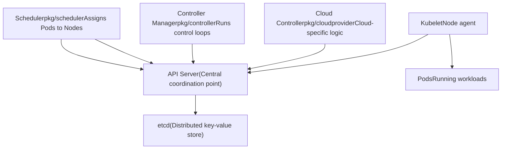
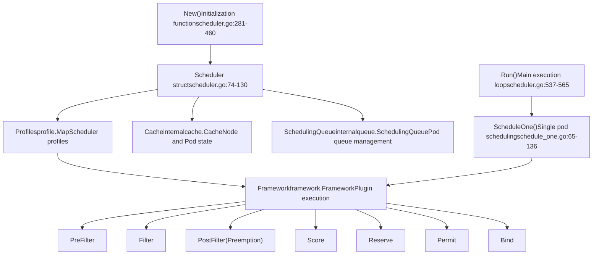
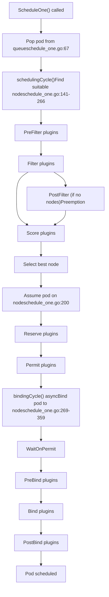
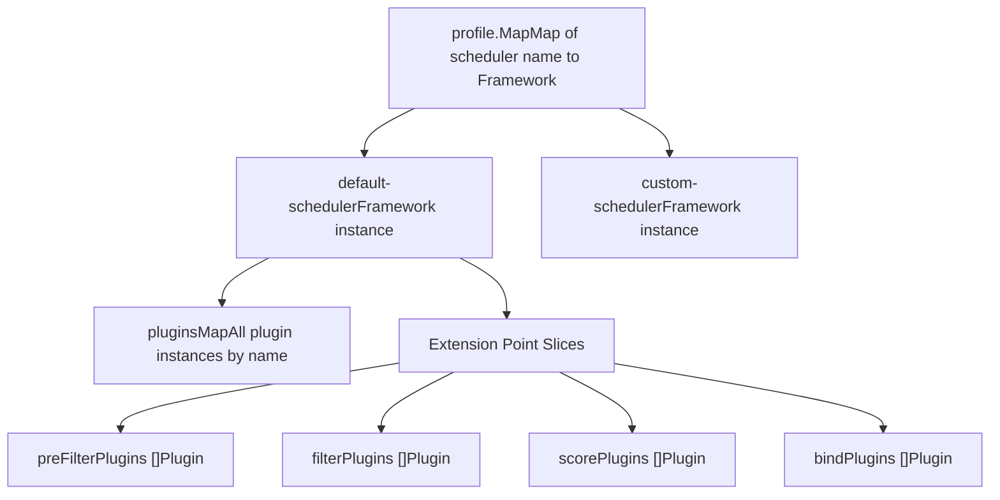
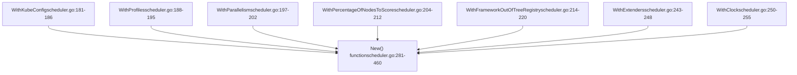
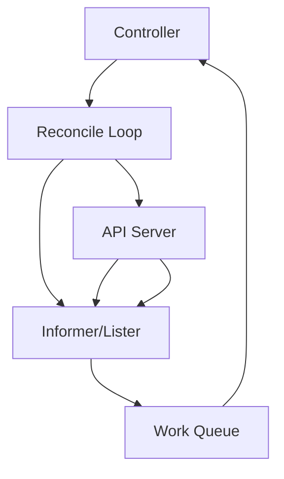
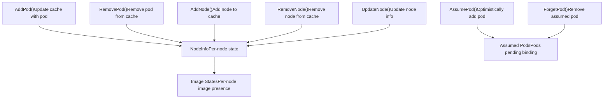
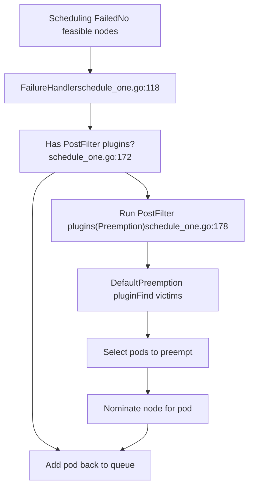
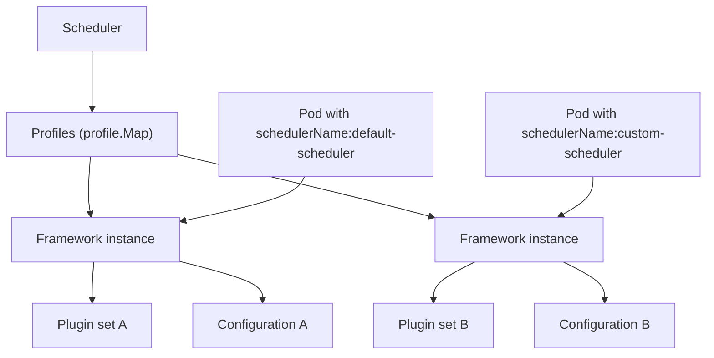

# Control Plane Components

Relevant source files

-   [cmd/kube-apiserver/app/options/options.go](https://github.com/kubernetes/kubernetes/blob/2757a872/cmd/kube-apiserver/app/options/options.go)
-   [cmd/kube-apiserver/app/options/options\_test.go](https://github.com/kubernetes/kubernetes/blob/2757a872/cmd/kube-apiserver/app/options/options_test.go)
-   [cmd/kube-apiserver/app/options/validation.go](https://github.com/kubernetes/kubernetes/blob/2757a872/cmd/kube-apiserver/app/options/validation.go)
-   [cmd/kube-apiserver/app/options/validation\_test.go](https://github.com/kubernetes/kubernetes/blob/2757a872/cmd/kube-apiserver/app/options/validation_test.go)
-   [cmd/kube-apiserver/app/server.go](https://github.com/kubernetes/kubernetes/blob/2757a872/cmd/kube-apiserver/app/server.go)
-   [cmd/kube-scheduler/app/server\_test.go](https://github.com/kubernetes/kubernetes/blob/2757a872/cmd/kube-scheduler/app/server_test.go)
-   [pkg/controlplane/controller/defaultservicecidr/OWNERS](https://github.com/kubernetes/kubernetes/blob/2757a872/pkg/controlplane/controller/defaultservicecidr/OWNERS)
-   [pkg/controlplane/controller/defaultservicecidr/default\_servicecidr\_controller.go](https://github.com/kubernetes/kubernetes/blob/2757a872/pkg/controlplane/controller/defaultservicecidr/default_servicecidr_controller.go)
-   [pkg/controlplane/controller/defaultservicecidr/default\_servicecidr\_controller\_test.go](https://github.com/kubernetes/kubernetes/blob/2757a872/pkg/controlplane/controller/defaultservicecidr/default_servicecidr_controller_test.go)
-   [pkg/kubeapiserver/options/serving.go](https://github.com/kubernetes/kubernetes/blob/2757a872/pkg/kubeapiserver/options/serving.go)
-   [pkg/registry/networking/servicecidr/doc.go](https://github.com/kubernetes/kubernetes/blob/2757a872/pkg/registry/networking/servicecidr/doc.go)
-   [pkg/registry/networking/servicecidr/storage/storage.go](https://github.com/kubernetes/kubernetes/blob/2757a872/pkg/registry/networking/servicecidr/storage/storage.go)
-   [pkg/registry/networking/servicecidr/strategy.go](https://github.com/kubernetes/kubernetes/blob/2757a872/pkg/registry/networking/servicecidr/strategy.go)
-   [pkg/registry/networking/servicecidr/strategy\_test.go](https://github.com/kubernetes/kubernetes/blob/2757a872/pkg/registry/networking/servicecidr/strategy_test.go)
-   [pkg/scheduler/apis/config/types\_test.go](https://github.com/kubernetes/kubernetes/blob/2757a872/pkg/scheduler/apis/config/types_test.go)
-   [pkg/scheduler/extender.go](https://github.com/kubernetes/kubernetes/blob/2757a872/pkg/scheduler/extender.go)
-   [pkg/scheduler/extender\_test.go](https://github.com/kubernetes/kubernetes/blob/2757a872/pkg/scheduler/extender_test.go)
-   [pkg/scheduler/framework/events.go](https://github.com/kubernetes/kubernetes/blob/2757a872/pkg/scheduler/framework/events.go)
-   [pkg/scheduler/framework/events\_test.go](https://github.com/kubernetes/kubernetes/blob/2757a872/pkg/scheduler/framework/events_test.go)
-   [pkg/scheduler/framework/interface.go](https://github.com/kubernetes/kubernetes/blob/2757a872/pkg/scheduler/framework/interface.go)
-   [pkg/scheduler/framework/interface\_test.go](https://github.com/kubernetes/kubernetes/blob/2757a872/pkg/scheduler/framework/interface_test.go)
-   [pkg/scheduler/framework/plugins/defaultpreemption/default\_preemption.go](https://github.com/kubernetes/kubernetes/blob/2757a872/pkg/scheduler/framework/plugins/defaultpreemption/default_preemption.go)
-   [pkg/scheduler/framework/plugins/defaultpreemption/default\_preemption\_test.go](https://github.com/kubernetes/kubernetes/blob/2757a872/pkg/scheduler/framework/plugins/defaultpreemption/default_preemption_test.go)
-   [pkg/scheduler/framework/preemption/preemption.go](https://github.com/kubernetes/kubernetes/blob/2757a872/pkg/scheduler/framework/preemption/preemption.go)
-   [pkg/scheduler/framework/preemption/preemption\_test.go](https://github.com/kubernetes/kubernetes/blob/2757a872/pkg/scheduler/framework/preemption/preemption_test.go)
-   [pkg/scheduler/framework/runtime/framework.go](https://github.com/kubernetes/kubernetes/blob/2757a872/pkg/scheduler/framework/runtime/framework.go)
-   [pkg/scheduler/framework/runtime/framework\_test.go](https://github.com/kubernetes/kubernetes/blob/2757a872/pkg/scheduler/framework/runtime/framework_test.go)
-   [pkg/scheduler/framework/types.go](https://github.com/kubernetes/kubernetes/blob/2757a872/pkg/scheduler/framework/types.go)
-   [pkg/scheduler/framework/types\_test.go](https://github.com/kubernetes/kubernetes/blob/2757a872/pkg/scheduler/framework/types_test.go)
-   [pkg/scheduler/schedule\_one.go](https://github.com/kubernetes/kubernetes/blob/2757a872/pkg/scheduler/schedule_one.go)
-   [pkg/scheduler/schedule\_one\_test.go](https://github.com/kubernetes/kubernetes/blob/2757a872/pkg/scheduler/schedule_one_test.go)
-   [pkg/scheduler/scheduler.go](https://github.com/kubernetes/kubernetes/blob/2757a872/pkg/scheduler/scheduler.go)
-   [pkg/scheduler/scheduler\_test.go](https://github.com/kubernetes/kubernetes/blob/2757a872/pkg/scheduler/scheduler_test.go)
-   [pkg/scheduler/testing/framework/fake\_extender.go](https://github.com/kubernetes/kubernetes/blob/2757a872/pkg/scheduler/testing/framework/fake_extender.go)
-   [pkg/scheduler/testing/framework/fake\_plugins.go](https://github.com/kubernetes/kubernetes/blob/2757a872/pkg/scheduler/testing/framework/fake_plugins.go)
-   [pkg/scheduler/util/utils.go](https://github.com/kubernetes/kubernetes/blob/2757a872/pkg/scheduler/util/utils.go)
-   [pkg/scheduler/util/utils\_test.go](https://github.com/kubernetes/kubernetes/blob/2757a872/pkg/scheduler/util/utils_test.go)
-   [staging/src/k8s.io/apiserver/pkg/apis/example/install/install.go](https://github.com/kubernetes/kubernetes/blob/2757a872/staging/src/k8s.io/apiserver/pkg/apis/example/install/install.go)
-   [staging/src/k8s.io/apiserver/pkg/apis/example2/install/install.go](https://github.com/kubernetes/kubernetes/blob/2757a872/staging/src/k8s.io/apiserver/pkg/apis/example2/install/install.go)
-   [staging/src/k8s.io/apiserver/pkg/endpoints/filters/mux\_discovery\_complete.go](https://github.com/kubernetes/kubernetes/blob/2757a872/staging/src/k8s.io/apiserver/pkg/endpoints/filters/mux_discovery_complete.go)
-   [staging/src/k8s.io/apiserver/pkg/endpoints/filters/mux\_discovery\_complete\_test.go](https://github.com/kubernetes/kubernetes/blob/2757a872/staging/src/k8s.io/apiserver/pkg/endpoints/filters/mux_discovery_complete_test.go)
-   [staging/src/k8s.io/apiserver/pkg/endpoints/request/server\_shutdown\_signal.go](https://github.com/kubernetes/kubernetes/blob/2757a872/staging/src/k8s.io/apiserver/pkg/endpoints/request/server_shutdown_signal.go)
-   [staging/src/k8s.io/apiserver/pkg/server/config.go](https://github.com/kubernetes/kubernetes/blob/2757a872/staging/src/k8s.io/apiserver/pkg/server/config.go)
-   [staging/src/k8s.io/apiserver/pkg/server/config\_selfclient.go](https://github.com/kubernetes/kubernetes/blob/2757a872/staging/src/k8s.io/apiserver/pkg/server/config_selfclient.go)
-   [staging/src/k8s.io/apiserver/pkg/server/config\_selfclient\_test.go](https://github.com/kubernetes/kubernetes/blob/2757a872/staging/src/k8s.io/apiserver/pkg/server/config_selfclient_test.go)
-   [staging/src/k8s.io/apiserver/pkg/server/config\_test.go](https://github.com/kubernetes/kubernetes/blob/2757a872/staging/src/k8s.io/apiserver/pkg/server/config_test.go)
-   [staging/src/k8s.io/apiserver/pkg/server/filters/with\_retry\_after.go](https://github.com/kubernetes/kubernetes/blob/2757a872/staging/src/k8s.io/apiserver/pkg/server/filters/with_retry_after.go)
-   [staging/src/k8s.io/apiserver/pkg/server/filters/with\_retry\_after\_test.go](https://github.com/kubernetes/kubernetes/blob/2757a872/staging/src/k8s.io/apiserver/pkg/server/filters/with_retry_after_test.go)
-   [staging/src/k8s.io/apiserver/pkg/server/genericapiserver.go](https://github.com/kubernetes/kubernetes/blob/2757a872/staging/src/k8s.io/apiserver/pkg/server/genericapiserver.go)
-   [staging/src/k8s.io/apiserver/pkg/server/genericapiserver\_graceful\_termination\_test.go](https://github.com/kubernetes/kubernetes/blob/2757a872/staging/src/k8s.io/apiserver/pkg/server/genericapiserver_graceful_termination_test.go)
-   [staging/src/k8s.io/apiserver/pkg/server/genericapiserver\_test.go](https://github.com/kubernetes/kubernetes/blob/2757a872/staging/src/k8s.io/apiserver/pkg/server/genericapiserver_test.go)
-   [staging/src/k8s.io/apiserver/pkg/server/lifecycle\_signals.go](https://github.com/kubernetes/kubernetes/blob/2757a872/staging/src/k8s.io/apiserver/pkg/server/lifecycle_signals.go)
-   [staging/src/k8s.io/apiserver/pkg/server/options/etcd.go](https://github.com/kubernetes/kubernetes/blob/2757a872/staging/src/k8s.io/apiserver/pkg/server/options/etcd.go)
-   [staging/src/k8s.io/apiserver/pkg/server/options/etcd\_test.go](https://github.com/kubernetes/kubernetes/blob/2757a872/staging/src/k8s.io/apiserver/pkg/server/options/etcd_test.go)
-   [staging/src/k8s.io/apiserver/pkg/server/options/server\_run\_options.go](https://github.com/kubernetes/kubernetes/blob/2757a872/staging/src/k8s.io/apiserver/pkg/server/options/server_run_options.go)
-   [staging/src/k8s.io/apiserver/pkg/server/options/server\_run\_options\_test.go](https://github.com/kubernetes/kubernetes/blob/2757a872/staging/src/k8s.io/apiserver/pkg/server/options/server_run_options_test.go)
-   [staging/src/k8s.io/apiserver/pkg/server/options/serving.go](https://github.com/kubernetes/kubernetes/blob/2757a872/staging/src/k8s.io/apiserver/pkg/server/options/serving.go)
-   [staging/src/k8s.io/apiserver/pkg/server/options/serving\_test.go](https://github.com/kubernetes/kubernetes/blob/2757a872/staging/src/k8s.io/apiserver/pkg/server/options/serving_test.go)
-   [staging/src/k8s.io/apiserver/pkg/server/storage/resource\_encoding\_config.go](https://github.com/kubernetes/kubernetes/blob/2757a872/staging/src/k8s.io/apiserver/pkg/server/storage/resource_encoding_config.go)
-   [staging/src/k8s.io/apiserver/pkg/server/storage/storage\_factory.go](https://github.com/kubernetes/kubernetes/blob/2757a872/staging/src/k8s.io/apiserver/pkg/server/storage/storage_factory.go)
-   [staging/src/k8s.io/apiserver/pkg/server/storage/storage\_factory\_test.go](https://github.com/kubernetes/kubernetes/blob/2757a872/staging/src/k8s.io/apiserver/pkg/server/storage/storage_factory_test.go)
-   [staging/src/k8s.io/apiserver/pkg/storage/storagebackend/config.go](https://github.com/kubernetes/kubernetes/blob/2757a872/staging/src/k8s.io/apiserver/pkg/storage/storagebackend/config.go)
-   [staging/src/k8s.io/apiserver/pkg/storage/storagebackend/factory/etcd3.go](https://github.com/kubernetes/kubernetes/blob/2757a872/staging/src/k8s.io/apiserver/pkg/storage/storagebackend/factory/etcd3.go)
-   [staging/src/k8s.io/apiserver/pkg/storage/storagebackend/factory/factory.go](https://github.com/kubernetes/kubernetes/blob/2757a872/staging/src/k8s.io/apiserver/pkg/storage/storagebackend/factory/factory.go)
-   [staging/src/k8s.io/apiserver/pkg/util/notfoundhandler/not\_found\_handler.go](https://github.com/kubernetes/kubernetes/blob/2757a872/staging/src/k8s.io/apiserver/pkg/util/notfoundhandler/not_found_handler.go)
-   [staging/src/k8s.io/apiserver/pkg/util/notfoundhandler/not\_found\_handler\_test.go](https://github.com/kubernetes/kubernetes/blob/2757a872/staging/src/k8s.io/apiserver/pkg/util/notfoundhandler/not_found_handler_test.go)
-   [staging/src/k8s.io/component-base/version/version.go](https://github.com/kubernetes/kubernetes/blob/2757a872/staging/src/k8s.io/component-base/version/version.go)
-   [test/integration/openshift/openshift\_test.go](https://github.com/kubernetes/kubernetes/blob/2757a872/test/integration/openshift/openshift_test.go)
-   [test/integration/scheduler/eventhandler/eventhandler\_test.go](https://github.com/kubernetes/kubernetes/blob/2757a872/test/integration/scheduler/eventhandler/eventhandler_test.go)
-   [test/integration/scheduler/filters/filters\_test.go](https://github.com/kubernetes/kubernetes/blob/2757a872/test/integration/scheduler/filters/filters_test.go)
-   [test/integration/scheduler/plugins/plugins\_test.go](https://github.com/kubernetes/kubernetes/blob/2757a872/test/integration/scheduler/plugins/plugins_test.go)
-   [test/integration/scheduler/preemption/preemption\_test.go](https://github.com/kubernetes/kubernetes/blob/2757a872/test/integration/scheduler/preemption/preemption_test.go)
-   [test/integration/scheduler/rescheduling\_test.go](https://github.com/kubernetes/kubernetes/blob/2757a872/test/integration/scheduler/rescheduling_test.go)
-   [test/integration/scheduler/scheduler\_test.go](https://github.com/kubernetes/kubernetes/blob/2757a872/test/integration/scheduler/scheduler_test.go)
-   [test/integration/scheduler/scoring/priorities\_test.go](https://github.com/kubernetes/kubernetes/blob/2757a872/test/integration/scheduler/scoring/priorities_test.go)
-   [test/integration/scheduler/util.go](https://github.com/kubernetes/kubernetes/blob/2757a872/test/integration/scheduler/util.go)
-   [test/integration/util/util.go](https://github.com/kubernetes/kubernetes/blob/2757a872/test/integration/util/util.go)

## Purpose and Scope

This page provides an overview of the Kubernetes control plane components with significant representation in the repository codebase. The control plane is responsible for maintaining the desired state of the cluster, making global decisions about scheduling, and detecting and responding to cluster events.

This document covers:

-   High-level architecture of control plane components
-   The Scheduler component structure and initialization
-   How control plane components interact via the API Server
-   Configuration and profile management

For detailed information about the Scheduler's internal architecture, plugin framework, and scheduling algorithms, see [Scheduler](/kubernetes/kubernetes/3.1-api-server-architecture).

## Control Plane Architecture

The Kubernetes control plane consists of several components that work together to manage the cluster state. The primary components represented in this codebase are:

**Sources:** [pkg/scheduler/scheduler.go1-678](https://github.com/kubernetes/kubernetes/blob/2757a872/pkg/scheduler/scheduler.go#L1-L678) High-level system diagrams

## Scheduler Component

The Scheduler is the most extensively represented control plane component in this codebase. It is responsible for assigning newly created Pods to Nodes based on resource requirements, constraints, and policies.

### Scheduler Structure

**Sources:** [pkg/scheduler/scheduler.go74-130](https://github.com/kubernetes/kubernetes/blob/2757a872/pkg/scheduler/scheduler.go#L74-L130) [pkg/scheduler/scheduler.go281-460](https://github.com/kubernetes/kubernetes/blob/2757a872/pkg/scheduler/scheduler.go#L281-L460) [pkg/scheduler/schedule\_one.go65-136](https://github.com/kubernetes/kubernetes/blob/2757a872/pkg/scheduler/schedule_one.go#L65-L136)

### Key Data Structures

The `Scheduler` struct contains the core components needed for scheduling operations:

| Field | Type | Purpose |
| --- | --- | --- |
| `Cache` | `internalcache.Cache` | Stores node and pod information with assumed pods |
| `SchedulingQueue` | `internalqueue.SchedulingQueue` | Manages pods waiting to be scheduled |
| `Profiles` | `profile.Map` | Contains scheduling profiles with plugin configurations |
| `Extenders` | `[]fwk.Extender` | External scheduling extensions via HTTP |
| `NextPod` | `func() (*QueuedPodInfo, error)` | Function to retrieve next pod from queue |
| `SchedulePod` | Scheduling algorithm function | Attempts to find a node for a pod |
| `FailureHandler` | `FailureHandlerFn` | Handles scheduling failures |

**Sources:** [pkg/scheduler/scheduler.go74-130](https://github.com/kubernetes/kubernetes/blob/2757a872/pkg/scheduler/scheduler.go#L74-L130)

### Scheduler Initialization

The scheduler initialization process involves several steps:

> **[Mermaid sequence]**
> *(图表结构无法解析)*

**Sources:** [pkg/scheduler/scheduler.go281-460](https://github.com/kubernetes/kubernetes/blob/2757a872/pkg/scheduler/scheduler.go#L281-L460) [pkg/scheduler/framework/runtime/framework.go305-456](https://github.com/kubernetes/kubernetes/blob/2757a872/pkg/scheduler/framework/runtime/framework.go#L305-L456)

### Scheduling Cycle

The core scheduling operation occurs in the `ScheduleOne` method:

**Sources:** [pkg/scheduler/schedule\_one.go65-136](https://github.com/kubernetes/kubernetes/blob/2757a872/pkg/scheduler/schedule_one.go#L65-L136) [pkg/scheduler/schedule\_one.go141-266](https://github.com/kubernetes/kubernetes/blob/2757a872/pkg/scheduler/schedule_one.go#L141-L266) [pkg/scheduler/schedule\_one.go269-359](https://github.com/kubernetes/kubernetes/blob/2757a872/pkg/scheduler/schedule_one.go#L269-L359)

## Scheduler Profiles and Plugin Framework

The scheduler supports multiple scheduling profiles, each with its own set of plugins and configuration. This allows different scheduling behaviors for different workloads.

### Profile Structure

**Sources:** [pkg/scheduler/scheduler.go362-404](https://github.com/kubernetes/kubernetes/blob/2757a872/pkg/scheduler/scheduler.go#L362-L404) [pkg/scheduler/framework/runtime/framework.go55-105](https://github.com/kubernetes/kubernetes/blob/2757a872/pkg/scheduler/framework/runtime/framework.go#L55-L105)

### Plugin Registry and Configuration

The plugin system is initialized through a registry pattern:

| Component | Location | Purpose |
| --- | --- | --- |
| `Registry` | `frameworkruntime.Registry` | Maps plugin names to factory functions |
| `NewInTreeRegistry()` | `frameworkplugins.NewInTreeRegistry()` | Creates registry with built-in plugins |
| `Merge()` | Registry method | Adds out-of-tree plugins to registry |
| `NewFramework()` | `frameworkruntime.NewFramework()` | Creates framework instance with plugins |

**Sources:** [pkg/scheduler/scheduler.go307-310](https://github.com/kubernetes/kubernetes/blob/2757a872/pkg/scheduler/scheduler.go#L307-L310) [pkg/scheduler/framework/runtime/framework.go305-456](https://github.com/kubernetes/kubernetes/blob/2757a872/pkg/scheduler/framework/runtime/framework.go#L305-L456)

## Scheduler Configuration Options

The scheduler accepts various configuration options during initialization:

**Sources:** [pkg/scheduler/scheduler.go156-265](https://github.com/kubernetes/kubernetes/blob/2757a872/pkg/scheduler/scheduler.go#L156-L265) [pkg/scheduler/scheduler.go281-460](https://github.com/kubernetes/kubernetes/blob/2757a872/pkg/scheduler/scheduler.go#L281-L460)

### Default Configuration Values

The scheduler has default values for various configuration parameters:

| Parameter | Default Value | Source |
| --- | --- | --- |
| `percentageOfNodesToScore` | `schedulerapi.DefaultPercentageOfNodesToScore` | [scheduler.go269](https://github.com/kubernetes/kubernetes/blob/2757a872/scheduler.go#L269-L269) |
| `podInitialBackoffSeconds` | `internalqueue.DefaultPodInitialBackoffDuration` | [scheduler.go270](https://github.com/kubernetes/kubernetes/blob/2757a872/scheduler.go#L270-L270) |
| `podMaxBackoffSeconds` | `internalqueue.DefaultPodMaxBackoffDuration` | [scheduler.go271](https://github.com/kubernetes/kubernetes/blob/2757a872/scheduler.go#L271-L271) |
| `podMaxInUnschedulablePodsDuration` | `internalqueue.DefaultPodMaxInUnschedulablePodsDuration` | [scheduler.go272](https://github.com/kubernetes/kubernetes/blob/2757a872/scheduler.go#L272-L272) |
| `parallelism` | `parallelize.DefaultParallelism` | [scheduler.go273](https://github.com/kubernetes/kubernetes/blob/2757a872/scheduler.go#L273-L273) |

**Sources:** [pkg/scheduler/scheduler.go267-279](https://github.com/kubernetes/kubernetes/blob/2757a872/pkg/scheduler/scheduler.go#L267-L279)

## Interaction with API Server

All control plane components interact through the API Server using watch mechanisms and CRUD operations:

> **[Mermaid sequence]**
> *(图表结构无法解析)*

**Sources:** [pkg/scheduler/scheduler.go455-459](https://github.com/kubernetes/kubernetes/blob/2757a872/pkg/scheduler/scheduler.go#L455-L459) [pkg/scheduler/scheduler.go567-573](https://github.com/kubernetes/kubernetes/blob/2757a872/pkg/scheduler/scheduler.go#L567-L573)

## Event Handlers and Resource Watching

The scheduler registers event handlers for various Kubernetes resources to react to cluster changes:

### Watched Resources

| Resource | Action Types | Purpose |
| --- | --- | --- |
| Pod | Add, Update, Delete | Track pod lifecycle for scheduling decisions |
| Node | Add, Update, Delete | Maintain node availability and capacity |
| PersistentVolume | Add, Update, Delete | Volume binding decisions |
| PersistentVolumeClaim | Add, Update, Delete | Volume binding decisions |
| Service | Add, Update, Delete | Service affinity scheduling |
| StorageClass | Add, Update, Delete | Dynamic volume provisioning |
| CSINode | Add, Update, Delete | CSI driver availability |

**Sources:** [pkg/scheduler/scheduler.go455-459](https://github.com/kubernetes/kubernetes/blob/2757a872/pkg/scheduler/scheduler.go#L455-L459) [pkg/scheduler/framework/types.go64-81](https://github.com/kubernetes/kubernetes/blob/2757a872/pkg/scheduler/framework/types.go#L64-L81)

## Controller Manager Components

The Controller Manager runs various controllers that maintain the desired state of the cluster. While the controller implementations are in `pkg/controller`, they interact with the API Server similarly to the scheduler.

### Common Controller Pattern

**Sources:** High-level system diagrams

## Cloud Controller Manager

The Cloud Controller Manager contains cloud-provider-specific control loops. It runs controllers that interact with the underlying cloud infrastructure.

**Key components:**

-   Node controller: Manages node lifecycle in coordination with cloud provider
-   Route controller: Sets up routes in cloud network
-   Service controller: Creates/updates/deletes cloud load balancers

**Sources:** High-level system diagrams, [pkg/cloudprovider](https://github.com/kubernetes/kubernetes/blob/2757a872/pkg/cloudprovider) references

## Scheduler Cache and State Management

The scheduler maintains an internal cache of cluster state for efficient scheduling decisions:

**Sources:** [pkg/scheduler/scheduler.go421](https://github.com/kubernetes/kubernetes/blob/2757a872/pkg/scheduler/scheduler.go#L421-L421) [pkg/scheduler/schedule\_one.go200](https://github.com/kubernetes/kubernetes/blob/2757a872/pkg/scheduler/schedule_one.go#L200-L200)

### Assumed Pods

The scheduler uses an "assume" mechanism to optimize scheduling throughput:

1.  After selecting a node, the scheduler "assumes" the pod is scheduled
2.  The cache is updated optimistically before the actual binding
3.  Subsequent scheduling decisions see the assumed pod's resource consumption
4.  If binding fails, the pod is "forgotten" from the cache

**Sources:** [pkg/scheduler/schedule\_one.go196-208](https://github.com/kubernetes/kubernetes/blob/2757a872/pkg/scheduler/schedule_one.go#L196-L208) [pkg/scheduler/schedule\_one.go214-216](https://github.com/kubernetes/kubernetes/blob/2757a872/pkg/scheduler/schedule_one.go#L214-L216)

## Failure Handling and Preemption

When a pod cannot be scheduled, the scheduler invokes failure handlers:

**Sources:** [pkg/scheduler/schedule\_one.go117-120](https://github.com/kubernetes/kubernetes/blob/2757a872/pkg/scheduler/schedule_one.go#L117-L120) [pkg/scheduler/schedule\_one.go172-191](https://github.com/kubernetes/kubernetes/blob/2757a872/pkg/scheduler/schedule_one.go#L172-L191) [pkg/scheduler/framework/plugins/defaultpreemption/default\_preemption.go120-132](https://github.com/kubernetes/kubernetes/blob/2757a872/pkg/scheduler/framework/plugins/defaultpreemption/default_preemption.go#L120-L132)

## Multiple Scheduler Profiles

Kubernetes supports running multiple scheduler profiles simultaneously, each with different configurations:

**Sources:** [pkg/scheduler/schedule\_one.go85-92](https://github.com/kubernetes/kubernetes/blob/2757a872/pkg/scheduler/schedule_one.go#L85-L92) [pkg/scheduler/schedule\_one.go395-401](https://github.com/kubernetes/kubernetes/blob/2757a872/pkg/scheduler/schedule_one.go#L395-L401) [test/integration/scheduler/scheduler\_test.go181-279](https://github.com/kubernetes/kubernetes/blob/2757a872/test/integration/scheduler/scheduler_test.go#L181-L279)

## Configuration Files and API Versions

The scheduler configuration uses versioned API types:

| Component | Type | Location |
| --- | --- | --- |
| External Config | `configv1.KubeSchedulerConfiguration` | kubescheduler.config.k8s.io/v1 |
| Internal Config | `schedulerapi.KubeSchedulerConfiguration` | pkg/scheduler/apis/config |
| Profile | `schedulerapi.KubeSchedulerProfile` | Contains scheduler name, plugins, plugin config |
| Plugin Config | `schedulerapi.PluginConfig` | Plugin-specific arguments |

**Sources:** [pkg/scheduler/scheduler.go297-305](https://github.com/kubernetes/kubernetes/blob/2757a872/pkg/scheduler/scheduler.go#L297-L305) [cmd/kube-scheduler/app/server\_test.go1-1000](https://github.com/kubernetes/kubernetes/blob/2757a872/cmd/kube-scheduler/app/server_test.go#L1-L1000)

## Summary

The Kubernetes control plane components work together to maintain cluster state and make scheduling decisions:

-   The **API Server** serves as the central coordination point for all components
-   The **Scheduler** assigns pods to nodes using a sophisticated plugin framework (detailed in [Scheduler](/kubernetes/kubernetes/3.1-api-server-architecture))
-   The **Controller Manager** runs control loops to maintain desired state
-   The **Cloud Controller Manager** handles cloud-provider-specific operations

The scheduler component has the most extensive representation in this codebase, with a flexible plugin architecture that supports custom scheduling behaviors through profiles, extension points, and out-of-tree plugins.

**Sources:** [pkg/scheduler/scheduler.go1-678](https://github.com/kubernetes/kubernetes/blob/2757a872/pkg/scheduler/scheduler.go#L1-L678) [pkg/scheduler/schedule\_one.go1-1000](https://github.com/kubernetes/kubernetes/blob/2757a872/pkg/scheduler/schedule_one.go#L1-L1000) [pkg/scheduler/framework/runtime/framework.go1-1000](https://github.com/kubernetes/kubernetes/blob/2757a872/pkg/scheduler/framework/runtime/framework.go#L1-L1000) High-level system diagrams
