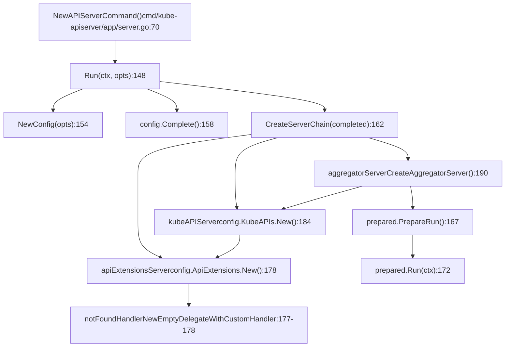
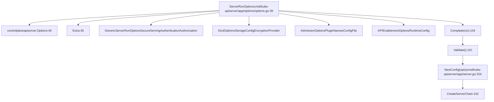
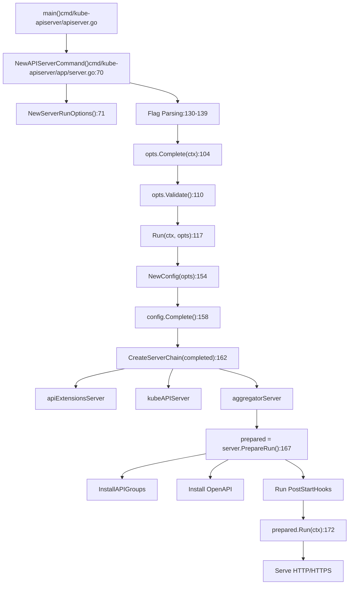
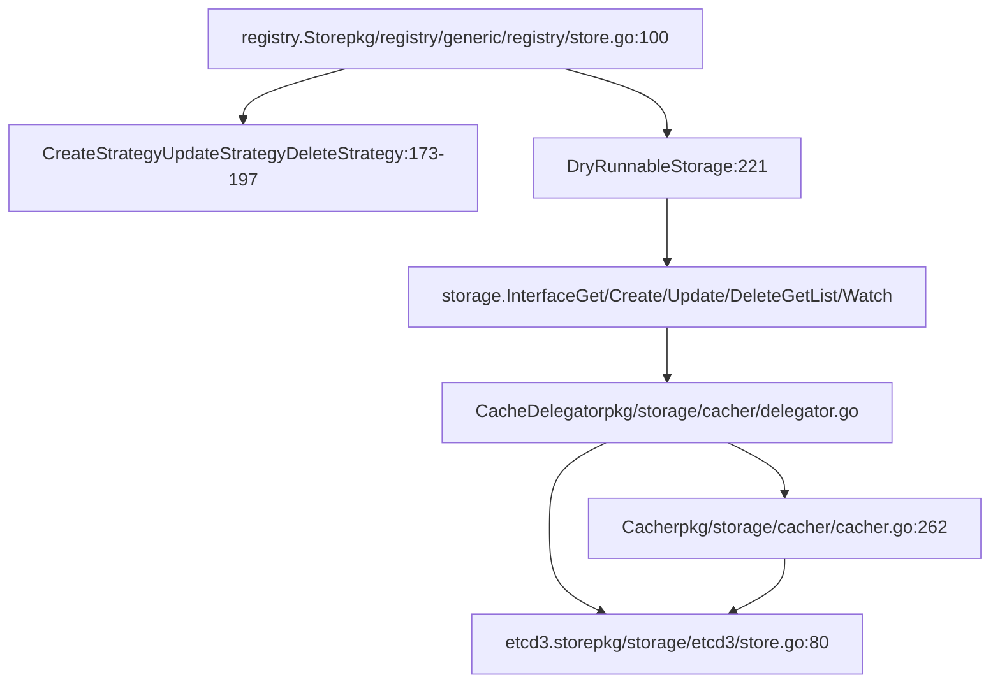
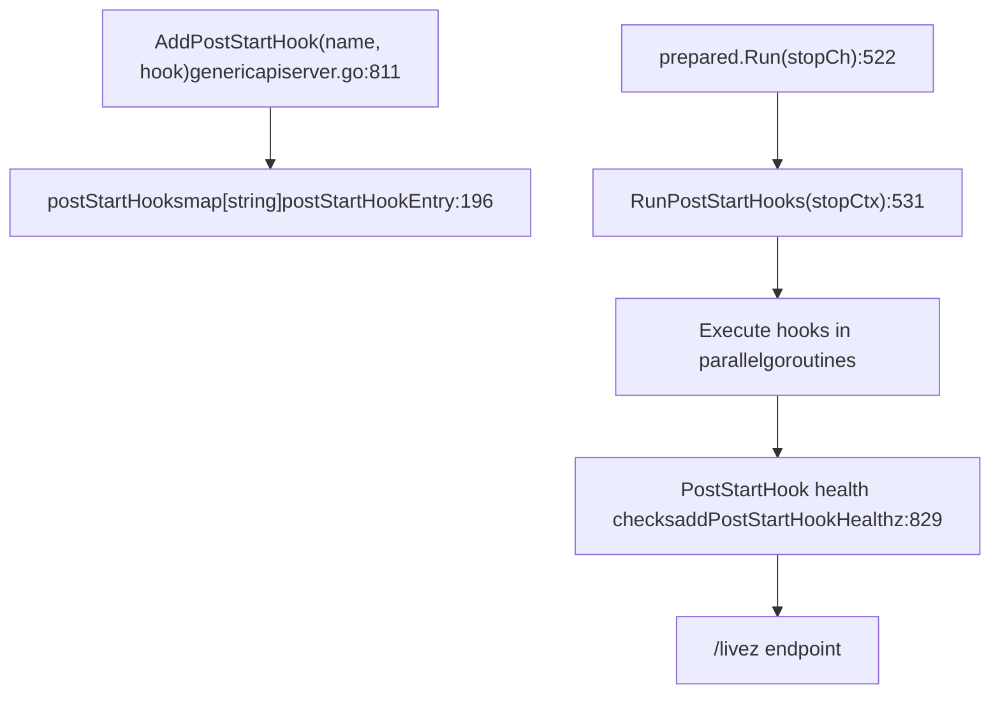

# API Server Architecture

Relevant source files

-   [cmd/kube-apiserver/app/options/options.go](https://github.com/kubernetes/kubernetes/blob/2757a872/cmd/kube-apiserver/app/options/options.go)
-   [cmd/kube-apiserver/app/options/options\_test.go](https://github.com/kubernetes/kubernetes/blob/2757a872/cmd/kube-apiserver/app/options/options_test.go)
-   [cmd/kube-apiserver/app/options/validation.go](https://github.com/kubernetes/kubernetes/blob/2757a872/cmd/kube-apiserver/app/options/validation.go)
-   [cmd/kube-apiserver/app/options/validation\_test.go](https://github.com/kubernetes/kubernetes/blob/2757a872/cmd/kube-apiserver/app/options/validation_test.go)
-   [cmd/kube-apiserver/app/server.go](https://github.com/kubernetes/kubernetes/blob/2757a872/cmd/kube-apiserver/app/server.go)
-   [pkg/controlplane/controller/defaultservicecidr/OWNERS](https://github.com/kubernetes/kubernetes/blob/2757a872/pkg/controlplane/controller/defaultservicecidr/OWNERS)
-   [pkg/controlplane/controller/defaultservicecidr/default\_servicecidr\_controller.go](https://github.com/kubernetes/kubernetes/blob/2757a872/pkg/controlplane/controller/defaultservicecidr/default_servicecidr_controller.go)
-   [pkg/controlplane/controller/defaultservicecidr/default\_servicecidr\_controller\_test.go](https://github.com/kubernetes/kubernetes/blob/2757a872/pkg/controlplane/controller/defaultservicecidr/default_servicecidr_controller_test.go)
-   [pkg/kubeapiserver/options/serving.go](https://github.com/kubernetes/kubernetes/blob/2757a872/pkg/kubeapiserver/options/serving.go)
-   [pkg/registry/networking/servicecidr/doc.go](https://github.com/kubernetes/kubernetes/blob/2757a872/pkg/registry/networking/servicecidr/doc.go)
-   [pkg/registry/networking/servicecidr/storage/storage.go](https://github.com/kubernetes/kubernetes/blob/2757a872/pkg/registry/networking/servicecidr/storage/storage.go)
-   [pkg/registry/networking/servicecidr/strategy.go](https://github.com/kubernetes/kubernetes/blob/2757a872/pkg/registry/networking/servicecidr/strategy.go)
-   [pkg/registry/networking/servicecidr/strategy\_test.go](https://github.com/kubernetes/kubernetes/blob/2757a872/pkg/registry/networking/servicecidr/strategy_test.go)
-   [staging/src/k8s.io/apiserver/pkg/apis/example/install/install.go](https://github.com/kubernetes/kubernetes/blob/2757a872/staging/src/k8s.io/apiserver/pkg/apis/example/install/install.go)
-   [staging/src/k8s.io/apiserver/pkg/apis/example2/install/install.go](https://github.com/kubernetes/kubernetes/blob/2757a872/staging/src/k8s.io/apiserver/pkg/apis/example2/install/install.go)
-   [staging/src/k8s.io/apiserver/pkg/endpoints/filters/mux\_discovery\_complete.go](https://github.com/kubernetes/kubernetes/blob/2757a872/staging/src/k8s.io/apiserver/pkg/endpoints/filters/mux_discovery_complete.go)
-   [staging/src/k8s.io/apiserver/pkg/endpoints/filters/mux\_discovery\_complete\_test.go](https://github.com/kubernetes/kubernetes/blob/2757a872/staging/src/k8s.io/apiserver/pkg/endpoints/filters/mux_discovery_complete_test.go)
-   [staging/src/k8s.io/apiserver/pkg/endpoints/request/server\_shutdown\_signal.go](https://github.com/kubernetes/kubernetes/blob/2757a872/staging/src/k8s.io/apiserver/pkg/endpoints/request/server_shutdown_signal.go)
-   [staging/src/k8s.io/apiserver/pkg/registry/generic/options.go](https://github.com/kubernetes/kubernetes/blob/2757a872/staging/src/k8s.io/apiserver/pkg/registry/generic/options.go)
-   [staging/src/k8s.io/apiserver/pkg/registry/generic/registry/dryrun.go](https://github.com/kubernetes/kubernetes/blob/2757a872/staging/src/k8s.io/apiserver/pkg/registry/generic/registry/dryrun.go)
-   [staging/src/k8s.io/apiserver/pkg/registry/generic/registry/storage\_factory.go](https://github.com/kubernetes/kubernetes/blob/2757a872/staging/src/k8s.io/apiserver/pkg/registry/generic/registry/storage_factory.go)
-   [staging/src/k8s.io/apiserver/pkg/registry/generic/registry/store.go](https://github.com/kubernetes/kubernetes/blob/2757a872/staging/src/k8s.io/apiserver/pkg/registry/generic/registry/store.go)
-   [staging/src/k8s.io/apiserver/pkg/registry/generic/registry/store\_test.go](https://github.com/kubernetes/kubernetes/blob/2757a872/staging/src/k8s.io/apiserver/pkg/registry/generic/registry/store_test.go)
-   [staging/src/k8s.io/apiserver/pkg/registry/generic/storage\_decorator.go](https://github.com/kubernetes/kubernetes/blob/2757a872/staging/src/k8s.io/apiserver/pkg/registry/generic/storage_decorator.go)
-   [staging/src/k8s.io/apiserver/pkg/server/config.go](https://github.com/kubernetes/kubernetes/blob/2757a872/staging/src/k8s.io/apiserver/pkg/server/config.go)
-   [staging/src/k8s.io/apiserver/pkg/server/config\_selfclient.go](https://github.com/kubernetes/kubernetes/blob/2757a872/staging/src/k8s.io/apiserver/pkg/server/config_selfclient.go)
-   [staging/src/k8s.io/apiserver/pkg/server/config\_selfclient\_test.go](https://github.com/kubernetes/kubernetes/blob/2757a872/staging/src/k8s.io/apiserver/pkg/server/config_selfclient_test.go)
-   [staging/src/k8s.io/apiserver/pkg/server/config\_test.go](https://github.com/kubernetes/kubernetes/blob/2757a872/staging/src/k8s.io/apiserver/pkg/server/config_test.go)
-   [staging/src/k8s.io/apiserver/pkg/server/filters/with\_retry\_after.go](https://github.com/kubernetes/kubernetes/blob/2757a872/staging/src/k8s.io/apiserver/pkg/server/filters/with_retry_after.go)
-   [staging/src/k8s.io/apiserver/pkg/server/filters/with\_retry\_after\_test.go](https://github.com/kubernetes/kubernetes/blob/2757a872/staging/src/k8s.io/apiserver/pkg/server/filters/with_retry_after_test.go)
-   [staging/src/k8s.io/apiserver/pkg/server/genericapiserver.go](https://github.com/kubernetes/kubernetes/blob/2757a872/staging/src/k8s.io/apiserver/pkg/server/genericapiserver.go)
-   [staging/src/k8s.io/apiserver/pkg/server/genericapiserver\_graceful\_termination\_test.go](https://github.com/kubernetes/kubernetes/blob/2757a872/staging/src/k8s.io/apiserver/pkg/server/genericapiserver_graceful_termination_test.go)
-   [staging/src/k8s.io/apiserver/pkg/server/genericapiserver\_test.go](https://github.com/kubernetes/kubernetes/blob/2757a872/staging/src/k8s.io/apiserver/pkg/server/genericapiserver_test.go)
-   [staging/src/k8s.io/apiserver/pkg/server/lifecycle\_signals.go](https://github.com/kubernetes/kubernetes/blob/2757a872/staging/src/k8s.io/apiserver/pkg/server/lifecycle_signals.go)
-   [staging/src/k8s.io/apiserver/pkg/server/options/etcd.go](https://github.com/kubernetes/kubernetes/blob/2757a872/staging/src/k8s.io/apiserver/pkg/server/options/etcd.go)
-   [staging/src/k8s.io/apiserver/pkg/server/options/etcd\_test.go](https://github.com/kubernetes/kubernetes/blob/2757a872/staging/src/k8s.io/apiserver/pkg/server/options/etcd_test.go)
-   [staging/src/k8s.io/apiserver/pkg/server/options/server\_run\_options.go](https://github.com/kubernetes/kubernetes/blob/2757a872/staging/src/k8s.io/apiserver/pkg/server/options/server_run_options.go)
-   [staging/src/k8s.io/apiserver/pkg/server/options/server\_run\_options\_test.go](https://github.com/kubernetes/kubernetes/blob/2757a872/staging/src/k8s.io/apiserver/pkg/server/options/server_run_options_test.go)
-   [staging/src/k8s.io/apiserver/pkg/server/options/serving.go](https://github.com/kubernetes/kubernetes/blob/2757a872/staging/src/k8s.io/apiserver/pkg/server/options/serving.go)
-   [staging/src/k8s.io/apiserver/pkg/server/options/serving\_test.go](https://github.com/kubernetes/kubernetes/blob/2757a872/staging/src/k8s.io/apiserver/pkg/server/options/serving_test.go)
-   [staging/src/k8s.io/apiserver/pkg/server/storage/resource\_encoding\_config.go](https://github.com/kubernetes/kubernetes/blob/2757a872/staging/src/k8s.io/apiserver/pkg/server/storage/resource_encoding_config.go)
-   [staging/src/k8s.io/apiserver/pkg/server/storage/storage\_factory.go](https://github.com/kubernetes/kubernetes/blob/2757a872/staging/src/k8s.io/apiserver/pkg/server/storage/storage_factory.go)
-   [staging/src/k8s.io/apiserver/pkg/server/storage/storage\_factory\_test.go](https://github.com/kubernetes/kubernetes/blob/2757a872/staging/src/k8s.io/apiserver/pkg/server/storage/storage_factory_test.go)
-   [staging/src/k8s.io/apiserver/pkg/storage/cacher/cache\_watcher.go](https://github.com/kubernetes/kubernetes/blob/2757a872/staging/src/k8s.io/apiserver/pkg/storage/cacher/cache_watcher.go)
-   [staging/src/k8s.io/apiserver/pkg/storage/cacher/cache\_watcher\_test.go](https://github.com/kubernetes/kubernetes/blob/2757a872/staging/src/k8s.io/apiserver/pkg/storage/cacher/cache_watcher_test.go)
-   [staging/src/k8s.io/apiserver/pkg/storage/cacher/cacher.go](https://github.com/kubernetes/kubernetes/blob/2757a872/staging/src/k8s.io/apiserver/pkg/storage/cacher/cacher.go)
-   [staging/src/k8s.io/apiserver/pkg/storage/cacher/cacher\_test.go](https://github.com/kubernetes/kubernetes/blob/2757a872/staging/src/k8s.io/apiserver/pkg/storage/cacher/cacher_test.go)
-   [staging/src/k8s.io/apiserver/pkg/storage/cacher/cacher\_testing\_utils\_test.go](https://github.com/kubernetes/kubernetes/blob/2757a872/staging/src/k8s.io/apiserver/pkg/storage/cacher/cacher_testing_utils_test.go)
-   [staging/src/k8s.io/apiserver/pkg/storage/cacher/cacher\_whitebox\_test.go](https://github.com/kubernetes/kubernetes/blob/2757a872/staging/src/k8s.io/apiserver/pkg/storage/cacher/cacher_whitebox_test.go)
-   [staging/src/k8s.io/apiserver/pkg/storage/cacher/delegator.go](https://github.com/kubernetes/kubernetes/blob/2757a872/staging/src/k8s.io/apiserver/pkg/storage/cacher/delegator.go)
-   [staging/src/k8s.io/apiserver/pkg/storage/cacher/delegator\_test.go](https://github.com/kubernetes/kubernetes/blob/2757a872/staging/src/k8s.io/apiserver/pkg/storage/cacher/delegator_test.go)
-   [staging/src/k8s.io/apiserver/pkg/storage/cacher/lister\_watcher.go](https://github.com/kubernetes/kubernetes/blob/2757a872/staging/src/k8s.io/apiserver/pkg/storage/cacher/lister_watcher.go)
-   [staging/src/k8s.io/apiserver/pkg/storage/cacher/lister\_watcher\_test.go](https://github.com/kubernetes/kubernetes/blob/2757a872/staging/src/k8s.io/apiserver/pkg/storage/cacher/lister_watcher_test.go)
-   [staging/src/k8s.io/apiserver/pkg/storage/cacher/metrics/metrics.go](https://github.com/kubernetes/kubernetes/blob/2757a872/staging/src/k8s.io/apiserver/pkg/storage/cacher/metrics/metrics.go)
-   [staging/src/k8s.io/apiserver/pkg/storage/cacher/store/store.go](https://github.com/kubernetes/kubernetes/blob/2757a872/staging/src/k8s.io/apiserver/pkg/storage/cacher/store/store.go)
-   [staging/src/k8s.io/apiserver/pkg/storage/cacher/store/store\_btree.go](https://github.com/kubernetes/kubernetes/blob/2757a872/staging/src/k8s.io/apiserver/pkg/storage/cacher/store/store_btree.go)
-   [staging/src/k8s.io/apiserver/pkg/storage/cacher/store/store\_btree\_test.go](https://github.com/kubernetes/kubernetes/blob/2757a872/staging/src/k8s.io/apiserver/pkg/storage/cacher/store/store_btree_test.go)
-   [staging/src/k8s.io/apiserver/pkg/storage/cacher/store/store\_test.go](https://github.com/kubernetes/kubernetes/blob/2757a872/staging/src/k8s.io/apiserver/pkg/storage/cacher/store/store_test.go)
-   [staging/src/k8s.io/apiserver/pkg/storage/cacher/watch\_cache.go](https://github.com/kubernetes/kubernetes/blob/2757a872/staging/src/k8s.io/apiserver/pkg/storage/cacher/watch_cache.go)
-   [staging/src/k8s.io/apiserver/pkg/storage/cacher/watch\_cache\_interval.go](https://github.com/kubernetes/kubernetes/blob/2757a872/staging/src/k8s.io/apiserver/pkg/storage/cacher/watch_cache_interval.go)
-   [staging/src/k8s.io/apiserver/pkg/storage/cacher/watch\_cache\_interval\_test.go](https://github.com/kubernetes/kubernetes/blob/2757a872/staging/src/k8s.io/apiserver/pkg/storage/cacher/watch_cache_interval_test.go)
-   [staging/src/k8s.io/apiserver/pkg/storage/cacher/watch\_cache\_test.go](https://github.com/kubernetes/kubernetes/blob/2757a872/staging/src/k8s.io/apiserver/pkg/storage/cacher/watch_cache_test.go)
-   [staging/src/k8s.io/apiserver/pkg/storage/etcd3/event.go](https://github.com/kubernetes/kubernetes/blob/2757a872/staging/src/k8s.io/apiserver/pkg/storage/etcd3/event.go)
-   [staging/src/k8s.io/apiserver/pkg/storage/etcd3/event\_test.go](https://github.com/kubernetes/kubernetes/blob/2757a872/staging/src/k8s.io/apiserver/pkg/storage/etcd3/event_test.go)
-   [staging/src/k8s.io/apiserver/pkg/storage/etcd3/store.go](https://github.com/kubernetes/kubernetes/blob/2757a872/staging/src/k8s.io/apiserver/pkg/storage/etcd3/store.go)
-   [staging/src/k8s.io/apiserver/pkg/storage/etcd3/store\_test.go](https://github.com/kubernetes/kubernetes/blob/2757a872/staging/src/k8s.io/apiserver/pkg/storage/etcd3/store_test.go)
-   [staging/src/k8s.io/apiserver/pkg/storage/etcd3/watcher.go](https://github.com/kubernetes/kubernetes/blob/2757a872/staging/src/k8s.io/apiserver/pkg/storage/etcd3/watcher.go)
-   [staging/src/k8s.io/apiserver/pkg/storage/etcd3/watcher\_test.go](https://github.com/kubernetes/kubernetes/blob/2757a872/staging/src/k8s.io/apiserver/pkg/storage/etcd3/watcher_test.go)
-   [staging/src/k8s.io/apiserver/pkg/storage/interfaces.go](https://github.com/kubernetes/kubernetes/blob/2757a872/staging/src/k8s.io/apiserver/pkg/storage/interfaces.go)
-   [staging/src/k8s.io/apiserver/pkg/storage/storagebackend/config.go](https://github.com/kubernetes/kubernetes/blob/2757a872/staging/src/k8s.io/apiserver/pkg/storage/storagebackend/config.go)
-   [staging/src/k8s.io/apiserver/pkg/storage/storagebackend/factory/etcd3.go](https://github.com/kubernetes/kubernetes/blob/2757a872/staging/src/k8s.io/apiserver/pkg/storage/storagebackend/factory/etcd3.go)
-   [staging/src/k8s.io/apiserver/pkg/storage/storagebackend/factory/factory.go](https://github.com/kubernetes/kubernetes/blob/2757a872/staging/src/k8s.io/apiserver/pkg/storage/storagebackend/factory/factory.go)
-   [staging/src/k8s.io/apiserver/pkg/storage/testing/store\_benchmarks.go](https://github.com/kubernetes/kubernetes/blob/2757a872/staging/src/k8s.io/apiserver/pkg/storage/testing/store_benchmarks.go)
-   [staging/src/k8s.io/apiserver/pkg/storage/testing/store\_tests.go](https://github.com/kubernetes/kubernetes/blob/2757a872/staging/src/k8s.io/apiserver/pkg/storage/testing/store_tests.go)
-   [staging/src/k8s.io/apiserver/pkg/storage/testing/utils.go](https://github.com/kubernetes/kubernetes/blob/2757a872/staging/src/k8s.io/apiserver/pkg/storage/testing/utils.go)
-   [staging/src/k8s.io/apiserver/pkg/storage/testing/watcher\_tests.go](https://github.com/kubernetes/kubernetes/blob/2757a872/staging/src/k8s.io/apiserver/pkg/storage/testing/watcher_tests.go)
-   [staging/src/k8s.io/apiserver/pkg/storage/util.go](https://github.com/kubernetes/kubernetes/blob/2757a872/staging/src/k8s.io/apiserver/pkg/storage/util.go)
-   [staging/src/k8s.io/apiserver/pkg/storage/util\_test.go](https://github.com/kubernetes/kubernetes/blob/2757a872/staging/src/k8s.io/apiserver/pkg/storage/util_test.go)
-   [staging/src/k8s.io/apiserver/pkg/util/notfoundhandler/not\_found\_handler.go](https://github.com/kubernetes/kubernetes/blob/2757a872/staging/src/k8s.io/apiserver/pkg/util/notfoundhandler/not_found_handler.go)
-   [staging/src/k8s.io/apiserver/pkg/util/notfoundhandler/not\_found\_handler\_test.go](https://github.com/kubernetes/kubernetes/blob/2757a872/staging/src/k8s.io/apiserver/pkg/util/notfoundhandler/not_found_handler_test.go)
-   [staging/src/k8s.io/component-base/version/version.go](https://github.com/kubernetes/kubernetes/blob/2757a872/staging/src/k8s.io/component-base/version/version.go)
-   [test/integration/metrics/metrics\_test.go](https://github.com/kubernetes/kubernetes/blob/2757a872/test/integration/metrics/metrics_test.go)
-   [test/integration/openshift/openshift\_test.go](https://github.com/kubernetes/kubernetes/blob/2757a872/test/integration/openshift/openshift_test.go)

## Purpose and Scope

This document describes the kube-apiserver architecture, focusing on initialization, server delegation chain, configuration management, request handling, and integration with the storage layer. For storage backend details including etcd3 and caching mechanisms, see [Storage Backend and Caching](/kubernetes/kubernetes/2.3-storage-backend-and-caching). For details on API object types and validation, see [API Object Types and Validation](/kubernetes/kubernetes/2.2-api-object-types-and-validation).

## Overview

The kube-apiserver is implemented as a chain of delegated servers built on top of the `GenericAPIServer` foundation. The primary entry point is `cmd/kube-apiserver/app/server.go`, which orchestrates the creation of multiple API servers that handle different types of API resources:

1.  **Aggregator Server** - Routes requests to aggregated API servers
2.  **KubeAPIServer** - Handles core Kubernetes APIs (pods, services, etc.)
3.  **APIExtensions Server** - Handles CustomResourceDefinitions (CRDs)

Each server in the chain can handle requests directly or delegate to the next server in the chain.

**Sources:** [cmd/kube-apiserver/app/server.go1-311](https://github.com/kubernetes/kubernetes/blob/2757a872/cmd/kube-apiserver/app/server.go#L1-L311)

## Server Delegation Chain


The delegation chain is established during server creation. When a request arrives at the aggregator, it first tries to handle it. If the aggregator cannot handle the request (e.g., it's not an aggregated API), it delegates to the KubeAPIServer. Similarly, the KubeAPIServer delegates to the APIExtensions server, which finally delegates to a not-found handler.

**Sources:** [cmd/kube-apiserver/app/server.go148-197](https://github.com/kubernetes/kubernetes/blob/2757a872/cmd/kube-apiserver/app/server.go#L148-L197)

## GenericAPIServer Architecture

```mermaid
flowchart TD
    Config["Configpkg/server/config.go:112"]
    GenericAPI["GenericAPIServerpkg/server/genericapiserver.go:110"]
    Handler["APIServerHandlerHandler field :147"]
    Storage["Storage LayerRESTOptionsGetter :224"]
    Admission["AdmissionControladmission.Interface :136"]
    Auth["Authentication/Authorization:117-120"]
    Discovery["DiscoveryGroupManager:157"]
    OpenAPI["OpenAPIVersionedService:182"]
    PostStartHooks["postStartHooksmap[string]postStartHookEntry:196"]
    HealthChecks["healthzRegistrylivezRegistryreadyzRegistry:205-207"]
    SecureServing["SecureServingInfo:135"]
    LoopbackClient["LoopbackClientConfig:115"]
    FlowControl["FlowControlutilflowcontrol.Interface:140"]

    Config --> GenericAPI
    GenericAPI --> Handler
    GenericAPI --> Storage
    GenericAPI --> Admission
    GenericAPI --> Auth
    GenericAPI --> Discovery
    GenericAPI --> OpenAPI
    GenericAPI --> PostStartHooks
    GenericAPI --> HealthChecks
    GenericAPI --> SecureServing
    GenericAPI --> LoopbackClient
    GenericAPI --> FlowControl
```


The `GenericAPIServer` struct contains all the core components needed to run an API server. Key fields include:

-   **Handler** - `APIServerHandler` that routes incoming HTTP requests
-   **Serializer** - `NegotiatedSerializer` for encoding/decoding objects
-   **Authorizer** - Determines if a user can perform an action
-   **AdmissionControl** - Deep inspection and validation of requests
-   **PostStartHooks** - Functions executed after server starts listening
-   **HealthChecks** - Readiness, liveness, and health endpoints

**Sources:** [staging/src/k8s.io/apiserver/pkg/server/genericapiserver.go110-276](https://github.com/kubernetes/kubernetes/blob/2757a872/staging/src/k8s.io/apiserver/pkg/server/genericapiserver.go#L110-L276) [staging/src/k8s.io/apiserver/pkg/server/config.go112-330](https://github.com/kubernetes/kubernetes/blob/2757a872/staging/src/k8s.io/apiserver/pkg/server/config.go#L112-L330)

## Configuration System


Configuration flows through several stages:

1.  **Flag Parsing** - Command-line flags populate `ServerRunOptions`
2.  **Completion** - Fills in default values and derives dependent configuration
3.  **Validation** - Ensures configuration is valid and consistent
4.  **Config Creation** - Converts options into server configuration objects

**Key Configuration Structures:**

| Structure | Purpose | Location |
| --- | --- | --- |
| `ServerRunOptions` | Top-level options from CLI flags | [cmd/kube-apiserver/app/options/options.go39-43](https://github.com/kubernetes/kubernetes/blob/2757a872/cmd/kube-apiserver/app/options/options.go#L39-L43) |
| `Config` | Generic API server configuration | [staging/src/k8s.io/apiserver/pkg/server/config.go112-330](https://github.com/kubernetes/kubernetes/blob/2757a872/staging/src/k8s.io/apiserver/pkg/server/config.go#L112-L330) |
| `SecureServingInfo` | TLS configuration | [staging/src/k8s.io/apiserver/pkg/server/config.go346-374](https://github.com/kubernetes/kubernetes/blob/2757a872/staging/src/k8s.io/apiserver/pkg/server/config.go#L346-L374) |
| `AuthenticationInfo` | Authentication configuration | [staging/src/k8s.io/apiserver/pkg/server/config.go376-384](https://github.com/kubernetes/kubernetes/blob/2757a872/staging/src/k8s.io/apiserver/pkg/server/config.go#L376-L384) |
| `EtcdOptions` | Storage backend configuration | [staging/src/k8s.io/apiserver/pkg/server/options/etcd.go49-72](https://github.com/kubernetes/kubernetes/blob/2757a872/staging/src/k8s.io/apiserver/pkg/server/options/etcd.go#L49-L72) |

**Sources:** [cmd/kube-apiserver/app/options/options.go39-97](https://github.com/kubernetes/kubernetes/blob/2757a872/cmd/kube-apiserver/app/options/options.go#L39-L97) [staging/src/k8s.io/apiserver/pkg/server/config.go112-330](https://github.com/kubernetes/kubernetes/blob/2757a872/staging/src/k8s.io/apiserver/pkg/server/config.go#L112-L330) [staging/src/k8s.io/apiserver/pkg/server/options/etcd.go49-72](https://github.com/kubernetes/kubernetes/blob/2757a872/staging/src/k8s.io/apiserver/pkg/server/options/etcd.go#L49-L72)

## Request Processing Pipeline

> **[Mermaid sequence]**
> *(图表结构无法解析)*

The request processing pipeline is built using the `BuildHandlerChain` function, which wraps the core handler with multiple middleware layers:

1.  **Authentication** - Identifies the user making the request
2.  **Authorization** - Checks if the user has permission
3.  **Admission Control** - Validates and potentially mutates the request
4.  **Registry/Storage** - Performs the actual CRUD operation

**Sources:** [staging/src/k8s.io/apiserver/pkg/server/config.go186-187](https://github.com/kubernetes/kubernetes/blob/2757a872/staging/src/k8s.io/apiserver/pkg/server/config.go#L186-L187) [staging/src/k8s.io/apiserver/pkg/server/config.go428-479](https://github.com/kubernetes/kubernetes/blob/2757a872/staging/src/k8s.io/apiserver/pkg/server/config.go#L428-L479)

## Server Initialization Flow


The initialization sequence involves:

1.  **Command Setup** - Creates cobra command with flags
2.  **Options Processing** - Parses flags, completes, and validates
3.  **Config Creation** - Converts options to config objects
4.  **Server Chain Creation** - Builds delegation chain
5.  **PrepareRun** - Installs APIs, OpenAPI, runs hooks
6.  **Run** - Starts HTTP server and begins serving requests

**Sources:** [cmd/kube-apiserver/app/server.go69-173](https://github.com/kubernetes/kubernetes/blob/2757a872/cmd/kube-apiserver/app/server.go#L69-L173)

## Storage Layer Integration


The storage layer is organized as follows:

**Registry Layer** - `registry.Store` implements the REST storage interface for Kubernetes resources. It uses strategy objects to customize create, update, and delete behavior per resource type.

**Storage Interface** - Defines operations like `Get`, `Create`, `Update`, `Delete`, `GetList`, and `Watch`. The interface abstracts away the underlying storage implementation.

**Cacher** - Implements a watch cache that intercepts read operations (Get, GetList, Watch) and serves them from an in-memory cache synchronized with etcd. Write operations bypass the cache and go directly to etcd.

**Etcd3 Store** - The actual backend that reads from and writes to the etcd cluster using the etcd v3 API.

**Key Storage Operations:**

| Operation | Path | Caching Behavior |
| --- | --- | --- |
| `Get` | Direct lookup by key | Served from cache after initial sync |
| `GetList` | Prefix scan | Can be served from cache or etcd depending on options |
| `Create` | Write to etcd | Bypasses cache, updates propagate via watch |
| `Update` | Conditional write (GuaranteedUpdate) | Bypasses cache, updates propagate via watch |
| `Delete` | Conditional delete | Bypasses cache, deletes propagate via watch |
| `Watch` | Event stream | Served from cache's watch cache |

**Sources:** [staging/src/k8s.io/apiserver/pkg/registry/generic/registry/store.go100-247](https://github.com/kubernetes/kubernetes/blob/2757a872/staging/src/k8s.io/apiserver/pkg/registry/generic/registry/store.go#L100-L247) [staging/src/k8s.io/apiserver/pkg/storage/cacher/delegator.go1-300](https://github.com/kubernetes/kubernetes/blob/2757a872/staging/src/k8s.io/apiserver/pkg/storage/cacher/delegator.go#L1-L300) [staging/src/k8s.io/apiserver/pkg/storage/etcd3/store.go80-230](https://github.com/kubernetes/kubernetes/blob/2757a872/staging/src/k8s.io/apiserver/pkg/storage/etcd3/store.go#L80-L230)

## GenericAPIServer Lifecycle

> **[Mermaid stateDiagram]**
> *(图表结构无法解析)*

**PrepareRun Phase** ([staging/src/k8s.io/apiserver/pkg/server/genericapiserver.go470-520](https://github.com/kubernetes/kubernetes/blob/2757a872/staging/src/k8s.io/apiserver/pkg/server/genericapiserver.go#L470-L520)):

-   Installs API groups and resources
-   Sets up OpenAPI v2 and v3 endpoints
-   Registers health check endpoints (`/healthz`, `/livez`, `/readyz`)
-   Installs discovery endpoints

**Run Phase** ([staging/src/k8s.io/apiserver/pkg/server/genericapiserver.go522-650](https://github.com/kubernetes/kubernetes/blob/2757a872/staging/src/k8s.io/apiserver/pkg/server/genericapiserver.go#L522-L650)):

-   Executes post-start hooks (initialized systems like informers)
-   Starts HTTP/HTTPS server
-   Begins serving requests
-   Monitors for shutdown signal

**Shutdown Sequence** ([staging/src/k8s.io/apiserver/pkg/server/genericapiserver.go668-760](https://github.com/kubernetes/kubernetes/blob/2757a872/staging/src/k8s.io/apiserver/pkg/server/genericapiserver.go#L668-L760)):

1.  `ShutdownDelayDuration` - Allows time for load balancers to update
2.  **Pre-shutdown hooks** - Custom cleanup logic
3.  **Drain watch requests** - Wait for active watches to complete (up to `ShutdownWatchTerminationGracePeriod`)
4.  **Drain non-long-running requests** - Wait for in-flight requests
5.  **HTTP server shutdown** - Stop accepting new connections
6.  **Audit backend flush** - Ensure all audit events are written

**Sources:** [staging/src/k8s.io/apiserver/pkg/server/genericapiserver.go470-760](https://github.com/kubernetes/kubernetes/blob/2757a872/staging/src/k8s.io/apiserver/pkg/server/genericapiserver.go#L470-L760)

## Post-Start Hook System


Post-start hooks allow components to perform initialization that requires the API server to be running. Common uses include:

-   **Starting informers** - Begin watching resources for controllers
-   **Initializing storage** - Wait for storage to be ready
-   **Setting up webhooks** - Register admission webhooks

Hooks are executed in parallel after the HTTP server starts listening. Each hook has a health check that contributes to the `/livez` endpoint.

**Example Hooks:**

-   `start-kube-apiserver-admission-initializer` - Initializes admission plugins
-   `storage-ready` - Waits for storage to be ready ([staging/src/k8s.io/apiserver/pkg/server/genericapiserver.go248-250](https://github.com/kubernetes/kubernetes/blob/2757a872/staging/src/k8s.io/apiserver/pkg/server/genericapiserver.go#L248-L250))
-   `start-informers` - Starts shared informer factories

**Sources:** [staging/src/k8s.io/apiserver/pkg/server/genericapiserver.go196-198](https://github.com/kubernetes/kubernetes/blob/2757a872/staging/src/k8s.io/apiserver/pkg/server/genericapiserver.go#L196-L198) [staging/src/k8s.io/apiserver/pkg/server/genericapiserver.go522-570](https://github.com/kubernetes/kubernetes/blob/2757a872/staging/src/k8s.io/apiserver/pkg/server/genericapiserver.go#L522-L570) [staging/src/k8s.io/apiserver/pkg/server/genericapiserver.go811-856](https://github.com/kubernetes/kubernetes/blob/2757a872/staging/src/k8s.io/apiserver/pkg/server/genericapiserver.go#L811-L856)

## Configuration Options Summary

**Core Configuration:**

| Option | Field | Purpose |
| --- | --- | --- |
| `--advertise-address` | `ExternalAddress` | Public IP address for the API server |
| `--bind-address` | `SecureServing.BindAddress` | IP address to bind for HTTPS |
| `--secure-port` | `SecureServing.BindPort` | Port for HTTPS traffic |
| `--cert-dir` | `SecureServing.ServerCert` | Directory for TLS certificates |
| `--etcd-servers` | `EtcdOptions.StorageConfig.Transport.ServerList` | List of etcd servers |
| `--etcd-prefix` | `EtcdOptions.StorageConfig.Prefix` | Prefix for all etcd keys |

**Storage Configuration:**

| Option | Field | Purpose |
| --- | --- | --- |
| `--watch-cache` | `EtcdOptions.EnableWatchCache` | Enable/disable watch cache |
| `--watch-cache-sizes` | `EtcdOptions.WatchCacheSizes` | Per-resource cache sizes |
| `--default-watch-cache-size` | `EtcdOptions.DefaultWatchCacheSize` | Default cache size |
| `--encryption-provider-config` | `EtcdOptions.EncryptionProviderConfigFilepath` | Path to encryption config |

**Request Handling:**

| Option | Field | Purpose |
| --- | --- | --- |
| `--max-requests-inflight` | `MaxRequestsInFlight` | Max parallel non-mutating requests |
| `--max-mutating-requests-inflight` | `MaxMutatingRequestsInFlight` | Max parallel mutating requests |
| `--min-request-timeout` | `MinRequestTimeout` | Minimum timeout for requests |
| `--request-timeout` | `RequestTimeout` | Default request timeout |

**Sources:** [staging/src/k8s.io/apiserver/pkg/server/config.go396-479](https://github.com/kubernetes/kubernetes/blob/2757a872/staging/src/k8s.io/apiserver/pkg/server/config.go#L396-L479) [staging/src/k8s.io/apiserver/pkg/server/options/etcd.go78-89](https://github.com/kubernetes/kubernetes/blob/2757a872/staging/src/k8s.io/apiserver/pkg/server/options/etcd.go#L78-L89) [cmd/kube-apiserver/app/options/options.go100-151](https://github.com/kubernetes/kubernetes/blob/2757a872/cmd/kube-apiserver/app/options/options.go#L100-L151)

## Health Check Endpoints

The API server exposes three health check endpoints:

**`/healthz`** - Basic liveness check

-   Returns 200 if the server process is running
-   Always includes `ping` and `log` checks
-   Additional checks can be added via `AddHealthChecks()`

**`/livez`** - Liveness probe for Kubernetes

-   Similar to `/healthz` but excludes readiness-only checks
-   During `LivezGracePeriod` after startup, assumes post-start hooks will complete successfully
-   Used by kubelet to determine if the container should be restarted

**`/readyz`** - Readiness probe for Kubernetes

-   Includes all health checks plus readiness-specific checks
-   Returns failure during `ShutdownDelayDuration` to drain connections
-   Used by load balancers to determine if the server should receive traffic

**Check Registration:**

```
// Adding a health checks.AddHealthChecks(healthz.NamedCheck("storage", storageCheck)) // Adding a readyz-only check  s.AddReadyzChecks(healthz.NamedCheck("shutdown", shutdownCheck))
```
**Sources:** [staging/src/k8s.io/apiserver/pkg/server/genericapiserver.go205-207](https://github.com/kubernetes/kubernetes/blob/2757a872/staging/src/k8s.io/apiserver/pkg/server/genericapiserver.go#L205-L207) [staging/src/k8s.io/apiserver/pkg/server/healthz/healthz.go1-200](https://github.com/kubernetes/kubernetes/blob/2757a872/staging/src/k8s.io/apiserver/pkg/server/healthz/healthz.go#L1-L200) [staging/src/k8s.io/apiserver/pkg/server/config.go398-436](https://github.com/kubernetes/kubernetes/blob/2757a872/staging/src/k8s.io/apiserver/pkg/server/config.go#L398-L436)
