# Scheduler

Relevant source files

-   [cmd/kube-scheduler/app/server\_test.go](https://github.com/kubernetes/kubernetes/blob/2757a872/cmd/kube-scheduler/app/server_test.go)
-   [pkg/scheduler/apis/config/types\_test.go](https://github.com/kubernetes/kubernetes/blob/2757a872/pkg/scheduler/apis/config/types_test.go)
-   [pkg/scheduler/extender.go](https://github.com/kubernetes/kubernetes/blob/2757a872/pkg/scheduler/extender.go)
-   [pkg/scheduler/extender\_test.go](https://github.com/kubernetes/kubernetes/blob/2757a872/pkg/scheduler/extender_test.go)
-   [pkg/scheduler/framework/events.go](https://github.com/kubernetes/kubernetes/blob/2757a872/pkg/scheduler/framework/events.go)
-   [pkg/scheduler/framework/events\_test.go](https://github.com/kubernetes/kubernetes/blob/2757a872/pkg/scheduler/framework/events_test.go)
-   [pkg/scheduler/framework/interface.go](https://github.com/kubernetes/kubernetes/blob/2757a872/pkg/scheduler/framework/interface.go)
-   [pkg/scheduler/framework/interface\_test.go](https://github.com/kubernetes/kubernetes/blob/2757a872/pkg/scheduler/framework/interface_test.go)
-   [pkg/scheduler/framework/plugins/defaultpreemption/default\_preemption.go](https://github.com/kubernetes/kubernetes/blob/2757a872/pkg/scheduler/framework/plugins/defaultpreemption/default_preemption.go)
-   [pkg/scheduler/framework/plugins/defaultpreemption/default\_preemption\_test.go](https://github.com/kubernetes/kubernetes/blob/2757a872/pkg/scheduler/framework/plugins/defaultpreemption/default_preemption_test.go)
-   [pkg/scheduler/framework/preemption/preemption.go](https://github.com/kubernetes/kubernetes/blob/2757a872/pkg/scheduler/framework/preemption/preemption.go)
-   [pkg/scheduler/framework/preemption/preemption\_test.go](https://github.com/kubernetes/kubernetes/blob/2757a872/pkg/scheduler/framework/preemption/preemption_test.go)
-   [pkg/scheduler/framework/runtime/framework.go](https://github.com/kubernetes/kubernetes/blob/2757a872/pkg/scheduler/framework/runtime/framework.go)
-   [pkg/scheduler/framework/runtime/framework\_test.go](https://github.com/kubernetes/kubernetes/blob/2757a872/pkg/scheduler/framework/runtime/framework_test.go)
-   [pkg/scheduler/framework/types.go](https://github.com/kubernetes/kubernetes/blob/2757a872/pkg/scheduler/framework/types.go)
-   [pkg/scheduler/framework/types\_test.go](https://github.com/kubernetes/kubernetes/blob/2757a872/pkg/scheduler/framework/types_test.go)
-   [pkg/scheduler/schedule\_one.go](https://github.com/kubernetes/kubernetes/blob/2757a872/pkg/scheduler/schedule_one.go)
-   [pkg/scheduler/schedule\_one\_test.go](https://github.com/kubernetes/kubernetes/blob/2757a872/pkg/scheduler/schedule_one_test.go)
-   [pkg/scheduler/scheduler.go](https://github.com/kubernetes/kubernetes/blob/2757a872/pkg/scheduler/scheduler.go)
-   [pkg/scheduler/scheduler\_test.go](https://github.com/kubernetes/kubernetes/blob/2757a872/pkg/scheduler/scheduler_test.go)
-   [pkg/scheduler/testing/framework/fake\_extender.go](https://github.com/kubernetes/kubernetes/blob/2757a872/pkg/scheduler/testing/framework/fake_extender.go)
-   [pkg/scheduler/testing/framework/fake\_plugins.go](https://github.com/kubernetes/kubernetes/blob/2757a872/pkg/scheduler/testing/framework/fake_plugins.go)
-   [pkg/scheduler/util/utils.go](https://github.com/kubernetes/kubernetes/blob/2757a872/pkg/scheduler/util/utils.go)
-   [pkg/scheduler/util/utils\_test.go](https://github.com/kubernetes/kubernetes/blob/2757a872/pkg/scheduler/util/utils_test.go)
-   [test/integration/scheduler/eventhandler/eventhandler\_test.go](https://github.com/kubernetes/kubernetes/blob/2757a872/test/integration/scheduler/eventhandler/eventhandler_test.go)
-   [test/integration/scheduler/filters/filters\_test.go](https://github.com/kubernetes/kubernetes/blob/2757a872/test/integration/scheduler/filters/filters_test.go)
-   [test/integration/scheduler/plugins/plugins\_test.go](https://github.com/kubernetes/kubernetes/blob/2757a872/test/integration/scheduler/plugins/plugins_test.go)
-   [test/integration/scheduler/preemption/preemption\_test.go](https://github.com/kubernetes/kubernetes/blob/2757a872/test/integration/scheduler/preemption/preemption_test.go)
-   [test/integration/scheduler/rescheduling\_test.go](https://github.com/kubernetes/kubernetes/blob/2757a872/test/integration/scheduler/rescheduling_test.go)
-   [test/integration/scheduler/scheduler\_test.go](https://github.com/kubernetes/kubernetes/blob/2757a872/test/integration/scheduler/scheduler_test.go)
-   [test/integration/scheduler/scoring/priorities\_test.go](https://github.com/kubernetes/kubernetes/blob/2757a872/test/integration/scheduler/scoring/priorities_test.go)
-   [test/integration/scheduler/util.go](https://github.com/kubernetes/kubernetes/blob/2757a872/test/integration/scheduler/util.go)
-   [test/integration/util/util.go](https://github.com/kubernetes/kubernetes/blob/2757a872/test/integration/util/util.go)

The scheduler is a control plane component responsible for assigning pods to nodes. It watches for unscheduled pods, evaluates available nodes against a set of constraints (implemented as plugins), and binds pods to the best-fit node. This document covers the scheduler's plugin framework, scheduling cycle phases, preemption logic, and multi-profile support.

For information about the API server that the scheduler interacts with, see [API Server Architecture](/kubernetes/kubernetes/3.1-api-server-architecture). For information about the kubelet that runs scheduled pods, see [Kubelet Architecture](/kubernetes/kubernetes/4.1-kubelet-architecture).

---

## Architecture Overview

The scheduler operates as a control loop that continuously processes pods from a scheduling queue. It consists of several major subsystems that work together to place pods onto nodes.

**Scheduler Core Components**

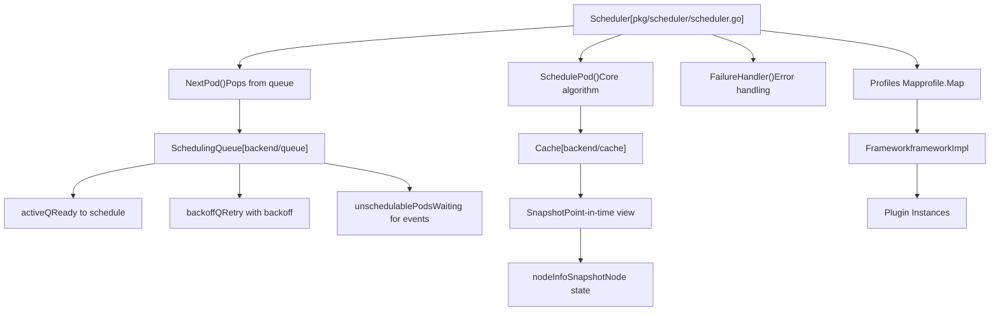
**Sources:** [pkg/scheduler/scheduler.go66-124](https://github.com/kubernetes/kubernetes/blob/2757a872/pkg/scheduler/scheduler.go#L66-L124) [pkg/scheduler/schedule\_one.go64-95](https://github.com/kubernetes/kubernetes/blob/2757a872/pkg/scheduler/schedule_one.go#L64-L95)

---

## Scheduler Initialization

The scheduler is initialized through the `New()` function, which sets up all necessary components including the plugin framework, queue, cache, and event handlers.

**Initialization Flow**

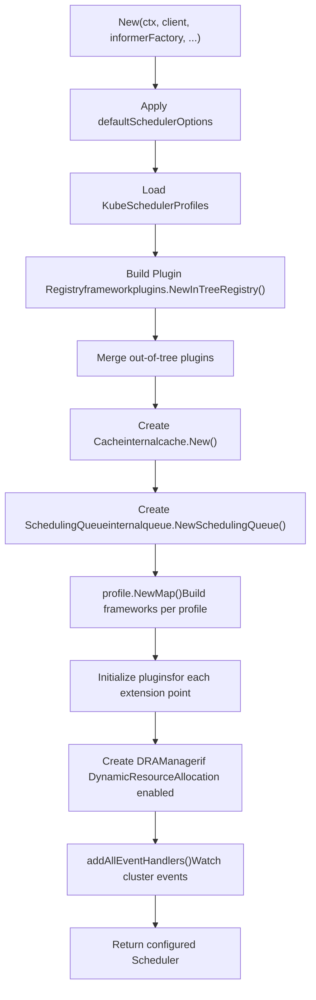
**Sources:** [pkg/scheduler/scheduler.go275-458](https://github.com/kubernetes/kubernetes/blob/2757a872/pkg/scheduler/scheduler.go#L275-L458)

The initialization process creates several key components:

| Component | Type | Purpose |
| --- | --- | --- |
| `Cache` | `internalcache.Cache` | Maintains assumed and bound pods, node information |
| `SchedulingQueue` | `internalqueue.SchedulingQueue` | Manages pods waiting to be scheduled with priority and backoff |
| `Profiles` | `profile.Map` | Maps scheduler names to framework instances |
| `APIDispatcher` | `apidispatcher.APIDispatcher` | Handles async API calls if enabled |
| `PodGroupManager` | `internalpodgroupmanager.PodGroupManager` | Manages pod groups if GenericWorkload enabled |

**Sources:** [pkg/scheduler/scheduler.go316-449](https://github.com/kubernetes/kubernetes/blob/2757a872/pkg/scheduler/scheduler.go#L316-L449)

---

## Plugin Framework

The scheduler uses an extensible plugin framework where all scheduling logic is implemented as plugins at specific extension points. Each scheduler profile instantiates its own framework with a configured set of plugins.

**Plugin Extension Points**

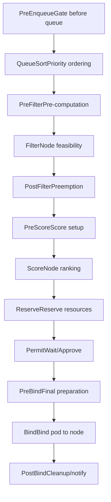
**Sources:** [pkg/scheduler/framework/runtime/framework.go119-134](https://github.com/kubernetes/kubernetes/blob/2757a872/pkg/scheduler/framework/runtime/framework.go#L119-L134)

### Framework Implementation

The `frameworkImpl` struct maintains all registered plugins and provides methods to invoke them at each extension point:

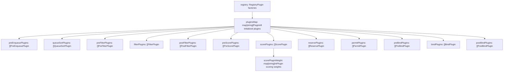
**Sources:** [pkg/scheduler/framework/runtime/framework.go55-106](https://github.com/kubernetes/kubernetes/blob/2757a872/pkg/scheduler/framework/runtime/framework.go#L55-L106)

### Plugin Initialization

Plugins are initialized during framework creation in `NewFramework()`:

1.  **Load Configuration**: Profile plugins and configuration are parsed from `KubeSchedulerProfile`
2.  **Initialize Plugins**: Each plugin factory is called with its arguments to create plugin instances
3.  **Populate Extension Points**: Plugin instances are added to their respective extension point slices
4.  **Expand MultiPoint**: Plugins configured at the `MultiPoint` extension are expanded to multiple extension points
5.  **Validate**: Ensure exactly one `QueueSort` plugin and at least one `Bind` plugin exist

**Sources:** [pkg/scheduler/framework/runtime/framework.go314-466](https://github.com/kubernetes/kubernetes/blob/2757a872/pkg/scheduler/framework/runtime/framework.go#L314-L466)

---

## Scheduling Cycle Phases

The scheduling cycle is the synchronous phase that selects a node for a pod. It consists of filtering and scoring phases.

### Main Scheduling Loop

**ScheduleOne Execution Flow**

> **[Mermaid sequence]**
> *(图表结构无法解析)*

**Sources:** [pkg/scheduler/schedule\_one.go64-147](https://github.com/kubernetes/kubernetes/blob/2757a872/pkg/scheduler/schedule_one.go#L64-L147) [pkg/scheduler/schedule\_one.go173-309](https://github.com/kubernetes/kubernetes/blob/2757a872/pkg/scheduler/schedule_one.go#L173-L309)

### Filter Phase

The filter phase eliminates nodes that cannot run the pod. Nodes are evaluated in parallel with a configurable parallelism level.

**Filter Phase Implementation**

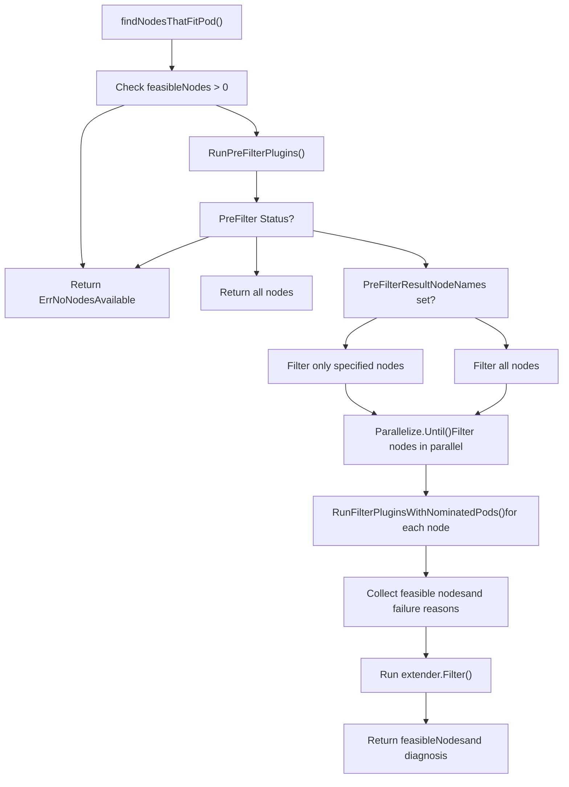
**Sources:** [pkg/scheduler/generic\_scheduler.go176-307](https://github.com/kubernetes/kubernetes/blob/2757a872/pkg/scheduler/generic_scheduler.go#L176-L307)

Each filter plugin returns a `Status` indicating whether the node is suitable:

-   `Success`: Node passes this filter
-   `Unschedulable`: Node fails this filter
-   `UnschedulableAndUnresolvable`: Node fails and won't become feasible with changes
-   `Error`: Internal error occurred

**Sources:** [pkg/scheduler/framework/interface.go](https://github.com/kubernetes/kubernetes/blob/2757a872/pkg/scheduler/framework/interface.go)

### Score Phase

The score phase ranks feasible nodes to select the best one. Each score plugin assigns a score to each node, and scores are weighted and summed.

**Scoring Process**

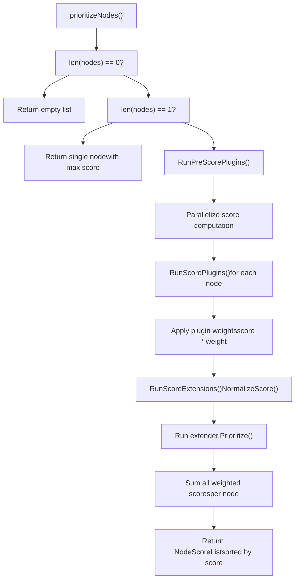
**Sources:** [pkg/scheduler/generic\_scheduler.go309-452](https://github.com/kubernetes/kubernetes/blob/2757a872/pkg/scheduler/generic_scheduler.go#L309-L452)

Score normalization ensures all plugins produce scores in the range `[0, MaxNodeScore]` where `MaxNodeScore = 100`. The weighted sum must not exceed `MaxTotalScore`:

```
totalScore = Σ (pluginScore[i] * pluginWeight[i])
```
**Sources:** [pkg/scheduler/framework/runtime/framework.go536-566](https://github.com/kubernetes/kubernetes/blob/2757a872/pkg/scheduler/framework/runtime/framework.go#L536-L566)

### Host Selection

After scoring, `selectHost()` picks the best node. If multiple nodes have the same highest score, one is selected randomly to ensure even distribution.

**Sources:** [pkg/scheduler/generic\_scheduler.go488-519](https://github.com/kubernetes/kubernetes/blob/2757a872/pkg/scheduler/generic_scheduler.go#L488-L519)

---

## Binding Cycle

The binding cycle runs asynchronously after a node is selected. It prepares the pod for binding and updates the API server.

**Binding Cycle Flow**

> **[Mermaid sequence]**
> *(图表结构无法解析)*

**Sources:** [pkg/scheduler/schedule\_one.go149-169](https://github.com/kubernetes/kubernetes/blob/2757a872/pkg/scheduler/schedule_one.go#L149-L169) [pkg/scheduler/schedule\_one.go395-502](https://github.com/kubernetes/kubernetes/blob/2757a872/pkg/scheduler/schedule_one.go#L395-L502)

### Assume Operation

Before binding, the scheduler "assumes" the pod is already bound by adding it to the cache. This allows subsequent scheduling decisions to account for this pod's resource usage, even though the bind hasn't completed yet:

```
Cache.AssumePod(pod, nodeName)
```
If binding fails, the pod is removed from the cache via `Cache.ForgetPod()`.

**Sources:** [pkg/scheduler/schedule\_one.go311-358](https://github.com/kubernetes/kubernetes/blob/2757a872/pkg/scheduler/schedule_one.go#L311-L358)

### Reserve Plugins

Reserve plugins reserve resources for the pod. If any reserve plugin fails, all previously successful reserve plugins have their `Unreserve()` method called to clean up:

**Sources:** [pkg/scheduler/schedule\_one.go336-356](https://github.com/kubernetes/kubernetes/blob/2757a872/pkg/scheduler/schedule_one.go#L336-L356)

### Permit Plugins

Permit plugins can:

-   **Approve**: Allow binding to proceed immediately
-   **Wait**: Block for a specified duration (max 15 minutes)
-   **Reject**: Reject the binding

Waiting pods are stored in `waitingPodsMap` and can be approved later by calling `Allow()`.

**Sources:** [pkg/scheduler/schedule\_one.go216-240](https://github.com/kubernetes/kubernetes/blob/2757a872/pkg/scheduler/schedule_one.go#L216-L240) [pkg/scheduler/schedule\_one.go429-444](https://github.com/kubernetes/kubernetes/blob/2757a872/pkg/scheduler/schedule_one.go#L429-L444)

---

## Preemption

When no nodes can accommodate a pod, the scheduler attempts preemption: evicting lower-priority pods to make room.

**Preemption Architecture**

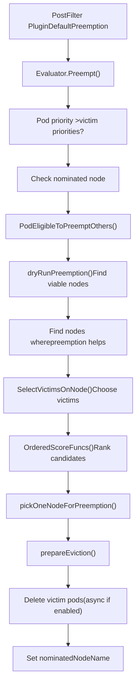
**Sources:** [pkg/scheduler/framework/preemption/preemption.go87-185](https://github.com/kubernetes/kubernetes/blob/2757a872/pkg/scheduler/framework/preemption/preemption.go#L87-L185) [pkg/scheduler/framework/plugins/defaultpreemption/default\_preemption.go120-132](https://github.com/kubernetes/kubernetes/blob/2757a872/pkg/scheduler/framework/plugins/defaultpreemption/default_preemption.go#L120-L132)

### Preemption Algorithm

The preemption algorithm follows these steps:

1.  **Eligibility Check**: Verify the pod can preempt others based on priority
2.  **Dry Run**: For each node, determine if preempting some pods would make it schedulable
3.  **Victim Selection**: On each candidate node, select the minimal set of victims
4.  **Node Ranking**: Rank candidate nodes using ordered scoring functions
5.  **Execute**: Delete victim pods and nominate the node

**Sources:** [pkg/scheduler/framework/preemption/preemption.go187-295](https://github.com/kubernetes/kubernetes/blob/2757a872/pkg/scheduler/framework/preemption/preemption.go#L187-L295)

### Victim Selection

On each node, `SelectVictimsOnNode()` finds the minimal set of pods to preempt:

**Victim Selection Process**

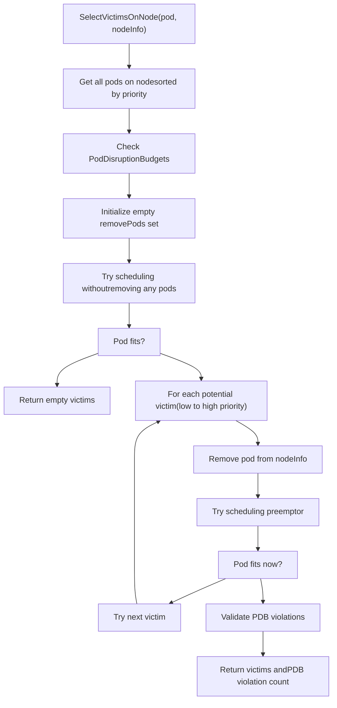
**Sources:** [pkg/scheduler/framework/plugins/defaultpreemption/default\_preemption.go194-344](https://github.com/kubernetes/kubernetes/blob/2757a872/pkg/scheduler/framework/plugins/defaultpreemption/default_preemption.go#L194-L344)

The algorithm removes pods one by one (lowest priority first) until the preemptor fits, minimizing disruption.

### Asynchronous Preemption

When `EnableAsyncPreemption` feature gate is enabled, victim deletion happens asynchronously. The preemptor pod is gated in `PreEnqueue` until preemption completes:

**Sources:** [pkg/scheduler/framework/plugins/defaultpreemption/default\_preemption.go134-142](https://github.com/kubernetes/kubernetes/blob/2757a872/pkg/scheduler/framework/plugins/defaultpreemption/default_preemption.go#L134-L142) [pkg/scheduler/framework/preemption/preemption.go297-391](https://github.com/kubernetes/kubernetes/blob/2757a872/pkg/scheduler/framework/preemption/preemption.go#L297-L391)

---

## Multi-Profile Support

The scheduler supports multiple scheduling profiles, allowing different scheduling behaviors for different pods based on `schedulerName`.

**Profile Architecture**

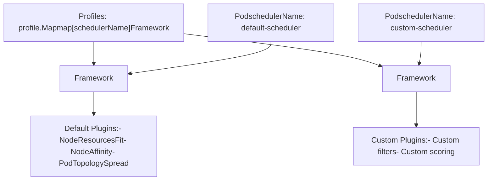
**Sources:** [pkg/scheduler/scheduler.go359-378](https://github.com/kubernetes/kubernetes/blob/2757a872/pkg/scheduler/scheduler.go#L359-L378)

### Profile Configuration

Profiles are defined in `KubeSchedulerConfiguration`:

```
Profiles:
  - schedulerName: "default-scheduler"
    plugins:
      filter:
        enabled:
          - name: "NodeResourcesFit"
      score:
        enabled:
          - name: "NodeResourcesFit"
            weight: 1
  - schedulerName: "custom-scheduler"
    plugins:
      filter:
        enabled:
          - name: "CustomFilter"
```
Each profile creates its own framework instance with independent plugin configurations.

**Sources:** [pkg/scheduler/scheduler.go291-299](https://github.com/kubernetes/kubernetes/blob/2757a872/pkg/scheduler/scheduler.go#L291-L299) [pkg/scheduler/profile/profile.go](https://github.com/kubernetes/kubernetes/blob/2757a872/pkg/scheduler/profile/profile.go)

### Framework Selection

When scheduling a pod, `frameworkForPod()` selects the appropriate framework based on `pod.Spec.SchedulerName`:

**Sources:** [pkg/scheduler/scheduler.go108-115](https://github.com/kubernetes/kubernetes/blob/2757a872/pkg/scheduler/scheduler.go#L108-L115)

---

## Scheduling Queue

The scheduling queue manages pods waiting to be scheduled. It maintains three internal queues with different semantics.

**Queue Architecture**

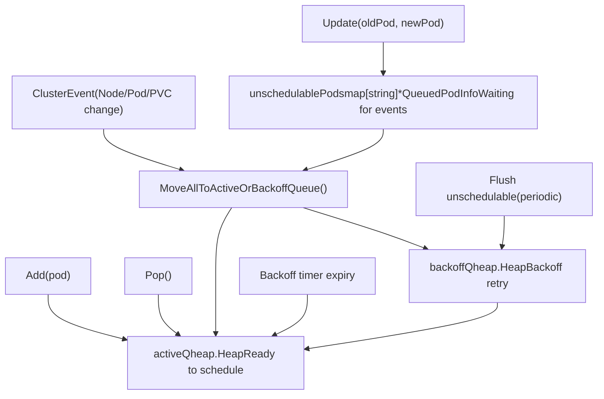
**Sources:** [pkg/scheduler/backend/queue/priority\_queue.go](https://github.com/kubernetes/kubernetes/blob/2757a872/pkg/scheduler/backend/queue/priority_queue.go)

### Queue Movement Logic

Pods move between queues based on various events:

| Event | Source Queue | Destination | Condition |
| --- | --- | --- | --- |
| Add new pod | \- | activeQ | Always |
| Pop for scheduling | activeQ | \- | Highest priority |
| Scheduling failed | \- | backoffQ | Unschedulable |
| Backoff expired | backoffQ | activeQ | Time elapsed |
| Cluster event | unschedulablePods | activeQ or backoffQ | Event matches plugin hint |
| Periodic flush | unschedulablePods | backoffQ | Timeout exceeded |

**Sources:** [pkg/scheduler/backend/queue/priority\_queue.go](https://github.com/kubernetes/kubernetes/blob/2757a872/pkg/scheduler/backend/queue/priority_queue.go)

### Queueing Hints

Plugins can register queueing hints to specify which cluster events make a previously unschedulable pod worth retrying:

**Sources:** [pkg/scheduler/scheduler.go466-533](https://github.com/kubernetes/kubernetes/blob/2757a872/pkg/scheduler/scheduler.go#L466-L533) [pkg/scheduler/framework/plugins/defaultpreemption/default\_preemption.go144-168](https://github.com/kubernetes/kubernetes/blob/2757a872/pkg/scheduler/framework/plugins/defaultpreemption/default_preemption.go#L144-L168)

Each hint is a function: `QueueingHintFn(pod, oldObj, newObj) -> (Queue | QueueSkip, error)`

---

## Event Handling

The scheduler watches cluster resources and reacts to changes by moving pods in the queue or updating the cache.

**Event Handler Registration**

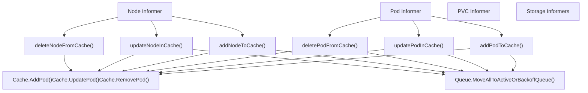
**Sources:** [pkg/scheduler/eventhandlers.go](https://github.com/kubernetes/kubernetes/blob/2757a872/pkg/scheduler/eventhandlers.go)

The scheduler registers handlers for:

-   Pods (assigned/unassigned)
-   Nodes
-   PersistentVolumes and PersistentVolumeClaims
-   StorageClasses, CSINodes, CSIDrivers, CSIStorageCapacity
-   ResourceClaims, ResourceSlices (if DynamicResourceAllocation enabled)
-   PodGroups (if GenericWorkload enabled)

**Sources:** [pkg/scheduler/eventhandlers.go29-400](https://github.com/kubernetes/kubernetes/blob/2757a872/pkg/scheduler/eventhandlers.go#L29-L400)

---

## Key Data Structures

### Scheduler

The `Scheduler` struct is the top-level orchestrator:

**Sources:** [pkg/scheduler/scheduler.go66-124](https://github.com/kubernetes/kubernetes/blob/2757a872/pkg/scheduler/scheduler.go#L66-L124)

| Field | Type | Purpose |
| --- | --- | --- |
| `Cache` | `internalcache.Cache` | Stores assumed pods and node information |
| `SchedulingQueue` | `internalqueue.SchedulingQueue` | Prioritized queue of pods to schedule |
| `Profiles` | `profile.Map` | Maps scheduler names to frameworks |
| `NextPod` | `func() (*QueuedPodInfo, error)` | Function to pop next pod from queue |
| `SchedulePod` | `func(...) (ScheduleResult, error)` | Core scheduling algorithm |
| `FailureHandler` | `FailureHandlerFn` | Handles scheduling failures |
| `APIDispatcher` | `*apidispatcher.APIDispatcher` | Async API call dispatcher (optional) |

### QueuedPodInfo

Wraps a pod with scheduling metadata:

**Sources:** [pkg/scheduler/framework/types.go500-570](https://github.com/kubernetes/kubernetes/blob/2757a872/pkg/scheduler/framework/types.go#L500-L570)

| Field | Type | Purpose |
| --- | --- | --- |
| `PodInfo` | `fwk.PodInfo` | Pod and resource calculations |
| `Timestamp` | `time.Time` | When added to queue |
| `Attempts` | `int` | Number of scheduling attempts |
| `InitialAttemptTimestamp` | `*time.Time` | First attempt time (for metrics) |
| `UnschedulablePlugins` | `sets.Set[string]` | Plugins that rejected this pod |
| `Gated` | `bool` | Whether pod is gated |

### ScheduleResult

Result of scheduling a pod:

**Sources:** [pkg/scheduler/scheduler.go152-163](https://github.com/kubernetes/kubernetes/blob/2757a872/pkg/scheduler/scheduler.go#L152-L163)

| Field | Type | Purpose |
| --- | --- | --- |
| `SuggestedHost` | `string` | Selected node name |
| `EvaluatedNodes` | `int` | Nodes evaluated in filter phase |
| `FeasibleNodes` | `int` | Nodes that passed filters |
| `nominatingInfo` | `*fwk.NominatingInfo` | Nomination info for preemption |

---

## Summary

The Kubernetes scheduler is a sophisticated system built on an extensible plugin framework. It continuously processes pods from a priority queue, evaluates nodes through filter and score phases, and binds pods to optimal nodes. When no suitable node exists, it can preempt lower-priority pods. Multi-profile support allows different scheduling behaviors for different workloads.

Key subsystems include:

-   **Plugin Framework**: Extensible architecture with 12+ extension points ([pkg/scheduler/framework/runtime/framework.go55-106](https://github.com/kubernetes/kubernetes/blob/2757a872/pkg/scheduler/framework/runtime/framework.go#L55-L106))
-   **Scheduling Queue**: Three-tier queue system with intelligent event-driven requeuing ([pkg/scheduler/backend/queue/](https://github.com/kubernetes/kubernetes/blob/2757a872/pkg/scheduler/backend/queue/))
-   **Cache**: Maintains assumed pod state and node snapshots ([pkg/scheduler/backend/cache/](https://github.com/kubernetes/kubernetes/blob/2757a872/pkg/scheduler/backend/cache/))
-   **Preemption**: Sophisticated victim selection with PDB awareness ([pkg/scheduler/framework/preemption/preemption.go](https://github.com/kubernetes/kubernetes/blob/2757a872/pkg/scheduler/framework/preemption/preemption.go))

**Sources:** [pkg/scheduler/scheduler.go](https://github.com/kubernetes/kubernetes/blob/2757a872/pkg/scheduler/scheduler.go) [pkg/scheduler/schedule\_one.go](https://github.com/kubernetes/kubernetes/blob/2757a872/pkg/scheduler/schedule_one.go) [pkg/scheduler/framework/runtime/framework.go](https://github.com/kubernetes/kubernetes/blob/2757a872/pkg/scheduler/framework/runtime/framework.go) [pkg/scheduler/framework/preemption/preemption.go](https://github.com/kubernetes/kubernetes/blob/2757a872/pkg/scheduler/framework/preemption/preemption.go)
