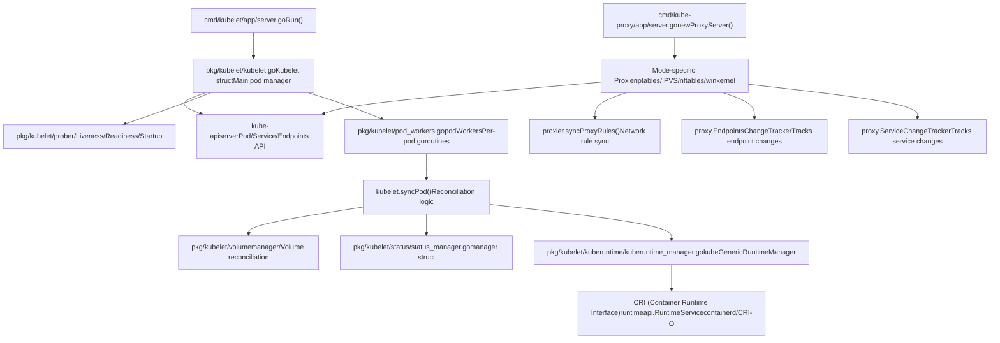
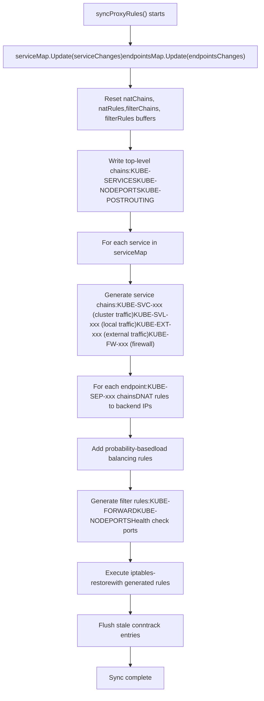
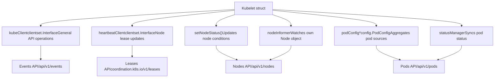
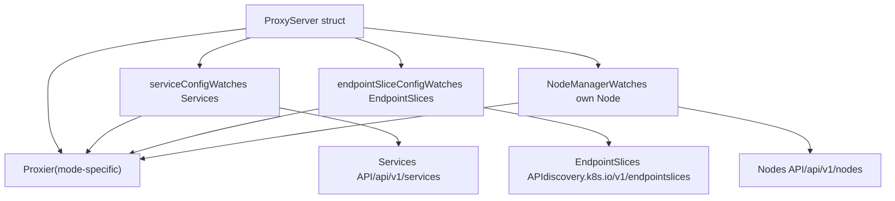

# Node Components

Relevant source files

-   [cmd/kube-proxy/app/options.go](https://github.com/kubernetes/kubernetes/blob/2757a872/cmd/kube-proxy/app/options.go)
-   [cmd/kube-proxy/app/options\_test.go](https://github.com/kubernetes/kubernetes/blob/2757a872/cmd/kube-proxy/app/options_test.go)
-   [cmd/kube-proxy/app/server.go](https://github.com/kubernetes/kubernetes/blob/2757a872/cmd/kube-proxy/app/server.go)
-   [cmd/kube-proxy/app/server\_linux.go](https://github.com/kubernetes/kubernetes/blob/2757a872/cmd/kube-proxy/app/server_linux.go)
-   [cmd/kube-proxy/app/server\_linux\_test.go](https://github.com/kubernetes/kubernetes/blob/2757a872/cmd/kube-proxy/app/server_linux_test.go)
-   [cmd/kube-proxy/app/server\_test.go](https://github.com/kubernetes/kubernetes/blob/2757a872/cmd/kube-proxy/app/server_test.go)
-   [cmd/kube-proxy/app/server\_windows.go](https://github.com/kubernetes/kubernetes/blob/2757a872/cmd/kube-proxy/app/server_windows.go)
-   [cmd/kubelet/app/server.go](https://github.com/kubernetes/kubernetes/blob/2757a872/cmd/kubelet/app/server.go)
-   [cmd/kubemark/hollow-node.go](https://github.com/kubernetes/kubernetes/blob/2757a872/cmd/kubemark/hollow-node.go)
-   [pkg/kubelet/allocation/allocation\_manager.go](https://github.com/kubernetes/kubernetes/blob/2757a872/pkg/kubelet/allocation/allocation_manager.go)
-   [pkg/kubelet/allocation/allocation\_manager\_test.go](https://github.com/kubernetes/kubernetes/blob/2757a872/pkg/kubelet/allocation/allocation_manager_test.go)
-   [pkg/kubelet/allocation/features\_linux.go](https://github.com/kubernetes/kubernetes/blob/2757a872/pkg/kubelet/allocation/features_linux.go)
-   [pkg/kubelet/allocation/features\_unsupported.go](https://github.com/kubernetes/kubernetes/blob/2757a872/pkg/kubelet/allocation/features_unsupported.go)
-   [pkg/kubelet/allocation/features\_windows.go](https://github.com/kubernetes/kubernetes/blob/2757a872/pkg/kubelet/allocation/features_windows.go)
-   [pkg/kubelet/allocation/state/checkpoint.go](https://github.com/kubernetes/kubernetes/blob/2757a872/pkg/kubelet/allocation/state/checkpoint.go)
-   [pkg/kubelet/allocation/state/state.go](https://github.com/kubernetes/kubernetes/blob/2757a872/pkg/kubelet/allocation/state/state.go)
-   [pkg/kubelet/allocation/state/state\_checkpoint.go](https://github.com/kubernetes/kubernetes/blob/2757a872/pkg/kubelet/allocation/state/state_checkpoint.go)
-   [pkg/kubelet/allocation/state/state\_checkpoint\_test.go](https://github.com/kubernetes/kubernetes/blob/2757a872/pkg/kubelet/allocation/state/state_checkpoint_test.go)
-   [pkg/kubelet/allocation/state/state\_mem.go](https://github.com/kubernetes/kubernetes/blob/2757a872/pkg/kubelet/allocation/state/state_mem.go)
-   [pkg/kubelet/container/helpers.go](https://github.com/kubernetes/kubernetes/blob/2757a872/pkg/kubelet/container/helpers.go)
-   [pkg/kubelet/container/helpers\_test.go](https://github.com/kubernetes/kubernetes/blob/2757a872/pkg/kubelet/container/helpers_test.go)
-   [pkg/kubelet/container/runtime.go](https://github.com/kubernetes/kubernetes/blob/2757a872/pkg/kubelet/container/runtime.go)
-   [pkg/kubelet/container/testing/fake\_cache.go](https://github.com/kubernetes/kubernetes/blob/2757a872/pkg/kubelet/container/testing/fake_cache.go)
-   [pkg/kubelet/container/testing/fake\_runtime.go](https://github.com/kubernetes/kubernetes/blob/2757a872/pkg/kubelet/container/testing/fake_runtime.go)
-   [pkg/kubelet/container/testing/fake\_runtime\_helper.go](https://github.com/kubernetes/kubernetes/blob/2757a872/pkg/kubelet/container/testing/fake_runtime_helper.go)
-   [pkg/kubelet/container/testing/mocks.go](https://github.com/kubernetes/kubernetes/blob/2757a872/pkg/kubelet/container/testing/mocks.go)
-   [pkg/kubelet/images/helpers.go](https://github.com/kubernetes/kubernetes/blob/2757a872/pkg/kubelet/images/helpers.go)
-   [pkg/kubelet/images/image\_manager.go](https://github.com/kubernetes/kubernetes/blob/2757a872/pkg/kubelet/images/image_manager.go)
-   [pkg/kubelet/images/image\_manager\_test.go](https://github.com/kubernetes/kubernetes/blob/2757a872/pkg/kubelet/images/image_manager_test.go)
-   [pkg/kubelet/images/puller.go](https://github.com/kubernetes/kubernetes/blob/2757a872/pkg/kubelet/images/puller.go)
-   [pkg/kubelet/images/types.go](https://github.com/kubernetes/kubernetes/blob/2757a872/pkg/kubelet/images/types.go)
-   [pkg/kubelet/kubelet.go](https://github.com/kubernetes/kubernetes/blob/2757a872/pkg/kubelet/kubelet.go)
-   [pkg/kubelet/kubelet\_node\_status.go](https://github.com/kubernetes/kubernetes/blob/2757a872/pkg/kubelet/kubelet_node_status.go)
-   [pkg/kubelet/kubelet\_node\_status\_test.go](https://github.com/kubernetes/kubernetes/blob/2757a872/pkg/kubelet/kubelet_node_status_test.go)
-   [pkg/kubelet/kubelet\_pods.go](https://github.com/kubernetes/kubernetes/blob/2757a872/pkg/kubelet/kubelet_pods.go)
-   [pkg/kubelet/kubelet\_pods\_test.go](https://github.com/kubernetes/kubernetes/blob/2757a872/pkg/kubelet/kubelet_pods_test.go)
-   [pkg/kubelet/kubelet\_test.go](https://github.com/kubernetes/kubernetes/blob/2757a872/pkg/kubelet/kubelet_test.go)
-   [pkg/kubelet/kubelet\_volumes.go](https://github.com/kubernetes/kubernetes/blob/2757a872/pkg/kubelet/kubelet_volumes.go)
-   [pkg/kubelet/kubelet\_volumes\_linux\_test.go](https://github.com/kubernetes/kubernetes/blob/2757a872/pkg/kubelet/kubelet_volumes_linux_test.go)
-   [pkg/kubelet/kubelet\_volumes\_test.go](https://github.com/kubernetes/kubernetes/blob/2757a872/pkg/kubelet/kubelet_volumes_test.go)
-   [pkg/kubelet/kuberuntime/convert.go](https://github.com/kubernetes/kubernetes/blob/2757a872/pkg/kubelet/kuberuntime/convert.go)
-   [pkg/kubelet/kuberuntime/convert\_test.go](https://github.com/kubernetes/kubernetes/blob/2757a872/pkg/kubelet/kuberuntime/convert_test.go)
-   [pkg/kubelet/kuberuntime/helpers.go](https://github.com/kubernetes/kubernetes/blob/2757a872/pkg/kubelet/kuberuntime/helpers.go)
-   [pkg/kubelet/kuberuntime/helpers\_test.go](https://github.com/kubernetes/kubernetes/blob/2757a872/pkg/kubelet/kuberuntime/helpers_test.go)
-   [pkg/kubelet/kuberuntime/kuberuntime\_container.go](https://github.com/kubernetes/kubernetes/blob/2757a872/pkg/kubelet/kuberuntime/kuberuntime_container.go)
-   [pkg/kubelet/kuberuntime/kuberuntime\_container\_test.go](https://github.com/kubernetes/kubernetes/blob/2757a872/pkg/kubelet/kuberuntime/kuberuntime_container_test.go)
-   [pkg/kubelet/kuberuntime/kuberuntime\_gc.go](https://github.com/kubernetes/kubernetes/blob/2757a872/pkg/kubelet/kuberuntime/kuberuntime_gc.go)
-   [pkg/kubelet/kuberuntime/kuberuntime\_gc\_test.go](https://github.com/kubernetes/kubernetes/blob/2757a872/pkg/kubelet/kuberuntime/kuberuntime_gc_test.go)
-   [pkg/kubelet/kuberuntime/kuberuntime\_image.go](https://github.com/kubernetes/kubernetes/blob/2757a872/pkg/kubelet/kuberuntime/kuberuntime_image.go)
-   [pkg/kubelet/kuberuntime/kuberuntime\_image\_test.go](https://github.com/kubernetes/kubernetes/blob/2757a872/pkg/kubelet/kuberuntime/kuberuntime_image_test.go)
-   [pkg/kubelet/kuberuntime/kuberuntime\_manager.go](https://github.com/kubernetes/kubernetes/blob/2757a872/pkg/kubelet/kuberuntime/kuberuntime_manager.go)
-   [pkg/kubelet/kuberuntime/kuberuntime\_manager\_test.go](https://github.com/kubernetes/kubernetes/blob/2757a872/pkg/kubelet/kuberuntime/kuberuntime_manager_test.go)
-   [pkg/kubelet/kuberuntime/kuberuntime\_sandbox.go](https://github.com/kubernetes/kubernetes/blob/2757a872/pkg/kubelet/kuberuntime/kuberuntime_sandbox.go)
-   [pkg/kubelet/kuberuntime/kuberuntime\_sandbox\_test.go](https://github.com/kubernetes/kubernetes/blob/2757a872/pkg/kubelet/kuberuntime/kuberuntime_sandbox_test.go)
-   [pkg/kubelet/kuberuntime/labels.go](https://github.com/kubernetes/kubernetes/blob/2757a872/pkg/kubelet/kuberuntime/labels.go)
-   [pkg/kubelet/kuberuntime/labels\_test.go](https://github.com/kubernetes/kubernetes/blob/2757a872/pkg/kubelet/kuberuntime/labels_test.go)
-   [pkg/kubelet/kuberuntime/security\_context.go](https://github.com/kubernetes/kubernetes/blob/2757a872/pkg/kubelet/kuberuntime/security_context.go)
-   [pkg/kubelet/kuberuntime/util/util.go](https://github.com/kubernetes/kubernetes/blob/2757a872/pkg/kubelet/kuberuntime/util/util.go)
-   [pkg/kubelet/kuberuntime/util/util\_test.go](https://github.com/kubernetes/kubernetes/blob/2757a872/pkg/kubelet/kuberuntime/util/util_test.go)
-   [pkg/kubelet/nodestatus/setters.go](https://github.com/kubernetes/kubernetes/blob/2757a872/pkg/kubelet/nodestatus/setters.go)
-   [pkg/kubelet/nodestatus/setters\_test.go](https://github.com/kubernetes/kubernetes/blob/2757a872/pkg/kubelet/nodestatus/setters_test.go)
-   [pkg/kubelet/pod\_workers.go](https://github.com/kubernetes/kubernetes/blob/2757a872/pkg/kubelet/pod_workers.go)
-   [pkg/kubelet/pod\_workers\_test.go](https://github.com/kubernetes/kubernetes/blob/2757a872/pkg/kubelet/pod_workers_test.go)
-   [pkg/kubelet/prober/common\_test.go](https://github.com/kubernetes/kubernetes/blob/2757a872/pkg/kubelet/prober/common_test.go)
-   [pkg/kubelet/prober/prober.go](https://github.com/kubernetes/kubernetes/blob/2757a872/pkg/kubelet/prober/prober.go)
-   [pkg/kubelet/prober/prober\_manager.go](https://github.com/kubernetes/kubernetes/blob/2757a872/pkg/kubelet/prober/prober_manager.go)
-   [pkg/kubelet/prober/prober\_manager\_test.go](https://github.com/kubernetes/kubernetes/blob/2757a872/pkg/kubelet/prober/prober_manager_test.go)
-   [pkg/kubelet/prober/prober\_test.go](https://github.com/kubernetes/kubernetes/blob/2757a872/pkg/kubelet/prober/prober_test.go)
-   [pkg/kubelet/prober/worker.go](https://github.com/kubernetes/kubernetes/blob/2757a872/pkg/kubelet/prober/worker.go)
-   [pkg/kubelet/prober/worker\_test.go](https://github.com/kubernetes/kubernetes/blob/2757a872/pkg/kubelet/prober/worker_test.go)
-   [pkg/kubelet/status/status\_manager.go](https://github.com/kubernetes/kubernetes/blob/2757a872/pkg/kubelet/status/status_manager.go)
-   [pkg/kubelet/status/status\_manager\_test.go](https://github.com/kubernetes/kubernetes/blob/2757a872/pkg/kubelet/status/status_manager_test.go)
-   [pkg/kubelet/types/doc.go](https://github.com/kubernetes/kubernetes/blob/2757a872/pkg/kubelet/types/doc.go)
-   [pkg/kubemark/hollow\_kubelet.go](https://github.com/kubernetes/kubernetes/blob/2757a872/pkg/kubemark/hollow_kubelet.go)
-   [pkg/proxy/apis/config/fuzzer/fuzzer.go](https://github.com/kubernetes/kubernetes/blob/2757a872/pkg/proxy/apis/config/fuzzer/fuzzer.go)
-   [pkg/proxy/apis/config/scheme/testdata/KubeProxyConfiguration/after/v1alpha1.yaml](https://github.com/kubernetes/kubernetes/blob/2757a872/pkg/proxy/apis/config/scheme/testdata/KubeProxyConfiguration/after/v1alpha1.yaml)
-   [pkg/proxy/apis/config/scheme/testdata/KubeProxyConfiguration/roundtrip/default/v1alpha1.yaml](https://github.com/kubernetes/kubernetes/blob/2757a872/pkg/proxy/apis/config/scheme/testdata/KubeProxyConfiguration/roundtrip/default/v1alpha1.yaml)
-   [pkg/proxy/apis/config/types.go](https://github.com/kubernetes/kubernetes/blob/2757a872/pkg/proxy/apis/config/types.go)
-   [pkg/proxy/apis/config/v1alpha1/conversion.go](https://github.com/kubernetes/kubernetes/blob/2757a872/pkg/proxy/apis/config/v1alpha1/conversion.go)
-   [pkg/proxy/apis/config/v1alpha1/defaults.go](https://github.com/kubernetes/kubernetes/blob/2757a872/pkg/proxy/apis/config/v1alpha1/defaults.go)
-   [pkg/proxy/apis/config/v1alpha1/defaults\_test.go](https://github.com/kubernetes/kubernetes/blob/2757a872/pkg/proxy/apis/config/v1alpha1/defaults_test.go)
-   [pkg/proxy/apis/config/v1alpha1/zz\_generated.conversion.go](https://github.com/kubernetes/kubernetes/blob/2757a872/pkg/proxy/apis/config/v1alpha1/zz_generated.conversion.go)
-   [pkg/proxy/apis/config/validation/validation.go](https://github.com/kubernetes/kubernetes/blob/2757a872/pkg/proxy/apis/config/validation/validation.go)
-   [pkg/proxy/apis/config/validation/validation\_test.go](https://github.com/kubernetes/kubernetes/blob/2757a872/pkg/proxy/apis/config/validation/validation_test.go)
-   [pkg/proxy/apis/config/zz\_generated.deepcopy.go](https://github.com/kubernetes/kubernetes/blob/2757a872/pkg/proxy/apis/config/zz_generated.deepcopy.go)
-   [pkg/proxy/apis/well\_known\_labels.go](https://github.com/kubernetes/kubernetes/blob/2757a872/pkg/proxy/apis/well_known_labels.go)
-   [pkg/proxy/config/api\_test.go](https://github.com/kubernetes/kubernetes/blob/2757a872/pkg/proxy/config/api_test.go)
-   [pkg/proxy/config/config.go](https://github.com/kubernetes/kubernetes/blob/2757a872/pkg/proxy/config/config.go)
-   [pkg/proxy/config/config\_test.go](https://github.com/kubernetes/kubernetes/blob/2757a872/pkg/proxy/config/config_test.go)
-   [pkg/proxy/endpointschangetracker.go](https://github.com/kubernetes/kubernetes/blob/2757a872/pkg/proxy/endpointschangetracker.go)
-   [pkg/proxy/endpointschangetracker\_test.go](https://github.com/kubernetes/kubernetes/blob/2757a872/pkg/proxy/endpointschangetracker_test.go)
-   [pkg/proxy/endpointslicecache.go](https://github.com/kubernetes/kubernetes/blob/2757a872/pkg/proxy/endpointslicecache.go)
-   [pkg/proxy/endpointslicecache\_test.go](https://github.com/kubernetes/kubernetes/blob/2757a872/pkg/proxy/endpointslicecache_test.go)
-   [pkg/proxy/healthcheck/common.go](https://github.com/kubernetes/kubernetes/blob/2757a872/pkg/proxy/healthcheck/common.go)
-   [pkg/proxy/healthcheck/healthcheck\_test.go](https://github.com/kubernetes/kubernetes/blob/2757a872/pkg/proxy/healthcheck/healthcheck_test.go)
-   [pkg/proxy/healthcheck/proxy\_health.go](https://github.com/kubernetes/kubernetes/blob/2757a872/pkg/proxy/healthcheck/proxy_health.go)
-   [pkg/proxy/healthcheck/service\_health.go](https://github.com/kubernetes/kubernetes/blob/2757a872/pkg/proxy/healthcheck/service_health.go)
-   [pkg/proxy/iptables/proxier.go](https://github.com/kubernetes/kubernetes/blob/2757a872/pkg/proxy/iptables/proxier.go)
-   [pkg/proxy/iptables/proxier\_test.go](https://github.com/kubernetes/kubernetes/blob/2757a872/pkg/proxy/iptables/proxier_test.go)
-   [pkg/proxy/ipvs/proxier.go](https://github.com/kubernetes/kubernetes/blob/2757a872/pkg/proxy/ipvs/proxier.go)
-   [pkg/proxy/ipvs/proxier\_test.go](https://github.com/kubernetes/kubernetes/blob/2757a872/pkg/proxy/ipvs/proxier_test.go)
-   [pkg/proxy/kubemark/hollow\_proxy.go](https://github.com/kubernetes/kubernetes/blob/2757a872/pkg/proxy/kubemark/hollow_proxy.go)
-   [pkg/proxy/metaproxier/meta\_proxier.go](https://github.com/kubernetes/kubernetes/blob/2757a872/pkg/proxy/metaproxier/meta_proxier.go)
-   [pkg/proxy/metrics/metrics.go](https://github.com/kubernetes/kubernetes/blob/2757a872/pkg/proxy/metrics/metrics.go)
-   [pkg/proxy/nftables/README.md](https://github.com/kubernetes/kubernetes/blob/2757a872/pkg/proxy/nftables/README.md?plain=1)
-   [pkg/proxy/nftables/helpers\_test.go](https://github.com/kubernetes/kubernetes/blob/2757a872/pkg/proxy/nftables/helpers_test.go)
-   [pkg/proxy/nftables/proxier.go](https://github.com/kubernetes/kubernetes/blob/2757a872/pkg/proxy/nftables/proxier.go)
-   [pkg/proxy/nftables/proxier\_test.go](https://github.com/kubernetes/kubernetes/blob/2757a872/pkg/proxy/nftables/proxier_test.go)
-   [pkg/proxy/node.go](https://github.com/kubernetes/kubernetes/blob/2757a872/pkg/proxy/node.go)
-   [pkg/proxy/node\_test.go](https://github.com/kubernetes/kubernetes/blob/2757a872/pkg/proxy/node_test.go)
-   [pkg/proxy/servicechangetracker.go](https://github.com/kubernetes/kubernetes/blob/2757a872/pkg/proxy/servicechangetracker.go)
-   [pkg/proxy/servicechangetracker\_test.go](https://github.com/kubernetes/kubernetes/blob/2757a872/pkg/proxy/servicechangetracker_test.go)
-   [pkg/proxy/serviceport.go](https://github.com/kubernetes/kubernetes/blob/2757a872/pkg/proxy/serviceport.go)
-   [pkg/proxy/topology.go](https://github.com/kubernetes/kubernetes/blob/2757a872/pkg/proxy/topology.go)
-   [pkg/proxy/topology\_test.go](https://github.com/kubernetes/kubernetes/blob/2757a872/pkg/proxy/topology_test.go)
-   [pkg/proxy/types.go](https://github.com/kubernetes/kubernetes/blob/2757a872/pkg/proxy/types.go)
-   [pkg/proxy/util/endpoints.go](https://github.com/kubernetes/kubernetes/blob/2757a872/pkg/proxy/util/endpoints.go)
-   [pkg/proxy/util/endpoints\_test.go](https://github.com/kubernetes/kubernetes/blob/2757a872/pkg/proxy/util/endpoints_test.go)
-   [pkg/proxy/util/nodeport\_addresses.go](https://github.com/kubernetes/kubernetes/blob/2757a872/pkg/proxy/util/nodeport_addresses.go)
-   [pkg/proxy/util/nodeport\_addresses\_test.go](https://github.com/kubernetes/kubernetes/blob/2757a872/pkg/proxy/util/nodeport_addresses_test.go)
-   [pkg/proxy/util/utils.go](https://github.com/kubernetes/kubernetes/blob/2757a872/pkg/proxy/util/utils.go)
-   [pkg/proxy/util/utils\_test.go](https://github.com/kubernetes/kubernetes/blob/2757a872/pkg/proxy/util/utils_test.go)
-   [pkg/proxy/winkernel/hcnutils.go](https://github.com/kubernetes/kubernetes/blob/2757a872/pkg/proxy/winkernel/hcnutils.go)
-   [pkg/proxy/winkernel/hns.go](https://github.com/kubernetes/kubernetes/blob/2757a872/pkg/proxy/winkernel/hns.go)
-   [pkg/proxy/winkernel/hns\_test.go](https://github.com/kubernetes/kubernetes/blob/2757a872/pkg/proxy/winkernel/hns_test.go)
-   [pkg/proxy/winkernel/proxier.go](https://github.com/kubernetes/kubernetes/blob/2757a872/pkg/proxy/winkernel/proxier.go)
-   [pkg/proxy/winkernel/proxier\_test.go](https://github.com/kubernetes/kubernetes/blob/2757a872/pkg/proxy/winkernel/proxier_test.go)
-   [pkg/proxy/winkernel/testing/hcnutils\_mock.go](https://github.com/kubernetes/kubernetes/blob/2757a872/pkg/proxy/winkernel/testing/hcnutils_mock.go)
-   [staging/src/k8s.io/cri-api/pkg/errors/doc.go](https://github.com/kubernetes/kubernetes/blob/2757a872/staging/src/k8s.io/cri-api/pkg/errors/doc.go)
-   [staging/src/k8s.io/cri-api/pkg/errors/errors.go](https://github.com/kubernetes/kubernetes/blob/2757a872/staging/src/k8s.io/cri-api/pkg/errors/errors.go)
-   [staging/src/k8s.io/cri-api/pkg/errors/errors\_test.go](https://github.com/kubernetes/kubernetes/blob/2757a872/staging/src/k8s.io/cri-api/pkg/errors/errors_test.go)
-   [staging/src/k8s.io/kube-proxy/config/v1alpha1/types.go](https://github.com/kubernetes/kubernetes/blob/2757a872/staging/src/k8s.io/kube-proxy/config/v1alpha1/types.go)
-   [staging/src/k8s.io/kube-proxy/config/v1alpha1/zz\_generated.deepcopy.go](https://github.com/kubernetes/kubernetes/blob/2757a872/staging/src/k8s.io/kube-proxy/config/v1alpha1/zz_generated.deepcopy.go)

## Purpose and Scope

This document provides an overview of the components that run on Kubernetes worker nodes to manage containers and networking. The node components include **kubelet** (the pod lifecycle manager) and **kube-proxy** (the service networking implementation). These components work together to execute pods and provide service networking on each node in the cluster.

For detailed information about the control plane components (API server, scheduler, controller-manager), see [Control Plane Components](/kubernetes/kubernetes/3-control-plane-components). For cluster bootstrap and management tools, see [Cluster Bootstrap and Management](/kubernetes/kubernetes/5-cluster-bootstrap-and-management).

---

## Node Architecture Overview

Worker nodes run two primary Kubernetes components alongside the container runtime:

| Component | Purpose | Configuration Entry Point | Main Runtime Interface |
| --- | --- | --- | --- |
| **kubelet** | Pod lifecycle management, container orchestration, volume management, status reporting | [cmd/kubelet/app/server.go138-326](https://github.com/kubernetes/kubernetes/blob/2757a872/cmd/kubelet/app/server.go#L138-L326) `NewKubeletCommand` | [pkg/kubelet/kubelet.go284-306](https://github.com/kubernetes/kubernetes/blob/2757a872/pkg/kubelet/kubelet.go#L284-L306) `Bootstrap` interface |
| **kube-proxy** | Service networking, load balancing, network rule synchronization | [cmd/kube-proxy/app/server.go98-157](https://github.com/kubernetes/kubernetes/blob/2757a872/cmd/kube-proxy/app/server.go#L98-L157) `NewProxyCommand` | [pkg/proxy/iptables/proxier.go132-209](https://github.com/kubernetes/kubernetes/blob/2757a872/pkg/proxy/iptables/proxier.go#L132-L209) `Proxier` (mode-specific) |

**Sources:** [pkg/kubelet/kubelet.go1-148](https://github.com/kubernetes/kubernetes/blob/2757a872/pkg/kubelet/kubelet.go#L1-L148) [cmd/kubelet/app/server.go1-130](https://github.com/kubernetes/kubernetes/blob/2757a872/cmd/kubelet/app/server.go#L1-L130) [cmd/kube-proxy/app/server.go1-86](https://github.com/kubernetes/kubernetes/blob/2757a872/cmd/kube-proxy/app/server.go#L1-L86) [pkg/proxy/iptables/proxier.go1-88](https://github.com/kubernetes/kubernetes/blob/2757a872/pkg/proxy/iptables/proxier.go#L1-L88)

---

## Component Initialization and Startup

### Kubelet Initialization Flow

The kubelet initialization process involves creating numerous managers and subsystems before entering the main sync loop.

> **[Mermaid sequence]**
> *(图表结构无法解析)*

**Key initialization structures:**

| Manager | File Location | Purpose |
| --- | --- | --- |
| `podManager` | [pkg/kubelet/pod/pod\_manager.go](https://github.com/kubernetes/kubernetes/blob/2757a872/pkg/kubelet/pod/pod_manager.go) | In-memory cache of pod specs |
| `statusManager` | [pkg/kubelet/status/status\_manager.go60-85](https://github.com/kubernetes/kubernetes/blob/2757a872/pkg/kubelet/status/status_manager.go#L60-L85) | Aggregates and syncs pod status to API server |
| `podWorkers` | [pkg/kubelet/pod\_workers.go](https://github.com/kubernetes/kubernetes/blob/2757a872/pkg/kubelet/pod_workers.go) | Per-pod goroutines for lifecycle management |
| `containerRuntime` | [pkg/kubelet/kuberuntime/kuberuntime\_manager.go109-194](https://github.com/kubernetes/kubernetes/blob/2757a872/pkg/kubelet/kuberuntime/kuberuntime_manager.go#L109-L194) | CRI-based container operations |
| `volumeManager` | [pkg/kubelet/volumemanager/](https://github.com/kubernetes/kubernetes/blob/2757a872/pkg/kubelet/volumemanager/) | Volume attach/mount/unmount operations |
| `pleg` | [pkg/kubelet/pleg/](https://github.com/kubernetes/kubernetes/blob/2757a872/pkg/kubelet/pleg/) | Detects container state changes |
| `probeManager` | [pkg/kubelet/prober/](https://github.com/kubernetes/kubernetes/blob/2757a872/pkg/kubelet/prober/) | Executes liveness/readiness/startup probes |

**Sources:** [cmd/kubelet/app/server.go138-326](https://github.com/kubernetes/kubernetes/blob/2757a872/cmd/kubelet/app/server.go#L138-L326) [pkg/kubelet/kubelet.go421-1151](https://github.com/kubernetes/kubernetes/blob/2757a872/pkg/kubelet/kubelet.go#L421-L1151)

### Kube-proxy Initialization Flow

Kube-proxy initialization varies by mode (iptables, IPVS, nftables, winkernel) but follows a common pattern.

> **[Mermaid sequence]**
> *(图表结构无法解析)*

**Proxier implementations by mode:**

| Mode | Proxier Implementation | Key Characteristics |
| --- | --- | --- |
| **iptables** | [pkg/proxy/iptables/proxier.go132-209](https://github.com/kubernetes/kubernetes/blob/2757a872/pkg/proxy/iptables/proxier.go#L132-L209) `Proxier` struct | NAT-based, chain management, rule generation |
| **IPVS** | [pkg/proxy/ipvs/proxier.go160-249](https://github.com/kubernetes/kubernetes/blob/2757a872/pkg/proxy/ipvs/proxier.go#L160-L249) `Proxier` struct | Virtual servers, ipset integration, higher performance |
| **nftables** | [pkg/proxy/nftables/proxier.go](https://github.com/kubernetes/kubernetes/blob/2757a872/pkg/proxy/nftables/proxier.go) `Proxier` struct | Modern netfilter, native tables |
| **winkernel** | [pkg/proxy/winkernel/proxier.go85-154](https://github.com/kubernetes/kubernetes/blob/2757a872/pkg/proxy/winkernel/proxier.go#L85-L154) `Proxier` struct | Windows HNS integration, DSR support |

**Sources:** [cmd/kube-proxy/app/server.go98-283](https://github.com/kubernetes/kubernetes/blob/2757a872/cmd/kube-proxy/app/server.go#L98-L283) [pkg/proxy/iptables/proxier.go92-324](https://github.com/kubernetes/kubernetes/blob/2757a872/pkg/proxy/iptables/proxier.go#L92-L324) [pkg/proxy/ipvs/proxier.go108-406](https://github.com/kubernetes/kubernetes/blob/2757a872/pkg/proxy/ipvs/proxier.go#L108-L406)

---

## Kubelet Core Subsystems

The kubelet is composed of multiple specialized managers that coordinate pod lifecycle. Detailed coverage is in [Kubelet Architecture](/kubernetes/kubernetes/4.1-kubelet-architecture).

### Key Kubelet Structs and Interfaces

**Primary sync loop entry point:**

-   [pkg/kubelet/kubelet.go1812-2040](https://github.com/kubernetes/kubernetes/blob/2757a872/pkg/kubelet/kubelet.go#L1812-L2040) `Kubelet.syncLoopIteration()` - Main event processing loop
-   [pkg/kubelet/kubelet.go1697-1754](https://github.com/kubernetes/kubernetes/blob/2757a872/pkg/kubelet/kubelet.go#L1697-L1754) `Kubelet.syncPod()` - Core pod reconciliation function

**Sources:** [pkg/kubelet/kubelet.go284-306](https://github.com/kubernetes/kubernetes/blob/2757a872/pkg/kubelet/kubelet.go#L284-L306) [pkg/kubelet/pod\_workers.go](https://github.com/kubernetes/kubernetes/blob/2757a872/pkg/kubelet/pod_workers.go) [pkg/kubelet/kuberuntime/kuberuntime\_manager.go109-194](https://github.com/kubernetes/kubernetes/blob/2757a872/pkg/kubelet/kuberuntime/kuberuntime_manager.go#L109-L194) [pkg/kubelet/status/status\_manager.go60-85](https://github.com/kubernetes/kubernetes/blob/2757a872/pkg/kubelet/status/status_manager.go#L60-L85)

---

## Kube-proxy Service Networking

Kube-proxy translates Kubernetes Services into network rules. Different modes use different underlying technologies. Detailed coverage is in [Kube-proxy and Service Networking](/kubernetes/kubernetes/4.2-kube-proxy-and-service-networking).

### Service to Network Rule Translation

**Core data structures:**

| Type | Definition | Purpose |
| --- | --- | --- |
| `ServicePortMap` | [pkg/proxy/service.go](https://github.com/kubernetes/kubernetes/blob/2757a872/pkg/proxy/service.go) | Maps ServicePortName to ServicePort (IP, port, protocol) |
| `EndpointsMap` | [pkg/proxy/endpoints.go](https://github.com/kubernetes/kubernetes/blob/2757a872/pkg/proxy/endpoints.go) | Maps ServicePortName to \[\]Endpoint (backend IPs) |
| `ServiceChangeTracker` | [pkg/proxy/service.go](https://github.com/kubernetes/kubernetes/blob/2757a872/pkg/proxy/service.go) `ServiceChangeTracker` struct | Detects service changes since last sync |
| `EndpointsChangeTracker` | [pkg/proxy/endpoints.go](https://github.com/kubernetes/kubernetes/blob/2757a872/pkg/proxy/endpoints.go) `EndpointsChangeTracker` struct | Detects endpoint changes since last sync |

**Sources:** [pkg/proxy/iptables/proxier.go132-209](https://github.com/kubernetes/kubernetes/blob/2757a872/pkg/proxy/iptables/proxier.go#L132-L209) [pkg/proxy/ipvs/proxier.go160-249](https://github.com/kubernetes/kubernetes/blob/2757a872/pkg/proxy/ipvs/proxier.go#L160-L249) [pkg/proxy/service.go](https://github.com/kubernetes/kubernetes/blob/2757a872/pkg/proxy/service.go) [pkg/proxy/endpoints.go](https://github.com/kubernetes/kubernetes/blob/2757a872/pkg/proxy/endpoints.go)

### Iptables Mode Rule Generation

For the iptables mode, `syncProxyRules()` generates chains and rules for each service:

**Chain naming functions:**

-   [pkg/proxy/iptables/proxier.go552-594](https://github.com/kubernetes/kubernetes/blob/2757a872/pkg/proxy/iptables/proxier.go#L552-L594) Chain name generation functions (`servicePortPolicyClusterChain`, `servicePortEndpointChainName`, etc.)
-   [pkg/proxy/iptables/proxier.go638-1783](https://github.com/kubernetes/kubernetes/blob/2757a872/pkg/proxy/iptables/proxier.go#L638-L1783) `syncProxyRules()` main implementation

**Sources:** [pkg/proxy/iptables/proxier.go638-1783](https://github.com/kubernetes/kubernetes/blob/2757a872/pkg/proxy/iptables/proxier.go#L638-L1783) [pkg/proxy/iptables/proxier.go552-594](https://github.com/kubernetes/kubernetes/blob/2757a872/pkg/proxy/iptables/proxier.go#L552-L594)

---

## Component Communication Patterns

### Kubelet to API Server Communication

The kubelet uses multiple clients and mechanisms to communicate with the API server:

**Key update functions:**

-   [pkg/kubelet/kubelet.go154-242](https://github.com/kubernetes/kubernetes/blob/2757a872/pkg/kubelet/kubelet.go#L154-L242) Node status update constants and retry logic
-   [pkg/kubelet/kubelet\_node\_status.go49-142](https://github.com/kubernetes/kubernetes/blob/2757a872/pkg/kubelet/kubelet_node_status.go#L49-L142) `registerWithAPIServer()` and `tryRegisterWithAPIServer()`
-   [pkg/kubelet/status/status\_manager.go287-354](https://github.com/kubernetes/kubernetes/blob/2757a872/pkg/kubelet/status/status_manager.go#L287-L354) `syncPod()` status sync implementation

**Sources:** [pkg/kubelet/kubelet.go1-148](https://github.com/kubernetes/kubernetes/blob/2757a872/pkg/kubelet/kubelet.go#L1-L148) [pkg/kubelet/kubelet\_node\_status.go1-48](https://github.com/kubernetes/kubernetes/blob/2757a872/pkg/kubelet/kubelet_node_status.go#L1-L48) [pkg/kubelet/status/status\_manager.go1-85](https://github.com/kubernetes/kubernetes/blob/2757a872/pkg/kubelet/status/status_manager.go#L1-L85)

### Kube-proxy to API Server Communication

Kube-proxy uses informers to watch Services and EndpointSlices:

**Informer event handlers:**

-   [pkg/proxy/iptables/proxier.go459-540](https://github.com/kubernetes/kubernetes/blob/2757a872/pkg/proxy/iptables/proxier.go#L459-L540) Service and EndpointSlice event handlers (`OnServiceAdd`, `OnServiceUpdate`, `OnServiceDelete`, etc.)
-   [pkg/proxy/config/config.go](https://github.com/kubernetes/kubernetes/blob/2757a872/pkg/proxy/config/config.go) Service and endpoint config abstractions

**Sources:** [pkg/proxy/iptables/proxier.go459-540](https://github.com/kubernetes/kubernetes/blob/2757a872/pkg/proxy/iptables/proxier.go#L459-L540) [cmd/kube-proxy/app/server.go181-283](https://github.com/kubernetes/kubernetes/blob/2757a872/cmd/kube-proxy/app/server.go#L181-L283)

---

## Runtime Dependencies

Both node components interact with external systems:

| Component | External System | Interface | Purpose |
| --- | --- | --- | --- |
| **kubelet** | Container Runtime | [pkg/kubelet/kuberuntime/kuberuntime\_manager.go146-147](https://github.com/kubernetes/kubernetes/blob/2757a872/pkg/kubelet/kuberuntime/kuberuntime_manager.go#L146-L147) `runtimeService`, `imageService` (CRI gRPC) | Container/image operations |
| **kubelet** | Container Runtime | [pkg/kubelet/kuberuntime/kuberuntime\_manager.go113-117](https://github.com/kubernetes/kubernetes/blob/2757a872/pkg/kubelet/kuberuntime/kuberuntime_manager.go#L113-L117) `machineInfo` (cAdvisor) | Resource monitoring |
| **kubelet** | Kernel | [pkg/kubelet/kubelet.go144-147](https://github.com/kubernetes/kubernetes/blob/2757a872/pkg/kubelet/kubelet.go#L144-L147) `mounter`, `subpather` | Volume mounting |
| **kubelet** | Kernel | [pkg/kubelet/kubelet.go113-120](https://github.com/kubernetes/kubernetes/blob/2757a872/pkg/kubelet/kubelet.go#L113-L120) `oomWatcher` | OOM monitoring |
| **kube-proxy (iptables)** | Kernel | [pkg/proxy/iptables/proxier.go161](https://github.com/kubernetes/kubernetes/blob/2757a872/pkg/proxy/iptables/proxier.go#L161-L161) `iptables` (utiliptables.Interface) | iptables rule management |
| **kube-proxy (ipvs)** | Kernel | [pkg/proxy/ipvs/proxier.go197-198](https://github.com/kubernetes/kubernetes/blob/2757a872/pkg/proxy/ipvs/proxier.go#L197-L198) `ipvs`, `ipset` | IPVS/ipset management |
| **kube-proxy (nftables)** | Kernel | [pkg/proxy/nftables/proxier.go](https://github.com/kubernetes/kubernetes/blob/2757a872/pkg/proxy/nftables/proxier.go) `nft` interface | nftables rule management |
| **kube-proxy (winkernel)** | Windows | [pkg/proxy/winkernel/proxier.go](https://github.com/kubernetes/kubernetes/blob/2757a872/pkg/proxy/winkernel/proxier.go) HNS client | Windows Host Networking Service |

**CRI interface definition:**

-   [pkg/kubelet/kuberuntime/kuberuntime\_manager.go146-147](https://github.com/kubernetes/kubernetes/blob/2757a872/pkg/kubelet/kuberuntime/kuberuntime_manager.go#L146-L147) Runtime and image service interfaces
-   Container operations: `CreateContainer`, `StartContainer`, `StopContainer`, `RemoveContainer`
-   Pod sandbox operations: `RunPodSandbox`, `StopPodSandbox`, `RemovePodSandbox`

**Sources:** [pkg/kubelet/kuberuntime/kuberuntime\_manager.go109-194](https://github.com/kubernetes/kubernetes/blob/2757a872/pkg/kubelet/kuberuntime/kuberuntime_manager.go#L109-L194) [pkg/proxy/iptables/proxier.go132-209](https://github.com/kubernetes/kubernetes/blob/2757a872/pkg/proxy/iptables/proxier.go#L132-L209) [pkg/proxy/ipvs/proxier.go160-249](https://github.com/kubernetes/kubernetes/blob/2757a872/pkg/proxy/ipvs/proxier.go#L160-L249)

---

## Summary

Node components form the foundation of pod execution and service networking in Kubernetes:

-   **Kubelet** orchestrates pod lifecycle through specialized managers (pod workers, status manager, volume manager, probe manager) and communicates with the container runtime via CRI. See [Kubelet Architecture](/kubernetes/kubernetes/4.1-kubelet-architecture) for detailed coverage.

-   **Kube-proxy** implements service networking by watching Service and EndpointSlice objects and translating them into platform-specific network rules (iptables, IPVS, nftables, or Windows HNS). See [Kube-proxy and Service Networking](/kubernetes/kubernetes/4.2-kube-proxy-and-service-networking) for mode-specific implementation details.

Both components continuously synchronize with the API server and maintain eventual consistency between desired state (API objects) and actual state (running containers and network rules).

**Sources:** [pkg/kubelet/kubelet.go1-306](https://github.com/kubernetes/kubernetes/blob/2757a872/pkg/kubelet/kubelet.go#L1-L306) [pkg/proxy/iptables/proxier.go1-324](https://github.com/kubernetes/kubernetes/blob/2757a872/pkg/proxy/iptables/proxier.go#L1-L324) [pkg/proxy/ipvs/proxier.go1-406](https://github.com/kubernetes/kubernetes/blob/2757a872/pkg/proxy/ipvs/proxier.go#L1-L406) [cmd/kubelet/app/server.go1-326](https://github.com/kubernetes/kubernetes/blob/2757a872/cmd/kubelet/app/server.go#L1-L326) [cmd/kube-proxy/app/server.go1-283](https://github.com/kubernetes/kubernetes/blob/2757a872/cmd/kube-proxy/app/server.go#L1-L283)
