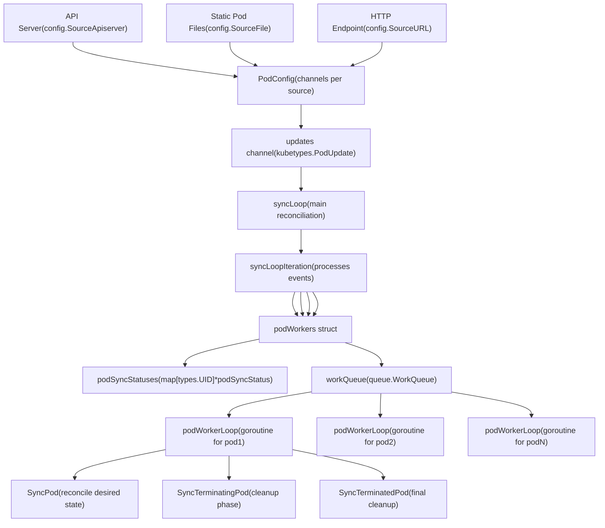
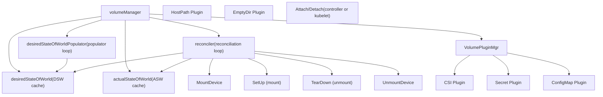
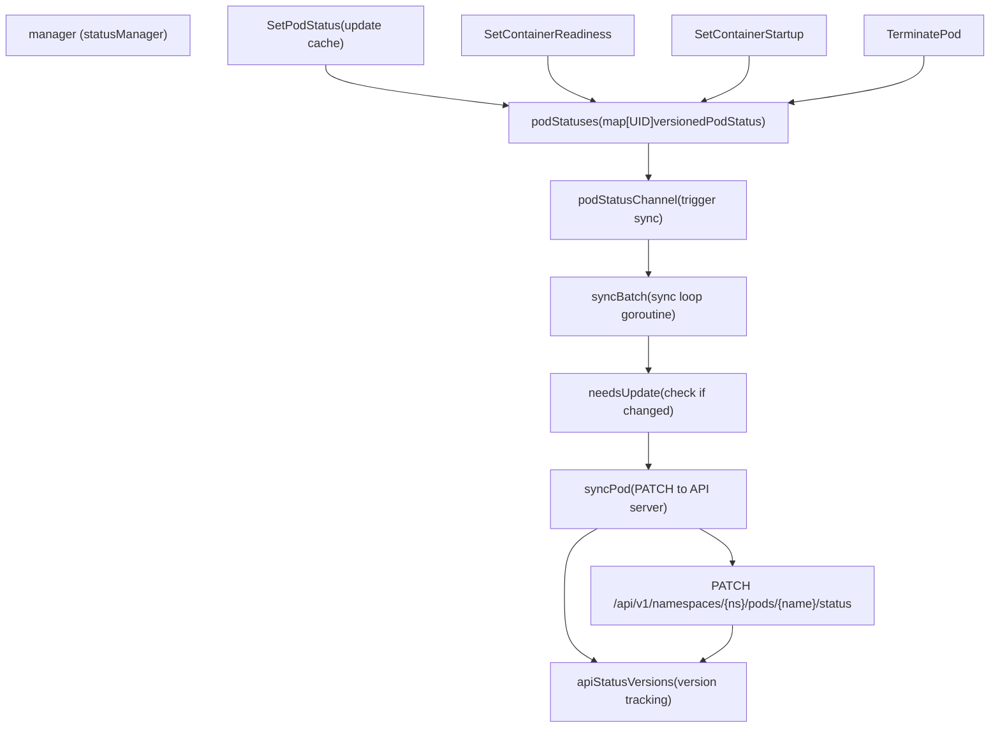
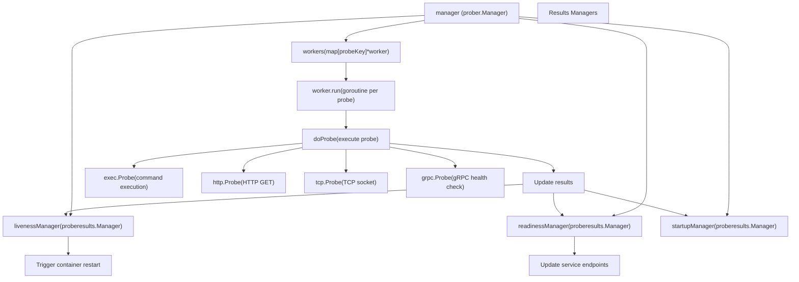
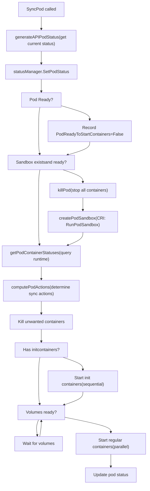
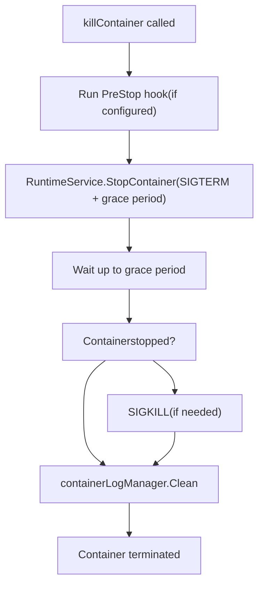
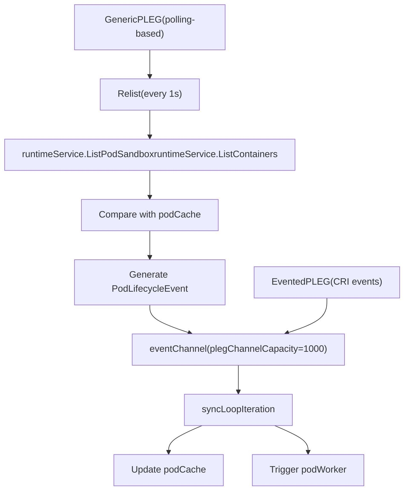

# Kubelet Architecture

Relevant source files

-   [cmd/kubelet/app/server.go](https://github.com/kubernetes/kubernetes/blob/2757a872/cmd/kubelet/app/server.go)
-   [pkg/kubelet/allocation/allocation\_manager.go](https://github.com/kubernetes/kubernetes/blob/2757a872/pkg/kubelet/allocation/allocation_manager.go)
-   [pkg/kubelet/allocation/allocation\_manager\_test.go](https://github.com/kubernetes/kubernetes/blob/2757a872/pkg/kubelet/allocation/allocation_manager_test.go)
-   [pkg/kubelet/allocation/features\_linux.go](https://github.com/kubernetes/kubernetes/blob/2757a872/pkg/kubelet/allocation/features_linux.go)
-   [pkg/kubelet/allocation/features\_unsupported.go](https://github.com/kubernetes/kubernetes/blob/2757a872/pkg/kubelet/allocation/features_unsupported.go)
-   [pkg/kubelet/allocation/features\_windows.go](https://github.com/kubernetes/kubernetes/blob/2757a872/pkg/kubelet/allocation/features_windows.go)
-   [pkg/kubelet/allocation/state/checkpoint.go](https://github.com/kubernetes/kubernetes/blob/2757a872/pkg/kubelet/allocation/state/checkpoint.go)
-   [pkg/kubelet/allocation/state/state.go](https://github.com/kubernetes/kubernetes/blob/2757a872/pkg/kubelet/allocation/state/state.go)
-   [pkg/kubelet/allocation/state/state\_checkpoint.go](https://github.com/kubernetes/kubernetes/blob/2757a872/pkg/kubelet/allocation/state/state_checkpoint.go)
-   [pkg/kubelet/allocation/state/state\_checkpoint\_test.go](https://github.com/kubernetes/kubernetes/blob/2757a872/pkg/kubelet/allocation/state/state_checkpoint_test.go)
-   [pkg/kubelet/allocation/state/state\_mem.go](https://github.com/kubernetes/kubernetes/blob/2757a872/pkg/kubelet/allocation/state/state_mem.go)
-   [pkg/kubelet/container/helpers.go](https://github.com/kubernetes/kubernetes/blob/2757a872/pkg/kubelet/container/helpers.go)
-   [pkg/kubelet/container/helpers\_test.go](https://github.com/kubernetes/kubernetes/blob/2757a872/pkg/kubelet/container/helpers_test.go)
-   [pkg/kubelet/container/runtime.go](https://github.com/kubernetes/kubernetes/blob/2757a872/pkg/kubelet/container/runtime.go)
-   [pkg/kubelet/container/testing/fake\_cache.go](https://github.com/kubernetes/kubernetes/blob/2757a872/pkg/kubelet/container/testing/fake_cache.go)
-   [pkg/kubelet/container/testing/fake\_runtime.go](https://github.com/kubernetes/kubernetes/blob/2757a872/pkg/kubelet/container/testing/fake_runtime.go)
-   [pkg/kubelet/container/testing/fake\_runtime\_helper.go](https://github.com/kubernetes/kubernetes/blob/2757a872/pkg/kubelet/container/testing/fake_runtime_helper.go)
-   [pkg/kubelet/container/testing/mocks.go](https://github.com/kubernetes/kubernetes/blob/2757a872/pkg/kubelet/container/testing/mocks.go)
-   [pkg/kubelet/images/helpers.go](https://github.com/kubernetes/kubernetes/blob/2757a872/pkg/kubelet/images/helpers.go)
-   [pkg/kubelet/images/image\_manager.go](https://github.com/kubernetes/kubernetes/blob/2757a872/pkg/kubelet/images/image_manager.go)
-   [pkg/kubelet/images/image\_manager\_test.go](https://github.com/kubernetes/kubernetes/blob/2757a872/pkg/kubelet/images/image_manager_test.go)
-   [pkg/kubelet/images/puller.go](https://github.com/kubernetes/kubernetes/blob/2757a872/pkg/kubelet/images/puller.go)
-   [pkg/kubelet/images/types.go](https://github.com/kubernetes/kubernetes/blob/2757a872/pkg/kubelet/images/types.go)
-   [pkg/kubelet/kubelet.go](https://github.com/kubernetes/kubernetes/blob/2757a872/pkg/kubelet/kubelet.go)
-   [pkg/kubelet/kubelet\_node\_status.go](https://github.com/kubernetes/kubernetes/blob/2757a872/pkg/kubelet/kubelet_node_status.go)
-   [pkg/kubelet/kubelet\_node\_status\_test.go](https://github.com/kubernetes/kubernetes/blob/2757a872/pkg/kubelet/kubelet_node_status_test.go)
-   [pkg/kubelet/kubelet\_pods.go](https://github.com/kubernetes/kubernetes/blob/2757a872/pkg/kubelet/kubelet_pods.go)
-   [pkg/kubelet/kubelet\_pods\_test.go](https://github.com/kubernetes/kubernetes/blob/2757a872/pkg/kubelet/kubelet_pods_test.go)
-   [pkg/kubelet/kubelet\_test.go](https://github.com/kubernetes/kubernetes/blob/2757a872/pkg/kubelet/kubelet_test.go)
-   [pkg/kubelet/kubelet\_volumes.go](https://github.com/kubernetes/kubernetes/blob/2757a872/pkg/kubelet/kubelet_volumes.go)
-   [pkg/kubelet/kubelet\_volumes\_linux\_test.go](https://github.com/kubernetes/kubernetes/blob/2757a872/pkg/kubelet/kubelet_volumes_linux_test.go)
-   [pkg/kubelet/kubelet\_volumes\_test.go](https://github.com/kubernetes/kubernetes/blob/2757a872/pkg/kubelet/kubelet_volumes_test.go)
-   [pkg/kubelet/kuberuntime/convert.go](https://github.com/kubernetes/kubernetes/blob/2757a872/pkg/kubelet/kuberuntime/convert.go)
-   [pkg/kubelet/kuberuntime/convert\_test.go](https://github.com/kubernetes/kubernetes/blob/2757a872/pkg/kubelet/kuberuntime/convert_test.go)
-   [pkg/kubelet/kuberuntime/helpers.go](https://github.com/kubernetes/kubernetes/blob/2757a872/pkg/kubelet/kuberuntime/helpers.go)
-   [pkg/kubelet/kuberuntime/helpers\_test.go](https://github.com/kubernetes/kubernetes/blob/2757a872/pkg/kubelet/kuberuntime/helpers_test.go)
-   [pkg/kubelet/kuberuntime/kuberuntime\_container.go](https://github.com/kubernetes/kubernetes/blob/2757a872/pkg/kubelet/kuberuntime/kuberuntime_container.go)
-   [pkg/kubelet/kuberuntime/kuberuntime\_container\_test.go](https://github.com/kubernetes/kubernetes/blob/2757a872/pkg/kubelet/kuberuntime/kuberuntime_container_test.go)
-   [pkg/kubelet/kuberuntime/kuberuntime\_gc.go](https://github.com/kubernetes/kubernetes/blob/2757a872/pkg/kubelet/kuberuntime/kuberuntime_gc.go)
-   [pkg/kubelet/kuberuntime/kuberuntime\_gc\_test.go](https://github.com/kubernetes/kubernetes/blob/2757a872/pkg/kubelet/kuberuntime/kuberuntime_gc_test.go)
-   [pkg/kubelet/kuberuntime/kuberuntime\_image.go](https://github.com/kubernetes/kubernetes/blob/2757a872/pkg/kubelet/kuberuntime/kuberuntime_image.go)
-   [pkg/kubelet/kuberuntime/kuberuntime\_image\_test.go](https://github.com/kubernetes/kubernetes/blob/2757a872/pkg/kubelet/kuberuntime/kuberuntime_image_test.go)
-   [pkg/kubelet/kuberuntime/kuberuntime\_manager.go](https://github.com/kubernetes/kubernetes/blob/2757a872/pkg/kubelet/kuberuntime/kuberuntime_manager.go)
-   [pkg/kubelet/kuberuntime/kuberuntime\_manager\_test.go](https://github.com/kubernetes/kubernetes/blob/2757a872/pkg/kubelet/kuberuntime/kuberuntime_manager_test.go)
-   [pkg/kubelet/kuberuntime/kuberuntime\_sandbox.go](https://github.com/kubernetes/kubernetes/blob/2757a872/pkg/kubelet/kuberuntime/kuberuntime_sandbox.go)
-   [pkg/kubelet/kuberuntime/kuberuntime\_sandbox\_test.go](https://github.com/kubernetes/kubernetes/blob/2757a872/pkg/kubelet/kuberuntime/kuberuntime_sandbox_test.go)
-   [pkg/kubelet/kuberuntime/labels.go](https://github.com/kubernetes/kubernetes/blob/2757a872/pkg/kubelet/kuberuntime/labels.go)
-   [pkg/kubelet/kuberuntime/labels\_test.go](https://github.com/kubernetes/kubernetes/blob/2757a872/pkg/kubelet/kuberuntime/labels_test.go)
-   [pkg/kubelet/kuberuntime/security\_context.go](https://github.com/kubernetes/kubernetes/blob/2757a872/pkg/kubelet/kuberuntime/security_context.go)
-   [pkg/kubelet/kuberuntime/util/util.go](https://github.com/kubernetes/kubernetes/blob/2757a872/pkg/kubelet/kuberuntime/util/util.go)
-   [pkg/kubelet/kuberuntime/util/util\_test.go](https://github.com/kubernetes/kubernetes/blob/2757a872/pkg/kubelet/kuberuntime/util/util_test.go)
-   [pkg/kubelet/nodestatus/setters.go](https://github.com/kubernetes/kubernetes/blob/2757a872/pkg/kubelet/nodestatus/setters.go)
-   [pkg/kubelet/nodestatus/setters\_test.go](https://github.com/kubernetes/kubernetes/blob/2757a872/pkg/kubelet/nodestatus/setters_test.go)
-   [pkg/kubelet/pod\_workers.go](https://github.com/kubernetes/kubernetes/blob/2757a872/pkg/kubelet/pod_workers.go)
-   [pkg/kubelet/pod\_workers\_test.go](https://github.com/kubernetes/kubernetes/blob/2757a872/pkg/kubelet/pod_workers_test.go)
-   [pkg/kubelet/prober/common\_test.go](https://github.com/kubernetes/kubernetes/blob/2757a872/pkg/kubelet/prober/common_test.go)
-   [pkg/kubelet/prober/prober.go](https://github.com/kubernetes/kubernetes/blob/2757a872/pkg/kubelet/prober/prober.go)
-   [pkg/kubelet/prober/prober\_manager.go](https://github.com/kubernetes/kubernetes/blob/2757a872/pkg/kubelet/prober/prober_manager.go)
-   [pkg/kubelet/prober/prober\_manager\_test.go](https://github.com/kubernetes/kubernetes/blob/2757a872/pkg/kubelet/prober/prober_manager_test.go)
-   [pkg/kubelet/prober/prober\_test.go](https://github.com/kubernetes/kubernetes/blob/2757a872/pkg/kubelet/prober/prober_test.go)
-   [pkg/kubelet/prober/worker.go](https://github.com/kubernetes/kubernetes/blob/2757a872/pkg/kubelet/prober/worker.go)
-   [pkg/kubelet/prober/worker\_test.go](https://github.com/kubernetes/kubernetes/blob/2757a872/pkg/kubelet/prober/worker_test.go)
-   [pkg/kubelet/status/status\_manager.go](https://github.com/kubernetes/kubernetes/blob/2757a872/pkg/kubelet/status/status_manager.go)
-   [pkg/kubelet/status/status\_manager\_test.go](https://github.com/kubernetes/kubernetes/blob/2757a872/pkg/kubelet/status/status_manager_test.go)
-   [pkg/kubelet/types/doc.go](https://github.com/kubernetes/kubernetes/blob/2757a872/pkg/kubelet/types/doc.go)
-   [staging/src/k8s.io/cri-api/pkg/errors/doc.go](https://github.com/kubernetes/kubernetes/blob/2757a872/staging/src/k8s.io/cri-api/pkg/errors/doc.go)
-   [staging/src/k8s.io/cri-api/pkg/errors/errors.go](https://github.com/kubernetes/kubernetes/blob/2757a872/staging/src/k8s.io/cri-api/pkg/errors/errors.go)
-   [staging/src/k8s.io/cri-api/pkg/errors/errors\_test.go](https://github.com/kubernetes/kubernetes/blob/2757a872/staging/src/k8s.io/cri-api/pkg/errors/errors_test.go)

## Purpose and Scope

This document describes the internal architecture of the kubelet, the primary node agent responsible for managing pod lifecycle on worker nodes. It covers kubelet initialization, core subsystems (pod workers, container runtime integration, volume management, status reporting, and health probing), and the pod reconciliation loop. For information about the Container Runtime Interface (CRI) specification itself, see external CRI documentation. For cluster-level scheduling decisions, see [Scheduler](/kubernetes/kubernetes/3.2-scheduler). For network proxy configuration, see [Kube-proxy and Service Networking](/kubernetes/kubernetes/4.2-kube-proxy-and-service-networking).

**Sources:** [pkg/kubelet/kubelet.go1-650](https://github.com/kubernetes/kubernetes/blob/2757a872/pkg/kubelet/kubelet.go#L1-L650)

---

## Kubelet Initialization and Main Components

The kubelet is initialized through `NewMainKubelet` and runs via the `Run` method. The main `Kubelet` struct contains all core subsystems required for pod lifecycle management.

### Kubelet Struct Overview

```mermaid
flowchart TD
    DNSConfigurer["dnsConfigurer(dns.Configurer)"]
    SecretManager["secretManager(secret.Manager)"]
    ConfigMapManager["configMapManager(configmap.Manager)"]
    Kubelet["Kubelet(main struct)"]
    PodWorkers["podWorkers(pod goroutine manager)"]
    ContainerRuntime["containerRuntime(KubeGenericRuntime)"]
    VolumeManager["volumeManager(VolumeManager)"]
    StatusManager["statusManager(Manager)"]
    ProbeManager["probeManager(Manager)"]
    ContainerManager["containerManager(ContainerManager)"]
    WorkQueue["workQueue(BasicWorkQueue)"]
    PodCache["podCache(container cache)"]
    RuntimeCache["runtimeCache(RuntimeCache)"]
    ImageManager["imageManager(ImageGCManager)"]
    LivenessManager["livenessManager(proberesults.Manager)"]
    ReadinessManager["readinessManager(proberesults.Manager)"]
    StartupManager["startupManager(proberesults.Manager)"]
    AllocationManager["allocationManager(Manager)"]
    EvictionManager["evictionManager(Manager)"]
    VolumePluginMgr["volumePluginMgr(VolumePluginMgr)"]
    ContainerGC["containerGC(ContainerGC)"]
    PodManager["podManager(BasicPodManager)"]

    Kubelet --> PodWorkers
    Kubelet --> ContainerRuntime
    Kubelet --> VolumeManager
    Kubelet --> StatusManager
    Kubelet --> ProbeManager
    Kubelet --> ContainerManager
    PodWorkers --> WorkQueue
    PodWorkers --> PodCache
    ContainerRuntime --> RuntimeCache
    ContainerRuntime --> ImageManager
    ProbeManager --> LivenessManager
    ProbeManager --> ReadinessManager
    ProbeManager --> StartupManager
```

**Sources:** [pkg/kubelet/kubelet.go150-276](https://github.com/kubernetes/kubernetes/blob/2757a872/pkg/kubelet/kubelet.go#L150-L276) [pkg/kubelet/kubelet.go421-806](https://github.com/kubernetes/kubernetes/blob/2757a872/pkg/kubelet/kubelet.go#L421-L806)

### Initialization Flow

The kubelet initialization occurs in the following sequence:

| Phase | Function | Responsibilities |
| --- | --- | --- |
| **1\. Pre-Init** | `PreInitRuntimeService` | Initialize remote runtime and image services via CRI |
| **2\. Main Construction** | `NewMainKubelet` | Construct Kubelet struct with all subsystems |
| **3\. Dependency Setup** | `UnsecuredDependencies` | Create volume plugins, mounter, OOM adjuster |
| **4\. Runtime Execution** | `Run` | Start all background goroutines and sync loops |

> **[Mermaid sequence]**
> *(图表结构无法解析)*

**Sources:** [cmd/kubelet/app/server.go401-419](https://github.com/kubernetes/kubernetes/blob/2757a872/cmd/kubelet/app/server.go#L401-L419) [pkg/kubelet/kubelet.go421-806](https://github.com/kubernetes/kubernetes/blob/2757a872/pkg/kubelet/kubelet.go#L421-L806) [cmd/kubelet/app/server.go535-553](https://github.com/kubernetes/kubernetes/blob/2757a872/cmd/kubelet/app/server.go#L535-L553) [pkg/kubelet/kubelet.go1278-1418](https://github.com/kubernetes/kubernetes/blob/2757a872/pkg/kubelet/kubelet.go#L1278-L1418)

---

## Core Subsystems

### Pod Workers and Sync Loop

The pod workers subsystem manages per-pod goroutines that handle pod lifecycle operations. Each pod has a dedicated worker that processes updates sequentially.

#### PodWorkers Architecture

**Sources:** [pkg/kubelet/pod\_workers.go149-263](https://github.com/kubernetes/kubernetes/blob/2757a872/pkg/kubelet/pod_workers.go#L149-L263) [pkg/kubelet/kubelet.go1693-1832](https://github.com/kubernetes/kubernetes/blob/2757a872/pkg/kubelet/kubelet.go#L1693-L1832) [pkg/kubelet/pod\_workers.go726-1017](https://github.com/kubernetes/kubernetes/blob/2757a872/pkg/kubelet/pod_workers.go#L726-L1017)

#### Pod Worker States

The pod workers track pods through the following states:

| State | Description | Next Possible States |
| --- | --- | --- |
| `SyncPod` | Pod is being actively reconciled | `SyncTerminatingPod`, `SyncTerminatingRuntimePod` |
| `SyncTerminatingPod` | Pod is terminating, grace period active | `SyncTerminatedPod` |
| `SyncTerminatingRuntimePod` | Pod deleted but containers still running | `SyncTerminatedPod` |
| `SyncTerminatedPod` | Final cleanup, all containers stopped | Terminal state |

**Sources:** [pkg/kubelet/pod\_workers.go82-147](https://github.com/kubernetes/kubernetes/blob/2757a872/pkg/kubelet/pod_workers.go#L82-L147)

### Container Runtime Integration

The kubelet interacts with container runtimes through the Container Runtime Interface (CRI). The `kubeGenericRuntimeManager` implements this integration.

#### KubeGenericRuntimeManager Components

```mermaid
flowchart TD
    KGRM["kubeGenericRuntimeManager"]
    RuntimeService["runtimeService(internalapi.RuntimeService)"]
    ImageService["imageService(internalapi.ImageManagerService)"]
    ImagePuller["imagePuller(ImageManager)"]
    Runner["runner(lifecycle.HandlerRunner)"]
    ContainerGC["containerGC(containerGC)"]
    VersionCache["versionCache(ObjectCache)"]
    LogManager["logManager(ContainerLogManager)"]
    RuntimeClassManager["runtimeClassManager(runtimeclass.Manager)"]
    CreateContainer["CreateContainer"]
    StartContainer["StartContainer"]
    StopContainer["StopContainer"]
    RemoveContainer["RemoveContainer"]
    RunPodSandbox["RunPodSandbox"]
    StopPodSandbox["StopPodSandbox"]
    RemovePodSandbox["RemovePodSandbox"]
    PullImage["PullImage"]
    ListImages["ListImages"]
    StartContainerFunc["startContainer(pull, create, start)"]
    KillContainer["killContainer(stop with grace period)"]
    PruneInitContainers["pruneInitContainers"]
    ComputePodActions["computePodActions(determine what needs sync)"]

    KGRM --> RuntimeService
    KGRM --> ImageService
    KGRM --> ImagePuller
    KGRM --> Runner
    KGRM --> ContainerGC
    RuntimeService --> CreateContainer
    RuntimeService --> StartContainer
    RuntimeService --> StopContainer
    RuntimeService --> RunPodSandbox
    ImageService --> PullImage
    ImageService --> ListImages
    StartContainerFunc --> PullImage
    StartContainerFunc --> CreateContainer
    StartContainerFunc --> StartContainer
```

**Sources:** [pkg/kubelet/kuberuntime/kuberuntime\_manager.go109-194](https://github.com/kubernetes/kubernetes/blob/2757a872/pkg/kubelet/kuberuntime/kuberuntime_manager.go#L109-L194) [pkg/kubelet/kuberuntime/kuberuntime\_manager.go203-367](https://github.com/kubernetes/kubernetes/blob/2757a872/pkg/kubelet/kuberuntime/kuberuntime_manager.go#L203-L367) [pkg/kubelet/kuberuntime/kuberuntime\_container.go193-352](https://github.com/kubernetes/kubernetes/blob/2757a872/pkg/kubelet/kuberuntime/kuberuntime_container.go#L193-L352)

### Volume Management

The `volumeManager` handles mounting and unmounting volumes for pods. It runs two reconciliation loops: one for desired state and one for actual state.

**Sources:** [pkg/kubelet/kubelet.go436-451](https://github.com/kubernetes/kubernetes/blob/2757a872/pkg/kubelet/kubelet.go#L436-L451) [pkg/kubelet/kubelet\_volumes.go1-286](https://github.com/kubernetes/kubernetes/blob/2757a872/pkg/kubelet/kubelet_volumes.go#L1-L286)

### Status Management

The `statusManager` maintains pod status cache and syncs status updates to the API server.

#### Status Manager Architecture

**Sources:** [pkg/kubelet/status/status\_manager.go66-82](https://github.com/kubernetes/kubernetes/blob/2757a872/pkg/kubelet/status/status_manager.go#L66-L82) [pkg/kubelet/status/status\_manager.go289-402](https://github.com/kubernetes/kubernetes/blob/2757a872/pkg/kubelet/status/status_manager.go#L289-L402) [pkg/kubelet/status/status\_manager.go526-699](https://github.com/kubernetes/kubernetes/blob/2757a872/pkg/kubelet/status/status_manager.go#L526-L699)

### Probe Management

The probe manager runs liveness, readiness, and startup probes for containers.

**Sources:** [pkg/kubelet/prober/worker.go50-78](https://github.com/kubernetes/kubernetes/blob/2757a872/pkg/kubelet/prober/worker.go#L50-L78) [pkg/kubelet/prober/worker.go103-254](https://github.com/kubernetes/kubernetes/blob/2757a872/pkg/kubelet/prober/worker.go#L103-L254) [pkg/kubelet/prober/prober.go42-150](https://github.com/kubernetes/kubernetes/blob/2757a872/pkg/kubelet/prober/prober.go#L42-L150)

---

## Pod Lifecycle Management

### SyncPod Reconciliation

The `SyncPod` function is the core reconciliation loop that brings a pod's actual state in line with its desired state.

#### SyncPod Flow

**Sources:** [pkg/kubelet/kubelet.go1536-1691](https://github.com/kubernetes/kubernetes/blob/2757a872/pkg/kubelet/kubelet.go#L1536-L1691) [pkg/kubelet/kubelet\_pods.go1065-1328](https://github.com/kubernetes/kubernetes/blob/2757a872/pkg/kubelet/kubelet_pods.go#L1065-L1328)

#### ComputePodActions

The `computePodActions` function determines what needs to be synced by comparing desired and actual state:

| Action | Condition | Result |
| --- | --- | --- |
| `KillPod` | Sandbox not ready or config changed | All containers stopped |
| `CreateSandbox` | No sandbox exists | New sandbox created |
| `ContainersToKill` | Container failed, spec changed, or liveness failed | Specific containers stopped |
| `ContainersToStart` | Container not running but should be | Containers started |
| `InitContainersToStart` | Init container pending | Init containers started |

**Sources:** [pkg/kubelet/kuberuntime/kuberuntime\_manager.go699-897](https://github.com/kubernetes/kubernetes/blob/2757a872/pkg/kubelet/kuberuntime/kuberuntime_manager.go#L699-L897)

### Container Lifecycle Operations

#### startContainer Sequence

> **[Mermaid sequence]**
> *(图表结构无法解析)*

**Sources:** [pkg/kubelet/kuberuntime/kuberuntime\_container.go193-352](https://github.com/kubernetes/kubernetes/blob/2757a872/pkg/kubelet/kuberuntime/kuberuntime_container.go#L193-L352)

#### killContainer Flow

Container termination follows these steps:

1.  **Graceful Shutdown Period**: Send SIGTERM and wait for `TerminationGracePeriodSeconds`
2.  **PreStop Hook**: Execute lifecycle.PreStop hook (if defined)
3.  **Force Kill**: Send SIGKILL if grace period expires
4.  **Container Removal**: Remove container from runtime

**Sources:** [pkg/kubelet/kuberuntime/kuberuntime\_container.go573-731](https://github.com/kubernetes/kubernetes/blob/2757a872/pkg/kubelet/kuberuntime/kuberuntime_container.go#L573-L731)

---

## Configuration and Dependencies

### Kubelet Configuration

The kubelet is configured through:

1.  **Command-line flags** (via `KubeletFlags`)
2.  **Configuration file** (`KubeletConfiguration` YAML/JSON)
3.  **Drop-in configuration directory** (merged in lexical order)

Configuration precedence: CLI flags > config file > defaults.

**Sources:** [cmd/kubelet/app/server.go138-326](https://github.com/kubernetes/kubernetes/blob/2757a872/cmd/kubelet/app/server.go#L138-L326) [cmd/kubelet/app/server.go421-448](https://github.com/kubernetes/kubernetes/blob/2757a872/cmd/kubelet/app/server.go#L421-L448)

### Dependencies Injection

The `Dependencies` struct groups injected dependencies:

| Dependency | Type | Purpose |
| --- | --- | --- |
| `RemoteRuntimeService` | `internalapi.RuntimeService` | CRI runtime client |
| `RemoteImageService` | `internalapi.ImageManagerService` | CRI image client |
| `CAdvisorInterface` | `cadvisor.Interface` | Container metrics |
| `ContainerManager` | `cm.ContainerManager` | Cgroup management |
| `VolumePlugins` | `[]volume.VolumePlugin` | Volume plugin implementations |
| `Mounter` | `mount.Interface` | Filesystem mounting |
| `ProbeManager` | `prober.Manager` | Container health probing |
| `TracerProvider` | `trace.TracerProvider` | OpenTelemetry tracing |

**Sources:** [pkg/kubelet/kubelet.go308-343](https://github.com/kubernetes/kubernetes/blob/2757a872/pkg/kubelet/kubelet.go#L308-L343) [cmd/kubelet/app/server.go495-533](https://github.com/kubernetes/kubernetes/blob/2757a872/cmd/kubelet/app/server.go#L495-L533)

### Main Sync Loops

The kubelet runs several goroutines for background operations:

| Loop | Function | Period | Purpose |
| --- | --- | --- | --- |
| **Main sync loop** | `syncLoop` | Continuous (event-driven) | Process pod updates from all sources |
| **Housekeeping** | `HandlePodCleanups` | `housekeepingPeriod` (2s) | Clean up orphaned pods and mirrors |
| **PLEG** | `pleg.Relist` | `genericPlegRelistPeriod` (1s) | Detect container state changes |
| **Status sync** | `statusManager.Start` | Continuous (event-driven) | Sync pod status to API server |
| **Node status** | `syncNodeStatus` | `nodeStatusUpdateFrequency` (10s) | Update node status and heartbeat |
| **Volume reconciler** | `volumeManager.Run` | Continuous | Mount/unmount volumes |
| **Probe workers** | `probeManager.Start` | Per-probe period | Execute health checks |
| **Container GC** | `containerGC.GarbageCollect` | `ContainerGCPeriod` (1m) | Remove dead containers |
| **Image GC** | `imageManager.GarbageCollect` | `ImageGCPeriod` (5m) | Remove unused images |

**Sources:** [pkg/kubelet/kubelet.go1278-1418](https://github.com/kubernetes/kubernetes/blob/2757a872/pkg/kubelet/kubelet.go#L1278-L1418) [pkg/kubelet/kubelet.go2154-2188](https://github.com/kubernetes/kubernetes/blob/2757a872/pkg/kubelet/kubelet.go#L2154-L2188)

### PLEG (Pod Lifecycle Event Generator)

PLEG detects container lifecycle events by periodically relisting containers and comparing with cached state:

**Sources:** [pkg/kubelet/kubelet.go847-874](https://github.com/kubernetes/kubernetes/blob/2757a872/pkg/kubelet/kubelet.go#L847-L874) [pkg/kubelet/kubelet.go1693-1832](https://github.com/kubernetes/kubernetes/blob/2757a872/pkg/kubelet/kubelet.go#L1693-L1832)

---

## Summary

The kubelet architecture consists of several coordinated subsystems:

1.  **Pod Workers**: Manage per-pod goroutines that execute `SyncPod` reconciliation
2.  **Container Runtime Manager**: Implement CRI integration for container lifecycle operations
3.  **Volume Manager**: Handle volume mount/unmount with desired vs. actual state reconciliation
4.  **Status Manager**: Cache and sync pod status to the API server
5.  **Probe Manager**: Execute health checks (liveness, readiness, startup)
6.  **PLEG**: Detect container state changes and generate lifecycle events

The main reconciliation happens in `SyncPod`, which creates sandboxes, starts containers, mounts volumes, and maintains pod state according to the desired specification.

**Sources:** [pkg/kubelet/kubelet.go1-2500](https://github.com/kubernetes/kubernetes/blob/2757a872/pkg/kubelet/kubelet.go#L1-L2500) [pkg/kubelet/pod\_workers.go1-1200](https://github.com/kubernetes/kubernetes/blob/2757a872/pkg/kubelet/pod_workers.go#L1-L1200) [pkg/kubelet/kuberuntime/kuberuntime\_manager.go1-800](https://github.com/kubernetes/kubernetes/blob/2757a872/pkg/kubelet/kuberuntime/kuberuntime_manager.go#L1-L800)
