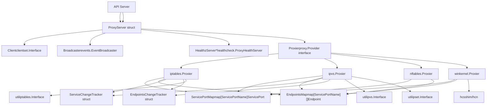
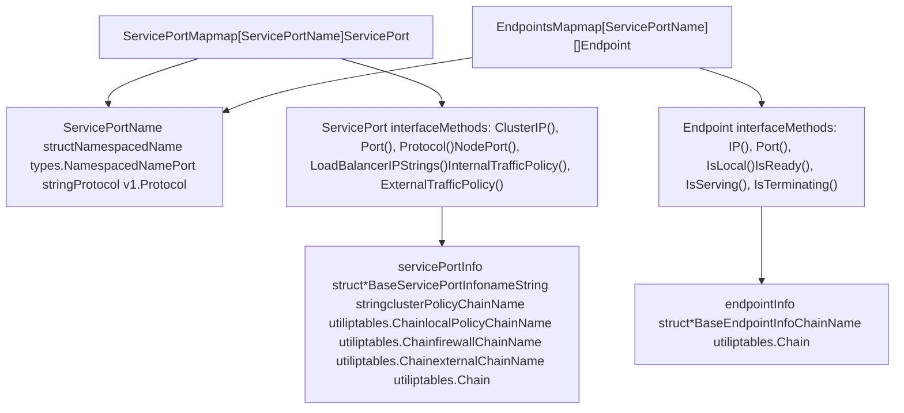
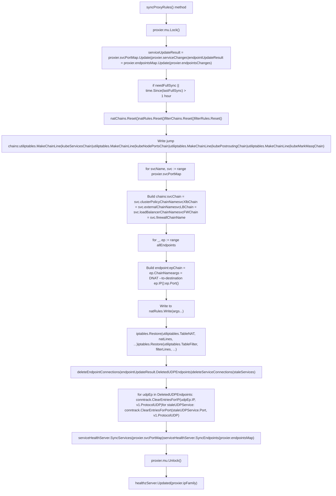

# Kube-proxy and Service Networking

Relevant source files

-   [cmd/kube-proxy/app/options.go](https://github.com/kubernetes/kubernetes/blob/2757a872/cmd/kube-proxy/app/options.go)
-   [cmd/kube-proxy/app/options\_test.go](https://github.com/kubernetes/kubernetes/blob/2757a872/cmd/kube-proxy/app/options_test.go)
-   [cmd/kube-proxy/app/server.go](https://github.com/kubernetes/kubernetes/blob/2757a872/cmd/kube-proxy/app/server.go)
-   [cmd/kube-proxy/app/server\_linux.go](https://github.com/kubernetes/kubernetes/blob/2757a872/cmd/kube-proxy/app/server_linux.go)
-   [cmd/kube-proxy/app/server\_linux\_test.go](https://github.com/kubernetes/kubernetes/blob/2757a872/cmd/kube-proxy/app/server_linux_test.go)
-   [cmd/kube-proxy/app/server\_test.go](https://github.com/kubernetes/kubernetes/blob/2757a872/cmd/kube-proxy/app/server_test.go)
-   [cmd/kube-proxy/app/server\_windows.go](https://github.com/kubernetes/kubernetes/blob/2757a872/cmd/kube-proxy/app/server_windows.go)
-   [cmd/kubemark/hollow-node.go](https://github.com/kubernetes/kubernetes/blob/2757a872/cmd/kubemark/hollow-node.go)
-   [pkg/kubemark/hollow\_kubelet.go](https://github.com/kubernetes/kubernetes/blob/2757a872/pkg/kubemark/hollow_kubelet.go)
-   [pkg/proxy/apis/config/fuzzer/fuzzer.go](https://github.com/kubernetes/kubernetes/blob/2757a872/pkg/proxy/apis/config/fuzzer/fuzzer.go)
-   [pkg/proxy/apis/config/scheme/testdata/KubeProxyConfiguration/after/v1alpha1.yaml](https://github.com/kubernetes/kubernetes/blob/2757a872/pkg/proxy/apis/config/scheme/testdata/KubeProxyConfiguration/after/v1alpha1.yaml)
-   [pkg/proxy/apis/config/scheme/testdata/KubeProxyConfiguration/roundtrip/default/v1alpha1.yaml](https://github.com/kubernetes/kubernetes/blob/2757a872/pkg/proxy/apis/config/scheme/testdata/KubeProxyConfiguration/roundtrip/default/v1alpha1.yaml)
-   [pkg/proxy/apis/config/types.go](https://github.com/kubernetes/kubernetes/blob/2757a872/pkg/proxy/apis/config/types.go)
-   [pkg/proxy/apis/config/v1alpha1/conversion.go](https://github.com/kubernetes/kubernetes/blob/2757a872/pkg/proxy/apis/config/v1alpha1/conversion.go)
-   [pkg/proxy/apis/config/v1alpha1/defaults.go](https://github.com/kubernetes/kubernetes/blob/2757a872/pkg/proxy/apis/config/v1alpha1/defaults.go)
-   [pkg/proxy/apis/config/v1alpha1/defaults\_test.go](https://github.com/kubernetes/kubernetes/blob/2757a872/pkg/proxy/apis/config/v1alpha1/defaults_test.go)
-   [pkg/proxy/apis/config/v1alpha1/zz\_generated.conversion.go](https://github.com/kubernetes/kubernetes/blob/2757a872/pkg/proxy/apis/config/v1alpha1/zz_generated.conversion.go)
-   [pkg/proxy/apis/config/validation/validation.go](https://github.com/kubernetes/kubernetes/blob/2757a872/pkg/proxy/apis/config/validation/validation.go)
-   [pkg/proxy/apis/config/validation/validation\_test.go](https://github.com/kubernetes/kubernetes/blob/2757a872/pkg/proxy/apis/config/validation/validation_test.go)
-   [pkg/proxy/apis/config/zz\_generated.deepcopy.go](https://github.com/kubernetes/kubernetes/blob/2757a872/pkg/proxy/apis/config/zz_generated.deepcopy.go)
-   [pkg/proxy/apis/well\_known\_labels.go](https://github.com/kubernetes/kubernetes/blob/2757a872/pkg/proxy/apis/well_known_labels.go)
-   [pkg/proxy/config/api\_test.go](https://github.com/kubernetes/kubernetes/blob/2757a872/pkg/proxy/config/api_test.go)
-   [pkg/proxy/config/config.go](https://github.com/kubernetes/kubernetes/blob/2757a872/pkg/proxy/config/config.go)
-   [pkg/proxy/config/config\_test.go](https://github.com/kubernetes/kubernetes/blob/2757a872/pkg/proxy/config/config_test.go)
-   [pkg/proxy/endpointschangetracker.go](https://github.com/kubernetes/kubernetes/blob/2757a872/pkg/proxy/endpointschangetracker.go)
-   [pkg/proxy/endpointschangetracker\_test.go](https://github.com/kubernetes/kubernetes/blob/2757a872/pkg/proxy/endpointschangetracker_test.go)
-   [pkg/proxy/endpointslicecache.go](https://github.com/kubernetes/kubernetes/blob/2757a872/pkg/proxy/endpointslicecache.go)
-   [pkg/proxy/endpointslicecache\_test.go](https://github.com/kubernetes/kubernetes/blob/2757a872/pkg/proxy/endpointslicecache_test.go)
-   [pkg/proxy/healthcheck/common.go](https://github.com/kubernetes/kubernetes/blob/2757a872/pkg/proxy/healthcheck/common.go)
-   [pkg/proxy/healthcheck/healthcheck\_test.go](https://github.com/kubernetes/kubernetes/blob/2757a872/pkg/proxy/healthcheck/healthcheck_test.go)
-   [pkg/proxy/healthcheck/proxy\_health.go](https://github.com/kubernetes/kubernetes/blob/2757a872/pkg/proxy/healthcheck/proxy_health.go)
-   [pkg/proxy/healthcheck/service\_health.go](https://github.com/kubernetes/kubernetes/blob/2757a872/pkg/proxy/healthcheck/service_health.go)
-   [pkg/proxy/iptables/proxier.go](https://github.com/kubernetes/kubernetes/blob/2757a872/pkg/proxy/iptables/proxier.go)
-   [pkg/proxy/iptables/proxier\_test.go](https://github.com/kubernetes/kubernetes/blob/2757a872/pkg/proxy/iptables/proxier_test.go)
-   [pkg/proxy/ipvs/proxier.go](https://github.com/kubernetes/kubernetes/blob/2757a872/pkg/proxy/ipvs/proxier.go)
-   [pkg/proxy/ipvs/proxier\_test.go](https://github.com/kubernetes/kubernetes/blob/2757a872/pkg/proxy/ipvs/proxier_test.go)
-   [pkg/proxy/kubemark/hollow\_proxy.go](https://github.com/kubernetes/kubernetes/blob/2757a872/pkg/proxy/kubemark/hollow_proxy.go)
-   [pkg/proxy/metaproxier/meta\_proxier.go](https://github.com/kubernetes/kubernetes/blob/2757a872/pkg/proxy/metaproxier/meta_proxier.go)
-   [pkg/proxy/metrics/metrics.go](https://github.com/kubernetes/kubernetes/blob/2757a872/pkg/proxy/metrics/metrics.go)
-   [pkg/proxy/nftables/README.md](https://github.com/kubernetes/kubernetes/blob/2757a872/pkg/proxy/nftables/README.md?plain=1)
-   [pkg/proxy/nftables/helpers\_test.go](https://github.com/kubernetes/kubernetes/blob/2757a872/pkg/proxy/nftables/helpers_test.go)
-   [pkg/proxy/nftables/proxier.go](https://github.com/kubernetes/kubernetes/blob/2757a872/pkg/proxy/nftables/proxier.go)
-   [pkg/proxy/nftables/proxier\_test.go](https://github.com/kubernetes/kubernetes/blob/2757a872/pkg/proxy/nftables/proxier_test.go)
-   [pkg/proxy/node.go](https://github.com/kubernetes/kubernetes/blob/2757a872/pkg/proxy/node.go)
-   [pkg/proxy/node\_test.go](https://github.com/kubernetes/kubernetes/blob/2757a872/pkg/proxy/node_test.go)
-   [pkg/proxy/servicechangetracker.go](https://github.com/kubernetes/kubernetes/blob/2757a872/pkg/proxy/servicechangetracker.go)
-   [pkg/proxy/servicechangetracker\_test.go](https://github.com/kubernetes/kubernetes/blob/2757a872/pkg/proxy/servicechangetracker_test.go)
-   [pkg/proxy/serviceport.go](https://github.com/kubernetes/kubernetes/blob/2757a872/pkg/proxy/serviceport.go)
-   [pkg/proxy/topology.go](https://github.com/kubernetes/kubernetes/blob/2757a872/pkg/proxy/topology.go)
-   [pkg/proxy/topology\_test.go](https://github.com/kubernetes/kubernetes/blob/2757a872/pkg/proxy/topology_test.go)
-   [pkg/proxy/types.go](https://github.com/kubernetes/kubernetes/blob/2757a872/pkg/proxy/types.go)
-   [pkg/proxy/util/endpoints.go](https://github.com/kubernetes/kubernetes/blob/2757a872/pkg/proxy/util/endpoints.go)
-   [pkg/proxy/util/endpoints\_test.go](https://github.com/kubernetes/kubernetes/blob/2757a872/pkg/proxy/util/endpoints_test.go)
-   [pkg/proxy/util/nodeport\_addresses.go](https://github.com/kubernetes/kubernetes/blob/2757a872/pkg/proxy/util/nodeport_addresses.go)
-   [pkg/proxy/util/nodeport\_addresses\_test.go](https://github.com/kubernetes/kubernetes/blob/2757a872/pkg/proxy/util/nodeport_addresses_test.go)
-   [pkg/proxy/util/utils.go](https://github.com/kubernetes/kubernetes/blob/2757a872/pkg/proxy/util/utils.go)
-   [pkg/proxy/util/utils\_test.go](https://github.com/kubernetes/kubernetes/blob/2757a872/pkg/proxy/util/utils_test.go)
-   [pkg/proxy/winkernel/hcnutils.go](https://github.com/kubernetes/kubernetes/blob/2757a872/pkg/proxy/winkernel/hcnutils.go)
-   [pkg/proxy/winkernel/hns.go](https://github.com/kubernetes/kubernetes/blob/2757a872/pkg/proxy/winkernel/hns.go)
-   [pkg/proxy/winkernel/hns\_test.go](https://github.com/kubernetes/kubernetes/blob/2757a872/pkg/proxy/winkernel/hns_test.go)
-   [pkg/proxy/winkernel/proxier.go](https://github.com/kubernetes/kubernetes/blob/2757a872/pkg/proxy/winkernel/proxier.go)
-   [pkg/proxy/winkernel/proxier\_test.go](https://github.com/kubernetes/kubernetes/blob/2757a872/pkg/proxy/winkernel/proxier_test.go)
-   [pkg/proxy/winkernel/testing/hcnutils\_mock.go](https://github.com/kubernetes/kubernetes/blob/2757a872/pkg/proxy/winkernel/testing/hcnutils_mock.go)
-   [staging/src/k8s.io/kube-proxy/config/v1alpha1/types.go](https://github.com/kubernetes/kubernetes/blob/2757a872/staging/src/k8s.io/kube-proxy/config/v1alpha1/types.go)
-   [staging/src/k8s.io/kube-proxy/config/v1alpha1/zz\_generated.deepcopy.go](https://github.com/kubernetes/kubernetes/blob/2757a872/staging/src/k8s.io/kube-proxy/config/v1alpha1/zz_generated.deepcopy.go)

**Purpose**: This document describes kube-proxy, the component responsible for implementing Kubernetes Service networking on each node. It covers the architecture, backend implementations (iptables, ipvs, nftables, winkernel), service routing mechanisms, and how kube-proxy translates Services and Endpoints into network rules that enable pod-to-service communication.

**Scope**: This page focuses on kube-proxy's internal architecture and networking implementations. For information about kubelet's role on the node, see [4.1](/kubernetes/kubernetes/4.1-kubelet-architecture). For cluster setup and bootstrapping, see [5](/kubernetes/kubernetes/5-cluster-bootstrap-and-management).

---

## Overview

Kube-proxy runs on each node in a Kubernetes cluster and maintains network rules that allow communication to Services from inside or outside the cluster. It watches the API server for Service and EndpointSlice objects and programs the underlying networking subsystem (iptables, ipvs, nftables, or Windows HNS) to route traffic accordingly.

**Key Responsibilities**:

-   Watch Services and EndpointSlices from the API server
-   Translate Service definitions into network rules
-   Implement ClusterIP, NodePort, and LoadBalancer service types
-   Handle traffic policies (internal/external traffic policy)
-   Perform health checking for services with local endpoints
-   Implement connection tracking and masquerading

**Sources**: [cmd/kube-proxy/app/server.go160-178](https://github.com/kubernetes/kubernetes/blob/2757a872/cmd/kube-proxy/app/server.go#L160-L178) [pkg/proxy/iptables/proxier.go133-209](https://github.com/kubernetes/kubernetes/blob/2757a872/pkg/proxy/iptables/proxier.go#L133-L209) [pkg/proxy/ipvs/proxier.go162-249](https://github.com/kubernetes/kubernetes/blob/2757a872/pkg/proxy/ipvs/proxier.go#L162-L249)

---

## Architecture Overview

**Kube-proxy High-Level Architecture with Code Entities**


**Sources**: [cmd/kube-proxy/app/server.go160-178](https://github.com/kubernetes/kubernetes/blob/2757a872/cmd/kube-proxy/app/server.go#L160-L178) [pkg/proxy/iptables/proxier.go133-209](https://github.com/kubernetes/kubernetes/blob/2757a872/pkg/proxy/iptables/proxier.go#L133-L209) [pkg/proxy/ipvs/proxier.go161-249](https://github.com/kubernetes/kubernetes/blob/2757a872/pkg/proxy/ipvs/proxier.go#L161-L249) [pkg/proxy/nftables/proxier.go138-200](https://github.com/kubernetes/kubernetes/blob/2757a872/pkg/proxy/nftables/proxier.go#L138-L200) [pkg/proxy/winkernel/proxier.go](https://github.com/kubernetes/kubernetes/blob/2757a872/pkg/proxy/winkernel/proxier.go)

---

## Backend Implementations

Kube-proxy supports four backend implementations, selectable via the `--proxy-mode` flag:

| Backend | Platform | Description | Primary Use Case |
| --- | --- | --- | --- |
| **iptables** | Linux | Uses netfilter/iptables rules | Default on most Linux distributions |
| **ipvs** | Linux | Uses IPVS (IP Virtual Server) kernel module | High-performance, large clusters |
| **nftables** | Linux | Uses nftables (successor to iptables) | Modern Linux systems |
| **winkernel** | Windows | Uses Windows Host Networking Service (HNS) | Windows nodes |

### iptables Mode

The iptables proxier programs netfilter rules using the iptables command-line tool. It creates custom chains and rules in the `nat` and `filter` tables.

**Key Chains**:

-   `KUBE-SERVICES`: Main entry point for service traffic
-   `KUBE-SVC-*`: Per-service chains for load balancing
-   `KUBE-SEP-*`: Per-endpoint chains for destination NAT
-   `KUBE-NODEPORTS`: Entry point for NodePort traffic
-   `KUBE-MARK-MASQ`: Mark packets for masquerading
-   `KUBE-POSTROUTING`: Apply masquerading to marked packets

**Sources**: [pkg/proxy/iptables/proxier.go54-87](https://github.com/kubernetes/kubernetes/blob/2757a872/pkg/proxy/iptables/proxier.go#L54-L87) [pkg/proxy/iptables/proxier.go377-401](https://github.com/kubernetes/kubernetes/blob/2757a872/pkg/proxy/iptables/proxier.go#L377-L401)

### iptables Proxier Structure

**iptables.Proxier Struct Fields and Dependencies**

```mermaid
flowchart TD
    PROXIER["iptables.Proxier struct"]
    IPFAMILY["ipFamily v1.IPFamily"]
    SVCMAP["svcPortMap proxy.ServicePortMap"]
    EPMAP["endpointsMap proxy.EndpointsMap"]
    SVCCHG["serviceChanges *proxy.ServiceChangeTracker"]
    EPCHG["endpointsChanges *proxy.EndpointsChangeTracker"]
    NEEDFULLSYNC["needFullSync bool"]
    INITIALIZED["initialized int32"]
    IPT["iptables utiliptables.Interface"]
    NATBUF["natChains, natRules proxyutil.LineBuffer"]
    FILTERBUF["filterChains, filterRules proxyutil.LineBuffer"]
    IPTDATA["iptablesData, existingFilterChainsData *bytes.Buffer"]
    CONNTRACK["conntrack conntrack.Interface"]
    HEALTH["serviceHealthServer healthcheck.ServiceHealthServer"]
    HEALTHZ["healthzServer *healthcheck.ProxyHealthServer"]
    LOCALDET["localDetector proxyutil.LocalTrafficDetector"]
    NFACCT["nfacct nfacct.Interface"]
    MASQALL["masqueradeAll bool"]
    MASQMARK["masqueradeMark string"]
    NODEIP["nodeIP net.IP"]
    NODENAME["nodeName string"]
    NODEPORTADDR["nodePortAddresses *proxyutil.NodePortAddresses"]
    LOCALHOST["localhostNodePorts bool"]
    SYNCRUNNER["syncRunner *runner.BoundedFrequencyRunner"]
    SYNCPERIOD["syncPeriod time.Duration"]
    SYNCPROXY["syncProxyRules() method"]

    PROXIER --> IPFAMILY
    PROXIER --> SVCMAP
    PROXIER --> EPMAP
    PROXIER --> SVCCHG
    PROXIER --> EPCHG
    PROXIER --> IPT
    PROXIER --> NATBUF
    PROXIER --> FILTERBUF
    PROXIER --> IPTDATA
    PROXIER --> CONNTRACK
    PROXIER --> HEALTH
    PROXIER --> HEALTHZ
    PROXIER --> LOCALDET
    PROXIER --> NFACCT
    PROXIER --> MASQALL
    PROXIER --> MASQMARK
    PROXIER --> NODEIP
    PROXIER --> NODENAME
    PROXIER --> NODEPORTADDR
    PROXIER --> LOCALHOST
    PROXIER --> SYNCRUNNER
    PROXIER --> SYNCPERIOD
    SVCCHG --> SVCMAP
    EPCHG --> EPMAP
    SYNCRUNNER --> SYNCPROXY
```


**Sources**: [pkg/proxy/iptables/proxier.go133-209](https://github.com/kubernetes/kubernetes/blob/2757a872/pkg/proxy/iptables/proxier.go#L133-L209)

### IPVS Mode

The IPVS proxier uses the Linux kernel's IPVS (IP Virtual Server) module for load balancing. IPVS operates at the transport layer and provides better performance than iptables for large numbers of services.

**Key Components**:

-   Virtual servers (VIPs) for each service IP
-   Real servers (endpoints) behind each virtual server
-   Scheduling algorithms (rr, lc, wrr, etc.)
-   ipset for efficient IP matching
-   iptables for supplementary rules (masquerading, firewalling)

**IPVS Chains and Sets**:

-   `KUBE-SERVICES`: Dispatch to IPVS or iptables
-   `KUBE-NODE-PORT`: NodePort handling
-   `KUBE-LOAD-BALANCER`: LoadBalancer handling
-   `KUBE-MARK-MASQ`: Mark packets for SNAT
-   Various ipsets for efficient matching (e.g., `KUBE-CLUSTER-IP`, `KUBE-NODE-PORT-TCP`)

**Sources**: [pkg/proxy/ipvs/proxier.go58-95](https://github.com/kubernetes/kubernetes/blob/2757a872/pkg/proxy/ipvs/proxier.go#L58-L95) [pkg/proxy/ipvs/proxier.go419-454](https://github.com/kubernetes/kubernetes/blob/2757a872/pkg/proxy/ipvs/proxier.go#L419-L454) [pkg/proxy/ipvs/proxier.go473-496](https://github.com/kubernetes/kubernetes/blob/2757a872/pkg/proxy/ipvs/proxier.go#L473-L496)

### nftables Mode

The nftables proxier is the modern replacement for iptables, using the nftables kernel subsystem. It provides better performance and a more consistent rule structure.

**Key Structures**:

-   Single `kube-proxy` table containing all chains
-   Maps for efficient lookups (service IPs, nodeports, firewall rules)
-   Sets for IP lists (cluster IPs, nodeport IPs)
-   Verdict maps for conditional jumping

**Primary Chains**:

-   `services`: Main service dispatch
-   `service-ips`: Map of service IPs to chains
-   `service-nodeports`: Map of nodeports to chains
-   `mark-for-masquerade`: Mark packets for SNAT
-   `masquerading`: Apply SNAT to marked packets

**Sources**: [pkg/proxy/nftables/proxier.go55-98](https://github.com/kubernetes/kubernetes/blob/2757a872/pkg/proxy/nftables/proxier.go#L55-L98) [pkg/proxy/nftables/proxier.go138-200](https://github.com/kubernetes/kubernetes/blob/2757a872/pkg/proxy/nftables/proxier.go#L138-L200)

### Windows Kernel Mode

The winkernel proxier uses Windows Host Networking Service (HNS) APIs to program Windows networking. It works with both HNS v1 and v2 (HCN).

**Key Concepts**:

-   HNS endpoints represent backend pods
-   HNS load balancers represent services
-   Policies define load balancing behavior
-   DSR (Direct Server Return) support for LoadBalancer services

**Sources**: [pkg/proxy/winkernel/proxier.go54-109](https://github.com/kubernetes/kubernetes/blob/2757a872/pkg/proxy/winkernel/proxier.go#L54-L109) [pkg/proxy/winkernel/proxier.go](https://github.com/kubernetes/kubernetes/blob/2757a872/pkg/proxy/winkernel/proxier.go)

---

## Core Data Structures

### ServicePortMap and EndpointsMap

These are the primary data structures that hold the current state of services and endpoints.

**Core Data Structures with Type Definitions**


**ServicePortName struct** [pkg/proxy/types.go63-80](https://github.com/kubernetes/kubernetes/blob/2757a872/pkg/proxy/types.go#L63-L80): Unique identifier combining:

-   `NamespacedName`: Namespace and service name
-   `Port`: Port name (not number)
-   `Protocol`: v1.Protocol (TCP/UDP/SCTP)

**ServicePort interface** [pkg/proxy/types.go86-135](https://github.com/kubernetes/kubernetes/blob/2757a872/pkg/proxy/types.go#L86-L135) methods:

-   `String()`, `ClusterIP()`, `Port()`, `SessionAffinityType()`, `Protocol()`
-   `LoadBalancerIPStrings()`, `HealthCheckNodePort()`, `NodePort()`
-   `InternalTrafficPolicy()`, `ExternalTrafficPolicy()`
-   `LoadBalancerSourceRanges()`, `LoadBalancerClass()`, `TrafficDistribution()`

**Endpoint interface** [pkg/proxy/types.go138-157](https://github.com/kubernetes/kubernetes/blob/2757a872/pkg/proxy/types.go#L138-L157) methods:

-   `String()`, `IP()`, `Port()`, `Equal(Endpoint) bool`
-   `IsLocal()`, `IsReady()`, `IsServing()`, `IsTerminating()`
-   `GetZoneHints()`, `GetTopology()`

**iptables-specific implementations**:

-   `servicePortInfo` [pkg/proxy/iptables/proxier.go327-352](https://github.com/kubernetes/kubernetes/blob/2757a872/pkg/proxy/iptables/proxier.go#L327-L352): Extends `BaseServicePortInfo` with precomputed chain names for performance
-   `endpointInfo` [pkg/proxy/iptables/proxier.go355-359](https://github.com/kubernetes/kubernetes/blob/2757a872/pkg/proxy/iptables/proxier.go#L355-L359): Extends `BaseEndpointInfo` with `ChainName` field for the `KUBE-SEP-*` chain

**Sources**: [pkg/proxy/types.go](https://github.com/kubernetes/kubernetes/blob/2757a872/pkg/proxy/types.go) [pkg/proxy/iptables/proxier.go327-367](https://github.com/kubernetes/kubernetes/blob/2757a872/pkg/proxy/iptables/proxier.go#L327-L367)

### Change Trackers

Change trackers accumulate changes to services and endpoints between sync cycles, providing efficient delta processing.

**ServiceChangeTracker**: Tracks service additions, updates, and deletions.

-   `Update(previous, current *v1.Service)`: Records a service change
-   Returns accumulated changes for processing

**EndpointsChangeTracker**: Tracks endpoint slice additions, updates, and deletions.

-   `EndpointSliceUpdate(endpointSlice *discovery.EndpointSlice, removeSlice bool)`: Records endpoint changes
-   Returns accumulated changes for processing

**Sources**: [pkg/proxy/iptables/proxier.go141-142](https://github.com/kubernetes/kubernetes/blob/2757a872/pkg/proxy/iptables/proxier.go#L141-L142) [pkg/proxy/service.go](https://github.com/kubernetes/kubernetes/blob/2757a872/pkg/proxy/service.go) [pkg/proxy/endpoints.go](https://github.com/kubernetes/kubernetes/blob/2757a872/pkg/proxy/endpoints.go)

---

## Service Types and Networking

### ClusterIP Services

ClusterIP is the default service type, providing an internal IP address accessible only within the cluster.

**Routing Flow**:

1.  Packet destined for ClusterIP enters `KUBE-SERVICES` chain
2.  Matched against service IP, jumps to service-specific chain (`KUBE-SVC-*`)
3.  Load balancing performed via probability-based rules (iptables) or IPVS scheduling
4.  DNAT applied to rewrite destination to endpoint IP
5.  Packet routed to pod

**iptables Rules Example**:

```
-A KUBE-SERVICES -d 10.96.0.10/32 -p tcp -m tcp --dport 80 -j KUBE-SVC-XPGD46QRK7WJZT7O
-A KUBE-SVC-XPGD46QRK7WJZT7O -m statistic --mode random --probability 0.5 -j KUBE-SEP-AAAA
-A KUBE-SVC-XPGD46QRK7WJZT7O -j KUBE-SEP-BBBB
-A KUBE-SEP-AAAA -p tcp -j DNAT --to-destination 10.244.0.5:80
```
**Sources**: [pkg/proxy/iptables/proxier.go](https://github.com/kubernetes/kubernetes/blob/2757a872/pkg/proxy/iptables/proxier.go) (syncProxyRules method, service handling)

### NodePort Services

NodePort services expose the service on each node's IP at a static port, allowing external traffic.

**Routing Flow**:

1.  Traffic to `<NodeIP>:<NodePort>` enters `KUBE-NODEPORTS` chain
2.  Matched against NodePort number
3.  If externalTrafficPolicy=Local, only route to local endpoints
4.  Otherwise, route to any endpoint (may SNAT for return path)
5.  Apply DNAT to endpoint

**Key Considerations**:

-   `nodePortAddresses`: Limits which node IPs accept NodePort traffic
-   `externalTrafficPolicy: Local`: Preserves source IP, but may drop traffic if no local endpoints
-   `externalTrafficPolicy: Cluster`: Distributes across all endpoints, but SNATs source IP

**Sources**: [pkg/proxy/iptables/proxier.go](https://github.com/kubernetes/kubernetes/blob/2757a872/pkg/proxy/iptables/proxier.go) (syncProxyRules method, NodePort handling)

### LoadBalancer Services

LoadBalancer services provision an external load balancer (cloud provider dependent) and route traffic through it.

**Routing Flow**:

1.  External load balancer forwards to NodePort
2.  NodePort handling applies as above
3.  LoadBalancerSourceRanges may filter source IPs via `KUBE-FW-*` chains

**Firewall Chains**:

```
-A KUBE-FW-XXXX -s 203.0.113.0/25 -j KUBE-SVC-XXXX  # Allow source range
-A KUBE-FW-XXXX -j KUBE-MARK-DROP  # Drop others
```
**Sources**: [pkg/proxy/iptables/proxier.go](https://github.com/kubernetes/kubernetes/blob/2757a872/pkg/proxy/iptables/proxier.go) (syncProxyRules method, LoadBalancer handling)

---

## Traffic Policies

### Internal Traffic Policy

Controls how traffic from within the cluster routes to service endpoints.

-   `Cluster` (default): Traffic may route to any endpoint
-   `Local`: Traffic only routes to endpoints on the same node

**Implementation**: When `internalTrafficPolicy: Local`, a separate chain (`KUBE-SVL-*`) handles routing only to local endpoints.

**Sources**: [pkg/proxy/iptables/proxier.go](https://github.com/kubernetes/kubernetes/blob/2757a872/pkg/proxy/iptables/proxier.go) (syncProxyRules method, traffic policy handling)

### External Traffic Policy

Controls how traffic from outside the cluster routes to service endpoints.

-   `Cluster` (default): Traffic may route to any endpoint (source IP is SNATed)
-   `Local`: Traffic only routes to local endpoints (source IP is preserved)

**Source IP Preservation**: When `externalTrafficPolicy: Local`, kube-proxy does not SNAT the packet, allowing the application to see the real client IP. However, if there are no local endpoints, traffic is dropped.

**Health Check NodePorts**: For LoadBalancer services with `externalTrafficPolicy: Local`, kube-proxy opens a health check port that external load balancers can probe. The port returns success (200) only if there are local ready endpoints.

**Sources**: [pkg/proxy/iptables/proxier.go](https://github.com/kubernetes/kubernetes/blob/2757a872/pkg/proxy/iptables/proxier.go) (syncProxyRules method, external traffic policy), [pkg/proxy/healthcheck/service\_health.go](https://github.com/kubernetes/kubernetes/blob/2757a872/pkg/proxy/healthcheck/service_health.go)

---

## Sync Process

The proxier's main loop is the `syncProxyRules()` method, which reconciles the desired state (from `ServicePortMap` and `EndpointsMap`) with the actual networking rules.

**iptables.Proxier.syncProxyRules() Flow with Code References**


**Key Code Sections**:

1.  **Checkout Changes**: Calls `svcPortMap.Update()` and `endpointsMap.Update()` to process accumulated changes from change trackers
2.  **Build Rules**: Writes chain definitions to `LineBuffer` instances for atomic update
3.  **Service Loop**: Iterates `svcPortMap`, creates per-service chains using `servicePortPolicyClusterChain()`, `serviceExternalChainName()`, etc.
4.  **Endpoint Loop**: Iterates endpoints, creates `KUBE-SEP-*` chains with DNAT rules to backend pods
5.  **Apply Rules**: Calls `iptables.Restore()` to atomically update nat and filter tables
6.  **Conntrack Cleanup**: Calls `conntrack.ClearEntriesForIP()`, `ClearEntriesForPort()` for deleted endpoints to remove stale connections
7.  **Health Sync**: Updates `ServiceHealthServer` state for health check endpoints

**Full vs Partial Sync**: Checks `needFullSync` flag or if more than 1 hour since `lastFullSync` to determine if a full rebuild is needed versus an incremental update.

**Sources**: [pkg/proxy/iptables/proxier.go638-1780](https://github.com/kubernetes/kubernetes/blob/2757a872/pkg/proxy/iptables/proxier.go#L638-L1780) (syncProxyRules method encompasses all these sections)

---

## Masquerading and SNAT

Masquerading (SNAT) is necessary when traffic exits the node to ensure return packets can route back.

### When Masquerading Occurs

1.  **Hairpin Traffic**: Pod sending traffic to its own service ClusterIP
2.  **External Traffic with Cluster Policy**: Traffic from outside routing to pod on different node
3.  **MasqueradeAll Mode**: All service traffic is masqueraded (rare, mainly for testing)

### Masquerade Mark

Packets are marked with a specific bit (`masqueradeMark`, default 0x4000) if they need masquerading. The `KUBE-POSTROUTING` chain checks this mark and applies MASQUERADE.

**iptables Implementation**:

```
# Mark packets
-A KUBE-MARK-MASQ -j MARK --or-mark 0x4000

# Apply masquerade to marked packets
-A KUBE-POSTROUTING -m mark --mark 0x4000/0x4000 -j MASQUERADE --random-fully
```
**Sources**: [pkg/proxy/iptables/proxier.go](https://github.com/kubernetes/kubernetes/blob/2757a872/pkg/proxy/iptables/proxier.go) (syncProxyRules method, masquerading rules), [pkg/proxy/iptables/proxier.go262-264](https://github.com/kubernetes/kubernetes/blob/2757a872/pkg/proxy/iptables/proxier.go#L262-L264) (masqueradeMark calculation)

---

## Health Checking

Kube-proxy provides two types of health checking:

### Service Health Checking

For services with `externalTrafficPolicy: Local`, kube-proxy opens a NodePort for health checks. External load balancers probe this port to determine if the node has local ready endpoints.

**Key Class**: `ServiceHealthServer`

-   Listens on allocated NodePort
-   Returns HTTP 200 if local endpoints exist and are ready
-   Returns HTTP 503 otherwise

**Sources**: [pkg/proxy/healthcheck/service\_health.go](https://github.com/kubernetes/kubernetes/blob/2757a872/pkg/proxy/healthcheck/service_health.go) [cmd/kube-proxy/app/server.go266](https://github.com/kubernetes/kubernetes/blob/2757a872/cmd/kube-proxy/app/server.go#L266-L266)

### Proxy Health Checking

Kube-proxy exposes a `/healthz` endpoint (default port 10256) indicating if it has successfully synced rules at least once.

**Key Class**: `ProxyHealthServer`

-   Tracks last successful sync timestamp
-   Fails health check if sync hasn't occurred recently
-   Used by liveness/readiness probes

**Sources**: [pkg/proxy/healthcheck/proxier\_health.go](https://github.com/kubernetes/kubernetes/blob/2757a872/pkg/proxy/healthcheck/proxier_health.go) [cmd/kube-proxy/app/server.go244-246](https://github.com/kubernetes/kubernetes/blob/2757a872/cmd/kube-proxy/app/server.go#L244-L246)

---

## Node IP Detection and Local Traffic

### Local Traffic Detection

Kube-proxy needs to determine if an endpoint is "local" (on the same node) to implement traffic policies correctly. Three detection modes:

1.  **ClusterCIDR Mode**: Compare endpoint IP against `clusterCIDRs` configuration
2.  **NodeCIDR Mode**: Use `node.spec.podCIDRs` from Node object
3.  **BridgeInterface Mode**: Check if endpoint IP is on specified bridge interface (legacy)

**Interface**: `LocalTrafficDetector`

-   `IfLocal(ip) bool`: Returns true if the IP is on this node

**Sources**: [pkg/proxy/util/utils.go](https://github.com/kubernetes/kubernetes/blob/2757a872/pkg/proxy/util/utils.go) (LocalTrafficDetector implementations)

### Node IP Detection

Kube-proxy needs to know the node's IP addresses for:

-   Determining primary IP family (IPv4 or IPv6)
-   Configuring `nodePortAddresses` (which IPs accept NodePort traffic)
-   Source IP handling

**Detection Priority**:

1.  Explicit `--bind-address` flag
2.  Node IPs from `node.status.addresses` (retrieved via informer)
3.  Fallback to loopback (127.0.0.1 or ::1)

**Sources**: [cmd/kube-proxy/app/server.go216-233](https://github.com/kubernetes/kubernetes/blob/2757a872/cmd/kube-proxy/app/server.go#L216-L233)

---

## Session Affinity

Services can specify `sessionAffinity: ClientIP` to route traffic from the same client IP to the same endpoint.

### iptables Implementation

Uses the `recent` match module to track client IPs per service.

```
-A KUBE-SVC-XXXX -m recent --name KUBE-SEP-AAAA --rcheck --seconds 10800 -j KUBE-SEP-AAAA
-A KUBE-SEP-AAAA -m recent --name KUBE-SEP-AAAA --set -j DNAT --to-destination 10.244.0.5:80
```
Timeout is configurable via `service.spec.sessionAffinityConfig.clientIP.timeoutSeconds` (default 10800 seconds / 3 hours).

### IPVS Implementation

Uses IPVS's native persistence mechanism via the `-p` flag with timeout.

**Sources**: [pkg/proxy/iptables/proxier.go](https://github.com/kubernetes/kubernetes/blob/2757a872/pkg/proxy/iptables/proxier.go) (syncProxyRules method, session affinity handling)

---

## Connection Tracking

Connection tracking (conntrack) is used to maintain state for established connections. When endpoints change, stale conntrack entries must be cleared to prevent traffic routing to deleted endpoints.

**Key Operations**:

-   `ClearEntriesForIP(ip, protocol)`: Clear entries for specific IP
-   `ClearEntriesForPort(port, protocol)`: Clear entries for specific port
-   `ClearEntriesForNAT(dest, src)`: Clear NAT entries

Kube-proxy clears conntrack entries when:

-   An endpoint is removed
-   A service is deleted
-   UDP endpoints change (UDP is connectionless but conntrack still tracks)

**Sources**: [pkg/proxy/iptables/proxier.go](https://github.com/kubernetes/kubernetes/blob/2757a872/pkg/proxy/iptables/proxier.go) (syncProxyRules method, conntrack cleanup section)

---

## Configuration

### KubeProxyConfiguration

The main configuration structure for kube-proxy, specified via config file or command-line flags.

**Key Fields**:

| Field | Type | Description |
| --- | --- | --- |
| `mode` | ProxyMode | Backend mode (iptables, ipvs, nftables, kernelspace) |
| `clusterCIDR` | string | CIDR for cluster (deprecated, use detectLocal.clusterCIDRs) |
| `detectLocal.clusterCIDRs` | \[\]string | CIDRs for local traffic detection |
| `detectLocalMode` | LocalMode | How to detect local traffic |
| `nodePortAddresses` | \[\]string | CIDRs limiting NodePort IPs |
| `syncPeriod` | Duration | How often to sync rules (default 30s) |
| `minSyncPeriod` | Duration | Minimum time between syncs |
| `masqueradeAll` | bool | SNAT all traffic through the node |
| `masqueradeBit` | int | Bit of packet mark for masquerade |

**Sources**: [pkg/proxy/apis/config/types.go](https://github.com/kubernetes/kubernetes/blob/2757a872/pkg/proxy/apis/config/types.go) [staging/src/k8s.io/kube-proxy/config/v1alpha1/types.go](https://github.com/kubernetes/kubernetes/blob/2757a872/staging/src/k8s.io/kube-proxy/config/v1alpha1/types.go) [cmd/kube-proxy/app/server.go162](https://github.com/kubernetes/kubernetes/blob/2757a872/cmd/kube-proxy/app/server.go#L162-L162)

---

## Initialization and Startup

### Startup Sequence

**Kube-proxy Startup with Function Calls**

> **[Mermaid sequence]**
> *(图表结构无法解析)*

**Key Function Calls**:

1.  **Configuration** [cmd/kube-proxy/app/server.go98-157](https://github.com/kubernetes/kubernetes/blob/2757a872/cmd/kube-proxy/app/server.go#L98-L157): `NewOptions()`, `Complete()`, `Validate()`
2.  **Client Creation** [cmd/kube-proxy/app/server.go204-207](https://github.com/kubernetes/kubernetes/blob/2757a872/cmd/kube-proxy/app/server.go#L204-L207): `createClient()` returns `clientset.Interface` for API access
3.  **Node IP Detection** [cmd/kube-proxy/app/server.go216-221](https://github.com/kubernetes/kubernetes/blob/2757a872/cmd/kube-proxy/app/server.go#L216-L221): Retrieves node IPs from NodeManager, determines `primaryIPFamily`
4.  **Local Detector**: Creates `LocalTrafficDetector` based on detect local mode configuration
5.  **Proxier Creation** [cmd/kube-proxy/app/server.go277](https://github.com/kubernetes/kubernetes/blob/2757a872/cmd/kube-proxy/app/server.go#L277-L277): Mode-specific factory function:
    -   `iptables.NewProxier()` [pkg/proxy/iptables/proxier.go215-324](https://github.com/kubernetes/kubernetes/blob/2757a872/pkg/proxy/iptables/proxier.go#L215-L324)
    -   `ipvs.NewProxier()` [pkg/proxy/ipvs/proxier.go255-407](https://github.com/kubernetes/kubernetes/blob/2757a872/pkg/proxy/ipvs/proxier.go#L255-L407)
    -   `nftables.NewProxier()` [pkg/proxy/nftables/proxier.go206-276](https://github.com/kubernetes/kubernetes/blob/2757a872/pkg/proxy/nftables/proxier.go#L206-L276)
    -   `winkernel.NewProxier()` [pkg/proxy/winkernel/proxier.go](https://github.com/kubernetes/kubernetes/blob/2757a872/pkg/proxy/winkernel/proxier.go)
6.  **Informer Setup**: Creates `SharedInformerFactory`, registers event handlers for Services and EndpointSlices
7.  **Sync Loop** [cmd/kube-proxy/app/server.go526](https://github.com/kubernetes/kubernetes/blob/2757a872/cmd/kube-proxy/app/server.go#L526-L526): Calls `Proxier.SyncLoop()` which runs `syncRunner.Loop()`

**Sources**: [cmd/kube-proxy/app/server.go98-283](https://github.com/kubernetes/kubernetes/blob/2757a872/cmd/kube-proxy/app/server.go#L98-L283) [cmd/kube-proxy/app/server.go524-555](https://github.com/kubernetes/kubernetes/blob/2757a872/cmd/kube-proxy/app/server.go#L524-L555) [pkg/proxy/iptables/proxier.go215-324](https://github.com/kubernetes/kubernetes/blob/2757a872/pkg/proxy/iptables/proxier.go#L215-L324) [pkg/proxy/runner/](https://github.com/kubernetes/kubernetes/blob/2757a872/pkg/proxy/runner/)

---

## Performance Considerations

### Large Cluster Mode (iptables)

When the number of endpoints exceeds a threshold (default 1000), iptables mode enters "large cluster mode" which optimizes for performance over debuggability by omitting comments from rules.

**Threshold**: `largeClusterEndpointsThreshold = 1000`

**Sources**: [pkg/proxy/iptables/proxier.go83-87](https://github.com/kubernetes/kubernetes/blob/2757a872/pkg/proxy/iptables/proxier.go#L83-L87) (largeClusterEndpointsThreshold constant), [pkg/proxy/iptables/proxier.go](https://github.com/kubernetes/kubernetes/blob/2757a872/pkg/proxy/iptables/proxier.go) (syncProxyRules method checks this threshold)

### Sync Frequency

Proxier uses a `BoundedFrequencyRunner` to control sync frequency:

-   `minSyncPeriod`: Minimum time between syncs (avoid excessive churn)
-   `syncPeriod`: Normal periodic sync interval
-   `maxSyncPeriod`: Maximum time before forcing a sync

**Default Values**:

-   minSyncPeriod: 1 second
-   syncPeriod: 30 seconds
-   maxSyncPeriod: 1 hour (full sync period)

**Sources**: [pkg/proxy/iptables/proxier.go308-312](https://github.com/kubernetes/kubernetes/blob/2757a872/pkg/proxy/iptables/proxier.go#L308-L312)

### IPVS Performance

IPVS mode provides better performance than iptables for large numbers of services:

-   O(1) lookup complexity vs O(n) for iptables
-   More efficient kernel data structures
-   Better connection tracking

However, it requires:

-   IPVS kernel modules loaded
-   ipset kernel module
-   More complex setup with both IPVS and iptables rules

**Sources**: [pkg/proxy/ipvs/proxier.go564-583](https://github.com/kubernetes/kubernetes/blob/2757a872/pkg/proxy/ipvs/proxier.go#L564-L583) (Sync and SyncLoop methods)

---

## Platform-Specific Details

### Linux-Specific

**Sysctl Requirements**:

-   `net.ipv4.conf.all.route_localnet=1`: Required for localhost NodePorts (iptables mode)
-   `net.ipv4.vs.conntrack=1`: Required for IPVS mode
-   `net.ipv4.vs.conn_reuse_mode=0`: Connection reuse (IPVS mode)
-   `net.ipv4.vs.expire_nodest_conn=1`: Expire connections to deleted endpoints
-   `net.ipv4.ip_forward=1`: Enable IP forwarding

**Sources**: [pkg/proxy/iptables/proxier.go89-90](https://github.com/kubernetes/kubernetes/blob/2757a872/pkg/proxy/iptables/proxier.go#L89-L90) (sysctl constants), [pkg/proxy/ipvs/proxier.go98-106](https://github.com/kubernetes/kubernetes/blob/2757a872/pkg/proxy/ipvs/proxier.go#L98-L106) (sysctl constants)

### Windows-Specific

**HNS API Versions**:

-   V1: Older API, deprecated
-   V2 (HCN): Required for kube-proxy, provides better performance

**Network Types**:

-   L2Bridge: Layer 2 bridge networking
-   Overlay: VXLAN-based overlay (does not support dual-stack)
-   Transparent: Direct access to physical network

**Sources**: [pkg/proxy/winkernel/proxier.go163-175](https://github.com/kubernetes/kubernetes/blob/2757a872/pkg/proxy/winkernel/proxier.go#L163-L175) (newHostNetworkService function), [pkg/proxy/winkernel/proxier.go](https://github.com/kubernetes/kubernetes/blob/2757a872/pkg/proxy/winkernel/proxier.go) (network type handling)

---

## Cleanup and Shutdown

When kube-proxy stops or switches modes, it cleans up previously created rules.

**Cleanup Functions**:

-   `CleanupLeftovers(ctx)`: Remove all kube-proxy rules (iptables, IPVS, nftables)
-   Platform-specific cleanup for chains, sets, and virtual servers

**iptables Cleanup**:

1.  Unlink jump rules from built-in chains
2.  Flush and delete all KUBE-\* chains in nat and filter tables
3.  Remove service-specific chains

**IPVS Cleanup**:

1.  Flush all IPVS virtual servers
2.  Delete dummy interface (kube-ipvs0)
3.  Destroy all ipsets
4.  Clean up iptables rules

**Sources**: [pkg/proxy/iptables/proxier.go](https://github.com/kubernetes/kubernetes/blob/2757a872/pkg/proxy/iptables/proxier.go) (CleanupLeftovers function), [pkg/proxy/ipvs/proxier.go](https://github.com/kubernetes/kubernetes/blob/2757a872/pkg/proxy/ipvs/proxier.go) (cleanup functions)

---

## Metrics and Observability

Kube-proxy exposes Prometheus metrics on the metrics endpoint (default `:10249/metrics`):

**Key Metrics**:

-   `kubeproxy_sync_proxy_rules_duration_seconds`: Time to sync rules
-   `kubeproxy_sync_proxy_rules_last_timestamp_seconds`: Last successful sync
-   `kubeproxy_network_programming_duration_seconds`: Time from endpoint change to rule sync
-   `kubeproxy_sync_proxy_rules_iptables_restore_failures_total`: iptables-restore failures
-   `rest_client_requests_total`: API server requests

**Sources**: [pkg/proxy/metrics/metrics.go](https://github.com/kubernetes/kubernetes/blob/2757a872/pkg/proxy/metrics/metrics.go) (referenced throughout proxier code)
